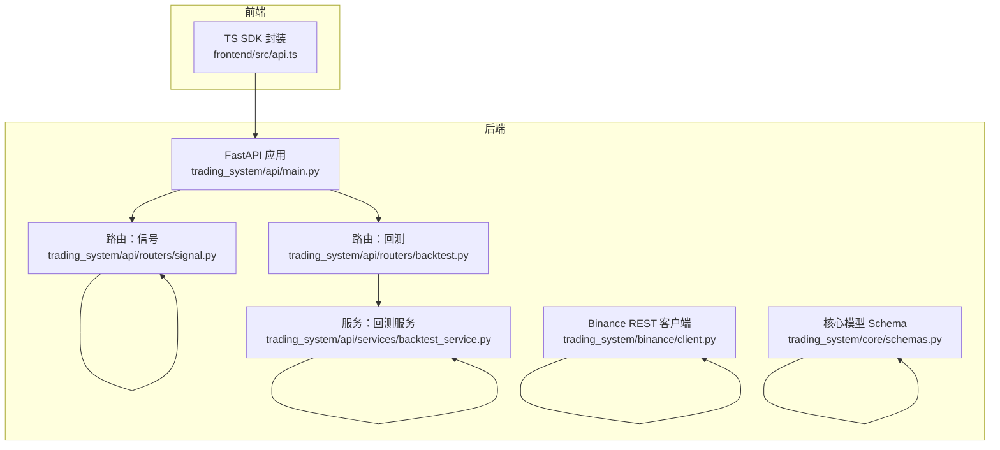
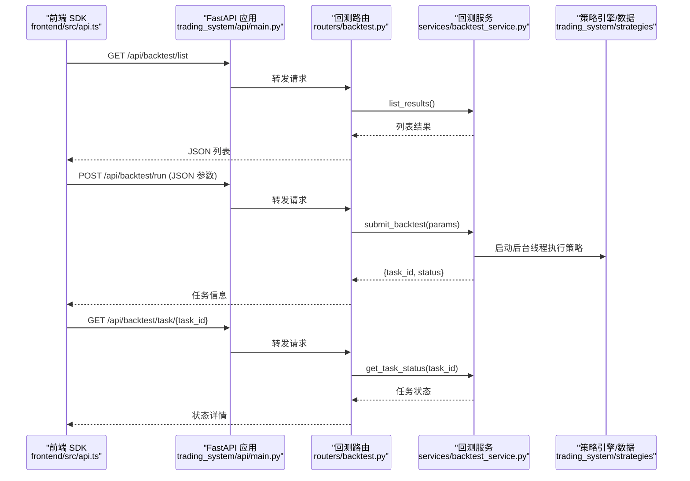
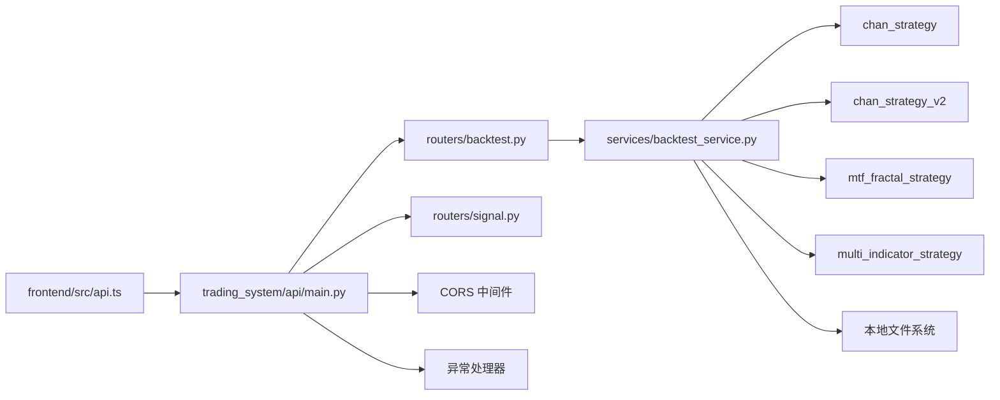

# API参考文档

<cite>
**本文档引用的文件**
- [main.py](file://main.py)
- [README.md](file://README.md)
- [requirements.txt](file://requirements.txt)
- [log_config.py](file://log_config.py)
- [trading_system/api/main.py](file://trading_system/api/main.py)
- [trading_system/api/routers/backtest.py](file://trading_system/api/routers/backtest.py)
- [trading_system/api/routers/signal.py](file://trading_system/api/routers/signal.py)
- [trading_system/api/services/backtest_service.py](file://trading_system/api/services/backtest_service.py)
- [trading_system/binance/client.py](file://trading_system/binance/client.py)
- [trading_system/core/schemas.py](file://trading_system/core/schemas.py)
- [frontend/src/api.ts](file://frontend/src/api.ts)
</cite>

## 目录
1. [简介](#简介)
2. [项目结构](#项目结构)
3. [核心组件](#核心组件)
4. [架构总览](#架构总览)
5. [详细组件分析](#详细组件分析)
6. [依赖分析](#依赖分析)
7. [性能考虑](#性能考虑)
8. [故障排除指南](#故障排除指南)
9. [结论](#结论)
10. [附录](#附录)

## 简介
本项目是一个基于 FastAPI 的交易系统后端服务，提供回测与信号分析相关的 REST API，并通过前端 TypeScript SDK 进行调用。系统支持：
- 回测任务提交、状态轮询与结果查询
- 历史数据日期范围查询
- 信号详情与综合分析
- 健康检查与全局异常处理
- CORS 支持与进程耗时头信息

同时，项目包含 Binance REST 客户端与 OKX WebSocket 示例，便于对接主流衍生品交易所。

## 项目结构
后端采用 FastAPI 应用入口，注册回测与信号两个路由模块；前端通过 fetch 封装的 api.ts 调用后端 /api 前缀接口；核心数据与策略位于 trading_system 目录下。

**图表来源**
- [trading_system/api/main.py:1-104](file://trading_system/api/main.py#L1-L104)
- [trading_system/api/routers/backtest.py:1-68](file://trading_system/api/routers/backtest.py#L1-L68)
- [trading_system/api/routers/signal.py:1-178](file://trading_system/api/routers/signal.py#L1-L178)
- [trading_system/api/services/backtest_service.py:1-289](file://trading_system/api/services/backtest_service.py#L1-L289)
- [trading_system/binance/client.py:1-342](file://trading_system/binance/client.py#L1-L342)
- [trading_system/core/schemas.py:1-88](file://trading_system/core/schemas.py#L1-L88)
- [frontend/src/api.ts:1-51](file://frontend/src/api.ts#L1-L51)

**章节来源**
- [main.py:1-13](file://main.py#L1-L13)
- [README.md:1-150](file://README.md#L1-L150)
- [trading_system/api/main.py:1-104](file://trading_system/api/main.py#L1-L104)

## 核心组件
- FastAPI 应用与中间件：CORS、异常处理器、启动事件、静态文件挂载
- 回测路由：列表、参数模板、详情、运行、任务状态、日期范围
- 信号路由：信号分类、信号详情、综合分析
- 回测服务：任务队列、参数校验、策略选择、数据加载、结果持久化
- Binance REST 客户端：下单、查询、取消、账户、K线等
- 前端 SDK：统一 BASE 路径、类型定义、请求封装

**章节来源**
- [trading_system/api/main.py:12-98](file://trading_system/api/main.py#L12-L98)
- [trading_system/api/routers/backtest.py:1-68](file://trading_system/api/routers/backtest.py#L1-L68)
- [trading_system/api/routers/signal.py:1-178](file://trading_system/api/routers/signal.py#L1-L178)
- [trading_system/api/services/backtest_service.py:1-289](file://trading_system/api/services/backtest_service.py#L1-L289)
- [trading_system/binance/client.py:1-342](file://trading_system/binance/client.py#L1-L342)
- [frontend/src/api.ts:1-51](file://frontend/src/api.ts#L1-L51)

## 架构总览
后端通过 FastAPI 提供 REST 接口，前端通过 /api 前缀访问。回测服务负责异步执行策略并写入结果文件，信号路由解析本地 JSON 并进行指标统计与汇总。

**图表来源**
- [frontend/src/api.ts:40-47](file://frontend/src/api.ts#L40-L47)
- [trading_system/api/main.py:96-97](file://trading_system/api/main.py#L96-L97)
- [trading_system/api/routers/backtest.py:27-62](file://trading_system/api/routers/backtest.py#L27-L62)
- [trading_system/api/services/backtest_service.py:58-248](file://trading_system/api/services/backtest_service.py#L58-L248)

## 详细组件分析

### 回测 API
- 基础路径：/api/backtest
- 认证：未实现鉴权中间件（开放访问）
- 速率限制：未实现
- 版本控制：应用级版本号在 FastAPI 构造函数中设置

接口定义
- GET /list
  - 功能：列出历史回测结果摘要
  - 请求参数：无
  - 响应：包含 count 与 results 的对象
  - 状态码：200
  - 错误：无特定错误处理，异常由全局异常处理器返回 500

- GET /params
  - 功能：获取回测参数模板（含类型、默认值、范围等）
  - 请求参数：无
  - 响应：参数模板对象
  - 状态码：200

- GET /{backtest_id}
  - 功能：获取单次回测完整结果
  - 请求参数：backtest_id（路径参数）
  - 响应：完整回测结果 JSON
  - 状态码：200 或 404（未找到）

- POST /run
  - 功能：提交回测任务
  - 请求体：BacktestRequest（见下方模型）
  - 响应：{task_id: string, status: string}
  - 状态码：200 或 500（异常）

- GET /task/{task_id}
  - 功能：查询回测任务状态
  - 请求参数：task_id（路径参数）
  - 响应：任务状态对象（包含 status、progress、result、error）
  - 状态码：200 或 404（未找到）

- GET /data/daterange
  - 功能：查询可用历史数据的日期范围
  - 请求参数：无
  - 响应：{start: string|null, end: string|null} 或错误信息
  - 状态码：200

请求参数模型（BacktestRequest）
- 字段与默认值
  - symbol: 字符串，默认 ETHUSDC
  - interval: 字符串，默认 4h
  - initial_balance: 数值，默认 10000
  - commission: 数值，默认 0.001
  - slippage: 数值，默认 0.0005
  - leverage: 整数，默认 10
  - investment_ratio: 数值，默认 0.5
  - start_date: 字符串（可选）
  - end_date: 字符串（可选）
  - strategy_version: 字符串，默认 mtf，可选 v1/v2/mtf/multi_indicator
  - enable_early_entry: 布尔，默认 true
  - enable_early_short_entry: 布尔，默认 true
  - early_entry_min_confidence: 数值，默认 0.6
  - min_early_entry_conditions: 整数，默认 2
  - use_live_data: 布尔，默认 false

响应格式
- 列表响应：{"count": number, "results": [...]}
- 任务状态：{"status": "pending|running|completed|failed", "progress": number, "result": object|null, "error": string|null}
- 参数模板：键为参数名，值包含 type、default、options/min/max/step 等

状态码
- 200：成功
- 404：资源不存在
- 500：服务器内部错误（全局异常）

错误处理
- 全局异常处理器返回统一错误结构
- HTTP 异常处理器返回带 message 的 JSON

调用示例（前端 SDK）
- 列表：api.listBacktests()
- 详情：api.getBacktest(id)
- 运行：api.runBacktest(params)
- 任务状态：api.getTaskStatus(taskId)
- 参数模板：api.getParams()
- 日期范围：api.getDaterange()

最佳实践
- 使用 GET /task/{task_id} 轮询任务状态，避免阻塞
- 在 use_live_data=true 时确保网络可达且有足够磁盘空间
- 对于多周期策略（strategy_version=mtf），确保 4h/30m/15m/1d 数据齐全

**章节来源**
- [trading_system/api/routers/backtest.py:1-68](file://trading_system/api/routers/backtest.py#L1-L68)
- [trading_system/api/services/backtest_service.py:1-289](file://trading_system/api/services/backtest_service.py#L1-L289)
- [frontend/src/api.ts:40-47](file://frontend/src/api.ts#L40-L47)
- [trading_system/api/main.py:33-55](file://trading_system/api/main.py#L33-L55)

### 信号 API
- 基础路径：/api/signal
- 认证：未实现鉴权中间件（开放访问）
- 速率限制：未实现
- 版本控制：应用级版本号在 FastAPI 构造函数中设置

接口定义
- GET /categories
  - 功能：获取信号分类映射（中文类型与颜色）
  - 请求参数：无
  - 响应：分类映射对象
  - 状态码：200

- GET /detail/{backtest_id}
  - 功能：获取回测中每笔交易的信号详情，解析指标依据与价格引用
  - 请求参数：backtest_id（路径参数）
  - 响应：包含 enriched_trades、indicator_stats、summary 等
  - 状态码：200 或 404（未找到）

- GET /analysis/{backtest_id}
  - 功能：获取综合信号分析（盈亏分布、动作统计、指标统计前3）
  - 请求参数：backtest_id（路径参数）
  - 响应：包含 profit_distribution、action_stats、indicator_stats、top_indicators
  - 状态码：200 或 404（未找到）

响应格式
- 信号详情：包含 enriched_trades（含 indicators、price_refs、index）、indicator_stats（按级别聚合）、summary（动作统计）
- 综合分析：包含盈亏分布统计、动作统计（含平均利润）、指标统计前3

调用示例（前端 SDK）
- 信号详情：api.getSignalDetail(id)
- 信号分析：api.getSignalAnalysis(id)

最佳实践
- 信号详情会解析 reason 字段并提取指标类别，建议结合 categories 接口理解含义
- 综合分析可用于快速评估策略表现与关键信号类型权重

**章节来源**
- [trading_system/api/routers/signal.py:1-178](file://trading_system/api/routers/signal.py#L1-L178)
- [frontend/src/api.ts:49-50](file://frontend/src/api.ts#L49-L50)

### 健康检查与根端点
- GET /
  - 功能：根端点，返回服务状态与文档链接
  - 响应：{"message": "...", "docs": "/docs"}
  - 状态码：200

- GET /health
  - 功能：健康检查，验证数据库连接
  - 响应：{"status": "healthy", "database": "connected"} 或异常详情
  - 状态码：200 或 503（数据库断开）

**章节来源**
- [trading_system/api/main.py:69-87](file://trading_system/api/main.py#L69-L87)

### Binance REST 客户端
- 功能：封装 Binance UMFutures SDK，提供下单、查询、取消、账户、K线等异步接口
- 认证：通过构造函数传入 API Key/Secret 或使用配置文件
- 模式：is_simulated=true 使用测试网，否则使用正式网
- 主要接口
  - place_order(symbol, side, position_side, order_type, quantity, price?, time_in_force?)
  - get_order(symbol, order_id?, orig_client_order_id?)
  - cancel_order(symbol, order_id?, orig_client_order_id?)
  - get_account()
  - get_positions(symbol?)
  - get_exchange_info()
  - get_continuous_klines(pair, contractType?, interval?, startTime?, endTime?, limit?)
  - get_spot_klines(symbol, contractType?, interval?, startTime?, endTime?, limit?)

注意
- 所有方法均返回字典，异常时包含 error/msg 字段
- K线接口支持 limit 最大 1500（根据实现注释）

**章节来源**
- [trading_system/binance/client.py:1-342](file://trading_system/binance/client.py#L1-L342)

### 核心模型（Pydantic）
- TradingOrderBase/Create/Update/Response：订单基础、创建、更新、响应模型
- TradeRecordBase/Create/Response：成交记录基础、创建、响应模型
- PositionBase/Create/Update/Response：持仓基础、创建、更新、响应模型

用途
- 作为后端数据传输与校验的基础模型，确保请求/响应结构一致

**章节来源**
- [trading_system/core/schemas.py:1-88](file://trading_system/core/schemas.py#L1-L88)

## 依赖分析
- FastAPI 应用依赖
  - 路由器：backtest、signal
  - 数据库初始化：on startup
  - CORS 中间件：允许跨域
  - 异常处理：全局异常与 HTTP 异常
- 回测服务依赖
  - 多策略引擎：chan_strategy、chan_strategy_v2、mtf_fractal_strategy、multi_indicator_strategy
  - 数据管理：BacktestDataManager（仅在 use_live_data=true 时）
  - 本地文件系统：读写回测结果 JSON
- 前端依赖
  - fetch 包装的 api.ts，统一 BASE=/api

**图表来源**
- [frontend/src/api.ts:1-51](file://frontend/src/api.ts#L1-L51)
- [trading_system/api/main.py:14-21](file://trading_system/api/main.py#L14-L21)
- [trading_system/api/routers/backtest.py:1-6](file://trading_system/api/routers/backtest.py#L1-L6)
- [trading_system/api/routers/signal.py:1-6](file://trading_system/api/routers/signal.py#L1-L6)
- [trading_system/api/services/backtest_service.py:74-225](file://trading_system/api/services/backtest_service.py#L74-L225)

**章节来源**
- [requirements.txt:1-64](file://requirements.txt#L1-L64)
- [README.md:135-142](file://README.md#L135-L142)

## 性能考虑
- 异步与并发
  - 回测任务以守护线程执行，避免阻塞主进程
  - Binance 客户端使用线程池执行同步 SDK 调用
- I/O 优化
  - 回测结果以 JSON 文件持久化，减少内存占用
  - K线接口限制 limit 最大 1500，避免一次性拉取过多数据
- 前端请求
  - 建议使用 GET /task/{task_id} 轮询任务状态，避免频繁请求
  - 对高频数据接口（如 K线）建议前端缓存与分页

[本节为通用指导，不直接分析具体文件]

## 故障排除指南
- 500 内部错误
  - 触发条件：未捕获异常
  - 处理建议：查看后端日志，定位异常堆栈
- 503 健康检查失败
  - 触发条件：数据库连接失败
  - 处理建议：检查 DATABASE_URL、数据库服务状态
- 404 资源不存在
  - 触发条件：回测结果或任务 ID 无效
  - 处理建议：确认任务是否已提交且未过期
- CORS 问题
  - 触发条件：浏览器跨域请求被拒绝
  - 处理建议：确认允许的 origins/methods/headers
- 日志
  - 使用统一日志配置，可在控制台与文件输出日志

**章节来源**
- [trading_system/api/main.py:33-55](file://trading_system/api/main.py#L33-L55)
- [trading_system/api/main.py:75-87](file://trading_system/api/main.py#L75-L87)
- [log_config.py:1-74](file://log_config.py#L1-L74)

## 结论
本项目提供了清晰的回测与信号分析 API，配合前端 SDK 可快速集成。建议后续增强：
- 认证与授权（如 JWT/Basic）
- 速率限制与配额管理
- API 文档自动生成（Swagger/ReDoc 已内置）
- 健壮性与可观测性（指标、链路追踪）

[本节为总结性内容，不直接分析具体文件]

## 附录

### WebSocket API（OKX）
- 连接处理
  - 支持实盘与模拟盘，登录认证后订阅频道
- 消息格式
  - 订阅回调接收标准 OKX WebSocket 数据结构
- 实时交互模式
  - 订阅 tickers 等频道，接收推送数据
  - 可在登录后执行下单等操作
- 限速控制
  - 提供限速工具模块（路径在仓库中存在但当前未在 API 层使用）

**章节来源**
- [README.md:100-133](file://README.md#L100-L133)

### SDK 使用指南（前端）
- 基础路径：BASE = '/api'
- 类型定义：BacktestSummary、BacktestDetail、TradeRecord、SignalDetail
- 方法
  - listBacktests(): 获取回测列表
  - getBacktest(id): 获取回测详情
  - runBacktest(params): 提交回测任务
  - getTaskStatus(taskId): 查询任务状态
  - getParams(): 获取参数模板
  - getDaterange(): 获取日期范围
  - getSignalDetail(id): 获取信号详情
  - getSignalAnalysis(id): 获取信号分析

最佳实践
- 使用 try/catch 捕获 HTTP 错误
- 对任务状态轮询设置合理间隔
- 对日期范围与参数模板进行前端校验

**章节来源**
- [frontend/src/api.ts:1-51](file://frontend/src/api.ts#L1-L51)

### API 版本控制、速率限制与安全
- 版本控制
  - 应用级版本号：在 FastAPI 构造函数中设置
- 速率限制
  - 当前未实现
- 安全
  - 当前未实现鉴权中间件
  - 建议增加认证与授权机制（如 API Key、JWT）

**章节来源**
- [trading_system/api/main.py:12-21](file://trading_system/api/main.py#L12-L21)