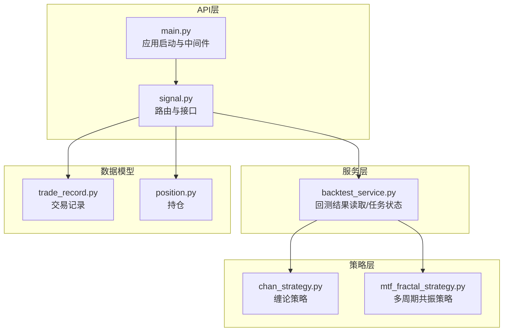
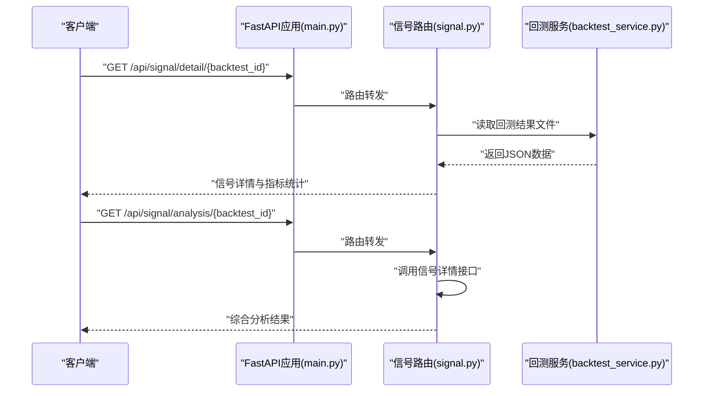
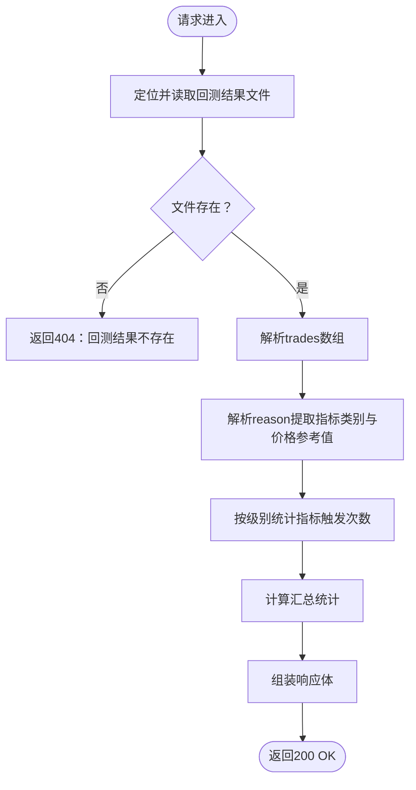
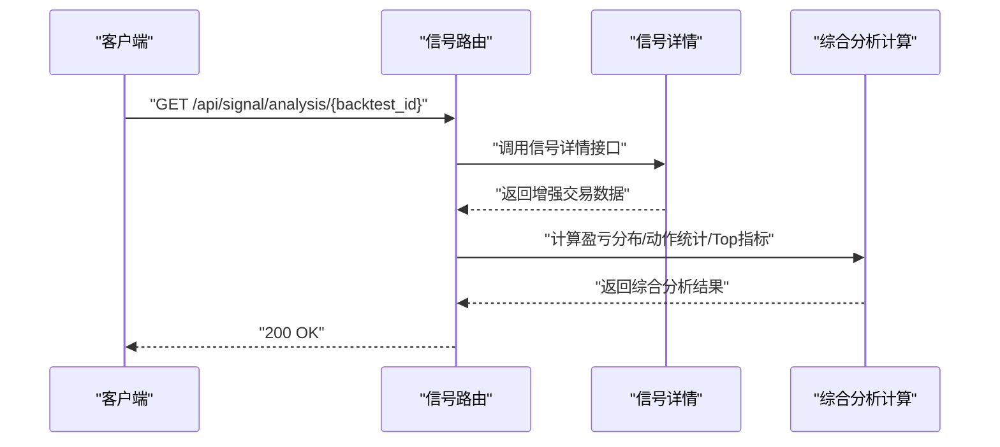
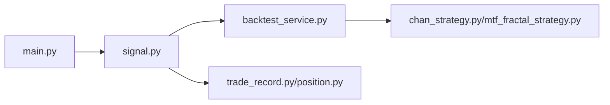

# 信号分析API

<cite>
**本文档引用的文件**
- [signal.py](file://trading_system/api/routers/signal.py)
- [main.py](file://trading_system/api/main.py)
- [backtest_service.py](file://trading_system/api/services/backtest_service.py)
- [chan_strategy.py](file://trading_system/strategies/chan_strategy.py)
- [mtf_fractal_strategy.py](file://trading_system/strategies/mtf_fractal_strategy.py)
- [trade_record.py](file://trading_system/models/trade_record.py)
- [position.py](file://trading_system/models/position.py)
</cite>

## 目录
1. [简介](#简介)
2. [项目结构](#项目结构)
3. [核心组件](#核心组件)
4. [架构总览](#架构总览)
5. [详细组件分析](#详细组件分析)
6. [依赖分析](#依赖分析)
7. [性能考虑](#性能考虑)
8. [故障排除指南](#故障排除指南)
9. [结论](#结论)

## 简介
本文件面向信号分析API的使用者与维护者，系统性说明与回测结果相关的RESTful接口，重点覆盖：
- GET /api/signal/detail/{backtest_id}：获取信号详情与指标解析
- GET /api/signal/analysis/{backtest_id}：获取综合信号分析结果

内容涵盖请求参数、响应格式、HTTP状态码、错误处理、信号数据结构、分析指标含义、返回数据解释与使用示例，并结合策略实现解释信号生成逻辑与技术分析原理。

## 项目结构
围绕信号分析API的关键文件组织如下：
- API路由层：提供HTTP接口与业务入口
- 服务层：封装回测结果读取与任务状态管理
- 策略层：提供缠论与多周期共振策略的信号生成与技术分析基础
- 数据模型：交易记录与持仓模型（用于理解交易维度）

**图表来源**
- [signal.py:1-178](file://trading_system/api/routers/signal.py#L1-L178)
- [main.py:1-104](file://trading_system/api/main.py#L1-L104)
- [backtest_service.py:1-289](file://trading_system/api/services/backtest_service.py#L1-L289)
- [chan_strategy.py:1-800](file://trading_system/strategies/chan_strategy.py#L1-L800)
- [mtf_fractal_strategy.py:1-800](file://trading_system/strategies/mtf_fractal_strategy.py#L1-L800)
- [trade_record.py:1-22](file://trading_system/models/trade_record.py#L1-L22)
- [position.py:1-18](file://trading_system/models/position.py#L1-L18)

**章节来源**
- [signal.py:1-178](file://trading_system/api/routers/signal.py#L1-L178)
- [main.py:1-104](file://trading_system/api/main.py#L1-L104)

## 核心组件
- 信号路由模块：提供信号详情与综合分析接口，负责解析回测结果文件、抽取信号指标、统计分析与聚合返回。
- 主应用模块：注册路由、配置CORS与全局异常处理、提供健康检查与静态资源挂载。
- 回测服务模块：提供回测结果文件读取、模糊匹配、任务状态查询与参数模板。
- 策略模块：缠论策略与多周期共振策略，提供分型、笔、线段、MACD背离、K线形态等技术分析基础，这些是信号生成与解释的重要依据。

**章节来源**
- [signal.py:1-178](file://trading_system/api/routers/signal.py#L1-L178)
- [main.py:1-104](file://trading_system/api/main.py#L1-L104)
- [backtest_service.py:1-289](file://trading_system/api/services/backtest_service.py#L1-L289)
- [chan_strategy.py:1-800](file://trading_system/strategies/chan_strategy.py#L1-L800)
- [mtf_fractal_strategy.py:1-800](file://trading_system/strategies/mtf_fractal_strategy.py#L1-L800)

## 架构总览
信号分析API的调用链路如下：

**图表来源**
- [main.py:95-97](file://trading_system/api/main.py#L95-L97)
- [signal.py:31-131](file://trading_system/api/routers/signal.py#L31-L131)
- [signal.py:134-178](file://trading_system/api/routers/signal.py#L134-L178)
- [backtest_service.py:45-55](file://trading_system/api/services/backtest_service.py#L45-L55)

## 详细组件分析

### 接口概览
- GET /api/signal/detail/{backtest_id}
  - 功能：获取回测中每笔交易的信号详情，解析reason字段提取技术指标类别，统计指标触发频率，并提供汇总统计。
  - 请求参数：backtest_id（字符串，路径参数）
  - 响应：包含backtest_id、总交易数、信号明细数组、指标统计、汇总统计等字段
  - 错误：当回测结果文件不存在时返回404
- GET /api/signal/analysis/{backtest_id}
  - 功能：在信号详情基础上，进一步计算盈亏分布、按信号类型统计、Top指标等综合分析结果
  - 请求参数：backtest_id（字符串，路径参数）
  - 响应：包含backtest_id、盈亏分布、动作统计、指标统计、Top指标等字段
  - 错误：当回测结果文件不存在时返回404

**章节来源**
- [signal.py:31-131](file://trading_system/api/routers/signal.py#L31-L131)
- [signal.py:134-178](file://trading_system/api/routers/signal.py#L134-L178)

### 信号详情接口（GET /api/signal/detail/{backtest_id}）
- 输入参数
  - backtest_id：回测任务标识符，用于定位回测结果文件
- 处理流程
  - 定位回测结果文件（精确匹配或模糊匹配）
  - 读取trades数组，逐条解析reason字段，提取技术指标类别（如分型结构、支撑/阻力区、多周期共振、背驰、K3确认、趋势过滤、成交量过滤、MACD/KDJ交叉、动量、蜡烛形态、趋势线/盘整突破、反手、提前入场等）
  - 提取价格参考值（从reason中解析数字）
  - 统计各指标在不同级别（4h_level、30m_level、15m_level、daily_level）的触发次数并按频次排序
  - 计算汇总统计（买入信号数、卖出信号数、盈利交易数、亏损交易数）
- 输出结构
  - backtest_id：回测ID
  - total_trades：总交易数
  - enriched_trades：每笔交易的增强详情（包含原始交易字段、indicators、price_refs、index）
  - indicator_stats：指标统计（按级别分组）
  - summary：汇总统计
- 错误处理
  - 文件不存在：抛出404异常

**图表来源**
- [signal.py:31-131](file://trading_system/api/routers/signal.py#L31-L131)

**章节来源**
- [signal.py:31-131](file://trading_system/api/routers/signal.py#L31-L131)

### 综合分析接口（GET /api/signal/analysis/{backtest_id}）
- 输入参数
  - backtest_id：回测任务标识符
- 处理流程
  - 调用信号详情接口获取增强后的交易数据
  - 计算盈亏分布（最大赢/亏、平均赢/亏、胜/负次数、胜率）
  - 按信号动作类型统计（计数、总利润、平均利润）
  - 提取Top指标（按级别取频次最高的前3项）
- 输出结构
  - backtest_id：回测ID
  - profit_distribution：盈亏分布统计
  - action_stats：按动作类型的统计
  - indicator_stats：指标统计
  - top_indicators：各级别的Top指标列表
- 错误处理
  - 委托信号详情接口处理404

**图表来源**
- [signal.py:134-178](file://trading_system/api/routers/signal.py#L134-L178)
- [signal.py:137-137](file://trading_system/api/routers/signal.py#L137-L137)

**章节来源**
- [signal.py:134-178](file://trading_system/api/routers/signal.py#L134-L178)

### 信号数据结构说明
- 交易记录字段（来自回测结果文件）
  - action：交易动作（如BUY/SELL等）
  - reason：信号生成理由（包含技术指标关键词）
  - profit：该笔交易的利润（数值）
  - 其他：由回测引擎写入的字段（如时间戳、价格等）
- 增强字段（由信号详情接口添加）
  - indicators：按级别（4h_level、30m_level、15m_level、daily_level）归类的技术指标集合
  - price_refs：从reason中解析的价格参考值（最多取最后3个）
  - index：该交易在trades数组中的索引
- 汇总统计字段
  - buy_signals：买入信号数量
  - sell_signals：卖出信号数量
  - profit_trades：盈利交易数量
  - loss_trades：亏损交易数量

**章节来源**
- [signal.py:46-131](file://trading_system/api/routers/signal.py#L46-L131)

### 分析指标含义与技术原理
- 指标类别与来源
  - 分型结构：来自缠论策略的底分型/顶分型识别
  - 支撑/阻力区：来自4小时级别支撑/阻力位检测
  - 多周期共振：来自多周期共振策略的均线/形态共振
  - 背驰：MACD背离（一买/二买、一卖/二卖）
  - K3确认加仓：多周期共振策略的K3确认逻辑
  - 止损/止盈触发：风控与止盈逻辑
  - 趋势过滤：日线/EMA趋势过滤
  - 成交量过滤：成交量/缩量过滤
  - MACD/KDJ交叉：30分钟级别动量指标交叉
  - 做多/做空动量：30分钟级别动量信号
  - 蜡烛形态：吞没、锤子、星等形态
  - 趋势线/盘整突破：趋势线与盘整突破
  - 反手/提前入场：策略特有信号类型
- 技术原理参考
  - 缠论：分型、笔、线段、MACD面积背驰
  - 多周期共振：4小时底分型+30分钟确认+15分钟提前入场
  - 动量与形态：MACD/KDJ交叉、蜡烛形态、成交量过滤

**章节来源**
- [chan_strategy.py:16-129](file://trading_system/strategies/chan_strategy.py#L16-L129)
- [mtf_fractal_strategy.py:1-120](file://trading_system/strategies/mtf_fractal_strategy.py#L1-L120)

### 返回数据详细解释与使用示例
- 信号详情返回示例字段
  - backtest_id：回测ID
  - total_trades：总交易数
  - enriched_trades：每笔交易的增强详情（包含indicators与price_refs）
  - indicator_stats：各级别指标触发频次（按频次降序）
  - summary：汇总统计（买入/卖出/盈利/亏损）
- 综合分析返回示例字段
  - profit_distribution：最大赢/亏、平均赢/亏、胜/负次数、胜率
  - action_stats：按动作类型统计（计数/总利润/平均利润）
  - indicator_stats：指标统计
  - top_indicators：各级别Top指标列表
- 使用建议
  - 通过indicator_stats与top_indicators评估策略信号质量与稳定性
  - 通过profit_distribution与action_stats评估收益与风险特征
  - 结合reason与price_refs理解每笔信号的触发背景

**章节来源**
- [signal.py:120-178](file://trading_system/api/routers/signal.py#L120-L178)

### 信号生成逻辑与解读
- 缠论策略（ChanStrategy）
  - 识别分型、构建笔与线段，计算MACD与均线，通过MACD面积判断背驰，结合趋势过滤生成信号
- 多周期共振策略（MultiTFFractalStrategy）
  - 4小时底分型K1/K2+30分钟确认+15分钟提前入场，满足条件触发试探性入场与确认加仓
- 信号解读要点
  - 指标类别越丰富、频次越高，通常意味着信号具备更强的技术支持
  - 盈亏分布与胜率反映策略的风险收益特征
  - price_refs有助于复核信号生成时的价格参考点

**章节来源**
- [chan_strategy.py:102-241](file://trading_system/strategies/chan_strategy.py#L102-L241)
- [mtf_fractal_strategy.py:85-232](file://trading_system/strategies/mtf_fractal_strategy.py#L85-L232)

## 依赖分析
- 组件耦合
  - 信号路由依赖回测服务进行结果文件读取
  - 信号详情接口内部调用自身以复用解析与统计逻辑
  - 主应用注册路由并提供CORS与异常处理
- 外部依赖
  - FastAPI框架、Python标准库、pandas（用于数据处理，间接影响性能）
- 潜在循环依赖
  - 未发现循环导入；模块职责清晰

**图表来源**
- [main.py:95-97](file://trading_system/api/main.py#L95-L97)
- [signal.py:1-178](file://trading_system/api/routers/signal.py#L1-L178)
- [backtest_service.py:1-289](file://trading_system/api/services/backtest_service.py#L1-L289)
- [chan_strategy.py:1-800](file://trading_system/strategies/chan_strategy.py#L1-L800)
- [mtf_fractal_strategy.py:1-800](file://trading_system/strategies/mtf_fractal_strategy.py#L1-L800)
- [trade_record.py:1-22](file://trading_system/models/trade_record.py#L1-L22)
- [position.py:1-18](file://trading_system/models/position.py#L1-L18)

**章节来源**
- [main.py:95-97](file://trading_system/api/main.py#L95-L97)
- [signal.py:1-178](file://trading_system/api/routers/signal.py#L1-L178)
- [backtest_service.py:1-289](file://trading_system/api/services/backtest_service.py#L1-L289)

## 性能考虑
- 文件I/O
  - 信号详情接口需读取回测结果JSON文件；建议确保文件路径正确与权限充足
- 字符串解析
  - reason字段解析与正则匹配可能随交易量增大而增加CPU开销；可通过批量处理优化
- 数据规模
  - indicator_stats与action_stats的统计在交易量较大时需注意内存占用；建议分页或流式处理
- 并发与缓存
  - 可考虑对热点回测结果进行缓存以减少重复解析

## 故障排除指南
- 404 Not Found
  - 现象：请求回测详情或分析时返回404
  - 原因：回测结果文件不存在或文件名不匹配
  - 处理：确认backtest_id正确，检查回测结果文件是否生成
- 500 Internal Server Error
  - 现象：服务器异常
  - 原因：未捕获异常或文件读取失败
  - 处理：查看服务端日志，确认文件编码与格式正确
- 响应异常
  - 现象：返回数据结构异常
  - 原因：回测结果文件格式不符合预期
  - 处理：校验回测输出格式，确保trades字段存在且为数组

**章节来源**
- [signal.py:40-41](file://trading_system/api/routers/signal.py#L40-L41)
- [main.py:33-55](file://trading_system/api/main.py#L33-L55)

## 结论
信号分析API提供了从回测结果中抽取信号细节与综合统计的能力，结合缠论与多周期共振策略的技术分析原理，能够帮助用户深入理解信号生成逻辑与策略表现。建议在生产环境中关注文件路径一致性、数据格式规范与性能优化，以确保接口稳定高效地服务于策略评估与回测分析。