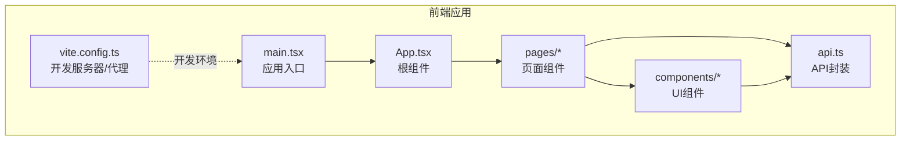
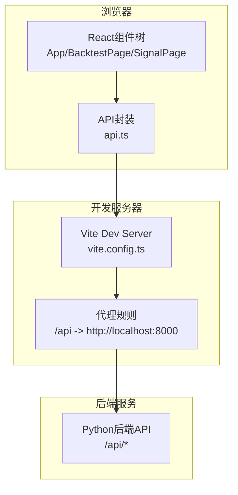
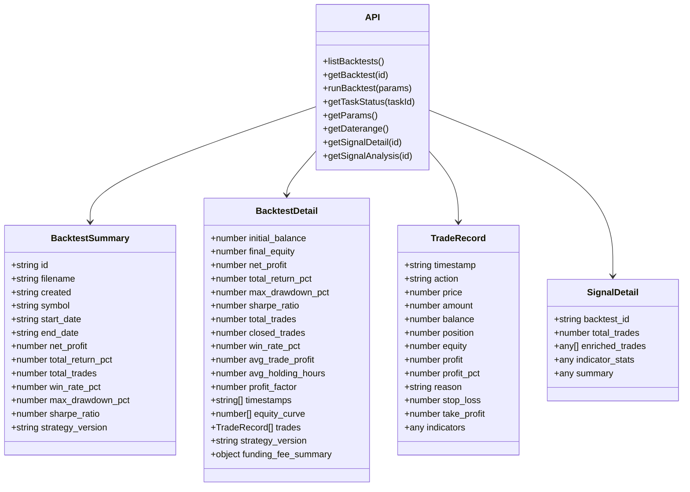
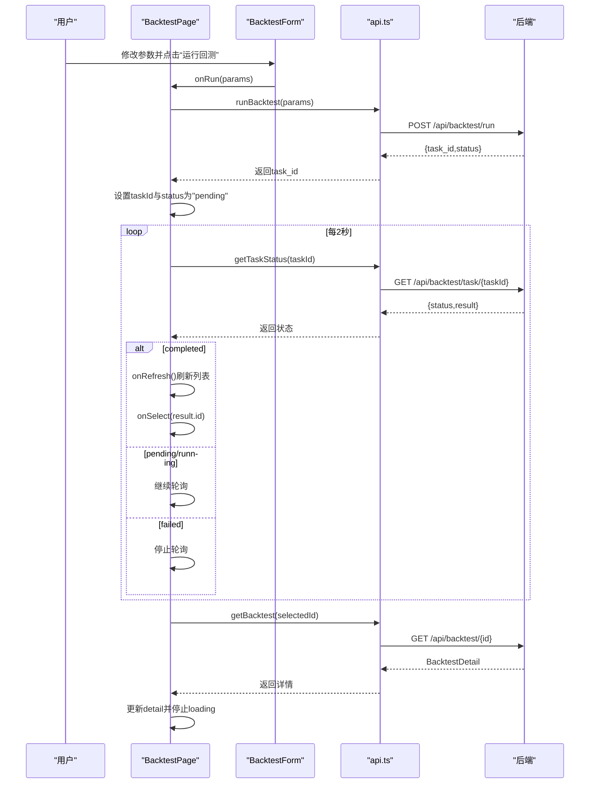
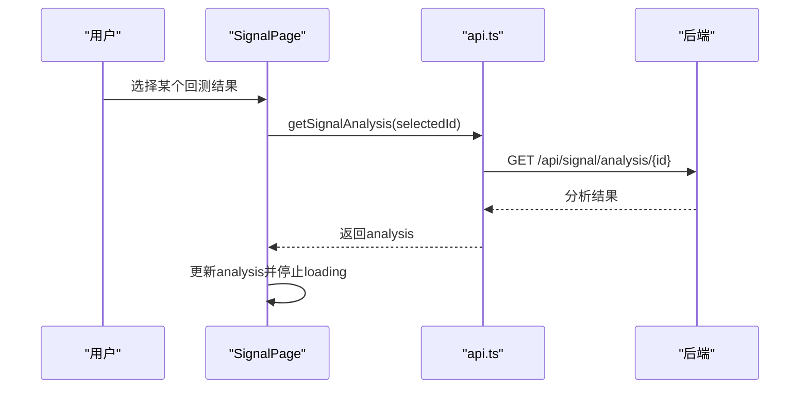
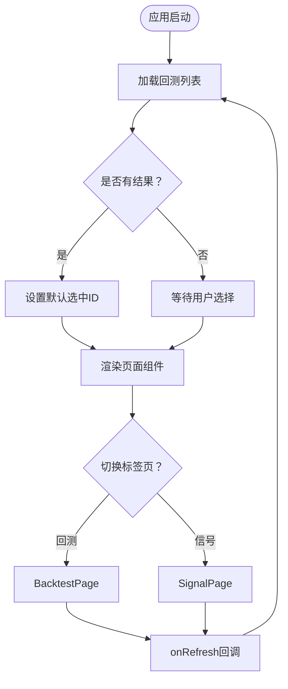
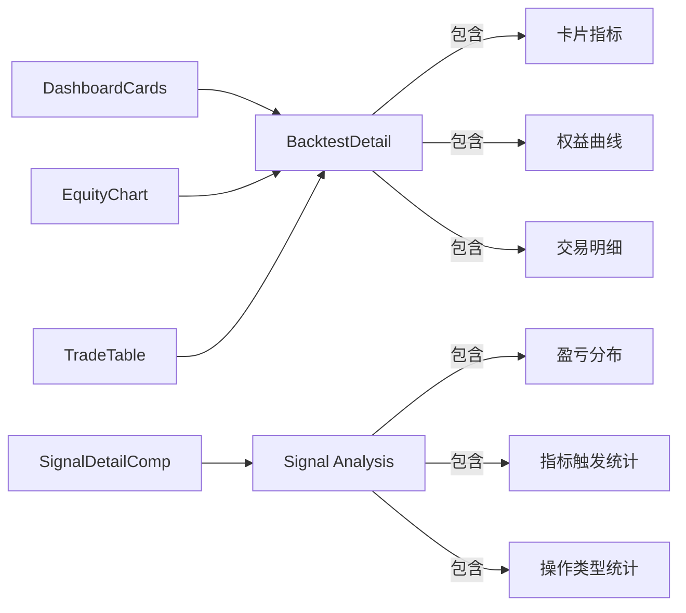
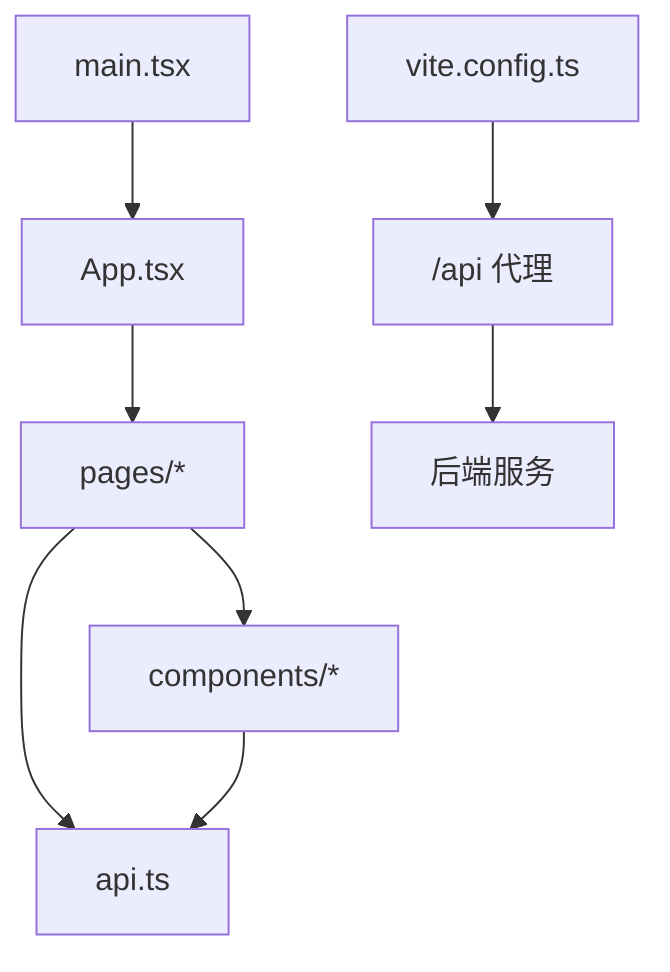

# 前端API集成

<cite>
**本文档引用的文件**
- [api.ts](file://frontend/src/api.ts)
- [App.tsx](file://frontend/src/App.tsx)
- [BacktestPage.tsx](file://frontend/src/pages/BacktestPage.tsx)
- [SignalPage.tsx](file://frontend/src/pages/SignalPage.tsx)
- [BacktestForm.tsx](file://frontend/src/components/BacktestForm.tsx)
- [DashboardCards.tsx](file://frontend/src/components/DashboardCards.tsx)
- [EquityChart.tsx](file://frontend/src/components/EquityChart.tsx)
- [SignalDetail.tsx](file://frontend/src/components/SignalDetail.tsx)
- [TradeTable.tsx](file://frontend/src/components/TradeTable.tsx)
- [main.tsx](file://frontend/src/main.tsx)
- [vite.config.ts](file://frontend/vite.config.ts)
- [package.json](file://frontend/package.json)
</cite>

## 目录
1. [引言](#引言)
2. [项目结构](#项目结构)
3. [核心组件](#核心组件)
4. [架构概览](#架构概览)
5. [详细组件分析](#详细组件分析)
6. [依赖关系分析](#依赖关系分析)
7. [性能考虑](#性能考虑)
8. [故障排除指南](#故障排除指南)
9. [结论](#结论)
10. [附录](#附录)

## 引言
本文件面向前端开发者，系统性阐述前端与后端API的集成方案。重点覆盖以下方面：
- API封装与调用：基于统一请求器的API模块设计
- 错误处理机制：网络异常、业务错误与用户提示
- 状态管理：组件内状态、全局状态与跨组件通信
- 页面组件集成：回测面板与信号分析页面的数据流
- 加载状态与错误提示：用户体验与反馈机制
- 完整集成示例：从表单到图表的完整调用链路
- 最佳实践：缓存策略、轮询控制与性能优化
- 路由与数据流：组件间通信与数据传递

## 项目结构
前端采用Vite + React + TypeScript构建，核心目录组织如下：
- src/api.ts：统一API封装与类型定义
- src/pages/*：页面级组件（BacktestPage、SignalPage）
- src/components/*：可复用UI组件（BacktestForm、DashboardCards、EquityChart、SignalDetail、TradeTable）
- vite.config.ts：开发服务器与代理配置
- package.json：依赖与脚本配置

**图示来源**
- [main.tsx:1-5](file://frontend/src/main.tsx#L1-L5)
- [App.tsx:1-50](file://frontend/src/App.tsx#L1-L50)
- [api.ts:1-51](file://frontend/src/api.ts#L1-L51)
- [vite.config.ts:1-11](file://frontend/vite.config.ts#L1-L11)

**章节来源**
- [main.tsx:1-5](file://frontend/src/main.tsx#L1-L5)
- [package.json:1-22](file://frontend/package.json#L1-L22)
- [vite.config.ts:1-11](file://frontend/vite.config.ts#L1-L11)

## 核心组件
本节聚焦API封装层与关键页面组件，阐明其职责与协作方式。

- API封装层（api.ts）
  - 统一基础路径与请求器：以/base路径拼接相对URL，统一fetch调用与错误抛出
  - 类型定义：BacktestSummary、BacktestDetail、TradeRecord、SignalDetail等
  - API方法：列表查询、详情获取、回测执行、任务状态轮询、参数与日期范围获取、信号详情与分析

- 根组件（App.tsx）
  - 状态管理：当前标签页、回测结果列表、选中ID、加载状态
  - 生命周期：首次加载回测列表；提供刷新回调给子页面使用
  - 视图切换：根据tab在回测面板与信号分析之间切换

- 回测页面（BacktestPage.tsx）
  - 数据获取：按选中ID拉取回测详情
  - 任务轮询：监听任务状态变化，完成后刷新列表并更新选中ID
  - 表单集成：接收参数并触发回测执行
  - 可视化：仪表盘卡片、权益曲线图、交易明细表

- 信号页面（SignalPage.tsx）
  - 数据获取：按选中ID拉取信号分析
  - 视图渲染：信号详情组件展示分析结果

**章节来源**
- [api.ts:1-51](file://frontend/src/api.ts#L1-L51)
- [App.tsx:1-50](file://frontend/src/App.tsx#L1-L50)
- [BacktestPage.tsx:1-94](file://frontend/src/pages/BacktestPage.tsx#L1-L94)
- [SignalPage.tsx:1-39](file://frontend/src/pages/SignalPage.tsx#L1-L39)

## 架构概览
前端通过Vite开发服务器代理/api请求至后端服务，页面组件通过API封装层发起HTTP请求，组件内部维护本地状态并驱动UI更新。

**图示来源**
- [vite.config.ts:5-10](file://frontend/vite.config.ts#L5-L10)
- [api.ts:1-7](file://frontend/src/api.ts#L1-L7)

## 详细组件分析

### API封装层（api.ts）
- 设计要点
  - 单一请求器：统一处理响应状态与JSON解析
  - 接口契约：明确返回类型，便于上层组件类型安全使用
  - 方法集合：围绕回测与信号分析的核心接口进行封装
- 关键接口
  - 列表查询：获取回测摘要列表
  - 详情获取：按ID获取回测详情
  - 回测执行：提交参数并返回任务ID
  - 任务状态：轮询获取任务执行状态
  - 参数与日期范围：获取默认参数与可用日期范围
  - 信号分析：获取信号分析结果

**图示来源**
- [api.ts:9-38](file://frontend/src/api.ts#L9-L38)
- [api.ts:40-51](file://frontend/src/api.ts#L40-L51)

**章节来源**
- [api.ts:1-51](file://frontend/src/api.ts#L1-L51)

### 回测页面（BacktestPage.tsx）
- 数据流
  - 选中ID变更 → 拉取回测详情 → 渲染仪表盘、图表与交易表
  - 提交表单 → 启动回测任务 → 轮询任务状态 → 成功后刷新列表并更新选中ID
- 状态管理
  - detail：回测详情对象
  - loading：详情加载状态
  - taskId/taskStatus：任务轮询状态
- 错误处理
  - 详情获取失败时打印错误
  - 任务轮询异常时静默处理，避免中断轮询
  - 启动失败弹窗提示

**图示来源**
- [BacktestPage.tsx:21-51](file://frontend/src/pages/BacktestPage.tsx#L21-L51)
- [BacktestForm.tsx:9-145](file://frontend/src/components/BacktestForm.tsx#L9-L145)
- [api.ts:40-51](file://frontend/src/api.ts#L40-L51)

**章节来源**
- [BacktestPage.tsx:1-94](file://frontend/src/pages/BacktestPage.tsx#L1-L94)
- [BacktestForm.tsx:1-145](file://frontend/src/components/BacktestForm.tsx#L1-L145)

### 信号页面（SignalPage.tsx）
- 数据流
  - 选中ID变更 → 拉取信号分析 → 渲染信号详情组件
- 状态管理
  - analysis：信号分析对象
  - loading：分析加载状态
- 错误处理
  - 获取失败时打印错误

**图示来源**
- [SignalPage.tsx:11-19](file://frontend/src/pages/SignalPage.tsx#L11-L19)
- [api.ts:40-51](file://frontend/src/api.ts#L40-L51)

**章节来源**
- [SignalPage.tsx:1-39](file://frontend/src/pages/SignalPage.tsx#L1-L39)

### 根组件（App.tsx）
- 职责
  - 管理全局tab状态与回测列表
  - 首次加载列表并提供刷新回调
  - 将选中ID与刷新逻辑传递给子页面
- 状态
  - tab：'backtest' 或 'signal'
  - results：BacktestSummary数组
  - selectedId：当前选中的回测ID
  - loading：列表加载状态

**图示来源**
- [App.tsx:12-26](file://frontend/src/App.tsx#L12-L26)
- [App.tsx:28-47](file://frontend/src/App.tsx#L28-L47)

**章节来源**
- [App.tsx:1-50](file://frontend/src/App.tsx#L1-L50)

### UI组件与数据可视化
- 仪表盘卡片（DashboardCards.tsx）
  - 展示回测关键指标，支持正负值样式区分
  - 动态添加资金费用卡片（若存在）
- 权益曲线图（EquityChart.tsx）
  - 使用Plotly绘制权益曲线与初始资金线
  - 支持响应式布局与主题配色
- 交易明细表（TradeTable.tsx）
  - 支持按操作类型过滤与展开查看指标
  - 指标列仅在存在时显示
- 信号详情（SignalDetail.tsx）
  - 多策略适配：MTF层级与多指标项
  - 盈亏分布、指标触发统计、操作类型统计

**图示来源**
- [DashboardCards.tsx:13-54](file://frontend/src/components/DashboardCards.tsx#L13-L54)
- [EquityChart.tsx:9-49](file://frontend/src/components/EquityChart.tsx#L9-L49)
- [TradeTable.tsx:17-99](file://frontend/src/components/TradeTable.tsx#L17-L99)
- [SignalDetail.tsx:8-137](file://frontend/src/components/SignalDetail.tsx#L8-L137)

**章节来源**
- [DashboardCards.tsx:1-54](file://frontend/src/components/DashboardCards.tsx#L1-L54)
- [EquityChart.tsx:1-49](file://frontend/src/components/EquityChart.tsx#L1-L49)
- [TradeTable.tsx:1-99](file://frontend/src/components/TradeTable.tsx#L1-L99)
- [SignalDetail.tsx:1-137](file://frontend/src/components/SignalDetail.tsx#L1-L137)

## 依赖关系分析
- 组件耦合
  - 页面组件依赖API封装层与UI组件
  - UI组件依赖类型定义，确保数据结构一致性
- 外部依赖
  - React与React DOM：组件框架
  - Plotly.js：图表渲染
  - Vite：开发与构建工具
- 代理配置
  - /api前缀代理至后端服务地址，简化前后端联调

**图示来源**
- [vite.config.ts:5-10](file://frontend/vite.config.ts#L5-L10)
- [main.tsx:1-5](file://frontend/src/main.tsx#L1-L5)
- [App.tsx:1-50](file://frontend/src/App.tsx#L1-L50)

**章节来源**
- [package.json:16-20](file://frontend/package.json#L16-L20)
- [vite.config.ts:1-11](file://frontend/vite.config.ts#L1-L11)

## 性能考虑
- 请求去抖与防抖
  - 在高频输入场景（如日期选择）可增加防抖，减少不必要的请求
- 轮询优化
  - 任务轮询间隔固定为2秒，可根据任务耗时调整或在任务完成/失败时立即停止
  - 对于长列表加载，可考虑分页或虚拟滚动
- 图表渲染
  - Plotly渲染大量点时可考虑采样或增量渲染
- 缓存策略
  - 列表数据：短期缓存（如5分钟），结合刷新按钮强制更新
  - 详情数据：按ID缓存，避免重复请求
  - 参数与日期范围：首次加载后缓存，减少重复请求
- 并发控制
  - 避免同时发起多个相同类型的请求，必要时使用队列或锁
- 错误恢复
  - 网络异常时重试有限次数，并提示用户
  - 任务失败时提供重试入口

## 故障排除指南
- 网络请求失败
  - 检查代理配置是否正确指向后端服务
  - 确认后端接口路径与方法匹配
- 任务状态轮询异常
  - 确保taskId有效且任务存在
  - 检查后端任务状态接口返回格式
- 数据为空或格式不一致
  - 核对类型定义与后端返回字段映射
  - 在组件中增加空值保护与默认值处理
- 图表渲染问题
  - 确认容器尺寸与响应式配置
  - 检查Plotly版本兼容性

**章节来源**
- [vite.config.ts:5-10](file://frontend/vite.config.ts#L5-L10)
- [BacktestPage.tsx:27-41](file://frontend/src/pages/BacktestPage.tsx#L27-L41)
- [api.ts:3-7](file://frontend/src/api.ts#L3-L7)

## 结论
本文档提供了从前端API封装到页面组件集成的完整方案。通过统一的请求器、清晰的状态管理与完善的错误处理，前端能够稳定地与后端API交互。建议在实际项目中结合业务需求进一步完善缓存策略、轮询控制与性能优化，以提升用户体验与系统稳定性。

## 附录
- 开发与构建
  - 开发：npm run dev（Vite默认端口5173）
  - 构建：npm run build
  - 预览：npm run preview
- 代理配置
  - /api → http://localhost:8000（开发环境）

**章节来源**
- [package.json:5-8](file://frontend/package.json#L5-L8)
- [vite.config.ts:5-10](file://frontend/vite.config.ts#L5-L10)