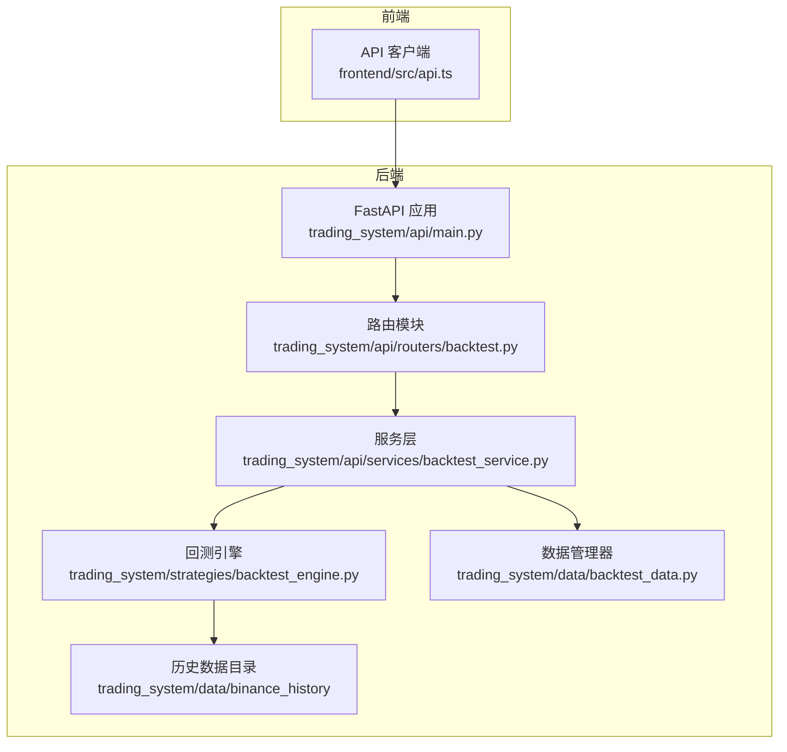
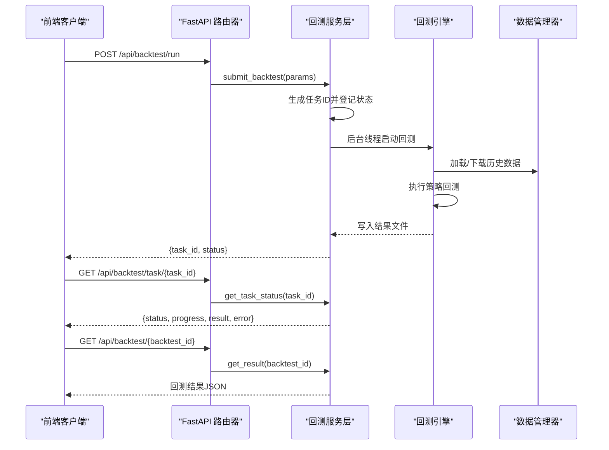
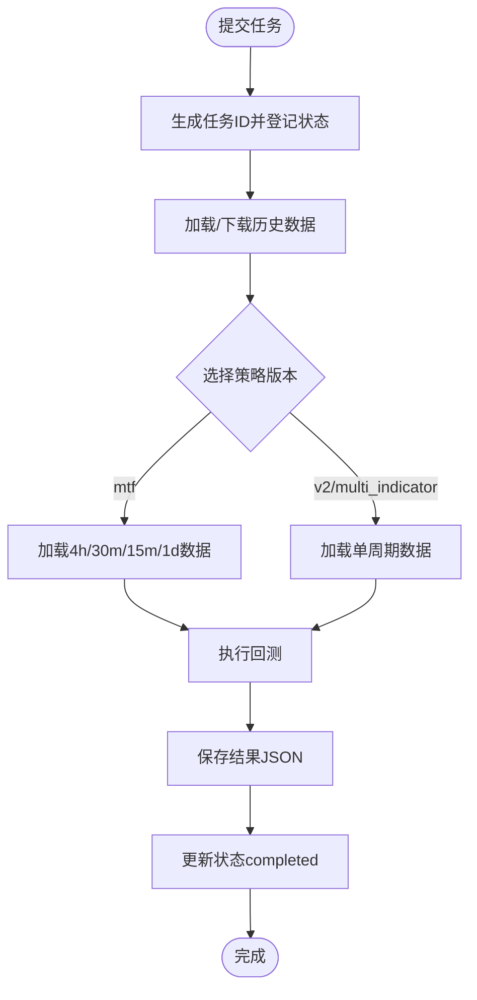

# 回测API

<cite>
**本文档引用的文件**
- [trading_system/api/routers/backtest.py](file://trading_system/api/routers/backtest.py)
- [trading_system/api/services/backtest_service.py](file://trading_system/api/services/backtest_service.py)
- [trading_system/api/main.py](file://trading_system/api/main.py)
- [trading_system/strategies/backtest_engine.py](file://trading_system/strategies/backtest_engine.py)
- [trading_system/data/backtest_data.py](file://trading_system/data/backtest_data.py)
- [trading_system/backtest/run_backtest.py](file://trading_system/backtest/run_backtest.py)
- [frontend/src/api.ts](file://frontend/src/api.ts)
</cite>

## 目录
1. [简介](#简介)
2. [项目结构](#项目结构)
3. [核心组件](#核心组件)
4. [架构总览](#架构总览)
5. [详细组件分析](#详细组件分析)
6. [依赖分析](#依赖分析)
7. [性能考量](#性能考量)
8. [故障排查指南](#故障排查指南)
9. [结论](#结论)
10. [附录](#附录)

## 简介
本文件面向回测API的使用者与维护者，系统化梳理所有回测相关的RESTful接口，覆盖任务提交、状态查询、结果获取、参数模板与数据日期范围查询。文档基于实际代码实现进行说明，确保接口行为、参数定义、响应格式、状态码与错误处理具备可追溯性。

## 项目结构
回测API位于FastAPI应用中，通过路由模块统一暴露REST端点，并由服务层封装业务逻辑（任务调度、数据加载、策略执行、结果持久化）。前端通过统一的BASE路径调用后端接口。

**图示来源**
- [trading_system/api/main.py:12-97](file://trading_system/api/main.py#L12-L97)
- [trading_system/api/routers/backtest.py:6-68](file://trading_system/api/routers/backtest.py#L6-L68)
- [trading_system/api/services/backtest_service.py:58-248](file://trading_system/api/services/backtest_service.py#L58-L248)
- [trading_system/strategies/backtest_engine.py:228-534](file://trading_system/strategies/backtest_engine.py#L228-L534)
- [trading_system/data/backtest_data.py:9-137](file://trading_system/data/backtest_data.py#L9-L137)

**章节来源**
- [trading_system/api/main.py:12-97](file://trading_system/api/main.py#L12-L97)
- [trading_system/api/routers/backtest.py:6-68](file://trading_system/api/routers/backtest.py#L6-L68)

## 核心组件
- 路由器：定义回测相关端点，负责请求解析与响应封装。
- 服务层：封装任务提交、状态查询、结果读取、参数模板与日期范围查询。
- 回测引擎：负责数据加载、策略执行、结果计算与持久化。
- 数据管理器：负责本地CSV数据加载与远程K线下载（可选）。
- 前端客户端：统一的HTTP请求封装，便于集成与测试。

**章节来源**
- [trading_system/api/routers/backtest.py:9-68](file://trading_system/api/routers/backtest.py#L9-L68)
- [trading_system/api/services/backtest_service.py:20-289](file://trading_system/api/services/backtest_service.py#L20-L289)
- [trading_system/strategies/backtest_engine.py:228-534](file://trading_system/strategies/backtest_engine.py#L228-L534)
- [trading_system/data/backtest_data.py:9-137](file://trading_system/data/backtest_data.py#L9-L137)
- [frontend/src/api.ts:1-51](file://frontend/src/api.ts#L1-L51)

## 架构总览
回测API采用异步任务模型：提交任务后立即返回任务ID，前端轮询任务状态，完成后读取结果文件。服务层维护内存中的任务状态表，保证并发安全。

**图示来源**
- [trading_system/api/routers/backtest.py:49-62](file://trading_system/api/routers/backtest.py#L49-L62)
- [trading_system/api/services/backtest_service.py:58-248](file://trading_system/api/services/backtest_service.py#L58-L248)
- [trading_system/strategies/backtest_engine.py:445-534](file://trading_system/strategies/backtest_engine.py#L445-L534)
- [trading_system/data/backtest_data.py:47-137](file://trading_system/data/backtest_data.py#L47-L137)

## 详细组件分析

### 接口总览与调用约定
- 基础路径：/api/backtest
- 响应格式：JSON
- 错误处理：HTTP异常会返回标准化错误体；404场景明确提示资源不存在
- 前端调用：统一通过BASE路径封装请求

**章节来源**
- [trading_system/api/routers/backtest.py:6-68](file://trading_system/api/routers/backtest.py#L6-L68)
- [frontend/src/api.ts:1-51](file://frontend/src/api.ts#L1-L51)

### POST /api/backtest/run（提交回测任务）
- 描述：提交回测参数，后台异步执行并返回任务ID
- 请求体：BacktestRequest（见下节“请求参数说明”）
- 响应体：
  - task_id: 字符串，任务唯一标识（截断UUID前缀）
  - status: 字符串，初始状态为"pending"
- HTTP状态码：
  - 200 成功
  - 500 服务器内部错误（异常捕获）
- 错误处理：
  - 参数缺失或类型不符由Pydantic校验抛出422（由FastAPI默认处理）
  - 服务层异常捕获并记录日志，不影响外层HTTP响应码
- 调用示例（参考路径）：
  - [frontend/src/api.ts:43-45](file://frontend/src/api.ts#L43-L45)

请求参数说明（BacktestRequest）
- symbol: 交易对，字符串，默认"ETHUSDC"
- interval: K线周期，字符串，默认"4h"，可选["5m","15m","30m","1h","4h","1d"]
- initial_balance: 初始资金，数值，默认10000
- commission: 手续费率，数值，默认0.001
- slippage: 滑点比例，数值，默认0.0005
- leverage: 杠杆倍数，整数，默认10，最小1，最大125
- investment_ratio: 单次投资占总资金比例，数值，默认0.5，范围[0.01,1.0]
- start_date: 开始日期，字符串，格式"YYYY-MM-DD"（可选）
- end_date: 结束日期，字符串，格式"YYYY-MM-DD"（可选）
- strategy_version: 策略版本，字符串，默认"mtf"，可选["v1","v2","mtf","multi_indicator"]
- enable_early_entry: 是否启用底分型提前做多，布尔，默认True
- enable_early_short_entry: 是否启用顶分型提前做空，布尔，默认True
- early_entry_min_confidence: 提前入场最低置信度，数值，默认0.6，范围[0.1,1.0]
- min_early_entry_conditions: 提前入场所需最少条件数，整数，默认2，范围[1,3]
- use_live_data: 是否使用实时数据下载，布尔，默认False

参数验证规则与最佳实践
- 数值参数建议在合理范围内：commission、slippage建议较小；leverage过高会放大风险；investment_ratio建议保守取值
- 日期范围：若提供start_date或end_date，需符合"YYYY-MM-DD"格式
- 策略版本选择：
  - mtf：需要多周期数据，建议配合15m上下文扩展
  - v2：适合单一周期，支持最大加仓次数
  - multi_indicator：多指标趋势跟踪
- 提前入场参数：enable_early_entry与enable_early_short_entry需结合min_early_entry_conditions使用

响应格式
- { "task_id": "...", "status": "pending" }

HTTP状态码
- 200 成功
- 422 参数校验失败（Pydantic）
- 500 服务器内部错误

错误处理
- 404：当查询任务或结果时，若资源不存在会抛出HTTP异常
- 服务层异常会被捕获并记录，任务状态标记为failed

**章节来源**
- [trading_system/api/routers/backtest.py:49-53](file://trading_system/api/routers/backtest.py#L49-L53)
- [trading_system/api/routers/backtest.py:9-25](file://trading_system/api/routers/backtest.py#L9-L25)
- [trading_system/api/services/backtest_service.py:58-248](file://trading_system/api/services/backtest_service.py#L58-L248)
- [trading_system/strategies/backtest_engine.py:34-84](file://trading_system/strategies/backtest_engine.py#L34-L84)

### GET /api/backtest/list（列出回测结果）
- 描述：列出历史回测结果摘要
- 响应体：
  - count: 整数，结果总数
  - results: 数组，每项包含：
    - id: 字符串，文件名（不含扩展名）
    - filename: 字符串，结果文件名
    - created: 字符串，ISO时间戳
    - symbol: 字符串，交易对
    - start_date: 字符串，起始日期
    - end_date: 字符串，结束日期
    - net_profit: 数值，净利润
    - total_return_pct: 数值，总收益率百分比
    - total_trades: 数值，总交易次数
    - win_rate_pct: 数值，胜率百分比
    - max_drawdown_pct: 数值，最大回撤百分比
    - sharpe_ratio: 数值，夏普比率
- HTTP状态码：200
- 错误处理：无显式404；异常统一由全局异常处理器返回500

**章节来源**
- [trading_system/api/routers/backtest.py:27-31](file://trading_system/api/routers/backtest.py#L27-L31)
- [trading_system/api/services/backtest_service.py:20-42](file://trading_system/api/services/backtest_service.py#L20-L42)

### GET /api/backtest/{backtest_id}（获取单次回测结果）
- 描述：根据回测ID获取完整回测结果JSON
- 路径参数：backtest_id，字符串
- 响应体：完整的回测结果JSON（包含时间序列、交易明细、绩效指标等）
- HTTP状态码：
  - 200 成功
  - 404 不存在该回测结果
- 错误处理：找不到文件时返回None，前端收到空响应或由上层异常处理

**章节来源**
- [trading_system/api/routers/backtest.py:40-46](file://trading_system/api/routers/backtest.py#L40-L46)
- [trading_system/api/services/backtest_service.py:45-55](file://trading_system/api/services/backtest_service.py#L45-L55)

### GET /api/backtest/task/{task_id}（查询任务状态）
- 描述：查询回测任务的执行状态
- 路径参数：task_id，字符串
- 响应体：任务状态对象，包含
  - status: 字符串，可能值："pending","running","completed","failed"
  - progress: 整数，百分比
  - result: 对象，包含id与file（仅completed时）
  - error: 字符串，仅failed时
- HTTP状态码：
  - 200 成功
  - 404 任务不存在
- 错误处理：任务不存在返回None，抛出HTTP异常

**章节来源**
- [trading_system/api/routers/backtest.py:56-62](file://trading_system/api/routers/backtest.py#L56-L62)
- [trading_system/api/services/backtest_service.py:251-254](file://trading_system/api/services/backtest_service.py#L251-L254)

### GET /api/backtest/params（获取参数模板）
- 描述：返回回测参数的UI模板定义
- 响应体：对象，键为参数名，值为模板元数据，包含：
  - type: 输入类型（"select"|"number"|"boolean"）
  - default: 默认值
  - options: 选项列表（select类型）
  - min/max/step: 数值范围与步长（number类型）
- HTTP状态码：200
- 错误处理：无

**章节来源**
- [trading_system/api/routers/backtest.py:34-37](file://trading_system/api/routers/backtest.py#L34-L37)
- [trading_system/api/services/backtest_service.py:274-289](file://trading_system/api/services/backtest_service.py#L274-L289)

### GET /api/backtest/data/daterange（查询日期范围）
- 描述：查询可用历史数据的日期范围
- 响应体：对象
  - start: 字符串，最早日期
  - end: 字符串，最晚日期
  - message/error: 字符串，提示或错误信息
- HTTP状态码：200
- 错误处理：无

**章节来源**
- [trading_system/api/routers/backtest.py:65-68](file://trading_system/api/routers/backtest.py#L65-L68)
- [trading_system/api/services/backtest_service.py:257-271](file://trading_system/api/services/backtest_service.py#L257-L271)

### 任务执行流程与数据流
- 任务提交：服务层生成任务ID，登记状态为"pending"，启动后台线程
- 数据准备：按策略版本加载所需周期数据；若启用实时数据，先下载再使用
- 策略执行：根据strategy_version选择策略，注入数据，执行回测
- 结果持久化：将回测结果写入binance_history目录下的JSON文件
- 状态更新：按阶段更新progress，最终标记completed或failed

**图示来源**
- [trading_system/api/services/backtest_service.py:58-248](file://trading_system/api/services/backtest_service.py#L58-L248)
- [trading_system/strategies/backtest_engine.py:445-534](file://trading_system/strategies/backtest_engine.py#L445-L534)
- [trading_system/data/backtest_data.py:47-137](file://trading_system/data/backtest_data.py#L47-L137)

## 依赖分析
- 路由器依赖服务层：负责参数校验与业务编排
- 服务层依赖回测引擎与数据管理器：负责具体执行与数据访问
- 回测引擎依赖数据管理器与策略实现：负责回测主循环与指标计算
- 前端依赖路由器：通过统一BASE路径调用

**图示来源**
- [trading_system/api/routers/backtest.py:1-6](file://trading_system/api/routers/backtest.py#L1-L6)
- [trading_system/api/services/backtest_service.py:1-17](file://trading_system/api/services/backtest_service.py#L1-L17)
- [trading_system/strategies/backtest_engine.py:18-21](file://trading_system/strategies/backtest_engine.py#L18-L21)
- [trading_system/data/backtest_data.py:1-6](file://trading_system/data/backtest_data.py#L1-L6)

**章节来源**
- [trading_system/api/routers/backtest.py:1-6](file://trading_system/api/routers/backtest.py#L1-L6)
- [trading_system/api/services/backtest_service.py:1-17](file://trading_system/api/services/backtest_service.py#L1-L17)
- [trading_system/strategies/backtest_engine.py:18-21](file://trading_system/strategies/backtest_engine.py#L18-L21)
- [trading_system/data/backtest_data.py:1-6](file://trading_system/data/backtest_data.py#L1-L6)

## 性能考量
- 异步任务：回测在后台线程执行，避免阻塞主线程
- 进度上报：服务层按阶段更新progress，便于前端反馈
- 数据加载：按需加载指定周期数据，减少内存占用
- 实时数据：下载过程分批拉取并去重排序，避免超时与重复
- 大数据集：回测引擎内置增量处理与内存回收，提升稳定性

**章节来源**
- [trading_system/api/services/backtest_service.py:64-248](file://trading_system/api/services/backtest_service.py#L64-L248)
- [trading_system/strategies/backtest_engine.py:586-644](file://trading_system/strategies/backtest_engine.py#L586-L644)
- [trading_system/data/backtest_data.py:72-137](file://trading_system/data/backtest_data.py#L72-L137)

## 故障排查指南
常见问题与处理
- 404 任务不存在：确认task_id拼写与生命周期
- 404 回测结果不存在：确认backtest_id与文件命名一致
- 数据为空：检查start_date/end_date是否导致过滤后为空；确认对应CSV文件存在
- 实时数据下载失败：网络异常或API限流，回测会降级使用缓存数据
- 任务失败：查看服务端日志，关注failed状态与error字段

定位步骤
- 通过GET /api/backtest/task/{task_id}确认状态与进度
- 若失败，检查服务端日志定位异常堆栈
- 使用GET /api/backtest/data/daterange核对数据可用范围
- 通过GET /api/backtest/params核对参数模板与默认值

**章节来源**
- [trading_system/api/routers/backtest.py:44-46](file://trading_system/api/routers/backtest.py#L44-L46)
- [trading_system/api/routers/backtest.py:60-61](file://trading_system/api/routers/backtest.py#L60-L61)
- [trading_system/api/services/backtest_service.py:240-244](file://trading_system/api/services/backtest_service.py#L240-L244)
- [trading_system/api/services/backtest_service.py:257-271](file://trading_system/api/services/backtest_service.py#L257-L271)

## 结论
回测API以清晰的职责划分与稳健的任务执行模型，提供了从参数提交到结果查询的完整闭环。通过参数模板与日期范围查询，用户可快速配置与验证回测场景。建议在生产环境结合任务轮询与日志监控，确保回测任务的可观测性与可恢复性。

## 附录
- 前端调用示例（参考路径）
  - [frontend/src/api.ts:41-49](file://frontend/src/api.ts#L41-L49)
- 命令行回测脚本（参考路径）
  - [trading_system/backtest/run_backtest.py:35-163](file://trading_system/backtest/run_backtest.py#L35-L163)
  - [trading_system/backtest/run_backtest.py:498-551](file://trading_system/backtest/run_backtest.py#L498-L551)