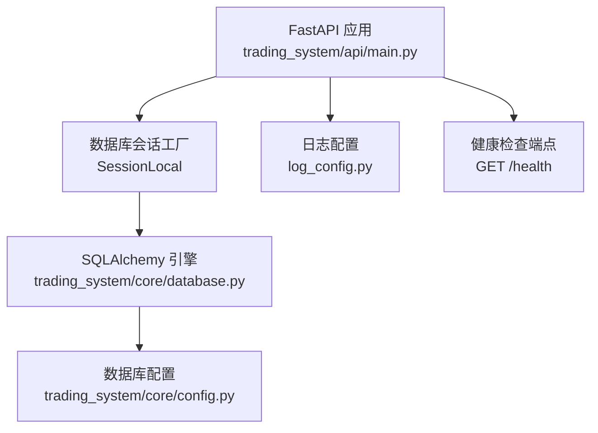
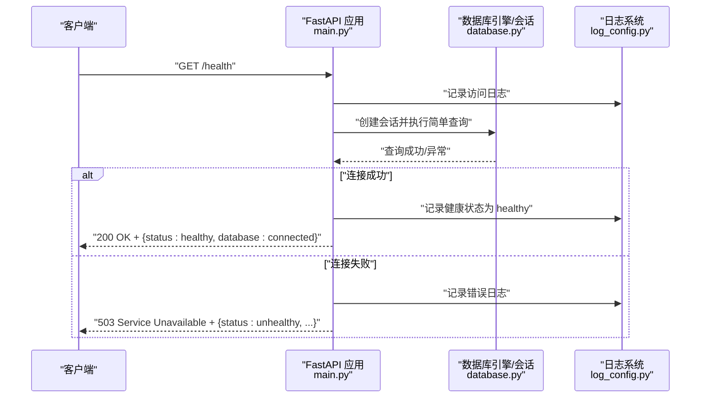
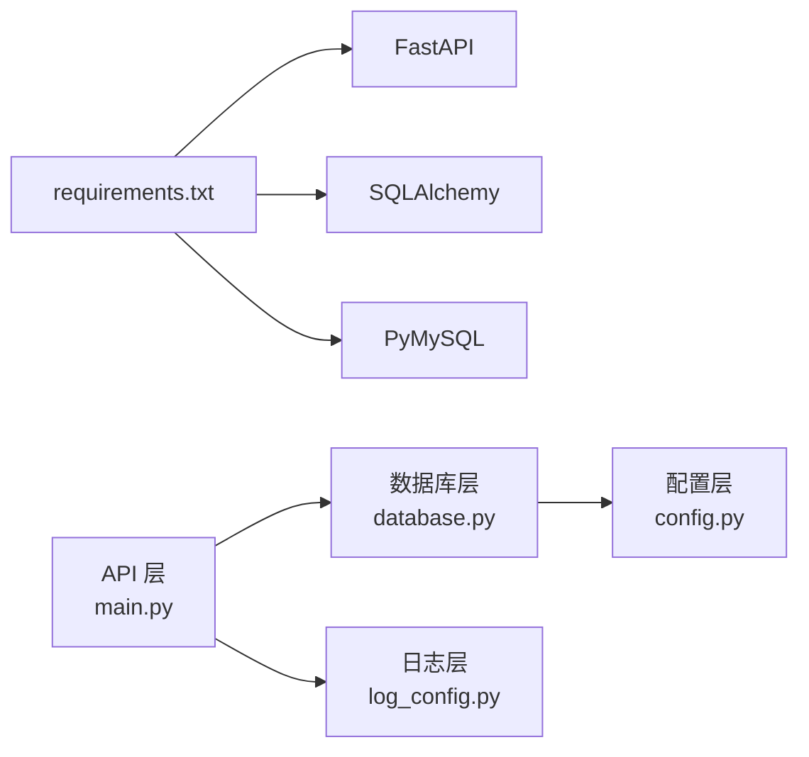

# 系统健康检查API

<cite>
**本文引用的文件**
- [trading_system/api/main.py](file://trading_system/api/main.py)
- [trading_system/core/database.py](file://trading_system/core/database.py)
- [trading_system/core/config.py](file://trading_system/core/config.py)
- [log_config.py](file://log_config.py)
- [.trae/specs/优化数据库连接和代码/tasks.md](file://.trae/specs/优化数据库连接和代码/tasks.md)
- [.trae/specs/优化数据库连接和代码/checklist.md](file://.trae/specs/优化数据库连接和代码/checklist.md)
- [requirements.txt](file://requirements.txt)
</cite>

## 目录
1. [简介](#简介)
2. [项目结构](#项目结构)
3. [核心组件](#核心组件)
4. [架构总览](#架构总览)
5. [详细组件分析](#详细组件分析)
6. [依赖分析](#依赖分析)
7. [性能考虑](#性能考虑)
8. [故障排查指南](#故障排查指南)
9. [结论](#结论)
10. [附录](#附录)

## 简介
本文件面向系统运维与开发团队，提供系统健康检查API的权威说明。重点覆盖以下内容：
- GET /health 接口的用途与响应格式
- 健康检查的作用与检查范围（数据库连接为主）
- 状态码含义与异常处理策略
- 系统监控最佳实践与常见失败原因及解决方案
- 如何将健康检查集成到监控系统以及自动化检查脚本示例

## 项目结构
与健康检查直接相关的代码位于 trading_system/api/main.py，数据库连接配置位于 trading_system/core/database.py，配置来源位于 trading_system/core/config.py，日志配置位于 log_config.py。下图展示与健康检查相关的模块关系。

**图示来源**
- [trading_system/api/main.py:75-88](file://trading_system/api/main.py#L75-L88)
- [trading_system/core/database.py:12-21](file://trading_system/core/database.py#L12-L21)
- [trading_system/core/config.py:5-32](file://trading_system/core/config.py#L5-L32)

**章节来源**
- [trading_system/api/main.py:75-88](file://trading_system/api/main.py#L75-L88)
- [trading_system/core/database.py:12-21](file://trading_system/core/database.py#L12-L21)
- [trading_system/core/config.py:5-32](file://trading_system/core/config.py#L5-L32)
- [log_config.py:11-64](file://log_config.py#L11-L64)

## 核心组件
- 健康检查端点：提供 GET /health，用于快速验证服务核心依赖（数据库连接）是否可用。
- 数据库连接池：通过 SQLAlchemy 引擎与连接池配置，确保连接复用与稳定性。
- 异常与日志：统一异常处理器与日志记录，便于定位问题与审计。

**章节来源**
- [trading_system/api/main.py:75-88](file://trading_system/api/main.py#L75-L88)
- [trading_system/core/database.py:12-21](file://trading_system/core/database.py#L12-L21)
- [log_config.py:11-64](file://log_config.py#L11-L64)

## 架构总览
下图展示健康检查的端到端流程：客户端请求 /health → FastAPI 路由 → 数据库连接校验 → 返回健康状态。

**图示来源**
- [trading_system/api/main.py:75-88](file://trading_system/api/main.py#L75-L88)
- [trading_system/core/database.py:24-34](file://trading_system/core/database.py#L24-L34)
- [log_config.py:11-64](file://log_config.py#L11-L64)

## 详细组件分析

### GET /health 接口
- 接口路径：GET /health
- 功能：验证数据库连接是否可用；若可用返回健康状态，否则返回不可用状态并抛出 HTTP 503。
- 响应体字段：
  - status：字符串，"healthy" 或 "unhealthy"
  - database：字符串，"connected" 或 "disconnected"
  - error（当 status 为 "unhealthy" 时）：字符串，包含错误描述
- 状态码：
  - 200：服务健康，数据库连接正常
  - 503：服务不可用，数据库连接异常
- 典型响应示例（路径引用而非代码内容）：
  - [健康响应示例:83-84](file://trading_system/api/main.py#L83-L84)
  - [异常响应示例:85-87](file://trading_system/api/main.py#L85-L87)

**章节来源**
- [trading_system/api/main.py:75-88](file://trading_system/api/main.py#L75-L88)

### 健康检查的实现细节
- 连接校验方式：创建数据库会话并执行一次轻量查询，随后立即关闭会话，避免长事务占用连接池。
- 异常处理：捕获所有异常并转换为 HTTP 503，同时在日志中记录错误详情。
- 日志记录：成功时记录健康状态，失败时记录错误信息，便于审计与排障。

**章节来源**
- [trading_system/api/main.py:79-87](file://trading_system/api/main.py#L79-L87)
- [log_config.py:33-56](file://log_config.py#L33-L56)

### 数据库连接池与配置
- 连接池参数来源：从配置对象读取 pool_size、max_overflow、pool_timeout、pool_recycle 等参数，并启用 pool_pre_ping 以自动探测失效连接。
- 初始化：应用启动时调用初始化函数创建表结构，确保数据库可用性。

**章节来源**
- [trading_system/core/database.py:12-21](file://trading_system/core/database.py#L12-L21)
- [trading_system/core/database.py:37-44](file://trading_system/core/database.py#L37-L44)
- [trading_system/core/config.py:5-32](file://trading_system/core/config.py#L5-L32)

### 日志与异常处理
- 统一异常处理器：捕获未预期异常并返回 500，同时记录错误详情。
- HTTP 异常处理器：捕获 HTTPException 并返回结构化错误响应。
- 健康检查专用日志：成功与失败分别记录 INFO 与 ERROR 级别日志，便于监控系统采集。

**章节来源**
- [trading_system/api/main.py:33-55](file://trading_system/api/main.py#L33-L55)
- [trading_system/api/main.py:79-87](file://trading_system/api/main.py#L79-L87)
- [log_config.py:11-64](file://log_config.py#L11-L64)

## 依赖分析
- 外部依赖：FastAPI、SQLAlchemy、PyMySQL、uvicorn 等，均在 requirements.txt 中声明。
- 内部依赖：API 层依赖数据库层提供的 SessionLocal；数据库层依赖配置层提供的 settings。

**图示来源**
- [requirements.txt:17-51](file://requirements.txt#L17-L51)
- [trading_system/api/main.py:6-8](file://trading_system/api/main.py#L6-L8)
- [trading_system/core/database.py:1-5](file://trading_system/core/database.py#L1-L5)
- [trading_system/core/config.py:1-3](file://trading_system/core/config.py#L1-L3)
- [log_config.py:1-8](file://log_config.py#L1-L8)

**章节来源**
- [requirements.txt:17-51](file://requirements.txt#L17-L51)
- [trading_system/api/main.py:6-8](file://trading_system/api/main.py#L6-L8)
- [trading_system/core/database.py:1-5](file://trading_system/core/database.py#L1-L5)
- [trading_system/core/config.py:1-3](file://trading_system/core/config.py#L1-L3)
- [log_config.py:1-8](file://log_config.py#L1-L8)

## 性能考虑
- 健康检查开销极小：仅执行一次轻量查询并立即释放连接，不会对生产流量造成影响。
- 连接池预热：通过 pool_pre_ping 与合理的 pool_size、pool_recycle 配置，降低连接失效带来的抖动。
- 建议：将健康检查频率控制在合理范围内（例如每 10-30 秒），避免频繁探活导致连接池压力。

[本节为通用建议，无需特定文件引用]

## 故障排查指南
- 常见失败原因
  - 数据库不可达：网络中断、防火墙阻断、数据库宕机或凭据错误
  - 连接池耗尽：高并发下连接长时间占用未释放
  - 配置错误：数据库 URL、用户名、密码或连接池参数不正确
- 定位步骤
  - 查看日志：关注健康检查相关的 INFO/ERROR 日志
  - 验证数据库连通性：使用数据库客户端或命令行工具尝试连接
  - 检查连接池参数：核对 pool_size、max_overflow、pool_timeout、pool_recycle
- 解决方案
  - 修复网络与凭据：确保服务可访问数据库，凭据正确
  - 调整连接池参数：根据负载与延迟调整 pool_size 与超时
  - 优化业务代码：避免长事务与未关闭的数据库会话

**章节来源**
- [trading_system/api/main.py:79-87](file://trading_system/api/main.py#L79-L87)
- [log_config.py:33-56](file://log_config.py#L33-L56)
- [trading_system/core/database.py:12-21](file://trading_system/core/database.py#L12-L21)
- [trading_system/core/config.py:5-32](file://trading_system/core/config.py#L5-L32)

## 结论
GET /health 是一个轻量、可靠的健康检查端点，专注于验证数据库连接可用性。结合统一的日志与异常处理机制，它能够为系统监控与自动化运维提供坚实基础。建议在生产环境中将其纳入容器编排的存活/就绪探针，并配合连接池优化与监控告警，持续保障系统稳定性。

[本节为总结性内容，无需特定文件引用]

## 附录

### 健康检查的作用与范围
- 作用：快速评估服务核心依赖（数据库）的可用性，辅助自动扩缩容、滚动更新与故障转移。
- 当前范围：仅检查数据库连接；未来可扩展至外部 API 连通性、系统资源使用情况等。

**章节来源**
- [.trae/specs/优化数据库连接和代码/tasks.md:16-27](file://.trae/specs/优化数据库连接和代码/tasks.md#L16-L27)
- [.trae/specs/优化数据库连接和代码/checklist.md:3-6](file://.trae/specs/优化数据库连接和代码/checklist.md#L3-L6)

### 响应格式与状态码对照
- 200 OK
  - 示例字段：{"status": "healthy", "database": "connected"}
  - 适用场景：数据库连接正常
- 503 Service Unavailable
  - 示例字段：{"status": "unhealthy", "database": "disconnected", "error": "<错误描述>"}
  - 适用场景：数据库连接异常

**章节来源**
- [trading_system/api/main.py:83-87](file://trading_system/api/main.py#L83-L87)

### 监控系统集成与自动化检查脚本示例
- 集成方式
  - Kubernetes：将 /health 作为 livenessProbe/readinessProbe 的 HTTP GET 端点
  - Prometheus：通过 HTTP 抓取 /health 并自定义指标（如 status_label=healthy/unhealthy）
  - 告警规则：当连续 N 次返回 503 或响应时间超过阈值时触发告警
- 自动化检查脚本思路（伪代码思路，非具体代码）
  - 定时向 /health 发起 HTTP 请求
  - 校验状态码与响应体字段
  - 记录成功率与响应时间
  - 失败时发送通知（邮件/IM）

[本节为概念性指导，无需特定文件引用]