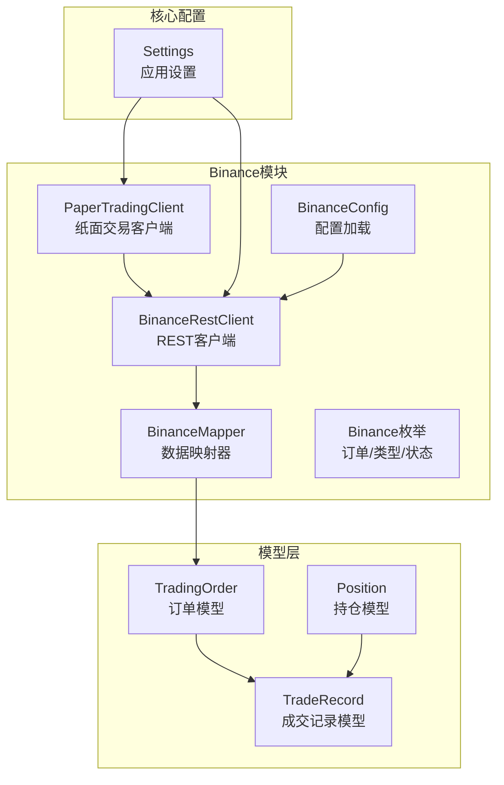
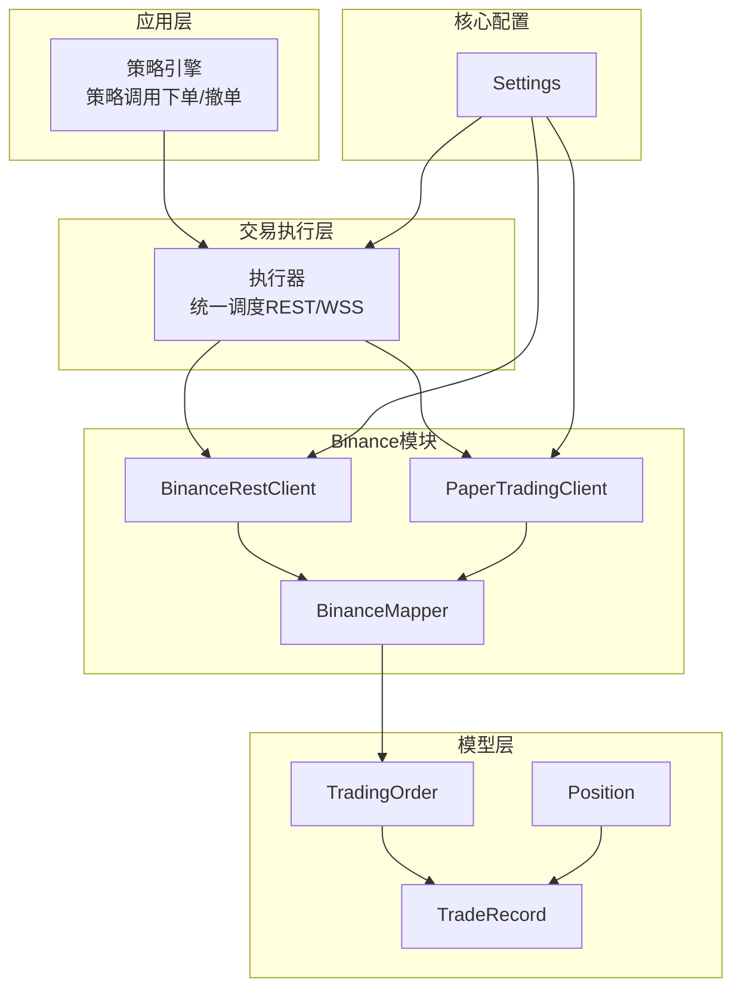
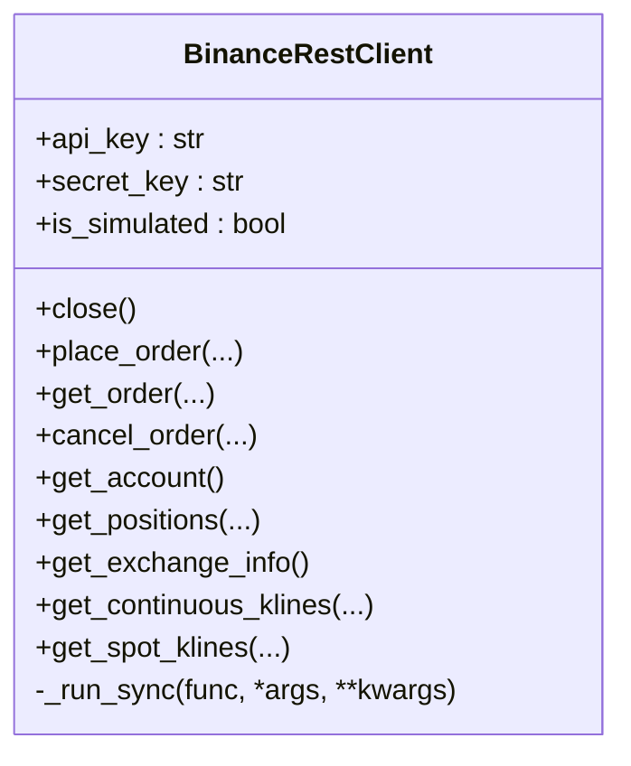
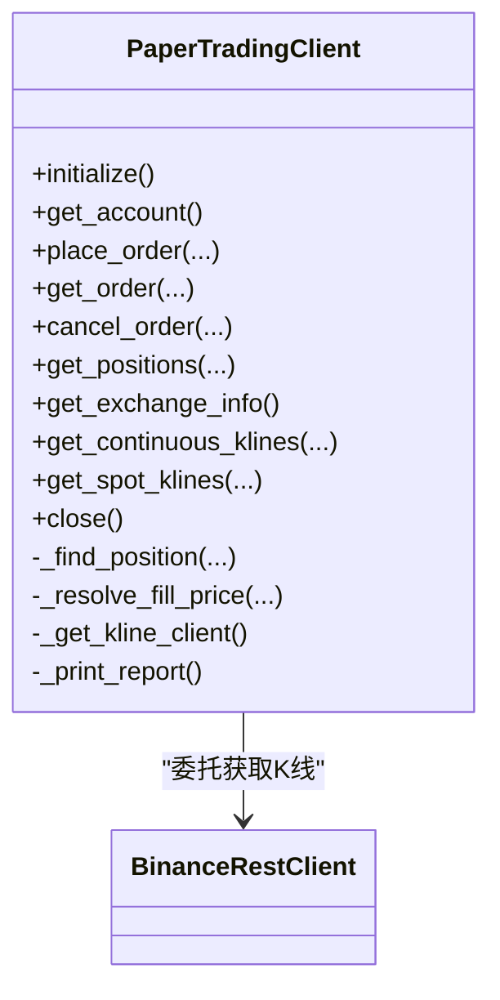
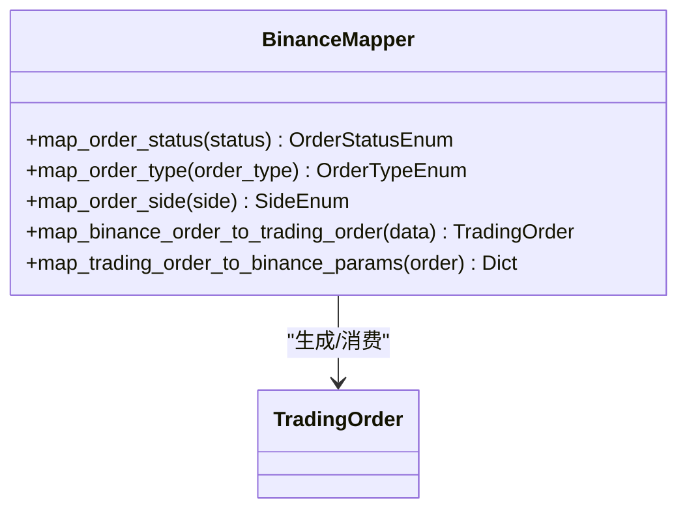
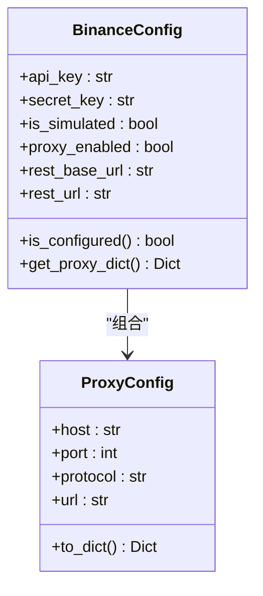
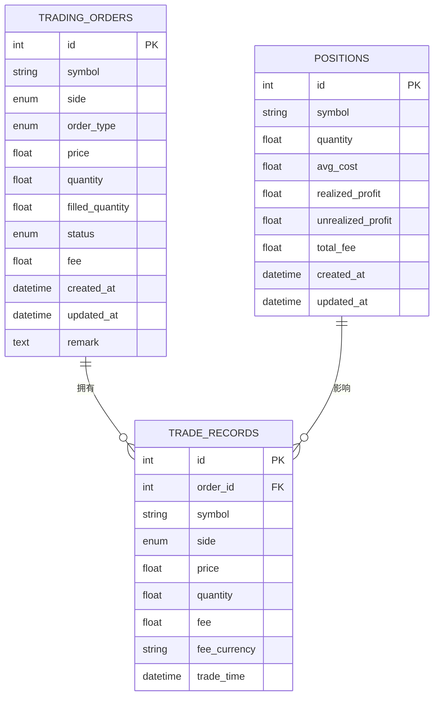
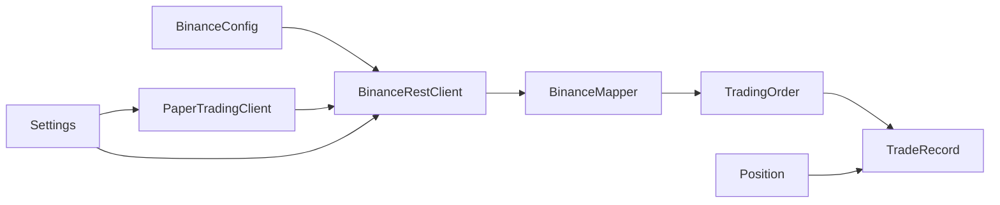

# 交易所集成

<cite>
**本文引用的文件**
- [trading_system/binance/client.py](file://trading_system/binance/client.py)
- [trading_system/binance/paper_client.py](file://trading_system/binance/paper_client.py)
- [trading_system/binance/mapper.py](file://trading_system/binance/mapper.py)
- [trading_system/binance/enums.py](file://trading_system/binance/enums.py)
- [trading_system/binance/config.py](file://trading_system/binance/config.py)
- [trading_system/models/trading_order.py](file://trading_system/models/trading_order.py)
- [trading_system/models/position.py](file://trading_system/models/position.py)
- [trading_system/models/trade_record.py](file://trading_system/models/trade_record.py)
- [trading_system/core/config.py](file://trading_system/core/config.py)
</cite>

## 目录
1. [引言](#引言)
2. [项目结构](#项目结构)
3. [核心组件](#核心组件)
4. [架构总览](#架构总览)
5. [详细组件分析](#详细组件分析)
6. [依赖分析](#依赖分析)
7. [性能考虑](#性能考虑)
8. [故障排查指南](#故障排查指南)
9. [结论](#结论)
10. [附录](#附录)

## 引言
本文件面向需要在系统中集成Binance与OKX（通过现有Binance模块扩展）的开发者，提供一份覆盖API客户端实现、认证机制、请求处理、纸面交易模拟、真实交易执行、风险管理、WebSocket连接管理、频道订阅与实时数据处理、数据映射、错误处理与重连机制、交易执行流程、订单管理与资金划转的技术文档。本文档以仓库中的Binance模块为起点，给出OKX扩展的实施建议与最佳实践。

## 项目结构
系统采用按功能域分层的组织方式：binance与okx子模块分别封装各自交易所的REST/WebSocket适配；models定义交易相关数据模型；core提供配置与数据库抽象；前端负责可视化与交互。

图表来源
- [trading_system/binance/client.py:10-342](file://trading_system/binance/client.py#L10-L342)
- [trading_system/binance/paper_client.py:20-328](file://trading_system/binance/paper_client.py#L20-L328)
- [trading_system/binance/mapper.py:15-110](file://trading_system/binance/mapper.py#L15-L110)
- [trading_system/binance/enums.py:4-41](file://trading_system/binance/enums.py#L4-L41)
- [trading_system/binance/config.py:27-68](file://trading_system/binance/config.py#L27-L68)
- [trading_system/models/trading_order.py:26-43](file://trading_system/models/trading_order.py#L26-L43)
- [trading_system/models/position.py:6-18](file://trading_system/models/position.py#L6-L18)
- [trading_system/models/trade_record.py:8-22](file://trading_system/models/trade_record.py#L8-L22)
- [trading_system/core/config.py:5-35](file://trading_system/core/config.py#L5-L35)

章节来源
- [trading_system/binance/client.py:10-342](file://trading_system/binance/client.py#L10-L342)
- [trading_system/binance/paper_client.py:20-328](file://trading_system/binance/paper_client.py#L20-L328)
- [trading_system/binance/mapper.py:15-110](file://trading_system/binance/mapper.py#L15-L110)
- [trading_system/binance/enums.py:4-41](file://trading_system/binance/enums.py#L4-L41)
- [trading_system/binance/config.py:27-68](file://trading_system/binance/config.py#L27-L68)
- [trading_system/models/trading_order.py:26-43](file://trading_system/models/trading_order.py#L26-L43)
- [trading_system/models/position.py:6-18](file://trading_system/models/position.py#L6-L18)
- [trading_system/models/trade_record.py:8-22](file://trading_system/models/trade_record.py#L8-L22)
- [trading_system/core/config.py:5-35](file://trading_system/core/config.py#L5-L35)

## 核心组件
- BinanceRestClient：基于官方UM Futures SDK封装的REST客户端，支持下单、撤单、查询、账户、持仓、K线等接口，并内置异步执行与日志记录。
- PaperTradingClient：纸面交易客户端，与BinanceRestClient保持一致接口，用于回测与策略验证，不产生真实资金变动。
- BinanceMapper：负责Binance返回数据与内部模型之间的映射，包括订单状态、类型、方向的转换。
- BinanceConfig：集中管理API密钥、是否模拟盘、代理与钉钉通知开关等配置。
- TradingOrder/Position/TradeRecord：ORM模型，支撑订单、持仓与成交记录的数据持久化与关联关系。

章节来源
- [trading_system/binance/client.py:10-342](file://trading_system/binance/client.py#L10-L342)
- [trading_system/binance/paper_client.py:20-328](file://trading_system/binance/paper_client.py#L20-L328)
- [trading_system/binance/mapper.py:15-110](file://trading_system/binance/mapper.py#L15-L110)
- [trading_system/binance/config.py:27-68](file://trading_system/binance/config.py#L27-L68)
- [trading_system/models/trading_order.py:26-43](file://trading_system/models/trading_order.py#L26-L43)
- [trading_system/models/position.py:6-18](file://trading_system/models/position.py#L6-L18)
- [trading_system/models/trade_record.py:8-22](file://trading_system/models/trade_record.py#L8-L22)

## 架构总览
下图展示Binance模块在整体系统中的位置与交互关系，以及与模型层、核心配置的关系。

图表来源
- [trading_system/binance/client.py:10-342](file://trading_system/binance/client.py#L10-L342)
- [trading_system/binance/paper_client.py:20-328](file://trading_system/binance/paper_client.py#L20-L328)
- [trading_system/binance/mapper.py:15-110](file://trading_system/binance/mapper.py#L15-L110)
- [trading_system/models/trading_order.py:26-43](file://trading_system/models/trading_order.py#L26-L43)
- [trading_system/models/position.py:6-18](file://trading_system/models/position.py#L6-L18)
- [trading_system/models/trade_record.py:8-22](file://trading_system/models/trade_record.py#L8-L22)
- [trading_system/core/config.py:5-35](file://trading_system/core/config.py#L5-L35)

## 详细组件分析

### BinanceRestClient 组件分析
- 职责：封装Binance REST API调用，提供下单、查询、撤单、账户、持仓、K线等方法；支持模拟盘与实盘切换；内部使用线程池执行SDK同步调用以兼容异步接口。
- 关键点：
  - 基于UM Futures SDK初始化，区分测试网与主网URL。
  - 所有公开方法均为异步，内部通过_run_sync包装SDK同步调用。
  - 对异常进行捕获并返回标准化错误对象，便于上层统一处理。
  - K线接口支持永续与现货两种模式，参数灵活，便于回测与实时数据拉取。

图表来源
- [trading_system/binance/client.py:10-342](file://trading_system/binance/client.py#L10-L342)

章节来源
- [trading_system/binance/client.py:10-342](file://trading_system/binance/client.py#L10-L342)

### PaperTradingClient 组件分析
- 职责：提供与BinanceRestClient一致的接口，用于纸面交易与回测。内部维护余额、持仓、订单与成交历史，模拟撮合逻辑与手续费计算。
- 关键点：
  - 初始化时尝试读取真实账户余额作为初始资金，失败则使用默认值。
  - 模拟开仓/平仓逻辑，计算未实现盈亏与手续费，生成成交记录。
  - K线数据来自BinanceRestClient，保证与真实市场数据一致。
  - 支持即时成交（paper trading即刻填充），撤单接口返回无待撤订单。

图表来源
- [trading_system/binance/paper_client.py:20-328](file://trading_system/binance/paper_client.py#L20-L328)
- [trading_system/binance/client.py:10-342](file://trading_system/binance/client.py#L10-L342)

章节来源
- [trading_system/binance/paper_client.py:20-328](file://trading_system/binance/paper_client.py#L20-L328)

### BinanceMapper 组件分析
- 职责：将Binance返回的原始字段映射到内部统一的枚举与模型字段，确保跨交易所的一致性。
- 关键点：
  - 订单状态映射：NEW/PARTIALLY_FILLED/FILLED/CANCELED/REJECTED/EXPIRED → 内部状态枚举。
  - 订单类型映射：LIMIT/MARKET/STOP/STOP_MARKET/TAKE_PROFIT/TAKE_PROFIT_MARKET → 内部类型枚举。
  - 订单方向映射：BUY/SELL → 内部方向枚举。
  - 提供从TradingOrder到Binance下单参数的映射，便于统一下单流程。

图表来源
- [trading_system/binance/mapper.py:15-110](file://trading_system/binance/mapper.py#L15-L110)
- [trading_system/models/trading_order.py:26-43](file://trading_system/models/trading_order.py#L26-L43)

章节来源
- [trading_system/binance/mapper.py:15-110](file://trading_system/binance/mapper.py#L15-L110)
- [trading_system/models/trading_order.py:26-43](file://trading_system/models/trading_order.py#L26-L43)

### BinanceConfig 组件分析
- 职责：集中管理Binance API的密钥、是否模拟盘、REST基础URL、代理与钉钉通知配置。
- 关键点：
  - 通过环境变量加载配置，支持代理启用与URL拼装。
  - 提供is_configured与get_proxy_dict等便捷方法。

图表来源
- [trading_system/binance/config.py:27-68](file://trading_system/binance/config.py#L27-L68)

章节来源
- [trading_system/binance/config.py:27-68](file://trading_system/binance/config.py#L27-L68)

### 数据模型（ORM）分析
- TradingOrder：订单实体，包含符号、方向、类型、价格、数量、已成交量、状态、费用、备注与时间戳，关联TradeRecord。
- Position：持仓实体，包含符号、数量、平均成本、已实现/未实现盈亏、总手续费。
- TradeRecord：成交记录实体，包含订单ID、符号、方向、价格、数量、费用与成交时间，反向关联TradingOrder。

图表来源
- [trading_system/models/trading_order.py:26-43](file://trading_system/models/trading_order.py#L26-L43)
- [trading_system/models/position.py:6-18](file://trading_system/models/position.py#L6-L18)
- [trading_system/models/trade_record.py:8-22](file://trading_system/models/trade_record.py#L8-L22)

章节来源
- [trading_system/models/trading_order.py:26-43](file://trading_system/models/trading_order.py#L26-L43)
- [trading_system/models/position.py:6-18](file://trading_system/models/position.py#L6-L18)
- [trading_system/models/trade_record.py:8-22](file://trading_system/models/trade_record.py#L8-L22)

### OKX 集成扩展建议
- SDK选择：参考Binance模块，引入OKX官方Python SDK或HTTP客户端，封装REST与WebSocket接口。
- 认证机制：遵循OKX签名规范，实现签名器与请求头注入；与BinanceConfig类似，集中管理API密钥、Passphrase、Endpoint与代理。
- 数据映射：参照BinanceMapper，建立OKX数据到TradingOrder/Position/TradeRecord的映射规则。
- 接口一致性：保持与PaperTradingClient相同的接口契约，以便策略层无感切换。
- WebSocket：实现频道订阅、消息解析、断线重连与心跳维持，与REST接口解耦。

（本节为概念性扩展说明，不直接分析具体文件）

## 依赖分析
- 组件内聚与耦合：
  - BinanceRestClient与BinanceConfig强耦合，通过配置决定URL与是否模拟盘。
  - PaperTradingClient依赖BinanceRestClient获取K线，但不依赖真实下单。
  - BinanceMapper独立于具体交易所，仅依赖内部枚举与模型。
  - 模型层通过ORM关系与业务解耦，便于扩展新交易所时复用。
- 外部依赖：
  - Binance SDK（UM Futures）。
  - SQLAlchemy ORM。
  - 环境变量加载（dotenv）。

图表来源
- [trading_system/binance/config.py:27-68](file://trading_system/binance/config.py#L27-L68)
- [trading_system/binance/client.py:10-342](file://trading_system/binance/client.py#L10-L342)
- [trading_system/binance/paper_client.py:20-328](file://trading_system/binance/paper_client.py#L20-L328)
- [trading_system/binance/mapper.py:15-110](file://trading_system/binance/mapper.py#L15-L110)
- [trading_system/models/trading_order.py:26-43](file://trading_system/models/trading_order.py#L26-L43)
- [trading_system/models/position.py:6-18](file://trading_system/models/position.py#L6-L18)
- [trading_system/models/trade_record.py:8-22](file://trading_system/models/trade_record.py#L8-L22)
- [trading_system/core/config.py:5-35](file://trading_system/core/config.py#L5-L35)

章节来源
- [trading_system/binance/config.py:27-68](file://trading_system/binance/config.py#L27-L68)
- [trading_system/binance/client.py:10-342](file://trading_system/binance/client.py#L10-L342)
- [trading_system/binance/paper_client.py:20-328](file://trading_system/binance/paper_client.py#L20-L328)
- [trading_system/binance/mapper.py:15-110](file://trading_system/binance/mapper.py#L15-L110)
- [trading_system/models/trading_order.py:26-43](file://trading_system/models/trading_order.py#L26-L43)
- [trading_system/models/position.py:6-18](file://trading_system/models/position.py#L6-L18)
- [trading_system/models/trade_record.py:8-22](file://trading_system/models/trade_record.py#L8-L22)
- [trading_system/core/config.py:5-35](file://trading_system/core/config.py#L5-L35)

## 性能考虑
- 异步与阻塞：REST接口通过线程池执行SDK同步调用，避免阻塞事件循环；建议在高并发场景下限制并发数并增加超时控制。
- K线批量拉取：合理设置limit与时间范围，避免一次性请求过多数据导致内存压力。
- 日志级别：生产环境建议提升日志级别，减少IO开销。
- 数据映射缓存：对常用映射（如过滤器、精度）可做轻量缓存，降低重复计算。
- 数据库连接池：根据策略并发与写入频率调整连接池大小与回收周期。

（本节提供通用指导，不直接分析具体文件）

## 故障排查指南
- 认证失败：
  - 检查API密钥与Secret是否正确，确认是否启用模拟盘与代理。
  - 参考[BinanceConfig:27-68](file://trading_system/binance/config.py#L27-L68)的配置加载逻辑。
- 请求异常：
  - 查看REST方法的异常捕获与返回结构，定位错误码与消息。
  - 参考[BinanceRestClient:31-36](file://trading_system/binance/client.py#L31-L36)的_run_sync与异常处理。
- 纸面交易无成交：
  - 确认当前价格来源（K线最后价格或当前价格），检查撤单接口在纸面交易中的行为。
  - 参考[PaperTradingClient:203-210](file://trading_system/binance/paper_client.py#L203-L210)的撤单返回。
- 数据映射异常：
  - 核对Binance返回字段与映射规则，关注空值与类型转换。
  - 参考[BinanceMapper:63-110](file://trading_system/binance/mapper.py#L63-L110)的映射实现。
- 数据库连接问题：
  - 检查核心配置中的数据库URL与连接池参数。
  - 参考[Settings:5-35](file://trading_system/core/config.py#L5-L35)的配置项。

章节来源
- [trading_system/binance/config.py:27-68](file://trading_system/binance/config.py#L27-L68)
- [trading_system/binance/client.py:31-36](file://trading_system/binance/client.py#L31-L36)
- [trading_system/binance/paper_client.py:203-210](file://trading_system/binance/paper_client.py#L203-L210)
- [trading_system/binance/mapper.py:63-110](file://trading_system/binance/mapper.py#L63-L110)
- [trading_system/core/config.py:5-35](file://trading_system/core/config.py#L5-L35)

## 结论
本项目以Binance模块为核心，提供了完整的REST客户端、纸面交易模拟、数据映射与ORM模型，具备良好的扩展性。按照本文档的OKX扩展建议，可在保持接口一致性的前提下快速接入新交易所，同时通过统一的模型与映射层实现跨平台的策略与风控能力。

## 附录
- 术语
  - 模拟盘：使用测试网URL与虚拟资金进行策略验证。
  - 纸面交易：不向交易所发送真实订单，仅在本地模拟交易过程与损益。
  - 映射：将交易所返回字段转换为内部统一的枚举与模型字段。
- 参考路径
  - [BinanceRestClient:10-342](file://trading_system/binance/client.py#L10-L342)
  - [PaperTradingClient:20-328](file://trading_system/binance/paper_client.py#L20-L328)
  - [BinanceMapper:15-110](file://trading_system/binance/mapper.py#L15-L110)
  - [BinanceConfig:27-68](file://trading_system/binance/config.py#L27-L68)
  - [TradingOrder:26-43](file://trading_system/models/trading_order.py#L26-L43)
  - [Position:6-18](file://trading_system/models/position.py#L6-L18)
  - [TradeRecord:8-22](file://trading_system/models/trade_record.py#L8-L22)
  - [Settings:5-35](file://trading_system/core/config.py#L5-L35)