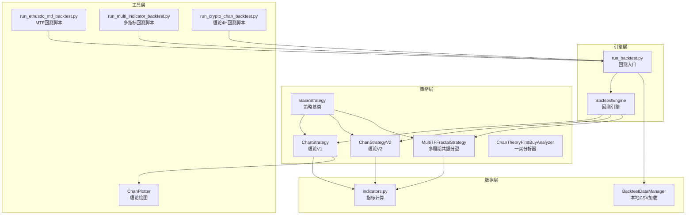
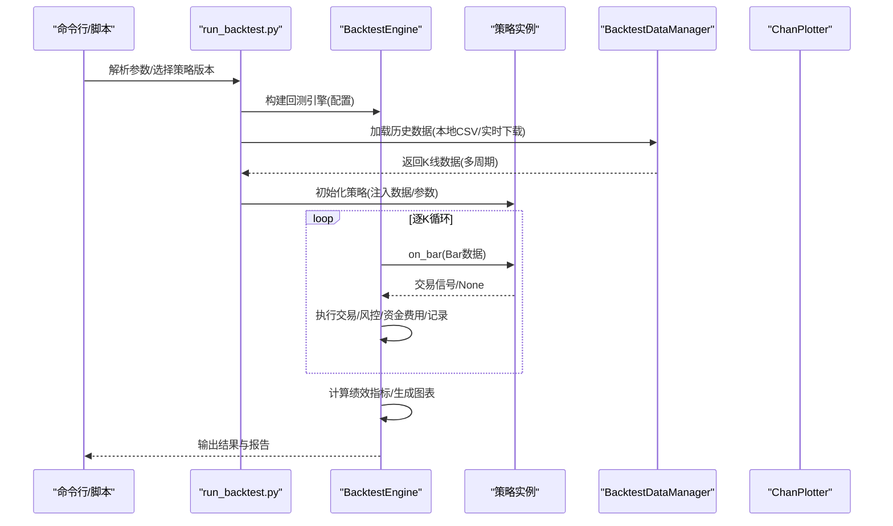
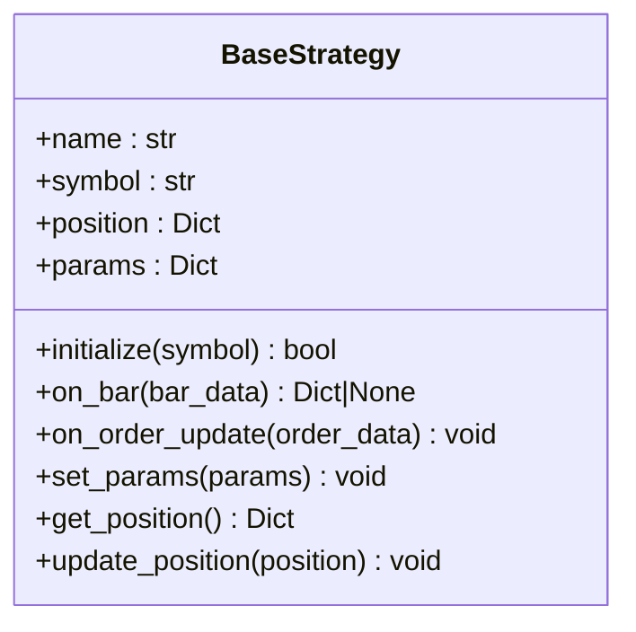
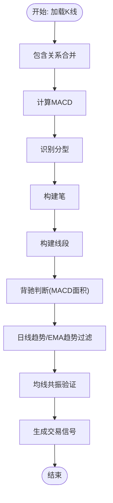
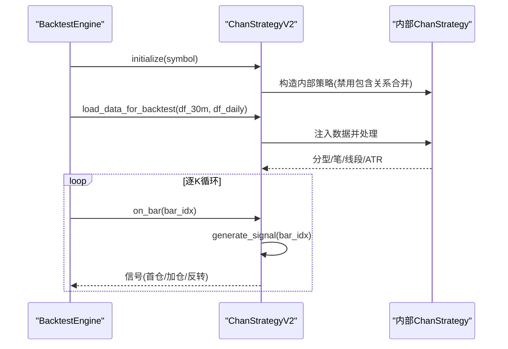
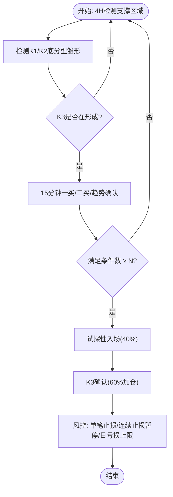
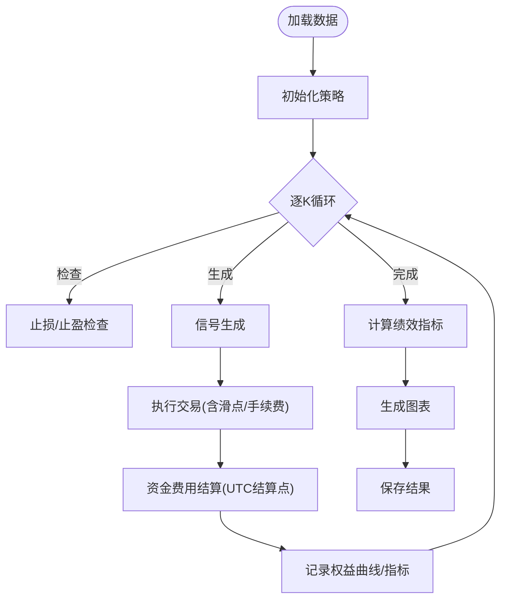
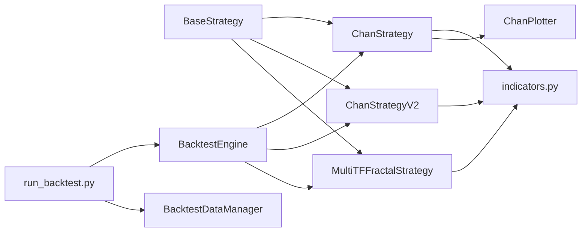

# 交易策略

<cite>
**本文档引用的文件**
- [trading_system/strategies/base_strategy.py](file://trading_system/strategies/base_strategy.py)
- [trading_system/strategies/backtest_engine.py](file://trading_system/strategies/backtest_engine.py)
- [trading_system/strategies/chan_strategy.py](file://trading_system/strategies/chan_strategy.py)
- [trading_system/strategies/chan_strategy_v2.py](file://trading_system/strategies/chan_strategy_v2.py)
- [trading_system/strategies/mtf_fractal_strategy.py](file://trading_system/strategies/mtf_fractal_strategy.py)
- [trading_system/strategies/chan_first_buy_strategy.py](file://trading_system/strategies/chan_first_buy_strategy.py)
- [trading_system/utils/indicators.py](file://trading_system/utils/indicators.py)
- [trading_system/backtest/run_backtest.py](file://trading_system/backtest/run_backtest.py)
- [trading_system/data/backtest_data.py](file://trading_system/data/backtest_data.py)
- [trading_system/utils/chan_plotter.py](file://trading_system/utils/chan_plotter.py)
- [run_crypto_chan_backtest.py](file://run_crypto_chan_backtest.py)
- [run_ethusdc_mtf_backtest.py](file://run_ethusdc_mtf_backtest.py)
- [run_multi_indicator_backtest.py](file://run_multi_indicator_backtest.py)
</cite>

## 目录
1. [简介](#简介)
2. [项目结构](#项目结构)
3. [核心组件](#核心组件)
4. [架构总览](#架构总览)
5. [详细组件分析](#详细组件分析)
6. [依赖分析](#依赖分析)
7. [性能考量](#性能考量)
8. [故障排查指南](#故障排查指南)
9. [结论](#结论)
10. [附录](#附录)

## 简介
本文件面向交易策略系统的使用者与开发者，系统性阐述策略引擎架构、策略基类设计与回测执行机制。文档覆盖三种核心策略：缠论策略（含V1背驰与V2分型驱动）、多时间框架（MTF）共振分型策略以及多指标趋势跟踪策略。内容涵盖策略参数配置、信号生成逻辑、风控机制、性能评估方法、回测结果分析与优化技巧，并提供自定义策略开发指南与最佳实践。

## 项目结构
项目采用“策略层-引擎层-数据层-工具层”的分层组织，策略层包含多种策略实现；引擎层负责回测调度与交易执行；数据层提供本地CSV加载与实时数据下载能力；工具层提供指标计算与可视化。

**图表来源**
- [trading_system/strategies/base_strategy.py:1-168](file://trading_system/strategies/base_strategy.py#L1-168)
- [trading_system/strategies/chan_strategy.py:102-220](file://trading_system/strategies/chan_strategy.py#L102-220)
- [trading_system/strategies/chan_strategy_v2.py:37-155](file://trading_system/strategies/chan_strategy_v2.py#L37-155)
- [trading_system/strategies/mtf_fractal_strategy.py:85-187](file://trading_system/strategies/mtf_fractal_strategy.py#L85-187)
- [trading_system/strategies/chan_first_buy_strategy.py:219-285](file://trading_system/strategies/chan_first_buy_strategy.py#L219-285)
- [trading_system/strategies/backtest_engine.py:228-365](file://trading_system/strategies/backtest_engine.py#L228-365)
- [trading_system/backtest/run_backtest.py:19-32](file://trading_system/backtest/run_backtest.py#L19-32)
- [trading_system/data/backtest_data.py:9-21](file://trading_system/data/backtest_data.py#L9-21)
- [trading_system/utils/chan_plotter.py:21-68](file://trading_system/utils/chan_plotter.py#L21-68)
- [run_ethusdc_mtf_backtest.py:31-159](file://run_ethusdc_mtf_backtest.py#L31-159)
- [run_multi_indicator_backtest.py:32-117](file://run_multi_indicator_backtest.py#L32-117)
- [run_crypto_chan_backtest.py:161-334](file://run_crypto_chan_backtest.py#L161-334)

**章节来源**
- [trading_system/backtest/run_backtest.py:19-32](file://trading_system/backtest/run_backtest.py#L19-32)
- [trading_system/data/backtest_data.py:9-21](file://trading_system/data/backtest_data.py#L9-21)

## 核心组件
- 策略基类 BaseStrategy：定义统一接口（initialize/on_bar/on_order_update）、参数与持仓管理、日志记录等，确保不同策略的一致性与可扩展性。
- 回测引擎 BacktestEngine：封装回测生命周期、数据加载、循环执行、风控与资金费用、绩效统计、可视化与结果持久化。
- 指标工具 indicators：提供MACD、EMA、MA、ATR、斜率、背驰判断、成交量与价量关系等常用技术指标。
- 可视化工具 ChanPlotter：将K线、分型、笔、线段与交易信号叠加到图表，辅助策略分析与展示。
- 多策略脚本：run_backtest.py 作为统一入口，支持v1/v2/mtf/multi_indicator四种策略版本；另有专用脚本 run_ethusdc_mtf_backtest.py、run_multi_indicator_backtest.py、run_crypto_chan_backtest.py。

**章节来源**
- [trading_system/strategies/base_strategy.py:8-168](file://trading_system/strategies/base_strategy.py#L8-168)
- [trading_system/strategies/backtest_engine.py:228-365](file://trading_system/strategies/backtest_engine.py#L228-365)
- [trading_system/utils/indicators.py:6-451](file://trading_system/utils/indicators.py#L6-451)
- [trading_system/utils/chan_plotter.py:21-116](file://trading_system/utils/chan_plotter.py#L21-116)
- [trading_system/backtest/run_backtest.py:166-396](file://trading_system/backtest/run_backtest.py#L166-396)

## 架构总览
回测系统以“策略-引擎-数据-工具”四层协同工作。策略通过基类接口接入引擎；引擎负责数据准备、逐K循环、信号执行、风控与统计；数据层提供本地CSV与实时下载能力；工具层提供指标与可视化。

**图表来源**
- [trading_system/backtest/run_backtest.py:217-396](file://trading_system/backtest/run_backtest.py#L217-396)
- [trading_system/strategies/backtest_engine.py:445-539](file://trading_system/strategies/backtest_engine.py#L445-539)
- [trading_system/data/backtest_data.py:22-45](file://trading_system/data/backtest_data.py#L22-45)
- [trading_system/utils/chan_plotter.py:76-116](file://trading_system/utils/chan_plotter.py#L76-116)

## 详细组件分析

### 策略基类设计
- 接口契约：initialize(symbol)、on_bar(bar_data)、on_order_update(order_data)，保证策略与引擎的解耦与一致性。
- 参数与持仓：set_params/dict参数、get_position/update_position，便于动态配置与外部监控。
- 日志与追踪：统一日志记录，便于定位参数变更与状态更新。

**图表来源**
- [trading_system/strategies/base_strategy.py:39-168](file://trading_system/strategies/base_strategy.py#L39-168)

**章节来源**
- [trading_system/strategies/base_strategy.py:8-168](file://trading_system/strategies/base_strategy.py#L8-168)

### 缠论策略（V1 背驰驱动）
- 核心流程：包含关系合并 → MACD计算 → 分型识别 → 笔/线段构建 → 背驰判断 → 信号生成。
- 参数要点：hg1（分型窗口）、MACD快慢线与信号周期、均线共振验证（SMA20/60/120）、EMA趋势判断（EMA20/60）。
- 信号生成：基于MACD面积背驰与日线趋势，结合均线共振强度调整仓位。

**图表来源**
- [trading_system/strategies/chan_strategy.py:338-383](file://trading_system/strategies/chan_strategy.py#L338-383)
- [trading_system/strategies/chan_strategy.py:506-580](file://trading_system/strategies/chan_strategy.py#L506-580)
- [trading_system/utils/indicators.py:6-63](file://trading_system/utils/indicators.py#L6-63)

**章节来源**
- [trading_system/strategies/chan_strategy.py:102-220](file://trading_system/strategies/chan_strategy.py#L102-220)
- [trading_system/strategies/chan_strategy.py:338-383](file://trading_system/strategies/chan_strategy.py#L338-383)
- [trading_system/strategies/chan_strategy.py:506-580](file://trading_system/strategies/chan_strategy.py#L506-580)
- [trading_system/utils/indicators.py:6-63](file://trading_system/utils/indicators.py#L6-63)

### 缠论策略（V2 分型驱动）
- 核心改进：以分型为触发点，支持动态加仓（最多3次）、即时反转（顶底分型切换时平仓反向开仓）、配置化参数。
- 数据注入：通过 load_data_for_backtest 注入回测数据，禁用包含关系合并以确保索引一致。
- 止损与追踪：支持ATR动态止损与追踪止损，提供固定止损与ATR止损两种模式。

**图表来源**
- [trading_system/strategies/chan_strategy_v2.py:156-240](file://trading_system/strategies/chan_strategy_v2.py#L156-240)
- [trading_system/strategies/chan_strategy_v2.py:241-264](file://trading_system/strategies/chan_strategy_v2.py#L241-264)
- [trading_system/strategies/chan_strategy_v2.py:531-636](file://trading_system/strategies/chan_strategy_v2.py#L531-636)

**章节来源**
- [trading_system/strategies/chan_strategy_v2.py:37-155](file://trading_system/strategies/chan_strategy_v2.py#L37-155)
- [trading_system/strategies/chan_strategy_v2.py:196-240](file://trading_system/strategies/chan_strategy_v2.py#L196-240)
- [trading_system/strategies/chan_strategy_v2.py:531-636](file://trading_system/strategies/chan_strategy_v2.py#L531-636)

### 多时间框架（MTF）共振分型策略
- 核心逻辑：4小时K线检测支撑区域+底分型雏形，30分钟K线4信号确认，满足≥2个信号触发试探性入场（40%仓位），K3确认加仓（60%），多层风控。
- 提前入场：利用15分钟K线检测一买/二买与趋势向上，实现K3形成过程中的提前入场。
- 参数配置：支撑/阻力位、ATR周期与倍数、最小信号数、提前入场置信度与条件数等。

**图表来源**
- [trading_system/strategies/mtf_fractal_strategy.py:364-468](file://trading_system/strategies/mtf_fractal_strategy.py#L364-468)
- [trading_system/strategies/mtf_fractal_strategy.py:531-589](file://trading_system/strategies/mtf_fractal_strategy.py#L531-589)
- [trading_system/strategies/mtf_fractal_strategy.py:723-800](file://trading_system/strategies/mtf_fractal_strategy.py#L723-800)

**章节来源**
- [trading_system/strategies/mtf_fractal_strategy.py:85-187](file://trading_system/strategies/mtf_fractal_strategy.py#L85-187)
- [trading_system/strategies/mtf_fractal_strategy.py:364-468](file://trading_system/strategies/mtf_fractal_strategy.py#L364-468)
- [trading_system/strategies/mtf_fractal_strategy.py:531-589](file://trading_system/strategies/mtf_fractal_strategy.py#L531-589)
- [trading_system/strategies/mtf_fractal_strategy.py:723-800](file://trading_system/strategies/mtf_fractal_strategy.py#L723-800)

### 多指标趋势跟踪策略
- 核心系统：双均线交叉（2日EMA vs 42日EMA斜率调整）、指导线与界（多周期EMA均值 vs 27日SMA）、布林通道（27日SMA±2/3标准差）、震荡过滤（布林宽度+ADX）。
- 仓位验证：做多前平空，做空前平多，避免同向重叠。
- 参数：快慢EMA周期、ADX阈值、布林宽度阈值、杠杆与投入比例等。

**章节来源**
- [run_multi_indicator_backtest.py:32-117](file://run_multi_indicator_backtest.py#L32-117)

### 回测引擎与执行机制
- 配置项：初始资金、手续费、滑点、最大仓位比例、杠杆、ATR止损、追踪止损、限价单模式、资金费用等。
- 资金费用：合约交易按UTC 0/4/8/12/16/20点结算，多头/空头分别计算应付/应收。
- ATR与追踪止损：动态计算ATR，支持多空独立的激活阈值、距离与步进。
- 凯利仓位：基于胜率与盈亏比动态调整，结合连续亏损保护。
- 执行流程：加载数据 → 初始化策略 → 逐K循环 → 止损/止盈检查 → 信号生成 → 交易执行 → 记录权益 → 可视化与结果保存。

**图表来源**
- [trading_system/strategies/backtest_engine.py:445-539](file://trading_system/strategies/backtest_engine.py#L445-539)
- [trading_system/strategies/backtest_engine.py:645-683](file://trading_system/strategies/backtest_engine.py#L645-683)
- [trading_system/strategies/backtest_engine.py:725-800](file://trading_system/strategies/backtest_engine.py#L725-800)

**章节来源**
- [trading_system/strategies/backtest_engine.py:34-85](file://trading_system/strategies/backtest_engine.py#L34-85)
- [trading_system/strategies/backtest_engine.py:228-365](file://trading_system/strategies/backtest_engine.py#L228-365)
- [trading_system/strategies/backtest_engine.py:445-539](file://trading_system/strategies/backtest_engine.py#L445-539)
- [trading_system/strategies/backtest_engine.py:645-683](file://trading_system/strategies/backtest_engine.py#L645-683)
- [trading_system/strategies/backtest_engine.py:725-800](file://trading_system/strategies/backtest_engine.py#L725-800)

### 一买分析器（ChanTheoryFirstBuyAnalyzer）
- 维度体系：走势结构力度对比、均线系统观察、成交量辅助验证、多级别联立确认。
- 判定流程：趋势背景（下跌中枢与笔结构）→ 维度评估 → 综合判断 → 交易决策（入场价、止损、目标、仓位建议）。
- 适用场景：为缠论策略提供一买确认与二买区域提示。

**章节来源**
- [trading_system/strategies/chan_first_buy_strategy.py:219-285](file://trading_system/strategies/chan_first_buy_strategy.py#L219-285)
- [trading_system/strategies/chan_first_buy_strategy.py:554-610](file://trading_system/strategies/chan_first_buy_strategy.py#L554-610)

### 可视化与报告
- 可视化：K线、分型、笔、线段、均线与交易信号叠加；支持保存PNG图表。
- 报告：简洁回测摘要（收益、风险、交易统计、资金状态），并生成权益曲线、收益率与回撤图。

**章节来源**
- [trading_system/utils/chan_plotter.py:76-116](file://trading_system/utils/chan_plotter.py#L76-116)
- [trading_system/backtest/run_backtest.py:399-480](file://trading_system/backtest/run_backtest.py#L399-480)

## 依赖分析
- 策略层依赖：策略基类提供统一接口；各策略依赖指标工具计算MACD、ATR、均线等；可视化工具依赖策略输出的缠论元素。
- 引擎层依赖：回测引擎依赖数据管理器加载CSV或实时下载；依赖策略接口进行信号生成与订单更新。
- 数据层依赖：BacktestDataManager依赖pandas读取CSV；支持异步批量下载K线并保存。
- 工具层依赖：指标工具为策略与分析提供通用算法；绘图工具为策略调试与演示提供可视化。

**图表来源**
- [trading_system/strategies/base_strategy.py:8-168](file://trading_system/strategies/base_strategy.py#L8-168)
- [trading_system/strategies/chan_strategy.py:102-220](file://trading_system/strategies/chan_strategy.py#L102-220)
- [trading_system/strategies/chan_strategy_v2.py:37-155](file://trading_system/strategies/chan_strategy_v2.py#L37-155)
- [trading_system/strategies/mtf_fractal_strategy.py:85-187](file://trading_system/strategies/mtf_fractal_strategy.py#L85-187)
- [trading_system/utils/indicators.py:6-451](file://trading_system/utils/indicators.py#L6-451)
- [trading_system/utils/chan_plotter.py:21-68](file://trading_system/utils/chan_plotter.py#L21-68)
- [trading_system/strategies/backtest_engine.py:228-365](file://trading_system/strategies/backtest_engine.py#L228-365)
- [trading_system/backtest/run_backtest.py:166-206](file://trading_system/backtest/run_backtest.py#L166-206)
- [trading_system/data/backtest_data.py:22-45](file://trading_system/data/backtest_data.py#L22-45)

**章节来源**
- [trading_system/strategies/base_strategy.py:8-168](file://trading_system/strategies/base_strategy.py#L8-168)
- [trading_system/strategies/backtest_engine.py:228-365](file://trading_system/strategies/backtest_engine.py#L228-365)
- [trading_system/data/backtest_data.py:22-45](file://trading_system/data/backtest_data.py#L22-45)

## 性能考量
- 数据加载与内存：回测循环中定期触发垃圾回收，减少长时间回测的内存占用。
- 指标计算：使用pandas与numpy向量化计算，避免Python循环；MACD、ATR等指标采用指数平滑与滚动窗口，注意数据长度与边界处理。
- 可视化成本：图表生成在完成回测后进行，避免在回测主循环中频繁I/O。
- 并发与实时数据：数据下载采用异步批量拉取，合理设置批次大小与延时，防止API限流。

**章节来源**
- [trading_system/strategies/backtest_engine.py:640-644](file://trading_system/strategies/backtest_engine.py#L640-644)
- [trading_system/data/backtest_data.py:72-136](file://trading_system/data/backtest_data.py#L72-136)

## 故障排查指南
- 数据缺失：确认CSV文件存在且包含open_time/open/high/low/close/volume列；检查日期范围与过滤逻辑。
- 策略初始化失败：检查策略参数（hg1、时间周期、均线周期等）与数据长度；查看日志中的错误信息。
- 回测无结果：确认数据加载成功、周期K线存在、日线数据可用；检查策略是否返回有效信号。
- 可视化异常：确保matplotlib可用与中文字体配置；检查绘图输入数据（分型/笔/线段）是否为空。
- 资金费用结算：合约交易需在UTC特定时间点结算，检查当前K线时间与持仓状态。

**章节来源**
- [trading_system/data/backtest_data.py:22-45](file://trading_system/data/backtest_data.py#L22-45)
- [trading_system/utils/chan_plotter.py:90-92](file://trading_system/utils/chan_plotter.py#L90-92)
- [trading_system/strategies/backtest_engine.py:645-683](file://trading_system/strategies/backtest_engine.py#L645-683)

## 结论
本系统以策略基类为核心，通过统一接口与配置化参数实现多策略并行开发与回测；回测引擎提供完善的风控、资金费用与绩效统计能力；指标与可视化工具为策略分析与演示提供支撑。三种策略覆盖从传统背驰到分型驱动再到多周期共振的不同范式，适合不同市场环境与风险偏好的用户。

## 附录

### 策略参数配置清单（示例）
- 缠论V1：hg1、MACD快慢线与信号周期、均线周期（SMA20/60/120）、EMA周期（EMA20/60）、共振开关。
- 缠论V2：最大加仓次数、投资比例、杠杆、长/短止损比例、是否使用ATR止损、ATR倍数、是否使用追踪止损、激活阈值与距离。
- MTF：支撑/阻力位、ATR周期与倍数、最小信号数、提前入场置信度、是否启用提前做多/做空、提前入场比例。
- 多指标：快慢EMA周期、ADX阈值、布林宽度阈值、杠杆与投入比例。

**章节来源**
- [trading_system/strategies/chan_strategy.py:139-194](file://trading_system/strategies/chan_strategy.py#L139-194)
- [trading_system/strategies/chan_strategy_v2.py:60-125](file://trading_system/strategies/chan_strategy_v2.py#L60-125)
- [trading_system/strategies/mtf_fractal_strategy.py:89-186](file://trading_system/strategies/mtf_fractal_strategy.py#L89-186)
- [run_multi_indicator_backtest.py:32-117](file://run_multi_indicator_backtest.py#L32-117)

### 自定义策略开发指南
- 继承 BaseStrategy，实现 initialize/on_bar/on_order_update 三个方法。
- 在 initialize 中加载数据、计算指标、初始化内部状态。
- 在 on_bar 中根据当前K线生成信号，返回包含action/quantity/price/order_type等字段的字典。
- 在 on_order_update 中更新持仓、风控检查与日志记录。
- 使用 set_params 动态调整参数，get_position 对外暴露持仓信息。
- 通过 run_backtest.py 的 --strategy-version 选择策略版本，或在脚本中直接实例化策略。

**章节来源**
- [trading_system/strategies/base_strategy.py:53-123](file://trading_system/strategies/base_strategy.py#L53-123)
- [trading_system/backtest/run_backtest.py:344-383](file://trading_system/backtest/run_backtest.py#L344-383)