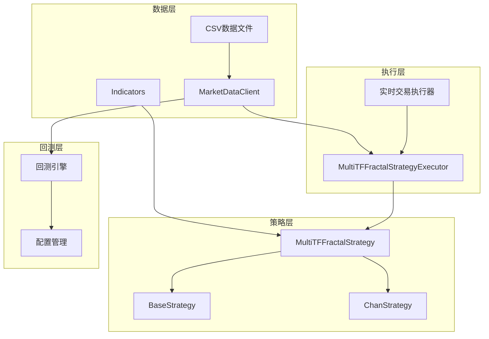
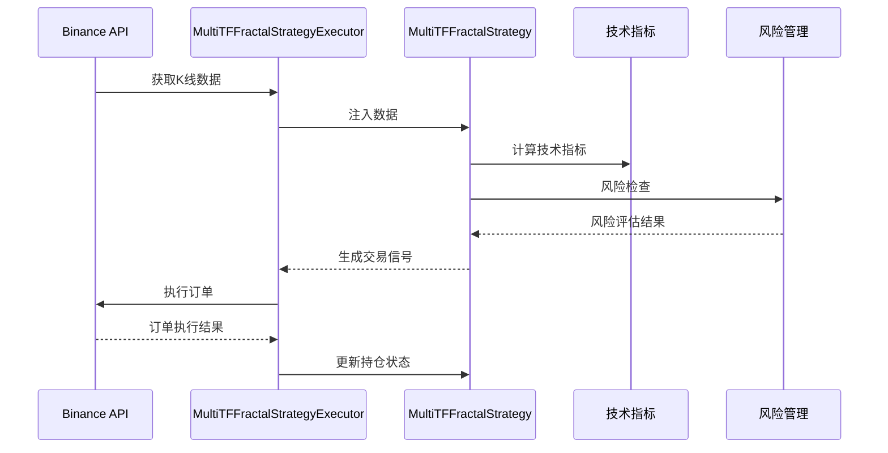
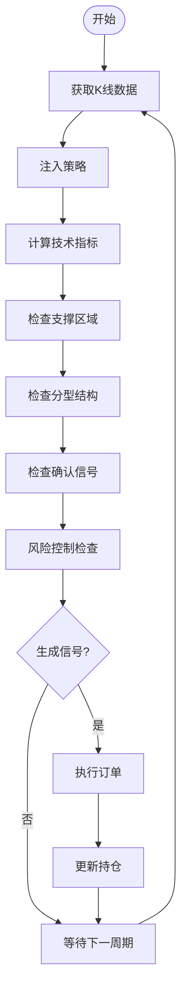
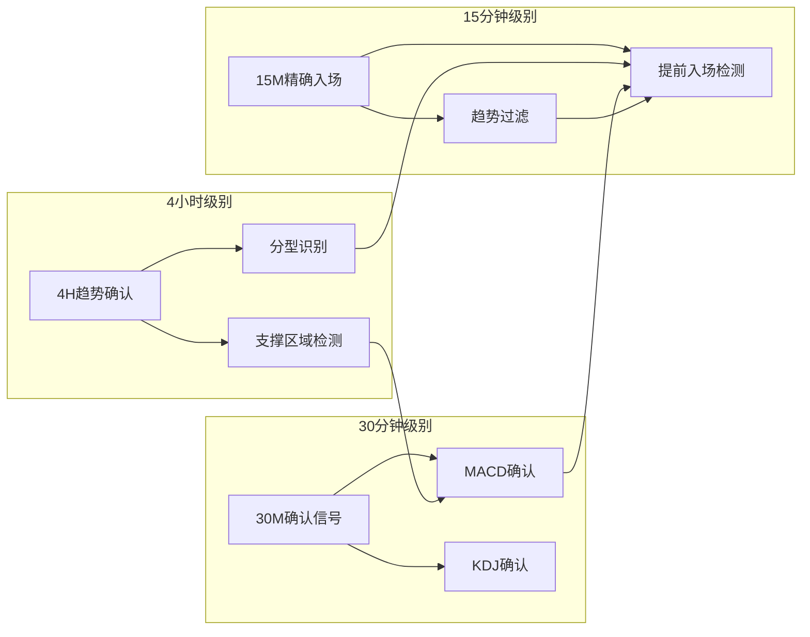
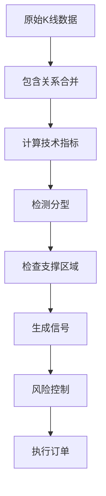
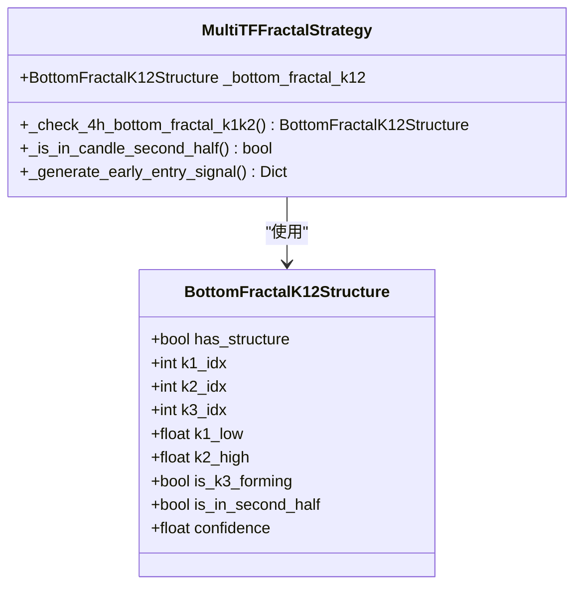
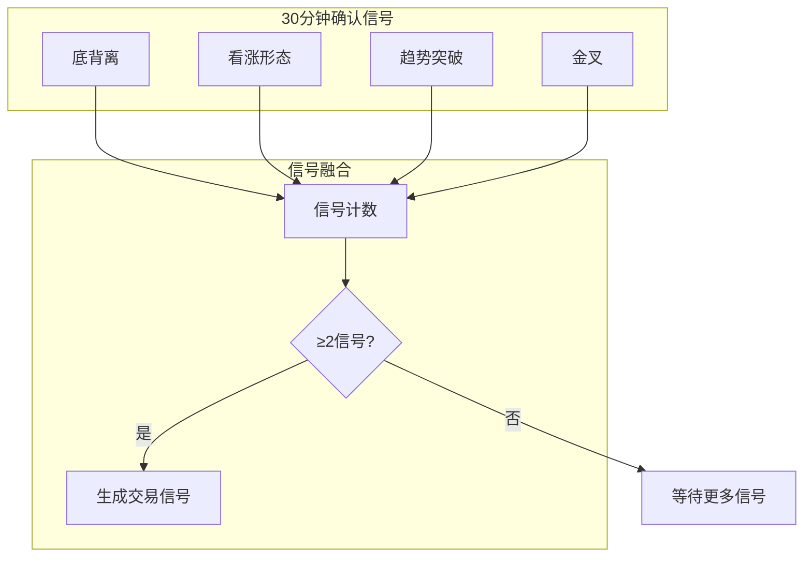
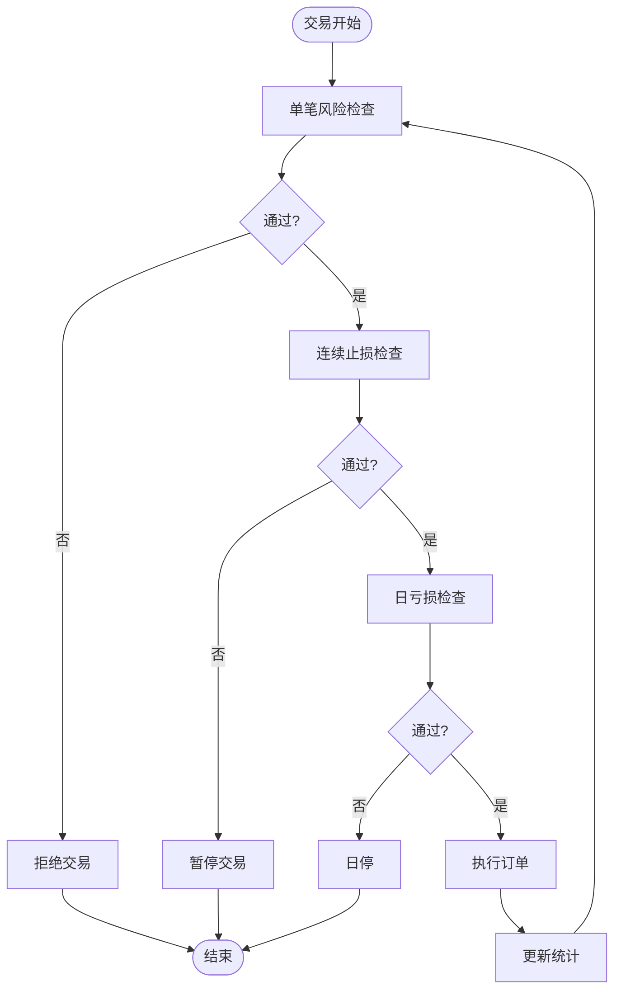
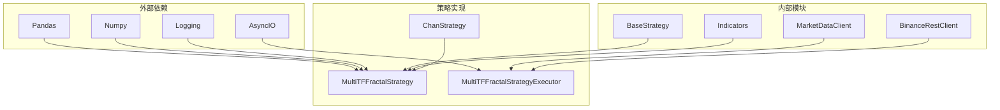

# 多时间框架策略

<cite>
**本文档引用的文件**
- [mtf_fractal_strategy.py](file://trading_system/strategies/mtf_fractal_strategy.py)
- [run_ethusdc_mtf_backtest.py](file://run_ethusdc_mtf_backtest.py)
- [run_ethusdc_mtf_live.py](file://run_ethusdc_mtf_live.py)
- [base_strategy.py](file://trading_system/strategies/base_strategy.py)
- [indicators.py](file://trading_system/utils/indicators.py)
- [market_data.py](file://trading_system/data/market_data.py)
- [chan_strategy.py](file://trading_system/strategies/chan_strategy.py)
- [run_backtest.py](file://trading_system/backtest/run_backtest.py)
- [backtest_engine.py](file://trading_system/strategies/backtest_engine.py)
- [ETHUSDC_4h.csv](file://trading_system/data/binance_history/ETHUSDC_4h.csv)
</cite>

## 目录
1. [简介](#简介)
2. [项目结构](#项目结构)
3. [核心组件](#核心组件)
4. [架构概览](#架构概览)
5. [详细组件分析](#详细组件分析)
6. [依赖分析](#依赖分析)
7. [性能考虑](#性能考虑)
8. [故障排除指南](#故障排除指南)
9. [结论](#结论)
10. [附录](#附录)

## 简介

多时间框架策略是一种基于多个时间周期数据协同分析的交易策略。该策略通过整合4小时、30分钟和15分钟级别的市场信息，实现更准确的市场趋势判断和入场时机把握。

### 核心特点

- **多周期共振**：4小时趋势确认 + 30分钟确认信号 + 15分钟精确入场
- **分型识别**：基于缠论理论的底分型和顶分型识别
- **动态风险管理**：ATR动态止损、连续止损暂停机制
- **双向交易**：支持多头和空头双向交易
- **智能提前入场**：基于15分钟级别的底分型预判机制

## 项目结构

该项目采用模块化架构，主要包含以下核心模块：



**图表来源**
- [mtf_fractal_strategy.py:85-186](file://trading_system/strategies/mtf_fractal_strategy.py#L85-L186)
- [base_strategy.py:8-52](file://trading_system/strategies/base_strategy.py#L8-L52)
- [chan_strategy.py:102-172](file://trading_system/strategies/chan_strategy.py#L102-L172)

**章节来源**
- [mtf_fractal_strategy.py:1-100](file://trading_system/strategies/mtf_fractal_strategy.py#L1-L100)
- [run_ethusdc_mtf_backtest.py:1-50](file://run_ethusdc_mtf_backtest.py#L1-L50)

## 核心组件

### MultiTFFractalStrategy 核心策略类

MultiTFFractalStrategy 是多时间框架分型策略的核心实现，负责：

- **多周期数据处理**：4小时、30分钟、15分钟级别的K线数据处理
- **分型识别**：基于缠论理论的底分型和顶分型检测
- **信号生成**：多周期共振确认的交易信号生成
- **风险管理**：动态止损、仓位管理和风险控制

### MultiTFFractalStrategyExecutor 执行器

执行器负责策略的实际执行：

- **数据获取**：从Binance API获取实时K线数据
- **信号执行**：根据策略信号执行买卖订单
- **风险监控**：实时监控账户风险状况
- **日志记录**：详细的交易日志和诊断信息

### 基础策略框架

所有策略都继承自 BaseStrategy，提供统一的接口规范：

- **initialize**：策略初始化
- **on_bar**：K线数据回调
- **on_order_update**：订单状态更新
- **参数管理**：动态参数更新和查询

**章节来源**
- [mtf_fractal_strategy.py:85-232](file://trading_system/strategies/mtf_fractal_strategy.py#L85-L232)
- [base_strategy.py:8-168](file://trading_system/strategies/base_strategy.py#L8-L168)

## 架构概览

多时间框架策略采用分层架构设计，确保各组件职责清晰、耦合度低：



**图表来源**
- [mtf_fractal_strategy.py:2473-2710](file://trading_system/strategies/mtf_fractal_strategy.py#L2473-L2710)
- [run_ethusdc_mtf_live.py:2674-2710](file://run_ethusdc_mtf_live.py#L2674-L2710)

### 数据流架构



**图表来源**
- [mtf_fractal_strategy.py:204-232](file://trading_system/strategies/mtf_fractal_strategy.py#L204-L232)
- [mtf_fractal_strategy.py:723-800](file://trading_system/strategies/mtf_fractal_strategy.py#L723-L800)

## 详细组件分析

### 多时间框架协调机制

#### 时间框架层次结构

策略采用三层时间框架协调机制：



**图表来源**
- [mtf_fractal_strategy.py:348-468](file://trading_system/strategies/mtf_fractal_strategy.py#L348-L468)
- [mtf_fractal_strategy.py:506-722](file://trading_system/strategies/mtf_fractal_strategy.py#L506-L722)

#### K线数据处理流程



**图表来源**
- [mtf_fractal_strategy.py:233-232](file://trading_system/strategies/mtf_fractal_strategy.py#L233-L232)

### 分型识别算法

#### 底分型K1/K2结构检测

策略采用严格的分型识别标准：

1. **K1检测**：下跌K线（收盘价 < 开盘价）
2. **K2检测**：最低价低于K1最低价
3. **K3候选**：当前K线最低价高于K2最低价



**图表来源**
- [mtf_fractal_strategy.py:47-83](file://trading_system/strategies/mtf_fractal_strategy.py#L47-L83)
- [mtf_fractal_strategy.py:364-468](file://trading_system/strategies/mtf_fractal_strategy.py#L364-L468)

### 信号融合策略

#### 多信号确认机制

策略采用"4信号确认"机制：

1. **底背离确认**：MACD底背离信号
2. **看涨形态确认**：K线看涨形态识别
3. **趋势突破确认**：价格突破关键阻力位
4. **金叉确认**：MACD金叉信号



**图表来源**
- [mtf_fractal_strategy.py:723-800](file://trading_system/strategies/mtf_fractal_strategy.py#L723-L800)

### 参数配置详解

#### 核心参数配置

| 参数类别 | 参数名称 | 默认值 | 说明 |
|---------|----------|--------|------|
| **仓位管理** | probe_ratio | 0.40 | 试探性入场仓位比例 |
| | confirm_ratio | 0.40 | 确认加仓仓位比例 |
| | early_entry_ratio | 0.40 | 提前入场仓位比例 |
| **风险管理** | max_loss_per_trade_pct | 0.02 | 单笔最大亏损百分比 |
| | max_consecutive_stops | 3 | 连续止损次数上限 |
| | max_daily_loss_pct | 0.05 | 日最大亏损百分比 |
| | atr_multiplier | 5.0 | ATR倍数 |
| **时间框架** | trendline_period | 20 | 趋势线周期 |
| | k3_second_half_threshold | 0.4 | K3后半段阈值 |
| **过滤器** | enable_trend_filter | True | 启用趋势过滤器 |
| | enable_volume_filter | True | 启用成交量过滤器 |

#### 提前入场参数

| 参数名称 | 默认值 | 说明 |
|---------|--------|------|
| enable_early_entry | True | 启用提前入场功能 |
| early_entry_min_confidence | 0.6 | 提前入场最低置信度 |
| min_early_entry_conditions | 2 | 提前入场所需最少条件数 |
| k3_second_half_threshold | 0.4 | K3后半段判定阈值 |

**章节来源**
- [mtf_fractal_strategy.py:89-186](file://trading_system/strategies/mtf_fractal_strategy.py#L89-L186)
- [run_ethusdc_mtf_backtest.py:42-121](file://run_ethusdc_mtf_backtest.py#L42-L121)

### 风险控制机制

#### 多层风控体系



**图表来源**
- [mtf_fractal_strategy.py:168-186](file://trading_system/strategies/mtf_fractal_strategy.py#L168-L186)

#### 动态止损机制

策略采用ATR动态止损和固定止损双重保护：

1. **ATR动态止损**：基于ATR倍数的动态止损
2. **固定止损**：基于K线结构的固定止损
3. **爆仓保护**：防止极端行情导致的爆仓

**章节来源**
- [mtf_fractal_strategy.py:328-347](file://trading_system/strategies/mtf_fractal_strategy.py#L328-L347)
- [mtf_fractal_strategy.py:782-792](file://trading_system/strategies/mtf_fractal_strategy.py#L782-L792)

## 依赖分析

### 组件依赖关系



**图表来源**
- [mtf_fractal_strategy.py:13-27](file://trading_system/strategies/mtf_fractal_strategy.py#L13-L27)
- [base_strategy.py:1-6](file://trading_system/strategies/base_strategy.py#L1-L6)

### 数据依赖分析

策略对数据质量的要求：

1. **数据完整性**：确保4小时、30分钟、15分钟数据的完整性
2. **数据一致性**：保证不同时间框架数据的时间对齐
3. **数据时效性**：实时数据的及时性和准确性

**章节来源**
- [market_data.py:28-118](file://trading_system/data/market_data.py#L28-L118)
- [run_ethusdc_mtf_live.py:2674-2710](file://run_ethusdc_mtf_live.py#L2674-L2710)

## 性能考虑

### 计算性能优化

1. **向量化计算**：使用Pandas和NumPy进行向量化操作
2. **缓存机制**：技术指标结果缓存，避免重复计算
3. **异步处理**：使用AsyncIO提高并发处理能力

### 内存管理

1. **数据截断**：定期清理历史数据，控制内存使用
2. **批量处理**：批量获取和处理K线数据
3. **资源释放**：及时释放不再使用的资源

### 网络性能

1. **请求频率控制**：合理控制API请求频率，避免被限流
2. **错误重试机制**：网络异常时的自动重试
3. **连接池管理**：复用HTTP连接，减少连接开销

## 故障排除指南

### 常见问题及解决方案

#### 数据获取问题

**问题**：无法获取K线数据
**解决方案**：
1. 检查网络连接状态
2. 验证API密钥权限
3. 检查Binance API状态

#### 策略执行问题

**问题**：策略无法生成有效信号
**解决方案**：
1. 检查时间框架数据完整性
2. 验证技术指标计算正确性
3. 调整参数配置

#### 风险控制问题

**问题**：频繁触发风控机制
**解决方案**：
1. 调整风险参数阈值
2. 优化止损设置
3. 检查市场波动性

**章节来源**
- [run_ethusdc_mtf_live.py:2896-2898](file://run_ethusdc_mtf_live.py#L2896-L2898)
- [mtf_fractal_strategy.py:2715-2797](file://trading_system/strategies/mtf_fractal_strategy.py#L2715-L2797)

## 结论

多时间框架策略通过整合多个时间周期的数据，实现了更准确的市场分析和更可靠的交易信号。该策略的主要优势包括：

1. **多维度确认**：通过多个时间框架的信号确认，提高交易决策的准确性
2. **动态风险管理**：完善的风控机制，有效控制交易风险
3. **智能化入场**：基于分型理论的提前入场机制，把握最佳入场时机
4. **双向交易支持**：支持多头和空头双向交易，适应不同市场环境

该策略适合有一定经验的交易者使用，在实际应用中需要根据市场变化和个人风险承受能力适当调整参数配置。

## 附录

### 实际应用案例

#### 案例1：ETHUSDC多时间框架交易

在ETHUSDC交易对上，策略通过以下步骤实现交易：

1. **4小时趋势确认**：识别支撑区域和底分型结构
2. **30分钟确认**：验证MACD底背离和看涨形态
3. **15分钟精确入场**：利用提前入场机制精确把握入场时机
4. **动态风险管理**：基于ATR的动态止损和仓位管理

#### 案例2：回测验证

通过历史数据回测验证策略有效性：

1. **数据准备**：使用ETHUSDC_4h.csv等历史数据
2. **参数优化**：通过多次回测优化参数配置
3. **性能评估**：基于胜率、盈亏比、最大回撤等指标评估策略表现

### 性能评估指标

#### 关键指标

| 指标名称 | 计算公式 | 说明 |
|---------|---------|------|
| 胜率 | 获利交易数/总交易数 | 策略盈利能力的重要指标 |
| 盈亏比 | 平均盈利/平均亏损 | 衡量策略收益效率 |
| 最大回撤 | (峰值-谷值)/峰值 | 风险控制的重要参考 |
| 年化收益率 | (最终资产/初始资产)^(252/交易日数)-1 | 策略长期表现指标 |
| 夏普比率 | (年化收益率-无风险利率)/年化波动率 | 风险调整后收益指标 |

#### 回测工具使用

```bash
# 运行多时间框架策略回测
python run_ethusdc_mtf_backtest.py

# 指定参数运行回测
python run_ethusdc_mtf_backtest.py \
    --symbol ETHUSDC \
    --capital 20000 \
    --days 180 \
    --enable-early-entry \
    --enable-early-short-entry
```

**章节来源**
- [run_ethusdc_mtf_backtest.py:31-158](file://run_ethusdc_mtf_backtest.py#L31-L158)
- [ETHUSDC_4h.csv:1-50](file://trading_system/data/binance_history/ETHUSDC_4h.csv#L1-L50)