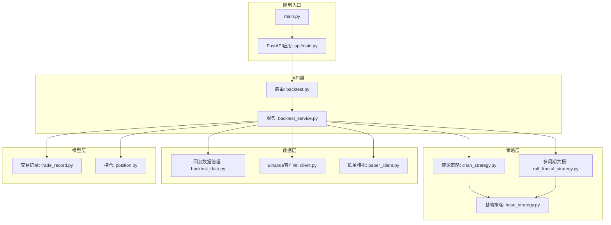
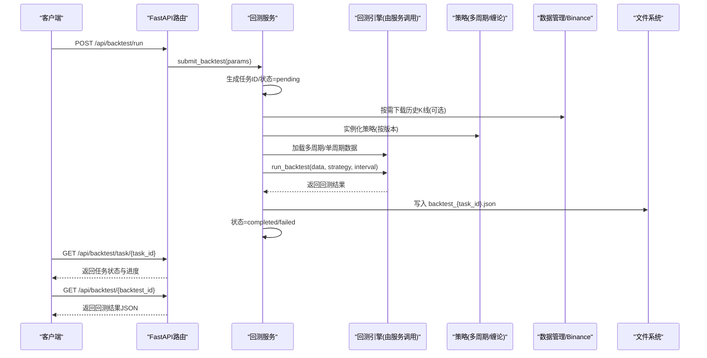
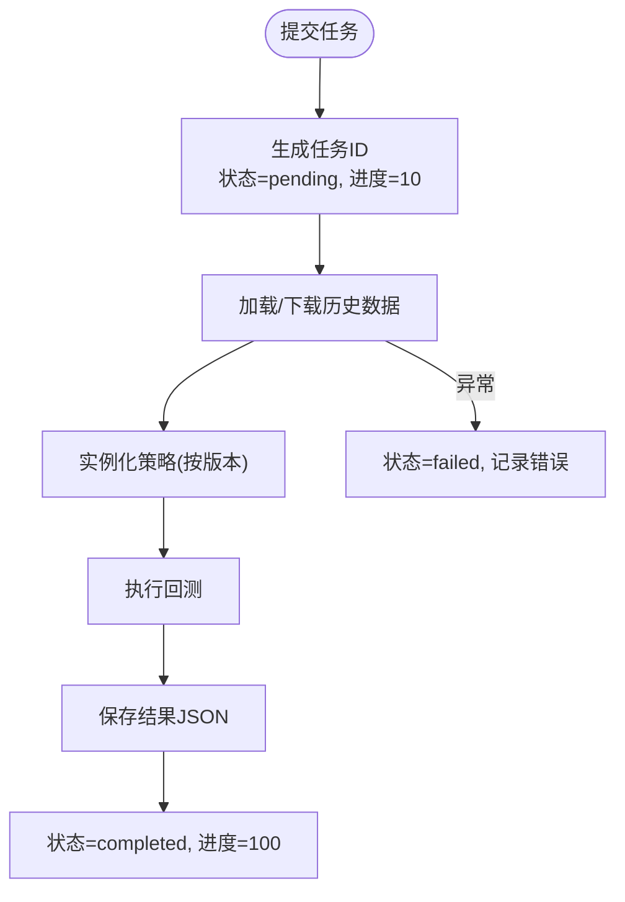
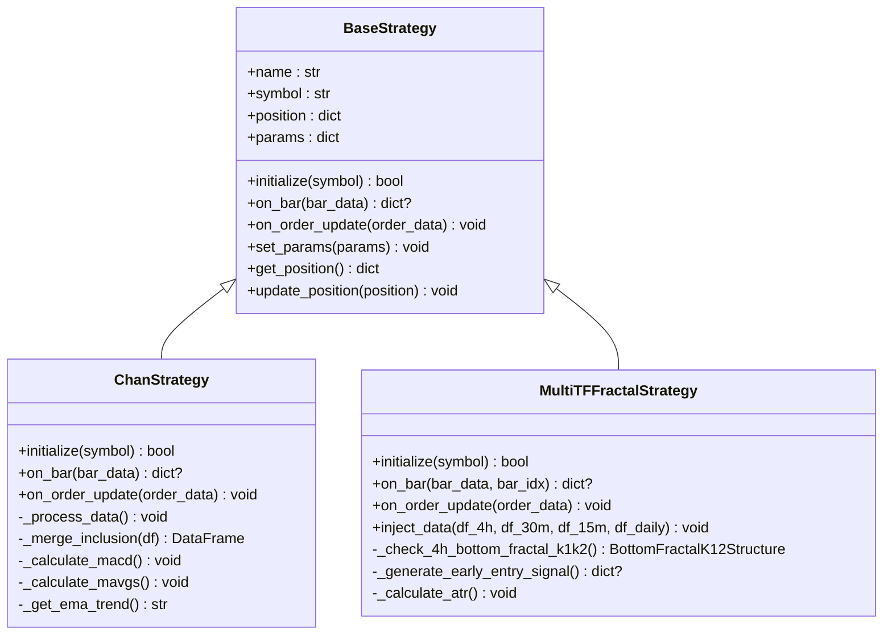
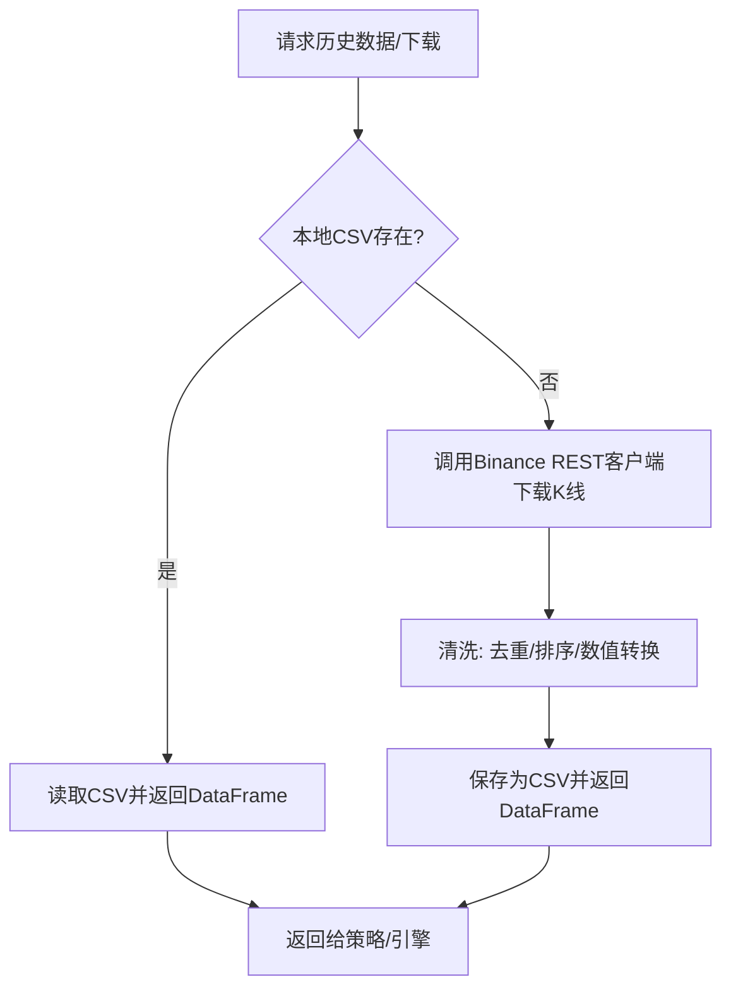
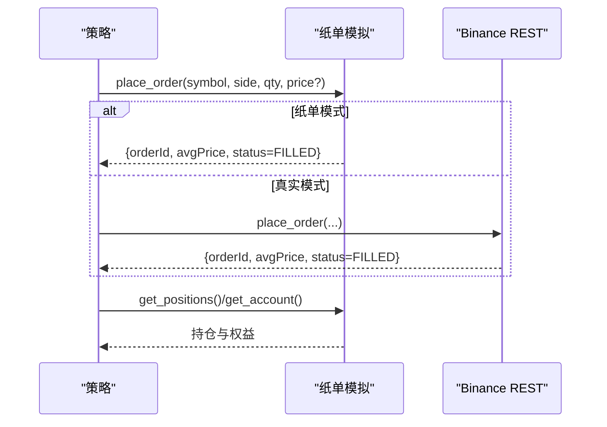
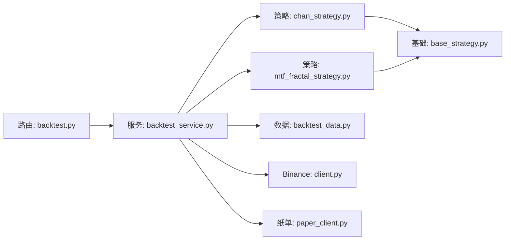

# 策略回测系统

<cite>
**本文引用的文件**
- [README.md](file://README.md)
- [main.py](file://main.py)
- [trading_system/api/main.py](file://trading_system/api/main.py)
- [trading_system/api/routers/backtest.py](file://trading_system/api/routers/backtest.py)
- [trading_system/api/services/backtest_service.py](file://trading_system/api/services/backtest_service.py)
- [trading_system/data/backtest_data.py](file://trading_system/data/backtest_data.py)
- [trading_system/binance/client.py](file://trading_system/binance/client.py)
- [trading_system/binance/paper_client.py](file://trading_system/binance/paper_client.py)
- [trading_system/models/trade_record.py](file://trading_system/models/trade_record.py)
- [trading_system/models/position.py](file://trading_system/models/position.py)
- [trading_system/strategies/base_strategy.py](file://trading_system/strategies/base_strategy.py)
- [trading_system/strategies/chan_strategy.py](file://trading_system/strategies/chan_strategy.py)
- [trading_system/strategies/mtf_fractal_strategy.py](file://trading_system/strategies/mtf_fractal_strategy.py)
</cite>

## 目录
1. [简介](#简介)
2. [项目结构](#项目结构)
3. [核心组件](#核心组件)
4. [架构总览](#架构总览)
5. [详细组件分析](#详细组件分析)
6. [依赖关系分析](#依赖关系分析)
7. [性能考量](#性能考量)
8. [故障排查指南](#故障排查指南)
9. [结论](#结论)
10. [附录](#附录)

## 简介
本文件为“策略回测系统”的全面技术文档，面向策略工程师与量化研究人员，系统阐述回测引擎的工作原理、数据处理流程、模拟交易执行、性能评估与可视化、参数优化与过拟合规避、任务管理与状态跟踪、以及错误处理机制。系统支持多周期共振策略、缠论策略及多指标策略，并提供REST API驱动的回测任务提交与查询。

## 项目结构
项目采用分层架构：API层负责对外提供回测任务提交与查询；服务层封装回测调度、任务状态管理与结果持久化；策略层提供多种策略实现；数据层负责历史数据加载与本地CSV管理；Binance适配层提供REST与纸单模拟交易能力；模型层定义交易记录与持仓数据结构。

图表来源
- [trading_system/api/routers/backtest.py](file://trading_system/api/routers/backtest.py)
- [trading_system/api/services/backtest_service.py](file://trading_system/api/services/backtest_service.py)
- [trading_system/strategies/base_strategy.py](file://trading_system/strategies/base_strategy.py)
- [trading_system/strategies/chan_strategy.py](file://trading_system/strategies/chan_strategy.py)
- [trading_system/strategies/mtf_fractal_strategy.py](file://trading_system/strategies/mtf_fractal_strategy.py)
- [trading_system/data/backtest_data.py](file://trading_system/data/backtest_data.py)
- [trading_system/binance/client.py](file://trading_system/binance/client.py)
- [trading_system/binance/paper_client.py](file://trading_system/binance/paper_client.py)
- [trading_system/models/trade_record.py](file://trading_system/models/trade_record.py)
- [trading_system/models/position.py](file://trading_system/models/position.py)
- [main.py](file://main.py)
- [trading_system/api/main.py](file://trading_system/api/main.py)

章节来源
- [README.md](file://README.md)
- [main.py](file://main.py)
- [trading_system/api/main.py](file://trading_system/api/main.py)

## 核心组件
- API路由与服务
  - 路由定义回测任务提交、任务状态查询、结果列表与参数模板。
  - 服务层负责任务提交、并发执行、进度与状态管理、结果落盘与模糊匹配查询。
- 策略体系
  - 基础策略抽象定义初始化、K线回调与订单更新接口。
  - 缠论策略：基于分型、笔、线段与MACD背驰的多周期分析。
  - 多周期共振策略：结合4h/30m/15m/日线的共振与提前入场机制。
- 数据与适配
  - 回测数据管理器：加载本地CSV与按需下载Binance历史K线。
  - Binance REST客户端：提供永续/现货K线、下单、查询、取消等接口。
  - 纸单模拟客户端：在本地模拟账户、订单、成交与盈亏，便于无风险验证。
- 模型与记录
  - 交易记录与持仓模型，支撑回测结果统计与风控校验。

章节来源
- [trading_system/api/routers/backtest.py](file://trading_system/api/routers/backtest.py)
- [trading_system/api/services/backtest_service.py](file://trading_system/api/services/backtest_service.py)
- [trading_system/strategies/base_strategy.py](file://trading_system/strategies/base_strategy.py)
- [trading_system/strategies/chan_strategy.py](file://trading_system/strategies/chan_strategy.py)
- [trading_system/strategies/mtf_fractal_strategy.py](file://trading_system/strategies/mtf_fractal_strategy.py)
- [trading_system/data/backtest_data.py](file://trading_system/data/backtest_data.py)
- [trading_system/binance/client.py](file://trading_system/binance/client.py)
- [trading_system/binance/paper_client.py](file://trading_system/binance/paper_client.py)
- [trading_system/models/trade_record.py](file://trading_system/models/trade_record.py)
- [trading_system/models/position.py](file://trading_system/models/position.py)

## 架构总览
回测系统通过FastAPI提供REST接口，服务层异步执行回测任务，策略层按版本选择具体策略，数据层负责历史K线加载与实时下载，Binance适配层提供真实或模拟交易通道，最终将回测结果写入JSON文件并可查询。

图表来源
- [trading_system/api/routers/backtest.py](file://trading_system/api/routers/backtest.py)
- [trading_system/api/services/backtest_service.py](file://trading_system/api/services/backtest_service.py)

## 详细组件分析

### 回测服务与任务管理
- 任务生命周期
  - 提交：生成唯一任务ID，状态=pending，进度=10。
  - 运行：切换状态=running，按阶段推进进度（加载数据、实例化策略、执行回测、保存结果）。
  - 完成/失败：写入结果文件，状态=completed或failed，记录错误信息。
- 任务状态查询
  - 支持按任务ID查询状态与进度，便于前端轮询展示。
- 结果检索
  - 列表接口扫描结果目录，解析JSON摘要字段。
  - 单次结果支持模糊匹配文件名，提升容错性。

图表来源
- [trading_system/api/services/backtest_service.py](file://trading_system/api/services/backtest_service.py)

章节来源
- [trading_system/api/routers/backtest.py](file://trading_system/api/routers/backtest.py)
- [trading_system/api/services/backtest_service.py](file://trading_system/api/services/backtest_service.py)

### 策略接口与实现
- 基础策略接口
  - initialize(symbol): 初始化策略，加载数据、设置参数。
  - on_bar(bar_data): 接收K线数据，生成交易信号。
  - on_order_update(order_data): 订单状态更新回调，更新内部持仓。
  - set_params/get_position/update_position: 参数注入与持仓查询/更新。
- 缠论策略
  - 多周期数据处理：包含关系合并、MACD计算、均线共振、EMA趋势判断。
  - 分型/笔/线段识别：构建走势结构，辅助背驰判断。
  - 信号生成：结合背驰与趋势，输出买卖信号与仓位系数。
- 多周期共振策略
  - 4h底分型K1/K2结构检测，15m一买/二买与趋势确认，K3后半段提前入场。
  - 多层风控：单笔止损、连续止损暂停、日累计止损限制。
  - 支撑/阻力自动计算，ATR动态止盈止损。

图表来源
- [trading_system/strategies/base_strategy.py](file://trading_system/strategies/base_strategy.py)
- [trading_system/strategies/chan_strategy.py](file://trading_system/strategies/chan_strategy.py)
- [trading_system/strategies/mtf_fractal_strategy.py](file://trading_system/strategies/mtf_fractal_strategy.py)

章节来源
- [trading_system/strategies/base_strategy.py](file://trading_system/strategies/base_strategy.py)
- [trading_system/strategies/chan_strategy.py](file://trading_system/strategies/chan_strategy.py)
- [trading_system/strategies/mtf_fractal_strategy.py](file://trading_system/strategies/mtf_fractal_strategy.py)

### 数据加载与历史数据准备
- 本地CSV加载
  - 从指定目录加载K线CSV，返回DataFrame；失败返回空DataFrame并记录错误。
- 实时下载与清洗
  - 按周期批量拉取K线，去重、排序、数值转换、保存为CSV。
  - 支持多周期（4h/30m/15m/1d）下载，用于多周期策略。
- 可用日期范围查询
  - 解析CSV首尾时间，返回可用历史数据区间。

图表来源
- [trading_system/data/backtest_data.py](file://trading_system/data/backtest_data.py)
- [trading_system/binance/client.py](file://trading_system/binance/client.py)

章节来源
- [trading_system/data/backtest_data.py](file://trading_system/data/backtest_data.py)
- [trading_system/binance/client.py](file://trading_system/binance/client.py)

### 模拟交易执行与风控
- 纸单模拟客户端
  - 本地维护余额、持仓、订单与成交流水，按市价瞬时成交。
  - 计算未实现盈亏、手续费、净盈亏，支持平仓与开仓。
  - 与Binance REST客户端接口保持一致，便于替换。
- 真实交易适配
  - Binance REST客户端提供下单、查询、取消、账户与K线接口。
- 风控要点
  - 多周期策略内置止损、止盈、ATR动态止盈止损、连续止损暂停、日累计止损限制。

图表来源
- [trading_system/binance/paper_client.py](file://trading_system/binance/paper_client.py)
- [trading_system/binance/client.py](file://trading_system/binance/client.py)

章节来源
- [trading_system/binance/paper_client.py](file://trading_system/binance/paper_client.py)
- [trading_system/binance/client.py](file://trading_system/binance/client.py)

### 性能评估与结果分析
- 结果落盘与查询
  - 服务层将回测结果写入JSON文件，包含净值曲线、总收益、胜率、最大回撤、夏普比率等关键指标。
  - 列表接口扫描结果目录，解析摘要字段；单次结果支持模糊匹配文件名。
- 指标说明
  - 净利润、总收益率、总交易次数、胜率、最大回撤百分比、夏普比率等，用于策略对比与筛选。
- 可视化建议
  - 前端可基于回测时间序列与净值曲线绘制收益与回撤可视化图表。

章节来源
- [trading_system/api/services/backtest_service.py](file://trading_system/api/services/backtest_service.py)

### 回测配置参数与执行流程
- 回测参数模板
  - 交易对、周期、初始资金、杠杆、投资比例、手续费、滑点、策略版本、是否启用提前入场等。
- 执行流程
  - 提交任务 → 下载/加载数据 → 实例化策略 → 执行回测 → 保存结果 → 查询状态/结果。

章节来源
- [trading_system/api/routers/backtest.py](file://trading_system/api/routers/backtest.py)
- [trading_system/api/services/backtest_service.py](file://trading_system/api/services/backtest_service.py)

## 依赖关系分析
- 组件耦合
  - API路由依赖服务层；服务层依赖策略、数据与Binance适配；策略依赖基础策略接口。
- 外部依赖
  - FastAPI、Pydantic、SQLAlchemy、Binance SDK、pandas/numpy。
- 潜在循环依赖
  - 通过服务层集中编排，避免策略与API直接耦合，降低循环依赖风险。

图表来源
- [trading_system/api/routers/backtest.py](file://trading_system/api/routers/backtest.py)
- [trading_system/api/services/backtest_service.py](file://trading_system/api/services/backtest_service.py)
- [trading_system/strategies/chan_strategy.py](file://trading_system/strategies/chan_strategy.py)
- [trading_system/strategies/mtf_fractal_strategy.py](file://trading_system/strategies/mtf_fractal_strategy.py)
- [trading_system/strategies/base_strategy.py](file://trading_system/strategies/base_strategy.py)
- [trading_system/data/backtest_data.py](file://trading_system/data/backtest_data.py)
- [trading_system/binance/client.py](file://trading_system/binance/client.py)
- [trading_system/binance/paper_client.py](file://trading_system/binance/paper_client.py)

章节来源
- [trading_system/api/routers/backtest.py](file://trading_system/api/routers/backtest.py)
- [trading_system/api/services/backtest_service.py](file://trading_system/api/services/backtest_service.py)

## 性能考量
- 数据加载
  - 优先使用本地CSV，必要时按需下载；对大数据集进行去重与数值转换，减少后续计算成本。
- 并发与I/O
  - 服务层使用线程池异步执行回测任务，避免阻塞API响应；Binance调用通过事件循环桥接。
- 策略复杂度
  - 缠论与多周期策略涉及多周期K线与指标计算，建议在策略内缓存中间结果，避免重复计算。
- 可视化与结果
  - 结果JSON仅包含关键指标，前端按需渲染图表，降低传输与渲染压力。

## 故障排查指南
- 任务状态异常
  - 检查任务ID是否存在、服务层日志是否有异常堆栈；查看任务状态与错误信息。
- 数据加载失败
  - 确认CSV文件存在与格式正确；若启用实时下载，检查网络与Binance凭证配置。
- 策略初始化失败
  - 查看策略日志，确认所需周期数据是否加载成功；检查参数合法性。
- 纸单下单失败
  - 检查余额是否充足、价格是否可解析；确认模拟模式下瞬时成交逻辑。
- API健康检查
  - 通过健康检查端点确认数据库连接状态，定位连接失败问题。

章节来源
- [trading_system/api/services/backtest_service.py](file://trading_system/api/services/backtest_service.py)
- [trading_system/binance/paper_client.py](file://trading_system/binance/paper_client.py)
- [trading_system/api/main.py](file://trading_system/api/main.py)

## 结论
本回测系统通过清晰的分层设计与可插拔的策略架构，实现了从数据加载、策略执行到结果落盘与查询的全链路闭环。多周期共振与缠论策略提供了丰富的技术分析维度，配合纸单模拟与风控机制，可在低风险环境下高效验证策略可行性。建议在实际部署中关注数据质量、参数稳定性与过拟合规避，持续迭代策略与参数空间。

## 附录
- 回测参数模板
  - 交易对、周期、初始资金、杠杆、投资比例、手续费、滑点、策略版本、提前入场相关参数等。
- 历史数据范围
  - 通过接口查询可用历史日期范围，指导回测时间窗设定。
- 错误码与状态
  - 服务层统一异常处理，返回标准错误结构；任务状态包含pending/running/completed/failed与进度百分比。

章节来源
- [trading_system/api/services/backtest_service.py](file://trading_system/api/services/backtest_service.py)
- [trading_system/api/routers/backtest.py](file://trading_system/api/routers/backtest.py)