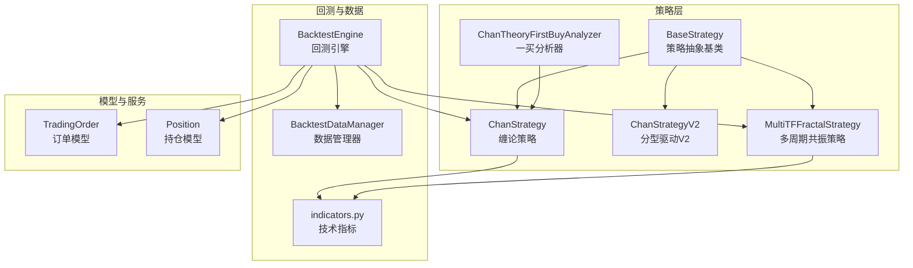
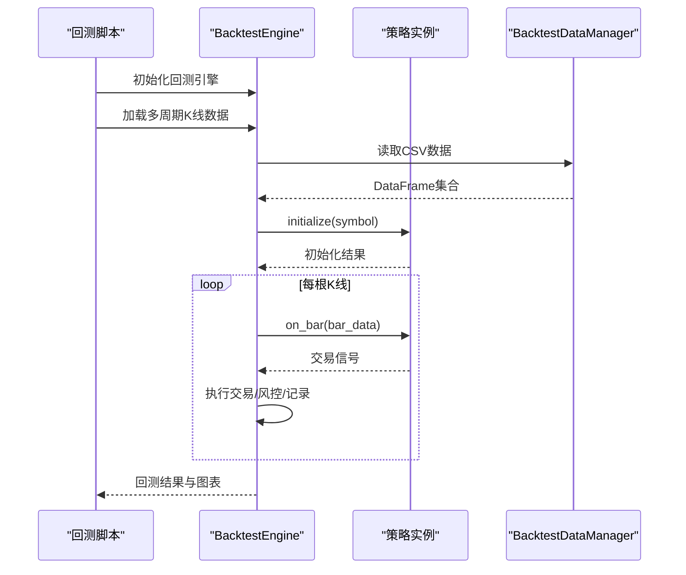
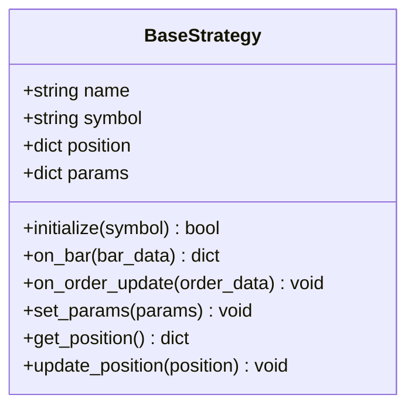
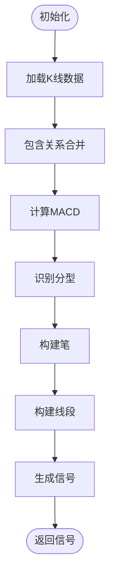
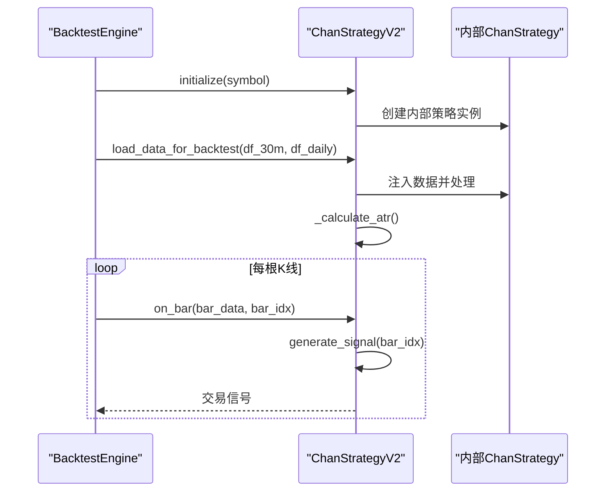
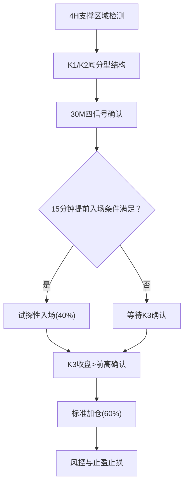
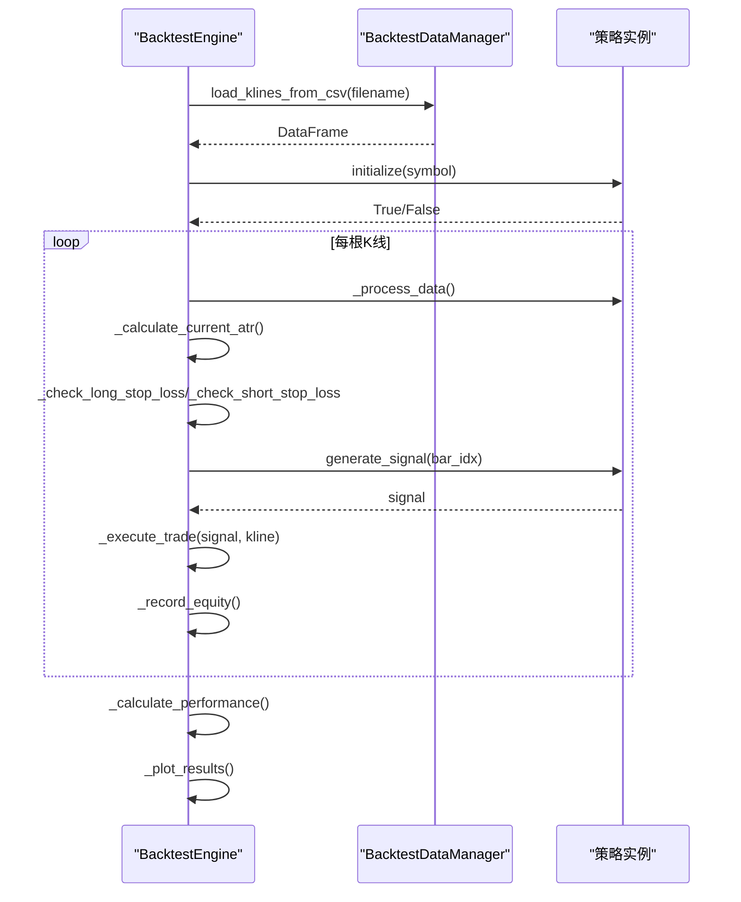
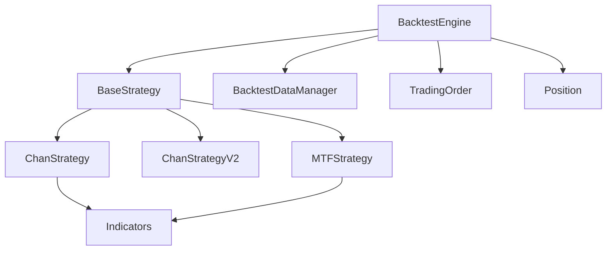

# 策略引擎架构

<cite>
**本文档引用的文件**
- [trading_system/strategies/base_strategy.py](file://trading_system/strategies/base_strategy.py)
- [trading_system/strategies/backtest_engine.py](file://trading_system/strategies/backtest_engine.py)
- [trading_system/strategies/chan_strategy.py](file://trading_system/strategies/chan_strategy.py)
- [trading_system/strategies/chan_strategy_v2.py](file://trading_system/strategies/chan_strategy_v2.py)
- [trading_system/strategies/mtf_fractal_strategy.py](file://trading_system/strategies/mtf_fractal_strategy.py)
- [trading_system/strategies/chan_first_buy_strategy.py](file://trading_system/strategies/chan_first_buy_strategy.py)
- [trading_system/data/backtest_data.py](file://trading_system/data/backtest_data.py)
- [trading_system/utils/indicators.py](file://trading_system/utils/indicators.py)
- [trading_system/models/trading_order.py](file://trading_system/models/trading_order.py)
- [trading_system/models/position.py](file://trading_system/models/position.py)
- [run_ethusdc_mtf_backtest.py](file://run_ethusdc_mtf_backtest.py)
- [run_crypto_chan_backtest.py](file://run_crypto_chan_backtest.py)
</cite>

## 目录
1. [简介](#简介)
2. [项目结构](#项目结构)
3. [核心组件](#核心组件)
4. [架构概览](#架构概览)
5. [详细组件分析](#详细组件分析)
6. [依赖关系分析](#依赖关系分析)
7. [性能考量](#性能考量)
8. [故障排除指南](#故障排除指南)
9. [结论](#结论)
10. [附录](#附录)

## 简介
本技术文档面向策略引擎架构，深入解析回测引擎的设计原理、策略调度机制与数据流处理。重点阐述BaseStrategy基类的抽象接口设计、策略生命周期管理与事件驱动机制，并详细说明策略初始化流程、K线数据处理回调与订单状态更新处理。文档还涵盖策略注册、并发执行与资源管理等核心功能，并提供策略引擎的扩展点与自定义开发指南。

## 项目结构
策略引擎位于 trading_system/strategies 目录，围绕策略基类 BaseStrategy 构建多种策略实现，包括缠论策略、多周期共振策略与V2版本等。数据加载与回测执行通过 BacktestEngine 完成，指标工具与模型定义位于 utils 与 models 子模块。顶层脚本 run_ethusdc_mtf_backtest.py 与 run_crypto_chan_backtest.py 提供策略回测入口。

**图表来源**
- [trading_system/strategies/base_strategy.py:8-168](file://trading_system/strategies/base_strategy.py#L8-168)
- [trading_system/strategies/chan_strategy.py:102-241](file://trading_system/strategies/chan_strategy.py#L102-241)
- [trading_system/strategies/chan_strategy_v2.py:37-154](file://trading_system/strategies/chan_strategy_v2.py#L37-154)
- [trading_system/strategies/mtf_fractal_strategy.py:85-186](file://trading_system/strategies/mtf_fractal_strategy.py#L85-186)
- [trading_system/strategies/backtest_engine.py:228-539](file://trading_system/strategies/backtest_engine.py#L228-539)
- [trading_system/data/backtest_data.py:9-46](file://trading_system/data/backtest_data.py#L9-46)
- [trading_system/utils/indicators.py:6-451](file://trading_system/utils/indicators.py#L6-451)
- [trading_system/models/trading_order.py:26-43](file://trading_system/models/trading_order.py#L26-43)
- [trading_system/models/position.py:6-18](file://trading_system/models/position.py#L6-18)

**章节来源**
- [trading_system/strategies/__init__.py:1-38](file://trading_system/strategies/__init__.py#L1-38)
- [run_ethusdc_mtf_backtest.py:1-334](file://run_ethusdc_mtf_backtest.py#L1-334)
- [run_crypto_chan_backtest.py:1-334](file://run_crypto_chan_backtest.py#L1-334)

## 核心组件
- BaseStrategy 抽象基类：定义策略初始化、K线回调与订单更新回调的异步接口，提供参数设置与持仓查询/更新能力。
- 策略实现：
  - ChanStrategy：基于缠论的多周期分析策略，包含分型、笔、线段识别与MACD背驰判断。
  - ChanStrategyV2：分型驱动的V2策略，支持动态加仓与即时反转，配置化参数体系。
  - MultiTFFractalStrategy：多周期共振分型策略，结合4H/30M/15M信号与自动支撑阻力位。
  - ChanTheoryFirstBuyAnalyzer：一买分析器，提供中枢、背驰与多级别确认维度。
- BacktestEngine：回测引擎，负责数据加载、状态重置、回测循环、交易执行与绩效统计。
- BacktestDataManager：本地CSV数据加载器，支持多周期K线数据读取。
- 指标工具：indicators.py 提供MACD、EMA、MA、ATR等技术指标计算。
- 模型：TradingOrder、Position 定义订单与持仓的数据库模型。

**章节来源**
- [trading_system/strategies/base_strategy.py:8-168](file://trading_system/strategies/base_strategy.py#L8-168)
- [trading_system/strategies/chan_strategy.py:102-241](file://trading_system/strategies/chan_strategy.py#L102-241)
- [trading_system/strategies/chan_strategy_v2.py:37-154](file://trading_system/strategies/chan_strategy_v2.py#L37-154)
- [trading_system/strategies/mtf_fractal_strategy.py:85-186](file://trading_system/strategies/mtf_fractal_strategy.py#L85-186)
- [trading_system/strategies/backtest_engine.py:228-539](file://trading_system/strategies/backtest_engine.py#L228-539)
- [trading_system/data/backtest_data.py:9-46](file://trading_system/data/backtest_data.py#L9-46)
- [trading_system/utils/indicators.py:6-451](file://trading_system/utils/indicators.py#L6-451)
- [trading_system/models/trading_order.py:26-43](file://trading_system/models/trading_order.py#L26-43)
- [trading_system/models/position.py:6-18](file://trading_system/models/position.py#L6-18)

## 架构概览
策略引擎采用“策略抽象 + 多策略实现 + 回测引擎”的分层架构。BaseStrategy 提供统一接口，具体策略实现各自的数据处理与信号生成逻辑；BacktestEngine 作为调度中心，协调数据加载、策略初始化、K线循环处理与交易执行；指标工具与模型为策略与回测提供基础设施。

**图表来源**
- [trading_system/strategies/backtest_engine.py:445-539](file://trading_system/strategies/backtest_engine.py#L445-539)
- [trading_system/strategies/chan_strategy.py:242-336](file://trading_system/strategies/chan_strategy.py#L242-336)
- [trading_system/data/backtest_data.py:22-45](file://trading_system/data/backtest_data.py#L22-45)

**章节来源**
- [trading_system/strategies/backtest_engine.py:228-539](file://trading_system/strategies/backtest_engine.py#L228-539)
- [run_ethusdc_mtf_backtest.py:216-329](file://run_ethusdc_mtf_backtest.py#L216-329)
- [run_crypto_chan_backtest.py:216-329](file://run_crypto_chan_backtest.py#L216-329)

## 详细组件分析

### BaseStrategy 抽象基类
- 设计目标：统一策略接口规范，封装策略共有属性（名称、交易品种、持仓、参数），定义与回测/实盘引擎交互协议。
- 关键接口：
  - initialize(symbol): 异步初始化，加载数据、设置指标、配置参数。
  - on_bar(bar_data): 异步K线回调，生成交易信号。
  - on_order_update(order_data): 异步订单更新回调，更新内部状态。
- 工具方法：
  - set_params(params): 参数增量更新并记录日志。
  - get_position()/update_position(position): 持仓查询与更新。

**图表来源**
- [trading_system/strategies/base_strategy.py:8-168](file://trading_system/strategies/base_strategy.py#L8-168)

**章节来源**
- [trading_system/strategies/base_strategy.py:8-168](file://trading_system/strategies/base_strategy.py#L8-168)

### 缠论策略 ChanStrategy
- 核心逻辑：数据预处理（包含关系合并）、MACD计算、分型识别、笔与线段构建、背驰判断与信号生成。
- 关键特性：
  - 支持5m/30m等周期，自动调整hg1参数。
  - 均线与EMA趋势指标辅助判断。
  - 共振验证与趋势过滤。
- 数据注入：支持通过Binance客户端或本地market_data获取数据；回测模式下由BacktestEngine注入数据。

**图表来源**
- [trading_system/strategies/chan_strategy.py:338-383](file://trading_system/strategies/chan_strategy.py#L338-383)
- [trading_system/strategies/chan_strategy.py:506-582](file://trading_system/strategies/chan_strategy.py#L506-582)

**章节来源**
- [trading_system/strategies/chan_strategy.py:102-241](file://trading_system/strategies/chan_strategy.py#L102-241)
- [trading_system/strategies/chan_strategy.py:338-383](file://trading_system/strategies/chan_strategy.py#L338-383)
- [trading_system/strategies/chan_strategy.py:506-665](file://trading_system/strategies/chan_strategy.py#L506-665)

### 缠论V2策略 ChanStrategyV2
- 核心特性：分型驱动、动态加仓（最多3次）、即时反转、配置化参数。
- 数据处理：通过内部ChanStrategy完成数据处理，回测模式下由BacktestEngine注入数据，禁用包含关系合并以保证索引一致性。
- 信号生成：基于分型类型与持仓状态生成买入/卖出/反转信号，支持批量生成与状态更新。

**图表来源**
- [trading_system/strategies/chan_strategy_v2.py:156-194](file://trading_system/strategies/chan_strategy_v2.py#L156-194)
- [trading_system/strategies/chan_strategy_v2.py:196-240](file://trading_system/strategies/chan_strategy_v2.py#L196-240)
- [trading_system/strategies/chan_strategy_v2.py:531-542](file://trading_system/strategies/chan_strategy_v2.py#L531-542)

**章节来源**
- [trading_system/strategies/chan_strategy_v2.py:37-154](file://trading_system/strategies/chan_strategy_v2.py#L37-154)
- [trading_system/strategies/chan_strategy_v2.py:156-240](file://trading_system/strategies/chan_strategy_v2.py#L156-240)
- [trading_system/strategies/chan_strategy_v2.py:531-636](file://trading_system/strategies/chan_strategy_v2.py#L531-636)

### 多周期共振策略 MultiTFFractalStrategy
- 核心逻辑：4H检测支撑区域+底分型雏形，30M四信号确认，满足条件触发试探性入场；K3形成后确认加仓；支持15分钟提前入场（一买/二买）。
- 风控机制：单笔2%止损、连续3次止损暂停、日亏损5%停止；自动支撑/阻力位计算；ATR动态止损与止盈。
- 数据注入：由BacktestEngine注入4H/30M/15M/日线数据，计算多周期指标与结构。

**图表来源**
- [trading_system/strategies/mtf_fractal_strategy.py:364-468](file://trading_system/strategies/mtf_fractal_strategy.py#L364-468)
- [trading_system/strategies/mtf_fractal_strategy.py:723-800](file://trading_system/strategies/mtf_fractal_strategy.py#L723-800)

**章节来源**
- [trading_system/strategies/mtf_fractal_strategy.py:85-186](file://trading_system/strategies/mtf_fractal_strategy.py#L85-186)
- [trading_system/strategies/mtf_fractal_strategy.py:364-468](file://trading_system/strategies/mtf_fractal_strategy.py#L364-468)
- [trading_system/strategies/mtf_fractal_strategy.py:723-800](file://trading_system/strategies/mtf_fractal_strategy.py#L723-800)

### 一买分析器 ChanTheoryFirstBuyAnalyzer
- 功能：对4H/30M数据进行中枢、背驰与多级别确认分析，输出一买/二买/Similar二买等结果，提供建议入场价、止损价与目标位。
- 维度：走势结构力度对比、均线系统观察、成交量辅助验证、多级别联立确认。
- 输出：FirstBuyAnalysisResult/SecondBuyAnalysisResult/SimilarSecondBuyAnalysisResult等结构化结果。

**章节来源**
- [trading_system/strategies/chan_first_buy_strategy.py:219-285](file://trading_system/strategies/chan_first_buy_strategy.py#L219-285)
- [trading_system/strategies/chan_first_buy_strategy.py:352-400](file://trading_system/strategies/chan_first_buy_strategy.py#L352-400)
- [trading_system/strategies/chan_first_buy_strategy.py:477-513](file://trading_system/strategies/chan_first_buy_strategy.py#L477-513)
- [trading_system/strategies/chan_first_buy_strategy.py:554-610](file://trading_system/strategies/chan_first_buy_strategy.py#L554-610)

### 回测引擎 BacktestEngine
- 职责：加载本地CSV数据、初始化策略、执行回测循环、处理止损止盈、记录交易与权益曲线、生成可视化图表与结果。
- 关键流程：
  - load_data：按周期加载K线，支持5m/30m/1d等。
  - run_backtest：验证数据完整性、准备日线时间索引、执行回测循环。
  - _run_backtest_loop：逐根K线处理，先检查止损止盈，再生成信号并执行交易。
  - _calculate_performance/_plot_results：计算绩效指标与生成图表。
- 风险与资金费用：内置FundingFeeCalculator，按UTC结算时间点计算资金费用。

**图表来源**
- [trading_system/strategies/backtest_engine.py:366-408](file://trading_system/strategies/backtest_engine.py#L366-408)
- [trading_system/strategies/backtest_engine.py:445-539](file://trading_system/strategies/backtest_engine.py#L445-539)
- [trading_system/strategies/backtest_engine.py:566-644](file://trading_system/strategies/backtest_engine.py#L566-644)

**章节来源**
- [trading_system/strategies/backtest_engine.py:228-539](file://trading_system/strategies/backtest_engine.py#L228-539)
- [trading_system/strategies/backtest_engine.py:645-683](file://trading_system/strategies/backtest_engine.py#L645-683)
- [trading_system/strategies/backtest_engine.py:684-724](file://trading_system/strategies/backtest_engine.py#L684-724)

### 数据管理与指标工具
- BacktestDataManager：从CSV加载K线数据，支持多周期文件读取与错误处理。
- indicators：提供MACD、EMA、MA、ATR、量价模式检测等指标计算，支持Binance K线格式转换。

**章节来源**
- [trading_system/data/backtest_data.py:9-46](file://trading_system/data/backtest_data.py#L9-46)
- [trading_system/utils/indicators.py:6-451](file://trading_system/utils/indicators.py#L6-451)

### 订单与持仓模型
- TradingOrder：定义订单字段（side、order_type、status、fee等），与TradeRecord关联。
- Position：定义持仓字段（quantity、avg_cost、unrealized_profit等）。

**章节来源**
- [trading_system/models/trading_order.py:26-43](file://trading_system/models/trading_order.py#L26-43)
- [trading_system/models/position.py:6-18](file://trading_system/models/position.py#L6-18)

## 依赖关系分析
策略引擎的模块间依赖清晰，遵循“策略实现依赖指标工具，回测引擎协调策略与数据，模型为交易提供数据结构”的原则。ChanStrategy/ChanStrategyV2/MTFStrategy均依赖indicators与数据源；BacktestEngine依赖策略与数据管理器；订单与持仓模型为交易执行提供持久化支持。

**图表来源**
- [trading_system/strategies/base_strategy.py:8-168](file://trading_system/strategies/base_strategy.py#L8-168)
- [trading_system/strategies/chan_strategy.py:102-241](file://trading_system/strategies/chan_strategy.py#L102-241)
- [trading_system/strategies/chan_strategy_v2.py:37-154](file://trading_system/strategies/chan_strategy_v2.py#L37-154)
- [trading_system/strategies/mtf_fractal_strategy.py:85-186](file://trading_system/strategies/mtf_fractal_strategy.py#L85-186)
- [trading_system/strategies/backtest_engine.py:228-539](file://trading_system/strategies/backtest_engine.py#L228-539)
- [trading_system/data/backtest_data.py:9-46](file://trading_system/data/backtest_data.py#L9-46)
- [trading_system/utils/indicators.py:6-451](file://trading_system/utils/indicators.py#L6-451)
- [trading_system/models/trading_order.py:26-43](file://trading_system/models/trading_order.py#L26-43)
- [trading_system/models/position.py:6-18](file://trading_system/models/position.py#L6-18)

**章节来源**
- [trading_system/strategies/__init__.py:1-38](file://trading_system/strategies/__init__.py#L1-38)

## 性能考量
- 数据处理优化：BacktestEngine在回测循环中定期清理内存，减少长时间回测的内存占用。
- 指标计算：indicators采用向量化计算（pandas/numpy），提升MACD、ATR等指标的计算效率。
- 策略初始化：策略通过异步initialize减少I/O阻塞，V2策略在回测模式下避免网络请求。
- 可视化与结果：图表生成与结果保存在回测完成后进行，避免影响回测主循环性能。

[本节为通用指导，无需特定文件引用]

## 故障排除指南
- 数据加载失败：检查CSV文件是否存在与格式是否正确，确认时间列转换与日期过滤逻辑。
- 策略初始化失败：查看策略initialize返回值与日志，确认数据源可用性与参数配置。
- 回测异常：检查回测循环中的异常捕获与日志记录，定位具体K线索引与处理步骤。
- 订单状态更新：确保on_order_update回调正确更新内部持仓状态，避免状态不一致。

**章节来源**
- [trading_system/data/backtest_data.py:22-45](file://trading_system/data/backtest_data.py#L22-45)
- [trading_system/strategies/chan_strategy.py:242-336](file://trading_system/strategies/chan_strategy.py#L242-336)
- [trading_system/strategies/backtest_engine.py:536-538](file://trading_system/strategies/backtest_engine.py#L536-538)

## 结论
策略引擎通过BaseStrategy抽象接口与多策略实现，结合BacktestEngine的回测调度与指标工具，形成了可扩展、可配置、可维护的策略框架。V2策略进一步提升了信号生成的灵活性与风险管理能力；多周期共振策略增强了信号确认与提前入场能力。整体架构适合在实盘与回测环境中演进与扩展。

[本节为总结性内容，无需特定文件引用]

## 附录
- 策略注册：通过策略包导出统一入口，便于脚本与引擎集成。
- 扩展点：新增策略只需继承BaseStrategy并实现initialize/on_bar/on_order_update；回测引擎支持多周期数据注入与可视化输出。
- 自定义开发：建议在策略中增加参数校验与日志记录，确保初始化与信号生成的健壮性；在回测脚本中提供灵活的命令行参数与数据源选择。

**章节来源**
- [trading_system/strategies/__init__.py:1-38](file://trading_system/strategies/__init__.py#L1-38)
- [run_ethusdc_mtf_backtest.py:216-329](file://run_ethusdc_mtf_backtest.py#L216-329)
- [run_crypto_chan_backtest.py:216-329](file://run_crypto_chan_backtest.py#L216-329)