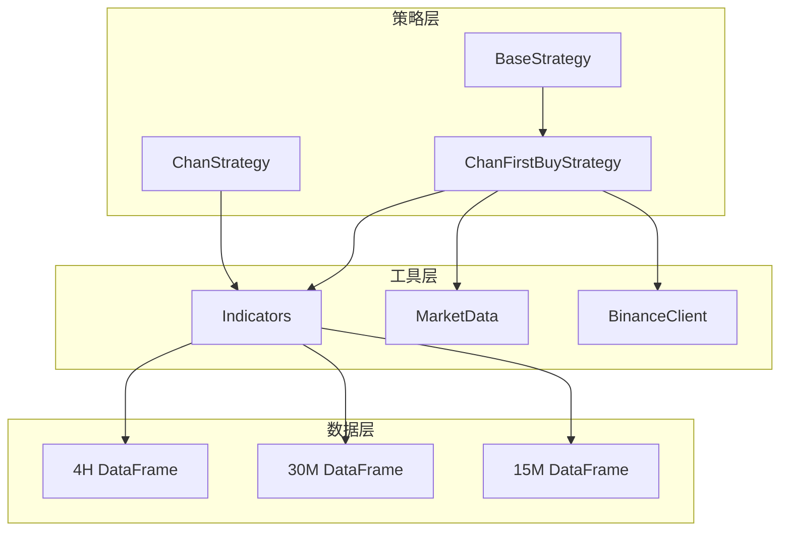
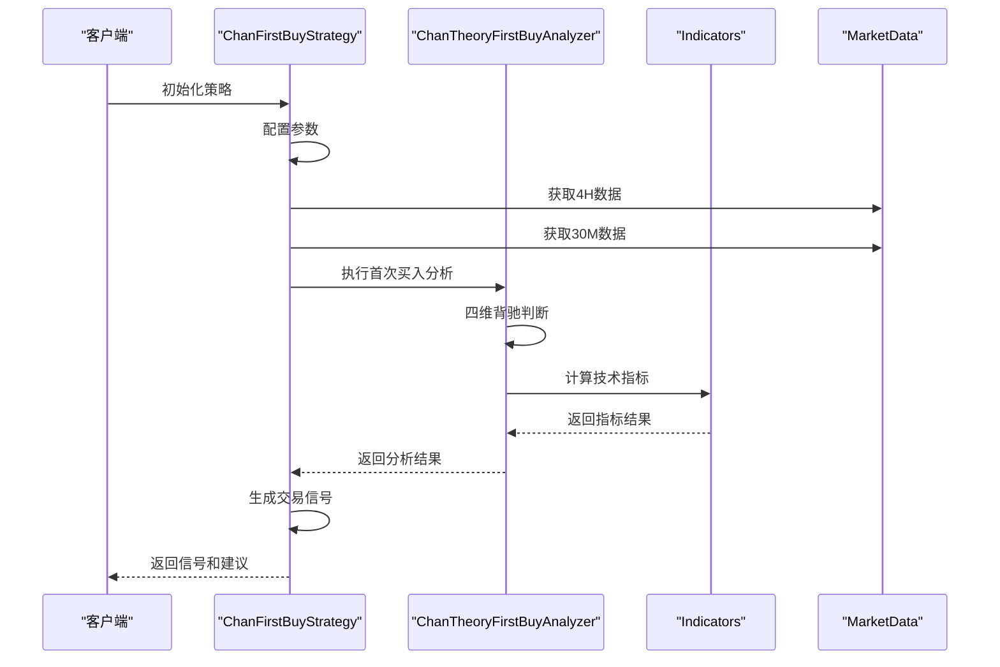
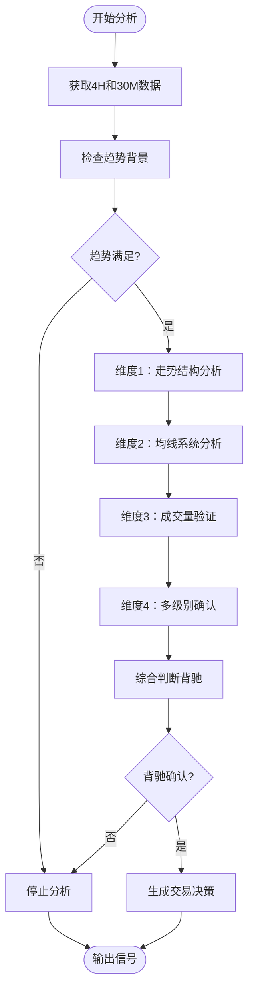
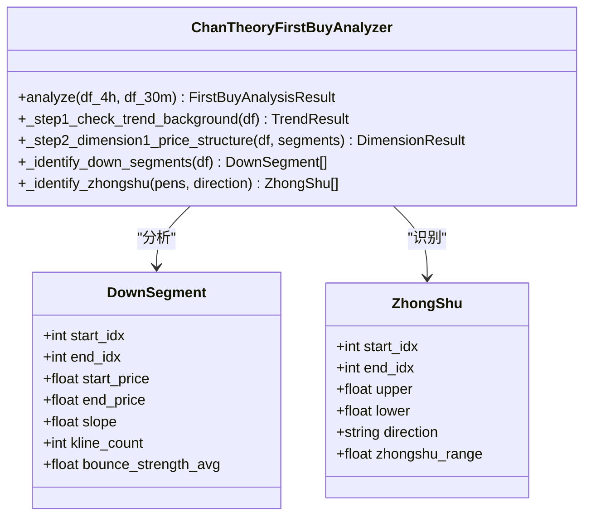
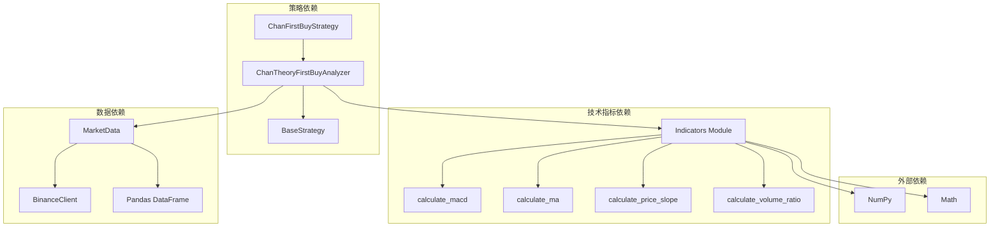

# ChanFirstBuyStrategy首次买入策略

<cite>
**本文档引用的文件**
- [chan_first_buy_strategy.py](file://trading_system/strategies/chan_first_buy_strategy.py)
- [base_strategy.py](file://trading_system/strategies/base_strategy.py)
- [indicators.py](file://trading_system/utils/indicators.py)
- [chan_strategy.py](file://trading_system/strategies/chan_strategy.py)
</cite>

## 目录
1. [简介](#简介)
2. [项目结构](#项目结构)
3. [核心组件](#核心组件)
4. [架构概览](#架构概览)
5. [详细组件分析](#详细组件分析)
6. [依赖关系分析](#依赖关系分析)
7. [性能考虑](#性能考虑)
8. [故障排除指南](#故障排除指南)
9. [结论](#结论)
10. [附录](#附录)

## 简介

ChanFirstBuyStrategy首次买入策略是一个基于缠论理论的量化交易策略，专注于识别市场首次买入机会。该策略通过多维度背驰分析、多级别确认和严格的风险控制机制，为交易者提供科学的入场时机判断。

该策略的核心理念是利用缠论中的"第一类买点"概念，结合现代技术分析工具，构建一套完整的首次买入识别系统。策略不仅关注价格形态，还综合考虑成交量、均线系统、MACD背驰等多个技术指标，确保买入信号的可靠性和有效性。

## 项目结构

该项目采用模块化设计，将不同功能的策略分离到独立的文件中，便于维护和扩展：

**图表来源**
- [chan_first_buy_strategy.py:1-50](file://trading_system/strategies/chan_first_buy_strategy.py#L1-L50)
- [base_strategy.py:1-80](file://trading_system/strategies/base_strategy.py#L1-L80)

**章节来源**
- [chan_first_buy_strategy.py:1-100](file://trading_system/strategies/chan_first_buy_strategy.py#L1-L100)
- [base_strategy.py:1-168](file://trading_system/strategies/base_strategy.py#L1-L168)

## 核心组件

### 主要策略类

ChanFirstBuyStrategy是策略的核心实现，继承自BaseStrategy基类，提供了完整的策略生命周期管理：

- **策略初始化**：配置参数阈值和分析器
- **数据获取**：自动获取4H和30M级别的K线数据
- **信号生成**：执行首次买入点分析并生成交易信号
- **风险管理**：内置止损和止盈机制

### 分析器组件

ChanTheoryFirstBuyAnalyzer负责具体的分析逻辑，包含四个核心维度：

1. **走势结构力度对比**：分析下跌段的斜率、复杂度和波动收敛情况
2. **均线系统观察**：检查60/120均线的乖离率和斜率变化
3. **成交量辅助验证**：验证价格下跌过程中的成交量萎缩
4. **多级别联立确认**：通过30M级别确认4H级别的背驰结构

**章节来源**
- [chan_first_buy_strategy.py:219-285](file://trading_system/strategies/chan_first_buy_strategy.py#L219-L285)
- [chan_first_buy_strategy.py:554-610](file://trading_system/strategies/chan_first_buy_strategy.py#L554-L610)

## 架构概览

策略采用分层架构设计，确保了良好的可维护性和扩展性：

**图表来源**
- [chan_first_buy_strategy.py:2600-2630](file://trading_system/strategies/chan_first_buy_strategy.py#L2600-L2630)
- [chan_first_buy_strategy.py:2794-2811](file://trading_system/strategies/chan_first_buy_strategy.py#L2794-L2811)

### 数据流架构

策略的数据处理流程体现了严谨的分析逻辑：

**图表来源**
- [chan_first_buy_strategy.py:235-285](file://trading_system/strategies/chan_first_buy_strategy.py#L235-L285)
- [chan_first_buy_strategy.py:554-610](file://trading_system/strategies/chan_first_buy_strategy.py#L554-L610)

## 详细组件分析

### 首次买入点识别算法

策略的核心在于精确识别"第一类买点"，这一过程通过四个相互验证的维度实现：

#### 维度1：走势结构力度对比

该维度分析下跌段的结构强度变化：

- **斜率对比**：比较最近两个下跌段的斜率，确认下跌动能减弱
- **复杂度对比**：分析K线数量的变化，判断结构复杂度
- **波动收敛**：检查反弹力度的变化和价格区间收敛情况

**图表来源**
- [chan_first_buy_strategy.py:40-89](file://trading_system/strategies/chan_first_buy_strategy.py#L40-L89)
- [chan_first_buy_strategy.py:664-710](file://trading_system/strategies/chan_first_buy_strategy.py#L664-L710)

#### 维度2：均线系统观察

通过均线系统的乖离率和斜率变化来验证买入信号：

- **乖离率变化**：比较最近低点和前次低点的乖离率变化
- **均线走平**：检查MA60和MA120的斜率变化，确认趋势放缓

#### 维度3：成交量辅助验证

成交量是确认价格反转的重要指标：

- **价跌量缩**：验证价格下跌过程中的成交量萎缩
- **量价关系**：检测量价模式的转变

#### 维度4：多级别联立确认

通过更高时间框架的数据确认信号的有效性：

- **30分钟趋势确认**：验证30分钟级别的下跌趋势
- **中枢结构确认**：检查30分钟级别的中枢结构

**章节来源**
- [chan_first_buy_strategy.py:352-400](file://trading_system/strategies/chan_first_buy_strategy.py#L352-L400)
- [chan_first_buy_strategy.py:402-475](file://trading_system/strategies/chan_first_buy_strategy.py#L402-L475)
- [chan_first_buy_strategy.py:477-513](file://trading_system/strategies/chan_first_buy_strategy.py#L477-L513)
- [chan_first_buy_strategy.py:515-552](file://trading_system/strategies/chan_first_buy_strategy.py#L515-L552)

### 风险控制机制

策略实施了多层次的风险控制措施：

#### 止损设置

- **动态止损**：基于最近低点设置止损，通常为最近低点的98%
- **时间止损**：在特定时间内未达到目标位时自动止损

#### 仓位管理

- **首仓配置**：首次买入占总仓位的25%
- **加仓策略**：在确认后可追加35%的仓位
- **最大仓位**：总仓位不超过55%

#### 目标位设定

- **中枢目标**：基于最后一个下跌中枢的上下沿
- **多重目标**：设置多个目标位，逐步获利了结

**章节来源**
- [chan_first_buy_strategy.py:559-610](file://trading_system/strategies/chan_first_buy_strategy.py#L559-L610)
- [chan_first_buy_strategy.py:1626-1644](file://trading_system/strategies/chan_first_buy_strategy.py#L1626-L1644)

### 与其他缠论策略的区别

#### 与标准ChanStrategy的区别

| 特征 | ChanFirstBuyStrategy | 标准ChanStrategy |
|------|---------------------|------------------|
| **分析范围** | 仅分析首次买入点 | 全面分析买卖信号 |
| **时间框架** | 4H主图+30M确认 | 多时间框架综合分析 |
| **信号频率** | 低频高质量信号 | 高频信号，需要过滤 |
| **风险控制** | 严格的一次性风险控制 | 多次加减仓机制 |
| **适用场景** | 适合趋势初建阶段 | 适合趋势中后期 |

#### 与二买策略的区别

- **时机差异**：首次买入策略在趋势刚开始时介入，二买策略在趋势确立后回踩时介入
- **风险承受**：首次买入风险更高但潜在收益更大
- **信号质量**：首次买入信号通常更稀少但质量更高

**章节来源**
- [chan_first_buy_strategy.py:1425-1710](file://trading_system/strategies/chan_first_buy_strategy.py#L1425-L1710)
- [chan_first_buy_strategy.py:1713-1998](file://trading_system/strategies/chan_first_buy_strategy.py#L1713-L1998)

## 依赖关系分析

策略的依赖关系体现了清晰的模块化设计：

**图表来源**
- [chan_first_buy_strategy.py:10-25](file://trading_system/strategies/chan_first_buy_strategy.py#L10-L25)
- [indicators.py:1-451](file://trading_system/utils/indicators.py#L1-L451)

### 关键依赖关系

1. **技术指标库**：依赖indicators.py中的各种技术指标计算函数
2. **数据分析**：使用Pandas进行数据处理和分析
3. **数学计算**：使用NumPy进行高效的数值计算
4. **外部数据源**：通过BinanceClient获取实时市场数据

**章节来源**
- [chan_first_buy_strategy.py:1-27](file://trading_system/strategies/chan_first_buy_strategy.py#L1-L27)
- [indicators.py:1-451](file://trading_system/utils/indicators.py#L1-L451)

## 性能考虑

### 计算效率优化

策略在设计时充分考虑了计算效率：

- **向量化计算**：大量使用Pandas和NumPy的向量化操作
- **缓存机制**：避免重复计算相同的技术指标
- **早期退出**：在不满足条件时提前终止分析

### 内存管理

- **数据截断**：只保留必要的数据窗口
- **及时释放**：分析完成后及时释放临时变量
- **内存监控**：定期检查内存使用情况

### 实时性能

- **异步处理**：支持异步数据获取和分析
- **批量处理**：支持批量K线数据的高效处理
- **并发优化**：合理利用多核CPU进行并行计算

## 故障排除指南

### 常见问题及解决方案

#### 数据获取失败

**症状**：策略无法获取4H或30M数据
**原因**：网络连接问题或API限制
**解决**：检查网络连接，调整请求频率，使用备用数据源

#### 分析结果为空

**症状**：策略返回空的分析结果
**原因**：数据质量差或参数设置不当
**解决**：检查数据完整性，调整参数阈值，验证数据质量

#### 信号延迟

**症状**：信号生成滞后于实际价格变化
**原因**：参数设置过于保守或数据频率不够
**解决**：适当调整参数，提高数据频率，优化算法

### 调试技巧

1. **日志分析**：启用详细日志记录，分析策略执行过程
2. **参数敏感性测试**：单独测试每个参数的影响
3. **回测验证**：使用历史数据验证策略效果
4. **实时监控**：监控策略在实时环境中的表现

**章节来源**
- [chan_first_buy_strategy.py:844-903](file://trading_system/strategies/chan_first_buy_strategy.py#L844-L903)
- [chan_first_buy_strategy.py:1646-1710](file://trading_system/strategies/chan_first_buy_strategy.py#L1646-L1710)

## 结论

ChanFirstBuyStrategy首次买入策略通过严谨的缠论理论基础和现代化的技术分析工具，构建了一套完整的首次买入识别系统。该策略的主要优势包括：

1. **理论基础扎实**：基于缠论的核心概念，具有坚实的理论支撑
2. **多维度验证**：通过四个相互验证的维度提高信号质量
3. **严格风险控制**：完善的止损和仓位管理机制
4. **适应性强**：适用于多种市场环境和时间框架

该策略特别适合以下投资者：
- 寻求趋势初期介入机会的交易者
- 注重风险控制和技术分析的理性投资者
- 希望在趋势确立初期建立仓位的短线交易者

## 附录

### 参数配置指南

| 参数名称 | 默认值 | 说明 | 调整建议 |
|----------|--------|------|----------|
| deviation_ratio_threshold | 0.8 | 乖离率变化阈值 | 0.7-0.9之间调整 |
| volume_shrink_threshold | 0.7 | 成交量萎缩阈值 | 0.6-0.8之间调整 |
| slope_flatten_threshold | 0.3 | 均线斜率阈值 | 0.2-0.5之间调整 |
| min_zhongshu_for_buy | 2 | 最少中枢数量 | 1-3之间调整 |
| min_dimensions_for_divergence | 2 | 最少满足维度数 | 2-3之间调整 |

### 适用市场阶段

**最佳适用阶段**：
- **趋势初建阶段**：价格刚刚突破关键阻力位
- **震荡整理末期**：价格从震荡区间向上突破
- **回调确认阶段**：价格回调至关键支撑位获得支撑

**不适用阶段**：
- **趋势加速阶段**：价格快速上涨，缺乏回调机会
- **横盘整理阶段**：价格在窄幅区间震荡
- **恐慌抛售阶段**：市场情绪极度悲观

### 实际应用建议

1. **结合其他指标**：建议结合趋势线、成交量等其他技术指标
2. **风险管理**：严格执行止损纪律，控制单笔损失
3. **资金管理**：合理分配资金，避免过度集中
4. **持续优化**：根据市场变化调整参数设置
5. **模拟交易**：先进行模拟交易验证策略效果