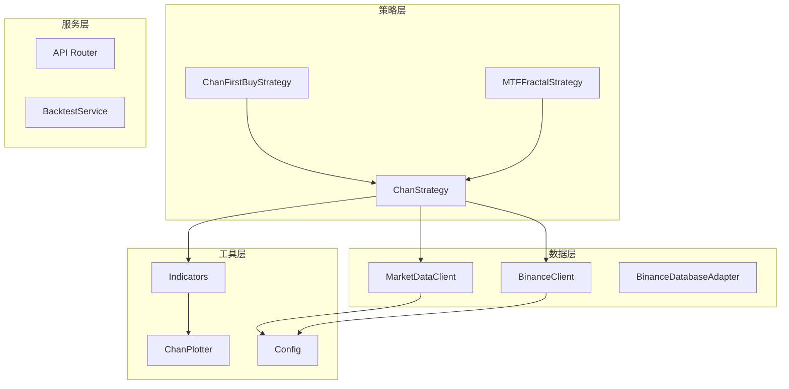
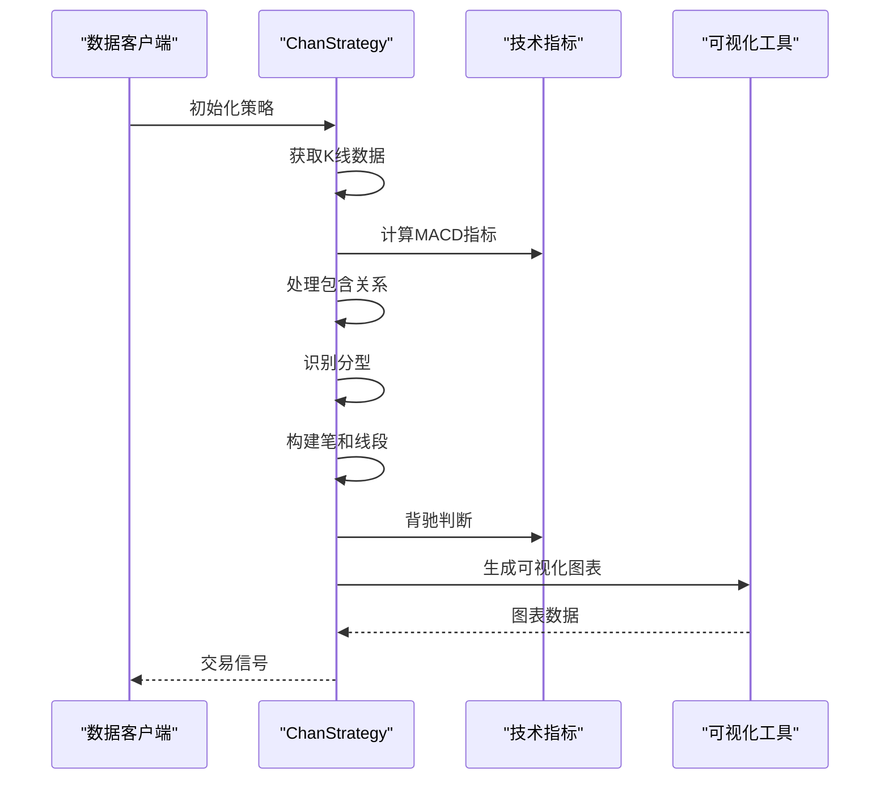
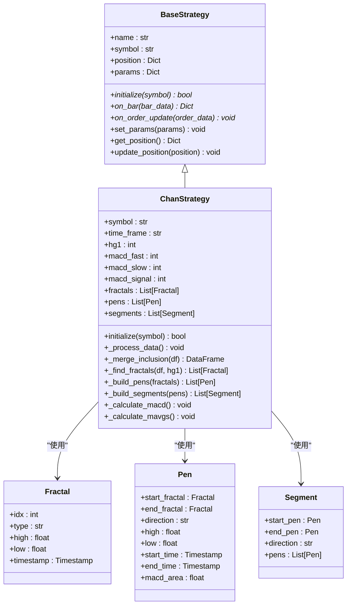
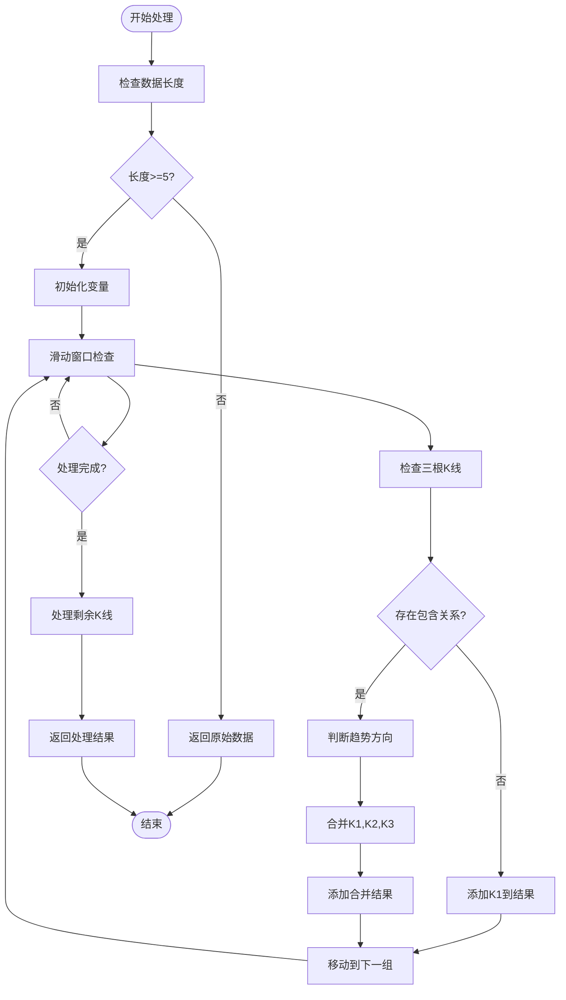
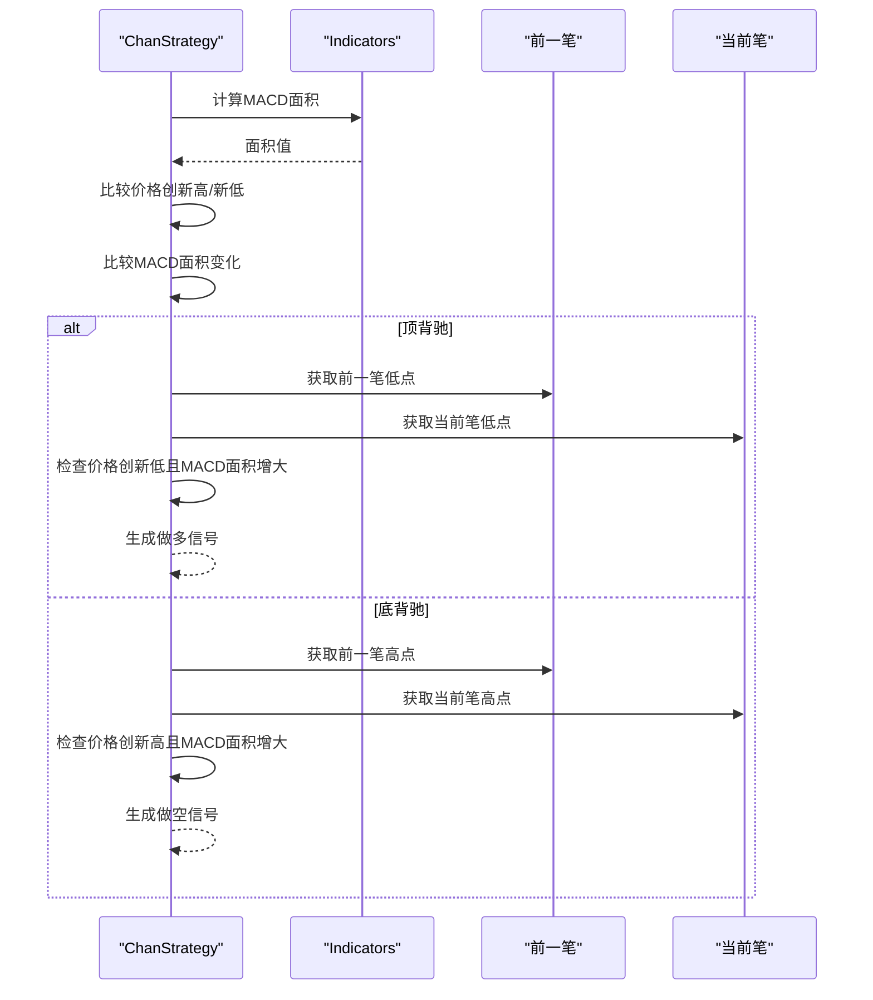
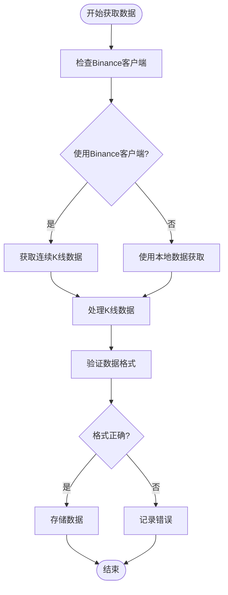
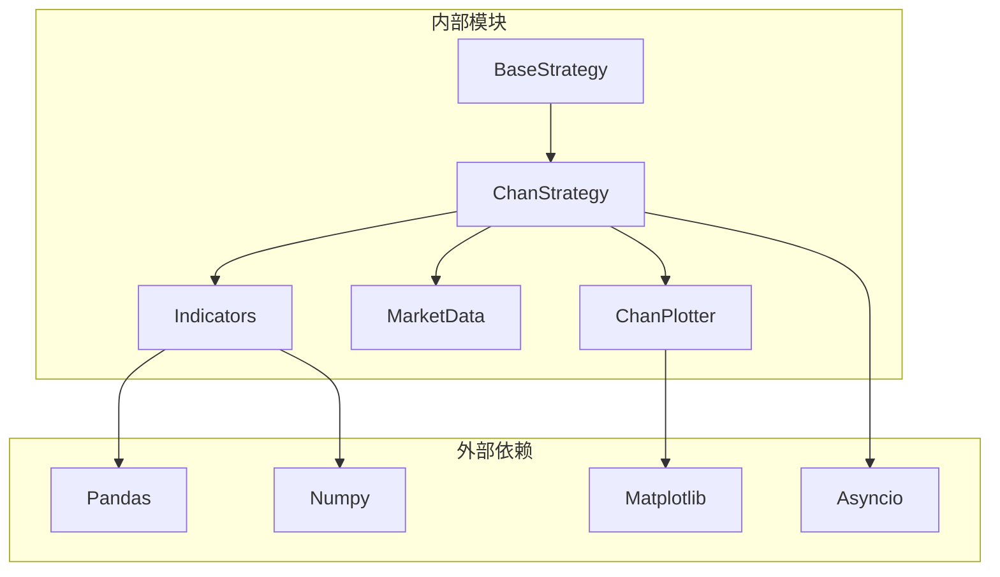

# ChanStrategy V1版本

<cite>
**本文档引用的文件**
- [chan_strategy.py](file://trading_system/strategies/chan_strategy.py)
- [base_strategy.py](file://trading_system/strategies/base_strategy.py)
- [indicators.py](file://trading_system/utils/indicators.py)
- [market_data.py](file://trading_system/data/market_data.py)
- [chan_plotter.py](file://trading_system/utils/chan_plotter.py)
- [chan_first_buy_strategy.py](file://trading_system/strategies/chan_first_buy_strategy.py)
- [mtf_fractal_strategy.py](file://trading_system/strategies/mtf_fractal_strategy.py)
- [config.py](file://trading_system/core/config.py)
</cite>

## 目录
1. [简介](#简介)
2. [项目结构](#项目结构)
3. [核心组件](#核心组件)
4. [架构概览](#架构概览)
5. [详细组件分析](#详细组件分析)
6. [依赖关系分析](#依赖关系分析)
7. [性能考虑](#性能考虑)
8. [故障排除指南](#故障排除指南)
9. [结论](#结论)
10. [附录](#附录)

## 简介
ChanStrategy V1版本是一个基于缠论技术分析的量化交易策略实现。该策略通过分型识别、笔和线段构建、MACD背驰判断等核心算法，结合包含关系处理和K线合并规则，为加密货币市场提供自动化交易信号。策略支持多时间框架分析，具备参数化配置能力，可灵活调整以适应不同的市场环境。

## 项目结构
该项目采用模块化设计，主要包含策略实现、数据处理、技术指标计算和可视化工具等核心模块：

**图表来源**
- [chan_strategy.py:102-129](file://trading_system/strategies/chan_strategy.py#L102-L129)
- [base_strategy.py:8-37](file://trading_system/strategies/base_strategy.py#L8-L37)
- [indicators.py:1-26](file://trading_system/utils/indicators.py#L1-L26)

**章节来源**
- [chan_strategy.py:1-800](file://trading_system/strategies/chan_strategy.py#L1-L800)
- [base_strategy.py:1-168](file://trading_system/strategies/base_strategy.py#L1-L168)

## 核心组件
ChanStrategy V1版本的核心组件包括分型识别、笔构建、线段分析、MACD背驰判断和包含关系处理等关键模块。这些组件协同工作，形成完整的缠论分析体系。

### 分型识别算法
分型是缠论分析的基础单元，策略通过识别顶分型和底分型来构建价格结构。算法使用hg1参数控制分型查找的窗口大小，支持5分钟和30分钟及以上周期的不同参数配置。

### 笔和线段构建逻辑
笔由相邻的分型配对构成，线段由三笔组合形成。策略实现了严格的有效性判断标准，确保分析结果的准确性。

### MACD背驰判断机制
通过比较相邻笔的MACD柱状图面积来判断背驰现象，为交易信号生成提供重要依据。

**章节来源**
- [chan_strategy.py:16-100](file://trading_system/strategies/chan_strategy.py#L16-L100)
- [indicators.py:80-106](file://trading_system/utils/indicators.py#L80-L106)

## 架构概览
策略采用分层架构设计，各模块职责明确，耦合度低，便于维护和扩展：

**图表来源**
- [chan_strategy.py:242-336](file://trading_system/strategies/chan_strategy.py#L242-L336)
- [indicators.py:6-26](file://trading_system/utils/indicators.py#L6-L26)

## 详细组件分析

### ChanStrategy核心类分析
ChanStrategy是策略的核心实现，继承自BaseStrategy基类，提供了完整的缠论分析功能。

**图表来源**
- [base_strategy.py:8-168](file://trading_system/strategies/base_strategy.py#L8-L168)
- [chan_strategy.py:102-241](file://trading_system/strategies/chan_strategy.py#L102-L241)

#### 包含关系处理算法
包含关系处理是缠论分析的重要步骤，通过识别和合并包含K线来消除虚假信号：

**图表来源**
- [chan_strategy.py:384-446](file://trading_system/strategies/chan_strategy.py#L384-L446)

#### MACD背驰判断流程
背驰判断是策略的核心信号生成机制：

**图表来源**
- [indicators.py:80-106](file://trading_system/utils/indicators.py#L80-L106)
- [chan_strategy.py:506-528](file://trading_system/strategies/chan_strategy.py#L506-L528)

**章节来源**
- [chan_strategy.py:102-800](file://trading_system/strategies/chan_strategy.py#L102-L800)
- [indicators.py:1-451](file://trading_system/utils/indicators.py#L1-L451)

### 技术指标模块分析
技术指标模块提供了策略所需的各种技术分析工具：

#### MACD计算实现
MACD指标计算采用标准的指数移动平均线方法，支持自定义参数配置：

| 参数 | 默认值 | 说明 |
|------|--------|------|
| fast | 12 | 快线周期（EMA参数） |
| slow | 26 | 慢线周期（EMA参数） |
| signal | 9 | 信号线周期（对DIF的EMA平滑） |

#### 均线计算系统
策略实现了多周期均线系统，用于共振验证和趋势判断：

- **短期均线（MA20）**：反映短期价格趋势，敏感度较高
- **中期均线（MA60）**：反映中期价格趋势，用于确认趋势方向  
- **长期均线（MA120）**：反映长期价格趋势，提供支撑/阻力参考

**章节来源**
- [indicators.py:6-44](file://trading_system/utils/indicators.py#L6-L44)
- [chan_strategy.py:530-624](file://trading_system/strategies/chan_strategy.py#L530-L624)

### 数据获取和处理
策略支持多种数据源，包括Binance API和本地市场数据：

#### Binance数据获取

**图表来源**
- [chan_strategy.py:260-302](file://trading_system/strategies/chan_strategy.py#L260-L302)

**章节来源**
- [chan_strategy.py:242-336](file://trading_system/strategies/chan_strategy.py#L242-L336)
- [market_data.py:12-118](file://trading_system/data/market_data.py#L12-L118)

## 依赖关系分析
策略的依赖关系清晰明确，各模块间耦合度低，便于独立开发和测试：

**图表来源**
- [chan_strategy.py:1-13](file://trading_system/strategies/chan_strategy.py#L1-L13)
- [base_strategy.py:1-6](file://trading_system/strategies/base_strategy.py#L1-L6)

**章节来源**
- [chan_strategy.py:1-13](file://trading_system/strategies/chan_strategy.py#L1-L13)
- [base_strategy.py:1-6](file://trading_system/strategies/base_strategy.py#L1-L6)

## 性能考虑
针对ChanStrategy V1版本的性能优化建议：

### 数据处理优化
1. **批量数据处理**：使用pandas向量化操作替代循环处理
2. **内存管理**：及时清理不需要的数据引用，避免内存泄漏
3. **异步处理**：利用asyncio进行I/O密集型操作的并发处理

### 算法优化
1. **索引优化**：使用pandas的loc/iloc进行高效数据访问
2. **缓存机制**：对重复计算的结果进行缓存
3. **早期退出**：在条件不满足时提前结束计算

### 内存使用优化
- 合理设置数据窗口大小，避免过大的内存占用
- 及时释放不再使用的DataFrame对象
- 使用适当的数据类型减少内存消耗

## 故障排除指南

### 常见问题及解决方案

#### 数据获取失败
**问题症状**：策略初始化时数据获取失败
**可能原因**：
- API限流或网络连接问题
- 交易对名称错误
- 数据格式不符合预期

**解决方法**：
1. 检查网络连接和API访问权限
2. 验证交易对名称的正确性
3. 查看日志获取详细的错误信息

#### 分型识别异常
**问题症状**：分型数量异常或识别不准确
**可能原因**：
- hg1参数设置不当
- K线数据质量差
- 包含关系处理错误

**解决方法**：
1. 调整hg1参数以适应不同周期
2. 检查K线数据的完整性
3. 验证包含关系处理逻辑

#### 背驰信号误判
**问题症状**：MACD背驰信号频繁出现但效果不佳
**可能原因**：
- MACD参数设置不适合当前市场
- 信号过滤条件过于宽松
- 市场处于震荡状态

**解决方法**：
1. 优化MACD参数组合
2. 增加额外的确认条件
3. 结合其他技术指标进行过滤

**章节来源**
- [chan_strategy.py:334-336](file://trading_system/strategies/chan_strategy.py#L334-L336)
- [chan_strategy.py:372-382](file://trading_system/strategies/chan_strategy.py#L372-L382)

## 结论
ChanStrategy V1版本是一个功能完整、结构清晰的缠论交易策略实现。通过分型识别、笔和线段构建、MACD背驰判断等核心算法，策略能够有效识别市场转折点并生成可靠的交易信号。策略的设计具有良好的扩展性和可维护性，为后续的功能增强和性能优化奠定了坚实基础。

## 附录

### 参数配置说明

#### 核心参数
| 参数名 | 类型 | 默认值 | 说明 |
|--------|------|--------|------|
| symbol | str | "BTCUSDT" | 交易对名称 |
| time_frame | str | "30m" | K线时间周期 |
| hg1 | int | 自动 | 分型查找窗口参数 |
| macd_fast | int | 12 | MACD快线周期 |
| macd_slow | int | 26 | MACD慢线周期 |
| macd_signal | int | 9 | MACD信号线周期 |

#### 高级参数
| 参数名 | 类型 | 默认值 | 说明 |
|--------|------|--------|------|
| ma_short_period | int | 20 | 短期均线周期 |
| ma_medium_period | int | 60 | 中期均线周期 |
| ma_long_period | int | 120 | 长期均线周期 |
| enable_resonance | bool | True | 是否启用共振验证 |
| use_inclusion_merge | bool | True | 是否启用包含关系合并 |

### 调优建议
1. **参数优化**：根据历史回测结果调整MACD参数和hg1参数
2. **风险管理**：设置合理的止损止盈比例和仓位控制
3. **市场适应**：根据不同市场环境调整策略参数
4. **性能监控**：定期检查策略性能指标并进行优化