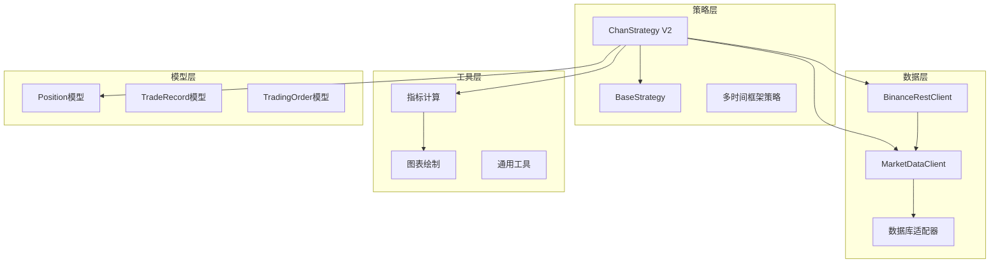
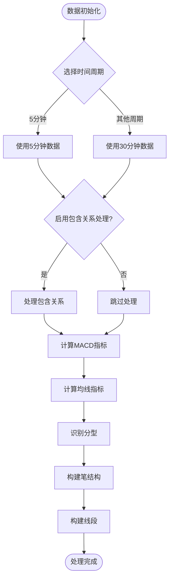
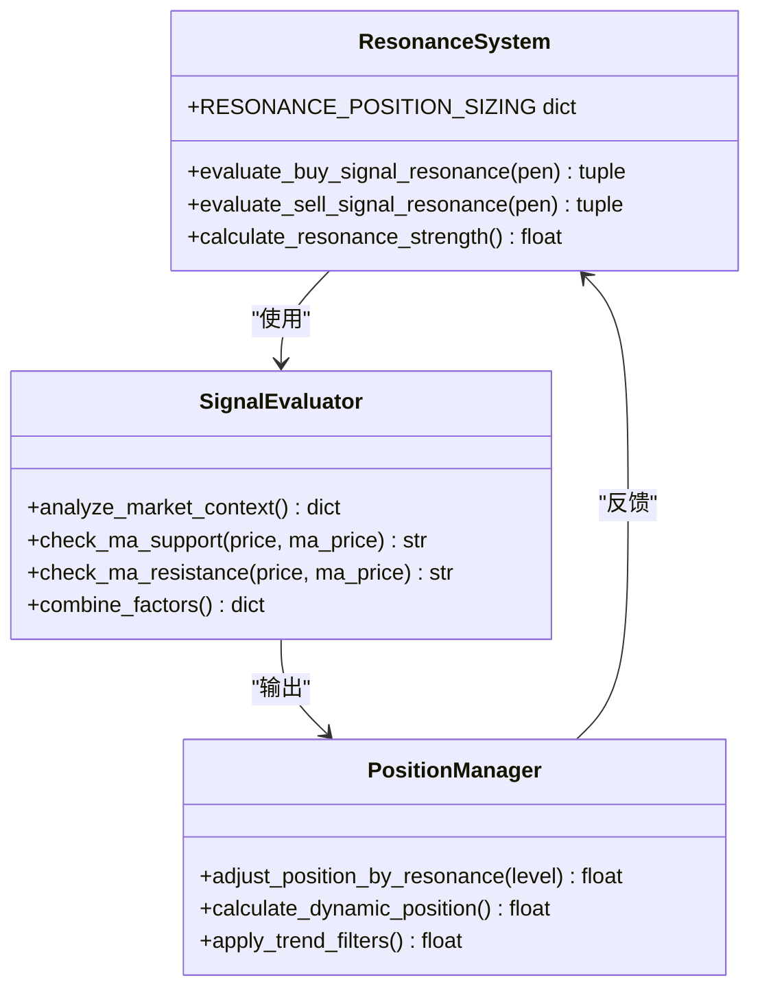
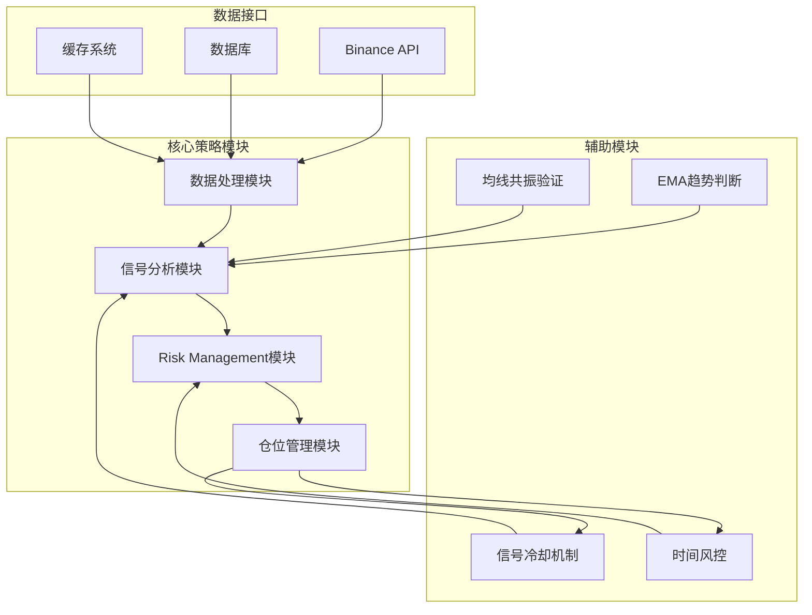
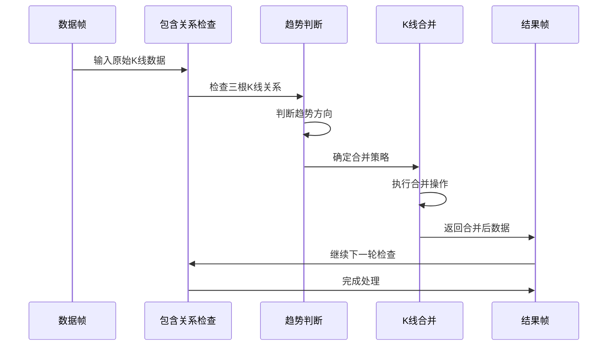
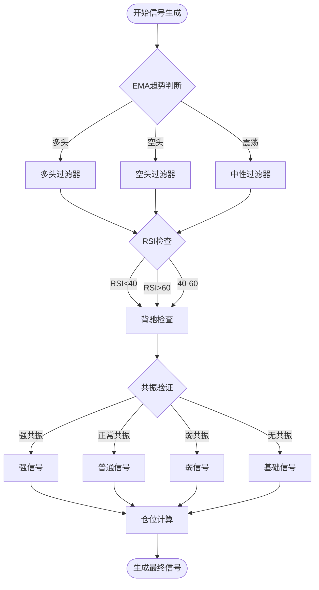
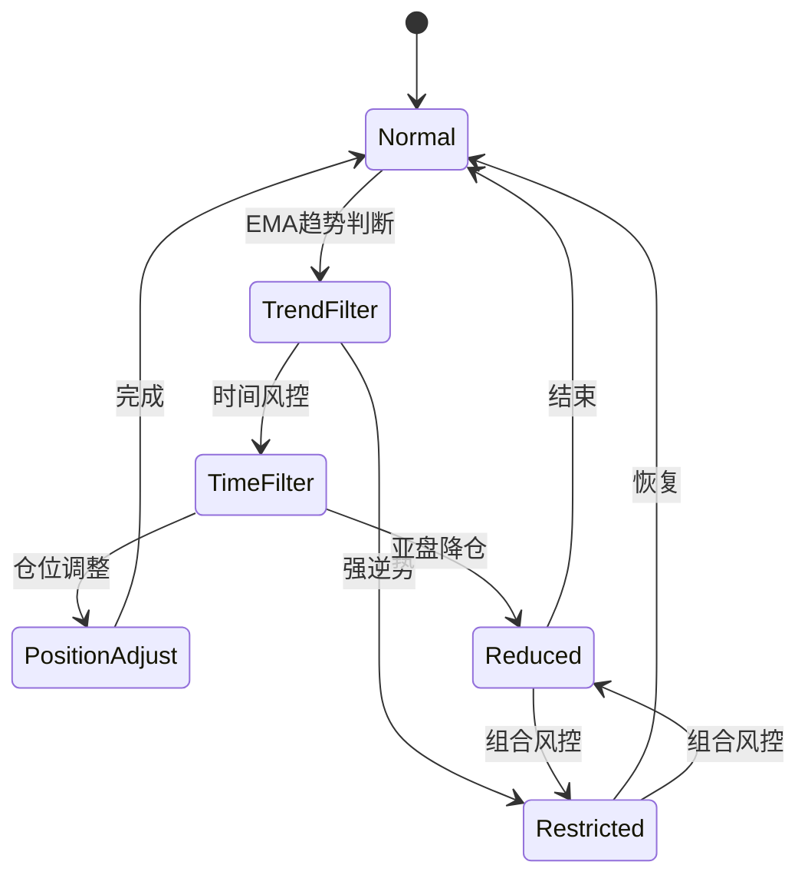
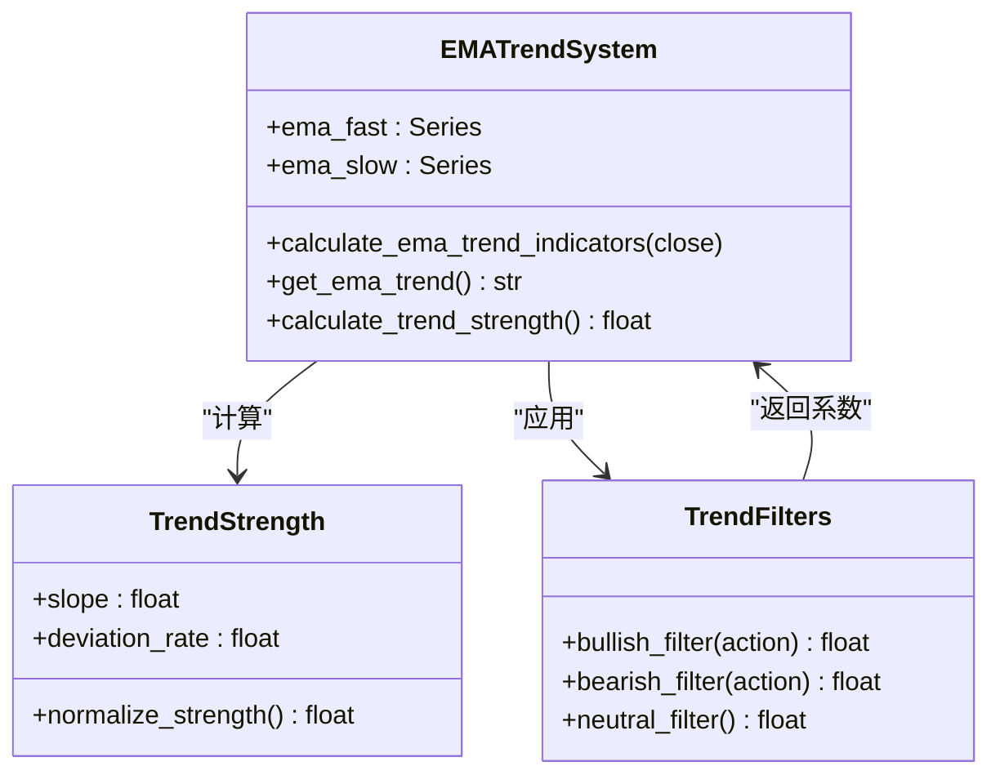
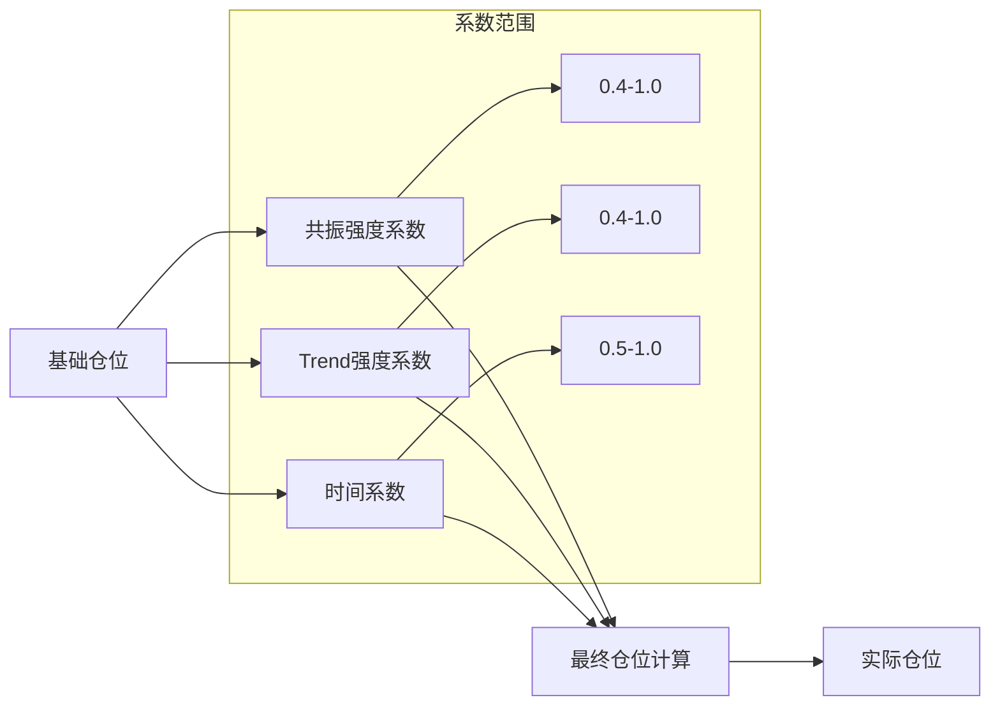
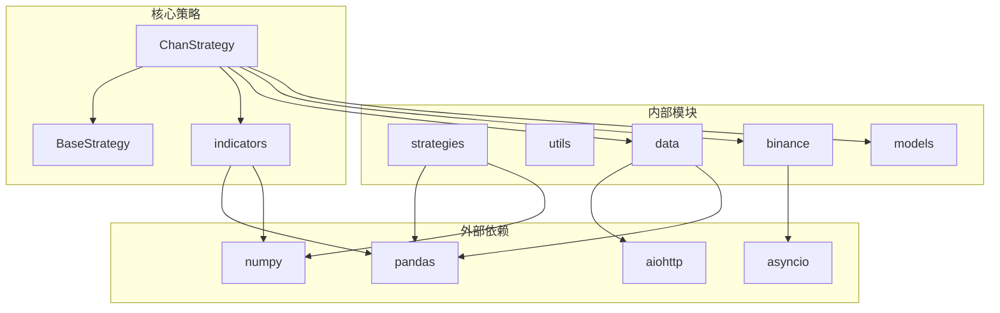

# ChanStrategy V2版本

<cite>
**本文档引用的文件**
- [chan_strategy.py](file://trading_system/strategies/chan_strategy.py)
- [base_strategy.py](file://trading_system/strategies/base_strategy.py)
- [indicators.py](file://trading_system/utils/indicators.py)
- [market_data.py](file://trading_system/data/market_data.py)
- [client.py](file://trading_system/binance/client.py)
- [position.py](file://trading_system/models/position.py)
- [spec.md](file://.trae/specs/ma_resonance_strategy/spec.md)
</cite>

## 目录
1. [简介](#简介)
2. [项目结构](#项目结构)
3. [核心组件](#核心组件)
4. [架构概览](#架构概览)
5. [详细组件分析](#详细组件分析)
6. [依赖关系分析](#依赖关系分析)
7. [性能考虑](#性能考虑)
8. [故障排除指南](#故障排除指南)
9. [结论](#结论)
10. [附录](#附录)

## 简介

ChanStrategy V2版本是对传统缠论策略的重大升级，引入了多项关键改进。本版本专注于解决V1版本在包含关系处理、信号生成算法和风险管理方面的局限性，通过引入共振验证、EMA趋势判断和智能仓位管理等新特性，显著提升了策略的准确性和盈利能力。

V2版本的核心改进包括：
- **包含关系处理优化**：改进的K线包含关系合并算法，确保索引一致性
- **信号生成算法增强**：基于共振验证的多因子信号评估系统
- **风险管理机制完善**：基于EMA趋势的动态仓位管理和时间维度风控
- **新特性集成**：EMA趋势判断、均线共振验证、智能仓位管理策略

## 项目结构

**图表来源**
- [chan_strategy.py:102-172](file://trading_system/strategies/chan_strategy.py#L102-L172)
- [base_strategy.py:8-52](file://trading_system/strategies/base_strategy.py#L8-L52)
- [market_data.py:12-47](file://trading_system/data/market_data.py#L12-L47)

**章节来源**
- [chan_strategy.py:1-100](file://trading_system/strategies/chan_strategy.py#L1-L100)
- [base_strategy.py:1-80](file://trading_system/strategies/base_strategy.py#L1-L80)

## 核心组件

### 数据处理组件

V2版本重构了数据处理流程，重点关注包含关系处理的准确性：

**图表来源**
- [chan_strategy.py:338-383](file://trading_system/strategies/chan_strategy.py#L338-L383)
- [chan_strategy.py:384-446](file://trading_system/strategies/chan_strategy.py#L384-L446)

### 共振验证系统

V2版本引入了创新的共振验证机制，通过多因子融合提升信号质量：

**图表来源**
- [chan_strategy.py:866-890](file://trading_system/strategies/chan_strategy.py#L866-L890)
- [chan_strategy.py:892-950](file://trading_system/strategies/chan_strategy.py#L892-L950)

**章节来源**
- [chan_strategy.py:131-194](file://trading_system/strategies/chan_strategy.py#L131-L194)
- [chan_strategy.py:866-950](file://trading_system/strategies/chan_strategy.py#L866-L950)

## 架构概览

V2版本采用模块化设计，将核心功能分解为独立的处理模块：

**图表来源**
- [chan_strategy.py:242-337](file://trading_system/strategies/chan_strategy.py#L242-L337)
- [chan_strategy.py:1475-1507](file://trading_system/strategies/chan_strategy.py#L1475-L1507)

## 详细组件分析

### 包含关系处理优化

V2版本对包含关系处理进行了重大改进，解决了索引一致性问题：

**图表来源**
- [chan_strategy.py:448-446](file://trading_system/strategies/chan_strategy.py#L448-L446)
- [chan_strategy.py:466-504](file://trading_system/strategies/chan_strategy.py#L466-L504)

#### 关键改进点

1. **索引一致性保证**：通过滑动窗口检查确保合并操作不会破坏时间序列的连续性
2. **趋势方向自适应**：根据前两根K线的高低点变化动态判断合并方向
3. **边界条件处理**：完善的数据边界检查，避免索引越界错误

**章节来源**
- [chan_strategy.py:384-446](file://trading_system/strategies/chan_strategy.py#L384-L446)
- [chan_strategy.py:448-504](file://trading_system/strategies/chan_strategy.py#L448-L504)

### 信号生成算法增强

V2版本的信号生成算法集成了多种技术指标和市场因素：

**图表来源**
- [chan_strategy.py:1998-2022](file://trading_system/strategies/chan_strategy.py#L1998-L2022)
- [chan_strategy.py:2010-2022](file://trading_system/strategies/chan_strategy.py#L2010-L2022)

#### 共振验证机制

V2版本的核心创新是共振验证系统，通过多因子融合提升信号质量：

| 共振级别 | 强度权重 | 信号特征 | 仓位建议 |
|---------|---------|---------|---------|
| strong | 1.0 | 强支撑 + 多头趋势 | 100% 标准仓位 |
| normal | 0.7 | 弱支撑 + 多头趋势 | 70% 标准仓位 |
| weak | 0.4 | 支撑存在 + 空头趋势 | 40% 标准仓位 |
| none | 0.7 | 纯缠论信号 | 70% 标准仓位 |

**章节来源**
- [chan_strategy.py:866-890](file://trading_system/strategies/chan_strategy.py#L866-L890)
- [chan_strategy.py:892-950](file://trading_system/strategies/chan_strategy.py#L892-L950)

### 风险管理机制完善

V2版本实现了多层次的风险管理体系：

**图表来源**
- [chan_strategy.py:1475-1507](file://trading_system/strategies/chan_strategy.py#L1475-L1507)
- [chan_strategy.py:1509-1531](file://trading_system/strategies/chan_strategy.py#L1509-L1531)

#### EMA趋势判断系统

V2版本引入了基于EMA的短期趋势判断，替代传统的日线趋势分析：

**图表来源**
- [chan_strategy.py:584-624](file://trading_system/strategies/chan_strategy.py#L584-L624)
- [chan_strategy.py:625-665](file://trading_system/strategies/chan_strategy.py#L625-L665)

**章节来源**
- [chan_strategy.py:584-665](file://trading_system/strategies/chan_strategy.py#L584-L665)
- [chan_strategy.py:1475-1531](file://trading_system/strategies/chan_strategy.py#L1475-L1531)

### 仓位管理策略

V2版本实现了智能仓位管理系统，结合共振级别、趋势强度和时间因素：

**图表来源**
- [chan_strategy.py:2019](file://trading_system/strategies/chan_strategy.py#L2019)
- [chan_strategy.py:1475-1507](file://trading_system/strategies/chan_strategy.py#L1475-L1507)

#### 仓位调整规则

| 情况 | EMA趋势 | RSI条件 | 仓位系数 | 说明 |
|------|---------|---------|----------|------|
| 买入 | 空头趋势 | RSI<40 | 0.4 | 强逆势大幅降仓 |
| 买入 | 空头趋势 | RSI<40 | 0.7 | 弱逆势降仓 |
| 卖出 | 多头趋势 | RSI>60 | 0.4 | 强逆势大幅降仓 |
| 卖出 | 多头趋势 | RSI>60 | 0.7 | 弱逆势降仓 |
| 其他 | 震荡/中性 | 任何 | 1.0 | 完全仓位 |

**章节来源**
- [chan_strategy.py:1475-1507](file://trading_system/strategies/chan_strategy.py#L1475-L1507)
- [chan_strategy.py:2019](file://trading_system/strategies/chan_strategy.py#L2019)

## 依赖关系分析

V2版本的依赖关系体现了清晰的分层架构：

**图表来源**
- [chan_strategy.py:1-13](file://trading_system/strategies/chan_strategy.py#L1-L13)
- [base_strategy.py:1-5](file://trading_system/strategies/base_strategy.py#L1-L5)

**章节来源**
- [chan_strategy.py:1-13](file://trading_system/strategies/chan_strategy.py#L1-L13)
- [base_strategy.py:1-5](file://trading_system/strategies/base_strategy.py#L1-L5)

## 性能考虑

### 计算复杂度分析

V2版本在保持原有算法复杂度的基础上，增加了多项计算开销：

| 功能模块 | 时间复杂度 | 空间复杂度 | 主要开销来源 |
|---------|-----------|-----------|-------------|
| 包含关系处理 | O(n) | O(n) | 滑动窗口检查 |
| MACD计算 | O(n) | O(n) | 指数移动平均 |
| 均线计算 | O(n) | O(n) | SMA计算 |
| 共振验证 | O(n) | O(n) | 多因子融合 |
| EMA趋势判断 | O(n) | O(n) | EMA斜率计算 |

### 内存优化策略

1. **数据流式处理**：采用分批处理方式，避免大数据集内存溢出
2. **指标缓存机制**：重复使用的指标结果进行缓存，减少重复计算
3. **异步I/O优化**：使用asyncio进行网络请求，提高并发性能

## 故障排除指南

### 常见问题及解决方案

#### 数据获取问题
- **症状**：策略初始化失败，提示数据获取错误
- **原因**：网络连接问题或API限制
- **解决方案**：检查网络连接，调整请求频率，使用备用数据源

#### 指标计算异常
- **症状**：均线或MACD计算结果异常
- **原因**：数据质量差或计算参数不当
- **解决方案**：验证数据完整性，调整指标周期参数

#### 信号生成错误
- **症状**：生成的信号质量差或频繁假信号
- **原因**：共振验证参数设置不当
- **解决方案**：调整共振强度阈值，优化信号过滤条件

**章节来源**
- [chan_strategy.py:334-336](file://trading_system/strategies/chan_strategy.py#L334-L336)
- [chan_strategy.py:551-553](file://trading_system/strategies/chan_strategy.py#L551-L553)

## 结论

ChanStrategy V2版本代表了缠论策略的重大进步，通过引入共振验证、EMA趋势判断和智能仓位管理等创新特性，在保持原有技术优势的基础上，显著提升了策略的准确性和盈利能力。

### 主要成就

1. **包含关系处理优化**：解决了索引一致性问题，提高了数据处理的可靠性
2. **信号质量提升**：通过多因子共振验证，显著降低了假信号率
3. **风险管理完善**：实现了动态仓位管理和多层次风控机制
4. **性能优化**：在保证功能完整性的前提下，优化了计算效率

### 未来发展方向

1. **机器学习集成**：探索AI技术在信号预测中的应用
2. **实时监控系统**：开发实时性能监控和预警机制
3. **多资产适配**：扩展策略到更多交易品种和市场环境

## 附录

### 参数配置指南

#### 基础参数
- `symbol`: 交易对名称，默认"BTCUSDT"
- `time_frame`: K线时间周期，默认"30m"
- `hg1`: 分型查找参数，自动根据周期调整

#### 技术参数
- `macd_fast`: MACD快线周期，默认12
- `macd_slow`: MACD慢线周期，默认26
- `macd_signal`: MACD信号线周期，默认9

#### 均线参数
- `ma_short_period`: 短期均线周期，默认20
- `ma_medium_period`: 中期均线周期，默认60
- `ma_long_period`: 长期均线周期，默认120

#### 功能开关
- `enable_resonance`: 是否启用共振验证，默认True
- `use_inclusion_merge`: 是否启用包含关系处理，默认True

### 迁移指南

从V1到V2的主要变更：

1. **包含关系处理**：V2版本禁用了包含关系合并以确保索引一致性
2. **信号生成**：增加了共振验证和EMA趋势判断环节
3. **风险管理**：引入了动态仓位管理和时间风控机制
4. **参数配置**：新增了多个技术参数和功能开关

**章节来源**
- [chan_strategy.py:139-194](file://trading_system/strategies/chan_strategy.py#L139-L194)
- [spec.md:281-374](file://.trae/specs/ma_resonance_strategy/spec.md#L281-L374)