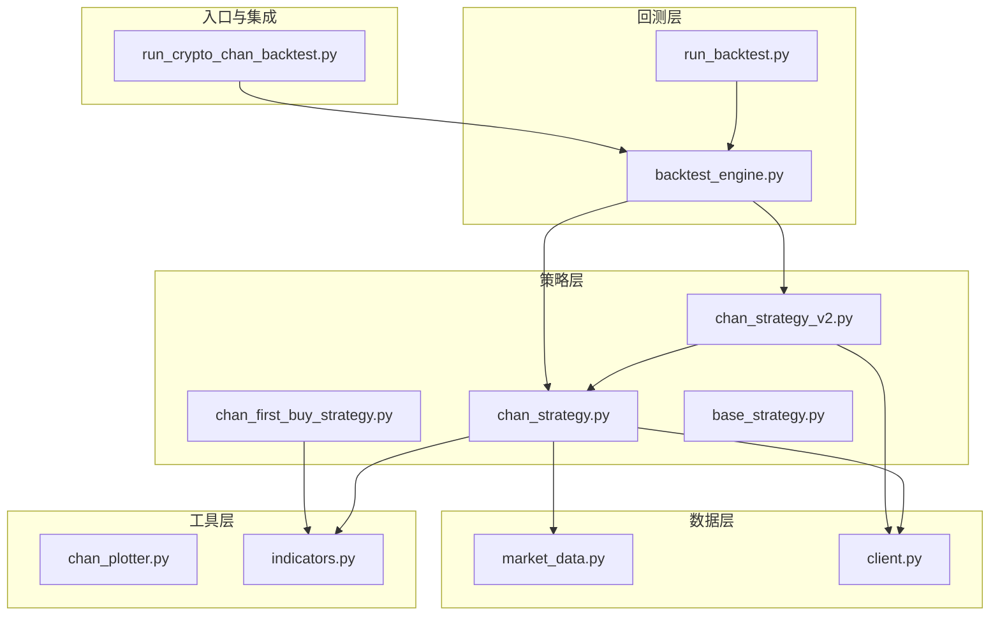
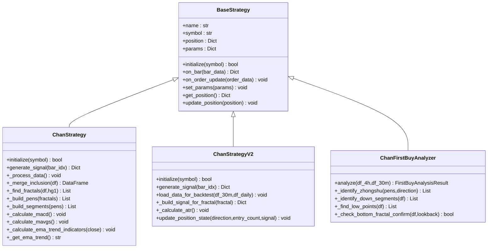
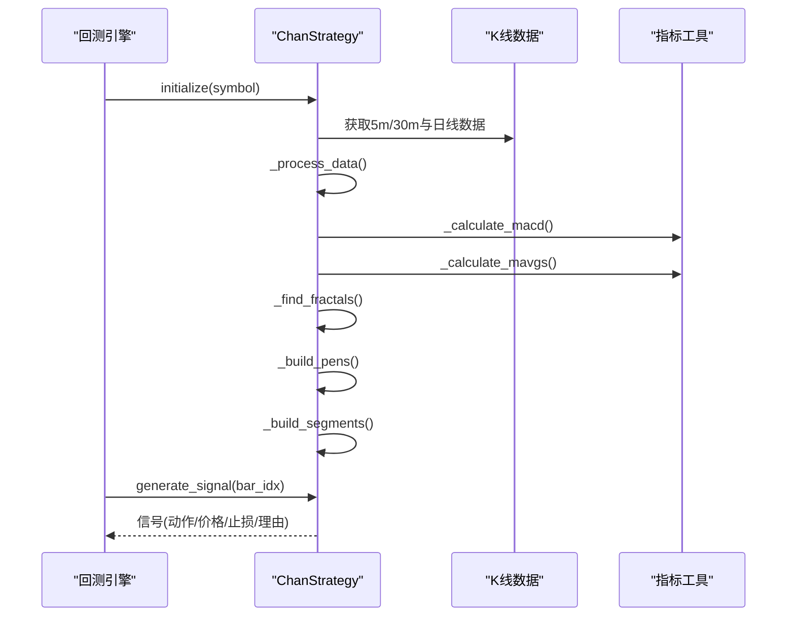
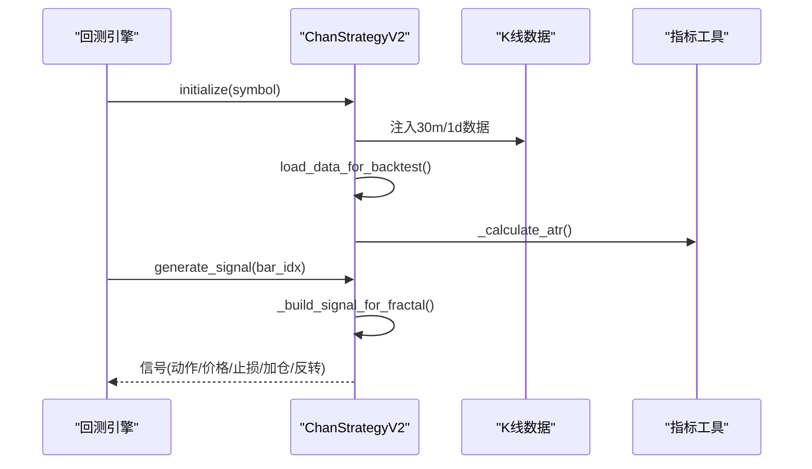
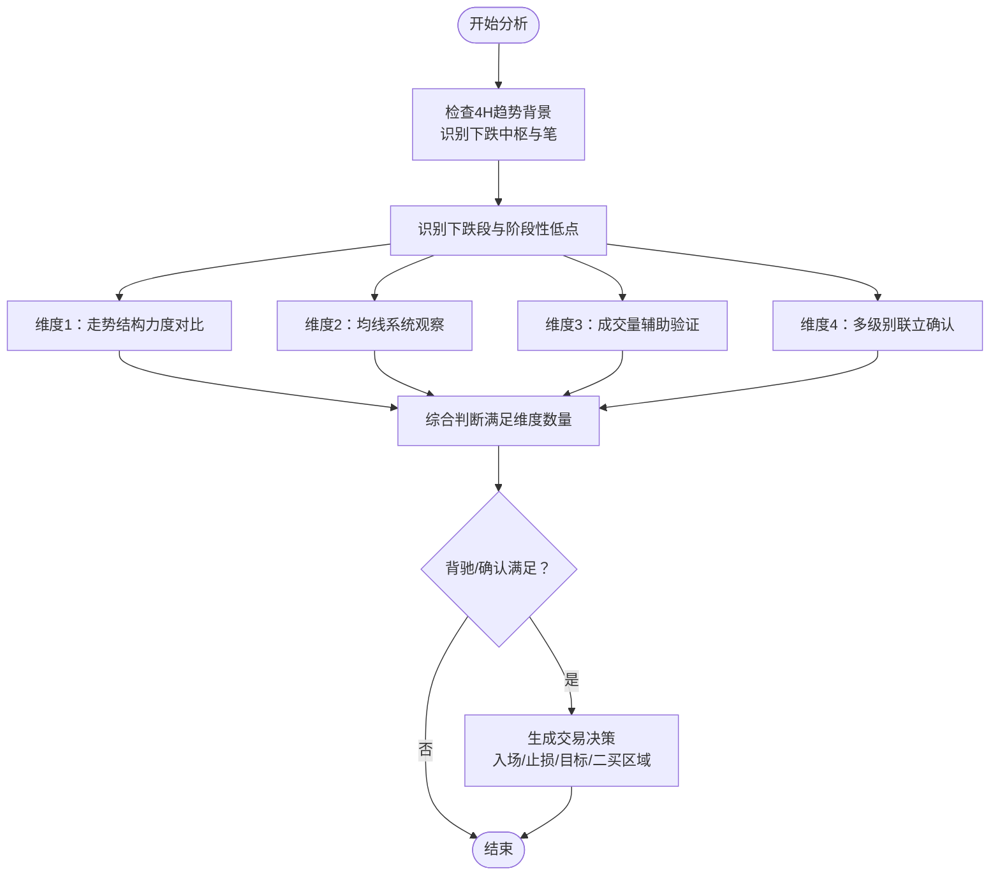
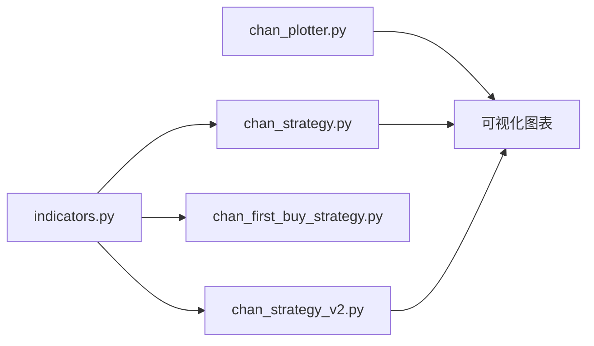
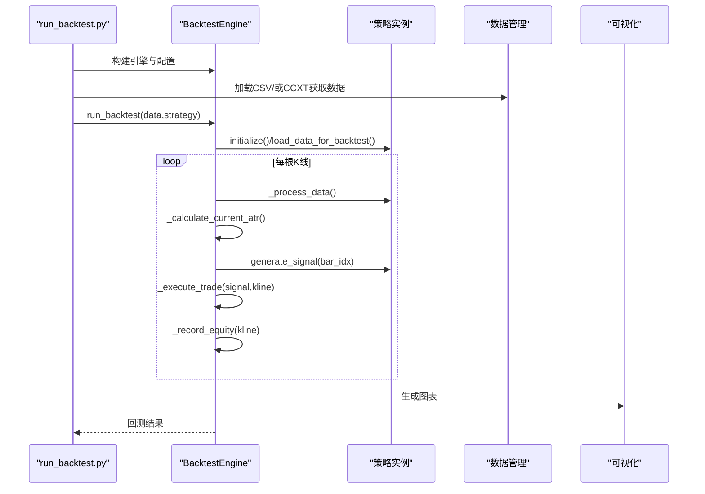
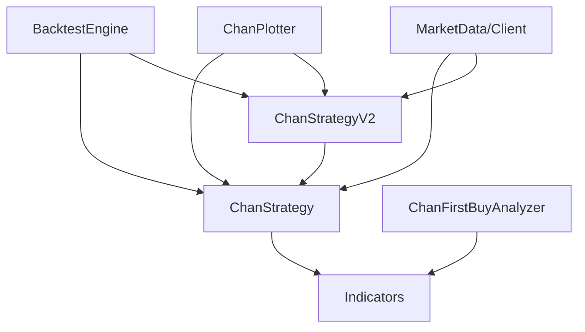

# 缠论策略系列

<cite>
**本文档引用的文件**
- [chan_strategy.py](file://trading_system/strategies/chan_strategy.py)
- [chan_strategy_v2.py](file://trading_system/strategies/chan_strategy_v2.py)
- [chan_first_buy_strategy.py](file://trading_system/strategies/chan_first_buy_strategy.py)
- [base_strategy.py](file://trading_system/strategies/base_strategy.py)
- [chan_plotter.py](file://trading_system/utils/chan_plotter.py)
- [indicators.py](file://trading_system/utils/indicators.py)
- [market_data.py](file://trading_system/data/market_data.py)
- [client.py](file://trading_system/binance/client.py)
- [backtest_engine.py](file://trading_system/strategies/backtest_engine.py)
- [run_backtest.py](file://trading_system/backtest/run_backtest.py)
- [run_crypto_chan_backtest.py](file://run_crypto_chan_backtest.py)
</cite>

## 目录
1. [简介](#简介)
2. [项目结构](#项目结构)
3. [核心组件](#核心组件)
4. [架构概览](#架构概览)
5. [详细组件分析](#详细组件分析)
6. [依赖关系分析](#依赖关系分析)
7. [性能考量](#性能考量)
8. [故障排除指南](#故障排除指南)
9. [结论](#结论)
10. [附录](#附录)

## 简介
本项目围绕缠论技术分析理论，构建了完整的量化交易策略体系，涵盖：
- 基于缠论的买卖点识别与趋势判断
- 背驰信号生成与交易决策流程
- 多周期多级别联动分析
- 回测引擎与可视化工具链
- 实盘/模拟盘执行器

目标是为用户提供从理论到实践的一站式解决方案，帮助理解缠论在实盘中的落地方法。

## 项目结构
项目采用分层架构，策略层负责核心交易逻辑，工具层提供指标与绘图能力，数据层负责历史与实时数据接入，回测层提供性能评估与可视化。

**图表来源**
- [chan_strategy.py](file://trading_system/strategies/chan_strategy.py)
- [chan_strategy_v2.py](file://trading_system/strategies/chan_strategy_v2.py)
- [chan_first_buy_strategy.py](file://trading_system/strategies/chan_first_buy_strategy.py)
- [base_strategy.py](file://trading_system/strategies/base_strategy.py)
- [chan_plotter.py](file://trading_system/utils/chan_plotter.py)
- [indicators.py](file://trading_system/utils/indicators.py)
- [market_data.py](file://trading_system/data/market_data.py)
- [client.py](file://trading_system/binance/client.py)
- [backtest_engine.py](file://trading_system/strategies/backtest_engine.py)
- [run_backtest.py](file://trading_system/backtest/run_backtest.py)
- [run_crypto_chan_backtest.py](file://run_crypto_chan_backtest.py)

**章节来源**
- [chan_strategy.py](file://trading_system/strategies/chan_strategy.py)
- [chan_strategy_v2.py](file://trading_system/strategies/chan_strategy_v2.py)
- [chan_first_buy_strategy.py](file://trading_system/strategies/chan_first_buy_strategy.py)
- [base_strategy.py](file://trading_system/strategies/base_strategy.py)
- [chan_plotter.py](file://trading_system/utils/chan_plotter.py)
- [indicators.py](file://trading_system/utils/indicators.py)
- [market_data.py](file://trading_system/data/market_data.py)
- [client.py](file://trading_system/binance/client.py)
- [backtest_engine.py](file://trading_system/strategies/backtest_engine.py)
- [run_backtest.py](file://trading_system/backtest/run_backtest.py)
- [run_crypto_chan_backtest.py](file://run_crypto_chan_backtest.py)

## 核心组件
- 基类策略：定义统一接口与生命周期，确保策略可插拔与可扩展。
- 缠论策略V1：基于背驰的信号生成，包含包含关系处理、分型/笔/线段识别、MACD面积背驰判断。
- 缠论策略V2：分型驱动的交易系统，支持动态加仓与即时反转，参数完全配置化。
- 一买策略：面向一买/二买场景的多周期分析与交易建议生成。
- 指标工具：MACD、EMA、MA、ATR、量价模式检测等。
- 可视化工具：K线、分型、笔、线段与交易信号的图表绘制。
- 数据接入：Binance REST API与本地CSV数据加载。
- 回测引擎：支持多周期数据、资金费用、动态止损与绩效统计。

**章节来源**
- [base_strategy.py](file://trading_system/strategies/base_strategy.py)
- [chan_strategy.py](file://trading_system/strategies/chan_strategy.py)
- [chan_strategy_v2.py](file://trading_system/strategies/chan_strategy_v2.py)
- [chan_first_buy_strategy.py](file://trading_system/strategies/chan_first_buy_strategy.py)
- [indicators.py](file://trading_system/utils/indicators.py)
- [chan_plotter.py](file://trading_system/utils/chan_plotter.py)
- [market_data.py](file://trading_system/data/market_data.py)
- [client.py](file://trading_system/binance/client.py)
- [backtest_engine.py](file://trading_system/strategies/backtest_engine.py)

## 架构概览
策略层通过基类统一接口，V1/V2策略共享核心缠论识别逻辑，V2策略复用V1的数据处理能力并扩展交易行为。工具层提供指标与绘图，数据层负责历史与实时数据接入，回测层贯穿策略开发到验证的全流程。

**图表来源**
- [base_strategy.py](file://trading_system/strategies/base_strategy.py)
- [chan_strategy.py](file://trading_system/strategies/chan_strategy.py)
- [chan_strategy_v2.py](file://trading_system/strategies/chan_strategy_v2.py)
- [chan_first_buy_strategy.py](file://trading_system/strategies/chan_first_buy_strategy.py)

## 详细组件分析

### 缠论策略V1（chan_strategy）
- 数据预处理：包含关系处理（K线合并）、MACD计算、均线计算、EMA趋势指标。
- 结构识别：分型识别（hg1窗口参数）、笔构建（方向与有效性判断）、线段构建（三笔组合）。
- 背驰判断：基于MACD柱状图面积比较，识别顶/底背驰信号。
- 信号生成：结合日线趋势与共振验证，生成做多/做空信号并带止损与理由。

**图表来源**
- [chan_strategy.py](file://trading_system/strategies/chan_strategy.py)
- [backtest_engine.py](file://trading_system/strategies/backtest_engine.py)
- [indicators.py](file://trading_system/utils/indicators.py)

**章节来源**
- [chan_strategy.py](file://trading_system/strategies/chan_strategy.py)
- [indicators.py](file://trading_system/utils/indicators.py)
- [backtest_engine.py](file://trading_system/strategies/backtest_engine.py)

### 缠论策略V2（chan_strategy_v2）
- 核心改进：以分型为触发点，无需等待背驰；支持动态加仓（最多3次）与即时反转（顶底分型切换时平仓并反向开仓）。
- 参数配置化：投资比例、杠杆、止损/止盈、ATR动态止损、追踪止损等均可配置。
- 数据注入：回测模式下通过load_data_for_backtest注入数据，禁用包含关系合并以保证分型索引一致性。
- 交易执行：基于分型类型与当前持仓状态生成买入/卖出/加仓/反转信号。

**图表来源**
- [chan_strategy_v2.py](file://trading_system/strategies/chan_strategy_v2.py)
- [backtest_engine.py](file://trading_system/strategies/backtest_engine.py)
- [indicators.py](file://trading_system/utils/indicators.py)

**章节来源**
- [chan_strategy_v2.py](file://trading_system/strategies/chan_strategy_v2.py)
- [indicators.py](file://trading_system/utils/indicators.py)
- [backtest_engine.py](file://trading_system/strategies/backtest_engine.py)

### 一买策略（chan_first_buy_strategy）
- 多周期分析：4H趋势背景、30M确认、阶段性低点与反弹强度对比。
- 结构识别：下跌中枢识别、下跌段识别、阶段性低点提取。
- 维度判断：走势结构力度对比、均线系统观察（乖离率与斜率）、成交量辅助验证、多级别联立确认。
- 交易决策：基于维度满足数量与底分型确认，给出入场价、止损价、目标位与二买区域建议。

**图表来源**
- [chan_first_buy_strategy.py](file://trading_system/strategies/chan_first_buy_strategy.py)

**章节来源**
- [chan_first_buy_strategy.py](file://trading_system/strategies/chan_first_buy_strategy.py)

### 指标与可视化工具
- 指标工具：MACD、EMA、MA、ATR、斜率、乖离率、量价模式检测等，支持背驰判断与趋势识别。
- 可视化工具：绘制K线、分型、笔、线段与交易信号，支持均线叠加与信号标注。

**图表来源**
- [indicators.py](file://trading_system/utils/indicators.py)
- [chan_plotter.py](file://trading_system/utils/chan_plotter.py)
- [chan_strategy.py](file://trading_system/strategies/chan_strategy.py)
- [chan_strategy_v2.py](file://trading_system/strategies/chan_strategy_v2.py)
- [chan_first_buy_strategy.py](file://trading_system/strategies/chan_first_buy_strategy.py)

**章节来源**
- [indicators.py](file://trading_system/utils/indicators.py)
- [chan_plotter.py](file://trading_system/utils/chan_plotter.py)

### 数据接入与回测
- 数据接入：支持Binance REST API与本地CSV加载，提供异步客户端与分批下载能力。
- 回测引擎：支持多周期数据注入、资金费用结算、动态止损与追踪止损、限价单模拟与滑点处理、绩效统计与可视化。

**图表来源**
- [run_backtest.py](file://trading_system/backtest/run_backtest.py)
- [backtest_engine.py](file://trading_system/strategies/backtest_engine.py)
- [chan_strategy.py](file://trading_system/strategies/chan_strategy.py)
- [chan_strategy_v2.py](file://trading_system/strategies/chan_strategy_v2.py)
- [chan_plotter.py](file://trading_system/utils/chan_plotter.py)

**章节来源**
- [run_backtest.py](file://trading_system/backtest/run_backtest.py)
- [backtest_engine.py](file://trading_system/strategies/backtest_engine.py)
- [market_data.py](file://trading_system/data/market_data.py)
- [client.py](file://trading_system/binance/client.py)

## 依赖关系分析
- 策略依赖：V2策略依赖V1的缠论识别逻辑；所有策略依赖指标工具与数据接入。
- 回测依赖：回测引擎依赖策略接口与可视化工具；支持多周期数据注入与资金费用结算。
- 可视化依赖：绘图工具依赖策略对象提供的分型/笔/线段与均线数据。

**图表来源**
- [chan_strategy.py](file://trading_system/strategies/chan_strategy.py)
- [chan_strategy_v2.py](file://trading_system/strategies/chan_strategy_v2.py)
- [chan_first_buy_strategy.py](file://trading_system/strategies/chan_first_buy_strategy.py)
- [indicators.py](file://trading_system/utils/indicators.py)
- [chan_plotter.py](file://trading_system/utils/chan_plotter.py)
- [market_data.py](file://trading_system/data/market_data.py)
- [client.py](file://trading_system/binance/client.py)
- [backtest_engine.py](file://trading_system/strategies/backtest_engine.py)

**章节来源**
- [chan_strategy.py](file://trading_system/strategies/chan_strategy.py)
- [chan_strategy_v2.py](file://trading_system/strategies/chan_strategy_v2.py)
- [chan_first_buy_strategy.py](file://trading_system/strategies/chan_first_buy_strategy.py)
- [indicators.py](file://trading_system/utils/indicators.py)
- [chan_plotter.py](file://trading_system/utils/chan_plotter.py)
- [market_data.py](file://trading_system/data/market_data.py)
- [client.py](file://trading_system/binance/client.py)
- [backtest_engine.py](file://trading_system/strategies/backtest_engine.py)

## 性能考量
- 数据处理优化：V2策略禁用包含关系合并，减少索引映射复杂度；回测引擎支持增量数据处理与内存清理。
- 指标计算：EMA/MA/ATR等指标使用向量化计算，避免逐行循环；MACD面积计算采用区间求和。
- 可视化性能：图表绘制按需渲染，支持批量保存与延迟初始化。
- 回测效率：进度条与分批数据加载，避免长时间阻塞；资金费用按结算时间点计算，减少冗余遍历。

[本节为通用指导，无需特定文件引用]

## 故障排除指南
- 数据获取失败：检查Binance API密钥与网络连接；确认数据目录与文件格式；查看回测日志中的错误信息。
- 策略初始化异常：确认hg1参数与时间周期匹配；检查均线周期与数据长度关系；验证日线趋势判断逻辑。
- 信号生成异常：核对分型识别窗口与笔/线段有效性判断；检查背驰判断阈值与MACD面积计算。
- 回测结果异常：检查滑点与手续费配置；确认资金费用结算逻辑；验证限价单模拟与取消订单统计。

**章节来源**
- [client.py](file://trading_system/binance/client.py)
- [market_data.py](file://trading_system/data/market_data.py)
- [backtest_engine.py](file://trading_system/strategies/backtest_engine.py)

## 结论
本项目将缠论理论系统化地转化为可执行的交易策略，通过V1/V2策略与一买策略的差异化设计，覆盖从基础背驰到分型驱动的多种交易场景。配合完善的指标工具、可视化与回测体系，为实盘落地提供了坚实的技术基础。

[本节为总结性内容，无需特定文件引用]

## 附录

### 参数配置指南
- V1策略参数
  - hg1：分型窗口参数（5m默认4，30m及以上默认8）
  - MACD参数：fast/slow/signal（默认12/26/9）
  - 均线参数：短/中/长期均线周期（默认20/60/120）
  - 共振验证：enable_resonance（默认开启）
  - 包含关系处理：use_inclusion_merge（默认开启）
- V2策略参数
  - hg1：分型窗口参数（默认8）
  - max_add_positions：最大加仓次数（默认3）
  - investment_ratio：每次投入比例（默认10%）
  - leverage：杠杆倍数（默认20）
  - 止损参数：long_stop_loss_ratio/short_stop_loss_ratio（默认5%）
  - ATR止损：use_atr_stop与atr_multiplier（默认开启，3.5）
  - 追踪止损：use_trailing_stop、trailing_activation、trailing_distance（默认开启）
  - 数据源：use_binance_client（默认关闭）

**章节来源**
- [chan_strategy.py](file://trading_system/strategies/chan_strategy.py)
- [chan_strategy_v2.py](file://trading_system/strategies/chan_strategy_v2.py)

### 实际案例分析
- 多周期回测：通过run_crypto_chan_backtest.py加载4H/1H/15M/1D数据，运行多周期缠论策略回测，生成详细报告与可视化图表。
- V1/V2对比：在同一数据集上分别运行V1与V2策略，对比信号频率、胜率与收益曲线差异。
- 一买场景：使用一买策略分析4H下跌趋势与30M确认，给出入场/止损/目标与二买区域建议。

**章节来源**
- [run_crypto_chan_backtest.py](file://run_crypto_chan_backtest.py)
- [run_backtest.py](file://trading_system/backtest/run_backtest.py)
- [backtest_engine.py](file://trading_system/strategies/backtest_engine.py)