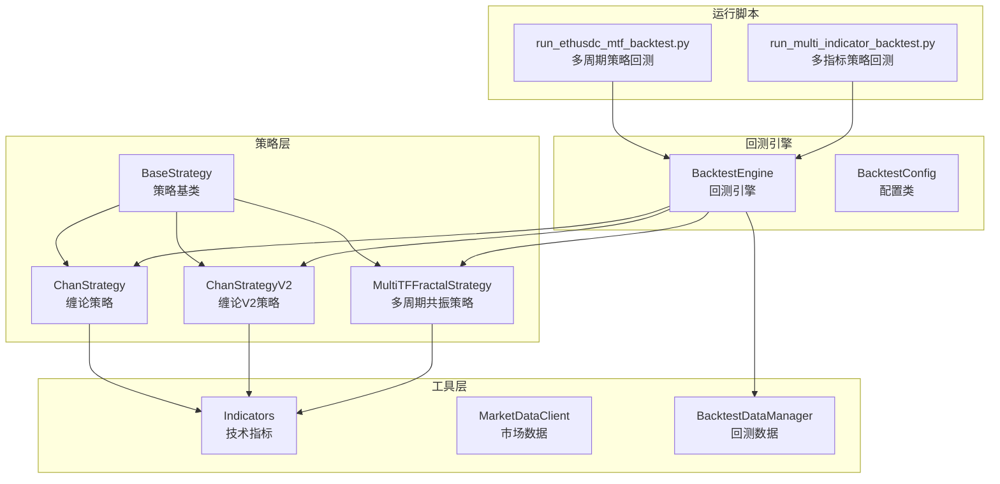
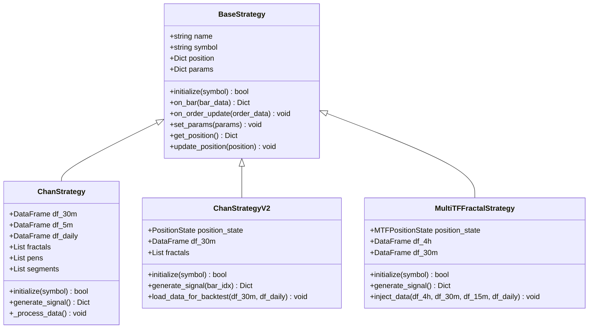
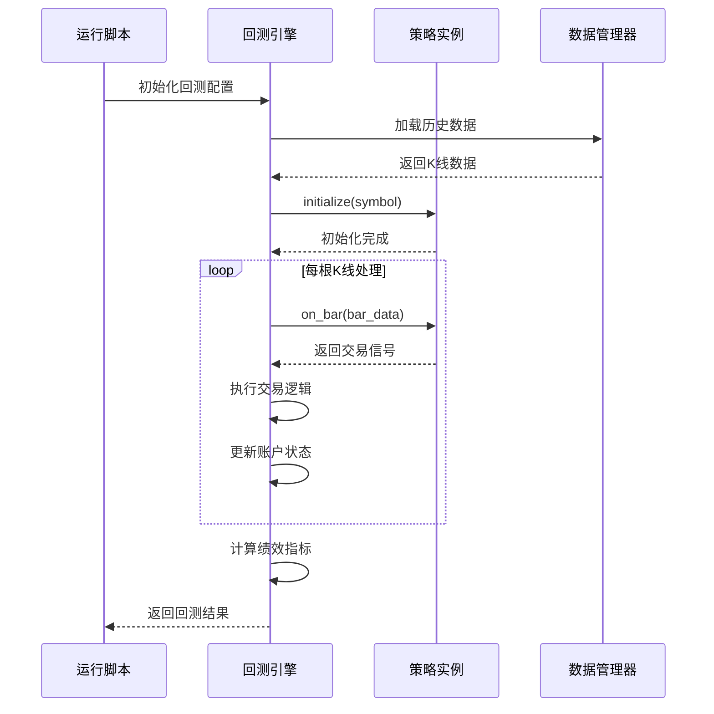
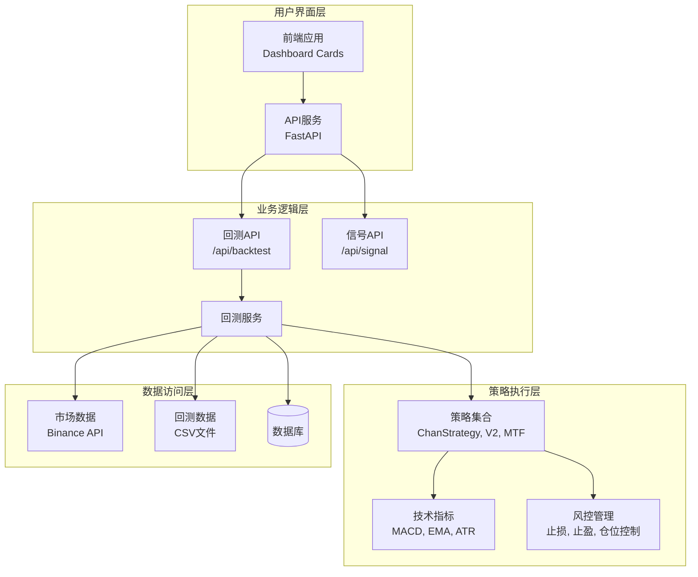
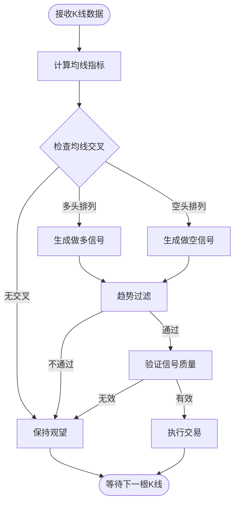
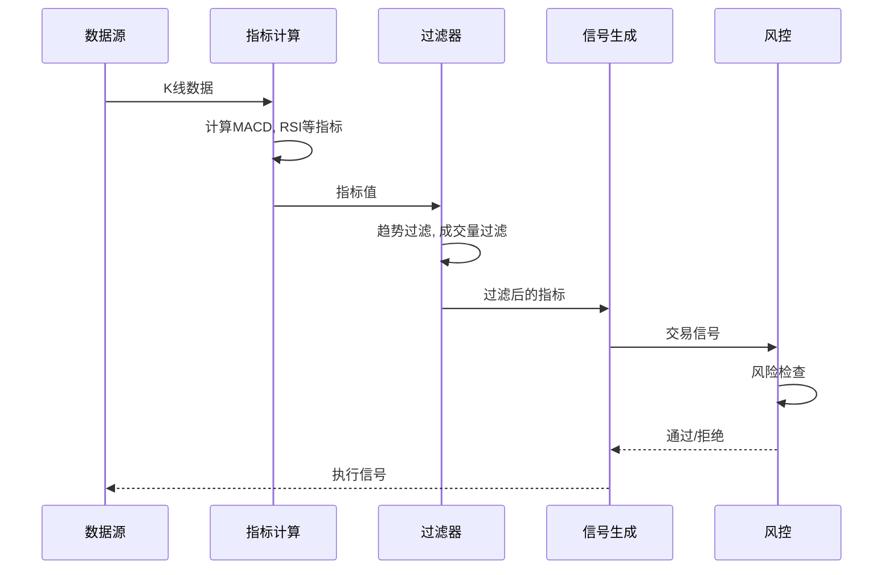
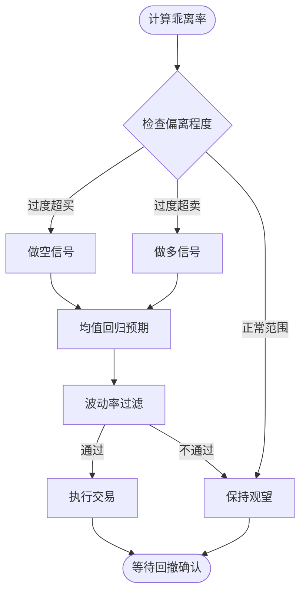
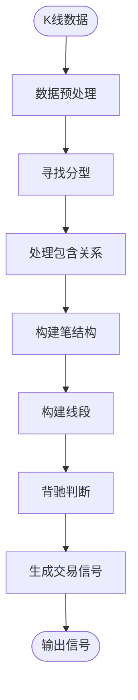
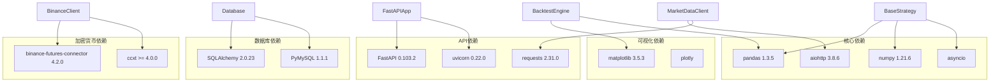

# 自定义策略开发

<cite>
**本文档引用的文件**
- [base_strategy.py](file://trading_system/strategies/base_strategy.py)
- [backtest_engine.py](file://trading_system/strategies/backtest_engine.py)
- [chan_strategy.py](file://trading_system/strategies/chan_strategy.py)
- [chan_strategy_v2.py](file://trading_system/strategies/chan_strategy_v2.py)
- [mtf_fractal_strategy.py](file://trading_system/strategies/mtf_fractal_strategy.py)
- [indicators.py](file://trading_system/utils/indicators.py)
- [market_data.py](file://trading_system/data/market_data.py)
- [backtest_data.py](file://trading_system/data/backtest_data.py)
- [run_ethusdc_mtf_backtest.py](file://run_ethusdc_mtf_backtest.py)
- [run_multi_indicator_backtest.py](file://run_multi_indicator_backtest.py)
- [requirements.txt](file://requirements.txt)
</cite>

## 目录
1. [简介](#简介)
2. [项目结构](#项目结构)
3. [核心组件](#核心组件)
4. [架构概览](#架构概览)
5. [详细组件分析](#详细组件分析)
6. [依赖分析](#依赖分析)
7. [性能考虑](#性能考虑)
8. [故障排除指南](#故障排除指南)
9. [结论](#结论)
10. [附录](#附录)

## 简介
本指南面向希望在交易系统中开发自定义策略的开发者，提供从策略设计到实现部署的完整流程指导。系统基于Python构建，采用异步编程模型，支持多种经典交易策略（移动平均、动量、均值回归等），并通过统一的回测引擎验证策略有效性。

## 项目结构
交易系统采用模块化设计，核心策略位于`trading_system/strategies/`目录，包含策略基类、回测引擎、技术指标工具和数据管理模块：

**图表来源**
- [base_strategy.py:8-168](file://trading_system/strategies/base_strategy.py#L8-L168)
- [backtest_engine.py:228-800](file://trading_system/strategies/backtest_engine.py#L228-L800)
- [chan_strategy.py:102-800](file://trading_system/strategies/chan_strategy.py#L102-L800)
- [chan_strategy_v2.py:37-800](file://trading_system/strategies/chan_strategy_v2.py#L37-L800)
- [mtf_fractal_strategy.py:85-800](file://trading_system/strategies/mtf_fractal_strategy.py#L85-L800)

**章节来源**
- [base_strategy.py:1-168](file://trading_system/strategies/base_strategy.py#L1-L168)
- [backtest_engine.py:1-2535](file://trading_system/strategies/backtest_engine.py#L1-L2535)

## 核心组件
本节深入分析策略开发所需的核心组件及其职责分工。

### 策略基类设计
BaseStrategy作为所有策略的抽象基类，定义了统一的接口规范和通用功能：

**图表来源**
- [base_strategy.py:8-168](file://trading_system/strategies/base_strategy.py#L8-L168)
- [chan_strategy.py:102-800](file://trading_system/strategies/chan_strategy.py#L102-L800)
- [chan_strategy_v2.py:37-800](file://trading_system/strategies/chan_strategy_v2.py#L37-L800)
- [mtf_fractal_strategy.py:85-800](file://trading_system/strategies/mtf_fractal_strategy.py#L85-L800)

### 回测引擎架构
BacktestEngine提供了完整的回测功能，支持多种风险管理和资金管理机制：

**图表来源**
- [backtest_engine.py:445-539](file://trading_system/strategies/backtest_engine.py#L445-L539)
- [run_ethusdc_mtf_backtest.py:64-158](file://run_ethusdc_mtf_backtest.py#L64-L158)

**章节来源**
- [backtest_engine.py:228-800](file://trading_system/strategies/backtest_engine.py#L228-L800)
- [base_strategy.py:39-168](file://trading_system/strategies/base_strategy.py#L39-L168)

## 架构概览
系统采用分层架构设计，各层职责明确，便于扩展和维护：

**图表来源**
- [run_ethusdc_mtf_backtest.py:1-396](file://run_ethusdc_mtf_backtest.py#L1-L396)
- [run_multi_indicator_backtest.py:1-117](file://run_multi_indicator_backtest.py#L1-L117)

## 详细组件分析

### 移动平均策略实现
基于技术指标的移动平均策略是经典的量化交易策略之一。以下是实现要点：

#### 策略参数设计
- **均线周期配置**：支持短、中、长三周期均线组合
- **交叉信号**：快线上穿慢线做多，快线下穿慢线做空
- **趋势过滤**：结合日线趋势判断过滤假突破

#### 信号生成逻辑

**图表来源**
- [indicators.py:38-45](file://trading_system/utils/indicators.py#L38-L45)
- [indicators.py:29-35](file://trading_system/utils/indicators.py#L29-L35)

#### 风险管理机制
- **固定止损**：设置固定百分比止损
- **移动止损**：基于ATR的动态止损
- **仓位控制**：根据账户规模和风险承受能力确定仓位

### 动量策略实现
动量策略通过识别价格趋势的持续性和强度来进行交易决策：

#### 核心指标计算
- **MACD指标**：快线、慢线、信号线三线组合
- **动量指标**：价格变化率和成交量比率
- **趋势强度**：通过斜率分析判断趋势强度

#### 信号生成流程

**图表来源**
- [indicators.py:6-26](file://trading_system/utils/indicators.py#L6-L26)
- [indicators.py:338-354](file://trading_system/utils/indicators.py#L338-L354)

### 均值回归策略实现
均值回归策略基于价格偏离均值的程度进行交易：

#### 乖离率计算
- **计算公式**：(价格 - 均值) / 均值 × 100%
- **超买超卖判断**：根据乖离率阈值判断买卖时机
- **均值选择**：支持SMA、EMA等多种均值计算方法

#### 交易逻辑

**图表来源**
- [indicators.py:187-196](file://trading_system/utils/indicators.py#L187-L196)

**章节来源**
- [indicators.py:1-451](file://trading_system/utils/indicators.py#L1-L451)

### 缠论策略深度解析
缠论策略是系统中最复杂的策略实现，融合了技术分析的高级理论：

#### 分型识别算法

**图表来源**
- [chan_strategy.py:338-383](file://trading_system/strategies/chan_strategy.py#L338-L383)

#### V2版本增强功能
- **动态加仓**：同向分型可加仓最多3次
- **即时反转**：反向分型出现时立即平仓反向开仓
- **配置化参数**：所有参数可通过构造函数配置

**章节来源**
- [chan_strategy.py:102-800](file://trading_system/strategies/chan_strategy.py#L102-L800)
- [chan_strategy_v2.py:37-800](file://trading_system/strategies/chan_strategy_v2.py#L37-L800)

### 多周期共振策略
多周期共振策略通过多个时间框架的信号共振来提高交易质量：

#### 多周期数据融合
- **4小时趋势确认**：识别主要趋势方向
- **30分钟信号确认**：验证交易时机
- **15分钟提前入场**：在K3形成过程中提前布局

#### 风险控制机制
- **连续亏损保护**：连续3次止损暂停交易
- **日亏损限制**：单日最大亏损不超过5%
- **动态止损**：基于ATR的动态止损调整

**章节来源**
- [mtf_fractal_strategy.py:85-800](file://trading_system/strategies/mtf_fractal_strategy.py#L85-L800)

## 依赖分析
系统依赖关系清晰，各模块间耦合度适中，便于独立开发和测试：

**图表来源**
- [requirements.txt:1-64](file://requirements.txt#L1-L64)

**章节来源**
- [requirements.txt:1-64](file://requirements.txt#L1-L64)

## 性能考虑
系统在设计时充分考虑了性能优化，特别是在大数据量处理和实时交易场景下的表现：

### 异步编程模型
- **并发处理**：使用asyncio实现高并发数据获取和处理
- **非阻塞I/O**：避免网络请求阻塞主线程
- **事件循环**：合理管理事件循环，避免资源泄漏

### 内存管理优化
- **数据分页加载**：支持大数据集的分页加载和处理
- **垃圾回收控制**：定期触发垃圾回收释放内存
- **数据类型优化**：使用合适的数据类型减少内存占用

### 计算效率提升
- **向量化计算**：利用pandas和numpy的向量化操作
- **缓存机制**：对常用计算结果进行缓存
- **算法优化**：采用高效的算法实现技术指标计算

## 故障排除指南
本节提供常见问题的诊断和解决方法：

### 策略初始化失败
**症状**：策略initialize方法返回False
**可能原因**：
- 数据获取失败
- 参数配置错误
- 网络连接问题

**解决方案**：
1. 检查数据源连接状态
2. 验证策略参数配置
3. 查看日志文件定位具体错误

### 回测结果异常
**症状**：回测结果显示异常的收益或风险指标
**可能原因**：
- 数据质量问题
- 参数设置不当
- 信号生成逻辑错误

**解决方案**：
1. 验证历史数据的完整性
2. 检查参数范围是否合理
3. 添加调试日志输出中间结果

### 性能问题
**症状**：回测执行速度缓慢
**可能原因**：
- 数据量过大
- 算法效率低下
- 内存不足

**解决方案**：
1. 优化数据加载和处理逻辑
2. 使用更高效的算法实现
3. 增加系统内存或优化内存使用

**章节来源**
- [backtest_engine.py:536-538](file://trading_system/strategies/backtest_engine.py#L536-L538)

## 结论
本指南提供了在交易系统中开发自定义策略的完整框架和实践指导。通过理解策略基类的设计理念、掌握回测引擎的工作原理，以及学习经典策略的实现细节，开发者可以快速构建高质量的交易策略。系统采用模块化设计，具有良好的扩展性和维护性，能够适应不断变化的市场环境。

## 附录

### 策略开发最佳实践
1. **模块化设计**：将策略逻辑分解为独立的功能模块
2. **参数化配置**：将可变参数集中管理，便于调优
3. **完善的日志记录**：记录关键决策过程和异常情况
4. **单元测试覆盖**：为关键功能编写单元测试
5. **性能监控**：监控策略的执行性能和资源使用

### 常用技术指标参考
- **趋势指标**：移动平均线、MACD、ADX
- **震荡指标**：RSI、KDJ、布林带
- **成交量指标**：OBV、能量潮、成交量比率
- **波动率指标**：ATR、标准差、波动率指数

### 风险管理建议
1. **止损设置**：根据市场波动性设置合理的止损点
2. **仓位控制**：避免单一策略承担过高风险
3. **多样化投资**：分散投资降低系统性风险
4. **定期评估**：定期评估策略表现并进行调整