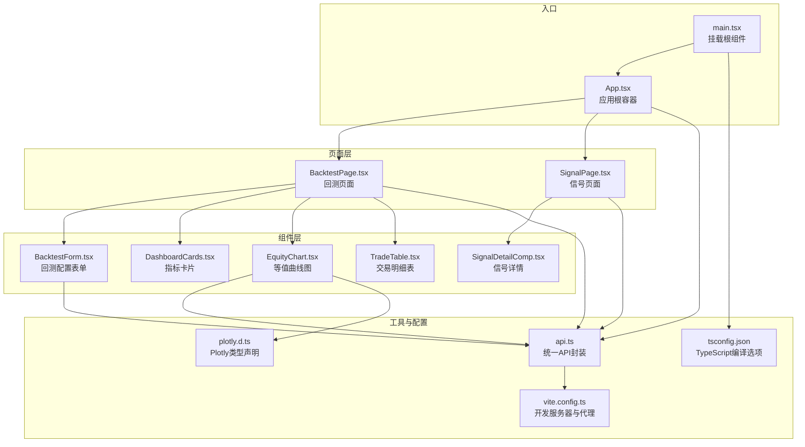
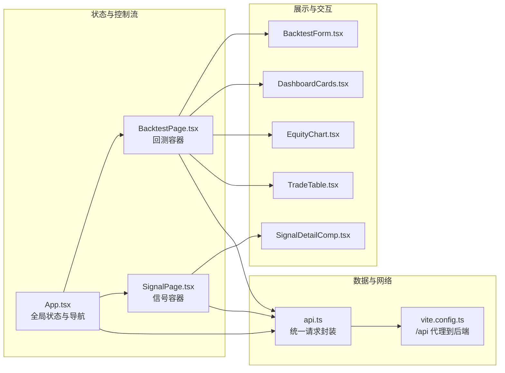
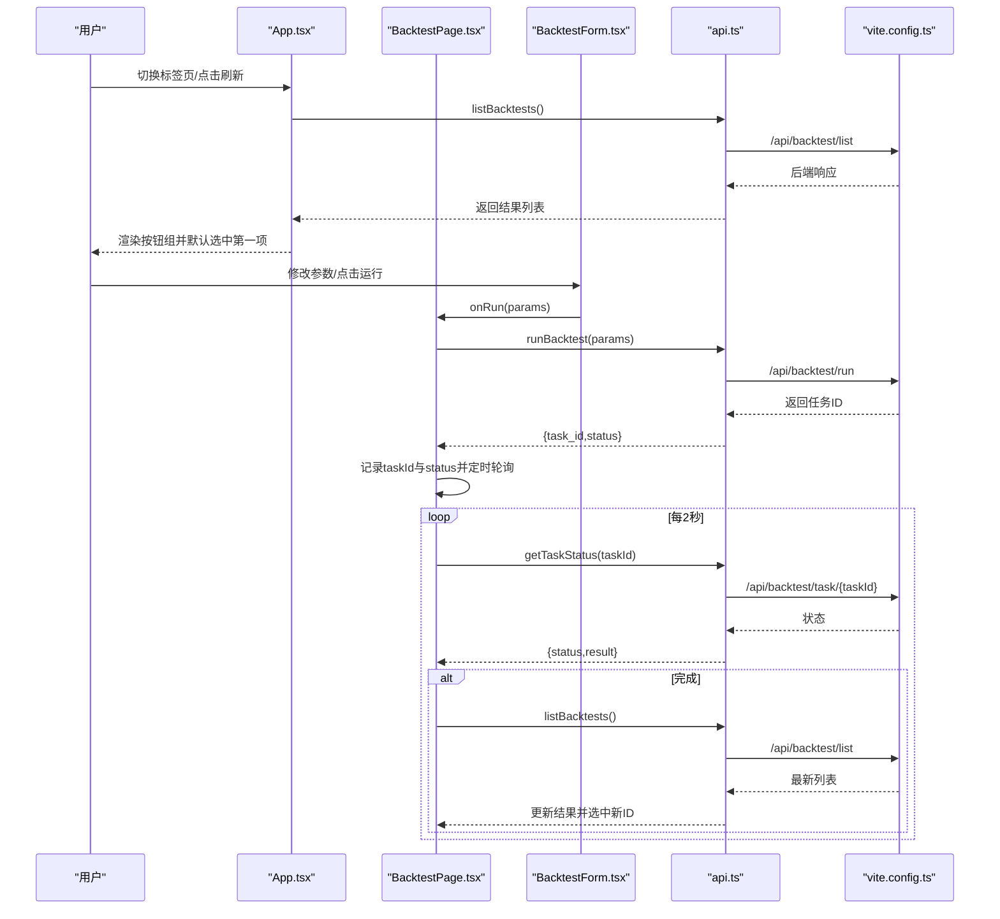
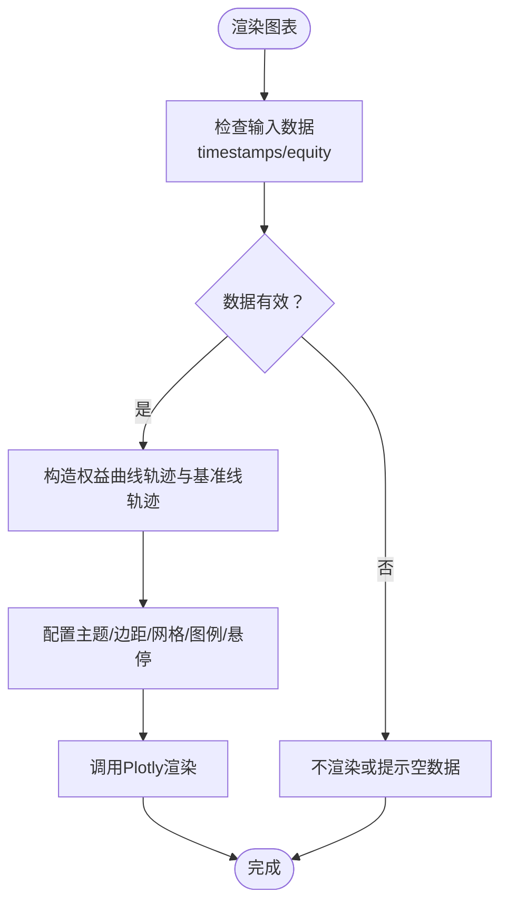
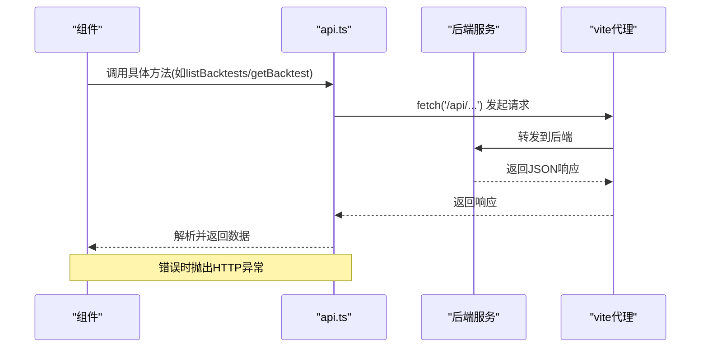
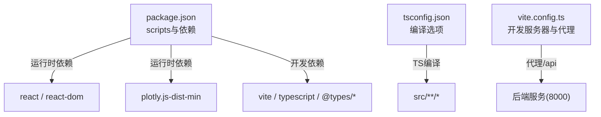

# 前端开发

<cite>
**本文引用的文件**
- [frontend/src/App.tsx](file://frontend/src/App.tsx)
- [frontend/src/main.tsx](file://frontend/src/main.tsx)
- [frontend/src/api.ts](file://frontend/src/api.ts)
- [frontend/src/pages/BacktestPage.tsx](file://frontend/src/pages/BacktestPage.tsx)
- [frontend/src/pages/SignalPage.tsx](file://frontend/src/pages/SignalPage.tsx)
- [frontend/src/components/BacktestForm.tsx](file://frontend/src/components/BacktestForm.tsx)
- [frontend/src/components/DashboardCards.tsx](file://frontend/src/components/DashboardCards.tsx)
- [frontend/src/components/EquityChart.tsx](file://frontend/src/components/EquityChart.tsx)
- [frontend/src/components/SignalDetail.tsx](file://frontend/src/components/SignalDetail.tsx)
- [frontend/src/components/TradeTable.tsx](file://frontend/src/components/TradeTable.tsx)
- [frontend/package.json](file://frontend/package.json)
- [frontend/vite.config.ts](file://frontend/vite.config.ts)
- [frontend/tsconfig.json](file://frontend/tsconfig.json)
- [frontend/src/plotly.d.ts](file://frontend/src/plotly.d.ts)
</cite>

## 目录
1. [简介](#简介)
2. [项目结构](#项目结构)
3. [核心组件](#核心组件)
4. [架构总览](#架构总览)
5. [详细组件分析](#详细组件分析)
6. [依赖关系分析](#依赖关系分析)
7. [性能考虑](#性能考虑)
8. [故障排查指南](#故障排查指南)
9. [结论](#结论)
10. [附录](#附录)

## 简介
本指南面向前端开发者，聚焦于该React应用的组件架构、状态管理与UI设计。内容涵盖组件层次结构、Props传递与事件处理、图表组件实现与数据可视化、交互设计、状态管理策略、路由配置与API集成、组件复用模式与样式定制、以及与后端API的通信协议与数据处理流程。目标是帮助读者快速理解并扩展该交易回测与信号分析系统的前端部分。

## 项目结构
前端采用Vite + React + TypeScript构建，使用Plotly进行图表渲染，通过代理将前端请求转发至本地后端服务。页面由两个主要页面组成：回测页面与信号分析页面；核心功能通过多个可复用组件完成，包括表单、仪表盘卡片、等值曲线图、交易表格与信号详情展示。

**图表来源**
- [frontend/src/main.tsx:1-5](file://frontend/src/main.tsx#L1-L5)
- [frontend/src/App.tsx:1-50](file://frontend/src/App.tsx#L1-L50)
- [frontend/src/pages/BacktestPage.tsx:1-94](file://frontend/src/pages/BacktestPage.tsx#L1-L94)
- [frontend/src/pages/SignalPage.tsx:1-39](file://frontend/src/pages/SignalPage.tsx#L1-L39)
- [frontend/src/components/BacktestForm.tsx:1-145](file://frontend/src/components/BacktestForm.tsx#L1-L145)
- [frontend/src/components/DashboardCards.tsx:1-54](file://frontend/src/components/DashboardCards.tsx#L1-L54)
- [frontend/src/components/EquityChart.tsx:1-49](file://frontend/src/components/EquityChart.tsx#L1-L49)
- [frontend/src/components/TradeTable.tsx:1-99](file://frontend/src/components/TradeTable.tsx#L1-L99)
- [frontend/src/components/SignalDetail.tsx:1-137](file://frontend/src/components/SignalDetail.tsx#L1-L137)
- [frontend/src/api.ts:1-51](file://frontend/src/api.ts#L1-L51)
- [frontend/vite.config.ts:1-11](file://frontend/vite.config.ts#L1-L11)
- [frontend/tsconfig.json:1-12](file://frontend/tsconfig.json#L1-L12)
- [frontend/src/plotly.d.ts:1-1](file://frontend/src/plotly.d.ts#L1-L1)

**章节来源**
- [frontend/src/main.tsx:1-5](file://frontend/src/main.tsx#L1-L5)
- [frontend/src/App.tsx:1-50](file://frontend/src/App.tsx#L1-L50)
- [frontend/package.json:1-22](file://frontend/package.json#L1-L22)
- [frontend/vite.config.ts:1-11](file://frontend/vite.config.ts#L1-L11)
- [frontend/tsconfig.json:1-12](file://frontend/tsconfig.json#L1-L12)

## 核心组件
- 应用根容器：负责全局状态（当前标签页、回测结果列表、选中项、加载状态）与页面切换。
- 页面组件：回测页面与信号页面分别承载各自的数据加载、轮询与展示逻辑。
- 可视化组件：等值曲线图与交易明细表负责数据可视化与交互。
- 表单与卡片：回测配置表单用于参数设置与提交；仪表盘卡片用于关键指标展示。
- 信号详情：按策略类型组织显示盈亏分布、指标触发统计与操作类型统计。

**章节来源**
- [frontend/src/App.tsx:6-48](file://frontend/src/App.tsx#L6-L48)
- [frontend/src/pages/BacktestPage.tsx:15-94](file://frontend/src/pages/BacktestPage.tsx#L15-L94)
- [frontend/src/pages/SignalPage.tsx:11-39](file://frontend/src/pages/SignalPage.tsx#L11-L39)
- [frontend/src/components/BacktestForm.tsx:9-145](file://frontend/src/components/BacktestForm.tsx#L9-L145)
- [frontend/src/components/DashboardCards.tsx:13-54](file://frontend/src/components/DashboardCards.tsx#L13-L54)
- [frontend/src/components/EquityChart.tsx:9-49](file://frontend/src/components/EquityChart.tsx#L9-L49)
- [frontend/src/components/TradeTable.tsx:17-99](file://frontend/src/components/TradeTable.tsx#L17-L99)
- [frontend/src/components/SignalDetail.tsx:8-137](file://frontend/src/components/SignalDetail.tsx#L8-L137)

## 架构总览
应用采用“容器组件 + 展示组件”的分层设计。容器组件（如App、BacktestPage、SignalPage）负责状态管理与副作用（数据拉取、轮询），展示组件（如BacktestForm、DashboardCards、EquityChart、TradeTable、SignalDetailComp）专注UI与交互。API封装集中于api.ts，统一处理请求、错误与响应格式。

**图表来源**
- [frontend/src/App.tsx:6-48](file://frontend/src/App.tsx#L6-L48)
- [frontend/src/pages/BacktestPage.tsx:15-94](file://frontend/src/pages/BacktestPage.tsx#L15-L94)
- [frontend/src/pages/SignalPage.tsx:11-39](file://frontend/src/pages/SignalPage.tsx#L11-L39)
- [frontend/src/components/BacktestForm.tsx:9-145](file://frontend/src/components/BacktestForm.tsx#L9-L145)
- [frontend/src/components/DashboardCards.tsx:13-54](file://frontend/src/components/DashboardCards.tsx#L13-L54)
- [frontend/src/components/EquityChart.tsx:9-49](file://frontend/src/components/EquityChart.tsx#L9-L49)
- [frontend/src/components/TradeTable.tsx:17-99](file://frontend/src/components/TradeTable.tsx#L17-L99)
- [frontend/src/components/SignalDetail.tsx:8-137](file://frontend/src/components/SignalDetail.tsx#L8-L137)
- [frontend/src/api.ts:1-51](file://frontend/src/api.ts#L1-L51)
- [frontend/vite.config.ts:7-9](file://frontend/vite.config.ts#L7-L9)

## 详细组件分析

### 组件层次与Props传递
- App.tsx
  - 状态：当前标签页、回测结果列表、选中项、加载状态。
  - 事件：点击切换标签页、点击刷新按钮触发列表加载。
  - Props传递：向BacktestPage与SignalPage传递results、selectedId、onSelect、onRefresh。
- BacktestPage.tsx
  - 状态：当前详情、任务轮询状态、任务ID。
  - 事件：接收onRun回调以启动回测；轮询任务状态并在完成后刷新列表与选中项。
  - Props传递：向BacktestForm传递onRun与taskStatus；向DashboardCards、EquityChart、TradeTable传递数据。
- SignalPage.tsx
  - 状态：信号分析数据与加载状态。
  - 事件：根据selectedId加载分析数据。
  - Props传递：向SignalDetailComp传递analysis与backtestId。
- 其他组件
  - BacktestForm：内部维护表单参数，向外暴露onRun回调。
  - DashboardCards/EquityChart/TradeTable/SignalDetailComp：纯展示组件，接收只读数据Props。

**章节来源**
- [frontend/src/App.tsx:6-48](file://frontend/src/App.tsx#L6-L48)
- [frontend/src/pages/BacktestPage.tsx:15-94](file://frontend/src/pages/BacktestPage.tsx#L15-L94)
- [frontend/src/pages/SignalPage.tsx:11-39](file://frontend/src/pages/SignalPage.tsx#L11-L39)
- [frontend/src/components/BacktestForm.tsx:9-145](file://frontend/src/components/BacktestForm.tsx#L9-L145)
- [frontend/src/components/DashboardCards.tsx:13-54](file://frontend/src/components/DashboardCards.tsx#L13-L54)
- [frontend/src/components/EquityChart.tsx:9-49](file://frontend/src/components/EquityChart.tsx#L9-L49)
- [frontend/src/components/TradeTable.tsx:17-99](file://frontend/src/components/TradeTable.tsx#L17-L99)
- [frontend/src/components/SignalDetail.tsx:8-137](file://frontend/src/components/SignalDetail.tsx#L8-L137)

### 事件处理与交互设计
- 导航与选择
  - App.tsx中的按钮切换标签页，并在加载时自动选择第一条回测结果作为默认选中项。
  - BacktestPage与SignalPage均提供按钮组以选择历史回测结果，点击后更新父级selectedId。
- 回测运行
  - BacktestForm收集参数并通过onRun回调交给BacktestPage执行。
  - BacktestPage启动回测后记录任务ID与状态，定时轮询任务状态，完成后刷新列表并选中新结果。
- 数据展开与筛选
  - TradeTable支持按操作类型过滤与点击展开查看指标明细。
  - SignalDetailComp按策略类型动态渲染不同层级或指标的统计信息。

**图表来源**
- [frontend/src/App.tsx:12-26](file://frontend/src/App.tsx#L12-L26)
- [frontend/src/pages/BacktestPage.tsx:43-51](file://frontend/src/pages/BacktestPage.tsx#L43-L51)
- [frontend/src/pages/BacktestPage.tsx:27-41](file://frontend/src/pages/BacktestPage.tsx#L27-L41)
- [frontend/src/components/BacktestForm.tsx:139-141](file://frontend/src/components/BacktestForm.tsx#L139-L141)
- [frontend/src/api.ts:40-51](file://frontend/src/api.ts#L40-L51)
- [frontend/vite.config.ts:7-9](file://frontend/vite.config.ts#L7-L9)

**章节来源**
- [frontend/src/App.tsx:30-38](file://frontend/src/App.tsx#L30-L38)
- [frontend/src/pages/BacktestPage.tsx:67-81](file://frontend/src/pages/BacktestPage.tsx#L67-L81)
- [frontend/src/pages/BacktestPage.tsx:27-41](file://frontend/src/pages/BacktestPage.tsx#L27-L41)
- [frontend/src/components/BacktestForm.tsx:139-141](file://frontend/src/components/BacktestForm.tsx#L139-L141)
- [frontend/src/components/TradeTable.tsx:17-99](file://frontend/src/components/TradeTable.tsx#L17-L99)
- [frontend/src/components/SignalDetail.tsx:8-137](file://frontend/src/components/SignalDetail.tsx#L8-L137)

### 图表组件实现与数据可视化
- EquityChart
  - 使用Plotly渲染权益曲线与初始资金线，支持响应式布局与统一X轴悬停。
  - 输入为时间戳数组与等值序列，内部计算初始余额并绘制两条轨迹。
- TradeTable
  - 支持按操作类型过滤、点击展开查看指标明细。
  - 动态列：当存在指标时额外渲染指标列。
- SignalDetailComp
  - 按策略类型区分展示层级或指标统计网格。
  - 提供盈亏分布卡片与操作类型统计表格。

**图表来源**
- [frontend/src/components/EquityChart.tsx:12-46](file://frontend/src/components/EquityChart.tsx#L12-L46)

**章节来源**
- [frontend/src/components/EquityChart.tsx:9-49](file://frontend/src/components/EquityChart.tsx#L9-L49)
- [frontend/src/components/TradeTable.tsx:17-99](file://frontend/src/components/TradeTable.tsx#L17-L99)
- [frontend/src/components/SignalDetail.tsx:8-137](file://frontend/src/components/SignalDetail.tsx#L8-L137)
- [frontend/src/plotly.d.ts:1-1](file://frontend/src/plotly.d.ts#L1-L1)

### 状态管理策略
- 全局状态
  - App.tsx维护当前标签页、回测结果列表、选中项与加载状态，作为顶层状态源。
- 页面内状态
  - BacktestPage.tsx维护当前详情、任务轮询状态与任务ID。
  - SignalPage.tsx维护分析数据与加载状态。
- 组件内状态
  - BacktestForm.tsx维护表单参数与日期范围。
  - TradeTable.tsx维护过滤器与展开行索引。
- 轮询与副作用
  - BacktestPage.tsx在任务未完成时每2秒轮询一次任务状态，完成后刷新列表并更新选中项。
- 状态提升与单向数据流
  - 选中项与列表更新通过回调向上游传递，避免跨组件共享状态。

**章节来源**
- [frontend/src/App.tsx:6-26](file://frontend/src/App.tsx#L6-L26)
- [frontend/src/pages/BacktestPage.tsx:15-51](file://frontend/src/pages/BacktestPage.tsx#L15-L51)
- [frontend/src/pages/BacktestPage.tsx:27-41](file://frontend/src/pages/BacktestPage.tsx#L27-L41)
- [frontend/src/pages/SignalPage.tsx:11-19](file://frontend/src/pages/SignalPage.tsx#L11-L19)
- [frontend/src/components/BacktestForm.tsx:9-24](file://frontend/src/components/BacktestForm.tsx#L9-L24)
- [frontend/src/components/TradeTable.tsx:17-23](file://frontend/src/components/TradeTable.tsx#L17-L23)

### 路由配置与页面导航
- 当前实现
  - 通过App.tsx内的简单标签页切换实现页面导航，无需外部路由库。
  - BacktestPage与SignalPage通过Props接收与传递选中项，保持组件间解耦。
- 扩展建议
  - 若未来需要URL直连与浏览器前进后退，可引入轻量路由库（如Wouter或React Router Minimal），以路径参数驱动selectedId与tab状态。

**章节来源**
- [frontend/src/App.tsx:28-47](file://frontend/src/App.tsx#L28-L47)
- [frontend/src/pages/BacktestPage.tsx:15-94](file://frontend/src/pages/BacktestPage.tsx#L15-L94)
- [frontend/src/pages/SignalPage.tsx:11-39](file://frontend/src/pages/SignalPage.tsx#L11-L39)

### API集成与数据处理
- 请求封装
  - api.ts统一处理基础路径、错误抛出与JSON解析，导出typed接口与方法集合。
- 端点映射
  - 列表、详情、运行回测、任务状态、参数与日期范围、信号详情与分析。
- 开发代理
  - vite.config.ts将/api前缀代理到本地后端地址，便于前后端联调。
- 数据处理
  - BacktestPage与SignalPage在useEffect中拉取数据并设置loading状态。
  - BacktestPage在任务完成后再次拉取列表并更新选中项。

**图表来源**
- [frontend/src/api.ts:1-7](file://frontend/src/api.ts#L1-L7)
- [frontend/src/api.ts:40-51](file://frontend/src/api.ts#L40-L51)
- [frontend/vite.config.ts:7-9](file://frontend/vite.config.ts#L7-L9)

**章节来源**
- [frontend/src/api.ts:1-51](file://frontend/src/api.ts#L1-L51)
- [frontend/vite.config.ts:1-11](file://frontend/vite.config.ts#L1-L11)
- [frontend/src/pages/BacktestPage.tsx:21-25](file://frontend/src/pages/BacktestPage.tsx#L21-L25)
- [frontend/src/pages/SignalPage.tsx:15-19](file://frontend/src/pages/SignalPage.tsx#L15-L19)

### 组件复用模式与样式定制
- 复用模式
  - 将通用UI元素抽象为卡片、按钮、表格等基础组件，通过className与CSS类名组合实现风格统一。
  - 展示组件接收只读Props，便于在不同上下文中复用。
- 样式定制
  - 使用CSS类名控制颜色、尺寸与布局，例如正负值高亮、激活态按钮、网格布局等。
  - 图表主题通过Plotly布局配置实现深色背景与统一配色。

**章节来源**
- [frontend/src/components/DashboardCards.tsx:13-54](file://frontend/src/components/DashboardCards.tsx#L13-L54)
- [frontend/src/components/TradeTable.tsx:17-99](file://frontend/src/components/TradeTable.tsx#L17-L99)
- [frontend/src/components/EquityChart.tsx:33-44](file://frontend/src/components/EquityChart.tsx#L33-L44)

## 依赖关系分析
- 运行时依赖
  - react、react-dom：框架基础。
  - plotly.js-dist-min：图表渲染。
- 开发依赖
  - vite、typescript、@types/react、@types/react-dom：构建与类型支持。
- 配置
  - package.json脚本：dev/build/preview。
  - tsconfig.json：ES模块、严格模式、JSX转换。
  - vite.config.ts：开发服务器端口与/api代理。

**图表来源**
- [frontend/package.json:1-22](file://frontend/package.json#L1-L22)
- [frontend/tsconfig.json:1-12](file://frontend/tsconfig.json#L1-L12)
- [frontend/vite.config.ts:1-11](file://frontend/vite.config.ts#L1-L11)

**章节来源**
- [frontend/package.json:1-22](file://frontend/package.json#L1-L22)
- [frontend/tsconfig.json:1-12](file://frontend/tsconfig.json#L1-L12)
- [frontend/vite.config.ts:1-11](file://frontend/vite.config.ts#L1-L11)

## 性能考虑
- 渲染优化
  - 使用React.memo或函数组件的浅比较减少重渲染（当前组件多为函数组件，Props稳定时天然避免多余渲染）。
  - 列表渲染使用唯一key，避免不必要的节点重建。
- 数据加载
  - 在数据未就绪时显示占位符或加载指示，避免空白闪烁。
  - 合理使用useEffect依赖数组，避免重复请求。
- 图表性能
  - Plotly渲染大量点时注意数据规模，必要时进行采样或分段渲染。
- 轮询策略
  - 任务轮询间隔2秒较为合理，可在任务完成后立即停止轮询，避免资源浪费。

[本节为通用指导，无需特定文件引用]

## 故障排查指南
- 网络请求失败
  - 检查vite代理是否正确指向后端地址，确认端口与路径一致。
  - 查看api.ts中的错误抛出与控制台输出，定位HTTP状态码。
- 图表不显示
  - 确认传入的时间戳与等值序列非空且长度一致。
  - 检查Plotly类型声明与CDN包是否正确安装。
- 任务状态轮询无效
  - 确认任务ID与状态字段正确传递，检查轮询定时器清理逻辑。
- 表单参数异常
  - 检查受控组件的onChange与类型转换逻辑，确保数值与布尔值正确更新。

**章节来源**
- [frontend/vite.config.ts:7-9](file://frontend/vite.config.ts#L7-L9)
- [frontend/src/api.ts:3-7](file://frontend/src/api.ts#L3-L7)
- [frontend/src/components/EquityChart.tsx:12-13](file://frontend/src/components/EquityChart.tsx#L12-L13)
- [frontend/src/pages/BacktestPage.tsx:27-41](file://frontend/src/pages/BacktestPage.tsx#L27-L41)
- [frontend/src/components/BacktestForm.tsx:26-26](file://frontend/src/components/BacktestForm.tsx#L26-L26)

## 结论
该React前端以清晰的组件分层与职责划分实现了交易回测与信号分析的核心功能。通过统一的API封装、合理的状态管理与图表可视化，系统具备良好的可维护性与扩展性。建议后续引入轻量路由以支持URL直连，并持续优化图表渲染与数据加载体验。

[本节为总结，无需特定文件引用]

## 附录
- 类型定义概览
  - BacktestSummary：回测摘要列表项。
  - BacktestDetail：回测详情，包含等值曲线、交易明细与资金费用汇总。
  - TradeRecord：交易记录，含指标字典。
  - SignalDetail：信号分析详情，含丰富统计与摘要。
- 关键实现要点
  - Props向下传递，回调向上汇聚，形成稳定的单向数据流。
  - 组件内状态与页面状态分离，避免跨组件共享复杂状态。
  - 图表组件独立渲染，通过Props注入数据，便于替换与扩展。

**章节来源**
- [frontend/src/api.ts:9-38](file://frontend/src/api.ts#L9-L38)