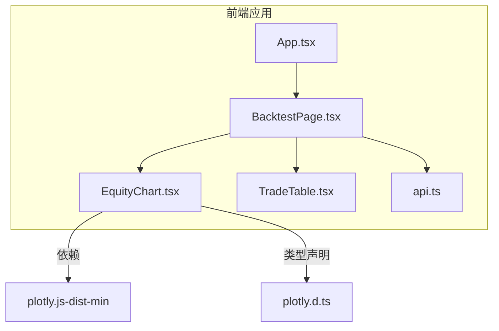
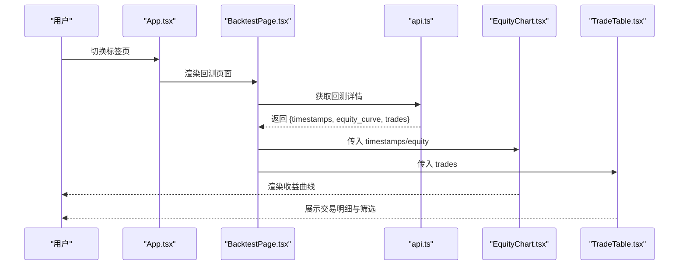
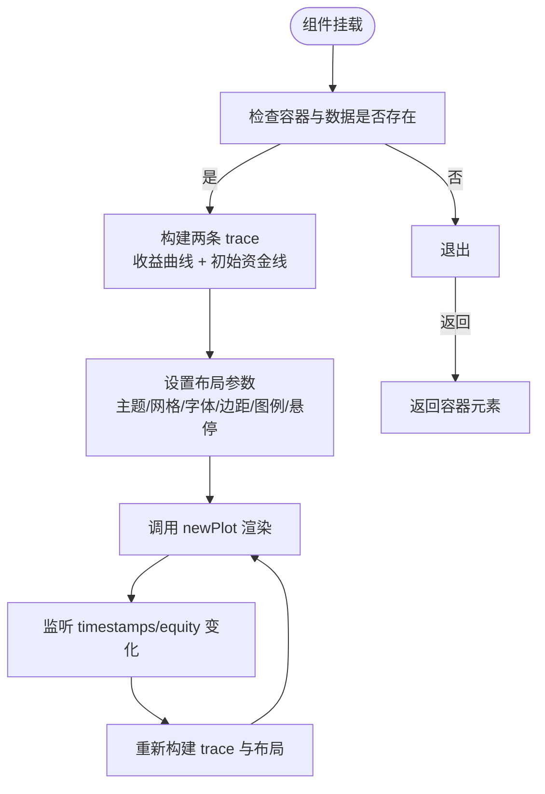
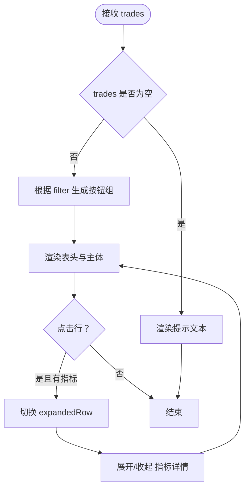
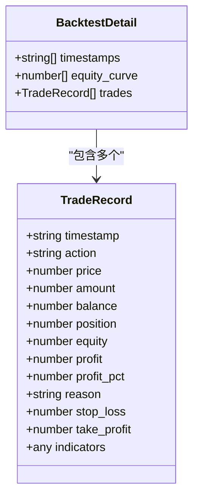
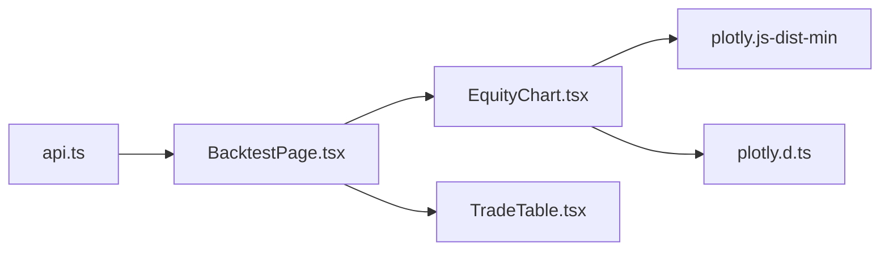

# 图表可视化

<cite>
**本文引用的文件**
- [EquityChart.tsx](file://frontend/src/components/EquityChart.tsx)
- [TradeTable.tsx](file://frontend/src/components/TradeTable.tsx)
- [plotly.d.ts](file://frontend/src/plotly.d.ts)
- [package.json](file://frontend/package.json)
- [vite.config.ts](file://frontend/vite.config.ts)
- [api.ts](file://frontend/src/api.ts)
- [BacktestPage.tsx](file://frontend/src/pages/BacktestPage.tsx)
- [App.tsx](file://frontend/src/App.tsx)
</cite>

## 目录
1. [简介](#简介)
2. [项目结构](#项目结构)
3. [核心组件](#核心组件)
4. [架构总览](#架构总览)
5. [组件详解](#组件详解)
6. [依赖关系分析](#依赖关系分析)
7. [性能与大数据量处理](#性能与大数据量处理)
8. [故障排查指南](#故障排查指南)
9. [结论](#结论)
10. [附录](#附录)

## 简介
本文件聚焦于前端图表可视化模块，围绕 EquityChart（收益曲线图）与 TradeTable（交易明细表）两大组件展开，系统阐述以下内容：
- Plotly.js 的集成方式、图表配置与交互能力
- EquityChart 的收益曲线绘制、数据格式与动态更新机制
- TradeTable 的表格实现、排序筛选与可扩展详情展示
- 主题定制、动画与移动端适配建议
- 性能优化与大数据量处理策略

## 项目结构
前端采用 Vite + React + TypeScript 构建，图表相关代码集中在 components 目录；EquityChart 使用 Plotly.js 进行渲染，TradeTable 为纯 HTML 表格配合状态管理实现筛选与详情展开。

**图表来源**
- [App.tsx:1-50](file://frontend/src/App.tsx#L1-L50)
- [BacktestPage.tsx:1-94](file://frontend/src/pages/BacktestPage.tsx#L1-L94)
- [EquityChart.tsx:1-49](file://frontend/src/components/EquityChart.tsx#L1-L49)
- [TradeTable.tsx:1-99](file://frontend/src/components/TradeTable.tsx#L1-L99)
- [api.ts:1-51](file://frontend/src/api.ts#L1-L51)
- [plotly.d.ts:1-1](file://frontend/src/plotly.d.ts#L1-L1)
- [package.json:16-20](file://frontend/package.json#L16-L20)

**章节来源**
- [App.tsx:1-50](file://frontend/src/App.tsx#L1-L50)
- [BacktestPage.tsx:1-94](file://frontend/src/pages/BacktestPage.tsx#L1-L94)
- [package.json:1-22](file://frontend/package.json#L1-L22)

## 核心组件
- EquityChart：基于 Plotly.js 绘制收益曲线，支持响应式布局与交互悬停统一模式。
- TradeTable：展示交易明细，支持按操作类型筛选、行内展开显示指标详情。

**章节来源**
- [EquityChart.tsx:9-49](file://frontend/src/components/EquityChart.tsx#L9-L49)
- [TradeTable.tsx:17-99](file://frontend/src/components/TradeTable.tsx#L17-L99)

## 架构总览
下图展示了从应用入口到页面再到具体图表组件的数据流与依赖关系。

**图表来源**
- [App.tsx:28-47](file://frontend/src/App.tsx#L28-L47)
- [BacktestPage.tsx:15-91](file://frontend/src/pages/BacktestPage.tsx#L15-L91)
- [api.ts:17-33](file://frontend/src/api.ts#L17-L33)

## 组件详解

### EquityChart 收益曲线图
- 数据输入
  - 接收 timestamps（字符串数组）、equity（数值数组）
  - 初始资金线：通过首尾两点绘制水平虚线
- 图表配置
  - 布局背景与网格颜色采用深色系，提升对比度
  - Y 轴添加货币前缀，图例位于顶部横向排列
  - 启用响应式与关闭工具栏，保证简洁
- 绘制逻辑
  - 首次挂载时根据 props 创建两条 trace，并调用 newPlot 完成渲染
  - 当 timestamps 或 equity 变化时重新渲染
- 交互特性
  - 悬停模式为“x 统一”，便于跨多条线比较
- 动态更新机制
  - 通过 React useEffect 的依赖数组触发重绘
  - 若容器或数据为空则跳过渲染

**图表来源**
- [EquityChart.tsx:12-46](file://frontend/src/components/EquityChart.tsx#L12-L46)

**章节来源**
- [EquityChart.tsx:4-7](file://frontend/src/components/EquityChart.tsx#L4-L7)
- [EquityChart.tsx:9-49](file://frontend/src/components/EquityChart.tsx#L9-L49)

### TradeTable 交易明细表
- 数据输入
  - 接收 trades（TradeRecord 数组），包含时间、操作、价格、数量、盈亏、收益率、原因等字段
- 筛选与状态
  - 内部维护 filter（默认 ALL）与 expandedRow（展开行索引）
  - 根据 action 字段进行过滤，按钮组动态生成
- 表头与列
  - 时间、操作、价格、数量、盈亏、收益率、原因、指标（条件渲染）
- 行内详情
  - 点击行可展开显示 indicators 映射，网格布局展示键值
  - 指标存在时在该行末尾显示“展开/收起”指示
- 样式与交互
  - 正负值分别标注不同类名以突出颜色
  - 指标存在时行具备点击指针光标

**图表来源**
- [TradeTable.tsx:17-99](file://frontend/src/components/TradeTable.tsx#L17-L99)

**章节来源**
- [TradeTable.tsx:17-99](file://frontend/src/components/TradeTable.tsx#L17-L99)
- [api.ts:27-33](file://frontend/src/api.ts#L27-L33)

### 类型与依赖
- 类型定义
  - BacktestDetail 提供 timestamps、equity_curve、trades 等字段
  - TradeRecord 定义交易记录字段集合
- 第三方库
  - plotly.js-dist-min：最小化版本的 Plotly.js
  - 类型声明文件 plotly.d.ts 用于模块增强
- 构建与代理
  - Vite 本地开发服务器端口与后端代理配置

**图表来源**
- [api.ts:17-33](file://frontend/src/api.ts#L17-L33)

**章节来源**
- [api.ts:9-33](file://frontend/src/api.ts#L9-L33)
- [plotly.d.ts:1-1](file://frontend/src/plotly.d.ts#L1-L1)
- [package.json:16-20](file://frontend/package.json#L16-L20)
- [vite.config.ts:3-11](file://frontend/vite.config.ts#L3-L11)

## 依赖关系分析
- EquityChart 对外仅依赖 Plotly.js 与 React，内部通过 DOM 引用完成渲染
- TradeTable 为纯函数组件，依赖 React 状态与外部传入数据
- 页面层 BacktestPage 将 api.ts 返回的回测详情传递给两个子组件
- 类型定义由 api.ts 提供，确保组件间契约清晰

**图表来源**
- [BacktestPage.tsx:15-91](file://frontend/src/pages/BacktestPage.tsx#L15-L91)
- [EquityChart.tsx:1-3](file://frontend/src/components/EquityChart.tsx#L1-L3)
- [plotly.d.ts:1-1](file://frontend/src/plotly.d.ts#L1-L1)
- [package.json:16-20](file://frontend/package.json#L16-L20)

**章节来源**
- [BacktestPage.tsx:15-91](file://frontend/src/pages/BacktestPage.tsx#L15-L91)
- [EquityChart.tsx:1-3](file://frontend/src/components/EquityChart.tsx#L1-L3)

## 性能与大数据量处理
- 图表渲染
  - 使用响应式布局与关闭工具栏减少冗余元素
  - 悬停统一模式避免多点分散导致的性能问题
- 数据规模控制
  - 在服务端或上游数据处理阶段进行采样或聚合，降低点数
  - 对 timestamps 与 equity 传入前做长度上限判断与截断
- 组件更新
  - EquityChart 通过依赖数组精准触发重绘，避免不必要的全量更新
  - TradeTable 的筛选与展开为本地状态，复杂度与数据规模线性相关
- 打包与体积
  - 使用 plotly.js-dist-min 已压缩版本，减少体积
  - 如需进一步瘦身，可在构建时按需引入 Plotly 模块（需额外配置）

[本节为通用性能建议，不直接分析具体文件]

## 故障排查指南
- 图表不显示
  - 检查容器是否已挂载以及 timestamps 是否为空
  - 确认 Plotly 库已正确安装与类型声明可用
- 数据未更新
  - 确保父组件传入的 timestamps/equity 发生变化
  - 检查 BacktestPage 中对 selectedId 的变更是否触发了详情请求
- 交互异常
  - 悬停模式为 x 统一，若需要更精细控制可调整 hovermode
  - 若出现滚动或布局错位，检查容器高度与响应式设置

**章节来源**
- [EquityChart.tsx:12-13](file://frontend/src/components/EquityChart.tsx#L12-L13)
- [BacktestPage.tsx:21-25](file://frontend/src/pages/BacktestPage.tsx#L21-L25)

## 结论
本模块通过轻量的 React 组件与 Plotly.js 实现了高可读性的收益曲线与交易明细表格。EquityChart 注重主题一致性与交互体验，TradeTable 提供灵活的筛选与详情展开。结合合理的数据规模控制与组件更新策略，可在保持良好性能的同时满足回测分析场景的需求。

## 附录
- 主题定制建议
  - 通过布局中的颜色字段（背景、网格、字体）统一风格
  - 可在容器上增加暗色/亮色主题切换类名，动态覆盖颜色变量
- 动画与过渡
  - Plotly 支持多种动画配置，可在 newPlot 的配置项中启用
  - 表格层面可通过 CSS 过渡类实现行展开的平滑动画
- 移动端适配
  - 使用响应式布局与合适的容器尺寸
  - 控制字体大小与行高，确保在小屏设备上可读性良好

[本节为通用指导，不直接分析具体文件]