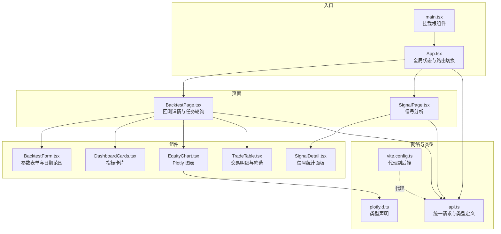
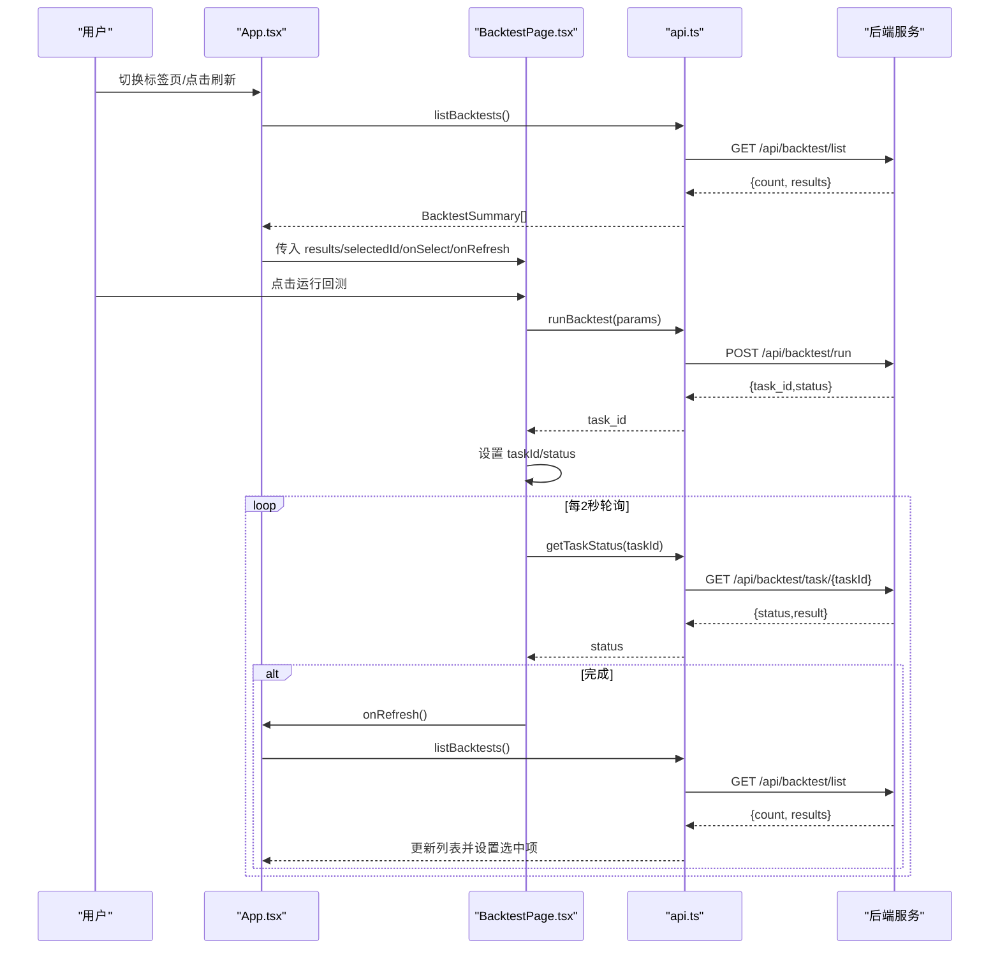
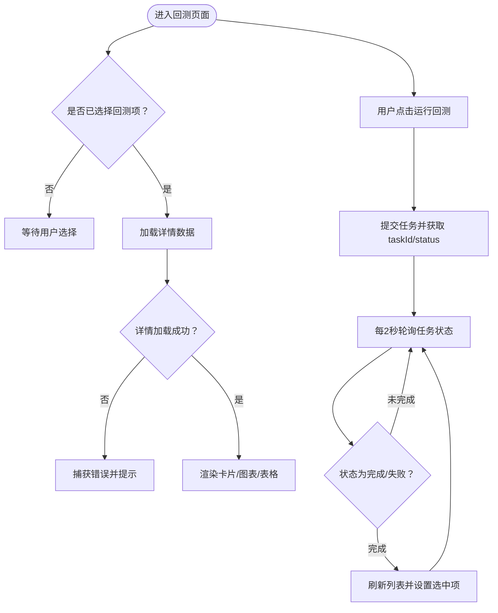
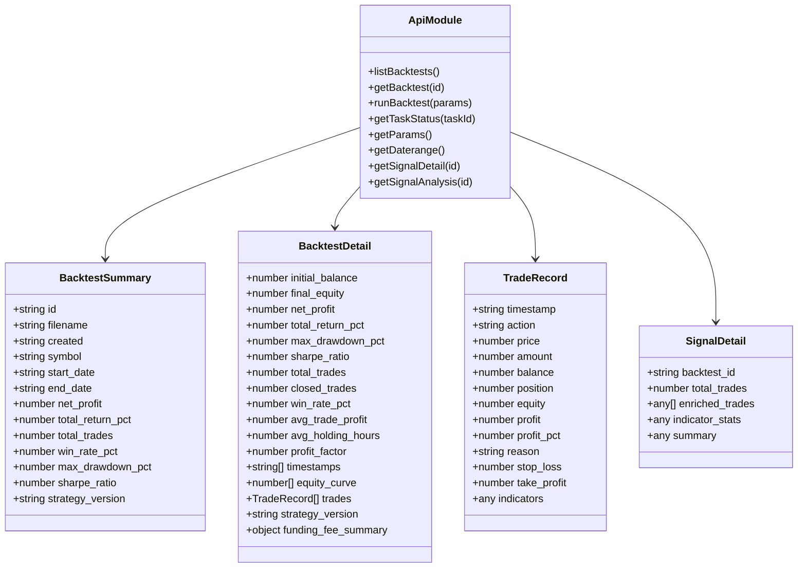
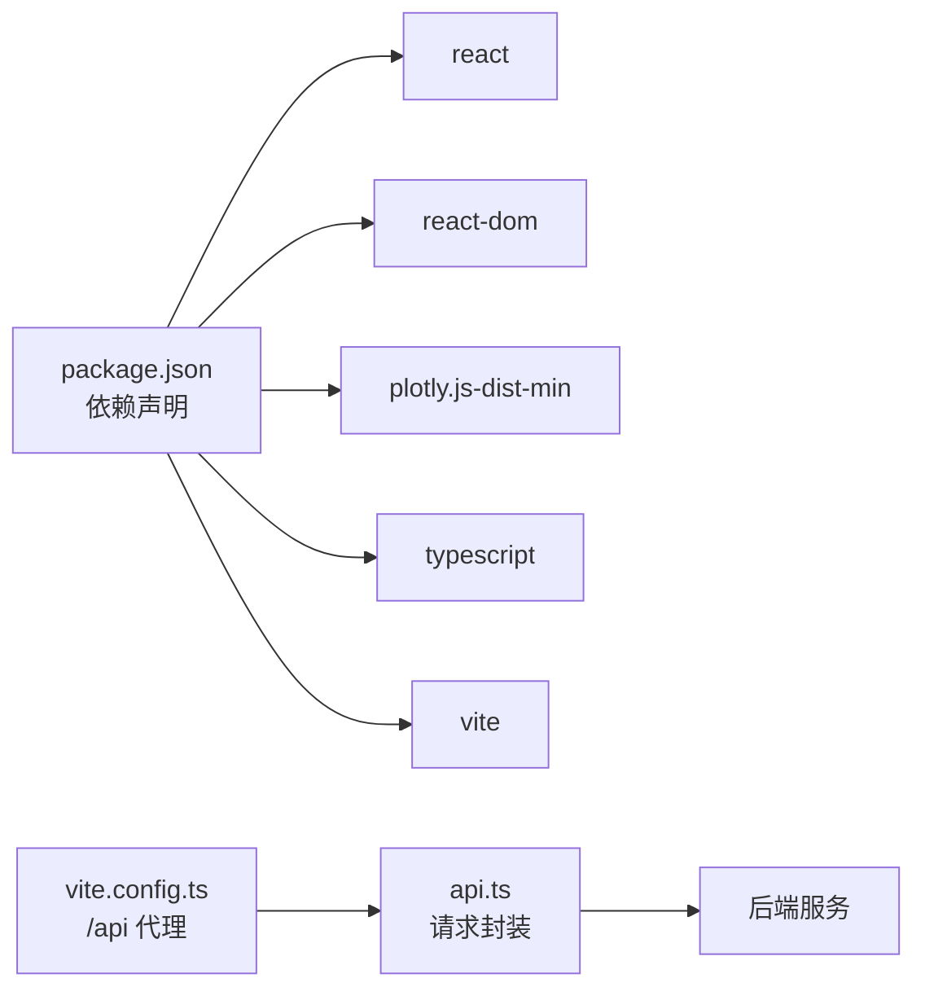

# 状态管理

<cite>
**本文引用的文件**
- [frontend/src/App.tsx](file://frontend/src/App.tsx)
- [frontend/src/main.tsx](file://frontend/src/main.tsx)
- [frontend/src/api.ts](file://frontend/src/api.ts)
- [frontend/src/pages/BacktestPage.tsx](file://frontend/src/pages/BacktestPage.tsx)
- [frontend/src/pages/SignalPage.tsx](file://frontend/src/pages/SignalPage.tsx)
- [frontend/src/components/BacktestForm.tsx](file://frontend/src/components/BacktestForm.tsx)
- [frontend/src/components/DashboardCards.tsx](file://frontend/src/components/DashboardCards.tsx)
- [frontend/src/components/EquityChart.tsx](file://frontend/src/components/EquityChart.tsx)
- [frontend/src/components/TradeTable.tsx](file://frontend/src/components/TradeTable.tsx)
- [frontend/src/components/SignalDetail.tsx](file://frontend/src/components/SignalDetail.tsx)
- [frontend/src/plotly.d.ts](file://frontend/src/plotly.d.ts)
- [frontend/vite.config.ts](file://frontend/vite.config.ts)
- [frontend/package.json](file://frontend/package.json)
- [frontend/tsconfig.json](file://frontend/tsconfig.json)
</cite>

## 目录
1. [引言](#引言)
2. [项目结构](#项目结构)
3. [核心组件](#核心组件)
4. [架构总览](#架构总览)
5. [详细组件分析](#详细组件分析)
6. [依赖关系分析](#依赖关系分析)
7. [性能考量](#性能考量)
8. [故障排查指南](#故障排查指南)
9. [结论](#结论)
10. [附录](#附录)

## 引言
本指南聚焦于前端应用的状态组织与数据流管理，结合当前仓库中的前端代码，系统阐述以下主题：
- 全局状态设计：如何在顶层组件集中管理共享状态（如当前标签页、回测列表、选中项等）。
- 局部状态管理：页面级与组件级状态的职责划分与生命周期管理。
- 组件间通信机制：通过 props 向下传递、回调向上更新的方式实现松耦合通信。
- API 数据获取、缓存策略与错误处理：统一请求封装、加载态与错误兜底。
- 类型定义、接口规范与数据验证：以 TypeScript 接口约束数据结构。
- 状态持久化、同步机制与并发控制：轮询任务状态、避免竞态与重复请求。
- 状态调试工具、性能监控与最佳实践：开发体验与运行时优化建议。

## 项目结构
前端采用 React + TypeScript 构建，使用 Vite 作为开发服务器与打包工具。状态主要分布在顶层 App 与页面组件中，API 请求集中在独立模块，图表与表格组件负责局部状态与渲染。

图示来源
- [frontend/src/main.tsx:1-5](file://frontend/src/main.tsx#L1-L5)
- [frontend/src/App.tsx:1-50](file://frontend/src/App.tsx#L1-L50)
- [frontend/src/pages/BacktestPage.tsx:1-94](file://frontend/src/pages/BacktestPage.tsx#L1-L94)
- [frontend/src/pages/SignalPage.tsx:1-39](file://frontend/src/pages/SignalPage.tsx#L1-L39)
- [frontend/src/components/BacktestForm.tsx:1-145](file://frontend/src/components/BacktestForm.tsx#L1-L145)
- [frontend/src/components/DashboardCards.tsx:1-54](file://frontend/src/components/DashboardCards.tsx#L1-L54)
- [frontend/src/components/EquityChart.tsx:1-49](file://frontend/src/components/EquityChart.tsx#L1-L49)
- [frontend/src/components/TradeTable.tsx:1-99](file://frontend/src/components/TradeTable.tsx#L1-L99)
- [frontend/src/components/SignalDetail.tsx:1-137](file://frontend/src/components/SignalDetail.tsx#L1-L137)
- [frontend/src/api.ts:1-51](file://frontend/src/api.ts#L1-L51)
- [frontend/src/plotly.d.ts:1-1](file://frontend/src/plotly.d.ts#L1-L1)
- [frontend/vite.config.ts:1-11](file://frontend/vite.config.ts#L1-L11)

章节来源
- [frontend/src/main.tsx:1-5](file://frontend/src/main.tsx#L1-L5)
- [frontend/src/App.tsx:1-50](file://frontend/src/App.tsx#L1-L50)
- [frontend/vite.config.ts:1-11](file://frontend/vite.config.ts#L1-L11)

## 核心组件
- 应用入口与根组件
  - 入口文件负责挂载根组件，确保应用在 DOM 中正确渲染。
  - 根组件负责全局状态（当前标签页、回测列表、选中项、加载态）与页面切换。
- 页面组件
  - 回测页面：负责回测详情加载、任务状态轮询、历史列表展示与交互。
  - 信号页面：负责信号分析数据加载与展示。
- 组件层
  - 表单组件：维护回测参数与日期范围，支持按策略版本动态显示参数。
  - 指标卡片：格式化并展示回测关键指标。
  - 图表组件：基于 Plotly 渲染权益曲线。
  - 表格组件：展示交易明细，支持筛选与展开查看指标。
  - 信号详情：按策略版本展示不同维度的统计信息。

章节来源
- [frontend/src/main.tsx:1-5](file://frontend/src/main.tsx#L1-L5)
- [frontend/src/App.tsx:1-50](file://frontend/src/App.tsx#L1-L50)
- [frontend/src/pages/BacktestPage.tsx:1-94](file://frontend/src/pages/BacktestPage.tsx#L1-L94)
- [frontend/src/pages/SignalPage.tsx:1-39](file://frontend/src/pages/SignalPage.tsx#L1-L39)
- [frontend/src/components/BacktestForm.tsx:1-145](file://frontend/src/components/BacktestForm.tsx#L1-L145)
- [frontend/src/components/DashboardCards.tsx:1-54](file://frontend/src/components/DashboardCards.tsx#L1-L54)
- [frontend/src/components/EquityChart.tsx:1-49](file://frontend/src/components/EquityChart.tsx#L1-L49)
- [frontend/src/components/TradeTable.tsx:1-99](file://frontend/src/components/TradeTable.tsx#L1-L99)
- [frontend/src/components/SignalDetail.tsx:1-137](file://frontend/src/components/SignalDetail.tsx#L1-L137)

## 架构总览
整体采用“自顶向下”的状态管理模式：
- 全局状态由根组件持有，用于跨页面共享与切换。
- 页面组件负责自身数据获取与任务轮询，避免状态上溢。
- 组件内部仅管理与自身渲染相关的局部状态（如筛选、展开行等）。
- API 层统一处理请求、错误与响应类型，页面与组件通过回调或重新拉取实现同步。

图示来源
- [frontend/src/App.tsx:12-26](file://frontend/src/App.tsx#L12-L26)
- [frontend/src/pages/BacktestPage.tsx:43-51](file://frontend/src/pages/BacktestPage.tsx#L43-L51)
- [frontend/src/pages/BacktestPage.tsx:27-41](file://frontend/src/pages/BacktestPage.tsx#L27-L41)
- [frontend/src/api.ts:40-51](file://frontend/src/api.ts#L40-L51)

## 详细组件分析

### 全局状态与页面路由（App）
- 状态职责
  - tab：控制当前显示的页面（回测/信号）。
  - results：回测列表数据，供两个页面共享。
  - selectedId：当前选中的回测项 ID。
  - loading：列表加载态。
- 生命周期
  - 首次挂载时拉取回测列表；刷新按钮可手动触发。
- 通信机制
  - 将 results、selectedId、onSelect、onRefresh 通过 props 传递给子页面组件。

章节来源
- [frontend/src/App.tsx:6-26](file://frontend/src/App.tsx#L6-L26)

### 回测页面（BacktestPage）
- 状态职责
  - detail：当前选中回测的详细数据。
  - loading：详情加载态。
  - taskId/taskStatus：异步任务状态轮询。
- 生命周期
  - 选中项变化时加载详情；轮询任务状态，完成后刷新列表并更新选中项。
- 并发与同步
  - 通过 taskId 与 taskStatus 控制轮询节奏，避免重复轮询。
  - 完成后调用父组件提供的刷新回调，保证 UI 与数据一致。

图示来源
- [frontend/src/pages/BacktestPage.tsx:15-94](file://frontend/src/pages/BacktestPage.tsx#L15-L94)
- [frontend/src/pages/BacktestPage.tsx:27-41](file://frontend/src/pages/BacktestPage.tsx#L27-L41)
- [frontend/src/pages/BacktestPage.tsx:43-51](file://frontend/src/pages/BacktestPage.tsx#L43-L51)

章节来源
- [frontend/src/pages/BacktestPage.tsx:15-94](file://frontend/src/pages/BacktestPage.tsx#L15-L94)

### 信号页面（SignalPage）
- 状态职责
  - analysis：信号分析结果。
  - loading：分析数据加载态。
- 生命周期
  - 选中项变化时加载分析数据。
- 通信机制
  - 通过 props 接收 results 与 selectedId，并在 UI 中提供选择控件。

章节来源
- [frontend/src/pages/SignalPage.tsx:11-39](file://frontend/src/pages/SignalPage.tsx#L11-L39)

### 表单组件（BacktestForm）
- 状态职责
  - params：回测参数对象，随用户输入实时更新。
  - daterange：可用日期范围，首次渲染时拉取。
- 动态参数
  - 根据策略版本动态显示不同参数组（如 MTF 或 multi_indicator）。
- 并发与同步
  - 通过禁用按钮避免重复提交；任务运行期间阻止再次提交。

章节来源
- [frontend/src/components/BacktestForm.tsx:9-145](file://frontend/src/components/BacktestForm.tsx#L9-L145)

### 指标卡片（DashboardCards）
- 状态职责
  - 接收 detail 对象，格式化并展示关键指标。
- 增强能力
  - 当存在资金费用时，额外展示费用汇总卡片。

章节来源
- [frontend/src/components/DashboardCards.tsx:13-54](file://frontend/src/components/DashboardCards.tsx#L13-L54)

### 图表组件（EquityChart）
- 状态职责
  - 接收 timestamps 与 equity 数组，在渲染时创建 Plotly 图。
- 性能注意
  - 仅在数据变化时重新绘制，避免不必要的重绘。

章节来源
- [frontend/src/components/EquityChart.tsx:9-49](file://frontend/src/components/EquityChart.tsx#L9-L49)
- [frontend/src/plotly.d.ts:1-1](file://frontend/src/plotly.d.ts#L1-L1)

### 交易表格（TradeTable）
- 状态职责
  - 过滤器：按操作类型筛选交易。
  - 展开行：点击行可展开查看指标详情。
- 交互细节
  - 支持多种操作类型的标签样式；根据盈亏正负展示颜色。

章节来源
- [frontend/src/components/TradeTable.tsx:17-99](file://frontend/src/components/TradeTable.tsx#L17-L99)

### 信号详情（SignalDetail）
- 状态职责
  - 接收 analysis 对象，按策略版本渲染不同统计面板。
- 结构化展示
  - 盈亏分布、指标触发统计、操作类型统计三部分。

章节来源
- [frontend/src/components/SignalDetail.tsx:8-137](file://frontend/src/components/SignalDetail.tsx#L8-L137)

### API 与类型定义（api.ts）
- 统一请求封装
  - request 函数封装 fetch，统一处理响应状态与 JSON 解析。
  - 所有 API 方法返回 Promise，便于页面与组件直接消费。
- 类型定义
  - BacktestSummary、BacktestDetail、TradeRecord、SignalDetail 等接口明确数据结构。
- 错误处理
  - 非 OK 响应抛出异常；调用方需自行捕获并处理。

图示来源
- [frontend/src/api.ts:3-7](file://frontend/src/api.ts#L3-L7)
- [frontend/src/api.ts:9-38](file://frontend/src/api.ts#L9-L38)
- [frontend/src/api.ts:40-51](file://frontend/src/api.ts#L40-L51)

章节来源
- [frontend/src/api.ts:1-51](file://frontend/src/api.ts#L1-L51)

## 依赖关系分析
- 开发与运行时依赖
  - React 与 ReactDOM：UI 渲染基础。
  - Plotly：图表渲染。
  - Vite：开发服务器与构建工具。
  - TypeScript：类型系统。
- 代理配置
  - 前端开发服务器通过代理将 /api 请求转发至后端服务，便于本地联调。

图示来源
- [frontend/package.json:16-20](file://frontend/package.json#L16-L20)
- [frontend/vite.config.ts:7-8](file://frontend/vite.config.ts#L7-L8)
- [frontend/src/api.ts:1-7](file://frontend/src/api.ts#L1-L7)

章节来源
- [frontend/package.json:1-22](file://frontend/package.json#L1-L22)
- [frontend/vite.config.ts:1-11](file://frontend/vite.config.ts#L1-L11)
- [frontend/tsconfig.json:1-12](file://frontend/tsconfig.json#L1-L12)

## 性能考量
- 渲染优化
  - 图表组件仅在数据变化时重绘，减少不必要的计算与 DOM 操作。
  - 表格组件按需展开指标详情，避免一次性渲染大量内容。
- 网络与轮询
  - 任务轮询间隔固定为 2 秒，可根据实际任务耗时调整；完成或失败后及时停止轮询。
  - 避免在多个组件中重复发起相同请求，优先通过 props 传递或统一刷新。
- 类型与校验
  - 使用 TypeScript 接口约束数据结构，降低运行时错误概率。
  - 在关键字段缺失或格式异常时，页面组件应提供降级展示与错误提示。

## 故障排查指南
- 网络请求失败
  - 检查代理配置是否正确指向后端服务。
  - 查看浏览器网络面板与控制台错误信息。
- 任务状态不更新
  - 确认 taskId 是否为空以及 taskStatus 是否为完成/失败。
  - 检查轮询逻辑是否被清理或重复初始化。
- 图表不渲染
  - 确保传入的时间戳与权益数组非空且长度一致。
  - 检查容器元素是否已挂载并具备尺寸。
- 表格无数据
  - 确认 selectedId 已正确传递，且后端返回的数据结构与接口定义一致。

章节来源
- [frontend/vite.config.ts:7-8](file://frontend/vite.config.ts#L7-L8)
- [frontend/src/pages/BacktestPage.tsx:27-41](file://frontend/src/pages/BacktestPage.tsx#L27-L41)
- [frontend/src/components/EquityChart.tsx:12-46](file://frontend/src/components/EquityChart.tsx#L12-L46)
- [frontend/src/api.ts:3-7](file://frontend/src/api.ts#L3-L7)

## 结论
该前端应用采用清晰的分层状态管理模式：根组件承担全局状态与路由切换，页面组件负责各自的数据获取与任务轮询，组件内部仅管理与自身渲染相关的局部状态。通过统一的 API 封装与 TypeScript 类型定义，提升了数据一致性与可维护性。配合轮询与回调机制，实现了与后端任务的可靠同步。后续可在以下方面进一步增强：
- 引入轻量状态库或上下文，处理更复杂的跨组件共享状态。
- 增加请求缓存与去重策略，减少重复网络请求。
- 添加统一的错误边界与加载骨架，提升用户体验。
- 为关键流程增加日志与埋点，便于性能监控与问题定位。

## 附录
- 关键实现路径参考
  - 全局状态与页面切换：[frontend/src/App.tsx:6-26](file://frontend/src/App.tsx#L6-L26)
  - 回测详情加载与轮询：[frontend/src/pages/BacktestPage.tsx:21-41](file://frontend/src/pages/BacktestPage.tsx#L21-L41)
  - 任务运行与状态轮询：[frontend/src/pages/BacktestPage.tsx:43-51](file://frontend/src/pages/BacktestPage.tsx#L43-L51)
  - 信号分析加载：[frontend/src/pages/SignalPage.tsx:15-19](file://frontend/src/pages/SignalPage.tsx#L15-L19)
  - 表单参数与日期范围：[frontend/src/components/BacktestForm.tsx:22-24](file://frontend/src/components/BacktestForm.tsx#L22-L24)
  - 图表渲染：[frontend/src/components/EquityChart.tsx:12-46](file://frontend/src/components/EquityChart.tsx#L12-L46)
  - 交易表格筛选与展开：[frontend/src/components/TradeTable.tsx:18-25](file://frontend/src/components/TradeTable.tsx#L18-L25)
  - API 请求封装与类型定义：[frontend/src/api.ts:3-7](file://frontend/src/api.ts#L3-L7), [frontend/src/api.ts:9-38](file://frontend/src/api.ts#L9-L38)
  - 代理配置：[frontend/vite.config.ts:7-8](file://frontend/vite.config.ts#L7-L8)