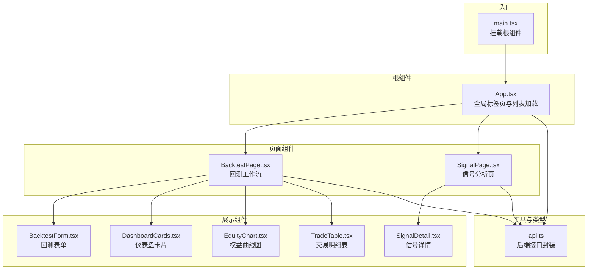
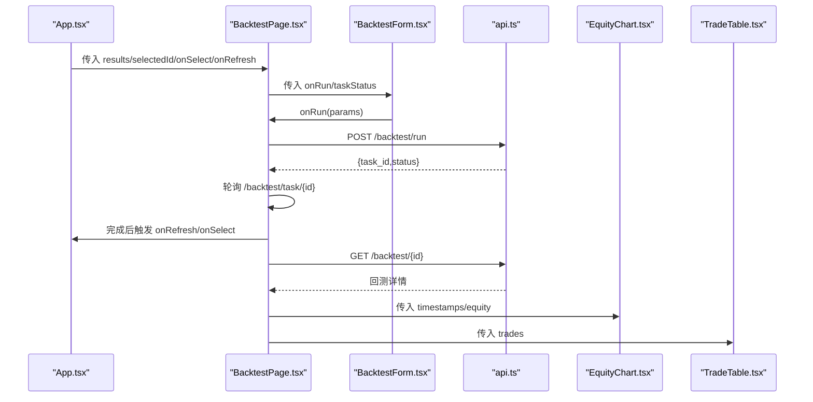
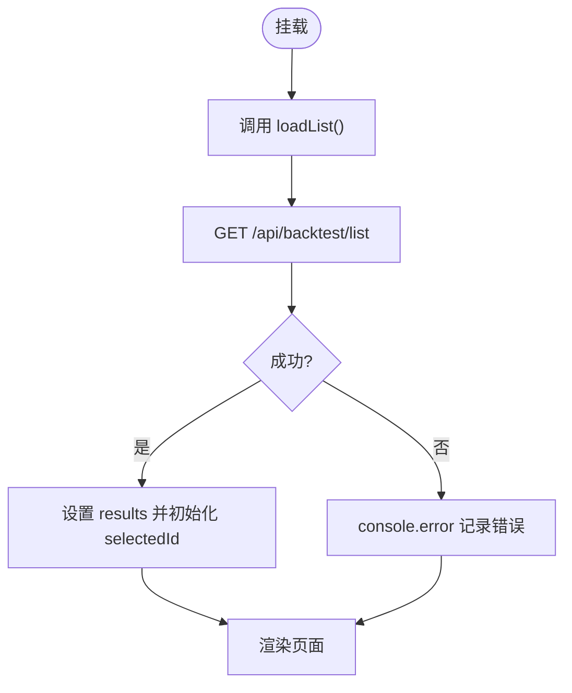
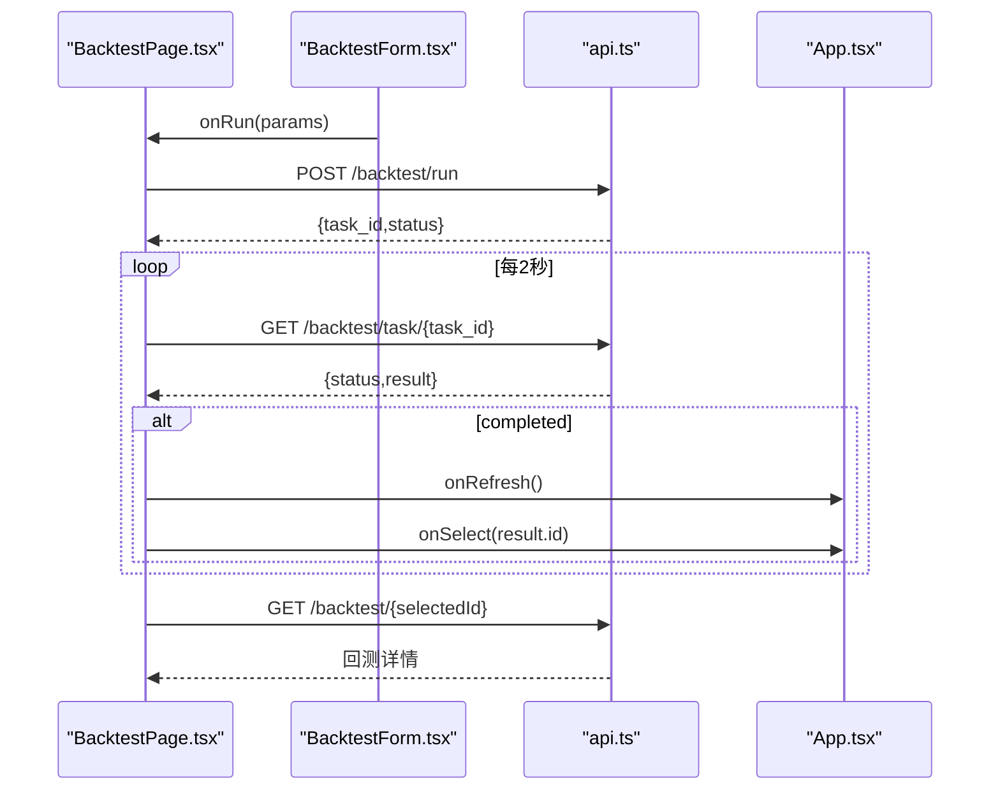
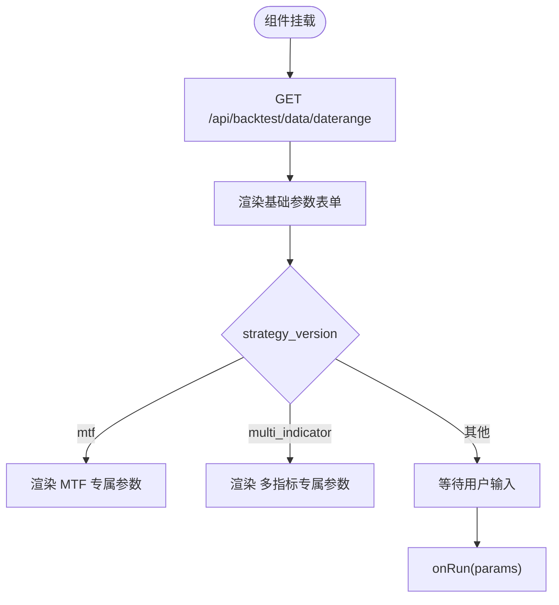
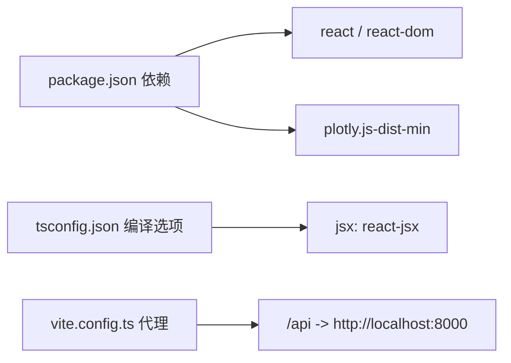

# 组件架构

<cite>
**本文引用的文件**
- [App.tsx](file://frontend/src/App.tsx)
- [main.tsx](file://frontend/src/main.tsx)
- [BacktestPage.tsx](file://frontend/src/pages/BacktestPage.tsx)
- [SignalPage.tsx](file://frontend/src/pages/SignalPage.tsx)
- [BacktestForm.tsx](file://frontend/src/components/BacktestForm.tsx)
- [DashboardCards.tsx](file://frontend/src/components/DashboardCards.tsx)
- [SignalDetail.tsx](file://frontend/src/components/SignalDetail.tsx)
- [EquityChart.tsx](file://frontend/src/components/EquityChart.tsx)
- [TradeTable.tsx](file://frontend/src/components/TradeTable.tsx)
- [api.ts](file://frontend/src/api.ts)
- [package.json](file://frontend/package.json)
- [tsconfig.json](file://frontend/tsconfig.json)
- [vite.config.ts](file://frontend/vite.config.ts)
</cite>

## 目录
1. [引言](#引言)
2. [项目结构](#项目结构)
3. [核心组件](#核心组件)
4. [架构总览](#架构总览)
5. [详细组件分析](#详细组件分析)
6. [依赖分析](#依赖分析)
7. [性能考虑](#性能考虑)
8. [故障排查指南](#故障排查指南)
9. [结论](#结论)
10. [附录](#附录)

## 引言
本文件聚焦于前端React组件架构与设计模式，系统梳理从App根组件到页面与展示组件的层次结构、父子关系与Props传递机制；深入解析BacktestForm、DashboardCards、SignalDetail等核心组件的实现细节；总结状态提升、事件冒泡处理、组件复用策略、接口定义与错误边界处理，并给出测试与调试建议。

## 项目结构
前端采用Vite + TypeScript构建，使用React 18作为UI库，通过自定义API模块统一后端交互。组件按功能分层：根组件负责全局状态与路由式页面切换；页面组件承载业务流程与副作用；展示组件专注数据渲染与交互。

**图表来源**
- [main.tsx:1-5](file://frontend/src/main.tsx#L1-L5)
- [App.tsx:1-50](file://frontend/src/App.tsx#L1-L50)
- [BacktestPage.tsx:1-94](file://frontend/src/pages/BacktestPage.tsx#L1-L94)
- [SignalPage.tsx:1-39](file://frontend/src/pages/SignalPage.tsx#L1-L39)
- [BacktestForm.tsx:1-145](file://frontend/src/components/BacktestForm.tsx#L1-L145)
- [DashboardCards.tsx:1-54](file://frontend/src/components/DashboardCards.tsx#L1-L54)
- [EquityChart.tsx:1-49](file://frontend/src/components/EquityChart.tsx#L1-L49)
- [TradeTable.tsx:1-99](file://frontend/src/components/TradeTable.tsx#L1-L99)
- [SignalDetail.tsx:1-137](file://frontend/src/components/SignalDetail.tsx#L1-L137)
- [api.ts:1-51](file://frontend/src/api.ts#L1-L51)

**章节来源**
- [main.tsx:1-5](file://frontend/src/main.tsx#L1-L5)
- [App.tsx:1-50](file://frontend/src/App.tsx#L1-L50)
- [BacktestPage.tsx:1-94](file://frontend/src/pages/BacktestPage.tsx#L1-L94)
- [SignalPage.tsx:1-39](file://frontend/src/pages/SignalPage.tsx#L1-L39)
- [api.ts:1-51](file://frontend/src/api.ts#L1-L51)

## 核心组件
- App根组件：维护全局tab状态、回测结果列表、选中项与加载状态；根据tab渲染BacktestPage或SignalPage；提供刷新列表能力。
- BacktestPage：负责回测任务执行、轮询任务状态、加载回测详情、展示仪表盘、图表与交易明细；向上接收onSelect/onRefresh回调以更新父级状态。
- SignalPage：基于选中回测ID拉取信号分析并渲染SignalDetail。
- BacktestForm：集中管理回测参数，支持策略版本差异化渲染，调用父级onRun触发后端任务。
- DashboardCards：格式化并展示回测关键指标卡片。
- EquityChart：基于Plotly渲染权益曲线与初始资金线。
- TradeTable：筛选与展开交易明细，支持指标列展开查看。
- SignalDetail：按策略类型（MTF或多指标）渲染信号统计与操作类型统计。

**章节来源**
- [App.tsx:6-48](file://frontend/src/App.tsx#L6-L48)
- [BacktestPage.tsx:15-94](file://frontend/src/pages/BacktestPage.tsx#L15-L94)
- [SignalPage.tsx:11-39](file://frontend/src/pages/SignalPage.tsx#L11-L39)
- [BacktestForm.tsx:9-145](file://frontend/src/components/BacktestForm.tsx#L9-L145)
- [DashboardCards.tsx:13-54](file://frontend/src/components/DashboardCards.tsx#L13-L54)
- [EquityChart.tsx:9-49](file://frontend/src/components/EquityChart.tsx#L9-L49)
- [TradeTable.tsx:17-99](file://frontend/src/components/TradeTable.tsx#L17-L99)
- [SignalDetail.tsx:8-137](file://frontend/src/components/SignalDetail.tsx#L8-L137)

## 架构总览
组件层次自上而下为：入口挂载 -> 根组件 -> 页面组件 -> 展示组件。数据流主要通过Props自上而下传递，事件通过回调自下而上冒泡；部分跨组件共享的状态在App层进行提升。

**图表来源**
- [App.tsx:28-47](file://frontend/src/App.tsx#L28-L47)
- [BacktestPage.tsx:43-51](file://frontend/src/pages/BacktestPage.tsx#L43-L51)
- [BacktestPage.tsx:28-41](file://frontend/src/pages/BacktestPage.tsx#L28-L41)
- [api.ts:42-46](file://frontend/src/api.ts#L42-L46)
- [EquityChart.tsx:9-49](file://frontend/src/components/EquityChart.tsx#L9-L49)
- [TradeTable.tsx:17-99](file://frontend/src/components/TradeTable.tsx#L17-L99)

## 详细组件分析

### App 根组件
- 职责：维护tab、results、selectedId、loading；首次进入时拉取回测列表；提供刷新按钮与两个页面的切换。
- 生命周期：useEffect在挂载时调用加载函数；按钮点击切换tab。
- 状态提升：selectedId由App持有，向下传递给两个页面；onSelect/onRefresh由App提供给BacktestPage用于更新列表与选中项。
- 错误处理：列表加载异常打印日志，不阻断UI。

**图表来源**
- [App.tsx:12-26](file://frontend/src/App.tsx#L12-L26)

**章节来源**
- [App.tsx:6-48](file://frontend/src/App.tsx#L6-L48)

### BacktestPage 页面组件
- 职责：管理当前详情、任务轮询、任务状态、历史回测列表展示；协调表单运行、图表与表格渲染。
- 生命周期：useEffect监听selectedId加载详情；useEffect轮询任务状态，完成后刷新列表并更新选中项。
- 事件冒泡：handleRun接收表单参数，调用后端任务；完成时通过onRefresh与onSelect回调更新App状态。
- 数据流：从App接收results/selectedId/onSelect/onRefresh；向子组件传递onRun/taskStatus与详情数据。

**图表来源**
- [BacktestPage.tsx:43-51](file://frontend/src/pages/BacktestPage.tsx#L43-L51)
- [BacktestPage.tsx:28-41](file://frontend/src/pages/BacktestPage.tsx#L28-L41)
- [api.ts:42-46](file://frontend/src/api.ts#L42-L46)

**章节来源**
- [BacktestPage.tsx:15-94](file://frontend/src/pages/BacktestPage.tsx#L15-L94)

### BacktestForm 表单组件
- 职责：集中管理回测参数，根据策略版本动态渲染不同参数组；调用父级onRun提交任务。
- 参数管理：useState保存params；useEffect加载可用日期范围；update(key,value)合并更新。
- 条件渲染：当strategy_version为'mtf'或'multi_indicator'时显示专属参数区域。
- 禁用逻辑：根据taskStatus判断是否禁用按钮。

**图表来源**
- [BacktestForm.tsx:22-24](file://frontend/src/components/BacktestForm.tsx#L22-L24)
- [BacktestForm.tsx:86-113](file://frontend/src/components/BacktestForm.tsx#L86-L113)
- [BacktestForm.tsx:114-137](file://frontend/src/components/BacktestForm.tsx#L114-L137)
- [BacktestForm.tsx:139-142](file://frontend/src/components/BacktestForm.tsx#L139-L142)

**章节来源**
- [BacktestForm.tsx:9-145](file://frontend/src/components/BacktestForm.tsx#L9-L145)

### DashboardCards 仪表盘卡片
- 职责：将回测详情的关键指标格式化为卡片展示；支持资金费用卡片扩展。
- 设计：通过映射表将策略版本代码转为可读标签；数值格式化函数统一处理千/百万单位。
- 渲染：遍历卡片数组生成网格布局。

**章节来源**
- [DashboardCards.tsx:13-54](file://frontend/src/components/DashboardCards.tsx#L13-L54)

### EquityChart 权益曲线图
- 职责：基于Plotly渲染权益曲线与初始资金线；响应式布局；深色主题配色。
- 生命周期：useEffect在数据变化时重建图表；避免空数据或未挂载时绘制。

**章节来源**
- [EquityChart.tsx:9-49](file://frontend/src/components/EquityChart.tsx#L9-L49)

### TradeTable 交易明细表
- 职责：筛选交易动作、展开查看指标详情；根据利润正负高亮。
- 交互：顶部动作过滤按钮；点击行展开指标网格；根据是否存在indicators决定行样式与交互。
- 性能：仅在有数据时渲染表格；过滤在组件内完成。

**章节来源**
- [TradeTable.tsx:17-99](file://frontend/src/components/TradeTable.tsx#L17-L99)

### SignalPage 信号分析页
- 职责：根据selectedId拉取信号分析并渲染SignalDetail；提供回测结果选择器。
- 生命周期：useEffect监听selectedId；加载完成后渲染详情。

**章节来源**
- [SignalPage.tsx:11-39](file://frontend/src/pages/SignalPage.tsx#L11-L39)

### SignalDetail 信号详情
- 职责：按策略类型渲染“盈亏分布”、“信号指标触发统计”、“操作类型统计”三块内容。
- 动态渲染：MTF策略按级别渲染；多指标策略按指标项渲染；无触发时显示提示。
- 表格渲染：操作类型统计以表格形式展示。

**章节来源**
- [SignalDetail.tsx:8-137](file://frontend/src/components/SignalDetail.tsx#L8-L137)

## 依赖分析
- 运行时依赖：React、ReactDOM、Plotly.js。
- 类型与编译：TypeScript严格模式，JSX使用react-jsx，模块解析bundler。
- 开发代理：Vite本地服务代理/api到后端8000端口。

**图表来源**
- [package.json:16-20](file://frontend/package.json#L16-L20)
- [tsconfig.json:2-10](file://frontend/tsconfig.json#L2-L10)
- [vite.config.ts:7-9](file://frontend/vite.config.ts#L7-L9)

**章节来源**
- [package.json:1-22](file://frontend/package.json#L1-L22)
- [tsconfig.json:1-12](file://frontend/tsconfig.json#L1-L12)
- [vite.config.ts:1-11](file://frontend/vite.config.ts#L1-L11)

## 性能考虑
- 列表渲染优化：BacktestPage与SignalPage均对结果进行按键渲染按钮，避免重复请求；BacktestPage在任务轮询期间减少不必要的重渲染。
- 图表渲染：EquityChart仅在数据变化时重建Plotly图，避免频繁重绘。
- 表格渲染：TradeTable在无数据时直接返回提示文本，减少DOM节点。
- 状态最小化：App层仅维护必要的tab与列表状态，页面层维护各自局部状态，降低全局重渲染范围。

## 故障排查指南
- 接口错误：api封装统一抛出HTTP错误，页面组件在请求失败时打印错误日志；建议在页面层增加错误提示与重试按钮。
- 任务轮询：BacktestPage轮询任务状态，若后端返回异常状态需在组件内补充错误分支与停止轮询逻辑。
- 图表渲染：确保容器存在且数据非空；如出现空白图，检查时间戳与净值数组长度。
- 表格展开：展开指标时注意数据为空的情况，避免渲染异常。
- 代理问题：确认Vite代理已正确指向后端地址，避免跨域导致的请求失败。

**章节来源**
- [api.ts:3-7](file://frontend/src/api.ts#L3-L7)
- [BacktestPage.tsx:28-41](file://frontend/src/pages/BacktestPage.tsx#L28-L41)
- [EquityChart.tsx:12-14](file://frontend/src/components/EquityChart.tsx#L12-L14)
- [TradeTable.tsx:77-92](file://frontend/src/components/TradeTable.tsx#L77-L92)
- [vite.config.ts:7-9](file://frontend/vite.config.ts#L7-L9)

## 结论
该组件架构以App为根、页面为业务载体、展示组件为表现层，形成清晰的自上而下数据流与自下而上的事件流。BacktestForm、DashboardCards、SignalDetail等核心组件职责明确、参数与渲染逻辑解耦，便于复用与扩展。通过状态提升与回调机制实现父子组件通信，结合轮询与错误处理保障用户体验。后续可在错误边界、缓存与懒加载方面进一步优化。

## 附录
- 组件复用策略
  - 将通用渲染逻辑抽象为独立展示组件（如DashboardCards、TradeTable），通过Props传入数据即可复用。
  - 将交互行为下沉至页面组件（如BacktestPage），展示组件保持纯渲染。
- 接口定义
  - 所有后端接口在api.ts中集中声明，统一返回类型与错误处理，便于类型推导与测试。
- 测试与调试建议
  - 单元测试：针对展示组件，使用React Testing Library渲染并断言Props与渲染结果；对BacktestForm可模拟onRun回调验证提交逻辑。
  - 集成测试：使用Mock Service Worker或Vite内置代理拦截/api请求，验证BacktestPage的轮询与状态更新。
  - 调试技巧：利用浏览器React DevTools查看组件树与Props；在BacktestPage中打印任务状态与详情数据；在EquityChart中检查数据长度与容器尺寸。