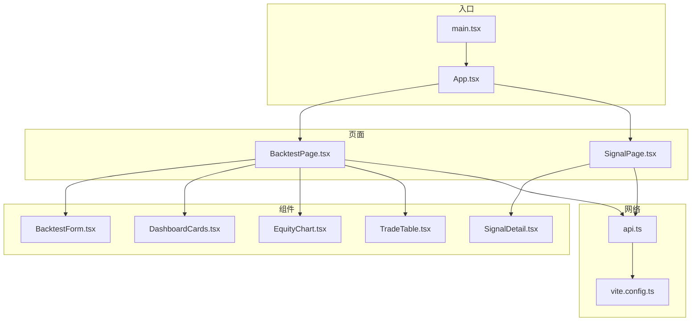
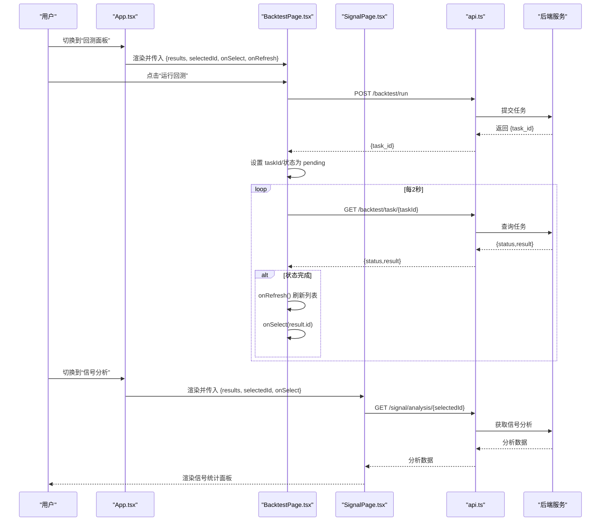
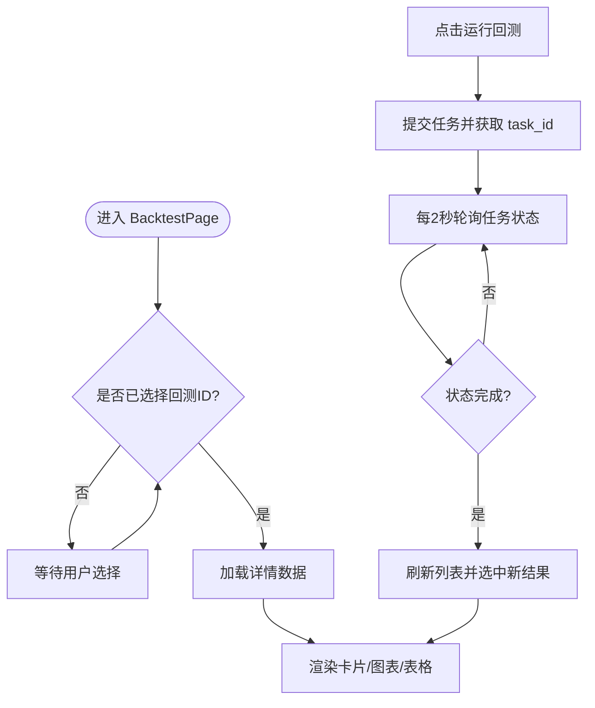
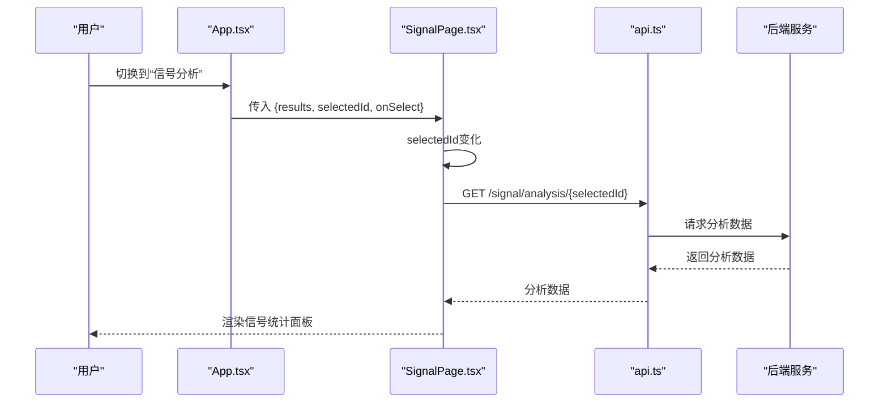
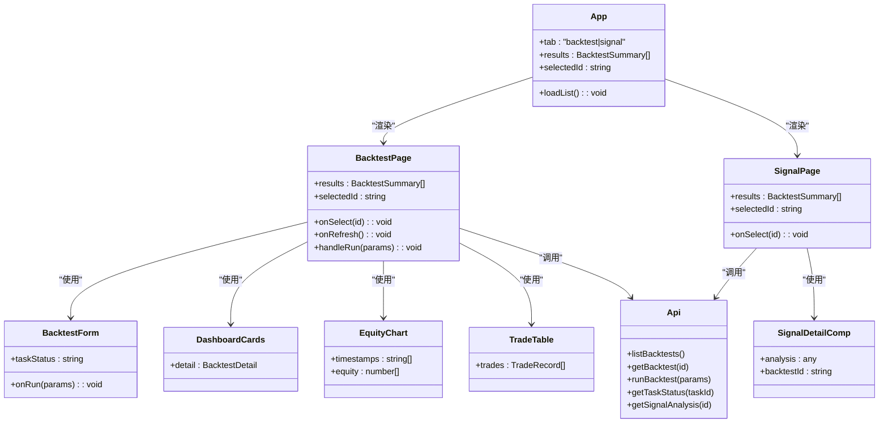

# 页面设计

<cite>
**本文引用的文件**
- [frontend/src/pages/BacktestPage.tsx](file://frontend/src/pages/BacktestPage.tsx)
- [frontend/src/pages/SignalPage.tsx](file://frontend/src/pages/SignalPage.tsx)
- [frontend/src/App.tsx](file://frontend/src/App.tsx)
- [frontend/src/main.tsx](file://frontend/src/main.tsx)
- [frontend/src/api.ts](file://frontend/src/api.ts)
- [frontend/src/components/BacktestForm.tsx](file://frontend/src/components/BacktestForm.tsx)
- [frontend/src/components/SignalDetail.tsx](file://frontend/src/components/SignalDetail.tsx)
- [frontend/src/components/DashboardCards.tsx](file://frontend/src/components/DashboardCards.tsx)
- [frontend/src/components/EquityChart.tsx](file://frontend/src/components/EquityChart.tsx)
- [frontend/src/components/TradeTable.tsx](file://frontend/src/components/TradeTable.tsx)
- [frontend/vite.config.ts](file://frontend/vite.config.ts)
- [frontend/index.html](file://frontend/index.html)
- [frontend/package.json](file://frontend/package.json)
</cite>

## 目录
1. [引言](#引言)
2. [项目结构](#项目结构)
3. [核心组件](#核心组件)
4. [架构总览](#架构总览)
5. [详细组件分析](#详细组件分析)
6. [依赖关系分析](#依赖关系分析)
7. [性能考虑](#性能考虑)
8. [故障排查指南](#故障排查指南)
9. [结论](#结论)
10. [附录](#附录)

## 引言
本指南聚焦于交易系统的两个核心页面：BacktestPage（回测页面）与 SignalPage（信号分析页面）。内容涵盖页面路由与导航结构、状态管理与数据流、页面间数据传递与URL参数处理、浏览器历史管理、响应式设计与主题、无障碍访问支持、性能优化与SEO最佳实践。目标是帮助开发者与产品人员快速理解并迭代这两个页面的设计与实现。

## 项目结构
前端采用Vite + React + TypeScript构建，页面与组件分层清晰：
- 入口与应用根组件：main.tsx、App.tsx
- 页面级组件：BacktestPage.tsx、SignalPage.tsx
- 可复用组件：BacktestForm、DashboardCards、EquityChart、SignalDetail、TradeTable
- API封装：api.ts
- 构建与代理：vite.config.ts
- 样式与主题：index.html 内联样式（深色主题）

图表来源
- [frontend/src/main.tsx:1-5](file://frontend/src/main.tsx#L1-L5)
- [frontend/src/App.tsx:1-50](file://frontend/src/App.tsx#L1-L50)
- [frontend/src/pages/BacktestPage.tsx:1-94](file://frontend/src/pages/BacktestPage.tsx#L1-L94)
- [frontend/src/pages/SignalPage.tsx:1-39](file://frontend/src/pages/SignalPage.tsx#L1-L39)
- [frontend/src/api.ts:1-51](file://frontend/src/api.ts#L1-L51)
- [frontend/vite.config.ts:1-11](file://frontend/vite.config.ts#L1-L11)

章节来源
- [frontend/src/main.tsx:1-5](file://frontend/src/main.tsx#L1-L5)
- [frontend/src/App.tsx:1-50](file://frontend/src/App.tsx#L1-L50)
- [frontend/vite.config.ts:1-11](file://frontend/vite.config.ts#L1-L11)
- [frontend/index.html:1-68](file://frontend/index.html#L1-L68)

## 核心组件
- 应用根组件负责标签页切换与全局状态（当前选中的回测ID、回测列表、加载状态），并将状态与回调向下传递给子页面。
- BacktestPage负责回测任务执行、轮询任务状态、展示回测详情卡片、净值曲线与交易明细。
- SignalPage负责根据选中的回测ID请求信号分析，并渲染信号统计面板。
- 组件层面通过props进行单向数据流，避免跨层级共享复杂状态，提升可维护性。

章节来源
- [frontend/src/App.tsx:6-48](file://frontend/src/App.tsx#L6-L48)
- [frontend/src/pages/BacktestPage.tsx:15-94](file://frontend/src/pages/BacktestPage.tsx#L15-L94)
- [frontend/src/pages/SignalPage.tsx:11-39](file://frontend/src/pages/SignalPage.tsx#L11-L39)

## 架构总览
BacktestPage与SignalPage通过App的tab状态进行切换；两者均依赖api.ts提供的后端接口，实现列表拉取、回测执行、任务状态轮询、详情与分析数据获取。BacktestPage内部还维护任务ID与状态，用于轮询更新与自动刷新。

图表来源
- [frontend/src/App.tsx:28-47](file://frontend/src/App.tsx#L28-L47)
- [frontend/src/pages/BacktestPage.tsx:27-51](file://frontend/src/pages/BacktestPage.tsx#L27-L51)
- [frontend/src/pages/SignalPage.tsx:15-19](file://frontend/src/pages/SignalPage.tsx#L15-L19)
- [frontend/src/api.ts:40-51](file://frontend/src/api.ts#L40-L51)

## 详细组件分析

### BacktestPage（回测页面）
- 状态管理
  - detail：当前选中回测的详细数据
  - loading：详情加载状态
  - taskId/taskStatus：异步任务轮询所需
- 数据流程
  - 依赖selectedId变化触发详情加载
  - 通过runBacktest提交任务，设置taskId与状态
  - 轮询任务状态，完成后刷新列表并选中新结果
- 渲染结构
  - 回测表单（BacktestForm）
  - 任务状态提示（排队/运行中）
  - 历史回测结果列表（按钮组，点击切换selectedId）
  - 详情卡片（DashboardCards）、净值曲线（EquityChart）、交易明细（TradeTable）

图表来源
- [frontend/src/pages/BacktestPage.tsx:15-51](file://frontend/src/pages/BacktestPage.tsx#L15-L51)
- [frontend/src/pages/BacktestPage.tsx:53-94](file://frontend/src/pages/BacktestPage.tsx#L53-L94)

章节来源
- [frontend/src/pages/BacktestPage.tsx:15-94](file://frontend/src/pages/BacktestPage.tsx#L15-L94)
- [frontend/src/components/BacktestForm.tsx:9-145](file://frontend/src/components/BacktestForm.tsx#L9-L145)
- [frontend/src/components/DashboardCards.tsx:13-54](file://frontend/src/components/DashboardCards.tsx#L13-L54)
- [frontend/src/components/EquityChart.tsx:9-49](file://frontend/src/components/EquityChart.tsx#L9-L49)
- [frontend/src/components/TradeTable.tsx:17-99](file://frontend/src/components/TradeTable.tsx#L17-L99)

### SignalPage（信号分析页面）
- 状态管理
  - analysis：信号分析数据
  - loading：分析数据加载状态
- 数据流程
  - 依赖selectedId变化触发分析数据加载
  - 渲染信号统计面板（不同策略版本使用不同的统计维度）
- 渲染结构
  - 回测结果选择区（按钮组）
  - 加载指示器
  - 信号详情组件（SignalDetailComp）

图表来源
- [frontend/src/pages/SignalPage.tsx:11-39](file://frontend/src/pages/SignalPage.tsx#L11-L39)
- [frontend/src/api.ts:49-50](file://frontend/src/api.ts#L49-L50)

章节来源
- [frontend/src/pages/SignalPage.tsx:11-39](file://frontend/src/pages/SignalPage.tsx#L11-L39)
- [frontend/src/components/SignalDetail.tsx:8-137](file://frontend/src/components/SignalDetail.tsx#L8-L137)

### BacktestForm（回测配置表单）
- 功能要点
  - 支持多策略版本参数动态显示（如MTF与multi_indicator）
  - 日期范围来自后端接口，限制输入范围
  - 运行按钮禁用逻辑基于任务状态
- 参数与联动
  - 策略版本切换时显示/隐藏对应参数组
  - 实时更新参数并通过onRun回调传递给父组件

章节来源
- [frontend/src/components/BacktestForm.tsx:9-145](file://frontend/src/components/BacktestForm.tsx#L9-L145)
- [frontend/src/api.ts:41-48](file://frontend/src/api.ts#L41-L48)

### SignalDetail（信号分析详情）
- 功能要点
  - 根据策略版本区分统计维度（MTF多级别 vs 多指标）
  - 盈亏分布、指标触发统计、操作类型统计三块区域
- 渲染逻辑
  - 条件渲染不同网格布局
  - 颜色与标签用于语义化展示正负收益

章节来源
- [frontend/src/components/SignalDetail.tsx:8-137](file://frontend/src/components/SignalDetail.tsx#L8-L137)

### DashboardCards（回测概览卡片）
- 功能要点
  - 将回测关键指标格式化展示（数值缩写、正负样式）
  - 特殊卡片：资金费用（若存在）
- 设计要点
  - 策略版本标签映射
  - 数值格式化工具函数

章节来源
- [frontend/src/components/DashboardCards.tsx:13-54](file://frontend/src/components/DashboardCards.tsx#L13-L54)

### EquityChart（净值曲线图）
- 功能要点
  - 使用Plotly绘制权益曲线与初始资金线
  - 深色主题配色与响应式布局
- 性能要点
  - 仅在数据变化时重绘
  - 关闭工具栏以减少干扰

章节来源
- [frontend/src/components/EquityChart.tsx:9-49](file://frontend/src/components/EquityChart.tsx#L9-L49)

### TradeTable（交易明细表）
- 功能要点
  - 按操作类型过滤
  - 行内展开查看指标明细
  - 标签样式区分不同动作类型
- 交互要点
  - 点击展开/收起
  - 自适应列宽与紧凑排版

章节来源
- [frontend/src/components/TradeTable.tsx:17-99](file://frontend/src/components/TradeTable.tsx#L17-L99)

## 依赖关系分析
- 组件耦合
  - App作为状态中心，向下传递props，降低页面间耦合
  - 页面内部通过api.ts统一发起网络请求，便于替换与测试
- 外部依赖
  - Plotly用于图表渲染
  - Vite代理将/api转发至本地后端服务
- 类关系示意

图表来源
- [frontend/src/App.tsx:6-48](file://frontend/src/App.tsx#L6-L48)
- [frontend/src/pages/BacktestPage.tsx:15-94](file://frontend/src/pages/BacktestPage.tsx#L15-L94)
- [frontend/src/pages/SignalPage.tsx:11-39](file://frontend/src/pages/SignalPage.tsx#L11-L39)
- [frontend/src/components/BacktestForm.tsx:9-145](file://frontend/src/components/BacktestForm.tsx#L9-L145)
- [frontend/src/components/DashboardCards.tsx:13-54](file://frontend/src/components/DashboardCards.tsx#L13-L54)
- [frontend/src/components/EquityChart.tsx:9-49](file://frontend/src/components/EquityChart.tsx#L9-L49)
- [frontend/src/components/TradeTable.tsx:17-99](file://frontend/src/components/TradeTable.tsx#L17-L99)
- [frontend/src/components/SignalDetail.tsx:8-137](file://frontend/src/components/SignalDetail.tsx#L8-L137)
- [frontend/src/api.ts:40-51](file://frontend/src/api.ts#L40-L51)

## 性能考虑
- 渲染优化
  - BacktestPage与SignalPage按需加载详情与分析数据，避免不必要的渲染
  - EquityChart仅在数据变化时重绘，减少Plotly重绘开销
  - TradeTable支持按操作类型过滤与行内展开，降低一次性渲染压力
- 网络与轮询
  - 任务轮询间隔为2秒，建议根据实际任务耗时调整或增加退避策略
  - 错误处理中捕获异常但未显式提示，可在UI层补充错误反馈
- 资源与体积
  - Plotly为独立依赖，建议按需引入或拆分打包，避免首屏过大
- SEO与可访问性
  - 当前为SPA，缺少服务端渲染与语义化HTML结构，建议后续接入SSR与ARIA标签
- 主题与响应式
  - 深色主题通过内联样式实现，建议迁移到CSS模块或主题变量，便于扩展

章节来源
- [frontend/src/pages/BacktestPage.tsx:27-51](file://frontend/src/pages/BacktestPage.tsx#L27-L51)
- [frontend/src/components/EquityChart.tsx:12-46](file://frontend/src/components/EquityChart.tsx#L12-L46)
- [frontend/src/components/TradeTable.tsx:17-99](file://frontend/src/components/TradeTable.tsx#L17-L99)
- [frontend/package.json:16-21](file://frontend/package.json#L16-L21)

## 故障排查指南
- 无法加载回测列表
  - 检查Vite代理是否正确指向后端服务
  - 确认后端接口 /api/backtest/list 是否可达
- 任务状态不更新
  - 确认 /api/backtest/task/{taskId} 接口返回格式
  - 检查轮询逻辑与状态判断分支
- 信号分析为空
  - 确认 selectedId 是否有效
  - 检查 /api/signal/analysis/{id} 返回结构
- 图表不显示
  - 确认容器节点存在且有尺寸
  - 检查Plotly初始化参数与响应式配置
- 样式异常
  - 深色主题依赖内联样式，确认样式未被覆盖

章节来源
- [frontend/vite.config.ts:7-9](file://frontend/vite.config.ts#L7-L9)
- [frontend/src/api.ts:40-51](file://frontend/src/api.ts#L40-L51)
- [frontend/src/components/EquityChart.tsx:12-46](file://frontend/src/components/EquityChart.tsx#L12-L46)
- [frontend/index.html:7-62](file://frontend/index.html#L7-L62)

## 结论
BacktestPage与SignalPage通过App集中管理状态与导航，配合组件化的数据展示与交互，形成了清晰、可扩展的页面体系。未来可在SEO、可访问性、主题与响应式方面进一步完善，并持续优化网络请求与渲染性能。

## 附录
- 页面路由与URL参数
  - 当前为SPA，未使用浏览器路由库；页面切换通过App内部tab状态控制
  - 若需要URL参数与历史管理，建议引入路由库并在App中基于URL同步tab与selectedId
- 浏览器历史管理
  - 可通过路由库的history API或自定义Hook维护历史栈，确保刷新与前进后退行为一致
- 主题与无障碍
  - 建议引入主题变量与CSS模块，统一颜色与字体
  - 为按钮、表格等控件添加ARIA属性，改善键盘导航与屏幕阅读器体验
- SEO最佳实践
  - 后续可引入SSR/CSR混合方案，为关键页面提供静态预渲染
  - 为页面标题、描述与结构化数据提供占位符，便于搜索引擎抓取