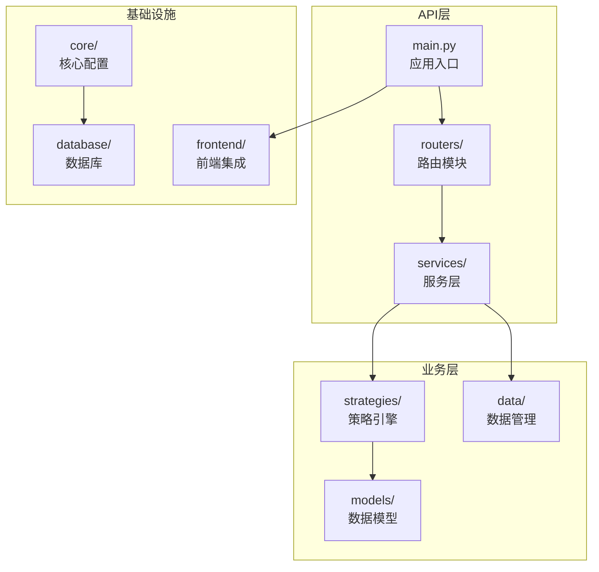
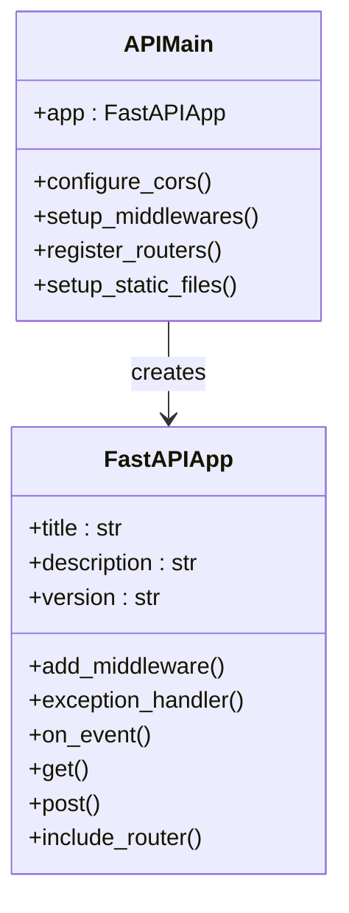
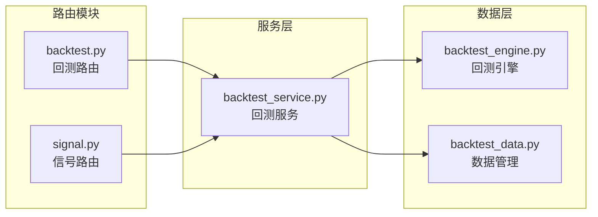
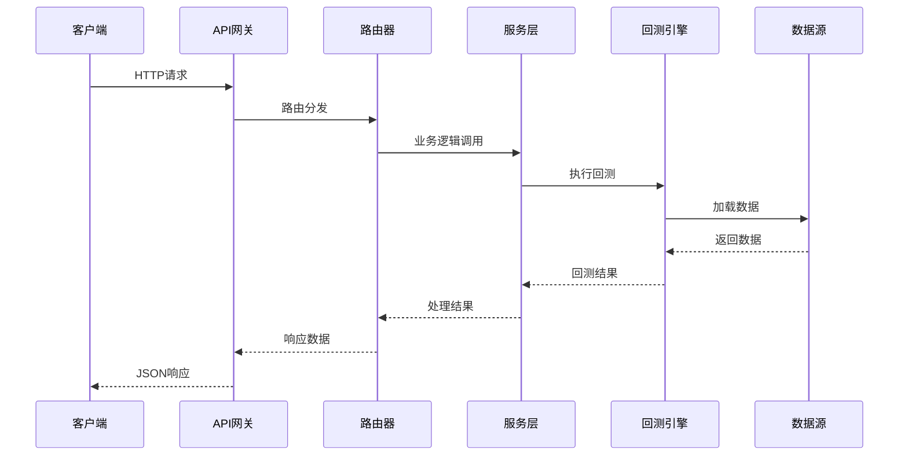
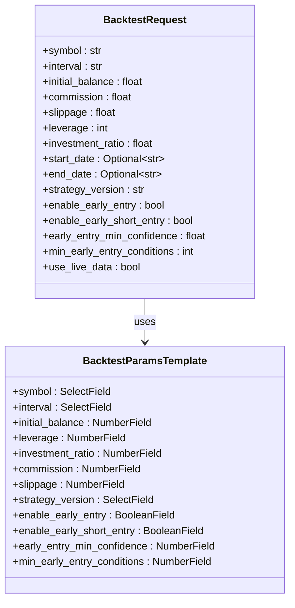
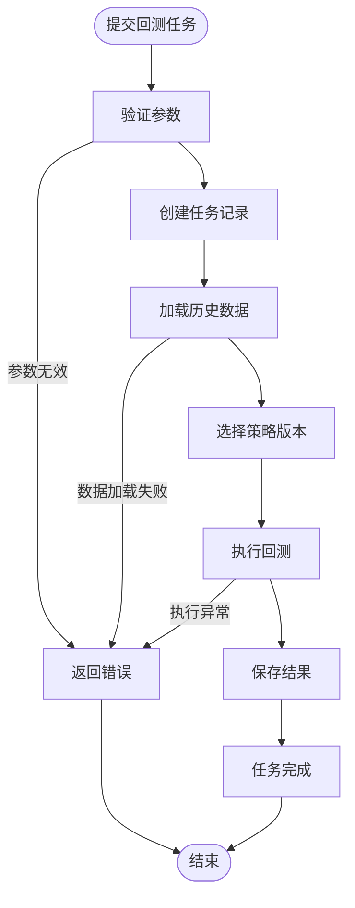
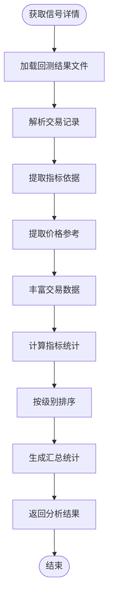
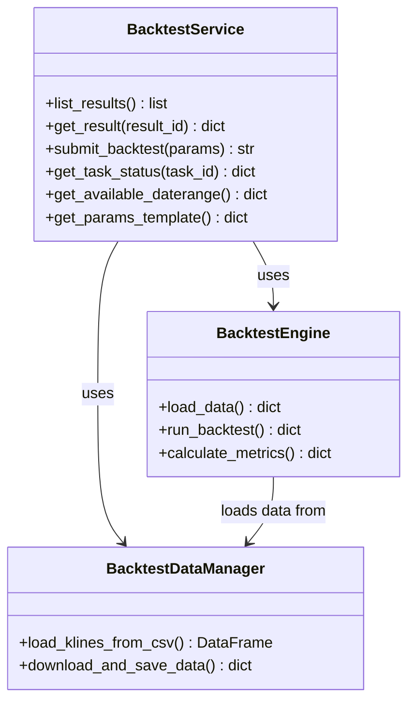
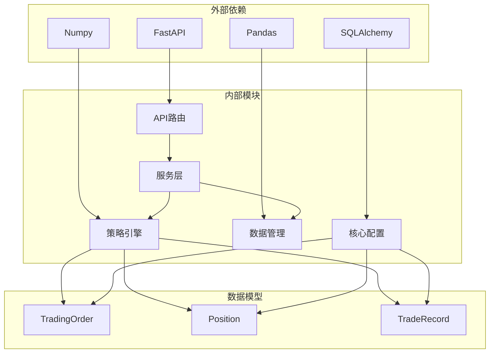
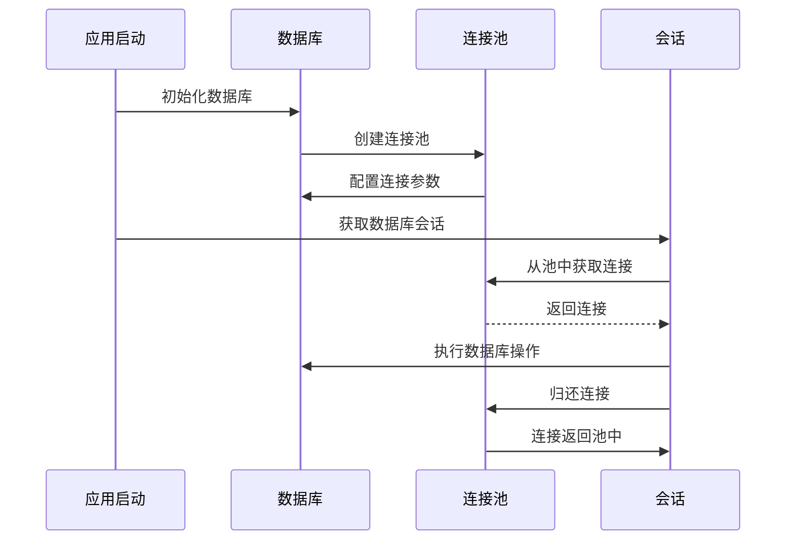

# API路由开发

<cite>
**本文档引用的文件**
- [trading_system/api/main.py](file://trading_system/api/main.py)
- [trading_system/api/routers/backtest.py](file://trading_system/api/routers/backtest.py)
- [trading_system/api/routers/signal.py](file://trading_system/api/routers/signal.py)
- [trading_system/api/services/backtest_service.py](file://trading_system/api/services/backtest_service.py)
- [trading_system/core/database.py](file://trading_system/core/database.py)
- [trading_system/strategies/backtest_engine.py](file://trading_system/strategies/backtest_engine.py)
- [trading_system/data/backtest_data.py](file://trading_system/data/backtest_data.py)
- [frontend/src/api.ts](file://frontend/src/api.ts)
</cite>

## 目录
1. [简介](#简介)
2. [项目结构](#项目结构)
3. [核心组件](#核心组件)
4. [架构概览](#架构概览)
5. [详细组件分析](#详细组件分析)
6. [依赖关系分析](#依赖关系分析)
7. [性能考虑](#性能考虑)
8. [故障排除指南](#故障排除指南)
9. [结论](#结论)

## 简介

本指南专注于交易系统的API路由开发，详细说明了回测路由和信号路由的实现。该系统基于FastAPI构建，提供了完整的RESTful API接口来支持交易系统的各项功能。文档涵盖了路由组织结构、端点定义、请求处理逻辑、HTTP方法、URL模式、请求参数验证和响应格式。

系统采用模块化设计，将不同的业务功能分离到独立的路由模块中，通过服务层处理复杂的业务逻辑，确保了代码的可维护性和可扩展性。

## 项目结构

交易系统的API路由位于`trading_system/api/`目录下，采用清晰的分层架构：

**图表来源**
- [trading_system/api/main.py:12](file://trading_system/api/main.py#L12)
- [trading_system/api/routers/backtest.py:6](file://trading_system/api/routers/backtest.py#L6)
- [trading_system/api/routers/signal.py:6](file://trading_system/api/routers/signal.py#L6)

**章节来源**
- [trading_system/api/main.py:12](file://trading_system/api/main.py#L12)
- [trading_system/api/routers/backtest.py:6](file://trading_system/api/routers/backtest.py#L6)
- [trading_system/api/routers/signal.py:6](file://trading_system/api/routers/signal.py#L6)

## 核心组件

### 应用主入口

应用主入口负责初始化FastAPI应用、配置中间件和异常处理器：

**图表来源**
- [trading_system/api/main.py:12](file://trading_system/api/main.py#L12)
- [trading_system/api/main.py:14](file://trading_system/api/main.py#L14)

### 路由组织结构

系统采用模块化的路由组织方式，每个功能域都有独立的路由模块：

**图表来源**
- [trading_system/api/routers/backtest.py:6](file://trading_system/api/routers/backtest.py#L6)
- [trading_system/api/routers/signal.py:6](file://trading_system/api/routers/signal.py#L6)

**章节来源**
- [trading_system/api/main.py:12](file://trading_system/api/main.py#L12)
- [trading_system/api/routers/backtest.py:6](file://trading_system/api/routers/backtest.py#L6)
- [trading_system/api/routers/signal.py:6](file://trading_system/api/routers/signal.py#L6)

## 架构概览

系统采用经典的三层架构模式，结合事件驱动的设计：

**图表来源**
- [trading_system/api/main.py:96](file://trading_system/api/main.py#L96)
- [trading_system/api/services/backtest_service.py:58](file://trading_system/api/services/backtest_service.py#L58)

## 详细组件分析

### 回测路由模块

回测路由模块提供了完整的回测功能API：

#### HTTP端点定义

| 方法 | 路径 | 描述 | 请求参数 | 响应格式 |
|------|------|------|----------|----------|
| GET | `/api/backtest/list` | 列出所有历史回测结果 | 无 | `{count: int, results: Array}` |
| GET | `/api/backtest/params` | 获取回测参数模板 | 无 | `BacktestParamsTemplate` |
| GET | `/api/backtest/{backtest_id}` | 获取单次回测完整结果 | `backtest_id: string` | `BacktestResult` |
| POST | `/api/backtest/run` | 提交回测任务 | `BacktestRequest` | `{task_id: string, status: string}` |
| GET | `/api/backtest/task/{task_id}` | 查询回测任务状态 | `task_id: string` | `TaskStatus` |
| GET | `/api/backtest/data/daterange` | 查询可用历史数据的日期范围 | 无 | `DateRange` |

#### 请求参数验证

回测请求参数使用Pydantic模型进行严格验证：

**图表来源**
- [trading_system/api/routers/backtest.py:9](file://trading_system/api/routers/backtest.py#L9)
- [trading_system/api/services/backtest_service.py:274](file://trading_system/api/services/backtest_service.py#L274)

#### 任务执行流程

回测任务采用异步执行机制：

**图表来源**
- [trading_system/api/services/backtest_service.py:58](file://trading_system/api/services/backtest_service.py#L58)
- [trading_system/api/services/backtest_service.py:251](file://trading_system/api/services/backtest_service.py#L251)

**章节来源**
- [trading_system/api/routers/backtest.py:27](file://trading_system/api/routers/backtest.py#L27)
- [trading_system/api/routers/backtest.py:49](file://trading_system/api/routers/backtest.py#L49)
- [trading_system/api/routers/backtest.py:56](file://trading_system/api/routers/backtest.py#L56)

### 信号路由模块

信号路由模块专注于交易信号的分析和展示：

#### HTTP端点定义

| 方法 | 路径 | 描述 | 请求参数 | 响应格式 |
|------|------|------|----------|----------|
| GET | `/api/signal/categories` | 获取信号分类映射 | 无 | `SignalCategories` |
| GET | `/api/signal/detail/{backtest_id}` | 获取回测中每笔交易的信号详情 | `backtest_id: string` | `SignalDetail` |
| GET | `/api/signal/analysis/{backtest_id}` | 获取综合信号分析 | `backtest_id: string` | `SignalAnalysis` |

#### 信号分析算法

信号分析包含复杂的指标提取和统计逻辑：

**图表来源**
- [trading_system/api/routers/signal.py:31](file://trading_system/api/routers/signal.py#L31)
- [trading_system/api/routers/signal.py:134](file://trading_system/api/routers/signal.py#L134)

**章节来源**
- [trading_system/api/routers/signal.py:25](file://trading_system/api/routers/signal.py#L25)
- [trading_system/api/routers/signal.py:134](file://trading_system/api/routers/signal.py#L134)

### 服务层实现

服务层封装了复杂的业务逻辑，提供了统一的接口供路由层调用。

#### 回测服务架构

**图表来源**
- [trading_system/api/services/backtest_service.py:20](file://trading_system/api/services/backtest_service.py#L20)
- [trading_system/strategies/backtest_engine.py:34](file://trading_system/strategies/backtest_engine.py#L34)
- [trading_system/data/backtest_data.py:9](file://trading_system/data/backtest_data.py#L9)

**章节来源**
- [trading_system/api/services/backtest_service.py:20](file://trading_system/api/services/backtest_service.py#L20)
- [trading_system/strategies/backtest_engine.py:34](file://trading_system/strategies/backtest_engine.py#L34)
- [trading_system/data/backtest_data.py:9](file://trading_system/data/backtest_data.py#L9)

## 依赖关系分析

系统采用松耦合的设计，各组件之间的依赖关系清晰明确：

**图表来源**
- [trading_system/api/main.py:2](file://trading_system/api/main.py#L2)
- [trading_system/core/database.py:1](file://trading_system/core/database.py#L1)

### 数据库连接管理

系统实现了完善的数据库连接池管理：

**图表来源**
- [trading_system/core/database.py:24](file://trading_system/core/database.py#L24)

**章节来源**
- [trading_system/core/database.py:24](file://trading_system/core/database.py#L24)
- [trading_system/api/main.py:58](file://trading_system/api/main.py#L58)

## 性能考虑

### 异步任务处理

系统采用多线程异步处理回测任务，避免阻塞主线程：

- 使用线程锁保证任务状态的线程安全
- 支持实时数据下载和缓存机制
- 提供任务进度跟踪和状态查询

### 缓存策略

- 历史数据文件缓存，减少重复下载
- 任务状态内存缓存，提高查询效率
- 参数模板预定义，避免动态生成开销

### 错误处理机制

系统实现了多层次的错误处理：

- 全局异常处理器捕获未处理异常
- HTTP异常处理器处理标准HTTP错误
- 详细的日志记录便于问题诊断

## 故障排除指南

### 常见问题及解决方案

#### 数据库连接问题

**症状**: 启动时数据库连接失败
**原因**: 数据库配置错误或服务不可用
**解决**: 检查数据库URL配置和网络连接

#### 回测任务失败

**症状**: 回测任务状态显示失败
**原因**: 数据加载失败或策略执行异常
**解决**: 查看任务错误详情，检查数据文件完整性

#### API响应超时

**症状**: API请求响应缓慢
**原因**: 数据量过大或计算复杂度过高
**解决**: 优化查询条件，考虑分页处理

**章节来源**
- [trading_system/api/main.py:33](file://trading_system/api/main.py#L33)
- [trading_system/api/main.py:46](file://trading_system/api/main.py#L46)

## 结论

本API路由开发指南详细介绍了交易系统的RESTful API设计和实现。系统采用模块化架构，通过清晰的路由组织、严格的参数验证和完善的错误处理机制，为交易系统提供了稳定可靠的API接口。

关键特性包括：
- 清晰的路由层次结构
- 完善的回测功能支持
- 丰富的信号分析能力
- 异步任务处理机制
- 严格的错误处理和日志记录

这些设计使得系统既满足了当前的功能需求，又为未来的扩展奠定了良好的基础。