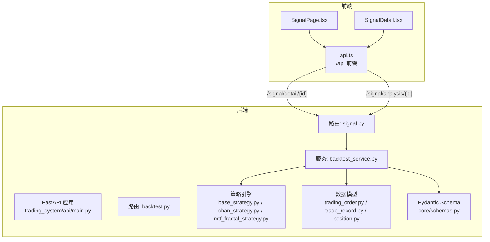
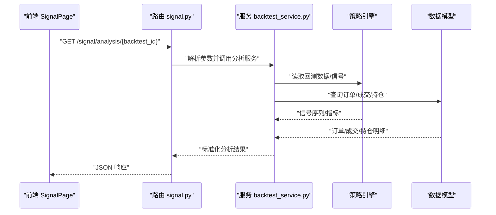
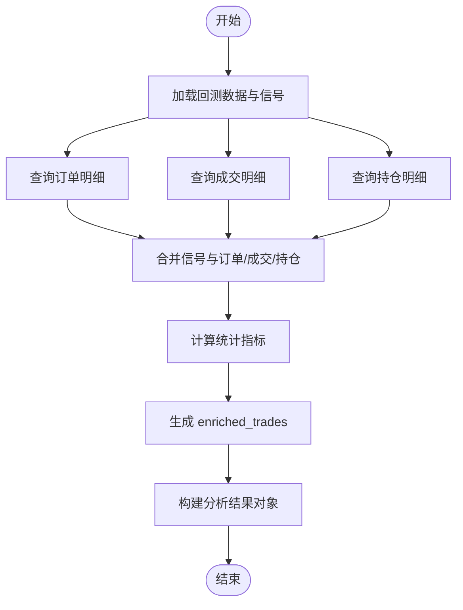
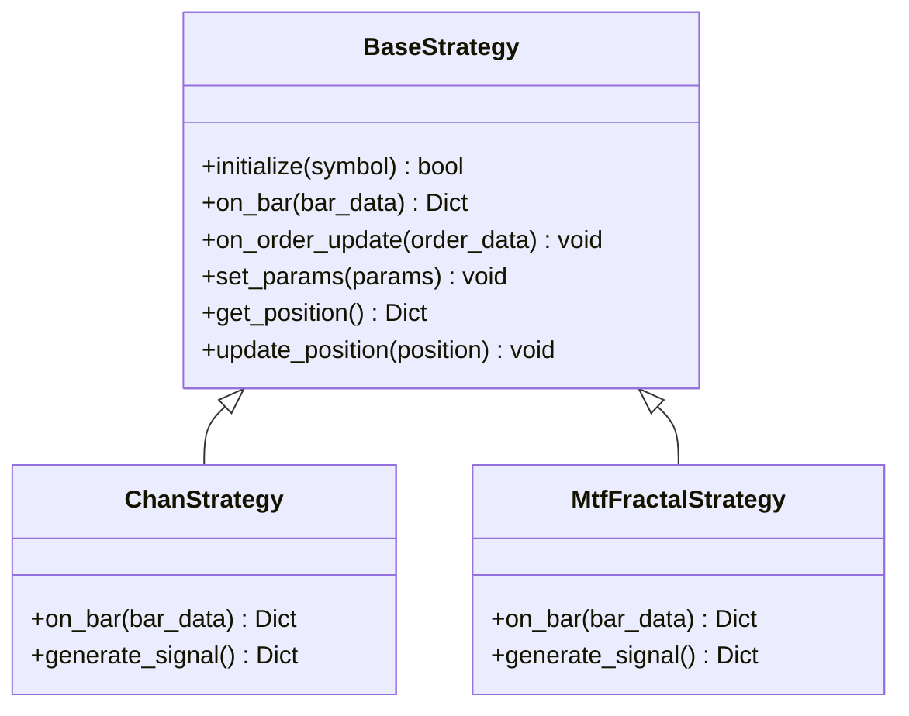
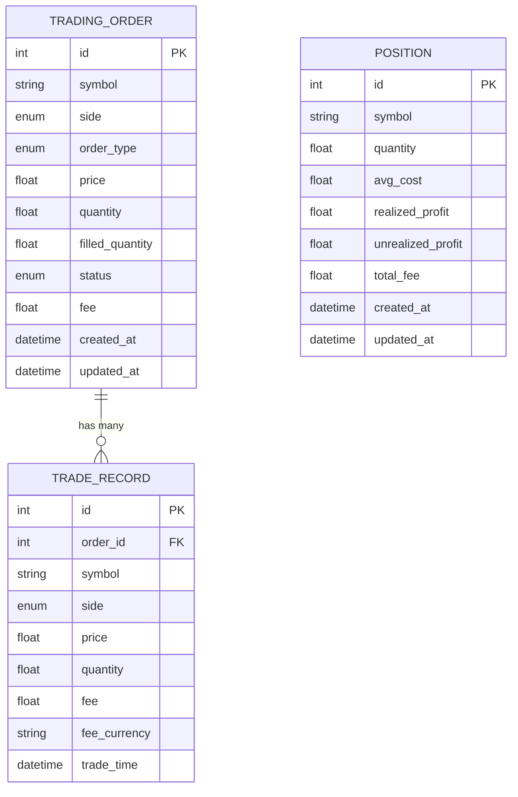
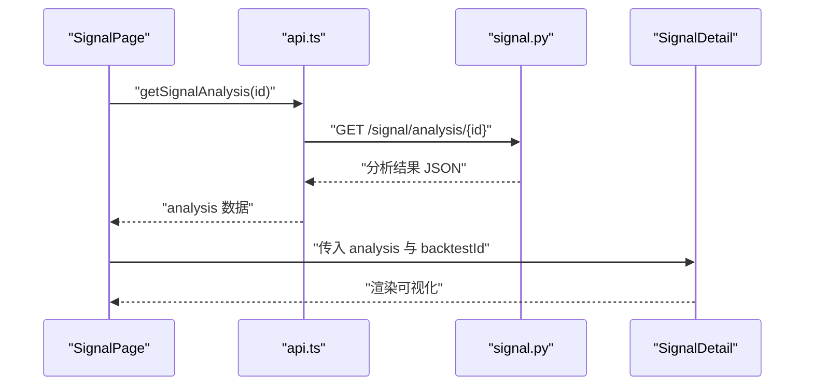
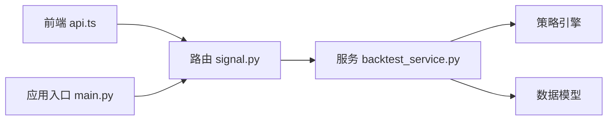

# 信号路由

<cite>
**本文引用的文件**
- [main.py](file://main.py)
- [api/main.py](file://trading_system/api/main.py)
- [api/routers/backtest.py](file://trading_system/api/routers/backtest.py)
- [api/routers/signal.py](file://trading_system/api/routers/signal.py)
- [api/services/backtest_service.py](file://trading_system/api/services/backtest_service.py)
- [strategies/base_strategy.py](file://trading_system/strategies/base_strategy.py)
- [strategies/chan_strategy.py](file://trading_system/strategies/chan_strategy.py)
- [strategies/mtf_fractal_strategy.py](file://trading_system/strategies/mtf_fractal_strategy.py)
- [models/trading_order.py](file://trading_system/models/trading_order.py)
- [models/trade_record.py](file://trading_system/models/trade_record.py)
- [models/position.py](file://trading_system/models/position.py)
- [core/schemas.py](file://trading_system/core/schemas.py)
- [data/market_data.py](file://trading_system/data/market_data.py)
- [data/backtest_data.py](file://trading_system/data/backtest_data.py)
- [frontend/src/api.ts](file://frontend/src/api.ts)
- [frontend/src/pages/SignalPage.tsx](file://frontend/src/pages/SignalPage.tsx)
- [frontend/src/components/SignalDetail.tsx](file://frontend/src/components/SignalDetail.tsx)
</cite>

## 目录
1. [引言](#引言)
2. [项目结构](#项目结构)
3. [核心组件](#核心组件)
4. [架构总览](#架构总览)
5. [详细组件分析](#详细组件分析)
6. [依赖分析](#依赖分析)
7. [性能考虑](#性能考虑)
8. [故障排除指南](#故障排除指南)
9. [结论](#结论)
10. [附录](#附录)

## 引言
本指南围绕“信号路由”主题，系统性梳理信号分析API的端点设计与实现逻辑，重点覆盖：
- GET /signal/detail/{backtest_id} 获取信号详情
- GET /signal/analysis/{backtest_id} 获取信号分析结果
并结合后端路由、服务层、策略引擎、数据模型与前端调用链路，给出数据模型、分析算法接口、结果格式规范、过滤条件、统计指标、可视化数据准备、与策略引擎的集成方式、缓存策略与性能优化建议，以及常见问题与排错思路。

## 项目结构
后端采用 FastAPI 应用，路由位于 trading_system/api/routers 下，服务层封装业务逻辑，策略引擎位于 trading_system/strategies，数据模型与 Pydantic Schema 位于 models 与 core/schemas，前端通过 /api 前缀调用后端接口。

图表来源
- [api/main.py](file://trading_system/api/main.py)
- [api/routers/backtest.py](file://trading_system/api/routers/backtest.py)
- [api/routers/signal.py](file://trading_system/api/routers/signal.py)
- [api/services/backtest_service.py](file://trading_system/api/services/backtest_service.py)
- [strategies/base_strategy.py](file://trading_system/strategies/base_strategy.py)
- [strategies/chan_strategy.py](file://trading_system/strategies/chan_strategy.py)
- [strategies/mtf_fractal_strategy.py](file://trading_system/strategies/mtf_fractal_strategy.py)
- [models/trading_order.py](file://trading_system/models/trading_order.py)
- [models/trade_record.py](file://trading_system/models/trade_record.py)
- [models/position.py](file://trading_system/models/position.py)
- [core/schemas.py](file://trading_system/core/schemas.py)
- [frontend/src/api.ts](file://frontend/src/api.ts)
- [frontend/src/pages/SignalPage.tsx](file://frontend/src/pages/SignalPage.tsx)
- [frontend/src/components/SignalDetail.tsx](file://frontend/src/components/SignalDetail.tsx)

章节来源
- [main.py:1-13](file://main.py#L1-L13)
- [api/main.py](file://trading_system/api/main.py)
- [api/routers/backtest.py](file://trading_system/api/routers/backtest.py)
- [api/routers/signal.py](file://trading_system/api/routers/signal.py)
- [api/services/backtest_service.py](file://trading_system/api/services/backtest_service.py)
- [frontend/src/api.ts:1-51](file://frontend/src/api.ts#L1-L51)

## 核心组件
- 路由层：定义 /signal/detail/{backtest_id} 与 /signal/analysis/{backtest_id} 两个端点，负责请求解析、参数校验与响应格式化。
- 服务层：封装信号详情与分析结果的聚合逻辑，连接策略引擎与数据库模型，输出标准化结果。
- 策略引擎：提供信号生成与回测能力，支撑信号详情与分析所需的数据源。
- 数据模型与 Schema：定义订单、成交记录、持仓与响应模型，保证前后端契约一致。
- 前端：通过 api.ts 统一发起 /api 前缀请求，SignalPage.tsx 与 SignalDetail.tsx 展示分析结果与可视化。

章节来源
- [api/routers/signal.py](file://trading_system/api/routers/signal.py)
- [api/services/backtest_service.py](file://trading_system/api/services/backtest_service.py)
- [strategies/base_strategy.py:1-168](file://trading_system/strategies/base_strategy.py#L1-L168)
- [models/trading_order.py:1-43](file://trading_system/models/trading_order.py#L1-L43)
- [models/trade_record.py:1-22](file://trading_system/models/trade_record.py#L1-L22)
- [models/position.py:1-18](file://trading_system/models/position.py#L1-L18)
- [core/schemas.py:1-88](file://trading_system/core/schemas.py#L1-L88)
- [frontend/src/api.ts:1-51](file://frontend/src/api.ts#L1-L51)

## 架构总览
信号路由从前端发起请求，经路由层进入服务层，服务层根据回测 ID 聚合策略引擎与数据库中的信号数据，产出信号详情与分析结果，最终以统一的 JSON 结构返回给前端。

图表来源
- [frontend/src/pages/SignalPage.tsx:1-39](file://frontend/src/pages/SignalPage.tsx#L1-L39)
- [frontend/src/api.ts:1-51](file://frontend/src/api.ts#L1-L51)
- [api/routers/signal.py](file://trading_system/api/routers/signal.py)
- [api/services/backtest_service.py](file://trading_system/api/services/backtest_service.py)
- [strategies/base_strategy.py:1-168](file://trading_system/strategies/base_strategy.py#L1-L168)
- [models/trading_order.py:1-43](file://trading_system/models/trading_order.py#L1-L43)
- [models/trade_record.py:1-22](file://trading_system/models/trade_record.py#L1-L22)
- [models/position.py:1-18](file://trading_system/models/position.py#L1-L18)

## 详细组件分析

### 1) 路由与端点设计
- GET /signal/detail/{backtest_id}
  - 功能：返回信号详情，包含 enriched_trades、indicator_stats、summary 等字段。
  - 输入：路径参数 backtest_id（字符串）。
  - 输出：SignalDetail 对象（见前端类型定义）。
- GET /signal/analysis/{backtest_id}
  - 功能：返回信号分析结果，包含收益分布、动作统计、指标统计等。
  - 输入：路径参数 backtest_id（字符串）。
  - 输出：任意 JSON 结构（前端按需消费）。

实现要点
- 路由层负责参数校验与异常捕获，确保 backtest_id 存在且有效。
- 响应体遵循统一的 JSON 规范，便于前端渲染。

章节来源
- [api/routers/signal.py](file://trading_system/api/routers/signal.py)
- [frontend/src/api.ts:35-51](file://frontend/src/api.ts#L35-L51)

### 2) 服务层与数据聚合
- 输入：backtest_id
- 处理流程：
  - 读取回测结果与信号序列（来自策略引擎）
  - 聚合订单、成交、持仓明细
  - 计算指标统计（如动作统计、收益分布、指标统计）
  - 生成 enriched_trades（可选：附加指标、风控标记等）
- 输出：标准化的分析结果对象

图表来源
- [api/services/backtest_service.py](file://trading_system/api/services/backtest_service.py)
- [models/trading_order.py:1-43](file://trading_system/models/trading_order.py#L1-L43)
- [models/trade_record.py:1-22](file://trading_system/models/trade_record.py#L1-L22)
- [models/position.py:1-18](file://trading_system/models/position.py#L1-L18)

章节来源
- [api/services/backtest_service.py](file://trading_system/api/services/backtest_service.py)
- [models/trading_order.py:1-43](file://trading_system/models/trading_order.py#L1-L43)
- [models/trade_record.py:1-22](file://trading_system/models/trade_record.py#L1-L22)
- [models/position.py:1-18](file://trading_system/models/position.py#L1-L18)

### 3) 策略引擎与信号生成
- BaseStrategy 抽象类定义了 initialize、on_bar、on_order_update 等核心接口，策略实现通过这些接口生成信号。
- 具体策略（如 chan_strategy、mtf_fractal_strategy）在 on_bar 中基于 K 线数据生成交易信号，供路由与服务层消费。
- 信号数据结构通常包含 action、quantity、price、order_type 等字段，服务层将其转换为 enriched_trades。

图表来源
- [strategies/base_strategy.py:1-168](file://trading_system/strategies/base_strategy.py#L1-L168)
- [strategies/chan_strategy.py](file://trading_system/strategies/chan_strategy.py)
- [strategies/mtf_fractal_strategy.py](file://trading_system/strategies/mtf_fractal_strategy.py)

章节来源
- [strategies/base_strategy.py:1-168](file://trading_system/strategies/base_strategy.py#L1-L168)
- [strategies/chan_strategy.py](file://trading_system/strategies/chan_strategy.py)
- [strategies/mtf_fractal_strategy.py](file://trading_system/strategies/mtf_fractal_strategy.py)

### 4) 数据模型与 Schema
- 订单模型 TradingOrder：包含 symbol、side、order_type、price、quantity、status 等字段，与 TradeRecord 一对多关联。
- 成交记录模型 TradeRecord：包含 order_id、symbol、side、price、quantity、fee、trade_time 等字段。
- 持仓模型 Position：包含 symbol、quantity、avg_cost、realized_profit、unrealized_profit、total_fee 等字段。
- Pydantic Schema：定义请求/响应的字段与类型约束，确保前后端契约一致。

图表来源
- [models/trading_order.py:1-43](file://trading_system/models/trading_order.py#L1-L43)
- [models/trade_record.py:1-22](file://trading_system/models/trade_record.py#L1-L22)
- [models/position.py:1-18](file://trading_system/models/position.py#L1-L18)
- [core/schemas.py:1-88](file://trading_system/core/schemas.py#L1-L88)

章节来源
- [models/trading_order.py:1-43](file://trading_system/models/trading_order.py#L1-L43)
- [models/trade_record.py:1-22](file://trading_system/models/trade_record.py#L1-L22)
- [models/position.py:1-18](file://trading_system/models/position.py#L1-L18)
- [core/schemas.py:1-88](file://trading_system/core/schemas.py#L1-L88)

### 5) 前端集成与可视化
- 前端通过 api.ts 的 getSignalDetail 与 getSignalAnalysis 发起请求，分别对应后端两个端点。
- SignalPage.tsx 负责选择回测结果并触发分析请求，SignalDetail.tsx 根据 analysis 渲染可视化面板（如收益分布、动作统计、指标统计等）。

图表来源
- [frontend/src/pages/SignalPage.tsx:1-39](file://frontend/src/pages/SignalPage.tsx#L1-L39)
- [frontend/src/components/SignalDetail.tsx](file://frontend/src/components/SignalDetail.tsx)
- [frontend/src/api.ts:1-51](file://frontend/src/api.ts#L1-L51)
- [api/routers/signal.py](file://trading_system/api/routers/signal.py)

章节来源
- [frontend/src/pages/SignalPage.tsx:1-39](file://frontend/src/pages/SignalPage.tsx#L1-L39)
- [frontend/src/components/SignalDetail.tsx](file://frontend/src/components/SignalDetail.tsx)
- [frontend/src/api.ts:1-51](file://frontend/src/api.ts#L1-L51)

## 依赖分析
- 路由依赖服务层，服务层依赖策略引擎与数据模型。
- 前端仅依赖路由层提供的 /api 前缀接口。
- 后端应用入口 main.py 启动 FastAPI 应用，路由注册于 api/main.py。

图表来源
- [main.py:1-13](file://main.py#L1-L13)
- [api/main.py](file://trading_system/api/main.py)
- [api/routers/signal.py](file://trading_system/api/routers/signal.py)
- [api/services/backtest_service.py](file://trading_system/api/services/backtest_service.py)
- [strategies/base_strategy.py:1-168](file://trading_system/strategies/base_strategy.py#L1-L168)
- [models/trading_order.py:1-43](file://trading_system/models/trading_order.py#L1-L43)
- [models/trade_record.py:1-22](file://trading_system/models/trade_record.py#L1-L22)
- [models/position.py:1-18](file://trading_system/models/position.py#L1-L18)

章节来源
- [main.py:1-13](file://main.py#L1-L13)
- [api/main.py](file://trading_system/api/main.py)
- [api/routers/signal.py](file://trading_system/api/routers/signal.py)
- [api/services/backtest_service.py](file://trading_system/api/services/backtest_service.py)

## 性能考虑
- 缓存策略
  - 对于高频访问的分析结果，可在服务层引入内存缓存（如 LRU 缓存），键为 backtest_id，避免重复计算。
  - 对于静态回测数据，可缓存已聚合的 enriched_trades 与指标统计，减少数据库与策略引擎的重复调用。
- 分页与分批
  - 若信号序列较大，建议分页返回 enriched_trades 或分批计算指标，降低单次响应体积。
- 并发与异步
  - 利用策略引擎的异步回调机制，避免阻塞主线程；在服务层聚合时注意并发安全。
- 数据库索引
  - 确保订单与成交表的 symbol、order_id、trade_time 等字段建立索引，提升查询效率。
- 前端懒加载
  - 前端仅在选中回测结果后再请求分析，避免一次性加载多个回测结果。

## 故障排除指南
- 常见错误与定位
  - 404/422：确认 backtest_id 是否存在且格式正确；检查路由参数绑定与校验逻辑。
  - 500：检查服务层聚合逻辑，关注策略引擎返回空值或异常；查看数据库查询是否超时。
  - 数据不一致：核对订单、成交、持仓三者的时间窗口与 symbol 匹配关系。
- 排查步骤
  - 后端：开启路由与服务层日志，打印 backtest_id、查询耗时、聚合中间结果。
  - 前端：确认 /api 前缀与端点路径一致，检查网络拦截器与跨域配置。
  - 数据：导出回测结果与订单/成交/持仓样本，验证字段映射与单位换算。

章节来源
- [api/routers/signal.py](file://trading_system/api/routers/signal.py)
- [api/services/backtest_service.py](file://trading_system/api/services/backtest_service.py)
- [frontend/src/api.ts:1-51](file://frontend/src/api.ts#L1-L51)

## 结论
信号路由通过清晰的三层架构（路由/服务/策略与数据模型）实现了从回测数据到信号详情与分析结果的完整闭环。结合缓存与性能优化策略，可满足高并发场景下的实时分析需求；配合前端可视化组件，能够直观呈现信号质量与策略表现。

## 附录

### A. API 端点定义与调用示例
- GET /signal/detail/{backtest_id}
  - 请求：无查询参数
  - 响应：SignalDetail（包含 backtest_id、total_trades、enriched_trades、indicator_stats、summary）
  - 前端调用：api.getSignalDetail(backtest_id)
- GET /signal/analysis/{backtest_id}
  - 请求：无查询参数
  - 响应：任意 JSON（前端按需消费，如收益分布、动作统计、指标统计）
  - 前端调用：api.getSignalAnalysis(backtest_id)

章节来源
- [frontend/src/api.ts:35-51](file://frontend/src/api.ts#L35-L51)
- [api/routers/signal.py](file://trading_system/api/routers/signal.py)

### B. 信号数据模型与字段说明
- 订单（TradingOrder）：symbol、side、order_type、price、quantity、status、fee、created_at、updated_at
- 成交（TradeRecord）：order_id、symbol、side、price、quantity、fee、fee_currency、trade_time
- 持仓（Position）：symbol、quantity、avg_cost、realized_profit、unrealized_profit、total_fee、created_at、updated_at
- 响应模型（Pydantic）：与上述字段一一对应，支持 from_attributes

章节来源
- [models/trading_order.py:1-43](file://trading_system/models/trading_order.py#L1-L43)
- [models/trade_record.py:1-22](file://trading_system/models/trade_record.py#L1-L22)
- [models/position.py:1-18](file://trading_system/models/position.py#L1-L18)
- [core/schemas.py:1-88](file://trading_system/core/schemas.py#L1-L88)

### C. 策略引擎集成要点
- on_bar 回调中生成信号字典，包含 action、quantity、price、order_type 等字段。
- on_order_update 回调中同步订单状态与内部持仓，保障分析阶段的订单一致性。
- 通过 set_params 与 get_position 提供参数注入与外部查询接口。

章节来源
- [strategies/base_strategy.py:1-168](file://trading_system/strategies/base_strategy.py#L1-L168)

### D. 可视化数据准备清单
- 收益分布：基于 enriched_trades 的 profit、profit_pct 字段
- 动作统计：按 action 分类的次数与占比
- 指标统计：按策略版本（如 multi_indicator、MTF 等）提取相应指标序列
- 策略版本识别：通过 analysis 中的 strategy_version 字段切换渲染逻辑

章节来源
- [frontend/src/components/SignalDetail.tsx](file://frontend/src/components/SignalDetail.tsx)
- [frontend/src/api.ts:17-38](file://frontend/src/api.ts#L17-L38)