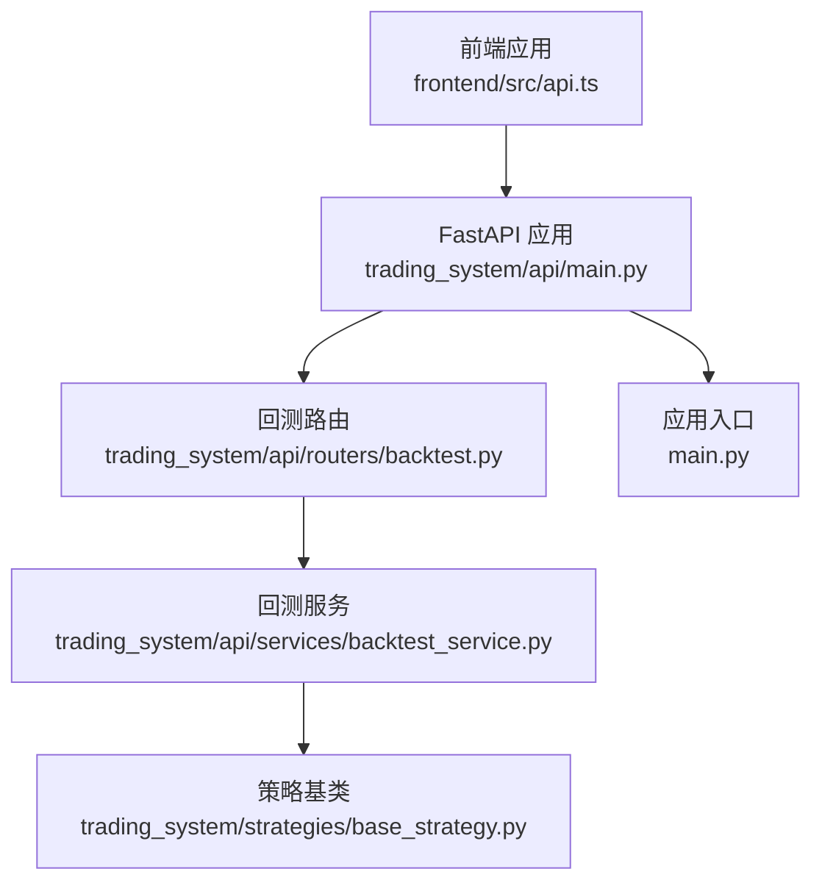
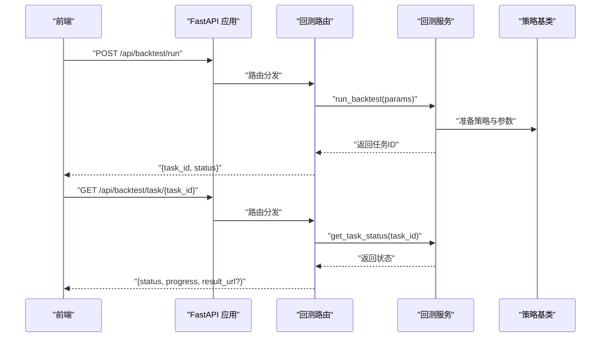
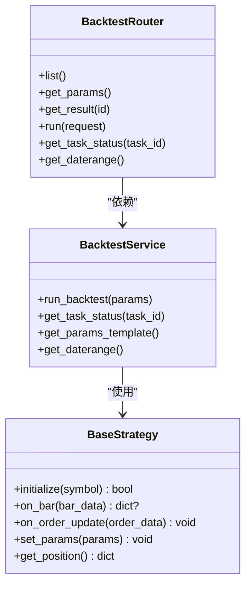
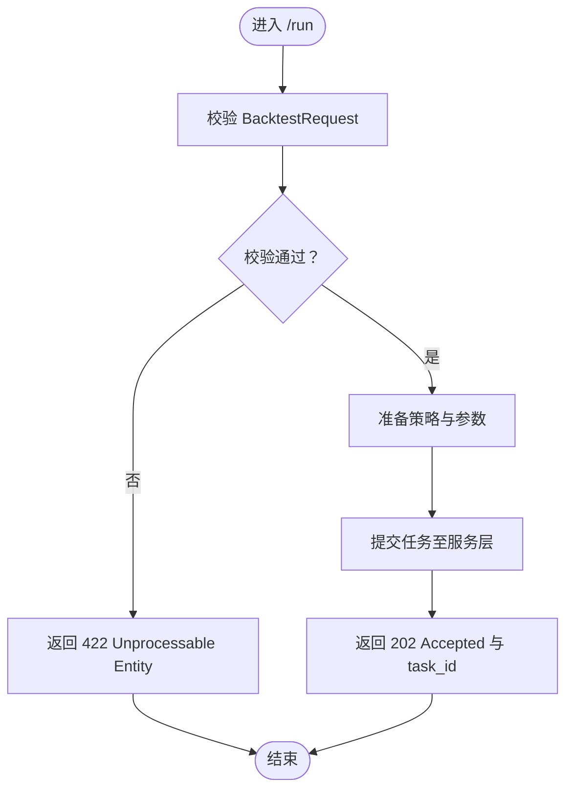
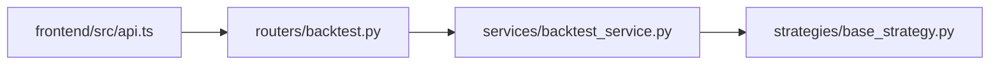

# 回测路由

<cite>
**本文引用的文件**
- [main.py](file://main.py)
- [trading_system/api/main.py](file://trading_system/api/main.py)
- [trading_system/api/routers/backtest.py](file://trading_system/api/routers/backtest.py)
- [trading_system/api/services/backtest_service.py](file://trading_system/api/services/backtest_service.py)
- [trading_system/strategies/base_strategy.py](file://trading_system/strategies/base_strategy.py)
- [.trae/specs/fix_equity_calculation/spec.md](file://.trae/specs/fix_equity_calculation/spec.md)
- [frontend/src/api.ts](file://frontend/src/api.ts)
</cite>

## 目录
1. [简介](#简介)
2. [项目结构](#项目结构)
3. [核心组件](#核心组件)
4. [架构总览](#架构总览)
5. [详细组件分析](#详细组件分析)
6. [依赖分析](#依赖分析)
7. [性能考虑](#性能考虑)
8. [故障排查指南](#故障排查指南)
9. [结论](#结论)
10. [附录](#附录)

## 简介
本指南面向后端开发者与前端对接人员，系统化梳理回测路由的端点设计、请求模型、路由装饰器与异常处理机制，并给出请求/响应示例与最佳实践。目标是帮助团队快速理解并稳定扩展回测相关 API。

## 项目结构
回测路由位于后端应用的 API 子系统中，采用“路由层-服务层-策略层”的分层架构：
- 路由层：定义 HTTP 接口与参数校验
- 服务层：封装回测任务调度、状态查询、数据准备等业务逻辑
- 策略层：提供策略抽象与回测引擎能力
- 前端：通过统一的 /api 基础路径调用后端接口

图表来源
- [trading_system/api/main.py](file://trading_system/api/main.py)
- [trading_system/api/routers/backtest.py](file://trading_system/api/routers/backtest.py)
- [trading_system/api/services/backtest_service.py](file://trading_system/api/services/backtest_service.py)
- [trading_system/strategies/base_strategy.py](file://trading_system/strategies/base_strategy.py)
- [main.py](file://main.py)
- [frontend/src/api.ts](file://frontend/src/api.ts)

章节来源
- [trading_system/api/main.py](file://trading_system/api/main.py)
- [trading_system/api/routers/backtest.py](file://trading_system/api/routers/backtest.py)
- [trading_system/api/services/backtest_service.py](file://trading_system/api/services/backtest_service.py)
- [trading_system/strategies/base_strategy.py](file://trading_system/strategies/base_strategy.py)
- [frontend/src/api.ts](file://frontend/src/api.ts)

## 核心组件
- 回测路由模块：负责定义与实现所有回测相关端点
- 回测服务模块：封装任务提交、状态查询、参数模板与数据范围查询等
- 策略基类：为回测引擎提供统一的策略接口与参数管理能力
- 前端 API 客户端：定义与后端一致的接口契约

章节来源
- [trading_system/api/routers/backtest.py](file://trading_system/api/routers/backtest.py)
- [trading_system/api/services/backtest_service.py](file://trading_system/api/services/backtest_service.py)
- [trading_system/strategies/base_strategy.py](file://trading_system/strategies/base_strategy.py)
- [frontend/src/api.ts](file://frontend/src/api.ts)

## 架构总览
回测 API 的典型调用链路如下：

图表来源
- [trading_system/api/routers/backtest.py](file://trading_system/api/routers/backtest.py)
- [trading_system/api/services/backtest_service.py](file://trading_system/api/services/backtest_service.py)
- [frontend/src/api.ts](file://frontend/src/api.ts)

## 详细组件分析

### 路由装饰器与端点设计
- 路由装饰器：使用 FastAPI 的路由装饰器定义端点，结合 Pydantic 模型进行请求体与路径参数的自动校验与序列化
- 端点命名与路径：统一以 /api/backtest 为前缀，保证与前端客户端一致
- 异常处理：通过 HTTP 状态码与统一错误响应结构返回错误信息，便于前端展示与重试

章节来源
- [trading_system/api/routers/backtest.py](file://trading_system/api/routers/backtest.py)
- [frontend/src/api.ts](file://frontend/src/api.ts)

### 请求模型 BacktestRequest 字段定义、验证规则与默认值
BacktestRequest 作为回测任务的输入模型，建议包含以下字段（字段名与含义以注释形式呈现，具体实现请参考源码）：
- symbol: 交易品种代码（必填，字符串）
- strategy_name: 策略名称（必填，字符串）
- params: 策略参数对象（必填，键值对）
- initial_capital: 初始资金（数值，默认值依据业务规则设定）
- leverage: 杠杆倍数（数值，默认值依据业务规则设定）
- start_date: 回测开始日期（日期格式，默认值依据业务规则设定）
- end_date: 回测结束日期（日期格式，默认值依据业务规则设定）
- quote_currency: 结算货币（字符串，默认值依据业务规则设定）
- data_source: 数据来源（字符串，默认值依据业务规则设定）

验证规则与默认值设置：
- 必填字段缺失时返回 422 Unprocessable Entity
- 日期格式不正确时返回 422 Unprocessable Entity
- 数值字段越界或非法时返回 422 Unprocessable Entity
- 默认值通过 Pydantic 的 Field(default=...) 或构造函数参数提供

章节来源
- [trading_system/api/routers/backtest.py](file://trading_system/api/routers/backtest.py)

### 端点实现与流程

#### GET /list：获取回测列表
- 功能：列出历史回测结果摘要
- 输入：无
- 输出：包含 count 与 results 的对象，results 中每项为回测摘要条目
- 典型响应字段：id、filename、created、symbol、start_date、end_date、net_profit、total_return_pct、total_trades、win_rate_pct、max_drawdown_pct、sharpe_ratio、strategy_version（可选）
- 状态码：200 OK；异常时返回 5xx

章节来源
- [frontend/src/api.ts](file://frontend/src/api.ts)
- [trading_system/api/routers/backtest.py](file://trading_system/api/routers/backtest.py)

#### GET /params：获取参数模板
- 功能：返回策略参数模板，供前端表单渲染
- 输入：无
- 输出：参数模板对象（键为参数名，值为默认值或可选项）
- 状态码：200 OK；异常时返回 5xx

章节来源
- [frontend/src/api.ts](file://frontend/src/api.ts)
- [trading_system/api/routers/backtest.py](file://trading_system/api/routers/backtest.py)

#### GET /{backtest_id}：获取单次回测结果
- 功能：根据回测 ID 返回完整回测报告
- 输入：路径参数 backtest_id
- 输出：回测详情对象，包含基础统计、净值曲线、交易明细等
- 典型响应字段：initial_balance、final_equity、net_profit、total_return_pct、max_drawdown_pct、sharpe_ratio、total_trades、closed_trades、win_rate_pct、avg_trade_profit、avg_holding_hours、profit_factor、timestamps、equity_curve、trades、strategy_version（可选）、funding_fee_summary（可选）
- 状态码：200 OK；未找到返回 404 Not Found；异常时返回 5xx

章节来源
- [frontend/src/api.ts](file://frontend/src/api.ts)
- [trading_system/api/routers/backtest.py](file://trading_system/api/routers/backtest.py)

#### POST /run：提交回测任务
- 功能：提交回测任务，异步执行并返回任务 ID
- 输入：BacktestRequest 对象
- 输出：包含 task_id 与 status 的对象
- 状态码：202 Accepted；参数无效返回 422 Unprocessable Entity；异常时返回 5xx
- 前端调用示例：见前端 api.ts 中 runBacktest 的实现

章节来源
- [frontend/src/api.ts](file://frontend/src/api.ts)
- [trading_system/api/routers/backtest.py](file://trading_system/api/routers/backtest.py)

#### GET /task/{task_id}：查询任务状态
- 功能：查询回测任务执行状态
- 输入：路径参数 task_id
- 输出：包含状态、进度与结果链接（若已完成）的对象
- 状态码：200 OK；未找到返回 404 Not Found；异常时返回 5xx

章节来源
- [frontend/src/api.ts](file://frontend/src/api.ts)
- [trading_system/api/routers/backtest.py](file://trading_system/api/routers/backtest.py)

#### GET /data/daterange：查询日期范围
- 功能：查询可用历史数据的日期范围
- 输入：无
- 输出：包含最早日期与最晚日期的对象
- 状态码：200 OK；异常时返回 5xx

章节来源
- [frontend/src/api.ts](file://frontend/src/api.ts)
- [trading_system/api/routers/backtest.py](file://trading_system/api/routers/backtest.py)

### 服务层与策略层协作
- 服务层负责：
  - 解析与校验请求参数
  - 触发回测任务执行（可选地先拉取最新数据）
  - 维护任务状态与结果存储
- 策略层提供：
  - 策略抽象接口与参数管理能力
  - 与回测引擎的交互协议

图表来源
- [trading_system/api/routers/backtest.py](file://trading_system/api/routers/backtest.py)
- [trading_system/api/services/backtest_service.py](file://trading_system/api/services/backtest_service.py)
- [trading_system/strategies/base_strategy.py](file://trading_system/strategies/base_strategy.py)

章节来源
- [trading_system/api/routers/backtest.py](file://trading_system/api/routers/backtest.py)
- [trading_system/api/services/backtest_service.py](file://trading_system/api/services/backtest_service.py)
- [trading_system/strategies/base_strategy.py](file://trading_system/strategies/base_strategy.py)

### 处理流程图：POST /run 提交流程

图表来源
- [trading_system/api/routers/backtest.py](file://trading_system/api/routers/backtest.py)
- [trading_system/api/services/backtest_service.py](file://trading_system/api/services/backtest_service.py)

## 依赖分析
- 路由层依赖服务层提供的任务执行与状态查询能力
- 服务层依赖策略基类提供的参数与生命周期管理
- 前端通过统一的 /api 前缀与后端交互，保持契约一致

图表来源
- [frontend/src/api.ts](file://frontend/src/api.ts)
- [trading_system/api/routers/backtest.py](file://trading_system/api/routers/backtest.py)
- [trading_system/api/services/backtest_service.py](file://trading_system/api/services/backtest_service.py)
- [trading_system/strategies/base_strategy.py](file://trading_system/strategies/base_strategy.py)

章节来源
- [frontend/src/api.ts](file://frontend/src/api.ts)
- [trading_system/api/routers/backtest.py](file://trading_system/api/routers/backtest.py)
- [trading_system/api/services/backtest_service.py](file://trading_system/api/services/backtest_service.py)
- [trading_system/strategies/base_strategy.py](file://trading_system/strategies/base_strategy.py)

## 性能考虑
- 异步执行：回测任务应异步执行，避免阻塞主请求线程
- 缓存策略：对常用参数模板与日期范围进行缓存，减少重复计算
- 数据预取：在回测前拉取最新数据，缩短等待时间
- 分页与限流：列表接口应支持分页与速率限制，防止资源耗尽

## 故障排查指南
- 参数校验失败：检查请求体是否符合 BacktestRequest 规范，确认必填字段与格式
- 任务状态异常：通过 GET /task/{task_id} 查询状态，定位执行阶段
- 数据范围错误：通过 GET /data/daterange 校验可用日期区间
- 权益曲线异常：参考权益计算修复规范，确保保证金纳入权益计算

章节来源
- [.trae/specs/fix_equity_calculation/spec.md](file://.trae/specs/fix_equity_calculation/spec.md)

## 结论
回测路由通过清晰的端点设计、严格的参数校验与完善的异常处理，为前端提供了稳定可靠的回测能力。配合服务层的任务调度与策略层的参数管理，能够支撑从参数模板、任务提交到结果查询的完整闭环。

## 附录

### 请求/响应示例（路径引用）
- 列表请求与响应：参见 [frontend/src/api.ts](file://frontend/src/api.ts)，调用 [trading_system/api/routers/backtest.py](file://trading_system/api/routers/backtest.py)
- 单次回测详情请求与响应：参见 [frontend/src/api.ts](file://frontend/src/api.ts)，调用 [trading_system/api/routers/backtest.py](file://trading_system/api/routers/backtest.py)
- 提交回测任务请求与响应：参见 [frontend/src/api.ts](file://frontend/src/api.ts)，调用 [trading_system/api/routers/backtest.py](file://trading_system/api/routers/backtest.py)
- 任务状态查询请求与响应：参见 [frontend/src/api.ts](file://frontend/src/api.ts)，调用 [trading_system/api/routers/backtest.py](file://trading_system/api/routers/backtest.py)
- 参数模板请求与响应：参见 [frontend/src/api.ts](file://frontend/src/api.ts)，调用 [trading_system/api/routers/backtest.py](file://trading_system/api/routers/backtest.py)
- 日期范围请求与响应：参见 [frontend/src/api.ts](file://frontend/src/api.ts)，调用 [trading_system/api/routers/backtest.py](file://trading_system/api/routers/backtest.py)

### HTTP 状态码最佳实践
- 200 OK：成功获取数据或完成操作
- 202 Accepted：已接受任务提交，返回任务 ID
- 404 Not Found：资源不存在（如回测结果或任务）
- 422 Unprocessable Entity：请求参数校验失败
- 5xx Internal Server Error：服务器内部错误