# FastAPI应用开发

<cite>
**本文档引用的文件**
- [main.py](file://main.py)
- [trading_system/api/main.py](file://trading_system/api/main.py)
- [trading_system/core/config.py](file://trading_system/core/config.py)
- [trading_system/core/database.py](file://trading_system/core/database.py)
- [trading_system/api/routers/backtest.py](file://trading_system/api/routers/backtest.py)
- [trading_system/api/routers/signal.py](file://trading_system/api/routers/signal.py)
- [trading_system/api/services/backtest_service.py](file://trading_system/api/services/backtest_service.py)
- [log_config.py](file://log_config.py)
- [requirements.txt](file://requirements.txt)
- [README.md](file://README.md)
</cite>

## 目录
1. [简介](#简介)
2. [项目结构](#项目结构)
3. [核心组件](#核心组件)
4. [架构概览](#架构概览)
5. [详细组件分析](#详细组件分析)
6. [依赖关系分析](#依赖关系分析)
7. [性能考虑](#性能考虑)
8. [故障排除指南](#故障排除指南)
9. [结论](#结论)

## 简介

本指南面向希望使用FastAPI构建交易系统的开发者，提供了完整的应用开发实践方案。该交易系统基于Python 3.7+，采用FastAPI作为Web框架，集成了CORS跨域支持、性能监控中间件、全局异常处理、数据库连接池管理和静态文件服务等核心功能。

系统主要功能包括：
- 回测引擎：支持多种交易策略的回测分析
- 信号分析：提供详细的交易信号和技术指标分析
- 实时数据：通过Binance API获取市场数据
- WebSocket连接：支持OKX等交易所的实时数据推送
- 数据持久化：基于MySQL的数据库存储

## 项目结构

该项目采用模块化的组织方式，核心目录结构如下：

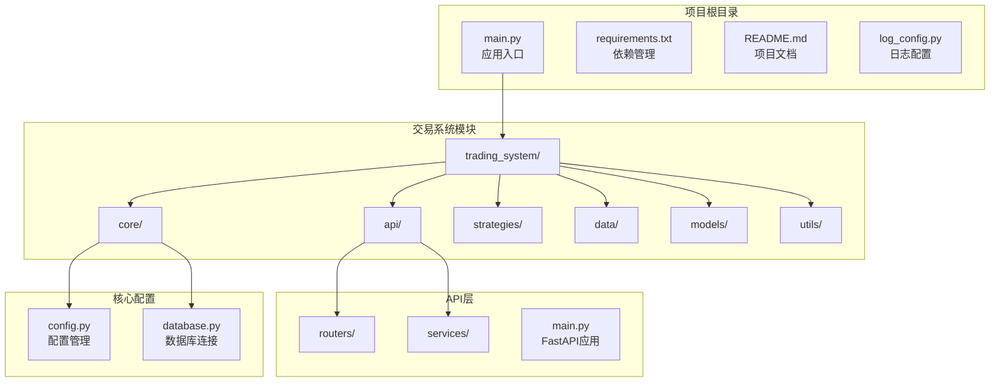

**图表来源**
- [main.py:1-13](file://main.py#L1-L13)
- [trading_system/api/main.py:1-104](file://trading_system/api/main.py#L1-L104)

**章节来源**
- [README.md:1-150](file://README.md#L1-L150)
- [requirements.txt:1-64](file://requirements.txt#L1-L64)

## 核心组件

### FastAPI应用初始化

应用的核心初始化过程包括以下关键步骤：

1. **应用实例创建**：创建FastAPI实例并配置基本元数据
2. **CORS中间件配置**：启用跨域资源共享支持
3. **性能监控中间件**：添加请求处理时间统计
4. **异常处理器注册**：配置全局异常处理机制
5. **生命周期管理**：设置启动事件处理程序
6. **路由注册**：包含回测和信号相关的API路由
7. **静态文件服务**：提供前端构建产物的静态访问

### 配置管理系统

系统采用Pydantic Settings进行配置管理，支持环境变量和默认值的灵活配置：

- **数据库连接配置**：连接池大小、超时设置、回收策略
- **日志级别配置**：支持DEBUG/INFO/WARNING/ERROR级别
- **环境变量加载**：自动从.env文件加载配置

### 数据库连接管理

采用SQLAlchemy ORM和连接池技术，提供高效的数据访问能力：

- **连接池配置**：可调的池大小和溢出设置
- **连接预检测**：自动检测和重建失效连接
- **会话管理**：自动化的数据库会话生命周期管理

**章节来源**
- [trading_system/api/main.py:12-104](file://trading_system/api/main.py#L12-L104)
- [trading_system/core/config.py:5-35](file://trading_system/core/config.py#L5-L35)
- [trading_system/core/database.py:12-45](file://trading_system/core/database.py#L12-L45)

## 架构概览

系统采用分层架构设计，确保关注点分离和代码的可维护性：

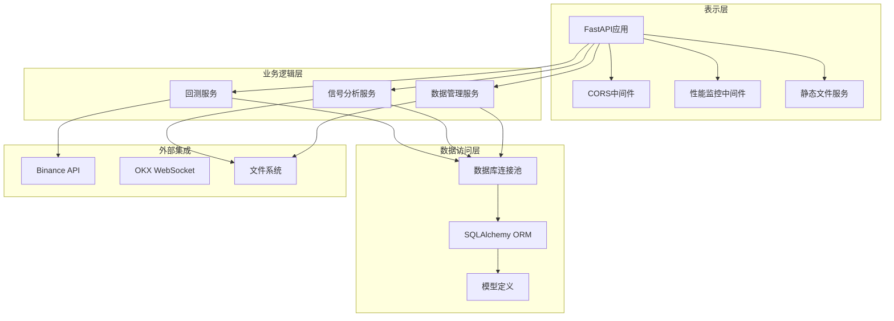

**图表来源**
- [trading_system/api/main.py:14-97](file://trading_system/api/main.py#L14-L97)
- [trading_system/api/services/backtest_service.py:58-248](file://trading_system/api/services/backtest_service.py#L58-L248)

## 详细组件分析

### CORS配置组件

CORS（跨域资源共享）中间件是现代Web应用的重要安全组件，该系统采用了宽松但合理的配置策略：

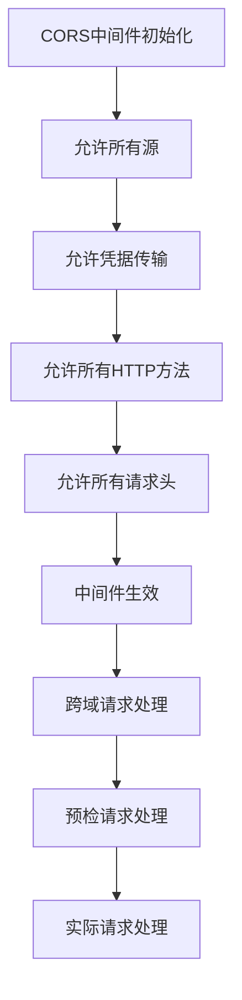

**图表来源**
- [trading_system/api/main.py:14-21](file://trading_system/api/main.py#L14-L21)

CORS配置的关键特点：
- **安全性考虑**：生产环境中建议限制允许的源列表
- **灵活性**：支持所有HTTP方法和请求头，便于开发调试
- **凭据支持**：允许携带Cookie和认证信息

### 性能监控中间件

自定义HTTP中间件用于监控请求处理性能，提供实时的性能指标：

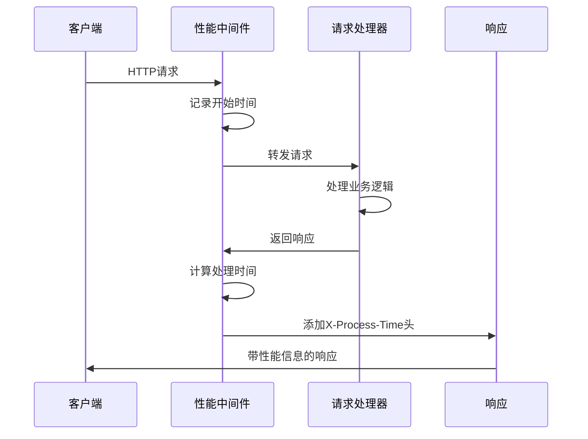

**图表来源**
- [trading_system/api/main.py:24-30](file://trading_system/api/main.py#L24-L30)

性能监控的关键功能：
- **实时性能统计**：精确测量每个请求的处理时间
- **响应头注入**：将处理时间信息添加到响应头中
- **性能优化指导**：帮助识别慢请求和性能瓶颈

### 全局异常处理器

系统实现了多层次的异常处理机制，确保应用的稳定性和用户体验：

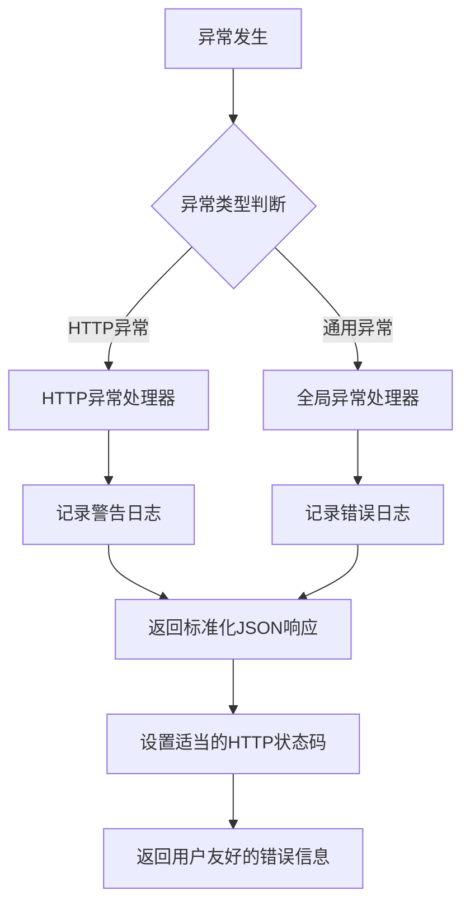

**图表来源**
- [trading_system/api/main.py:33-55](file://trading_system/api/main.py#L33-L55)

异常处理的设计原则：
- **层次化处理**：区分HTTP异常和通用异常的不同处理策略
- **日志记录**：详细记录异常信息便于问题排查
- **标准化响应**：提供一致的错误响应格式
- **状态码映射**：确保HTTP状态码与异常类型匹配

### 生命周期管理

应用启动和关闭的生命周期管理确保资源的正确初始化和清理：

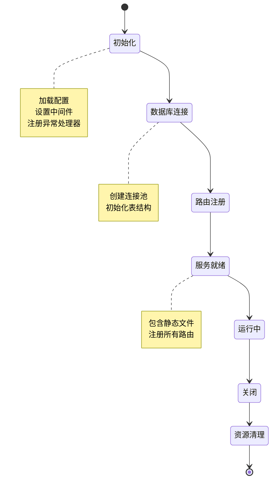

**图表来源**
- [trading_system/api/main.py:58-66](file://trading_system/api/main.py#L58-L66)

生命周期管理的关键流程：
- **启动阶段**：数据库初始化和表结构创建
- **运行阶段**：服务正常提供API接口
- **关闭阶段**：优雅地清理资源和连接

### 健康检查端点

健康检查端点用于监控应用和服务的运行状态：

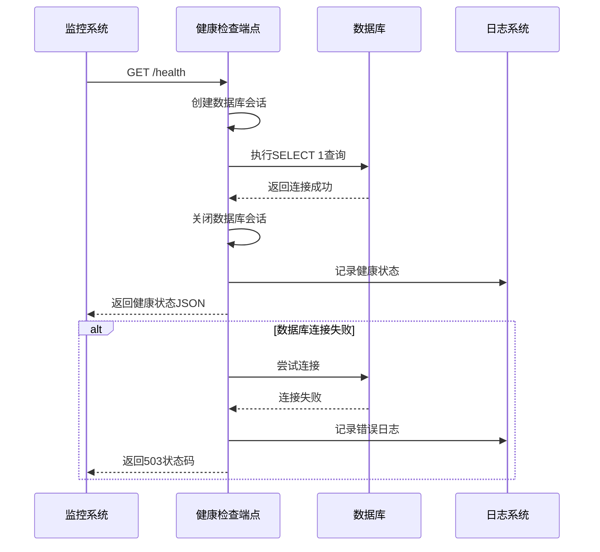

**图表来源**
- [trading_system/api/main.py:75-87](file://trading_system/api/main.py#L75-L87)

健康检查的设计要点：
- **数据库连通性验证**：确保数据库服务正常
- **快速响应**：执行轻量级的检查操作
- **状态码语义化**：使用适当的HTTP状态码表示状态
- **详细日志记录**：记录检查过程中的关键信息

### 静态文件服务

静态文件服务为前端应用提供资源托管功能：

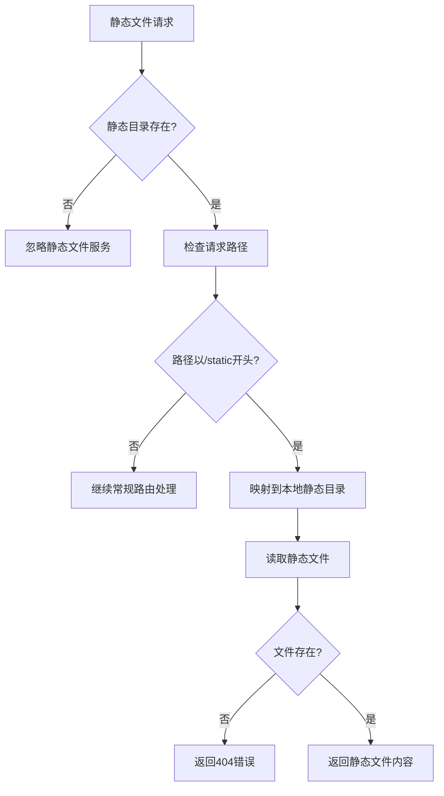

**图表来源**
- [trading_system/api/main.py:90-93](file://trading_system/api/main.py#L90-L93)

静态文件服务的特点：
- **条件挂载**：仅在静态目录存在时启用
- **路径映射**：将/static前缀映射到实际目录
- **文件存在性检查**：避免无效请求处理

### 回测服务组件

回测服务是交易系统的核心功能模块，支持多种策略的回测分析：

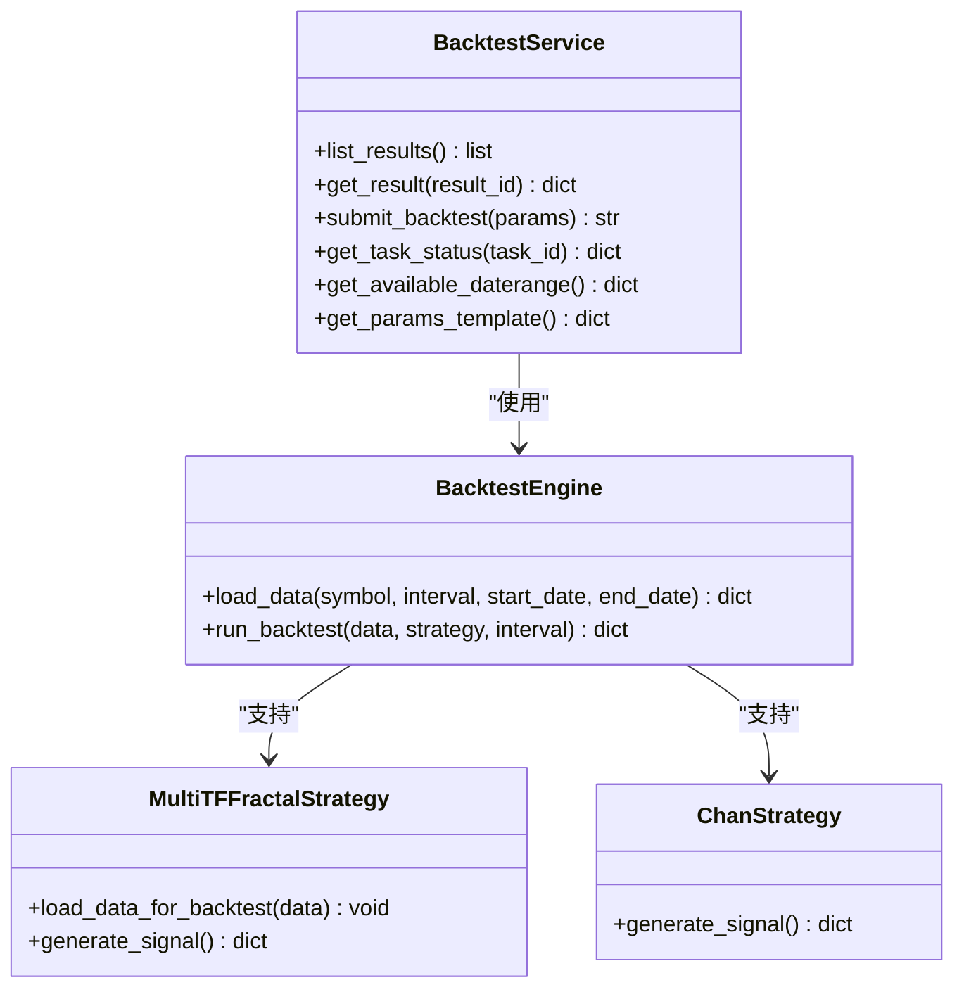

**图表来源**
- [trading_system/api/services/backtest_service.py:58-248](file://trading_system/api/services/backtest_service.py#L58-L248)

回测服务的关键功能：
- **任务队列管理**：支持并发的回测任务处理
- **策略适配**：支持多种交易策略的统一接口
- **结果存储**：自动保存和管理回测结果
- **进度跟踪**：实时监控回测任务的执行进度

### 信号分析组件

信号分析组件提供详细的交易信号和技术指标分析：

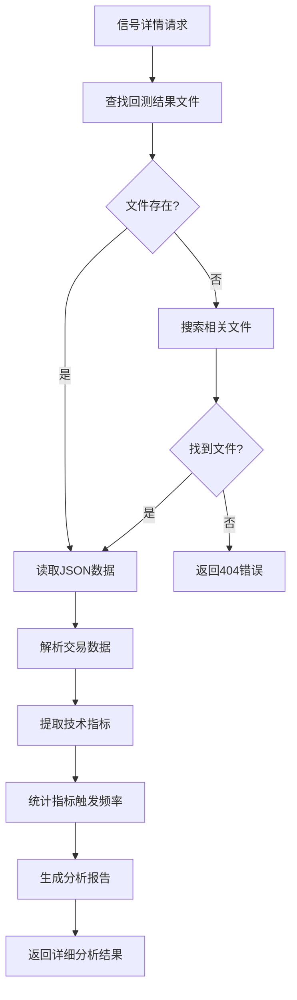

**图表来源**
- [trading_system/api/routers/signal.py:31-131](file://trading_system/api/routers/signal.py#L31-L131)

信号分析的核心能力：
- **技术指标解析**：从信号原因文本中提取技术指标
- **统计分析**：计算各类信号的触发频率和效果
- **可视化支持**：提供丰富的数据分析维度
- **性能优化**：缓存常用分析结果

**章节来源**
- [trading_system/api/main.py:14-97](file://trading_system/api/main.py#L14-L97)
- [trading_system/api/services/backtest_service.py:58-289](file://trading_system/api/services/backtest_service.py#L58-L289)
- [trading_system/api/routers/signal.py:31-178](file://trading_system/api/routers/signal.py#L31-L178)

## 依赖关系分析

系统依赖关系清晰明确，遵循单一职责原则：

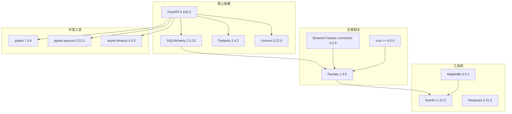

**图表来源**
- [requirements.txt:17-64](file://requirements.txt#L17-L64)

依赖管理的最佳实践：
- **版本锁定**：确保依赖版本的一致性
- **功能分离**：按功能领域划分依赖包
- **开发友好**：包含必要的测试和开发工具

**章节来源**
- [requirements.txt:1-64](file://requirements.txt#L1-L64)

## 性能考虑

### 连接池优化

系统采用连接池技术优化数据库连接性能：

- **池大小配置**：根据应用负载调整连接池大小
- **超时设置**：合理设置连接超时和回收时间
- **预检测机制**：自动检测和重建失效连接
- **并发控制**：限制同时活跃的连接数量

### 异步处理

利用异步编程提高I/O密集型操作的性能：

- **回测任务异步执行**：避免阻塞主线程
- **API调用异步化**：减少等待时间
- **文件操作异步化**：提高数据读写效率
- **WebSocket连接管理**：优化实时数据传输

### 缓存策略

实施多层次的缓存策略提升响应速度：

- **回测结果缓存**：避免重复计算相同参数的回测
- **技术指标缓存**：缓存常用的分析结果
- **配置信息缓存**：减少配置读取开销
- **静态资源缓存**：优化前端资源加载

## 故障排除指南

### 常见问题诊断

**数据库连接问题**
- 检查数据库服务是否正常运行
- 验证连接字符串格式和权限设置
- 查看连接池配置是否合理
- 监控连接泄漏和超时情况

**CORS配置问题**
- 确认允许的源列表配置
- 检查预检请求的处理
- 验证凭据传输设置
- 排查浏览器安全策略影响

**性能问题**
- 分析慢请求的处理时间
- 监控数据库查询性能
- 检查回测任务的并发度
- 优化静态文件服务

### 日志分析

系统提供了完善的日志记录机制：

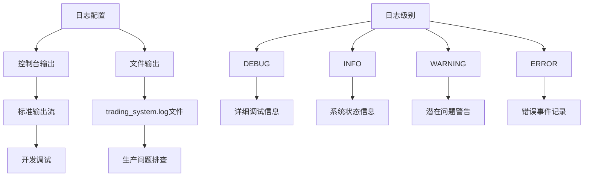

**图表来源**
- [log_config.py:11-64](file://log_config.py#L11-L64)

日志配置的关键特性：
- **多目标输出**：同时输出到控制台和文件
- **可配置格式**：支持自定义日志格式
- **级别控制**：不同级别的日志有不同的用途
- **避免重复**：防止重复添加处理器

**章节来源**
- [log_config.py:11-74](file://log_config.py#L11-L74)

## 结论

本FastAPI应用开发指南涵盖了交易系统开发的核心要素，包括应用初始化、中间件配置、异常处理和生命周期管理等方面。通过采用模块化的设计和最佳实践，该系统具备了良好的可维护性和扩展性。

关键优势总结：
- **架构清晰**：分层设计确保代码的可维护性
- **功能完整**：涵盖了交易系统的主要功能需求
- **性能优化**：通过连接池和异步处理提升性能
- **开发友好**：完善的日志和错误处理机制
- **部署灵活**：支持多种部署场景和配置选项

对于生产环境的部署，建议重点关注以下方面：
- CORS配置的安全性调整
- 数据库连接池的性能调优
- 异常处理的监控和告警
- 日志轮转和存储策略
- 静态文件的CDN优化