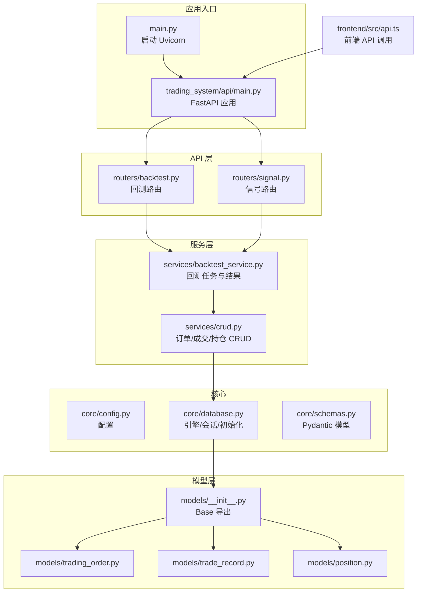
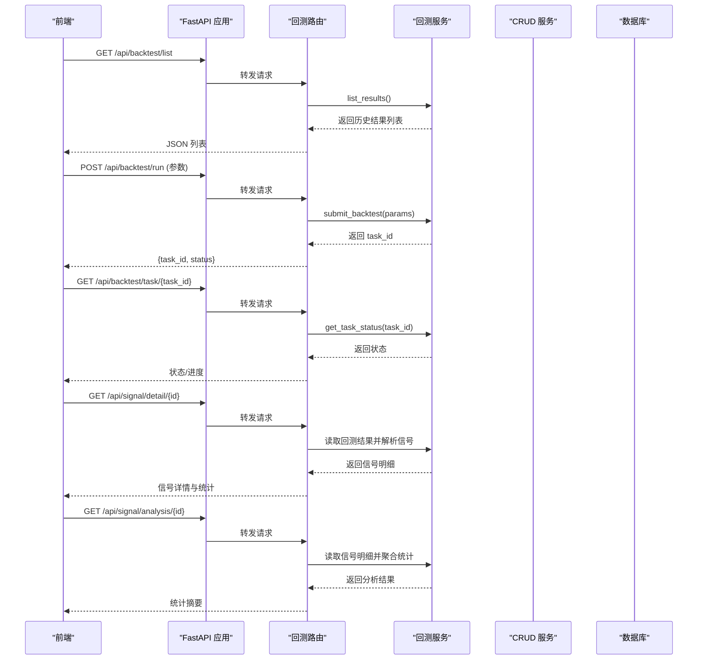
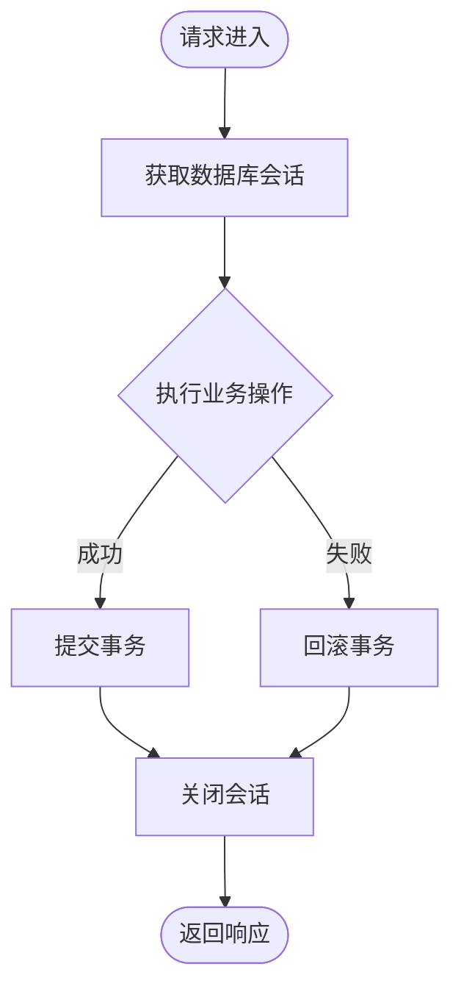
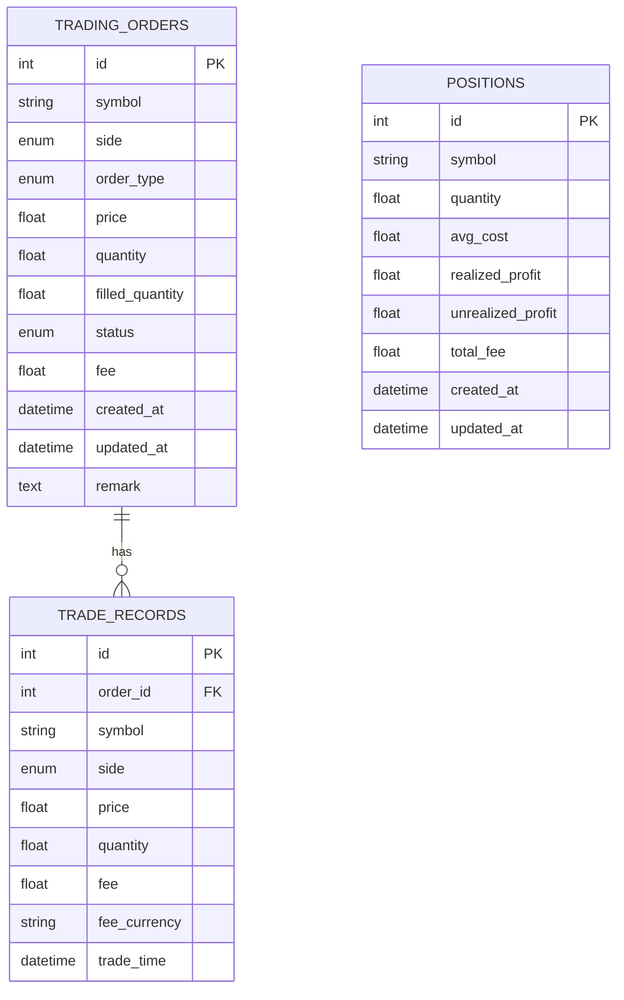
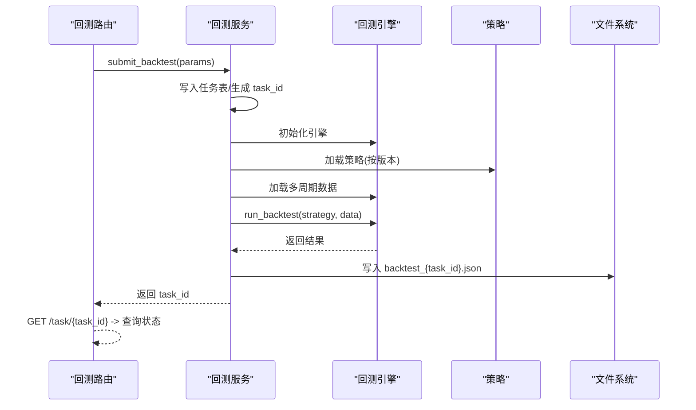
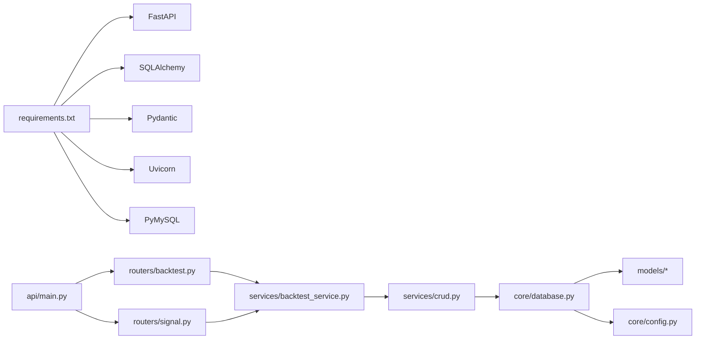

# 后端开发

<cite>
**本文引用的文件**
- [main.py](file://main.py)
- [trading_system/api/main.py](file://trading_system/api/main.py)
- [trading_system/api/routers/backtest.py](file://trading_system/api/routers/backtest.py)
- [trading_system/api/routers/signal.py](file://trading_system/api/routers/signal.py)
- [trading_system/api/services/backtest_service.py](file://trading_system/api/services/backtest_service.py)
- [trading_system/core/database.py](file://trading_system/core/database.py)
- [trading_system/core/config.py](file://trading_system/core/config.py)
- [trading_system/core/schemas.py](file://trading_system/core/schemas.py)
- [trading_system/models/__init__.py](file://trading_system/models/__init__.py)
- [trading_system/models/trading_order.py](file://trading_system/models/trading_order.py)
- [trading_system/models/trade_record.py](file://trading_system/models/trade_record.py)
- [trading_system/models/position.py](file://trading_system/models/position.py)
- [trading_system/services/crud.py](file://trading_system/services/crud.py)
- [log_config.py](file://log_config.py)
- [requirements.txt](file://requirements.txt)
- [frontend/src/api.ts](file://frontend/src/api.ts)
- [README.md](file://README.md)
</cite>

## 目录
1. [简介](#简介)
2. [项目结构](#项目结构)
3. [核心组件](#核心组件)
4. [架构总览](#架构总览)
5. [组件详解](#组件详解)
6. [依赖关系分析](#依赖关系分析)
7. [性能与并发](#性能与并发)
8. [故障排查指南](#故障排查指南)
9. [结论](#结论)
10. [附录](#附录)

## 简介
本指南面向后端开发者，围绕基于 FastAPI 的交易系统后端进行系统化讲解，覆盖 API 路由组织、请求响应与错误处理、数据库连接与 ORM 模型、CRUD 服务层、配置与中间件、安全与日志、以及与前端的数据交互规范。通过代码级图示与最佳实践建议，帮助读者快速理解并高效扩展该系统。

## 项目结构
该项目采用“按功能域分层”的组织方式：FastAPI 应用入口负责中间件、异常处理、健康检查与路由注册；核心层提供配置与数据库连接；模型层定义 ORM 表结构；服务层承载业务逻辑与 CRUD；前端通过统一的 /api 前缀调用后端接口。

图表来源
- [main.py:1-13](file://main.py#L1-L13)
- [trading_system/api/main.py:1-104](file://trading_system/api/main.py#L1-L104)
- [trading_system/api/routers/backtest.py:1-68](file://trading_system/api/routers/backtest.py#L1-L68)
- [trading_system/api/routers/signal.py:1-178](file://trading_system/api/routers/signal.py#L1-L178)
- [trading_system/api/services/backtest_service.py:1-289](file://trading_system/api/services/backtest_service.py#L1-L289)
- [trading_system/services/crud.py:1-137](file://trading_system/services/crud.py#L1-L137)
- [trading_system/core/database.py:1-45](file://trading_system/core/database.py#L1-L45)
- [trading_system/models/__init__.py:1-18](file://trading_system/models/__init__.py#L1-L18)

章节来源
- [README.md:3-40](file://README.md#L3-L40)

## 核心组件
- 应用入口与服务器启动
  - 通过 Uvicorn 在 0.0.0.0:8000 启动 FastAPI 应用，支持静态文件挂载与热重载关闭。
- 中间件与异常处理
  - 全局 CORS 配置允许任意来源访问。
  - HTTP 中间件记录请求处理时间。
  - 全局异常处理器统一返回 JSON 错误响应；HTTPException 单独处理。
- 数据库与会话
  - 基于 SQLAlchemy 2.x，使用配置类注入连接池参数；提供 get_db 依赖注入生成器。
  - 应用启动事件中初始化表结构。
- 核心模型与 Pydantic 模型
  - 订单、成交、持仓三类 ORM 模型；对应 Pydantic 的创建/更新/响应模型。
- 业务服务
  - 回测服务：异步提交任务、多策略执行、结果持久化与任务状态查询。
  - CRUD 服务：订单、成交、持仓的增删改查与资金占用/利润计算。

章节来源
- [main.py:1-13](file://main.py#L1-L13)
- [trading_system/api/main.py:12-104](file://trading_system/api/main.py#L12-L104)
- [trading_system/core/database.py:1-45](file://trading_system/core/database.py#L1-L45)
- [trading_system/core/schemas.py:1-88](file://trading_system/core/schemas.py#L1-L88)
- [trading_system/api/services/backtest_service.py:1-289](file://trading_system/api/services/backtest_service.py#L1-L289)
- [trading_system/services/crud.py:1-137](file://trading_system/services/crud.py#L1-L137)

## 架构总览
下图展示从浏览器到后端 API、服务层与数据库的典型调用链路，以及回测任务的异步执行流程。

图表来源
- [trading_system/api/main.py:95-97](file://trading_system/api/main.py#L95-L97)
- [trading_system/api/routers/backtest.py:27-68](file://trading_system/api/routers/backtest.py#L27-L68)
- [trading_system/api/routers/signal.py:31-178](file://trading_system/api/routers/signal.py#L31-L178)
- [trading_system/api/services/backtest_service.py:20-248](file://trading_system/api/services/backtest_service.py#L20-L248)
- [trading_system/services/crud.py:1-137](file://trading_system/services/crud.py#L1-L137)

## 组件详解

### API 路由组织与请求响应
- 路由前缀与标签
  - 回测路由前缀为 /api/backtest，信号路由前缀为 /api/signal，便于前端统一前缀调用。
- 请求体与查询参数
  - 回测路由使用 Pydantic 模型作为请求体，确保参数校验与文档自动生成。
  - 查询参数用于分页与过滤（如按 symbol）。
- 响应格式
  - 统一返回 JSON；错误通过异常处理器转换为标准错误对象。
- 健康检查
  - /health 接口验证数据库连接，异常时返回 HTTP 503。

章节来源
- [trading_system/api/routers/backtest.py:1-68](file://trading_system/api/routers/backtest.py#L1-L68)
- [trading_system/api/routers/signal.py:1-178](file://trading_system/api/routers/signal.py#L1-L178)
- [trading_system/api/main.py:69-87](file://trading_system/api/main.py#L69-L87)

### 错误管理与异常处理
- 全局异常处理
  - 捕获未预期异常，记录错误日志并返回统一 JSON 错误体。
- HTTPException 处理
  - 将 HTTP 异常转换为带状态码的 JSON 响应，保留原始错误信息。
- 前端错误提示
  - 前端 fetch 对非 ok 的响应抛出异常，便于统一处理。

章节来源
- [trading_system/api/main.py:33-55](file://trading_system/api/main.py#L33-L55)
- [frontend/src/api.ts:3-7](file://frontend/src/api.ts#L3-L7)

### 数据库连接与会话生命周期
- 连接池配置
  - 通过配置类注入 pool_size、max_overflow、pool_timeout、pool_recycle、echo 等参数。
- 会话生成与释放
  - get_db 作为依赖注入，确保每个请求拥有独立会话并在 finally 中关闭。
- 启动事件
  - 应用启动时初始化数据库表结构。

图表来源
- [trading_system/core/database.py:24-34](file://trading_system/core/database.py#L24-L34)
- [trading_system/api/main.py:58-66](file://trading_system/api/main.py#L58-L66)

章节来源
- [trading_system/core/database.py:1-45](file://trading_system/core/database.py#L1-L45)
- [trading_system/core/config.py:1-35](file://trading_system/core/config.py#L1-L35)

### 模型定义与关系
- 订单模型
  - 字段覆盖枚举类型（方向、订单类型、状态），并建立与成交记录的一对多关系。
- 成交记录模型
  - 外键关联订单，记录成交细节与时间戳。
- 持仓模型
  - 记录持有数量、成本均价、已实现/未实现利润与总手续费。
- Pydantic 模型
  - 定义创建、更新、响应三类模型，确保序列化与校验一致性。

图表来源
- [trading_system/models/trading_order.py:26-43](file://trading_system/models/trading_order.py#L26-L43)
- [trading_system/models/trade_record.py:8-22](file://trading_system/models/trade_record.py#L8-L22)
- [trading_system/models/position.py:6-18](file://trading_system/models/position.py#L6-L18)

章节来源
- [trading_system/models/__init__.py:1-18](file://trading_system/models/__init__.py#L1-L18)
- [trading_system/core/schemas.py:1-88](file://trading_system/core/schemas.py#L1-L88)

### CRUD 操作与业务逻辑
- 订单 CRUD
  - 创建、查询单个/列表、条件过滤、更新（部分字段）。
- 成交记录 CRUD
  - 按订单号或币对过滤，支持分页。
- 持仓 CRUD
  - 按 ID 或币对查询，支持批量分页；提供基于交易更新持仓的专用方法。
- 交易驱动的持仓更新
  - 根据买卖方向与成交价格、数量、手续费动态调整成本均价、数量与已实现利润。

章节来源
- [trading_system/services/crud.py:1-137](file://trading_system/services/crud.py#L1-L137)

### 回测服务与任务调度
- 任务提交
  - 生成唯一 task_id，写入内存任务表，启动后台线程执行。
- 策略选择
  - 支持多策略版本（v1/v2/MTF/多指标），按版本加载不同策略与数据。
- 数据准备
  - 可选实时下载历史数据，失败则回退至缓存数据。
- 结果持久化
  - 将回测结果保存为 JSON 文件，便于前端读取与可视化。
- 任务状态查询
  - 返回状态、进度、结果或错误信息。

图表来源
- [trading_system/api/routers/backtest.py:49-62](file://trading_system/api/routers/backtest.py#L49-L62)
- [trading_system/api/services/backtest_service.py:58-248](file://trading_system/api/services/backtest_service.py#L58-L248)

章节来源
- [trading_system/api/services/backtest_service.py:1-289](file://trading_system/api/services/backtest_service.py#L1-L289)

### 信号路由与数据分析
- 信号分类映射
  - 定义信号类型与颜色，便于前端渲染。
- 信号详情
  - 读取回测结果 JSON，解析每笔交易的信号依据，提取指标类别与参考价格。
- 综合分析
  - 统计各类信号出现频次、盈利分布、动作统计等。

章节来源
- [trading_system/api/routers/signal.py:1-178](file://trading_system/api/routers/signal.py#L1-L178)

### 配置管理与日志
- 配置项
  - 数据库连接串、连接池参数、日志级别等。
- 日志
  - 统一日志配置，支持控制台与文件输出，避免重复 handler。

章节来源
- [trading_system/core/config.py:1-35](file://trading_system/core/config.py#L1-L35)
- [log_config.py:1-74](file://log_config.py#L1-L74)

### 前端集成与数据交换
- 前缀与方法
  - 所有 API 以 /api 开头；GET/POST/JSON。
- 类型定义
  - 前端定义回测汇总、详情、交易记录与信号详情的 TypeScript 接口。
- 错误处理
  - fetch 非 ok 抛错，便于统一捕获与提示。

章节来源
- [frontend/src/api.ts:1-51](file://frontend/src/api.ts#L1-L51)

## 依赖关系分析
- 外部依赖
  - FastAPI、SQLAlchemy、Pydantic、Uvicorn、PyMySQL 等。
- 内部模块耦合
  - API 路由依赖服务层；服务层依赖数据库会话与模型；核心配置被数据库与日志模块使用。

图表来源
- [requirements.txt:1-64](file://requirements.txt#L1-L64)
- [trading_system/api/main.py:1-104](file://trading_system/api/main.py#L1-L104)
- [trading_system/api/routers/backtest.py:1-68](file://trading_system/api/routers/backtest.py#L1-L68)
- [trading_system/api/routers/signal.py:1-178](file://trading_system/api/routers/signal.py#L1-L178)
- [trading_system/api/services/backtest_service.py:1-289](file://trading_system/api/services/backtest_service.py#L1-L289)
- [trading_system/services/crud.py:1-137](file://trading_system/services/crud.py#L1-L137)
- [trading_system/core/database.py:1-45](file://trading_system/core/database.py#L1-L45)
- [trading_system/core/config.py:1-35](file://trading_system/core/config.py#L1-L35)

章节来源
- [requirements.txt:1-64](file://requirements.txt#L1-L64)

## 性能与并发
- 数据库连接池
  - 通过配置类参数控制连接数与超时，结合 pool_pre_ping 保持连接有效性。
- 异步回测任务
  - 使用线程池执行耗时回测，不阻塞 API 主循环；任务状态内存存储，适合短期运行场景。
- 建议
  - 生产环境建议替换为进程池或消息队列（如 Celery）以提升稳定性与可观测性。
  - 对高频查询增加索引与分页限制，避免大结果集导致延迟。

章节来源
- [trading_system/core/database.py:12-20](file://trading_system/core/database.py#L12-L20)
- [trading_system/api/services/backtest_service.py:15-17](file://trading_system/api/services/backtest_service.py#L15-L17)

## 故障排查指南
- 健康检查失败
  - 检查数据库连接串与网络连通性；查看启动日志与异常处理器输出。
- 回测任务长时间 pending
  - 查看任务状态与日志；确认数据目录存在且策略参数合法。
- 前端无法访问 API
  - 确认 CORS 设置与 /api 前缀；检查静态文件挂载与路由注册顺序。
- 日志定位
  - 使用统一日志配置，关注 INFO/WARNING/ERROR 级别输出。

章节来源
- [trading_system/api/main.py:75-87](file://trading_system/api/main.py#L75-L87)
- [trading_system/api/services/backtest_service.py:240-244](file://trading_system/api/services/backtest_service.py#L240-L244)
- [log_config.py:11-56](file://log_config.py#L11-L56)

## 结论
本项目以 FastAPI 为核心，结合 SQLAlchemy 与 Pydantic，提供了清晰的分层架构与完善的回测与信号分析能力。通过统一的异常处理、CORS 中间件与健康检查，保证了服务的可用性与可观测性。建议在生产环境中引入更健壮的任务调度与监控体系，并持续优化数据库索引与查询性能。

## 附录
- 快速启动
  - 安装依赖后运行应用入口文件，访问 /docs 查看接口文档。
- 环境变量
  - 参考 README 中的 .env 示例，配置数据库与第三方 API 密钥。

章节来源
- [README.md:75-99](file://README.md#L75-L99)