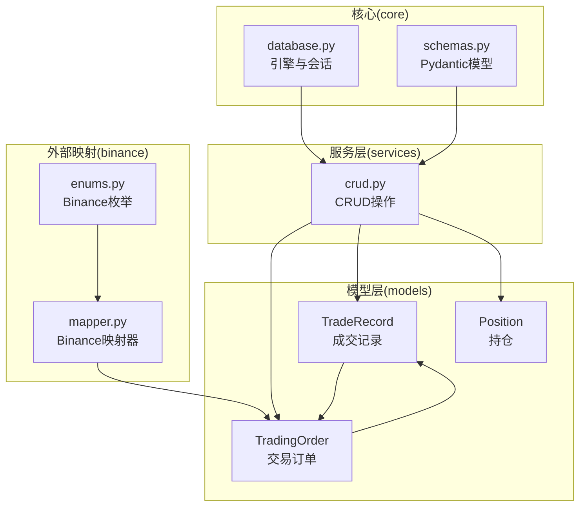
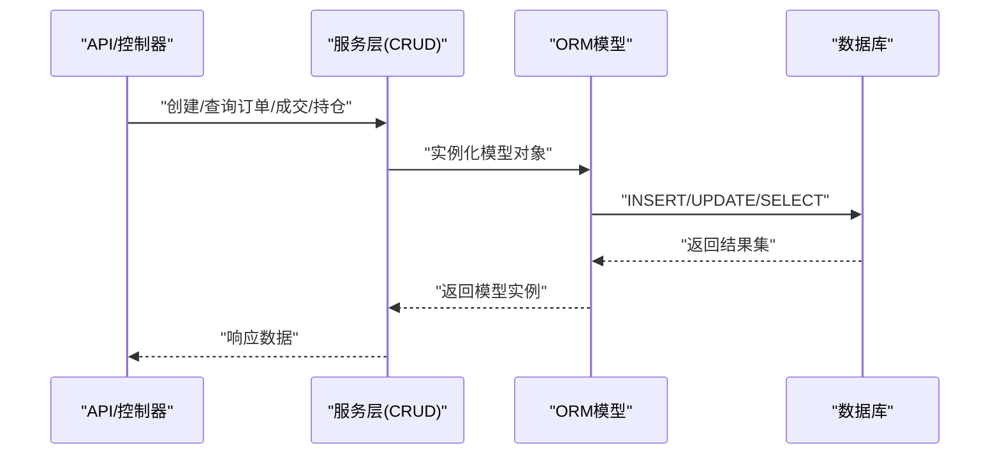
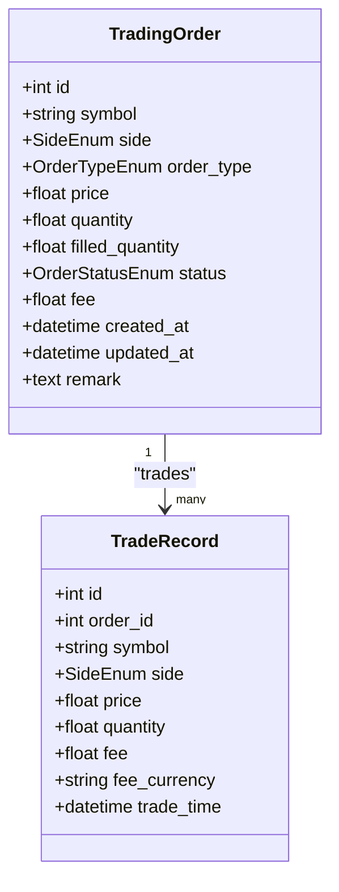
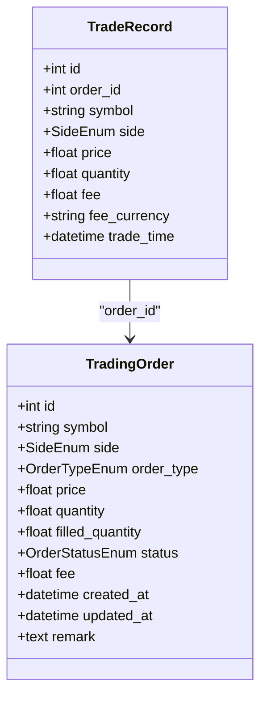
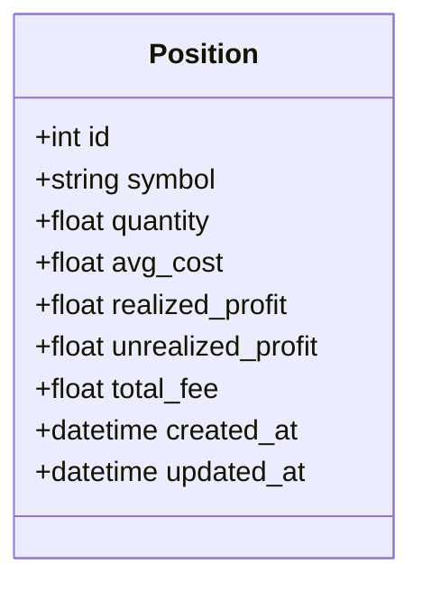
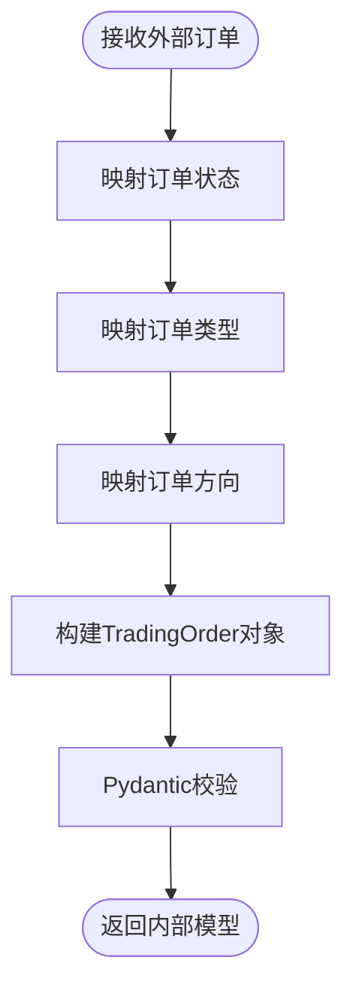
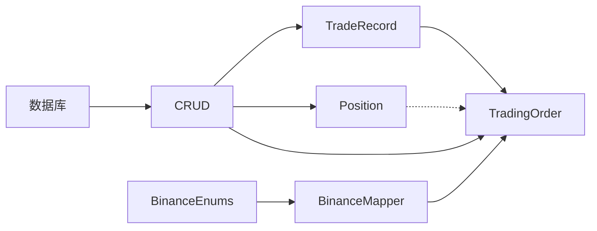

# ORM模型定义

<cite>
**本文引用的文件**
- [trade_record.py](file://trading_system/models/trade_record.py)
- [position.py](file://trading_system/models/position.py)
- [trading_order.py](file://trading_system/models/trading_order.py)
- [database.py](file://trading_system/core/database.py)
- [schemas.py](file://trading_system/core/schemas.py)
- [crud.py](file://trading_system/services/crud.py)
- [mapper.py](file://trading_system/binance/mapper.py)
- [enums.py](file://trading_system/binance/enums.py)
- [__init__.py](file://trading_system/models/__init__.py)
- [main.py](file://main.py)
</cite>

## 目录
1. [简介](#简介)
2. [项目结构](#项目结构)
3. [核心组件](#核心组件)
4. [架构总览](#架构总览)
5. [详细组件分析](#详细组件分析)
6. [依赖分析](#依赖分析)
7. [性能考虑](#性能考虑)
8. [故障排查指南](#故障排查指南)
9. [结论](#结论)
10. [附录](#附录)

## 简介
本指南聚焦于交易系统中的ORM模型定义与使用，围绕以下核心实体展开：交易订单（TradingOrder）、成交记录（TradeRecord）与持仓（Position）。文档将系统性说明：
- 模型字段定义、数据类型与约束
- 模型间关系映射（一对一、一对多、多对多）
- 数据验证与业务约束
- CRUD操作最佳实践
- 查询与数据操作示例路径

## 项目结构
交易系统的ORM层位于 trading_system/models，数据库会话与初始化在 trading_system/core，数据传输对象（Pydantic）在 trading_system/core/schemas，业务层CRUD在 trading_system/services，外部交易所数据映射在 trading_system/binance。

图表来源
- [trade_record.py:1-22](file://trading_system/models/trade_record.py#L1-L22)
- [position.py:1-18](file://trading_system/models/position.py#L1-L18)
- [trading_order.py:1-43](file://trading_system/models/trading_order.py#L1-L43)
- [database.py:1-45](file://trading_system/core/database.py#L1-L45)
- [schemas.py:1-88](file://trading_system/core/schemas.py#L1-L88)
- [crud.py:1-137](file://trading_system/services/crud.py#L1-L137)
- [mapper.py:1-110](file://trading_system/binance/mapper.py#L1-L110)
- [enums.py:1-41](file://trading_system/binance/enums.py#L1-L41)

章节来源
- [database.py:1-45](file://trading_system/core/database.py#L1-L45)
- [__init__.py:1-18](file://trading_system/models/__init__.py#L1-L18)

## 核心组件
本节概述三个核心ORM模型及其职责与关键字段。

- 交易订单（TradingOrder）
  - 负责记录一次委托指令，包含方向、类型、价格、数量、已成交数量、状态、手续费、备注及时间戳。
  - 关系：与成交记录（TradeRecord）为“一对多”关系，通过外键关联。
- 成交记录（TradeRecord）
  - 记录订单执行的具体成交明细，包含成交价格、数量、手续费、币种与成交时间。
  - 关系：与交易订单（TradingOrder）为“多对一”关系。
- 持仓（Position）
  - 维护某一交易标的的总数量、平均成本、已实现盈亏、未实现盈亏、总手续费以及时间戳。
  - 与订单/成交无直接外键关联，通过业务逻辑更新。

章节来源
- [trading_order.py:26-43](file://trading_system/models/trading_order.py#L26-L43)
- [trade_record.py:8-22](file://trading_system/models/trade_record.py#L8-L22)
- [position.py:6-18](file://trading_system/models/position.py#L6-L18)

## 架构总览
下图展示了从API到数据库的典型调用链：请求经由服务层CRUD写入数据库，模型层负责持久化，数据库层负责连接池与会话管理；外部交易所数据通过映射器转换为内部模型。

图表来源
- [crud.py:1-137](file://trading_system/services/crud.py#L1-L137)
- [database.py:24-45](file://trading_system/core/database.py#L24-L45)
- [trade_record.py:8-22](file://trading_system/models/trade_record.py#L8-L22)
- [trading_order.py:26-43](file://trading_system/models/trading_order.py#L26-L43)
- [position.py:6-18](file://trading_system/models/position.py#L6-L18)

## 详细组件分析

### 交易订单（TradingOrder）模型
- 字段与类型
  - 标识与索引：自增主键id；symbol字符串索引
  - 方向与类型：枚举（SideEnum、OrderTypeEnum）
  - 价格与数量：可空或非空的浮点数（市价单价格可为空）
  - 已成交与状态：浮点数与枚举（OrderStatusEnum），默认待生效
  - 手续费与时间戳：浮点数与DateTime，默认当前UTC时间
  - 备注：文本可空
- 关系映射
  - 与TradeRecord为一对多（一个订单可有多笔成交）
- 业务约束
  - 市价单允许price为空；限价单必须有price
  - 状态变更遵循枚举范围
- 使用示例路径
  - 创建：[crud.py:9-16](file://trading_system/services/crud.py#L9-L16)
  - 更新：[crud.py:37-45](file://trading_system/services/crud.py#L37-L45)
  - 查询：[crud.py:19-34](file://trading_system/services/crud.py#L19-L34)

图表来源
- [trading_order.py:26-43](file://trading_system/models/trading_order.py#L26-L43)
- [trade_record.py:8-22](file://trading_system/models/trade_record.py#L8-L22)

章节来源
- [trading_order.py:26-43](file://trading_system/models/trading_order.py#L26-L43)
- [schemas.py:7-35](file://trading_system/core/schemas.py#L7-L35)
- [crud.py:9-45](file://trading_system/services/crud.py#L9-L45)

### 成交记录（TradeRecord）模型
- 字段与类型
  - 主键自增id；order_id外键指向订单表
  - symbol、side、price、quantity均为必填；fee默认0
  - fee_currency可空；trade_time默认当前UTC时间
- 关系映射
  - 与TradingOrder为多对一（多个成交对应一个订单）
- 业务约束
  - 成交必须属于已有订单；成交金额与手续费需与订单方向一致
- 使用示例路径
  - 创建：[crud.py:48-55](file://trading_system/services/crud.py#L48-L55)
  - 查询：[crud.py:58-69](file://trading_system/services/crud.py#L58-L69)

图表来源
- [trade_record.py:8-22](file://trading_system/models/trade_record.py#L8-L22)
- [trading_order.py:26-43](file://trading_system/models/trading_order.py#L26-L43)

章节来源
- [trade_record.py:8-22](file://trading_system/models/trade_record.py#L8-L22)
- [schemas.py:38-57](file://trading_system/core/schemas.py#L38-L57)
- [crud.py:48-69](file://trading_system/services/crud.py#L48-L69)

### 持仓（Position）模型
- 字段与类型
  - 自增主键id；symbol唯一索引
  - 数量、平均成本、已实现/未实现盈亏、总手续费默认0
  - 时间戳created_at与updated_at，默认当前UTC时间，更新时自动刷新
- 关系映射
  - 与订单/成交无直接外键关联，通过业务逻辑维护
- 业务约束
  - 多次买入按加权平均成本计算；卖出若数量不足则拒绝
  - 清仓后平均成本归零
- 使用示例路径
  - 创建/更新：[crud.py:72-100](file://trading_system/services/crud.py#L72-L100)
  - 查询：[crud.py:80-89](file://trading_system/services/crud.py#L80-L89)
  - 基于成交更新：[crud.py:103-136](file://trading_system/services/crud.py#L103-L136)

图表来源
- [position.py:6-18](file://trading_system/models/position.py#L6-L18)

章节来源
- [position.py:6-18](file://trading_system/models/position.py#L6-L18)
- [schemas.py:60-87](file://trading_system/core/schemas.py#L60-L87)
- [crud.py:72-136](file://trading_system/services/crud.py#L72-L136)

### 外部映射与数据验证
- Binance映射器
  - 将外部交易所的状态、类型、方向映射为内部枚举
  - 提供下单参数构造方法，确保与外部API字段一致
- Pydantic数据校验
  - 所有对外接口的数据均通过Pydantic模型进行序列化与反序列化，保证字段类型与默认值一致性

图表来源
- [mapper.py:15-110](file://trading_system/binance/mapper.py#L15-L110)
- [enums.py:1-41](file://trading_system/binance/enums.py#L1-L41)
- [schemas.py:1-88](file://trading_system/core/schemas.py#L1-L88)

章节来源
- [mapper.py:15-110](file://trading_system/binance/mapper.py#L15-L110)
- [enums.py:1-41](file://trading_system/binance/enums.py#L1-L41)
- [schemas.py:1-88](file://trading_system/core/schemas.py#L1-L88)

## 依赖分析
- 模型依赖
  - TradeRecord依赖TradingOrder的外键关联
  - 所有模型共享同一Base元类，统一注册到数据库
- 服务层依赖
  - CRUD层依赖模型与Pydantic Schema
  - 数据库层提供会话工厂与连接池配置
- 外部依赖
  - Binance映射器与枚举用于外部数据适配

图表来源
- [trade_record.py:1-22](file://trading_system/models/trade_record.py#L1-L22)
- [trading_order.py:1-43](file://trading_system/models/trading_order.py#L1-L43)
- [position.py:1-18](file://trading_system/models/position.py#L1-L18)
- [crud.py:1-137](file://trading_system/services/crud.py#L1-L137)
- [database.py:1-45](file://trading_system/core/database.py#L1-L45)
- [mapper.py:1-110](file://trading_system/binance/mapper.py#L1-L110)
- [enums.py:1-41](file://trading_system/binance/enums.py#L1-L41)

章节来源
- [__init__.py:1-18](file://trading_system/models/__init__.py#L1-L18)
- [database.py:1-45](file://trading_system/core/database.py#L1-L45)

## 性能考虑
- 连接池与会话
  - 使用连接池参数控制并发与回收策略，避免长事务占用连接
- 索引设计
  - symbol字段建立索引以提升查询效率
- 写入批量化
  - 对批量导入建议使用事务包裹，减少往返开销
- 查询优化
  - 合理使用分页参数skip/limit，避免全表扫描
- 日志与监控
  - 在关键路径开启调试日志，便于定位慢查询与异常

## 故障排查指南
- 数据库连接失败
  - 检查数据库URL与连接池参数是否正确
  - 确认数据库服务可用且用户权限正常
- 会话生命周期问题
  - 确保每个请求结束后关闭会话，避免资源泄漏
- 外部映射错误
  - 核对映射器中状态/类型/方向的映射表，确保与外部API保持一致
- 数据不一致
  - 持仓更新需基于成交流水，检查update_position_on_trade逻辑分支
- 类型与默认值异常
  - 通过Pydantic Schema确认输入数据的类型与默认值是否符合预期

章节来源
- [database.py:24-45](file://trading_system/core/database.py#L24-L45)
- [crud.py:103-136](file://trading_system/services/crud.py#L103-L136)
- [mapper.py:15-110](file://trading_system/binance/mapper.py#L15-L110)

## 结论
本文档系统梳理了交易系统中订单、成交与持仓三大ORM模型的定义、关系与使用规范，并结合CRUD与外部映射工具给出最佳实践与排错建议。遵循本文档的字段约束、关系映射与业务逻辑，可有效保障数据一致性与系统稳定性。

## 附录
- 快速上手
  - 初始化数据库表：[database.py:37-45](file://trading_system/core/database.py#L37-L45)
  - 获取数据库会话：[database.py:24-34](file://trading_system/core/database.py#L24-L34)
  - 应用入口：[main.py:1-13](file://main.py#L1-L13)
- 常用查询路径
  - 订单列表：[crud.py:24-34](file://trading_system/services/crud.py#L24-L34)
  - 成交列表：[crud.py:62-69](file://trading_system/services/crud.py#L62-L69)
  - 按标的查询持仓：[crud.py:84-85](file://trading_system/services/crud.py#L84-L85)