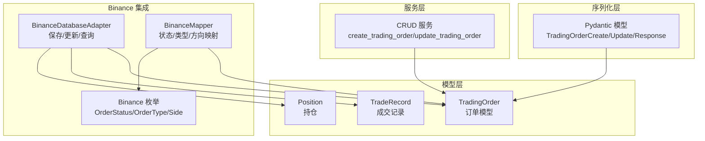
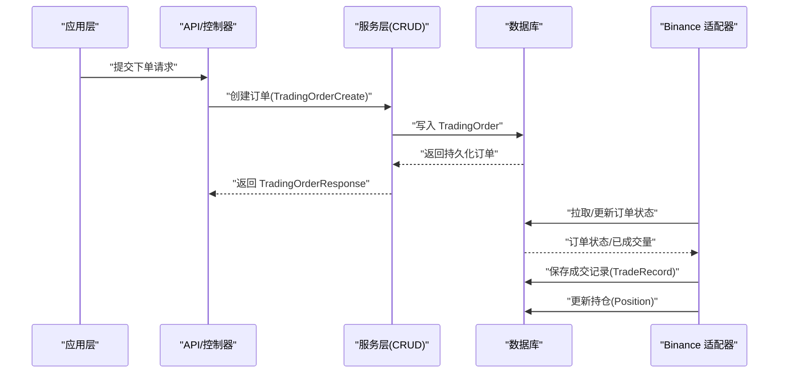
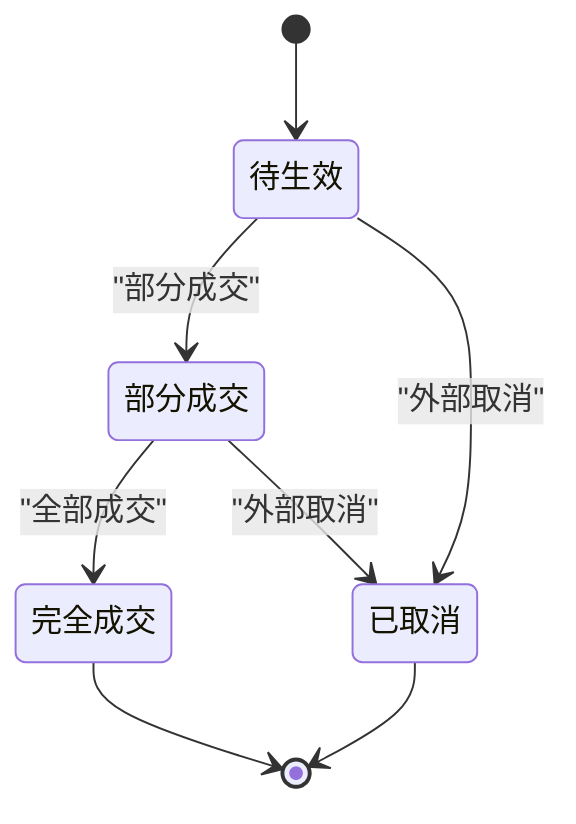
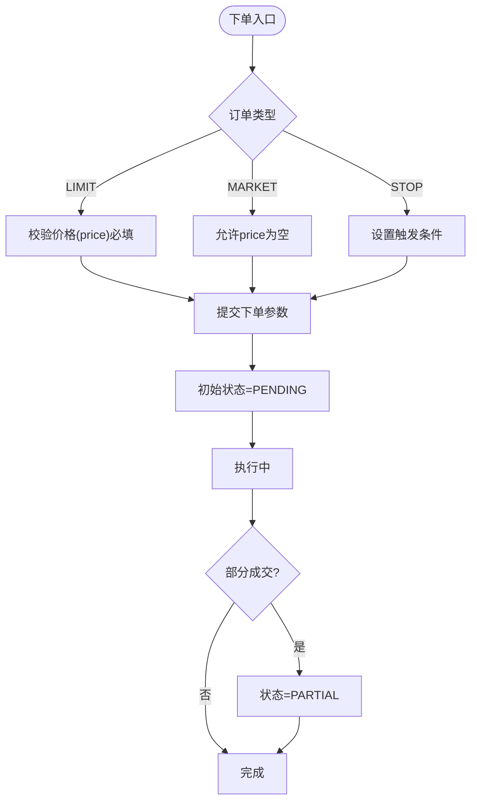
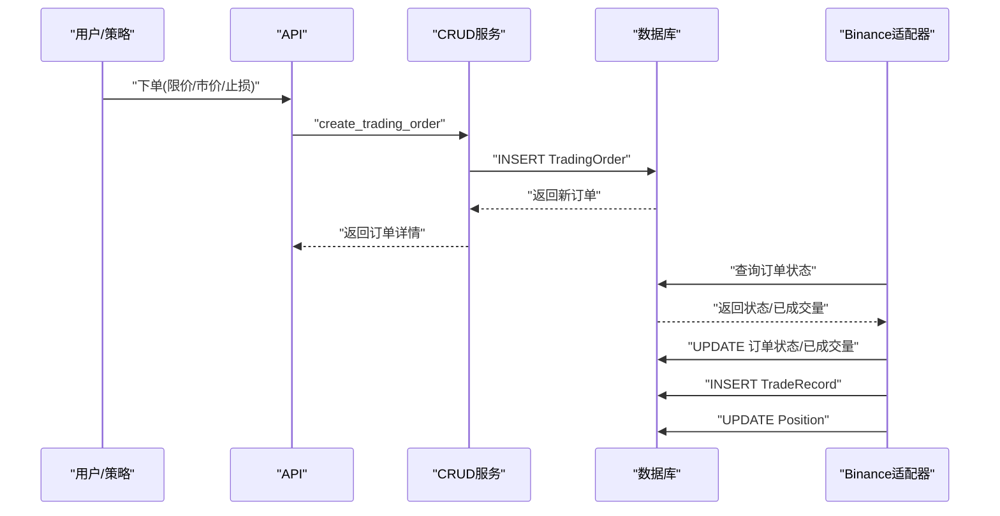
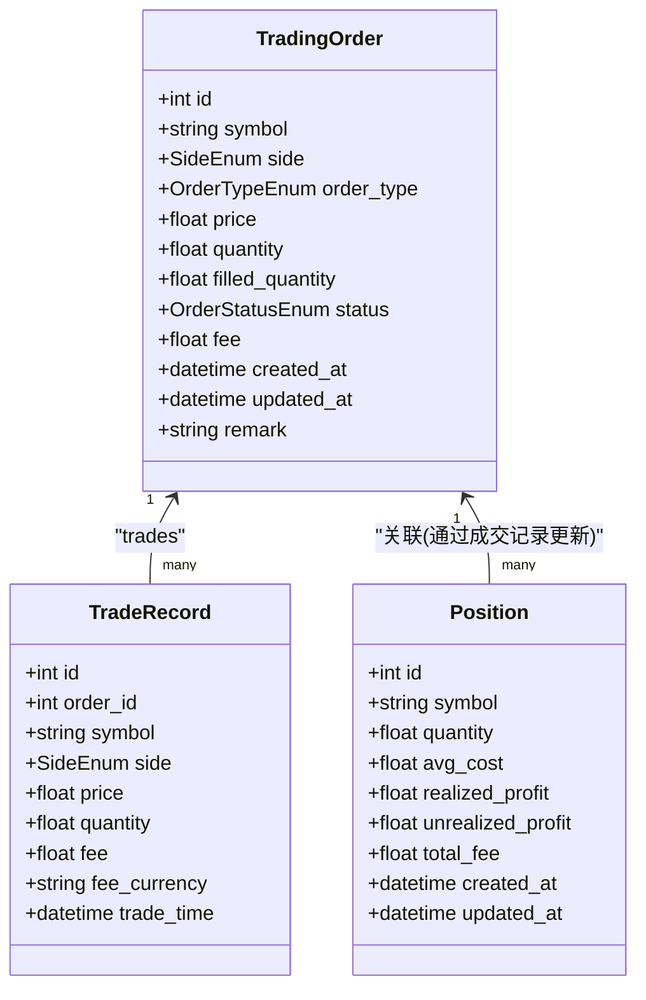
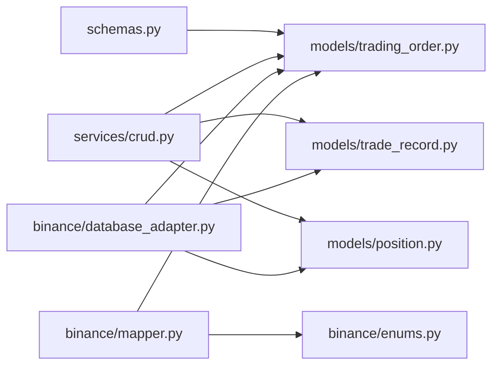

# 交易订单模型

<cite>
**本文引用的文件**
- [trading_order.py](file://trading_system/models/trading_order.py)
- [schemas.py](file://trading_system/core/schemas.py)
- [__init__.py（models）](file://trading_system/models/__init__.py)
- [trade_record.py](file://trading_system/models/trade_record.py)
- [position.py](file://trading_system/models/position.py)
- [crud.py](file://trading_system/services/crud.py)
- [database_adapter.py](file://trading_system/binance/database_adapter.py)
- [mapper.py](file://trading_system/binance/mapper.py)
- [enums.py（binance）](file://trading_system/binance/enums.py)
- [__init__.py（binance）](file://trading_system/binance/__init__.py)
</cite>

## 目录
1. [引言](#引言)
2. [项目结构](#项目结构)
3. [核心组件](#核心组件)
4. [架构总览](#架构总览)
5. [详细组件分析](#详细组件分析)
6. [依赖分析](#依赖分析)
7. [性能考虑](#性能考虑)
8. [故障排查指南](#故障排查指南)
9. [结论](#结论)
10. [附录](#附录)

## 引言
本文件系统性地阐述交易订单模型的完整定义与生命周期管理，重点覆盖 TradingOrder 模型的字段语义、状态转换规则、业务约束，以及与成交记录、持仓、数据库适配器之间的交互关系。同时，文档化了订单状态枚举（OrderStatusEnum）、订单类型枚举（OrderTypeEnum）与方向枚举（SideEnum）的定义与使用方式，并给出订单创建、执行、取消的完整流程示例，涵盖限价单、市价单等不同类型的处理逻辑。

## 项目结构
围绕交易订单模型的相关模块分布如下：
- 数据模型层：定义 TradingOrder、TradeRecord、Position 等实体及其枚举类型
- 核心序列化层：Pydantic 模型用于请求/响应的数据结构
- 服务层：封装 CRUD 操作与业务逻辑
- Binance 集成层：适配器与映射器负责外部交易所数据与本地模型的互转

图表来源
- [trading_order.py:26-43](file://trading_system/models/trading_order.py#L26-L43)
- [schemas.py:7-36](file://trading_system/core/schemas.py#L7-L36)
- [crud.py:9-46](file://trading_system/services/crud.py#L9-L46)
- [database_adapter.py:31-98](file://trading_system/binance/database_adapter.py#L31-L98)
- [mapper.py:15-110](file://trading_system/binance/mapper.py#L15-L110)
- [enums.py:4-41](file://trading_system/binance/enums.py#L4-L41)

章节来源
- [trading_order.py:1-43](file://trading_system/models/trading_order.py#L1-L43)
- [schemas.py:1-88](file://trading_system/core/schemas.py#L1-L88)
- [crud.py:1-137](file://trading_system/services/crud.py#L1-L137)
- [database_adapter.py:1-189](file://trading_system/binance/database_adapter.py#L1-L189)
- [mapper.py:1-110](file://trading_system/binance/mapper.py#L1-L110)
- [enums.py:1-41](file://trading_system/binance/enums.py#L1-L41)

## 核心组件
- 订单模型 TradingOrder：持久化存储订单信息，包含 symbol、side、order_type、price、quantity、filled_quantity、status、fee、remark 等字段，以及 created_at、updated_at 时间戳。
- 订单状态枚举 OrderStatusEnum：PENDING、PARTIAL、FILLED、CANCELLED 四种状态，用于表示订单生命周期中的不同阶段。
- 订单类型枚举 OrderTypeEnum：MARKET、LIMIT、STOP，用于区分市价单、限价单、止损/止盈类订单。
- 方向枚举 SideEnum：BUY、SELL，表示买入或卖出。
- 成交记录 TradeRecord：记录每笔成交的细节，关联到对应订单。
- 持仓 Position：记录标的资产的持有情况，包括数量、平均成本、已实现/未实现盈亏、总手续费等。
- Pydantic 序列化模型：TradingOrderCreate、TradingOrderUpdate、TradingOrderResponse，用于 API 层的数据校验与传输。
- 服务层 CRUD：提供订单创建、查询、更新与成交记录、持仓的维护能力。
- Binance 适配器与映射器：负责从交易所返回的订单数据映射到本地模型，并支持将本地订单映射为下单参数；同时提供数据库层面的保存、更新与查询操作。

章节来源
- [trading_order.py:8-43](file://trading_system/models/trading_order.py#L8-L43)
- [schemas.py:7-36](file://trading_system/core/schemas.py#L7-L36)
- [trade_record.py:8-22](file://trading_system/models/trade_record.py#L8-L22)
- [position.py:6-18](file://trading_system/models/position.py#L6-L18)
- [crud.py:9-137](file://trading_system/services/crud.py#L9-L137)
- [database_adapter.py:31-189](file://trading_system/binance/database_adapter.py#L31-L189)
- [mapper.py:15-110](file://trading_system/binance/mapper.py#L15-L110)

## 架构总览
下图展示了从应用层到数据库层的端到端流程，包括订单创建、状态更新、成交记录生成与持仓更新的协作关系。

图表来源
- [schemas.py:16-36](file://trading_system/core/schemas.py#L16-L36)
- [crud.py:9-46](file://trading_system/services/crud.py#L9-L46)
- [database_adapter.py:31-189](file://trading_system/binance/database_adapter.py#L31-L189)

## 详细组件分析

### TradingOrder 模型与字段语义
- 字段说明
  - id：自增主键
  - symbol：交易对标识，索引字段
  - side：方向（BUY/SELL）
  - order_type：订单类型（MARKET/LIMIT/STOP）
  - price：价格（限价单必填，市价单可为空）
  - quantity：委托数量
  - filled_quantity：已成交数量
  - status：订单状态（默认 PENDING）
  - fee：累计手续费
  - remark：备注
  - created_at/updated_at：时间戳
  - trades：与 TradeRecord 的一对多关系
- 关键业务规则
  - 限价单必须提供 price；市价单 price 可空
  - filled_quantity 必须非负且不超过 quantity
  - status 受生命周期约束，见下一节“状态转换与业务规则”

章节来源
- [trading_order.py:26-43](file://trading_system/models/trading_order.py#L26-L43)

### 订单状态枚举与类型枚举
- OrderStatusEnum
  - PENDING：待生效
  - PARTIAL：部分成交
  - FILLED：完全成交
  - CANCELLED：已取消
- OrderTypeEnum
  - MARKET：市价单
  - LIMIT：限价单
  - STOP：止损/止盈类订单
- SideEnum
  - BUY：买入
  - SELL：卖出

章节来源
- [trading_order.py:8-24](file://trading_system/models/trading_order.py#L8-L24)

### 订单生命周期与状态转换
- 典型转换路径
  - 创建：PENDING
  - 部分成交：PENDING → PARTIAL
  - 完全成交：PARTIAL/FILLED → FILLED
  - 取消：PENDING/PARTIAL → CANCELLED
- 转换约束
  - 状态只能向前推进或回退至已发生状态（例如从 PARTIAL 回退到 PENDING 不符合常规）
  - 当 filled_quantity 达到 quantity 时，状态应为 FILLED
  - 若订单被外部取消，状态应为 CANCELLED
- 外部映射参考（Binance）
  - NEW → PENDING
  - PARTIALLY_FILLED → PARTIAL
  - FILLED → FILLED
  - CANCELED/REJECTED/EXPIRED → CANCELLED

图表来源
- [mapper.py:19-32](file://trading_system/binance/mapper.py#L19-L32)
- [trading_order.py:19-24](file://trading_system/models/trading_order.py#L19-L24)

章节来源
- [mapper.py:19-32](file://trading_system/binance/mapper.py#L19-L32)
- [trading_order.py:19-24](file://trading_system/models/trading_order.py#L19-L24)

### 订单类型与处理逻辑
- 限价单（LIMIT）
  - 必须提供 price；按指定价格或更好价格成交
  - 支持 GTC 等时效策略（由映射器生成下单参数时设置）
- 市价单（MARKET）
  - price 为空；按市场最优价格快速成交
- 止损/止盈（STOP）
  - 通过触发条件触发后续订单（映射器将 STOP_MARKET、TAKE_PROFIT 等归类为 STOP）

图表来源
- [mapper.py:92-110](file://trading_system/binance/mapper.py#L92-L110)
- [trading_order.py:32-36](file://trading_system/models/trading_order.py#L32-L36)

章节来源
- [mapper.py:34-48](file://trading_system/binance/mapper.py#L34-L48)
- [mapper.py:92-110](file://trading_system/binance/mapper.py#L92-L110)
- [trading_order.py:32-36](file://trading_system/models/trading_order.py#L32-L36)

### 订单创建、执行、取消流程
- 订单创建
  - 应用层构造 TradingOrderCreate 并调用 create_trading_order
  - 服务层写入数据库，返回 TradingOrderResponse
- 执行与状态更新
  - 适配器从交易所拉取订单状态，映射为本地状态并更新
  - 若有成交，保存 TradeRecord，并更新 Position
- 取消
  - 外部取消导致状态变为 CANCELLED

图表来源
- [crud.py:9-16](file://trading_system/services/crud.py#L9-L16)
- [database_adapter.py:31-98](file://trading_system/binance/database_adapter.py#L31-L98)

章节来源
- [crud.py:9-46](file://trading_system/services/crud.py#L9-L46)
- [database_adapter.py:31-189](file://trading_system/binance/database_adapter.py#L31-L189)

### 类关系与数据模型

图表来源
- [trading_order.py:26-43](file://trading_system/models/trading_order.py#L26-L43)
- [trade_record.py:8-22](file://trading_system/models/trade_record.py#L8-L22)
- [position.py:6-18](file://trading_system/models/position.py#L6-L18)

章节来源
- [trading_order.py:26-43](file://trading_system/models/trading_order.py#L26-L43)
- [trade_record.py:8-22](file://trading_system/models/trade_record.py#L8-L22)
- [position.py:6-18](file://trading_system/models/position.py#L6-L18)

### 与 Binance 的集成点
- 映射器将交易所状态/类型/方向映射到本地枚举，确保状态一致性
- 适配器负责将本地订单映射为下单参数，或将交易所返回的订单映射为本地模型
- 提供保存订单、更新状态、保存成交记录、更新持仓等操作

章节来源
- [mapper.py:15-110](file://trading_system/binance/mapper.py#L15-L110)
- [database_adapter.py:31-189](file://trading_system/binance/database_adapter.py#L31-L189)
- [enums.py:4-41](file://trading_system/binance/enums.py#L4-L41)
- [__init__.py（binance）:1-21](file://trading_system/binance/__init__.py#L1-L21)

## 依赖分析
- 内聚性
  - 模型层集中定义了订单、成交记录、持仓三者的关系，内聚度高
- 耦合性
  - 服务层与模型层松耦合，通过 Pydantic 模型进行数据传递
  - Binance 适配器与映射器独立于核心模型，便于扩展其他交易所
- 外部依赖
  - 使用 SQLAlchemy 进行 ORM 映射
  - 使用 Pydantic 进行数据校验与序列化
  - 使用日志框架记录关键操作与异常

图表来源
- [schemas.py:4](file://trading_system/core/schemas.py#L4)
- [crud.py:3-4](file://trading_system/services/crud.py#L3-L4)
- [database_adapter.py:6-8](file://trading_system/binance/database_adapter.py#L6-L8)
- [mapper.py:4](file://trading_system/binance/mapper.py#L4)
- [enums.py:1](file://trading_system/binance/enums.py#L1)

章节来源
- [schemas.py:4](file://trading_system/core/schemas.py#L4)
- [crud.py:3-4](file://trading_system/services/crud.py#L3-L4)
- [database_adapter.py:6-8](file://trading_system/binance/database_adapter.py#L6-L8)
- [mapper.py:4](file://trading_system/binance/mapper.py#L4)
- [enums.py:1](file://trading_system/binance/enums.py#L1)

## 性能考虑
- 数据库索引
  - symbol 字段建立索引，有利于按交易对查询订单与成交记录
- 查询优化
  - 分页查询（skip/limit）避免一次性加载大量历史订单
- 日志与事务
  - 适配器在异常时自动回滚，保证数据一致性
- 映射效率
  - 映射器采用静态方法，减少实例化开销

## 故障排查指南
- 订单状态异常
  - 检查 Binance 返回状态是否正确映射到本地状态
  - 确认 filled_quantity 与 quantity 的关系是否满足业务规则
- 下单失败
  - 核对下单参数映射（如 price、timeInForce）是否符合要求
- 成交记录缺失
  - 确认适配器是否正确保存 TradeRecord，并检查外键 order_id
- 持仓不正确
  - 检查成交记录是否正确驱动 Position 更新逻辑

章节来源
- [mapper.py:19-48](file://trading_system/binance/mapper.py#L19-L48)
- [database_adapter.py:99-127](file://trading_system/binance/database_adapter.py#L99-L127)
- [crud.py:103-137](file://trading_system/services/crud.py#L103-L137)

## 结论
本文档系统梳理了交易订单模型的定义、状态机与业务规则，明确了 TradingOrder、TradeRecord、Position 三者的协作关系，并结合 Binance 集成展示了从下单、执行到取消的完整流程。通过 Pydantic 模型与服务层的解耦设计，系统具备良好的可扩展性与可维护性。建议在实际部署中重点关注状态映射的一致性、参数校验的完整性与数据库索引的合理性。

## 附录
- 关键流程路径参考
  - 订单创建：[crud.py:9-16](file://trading_system/services/crud.py#L9-L16)
  - 订单状态更新：[database_adapter.py:76-98](file://trading_system/binance/database_adapter.py#L76-L98)
  - 成交记录保存：[database_adapter.py:99-127](file://trading_system/binance/database_adapter.py#L99-L127)
  - 持仓更新：[crud.py:103-137](file://trading_system/services/crud.py#L103-L137)
  - 状态/类型/方向映射：[mapper.py:19-61](file://trading_system/binance/mapper.py#L19-L61)
  - 下单参数映射：[mapper.py:92-110](file://trading_system/binance/mapper.py#L92-L110)