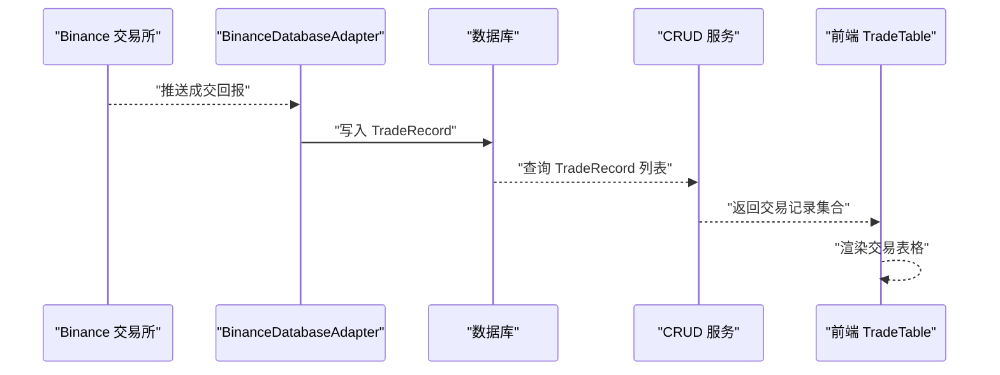
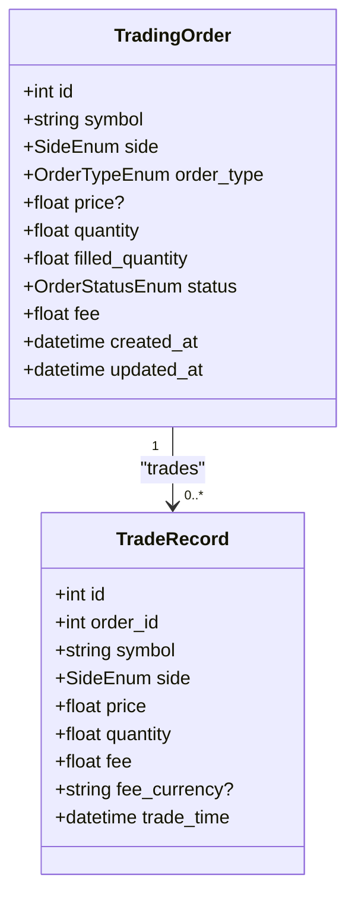
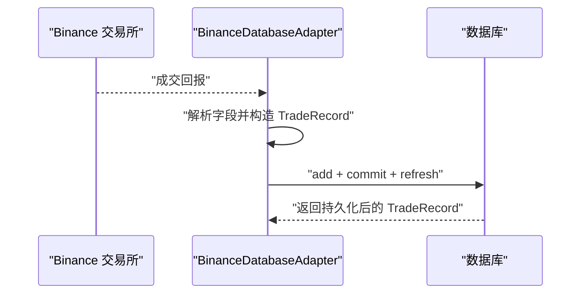
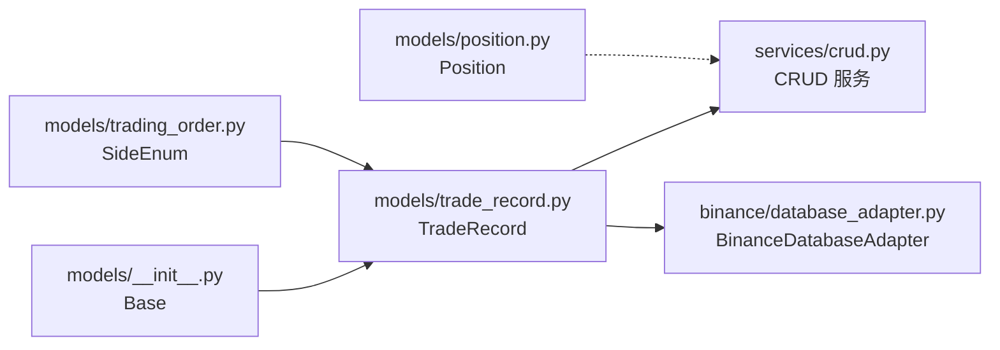

# 交易记录模型

<cite>
**本文引用的文件**
- [trading_system/models/trade_record.py](file://trading_system/models/trade_record.py)
- [trading_system/models/trading_order.py](file://trading_system/models/trading_order.py)
- [trading_system/core/schemas.py](file://trading_system/core/schemas.py)
- [trading_system/services/crud.py](file://trading_system/services/crud.py)
- [trading_system/binance/database_adapter.py](file://trading_system/binance/database_adapter.py)
- [trading_system/models/__init__.py](file://trading_system/models/__init__.py)
- [trading_system/models/position.py](file://trading_system/models/position.py)
- [frontend/src/api.ts](file://frontend/src/api.ts)
- [frontend/src/components/TradeTable.tsx](file://frontend/src/components/TradeTable.tsx)
</cite>

## 目录
1. [简介](#简介)
2. [项目结构](#项目结构)
3. [核心组件](#核心组件)
4. [架构总览](#架构总览)
5. [详细组件分析](#详细组件分析)
6. [依赖关系分析](#依赖关系分析)
7. [性能考虑](#性能考虑)
8. [故障排查指南](#故障排查指南)
9. [结论](#结论)
10. [附录](#附录)

## 简介
本文件围绕交易记录模型 TradeRecord 的完整定义与使用方法进行系统化说明，涵盖字段语义与约束、与订单模型的关联关系、CRUD 操作示例路径、以及在回测与实盘交易中的应用场景。TradeRecord 用于持久化记录每笔成交明细，是回测收益计算与实盘风控的重要数据基础。

## 项目结构
TradeRecord 所属模块与相关组件分布如下：
- 数据模型层：TradeRecord、TradingOrder、Position 定义于 models 子包
- 数据访问层：CRUD 服务封装了 TradeRecord 的增删改查
- 外部对接层：BinanceDatabaseAdapter 负责从交易所拉取成交并写入 TradeRecord
- 前端展示：TradeTable 组件消费后端返回的交易记录集合

```mermaid
graph TB
subgraph "模型层"
TR["TradeRecord<br/>交易记录"]
TO["TradingOrder<br/>订单"]
PO["Position<br/>持仓"]
end
subgraph "服务层"
CRUD["CRUD 服务<br/>create/get/update/delete"]
end
subgraph "外部对接"
BDA["BinanceDatabaseAdapter<br/>Binance 数据适配器"]
end
subgraph "前端"
FE_API["frontend/src/api.ts<br/>接口契约"]
FE_TBL["frontend/src/components/TradeTable.tsx<br/>交易表格"]
end
TO <- --> TR
CRUD --> TR
BDA --> TR
FE_TBL --> FE_API
FE_API --> TR
```

**图示来源**
- [trading_system/models/trade_record.py:8-22](file://trading_system/models/trade_record.py#L8-L22)
- [trading_system/models/trading_order.py:26-43](file://trading_system/models/trading_order.py#L26-L43)
- [trading_system/services/crud.py:48-70](file://trading_system/services/crud.py#L48-L70)
- [trading_system/binance/database_adapter.py:99-126](file://trading_system/binance/database_adapter.py#L99-L126)
- [frontend/src/api.ts:27-33](file://frontend/src/api.ts#L27-L33)
- [frontend/src/components/TradeTable.tsx:17-33](file://frontend/src/components/TradeTable.tsx#L17-L33)

**章节来源**
- [trading_system/models/trade_record.py:8-22](file://trading_system/models/trade_record.py#L8-L22)
- [trading_system/models/trading_order.py:26-43](file://trading_system/models/trading_order.py#L26-L43)
- [trading_system/services/crud.py:48-70](file://trading_system/services/crud.py#L48-L70)
- [trading_system/binance/database_adapter.py:99-126](file://trading_system/binance/database_adapter.py#L99-L126)
- [frontend/src/api.ts:27-33](file://frontend/src/api.ts#L27-L33)
- [frontend/src/components/TradeTable.tsx:17-33](file://frontend/src/components/TradeTable.tsx#L17-L33)

## 核心组件
- TradeRecord：交易记录实体，记录一次成交的关键信息，并与 TradingOrder 建立一对多关系
- TradingOrder：订单实体，包含订单状态、委托类型、方向、数量、已成交数量等
- CRUDBase：封装 TradeRecord 的 CRUD 操作（创建、查询、分页查询）
- BinanceDatabaseAdapter：负责从 Binance 接口拉取成交数据并写入 TradeRecord
- 前端 TradeTable：消费后端返回的交易记录集合，渲染交易明细

**章节来源**
- [trading_system/models/trade_record.py:8-22](file://trading_system/models/trade_record.py#L8-L22)
- [trading_system/models/trading_order.py:26-43](file://trading_system/models/trading_order.py#L26-L43)
- [trading_system/services/crud.py:48-70](file://trading_system/services/crud.py#L48-L70)
- [trading_system/binance/database_adapter.py:99-126](file://trading_system/binance/database_adapter.py#L99-L126)
- [frontend/src/components/TradeTable.tsx:17-33](file://frontend/src/components/TradeTable.tsx#L17-L33)

## 架构总览
TradeRecord 与 TradingOrder 的关系通过外键 order_id 关联，形成“订单-成交”一对多结构。BinanceDatabaseAdapter 将外部交易所的成交回报转换为 TradeRecord 并入库；CRUD 服务提供统一的数据访问能力；前端通过 API 获取交易记录并展示。



**图示来源**
- [trading_system/binance/database_adapter.py:99-126](file://trading_system/binance/database_adapter.py#L99-L126)
- [trading_system/services/crud.py:62-69](file://trading_system/services/crud.py#L62-L69)
- [frontend/src/components/TradeTable.tsx:17-33](file://frontend/src/components/TradeTable.tsx#L17-L33)

## 详细组件分析

### TradeRecord 模型定义与字段说明
- 表名：trade_records
- 主键：id（自增整数）
- 外键：order_id → trading_orders.id（非空）
- 字段：
  - symbol：交易对标识，字符串，长度上限 20，非空，建立索引
  - side：买卖方向，枚举（与 TradingOrder.SideEnum 对齐）
  - price：成交价格，浮点数，非空
  - quantity：成交量，浮点数，非空
  - fee：手续费，浮点数，默认 0.0
  - fee_currency：手续费币种，字符串，可空
  - trade_time：成交时间，DateTime，默认当前 UTC 时间
- 关系：与 TradingOrder 建立 back_populates 的 trades 反向关系

字段约束与业务含义：
- symbol、side、price、quantity 必填，确保每笔成交具备基本要素
- fee 默认 0.0，便于兼容不同手续费统计口径
- fee_currency 可空，用于记录手续费币种（如 USDT、BNB 等）
- trade_time 用于回测按时间序列排序与复盘

**章节来源**
- [trading_system/models/trade_record.py:8-22](file://trading_system/models/trade_record.py#L8-L22)

### 与 TradingOrder 的关系映射与级联
- TradeRecord.order_id 是外键，指向 TradingOrder.id
- TradingOrder.trades 为反向关系，表示一个订单可对应多条成交记录
- 级联行为：模型未显式声明级联删除，因此删除订单不会自动删除其成交记录；若需级联删除，应在关系配置中补充级联参数



**图示来源**
- [trading_system/models/trading_order.py:26-43](file://trading_system/models/trading_order.py#L26-L43)
- [trading_system/models/trade_record.py:8-22](file://trading_system/models/trade_record.py#L8-L22)

**章节来源**
- [trading_system/models/trading_order.py:26-43](file://trading_system/models/trading_order.py#L26-L43)
- [trading_system/models/trade_record.py:8-22](file://trading_system/models/trade_record.py#L8-L22)

### CRUD 操作示例（代码路径）
- 创建交易记录
  - 路径：[trading_system/services/crud.py:create_trade_record:48-55](file://trading_system/services/crud.py#L48-L55)
  - 说明：接收 TradeRecordCreate 模型，实例化 TradeRecord 并提交事务
- 查询单条交易记录
  - 路径：[trading_system/services/crud.py:get_trade_record:58-59](file://trading_system/services/crud.py#L58-L59)
- 查询交易记录列表（支持按 symbol、order_id 分页过滤）
  - 路径：[trading_system/services/crud.py:get_trade_records:62-69](file://trading_system/services/crud.py#L62-L69)
- 更新交易记录
  - 说明：当前 CRUD 中未提供 update_trade_record 方法；如需更新可在现有 update 模式基础上扩展
- 删除交易记录
  - 说明：当前 CRUD 中未提供 delete_trade_record 方法；如需删除可在现有 delete 模式基础上扩展

注意：TradeRecordCreate 定义位于 [trading_system/core/schemas.py:48-49](file://trading_system/core/schemas.py#L48-L49)，包含 order_id、symbol、side、price、quantity、fee、fee_currency 等字段。

**章节来源**
- [trading_system/services/crud.py:48-70](file://trading_system/services/crud.py#L48-L70)
- [trading_system/core/schemas.py:38-58](file://trading_system/core/schemas.py#L38-L58)

### 从 Binance 写入 TradeRecord 的流程
- BinanceDatabaseAdapter.save_trade_record 将交易所返回的成交数据映射为 TradeRecord 并入库
- 关键步骤：设置 order_id、symbol、side、price、quantity、fee、trade_time 等字段，提交事务并刷新



**图示来源**
- [trading_system/binance/database_adapter.py:99-126](file://trading_system/binance/database_adapter.py#L99-L126)

**章节来源**
- [trading_system/binance/database_adapter.py:99-126](file://trading_system/binance/database_adapter.py#L99-L126)

### 与 Position 的联动（开平仓与手续费累计）
- 当发生交易时，可通过 update_position_on_trade 或数据库适配器逻辑更新 Position
- 买入：增加数量与加权平均成本，累计手续费
- 卖出：减少数量，累计已实现盈亏，若清仓则重置平均成本
- 注意：TradeRecord 中的 fee 与 Position 的 total_fee 累计口径可能不同，需在业务层统一

**章节来源**
- [trading_system/services/crud.py:103-136](file://trading_system/services/crud.py#L103-L136)
- [trading_system/models/position.py:6-18](file://trading_system/models/position.py#L6-L18)

### 前端集成与展示
- 前端接口契约定义了 BacktestDetail 中的 trades 字段类型为 TradeRecord[]
- TradeTable 组件消费该数组，按动作类型筛选与展开详情
- 该契约与后端返回的 TradeRecord 结构保持一致，便于回测报告与实盘交易记录的统一展示

**章节来源**
- [frontend/src/api.ts:17-33](file://frontend/src/api.ts#L17-L33)
- [frontend/src/components/TradeTable.tsx:17-33](file://frontend/src/components/TradeTable.tsx#L17-L33)

## 依赖关系分析
- TradeRecord 依赖：
  - SQLAlchemy 基类 Base（由 models/__init__.py 导出）
  - SideEnum（来自 trading_order.py）
  - 外键关联 TradingOrder
- CRUD 服务依赖 TradeRecord、TradeRecordCreate 与 SQLAlchemy Session
- BinanceDatabaseAdapter 依赖 TradeRecord、Position 与 BinanceMapper



**图示来源**
- [trading_system/models/__init__.py:1-18](file://trading_system/models/__init__.py#L1-L18)
- [trading_system/models/trade_record.py:1-6](file://trading_system/models/trade_record.py#L1-L6)
- [trading_system/models/trading_order.py:14-16](file://trading_system/models/trading_order.py#L14-L16)
- [trading_system/services/crud.py:3-5](file://trading_system/services/crud.py#L3-L5)
- [trading_system/binance/database_adapter.py:4-8](file://trading_system/binance/database_adapter.py#L4-L8)
- [trading_system/models/position.py:1-4](file://trading_system/models/position.py#L1-L4)

**章节来源**
- [trading_system/models/__init__.py:1-18](file://trading_system/models/__init__.py#L1-L18)
- [trading_system/models/trade_record.py:1-6](file://trading_system/models/trade_record.py#L1-L6)
- [trading_system/models/trading_order.py:14-16](file://trading_system/models/trading_order.py#L14-L16)
- [trading_system/services/crud.py:3-5](file://trading_system/services/crud.py#L3-L5)
- [trading_system/binance/database_adapter.py:4-8](file://trading_system/binance/database_adapter.py#L4-L8)
- [trading_system/models/position.py:1-4](file://trading_system/models/position.py#L1-L4)

## 性能考虑
- 索引优化：symbol 建有索引，适合按交易对快速检索；建议在高频查询场景下结合 order_id 与 trade_time 建复合索引
- 批量写入：BinanceDatabaseAdapter 逐条写入 TradeRecord，若吞吐量较大可考虑批量 flush 与事务合并
- 查询分页：get_trade_records 支持 skip/limit，建议前端分页加载与后端分页查询配合
- 关系查询：back_populates 的 trades 反向关系在读取订单时可直接访问其成交列表，避免额外 JOIN

[本节为通用性能建议，不直接分析具体文件]

## 故障排查指南
- 写入失败：检查 BinanceDatabaseAdapter.save_trade_record 的异常处理与事务回滚逻辑
  - 参考路径：[trading_system/binance/database_adapter.py:123-126](file://trading_system/binance/database_adapter.py#L123-L126)
- 查询为空：确认查询参数（symbol、order_id）是否正确；核对索引与数据是否匹配
  - 参考路径：[trading_system/services/crud.py:62-69](file://trading_system/services/crud.py#L62-L69)
- 字段缺失或类型错误：核对 TradeRecordCreate 与 TradeRecord 字段定义
  - 参考路径：[trading_system/core/schemas.py:38-58](file://trading_system/core/schemas.py#L38-L58)、[trading_system/models/trade_record.py:8-22](file://trading_system/models/trade_record.py#L8-L22)
- 级联删除问题：若需删除订单同时删除其成交记录，请在关系配置中添加级联参数
  - 参考路径：[trading_system/models/trading_order.py:42](file://trading_system/models/trading_order.py#L42)、[trading_system/models/trade_record.py:12](file://trading_system/models/trade_record.py#L12)

**章节来源**
- [trading_system/binance/database_adapter.py:123-126](file://trading_system/binance/database_adapter.py#L123-L126)
- [trading_system/services/crud.py:62-69](file://trading_system/services/crud.py#L62-L69)
- [trading_system/core/schemas.py:38-58](file://trading_system/core/schemas.py#L38-L58)
- [trading_system/models/trade_record.py:8-22](file://trading_system/models/trade_record.py#L8-L22)
- [trading_system/models/trading_order.py:42](file://trading_system/models/trading_order.py#L42)

## 结论
TradeRecord 作为交易系统的核心数据模型之一，承担着记录每笔成交的职责。通过与 TradingOrder 的外键关联、与 Position 的联动更新，以及 BinanceDatabaseAdapter 的数据接入，TradeRecord 为回测收益计算与实盘风控提供了可靠的数据基础。建议在生产环境中完善 CRUD 的更新与删除能力，并根据查询热点优化索引与分页策略。

[本节为总结性内容，不直接分析具体文件]

## 附录

### 字段约束与默认值一览
- TradeRecord
  - id：主键，自增
  - order_id：外键，非空
  - symbol：字符串，长度 20，非空，带索引
  - side：枚举，非空
  - price：浮点数，非空
  - quantity：浮点数，非空
  - fee：浮点数，默认 0.0
  - fee_currency：字符串，可空
  - trade_time：时间戳，默认当前 UTC

**章节来源**
- [trading_system/models/trade_record.py:8-22](file://trading_system/models/trade_record.py#L8-L22)

### 与订单关系的级联建议
- 若希望删除订单时自动删除其成交记录，可在关系配置中添加级联参数
  - 参考路径：[trading_system/models/trading_order.py:42](file://trading_system/models/trading_order.py#L42)、[trading_system/models/trade_record.py:12](file://trading_system/models/trade_record.py#L12)

**章节来源**
- [trading_system/models/trading_order.py:42](file://trading_system/models/trading_order.py#L42)
- [trading_system/models/trade_record.py:12](file://trading_system/models/trade_record.py#L12)

### 应用场景
- 回测：TradeRecord 作为回测引擎的输入数据源，用于计算净值曲线、胜率、最大回撤等指标
- 实盘交易：TradeRecord 与 Position 联动，支撑实时风控与账户损益统计

[本节为概念性说明，不直接分析具体文件]