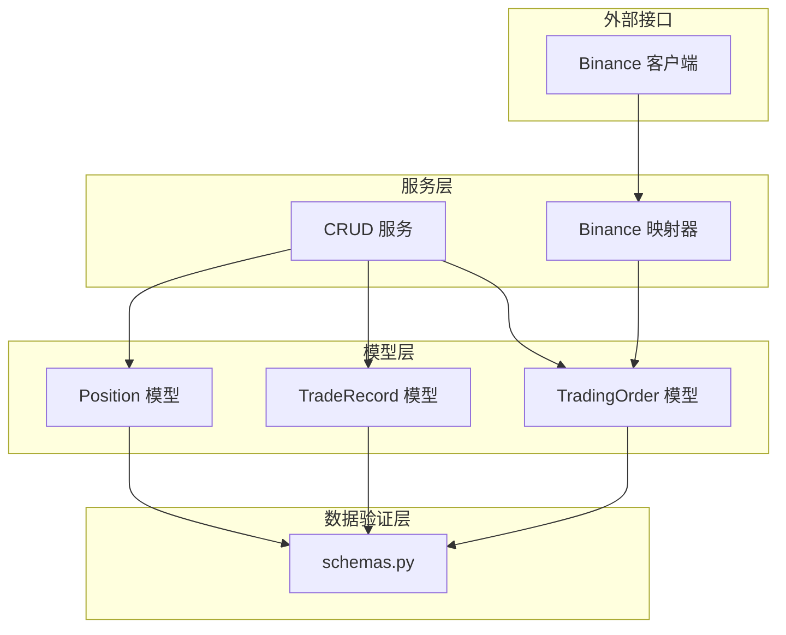
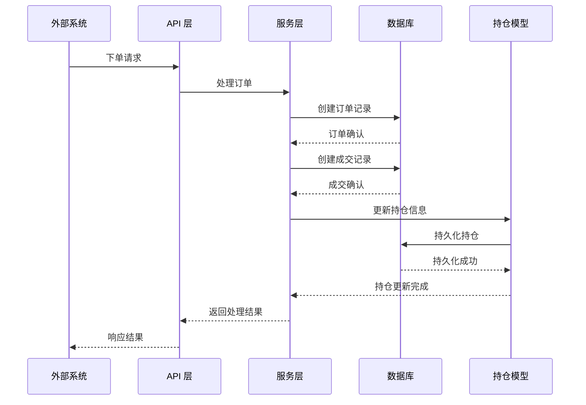
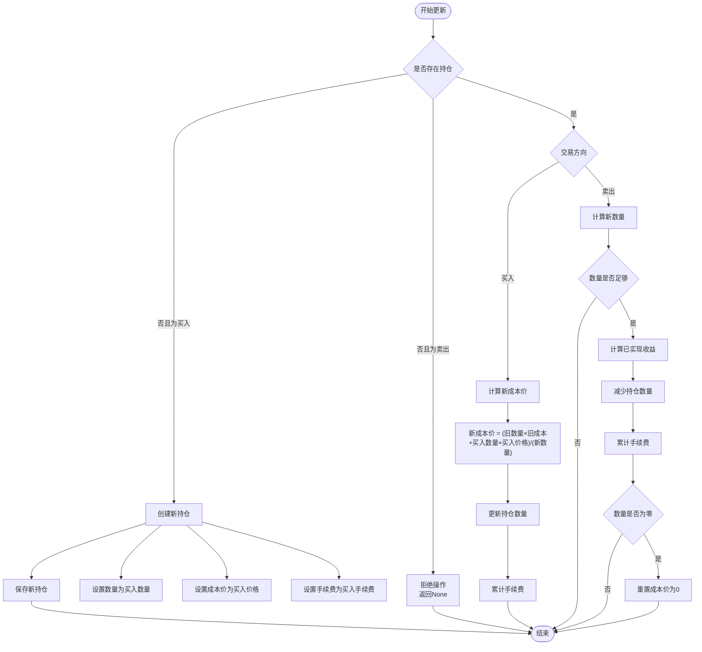
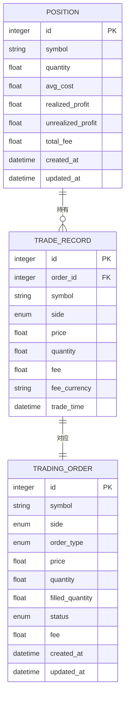
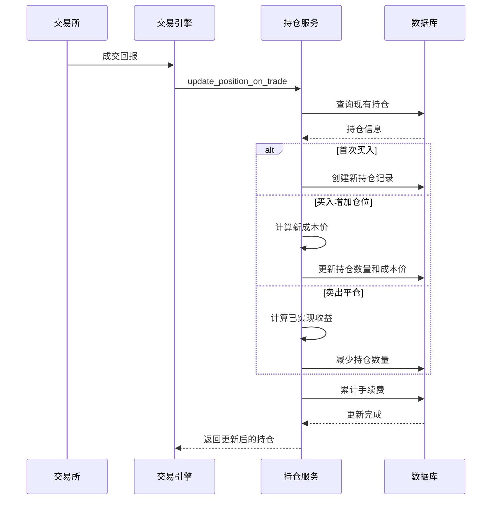
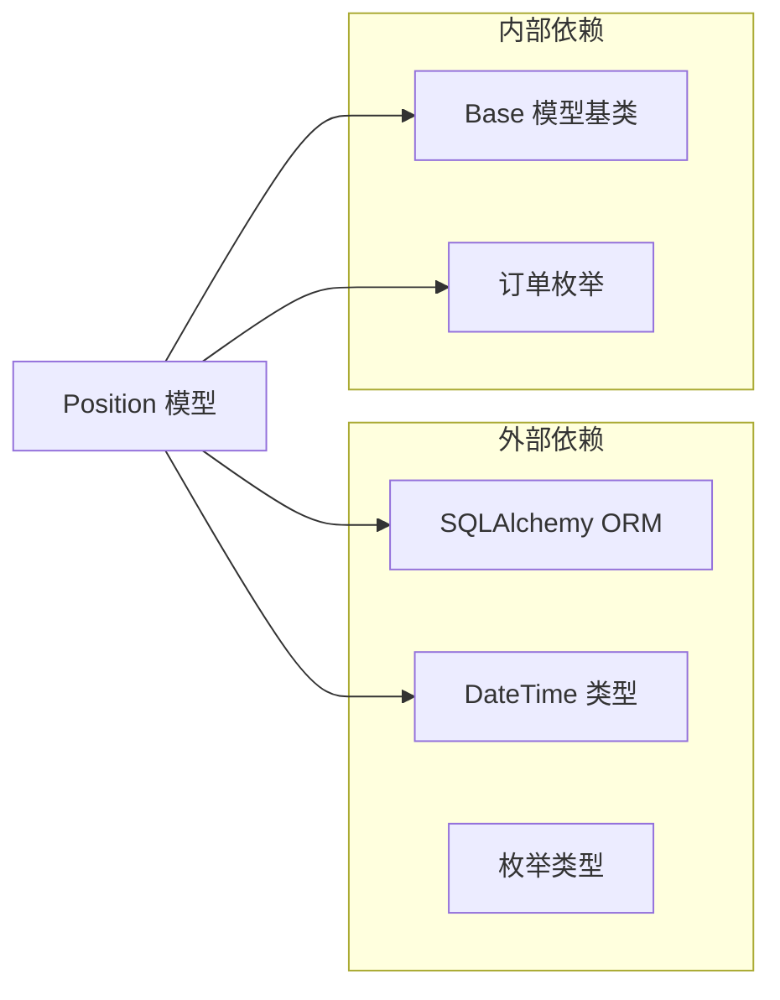
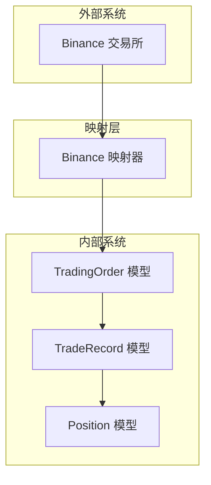

# 持仓模型

<cite>
**本文档引用的文件**
- [position.py](file://trading_system/models/position.py)
- [schemas.py](file://trading_system/core/schemas.py)
- [crud.py](file://trading_system/services/crud.py)
- [trade_record.py](file://trading_system/models/trade_record.py)
- [trading_order.py](file://trading_system/models/trading_order.py)
- [client.py](file://trading_system/binance/client.py)
- [mapper.py](file://trading_system/binance/mapper.py)
- [main.py](file://main.py)
</cite>

## 目录
1. [简介](#简介)
2. [项目结构](#项目结构)
3. [核心组件](#核心组件)
4. [架构概览](#架构概览)
5. [详细组件分析](#详细组件分析)
6. [依赖关系分析](#依赖关系分析)
7. [性能考虑](#性能考虑)
8. [故障排除指南](#故障排除指南)
9. [结论](#结论)

## 简介

本文档详细阐述了交易系统中的持仓模型（Position Model），这是一个核心的数据模型，用于跟踪和管理用户的交易头寸。该模型实现了完整的持仓生命周期管理，包括成本均价计算、盈亏统计、费用累计和动态更新机制。

持仓模型在交易系统中扮演着至关重要的角色，它不仅记录了用户持有的资产数量，还维护了历史成本、已实现收益、未实现收益以及总手续费等关键财务指标。通过精确的成本均价计算和实时的盈亏统计，为风险管理、绩效评估和决策支持提供了可靠的数据基础。

## 项目结构

交易系统的持仓模型位于以下核心模块中：

**图表来源**
- [position.py:1-18](file://trading_system/models/position.py#L1-L18)
- [schemas.py:60-88](file://trading_system/core/schemas.py#L60-L88)
- [crud.py:103-137](file://trading_system/services/crud.py#L103-L137)

**章节来源**
- [position.py:1-18](file://trading_system/models/position.py#L1-L18)
- [schemas.py:1-88](file://trading_system/core/schemas.py#L1-L88)
- [crud.py:1-137](file://trading_system/services/crud.py#L1-L137)

## 核心组件

### Position 模型定义

Position 模型是整个持仓管理系统的基石，采用 SQLAlchemy ORM 映射到数据库表。该模型包含了完整的持仓信息和财务指标。

#### 字段定义与业务含义

| 字段名 | 数据类型 | 默认值 | 业务含义 | 计算方式 |
|--------|----------|--------|----------|----------|
| id | Integer | 自增 | 唯一标识符 | 数据库自动生成 |
| symbol | String(20) | - | 交易对标识 | 交易对代码（如 BTCUSDT） |
| quantity | Float | 0.0 | 持仓数量 | 实时更新，支持正负数 |
| avg_cost | Float | 0.0 | 成本均价 | 加权平均计算 |
| realized_profit | Float | 0.0 | 已实现收益 | 卖出时计算 |
| unrealized_profit | Float | 0.0 | 未实现收益 | 持仓期间浮动盈亏 |
| total_fee | Float | 0.0 | 总手续费 | 累计所有交易费用 |
| created_at | DateTime | UTC时间 | 创建时间 | 数据库自动记录 |
| updated_at | DateTime | UTC时间 | 更新时间 | 数据库自动更新 |

#### 关键业务逻辑

1. **成本均价计算**：采用加权平均法，确保每次交易后成本价的准确性
2. **盈亏统计**：区分已实现和未实现收益，提供完整的收益分析
3. **费用管理**：累计所有交易产生的手续费，影响净收益计算
4. **多币种支持**：通过 symbol 字段支持不同交易对的独立持仓管理

**章节来源**
- [position.py:6-17](file://trading_system/models/position.py#L6-L17)
- [schemas.py:60-87](file://trading_system/core/schemas.py#L60-L87)

## 架构概览

持仓模型在整个交易系统中处于核心地位，连接着订单执行、成交记录和市场数据等多个层面：

**图表来源**
- [crud.py:103-137](file://trading_system/services/crud.py#L103-L137)
- [trade_record.py:8-22](file://trading_system/models/trade_record.py#L8-L22)
- [trading_order.py:26-43](file://trading_system/models/trading_order.py#L26-L43)

## 详细组件分析

### 持仓更新机制

持仓模型的核心功能是动态更新机制，该机制确保持仓信息能够实时反映交易活动的影响。

#### 成本均价计算算法

成本均价的计算遵循严格的数学公式，确保每次交易后成本价的准确性：

**图表来源**
- [crud.py:103-137](file://trading_system/services/crud.py#L103-L137)

#### 盈亏统计机制

系统实现了完整的盈亏统计体系，包括已实现收益和未实现收益的分别计算：

1. **已实现收益**：仅在卖出时计算，公式为 `(卖出价格 - 持仓成本价) × 卖出数量`
2. **未实现收益**：实时计算，反映当前市场价格变动的影响
3. **总手续费**：累计所有交易产生的费用，影响最终净收益

**章节来源**
- [crud.py:103-137](file://trading_system/services/crud.py#L103-L137)

### 数据模型关系

持仓模型与其他核心数据模型之间存在紧密的关联关系：

**图表来源**
- [position.py:6-17](file://trading_system/models/position.py#L6-L17)
- [trade_record.py:8-22](file://trading_system/models/trade_record.py#L8-L22)
- [trading_order.py:26-43](file://trading_system/models/trading_order.py#L26-L43)

**章节来源**
- [position.py:1-18](file://trading_system/models/position.py#L1-L18)
- [trade_record.py:1-22](file://trading_system/models/trade_record.py#L1-L22)
- [trading_order.py:1-43](file://trading_system/models/trading_order.py#L1-L43)

### API 接口设计

系统提供了完整的 API 接口来管理持仓信息：

#### 基础 CRUD 操作

| 操作类型 | 方法名 | 功能描述 | 请求参数 | 返回值 |
|----------|--------|----------|----------|--------|
| 创建 | create_position | 创建新持仓 | PositionCreate | Position |
| 读取 | get_position | 获取指定持仓 | position_id | Position 或 None |
| 读取 | get_position_by_symbol | 按交易对查询 | symbol | Position 或 None |
| 读取 | get_positions | 获取持仓列表 | skip, limit | List[Position] |
| 更新 | update_position | 更新持仓信息 | position_id, PositionUpdate | Position 或 None |
| 更新 | update_position_on_trade | 交易驱动的持仓更新 | symbol, side, price, quantity, fee | Position 或 None |

#### 交易驱动的持仓更新

系统特别优化了交易过程中的持仓更新流程，通过专门的方法处理买卖操作：

**图表来源**
- [crud.py:103-137](file://trading_system/services/crud.py#L103-L137)

**章节来源**
- [crud.py:72-101](file://trading_system/services/crud.py#L72-L101)
- [crud.py:103-137](file://trading_system/services/crud.py#L103-L137)

### 多币种持仓管理

系统支持多币种交易对的独立持仓管理，通过 symbol 字段实现：

#### 支持的交易对示例

| 交易对 | 描述 | 币种组合 |
|--------|------|----------|
| BTCUSDT | 比特币/美元 | 数字货币/法定货币 |
| ETHUSDT | 以太坊/美元 | 数字货币/法定货币 |
| BTCUSDC | 比特币/稳定币 | 数字货币/稳定币 |
| ETHBUSD | 以太坊/稳定币 | 数字货币/稳定币 |

#### 风险控制应用场景

1. **仓位限制**：根据交易对设置最大持仓限额
2. **保证金管理**：针对期货交易的保证金要求
3. **止损止盈**：基于持仓成本价的自动风控
4. **流动性监控**：不同交易对的流动性风险评估

**章节来源**
- [position.py:10](file://trading_system/models/position.py#L10)
- [schemas.py:60](file://trading_system/core/schemas.py#L60)

## 依赖关系分析

持仓模型的依赖关系相对简单，主要依赖于 SQLAlchemy ORM 和相关的枚举类型：

**图表来源**
- [position.py:1-3](file://trading_system/models/position.py#L1-L3)

### 外部集成点

系统通过 Binance 客户端进行外部数据集成：

**图表来源**
- [client.py:140-159](file://trading_system/binance/client.py#L140-L159)
- [mapper.py:63-90](file://trading_system/binance/mapper.py#L63-L90)

**章节来源**
- [client.py:1-342](file://trading_system/binance/client.py#L1-L342)
- [mapper.py:1-110](file://trading_system/binance/mapper.py#L1-L110)

## 性能考虑

### 数据库优化

1. **索引策略**：symbol 字段建立索引以加速按交易对查询
2. **批量操作**：支持批量查询和更新操作
3. **缓存机制**：可以考虑添加内存缓存以减少数据库访问

### 内存管理

1. **对象生命周期**：合理管理 SQLAlchemy 会话和对象生命周期
2. **事务处理**：使用事务确保数据一致性
3. **连接池**：配置合适的数据库连接池大小

### 扩展性设计

1. **分表策略**：支持按时间或交易对进行分表
2. **异步处理**：可以考虑异步更新机制
3. **分布式部署**：支持多实例部署和数据同步

## 故障排除指南

### 常见问题及解决方案

1. **持仓更新失败**
   - 检查数据库连接状态
   - 验证交易记录的完整性
   - 确认权限设置正确

2. **成本均价异常**
   - 检查历史交易记录
   - 验证计算精度问题
   - 确认交易方向识别正确

3. **并发更新冲突**
   - 使用数据库锁机制
   - 实施乐观锁策略
   - 重试机制实现

### 监控和日志

系统提供了完善的日志记录机制，便于问题诊断和性能监控：

- **调试日志**：详细的处理流程记录
- **错误日志**：异常情况的完整堆栈信息
- **性能日志**：关键操作的执行时间和资源使用

**章节来源**
- [crud.py:1-6](file://trading_system/services/crud.py#L1-L6)

## 结论

持仓模型作为交易系统的核心组件，实现了完整的持仓生命周期管理。通过精确的成本均价计算、实时的盈亏统计和全面的费用管理，为用户提供了一个可靠的交易资产管理平台。

该模型的设计充分考虑了扩展性和性能需求，支持多币种交易对管理，并提供了完善的风险控制机制。通过标准化的 API 接口和清晰的业务逻辑，使得系统能够适应不同的交易策略和风险管理需求。

未来可以在以下方面进一步优化：
1. 添加更丰富的风险指标计算
2. 实现更灵活的费用分摊机制
3. 增强多账户和多策略的支持
4. 优化大数据量下的查询性能