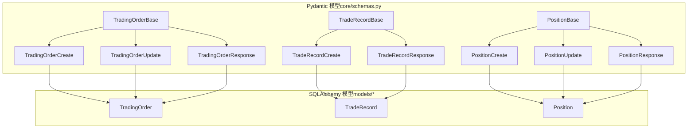
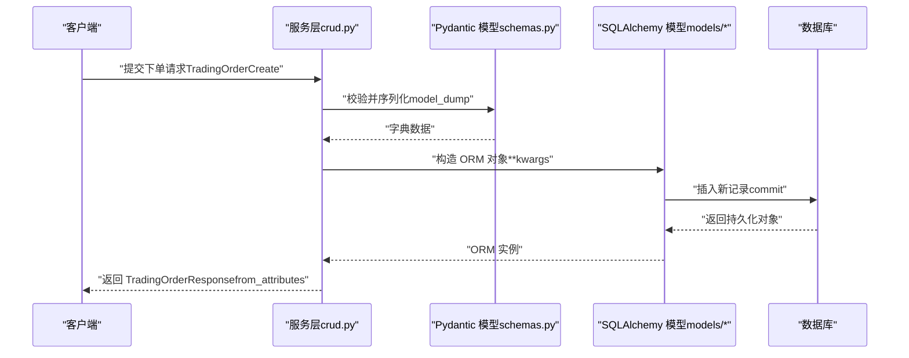
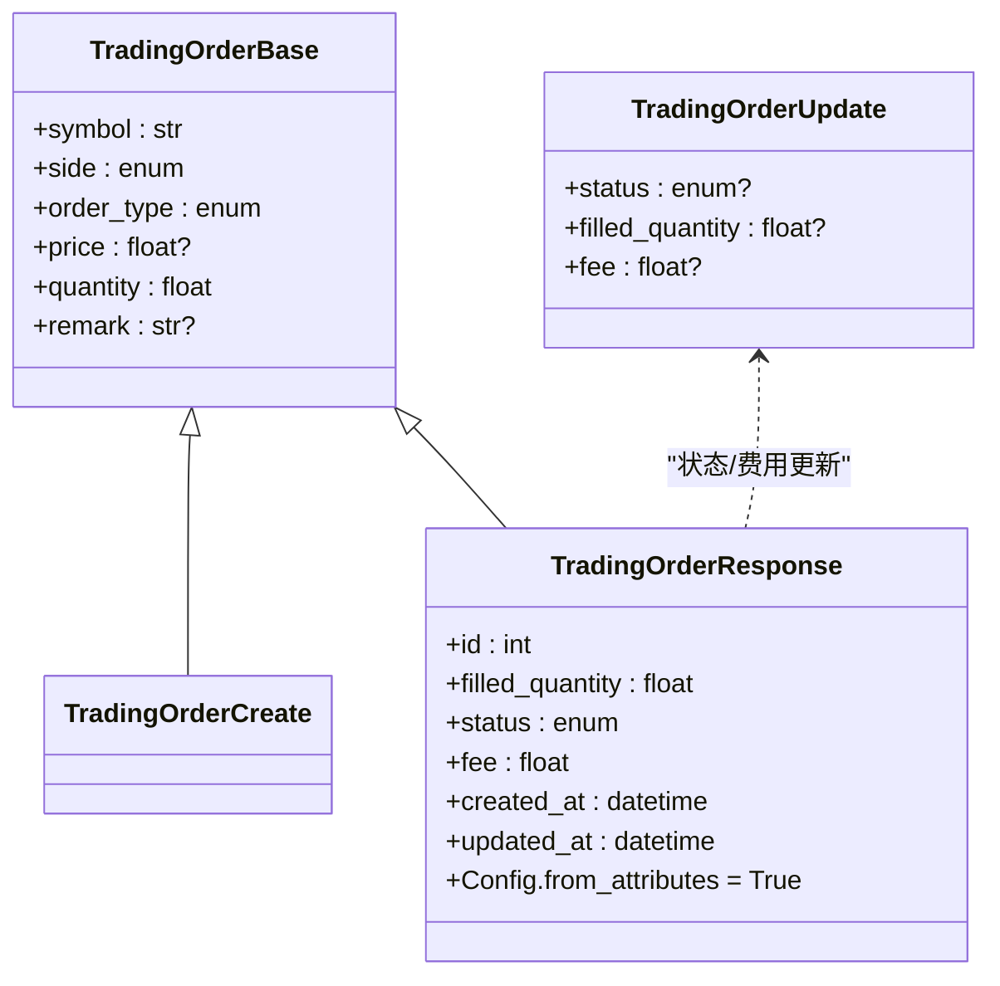
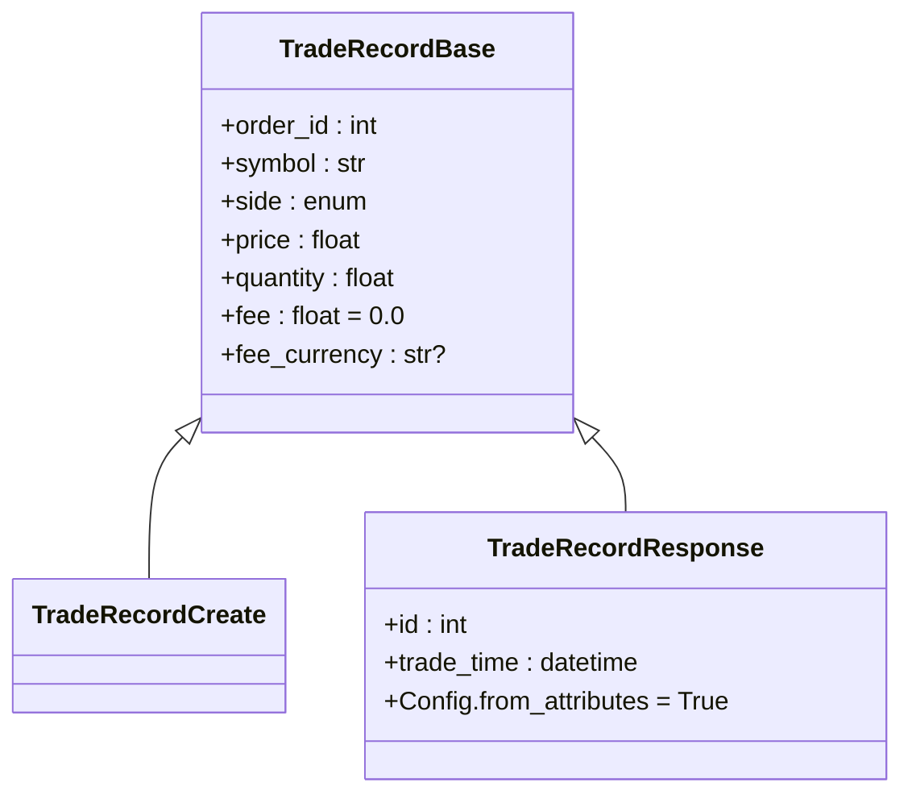
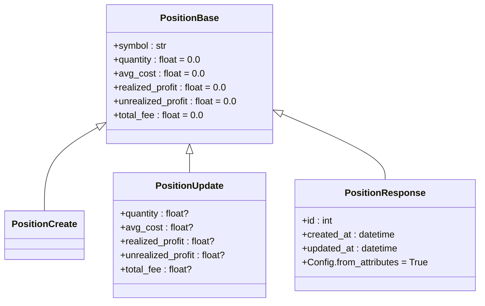
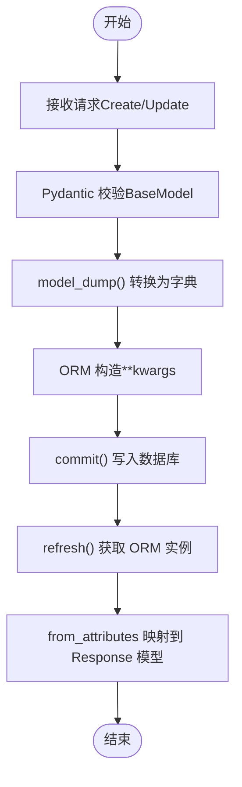
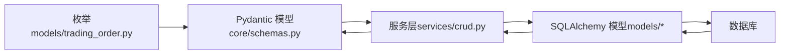

# 核心数据模型

<cite>
**本文引用的文件**
- [schemas.py](file://trading_system/core/schemas.py)
- [trading_order.py](file://trading_system/models/trading_order.py)
- [trade_record.py](file://trading_system/models/trade_record.py)
- [position.py](file://trading_system/models/position.py)
- [models_init.py](file://trading_system/models/__init__.py)
- [database.py](file://trading_system/core/database.py)
- [crud.py](file://trading_system/services/crud.py)
</cite>

## 目录
1. [简介](#简介)
2. [项目结构](#项目结构)
3. [核心组件](#核心组件)
4. [架构总览](#架构总览)
5. [详细组件分析](#详细组件分析)
6. [依赖分析](#依赖分析)
7. [性能考虑](#性能考虑)
8. [故障排查指南](#故障排查指南)
9. [结论](#结论)

## 简介
本文件聚焦于交易系统中的核心数据模型设计与使用，围绕 Pydantic 模型体系进行深入解析。重点涵盖以下方面：
- TradingOrderBase、TradeRecordBase、PositionBase 等基础模型的字段定义、数据类型与验证规则
- 不同变体（Create、Update、Response）的用途与使用场景
- 模型之间的继承关系与差异
- 模型创建、序列化与反序列化的最佳实践，含 from_attributes 配置与数据转换规则
- 结合 SQLAlchemy ORM 模型与 CRUD 层的实际使用流程

## 项目结构
核心数据模型由两部分组成：
- Pydantic 模型：位于 core/schemas.py，用于请求/响应的数据校验与序列化
- SQLAlchemy ORM 模型：位于 models/ 下，用于数据库持久化与关系映射

图表来源
- [schemas.py:7-87](file://trading_system/core/schemas.py#L7-L87)
- [trading_order.py:26-42](file://trading_system/models/trading_order.py#L26-L42)
- [trade_record.py:8-21](file://trading_system/models/trade_record.py#L8-L21)
- [position.py:6-17](file://trading_system/models/position.py#L6-L17)

章节来源
- [schemas.py:1-88](file://trading_system/core/schemas.py#L1-L88)
- [models_init.py:1-18](file://trading_system/models/__init__.py#L1-L18)

## 核心组件
本节对三大基础模型及其变体进行逐项说明，并给出字段定义、类型与验证要点。

- TradingOrderBase（下单基础模型）
  - 字段与类型：symbol（字符串）、side（枚举）、order_type（枚举）、price（可选浮点）、quantity（必填浮点）、remark（可选字符串）
  - 验证规则：非空约束（quantity 必填），可选字段（price、remark），枚举取值受上游枚举限制
  - 使用场景：作为下单请求体的基础结构，Create/Update/Response 均在此基础上扩展

- TradeRecordBase（成交记录基础模型）
  - 字段与类型：order_id（整数）、symbol（字符串）、side（枚举）、price（必填浮点）、quantity（必填浮点）、fee（默认 0.0）、fee_currency（可选字符串）
  - 验证规则：非空约束（price、quantity），fee 默认值为 0.0
  - 使用场景：成交记录的输入与输出结构，Create/Response 在此基础上扩展

- PositionBase（持仓基础模型）
  - 字段与类型：symbol（字符串）、quantity（默认 0.0）、avg_cost（默认 0.0）、realized_profit（默认 0.0）、unrealized_profit（默认 0.0）、total_fee（默认 0.0）
  - 验证规则：数值字段默认值控制，便于初始化与累加
  - 使用场景：持仓的输入与更新结构，Create/Update/Response 在此基础上扩展

章节来源
- [schemas.py:7-87](file://trading_system/core/schemas.py#L7-L87)

## 架构总览
下图展示了从请求到数据库写入再到响应返回的典型流程，以及 Pydantic 模型与 SQLAlchemy 模型之间的协作关系。

图表来源
- [crud.py:9-16](file://trading_system/services/crud.py#L9-L16)
- [schemas.py:16-35](file://trading_system/core/schemas.py#L16-L35)
- [trading_order.py:26-42](file://trading_system/models/trading_order.py#L26-L42)

## 详细组件分析

### TradingOrder 模型族
- 继承关系
  - TradingOrderBase：定义下单所需字段
  - TradingOrderCreate：继承自 TradingOrderBase，用于创建时的输入
  - TradingOrderUpdate：仅包含可更新字段（status、filled_quantity、fee）
  - TradingOrderResponse：在基础字段上补充 id、filled_quantity、status、fee、created_at、updated_at，并启用 from_attributes

- 字段与验证要点
  - symbol：字符串，索引字段（SQL 层）
  - side/order_type：枚举类型，确保取值合法
  - price：可选；LIMIT 订单通常需要价格，MARKET 可为空
  - quantity：必填；表示委托数量
  - remark：可选；用于附加说明
  - filled_quantity/status/fee：用于订单状态跟踪与成本统计

- 使用场景
  - 创建：TradingOrderCreate → ORM → commit
  - 更新：TradingOrderUpdate → 部分字段更新（exclude_unset）
  - 响应：TradingOrderResponse（from_attributes）→ 返回给客户端

图表来源
- [schemas.py:7-35](file://trading_system/core/schemas.py#L7-L35)

章节来源
- [schemas.py:7-35](file://trading_system/core/schemas.py#L7-L35)
- [trading_order.py:26-42](file://trading_system/models/trading_order.py#L26-L42)
- [crud.py:9-16](file://trading_system/services/crud.py#L9-L16)

### TradeRecord 模型族
- 继承关系
  - TradeRecordBase：定义成交记录字段
  - TradeRecordCreate：继承自 TradeRecordBase，用于创建时的输入
  - TradeRecordResponse：在基础字段上补充 id、trade_time，并启用 from_attributes

- 字段与验证要点
  - order_id：外键关联订单
  - symbol/side/price/quantity：成交详情
  - fee：默认 0.0，可选币种 fee_currency
  - trade_time：默认当前时间

- 使用场景
  - 创建：TradeRecordCreate → ORM → commit
  - 查询与展示：TradeRecordResponse（from_attributes）

图表来源
- [schemas.py:38-57](file://trading_system/core/schemas.py#L38-L57)
- [trade_record.py:8-21](file://trading_system/models/trade_record.py#L8-L21)

章节来源
- [schemas.py:38-57](file://trading_system/core/schemas.py#L38-L57)
- [trade_record.py:8-21](file://trading_system/models/trade_record.py#L8-L21)
- [crud.py:48-55](file://trading_system/services/crud.py#L48-L55)

### Position 模型族
- 继承关系
  - PositionBase：定义持仓字段
  - PositionCreate：继承自 PositionBase，用于创建时的输入
  - PositionUpdate：仅包含可更新字段（quantity、avg_cost、profit、fee）
  - PositionResponse：在基础字段上补充 id、created_at、updated_at，并启用 from_attributes

- 字段与验证要点
  - symbol：唯一标识标的
  - quantity/avg_cost：持仓数量与成本均价
  - realized_profit/unrealized_profit：已实现/未实现盈亏
  - total_fee：累计手续费
  - 默认值：便于初始化与累加计算

- 使用场景
  - 创建：PositionCreate → ORM → commit
  - 更新：PositionUpdate → 部分字段更新（exclude_unset）
  - 响应：PositionResponse（from_attributes）

图表来源
- [schemas.py:60-87](file://trading_system/core/schemas.py#L60-L87)
- [position.py:6-17](file://trading_system/models/position.py#L6-L17)

章节来源
- [schemas.py:60-87](file://trading_system/core/schemas.py#L60-L87)
- [position.py:6-17](file://trading_system/models/position.py#L6-L17)
- [crud.py:72-77](file://trading_system/services/crud.py#L72-L77)

### from_attributes 配置与数据转换
- from_attributes = True 的作用
  - 允许 Pydantic 模型直接从 ORM 实例读取属性，无需手动映射字段
  - 适用于响应模型（如 TradingOrderResponse、TradeRecordResponse、PositionResponse）
- 数据转换规则
  - 请求到存储：使用 model_dump() 将 Pydantic 模型转为字典，传入 ORM 构造函数
  - 存储到响应：ORM 实例通过 from_attributes 自动映射到响应模型

图表来源
- [schemas.py:34-35](file://trading_system/core/schemas.py#L34-L35)
- [schemas.py:56-57](file://trading_system/core/schemas.py#L56-L57)
- [schemas.py:86-87](file://trading_system/core/schemas.py#L86-L87)
- [crud.py:11-11](file://trading_system/services/crud.py#L11-L11)
- [crud.py:50-50](file://trading_system/services/crud.py#L50-L50)
- [crud.py:73-73](file://trading_system/services/crud.py#L73-L73)

章节来源
- [schemas.py:34-35](file://trading_system/core/schemas.py#L34-L35)
- [schemas.py:56-57](file://trading_system/core/schemas.py#L56-L57)
- [schemas.py:86-87](file://trading_system/core/schemas.py#L86-L87)
- [crud.py:11-11](file://trading_system/services/crud.py#L11-L11)
- [crud.py:50-50](file://trading_system/services/crud.py#L50-L50)
- [crud.py:73-73](file://trading_system/services/crud.py#L73-L73)

## 依赖分析
- Pydantic 模型依赖 SQLAlchemy 枚举与 ORM 模型
  - TradingOrderBase/Response 依赖 SideEnum、OrderTypeEnum、OrderStatusEnum
  - TradeRecordBase 依赖 SideEnum
- CRUD 层依赖 Pydantic 模型与 SQLAlchemy 模型
  - create_* 通过 model_dump() 将 Pydantic 转 ORM
  - update_* 通过 exclude_unset() 实现部分字段更新
- 数据库连接与会话管理
  - database.py 提供 engine、SessionLocal 与 get_db 依赖注入

图表来源
- [schemas.py:4-4](file://trading_system/core/schemas.py#L4-L4)
- [trading_order.py:8-24](file://trading_system/models/trading_order.py#L8-L24)
- [crud.py:3-4](file://trading_system/services/crud.py#L3-L4)
- [database.py:12-21](file://trading_system/core/database.py#L12-L21)

章节来源
- [schemas.py:4-4](file://trading_system/core/schemas.py#L4-L4)
- [trading_order.py:8-24](file://trading_system/models/trading_order.py#L8-L24)
- [crud.py:3-4](file://trading_system/services/crud.py#L3-L4)
- [database.py:12-21](file://trading_system/core/database.py#L12-L21)

## 性能考虑
- 序列化开销
  - model_dump() 与 exclude_unset() 的组合可减少不必要的字段写入，降低 ORM 更新成本
- 数据库连接池
  - database.py 中通过 pool_size、max_overflow、pool_recycle 等参数优化连接复用与回收
- 响应映射
  - from_attributes 启用后避免重复字段映射逻辑，提升响应构建效率

## 故障排查指南
- Pydantic 校验失败
  - 检查字段类型与默认值是否匹配（如 quantity 必填、price 可空）
  - 确认枚举值在允许范围内（side、order_type、status）
- from_attributes 映射异常
  - 确保 ORM 实例存在对应属性名
  - 检查响应模型字段与 ORM 字段命名一致性
- 数据库写入失败
  - 关注 CRUD 层日志与异常捕获，确认 commit/refresh 正常执行
  - 核对数据库连接参数与表结构初始化

章节来源
- [crud.py:9-16](file://trading_system/services/crud.py#L9-L16)
- [crud.py:37-45](file://trading_system/services/crud.py#L37-L45)
- [crud.py:72-77](file://trading_system/services/crud.py#L72-L77)
- [database.py:24-34](file://trading_system/core/database.py#L24-L34)

## 结论
本文件系统性梳理了交易系统的核心数据模型设计与使用方式，明确了 Pydantic 模型与其 ORM 对应物之间的职责边界与协作模式。通过 Create/Update/Response 的分层设计与 from_attributes 的启用，实现了从请求校验、ORM 转换到响应映射的高效闭环。建议在后续开发中：
- 严格遵循字段类型与默认值约定
- 使用 exclude_unset 控制更新范围
- 在响应模型统一启用 from_attributes，简化映射逻辑
- 结合数据库连接池参数与日志记录完善监控与排错能力