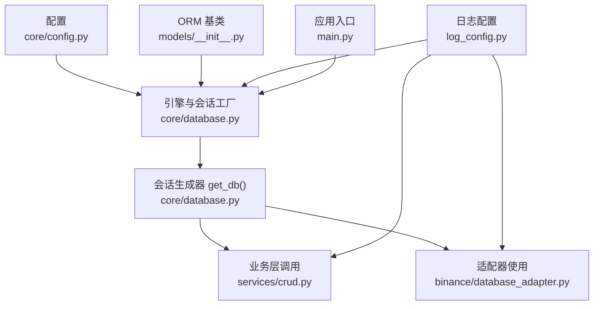
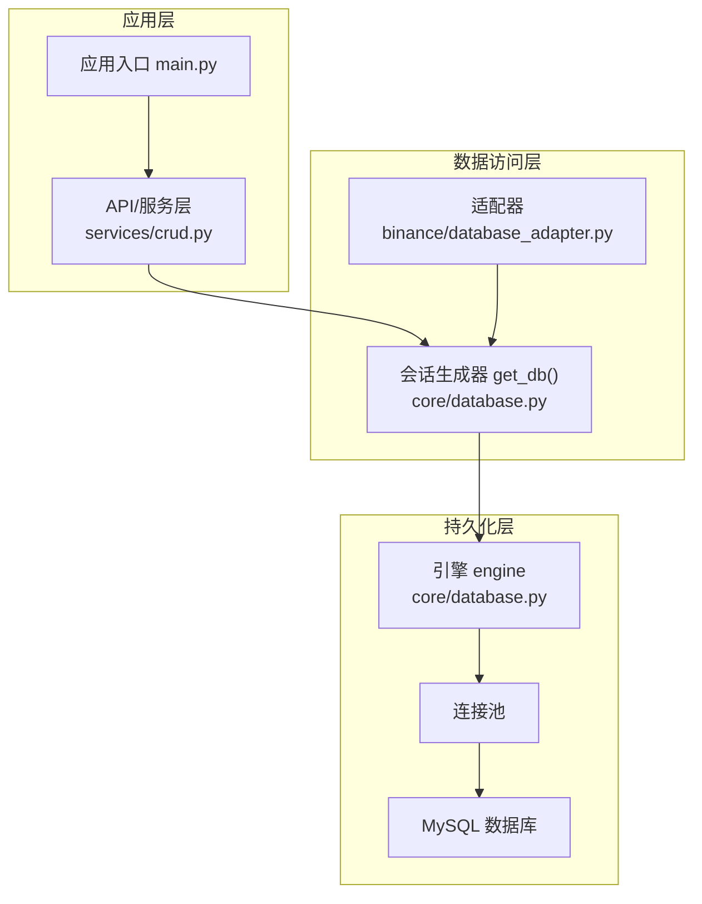
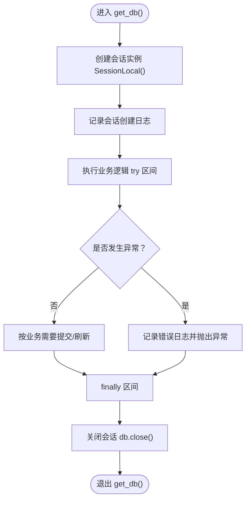
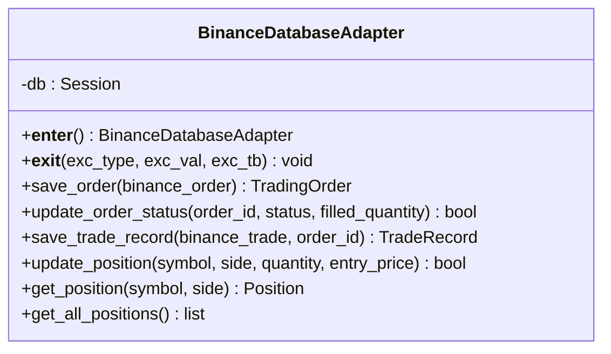
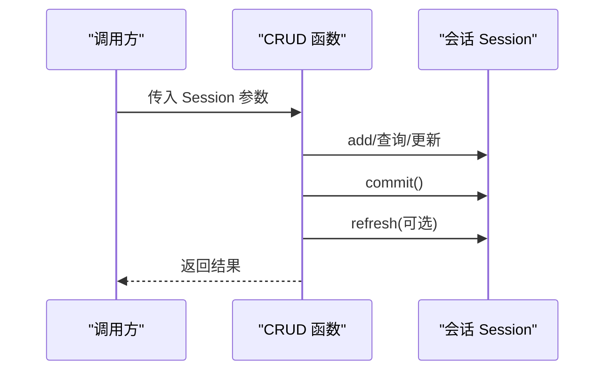
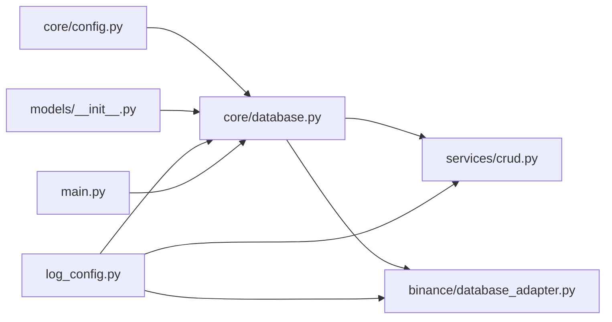

# 会话管理

<cite>
**本文引用的文件**
- [trading_system/core/database.py](file://trading_system/core/database.py)
- [trading_system/core/config.py](file://trading_system/core/config.py)
- [trading_system/models/__init__.py](file://trading_system/models/__init__.py)
- [trading_system/binance/database_adapter.py](file://trading_system/binance/database_adapter.py)
- [trading_system/services/crud.py](file://trading_system/services/crud.py)
- [log_config.py](file://log_config.py)
- [main.py](file://main.py)
</cite>

## 目录
1. [简介](#简介)
2. [项目结构](#项目结构)
3. [核心组件](#核心组件)
4. [架构总览](#架构总览)
5. [详细组件分析](#详细组件分析)
6. [依赖分析](#依赖分析)
7. [性能考虑](#性能考虑)
8. [故障排查指南](#故障排查指南)
9. [结论](#结论)
10. [附录](#附录)

## 简介
本文件聚焦于交易系统的数据库会话管理，系统性阐述会话的创建、使用与生命周期管理，详解 SessionLocal 的配置与 get_db() 的工作原理，并覆盖自动提交、自动刷新与绑定机制；同时给出异常处理、资源清理与连接关闭策略，以及在 FastAPI 中通过依赖注入正确使用会话的最佳实践。

## 项目结构
围绕会话管理的关键文件组织如下：
- 核心会话与引擎：trading_system/core/database.py
- 配置项：trading_system/core/config.py
- ORM 基类：trading_system/models/__init__.py
- 适配器示例：trading_system/binance/database_adapter.py
- CRUD 示例：trading_system/services/crud.py
- 日志配置：log_config.py
- 应用入口：main.py

图示来源
- [trading_system/core/database.py:12-35](file://trading_system/core/database.py#L12-L35)
- [trading_system/core/config.py:5-35](file://trading_system/core/config.py#L5-L35)
- [trading_system/models/__init__.py:1-18](file://trading_system/models/__init__.py#L1-L18)
- [trading_system/binance/database_adapter.py:14-30](file://trading_system/binance/database_adapter.py#L14-L30)
- [trading_system/services/crud.py:1-137](file://trading_system/services/crud.py#L1-L137)
- [log_config.py:11-74](file://log_config.py#L11-L74)
- [main.py:1-13](file://main.py#L1-L13)

章节来源
- [trading_system/core/database.py:1-45](file://trading_system/core/database.py#L1-L45)
- [trading_system/core/config.py:1-35](file://trading_system/core/config.py#L1-L35)
- [trading_system/models/__init__.py:1-18](file://trading_system/models/__init__.py#L1-L18)
- [trading_system/binance/database_adapter.py:1-189](file://trading_system/binance/database_adapter.py#L1-L189)
- [trading_system/services/crud.py:1-137](file://trading_system/services/crud.py#L1-L137)
- [log_config.py:1-74](file://log_config.py#L1-L74)
- [main.py:1-13](file://main.py#L1-L13)

## 核心组件
- 引擎与会话工厂
  - 使用配置项创建数据库引擎，启用连接池参数与 pre_ping，避免僵尸连接。
  - 通过 sessionmaker 构建 SessionLocal，禁用 autocommit 与 autoflush，确保事务显式控制。
- 会话生成器 get_db()
  - 以生成器形式提供会话实例，try/except 捕获异常并记录错误，finally 确保会话关闭。
- 初始化表结构
  - init_db() 调用 Base.metadata.create_all() 创建或复用表结构。
- ORM 基类
  - models/__init__.py 提供统一的 declarative_base 实例，供各模型继承。

章节来源
- [trading_system/core/database.py:12-44](file://trading_system/core/database.py#L12-L44)
- [trading_system/models/__init__.py:1-18](file://trading_system/models/__init__.py#L1-L18)
- [trading_system/core/config.py:5-35](file://trading_system/core/config.py#L5-L35)

## 架构总览
下图展示了从应用入口到数据库引擎、会话生成器与业务层的交互关系，体现会话在系统中的位置与职责边界。

图示来源
- [main.py:1-13](file://main.py#L1-L13)
- [trading_system/services/crud.py:1-137](file://trading_system/services/crud.py#L1-L137)
- [trading_system/binance/database_adapter.py:14-30](file://trading_system/binance/database_adapter.py#L14-L30)
- [trading_system/core/database.py:12-35](file://trading_system/core/database.py#L12-L35)

## 详细组件分析

### SessionLocal 与 get_db() 组件分析
- SessionLocal 配置要点
  - autocommit=false：禁止自动提交，要求显式 commit。
  - autoflush=false：禁止自动刷新，避免隐式状态变更。
  - bind=engine：将会话绑定到指定引擎，确保连接一致性。
- get_db() 工作流程
  - 创建会话实例并记录“会话已创建”日志。
  - try 区间内执行业务逻辑；如抛出异常则记录错误并重新抛出。
  - finally 区间确保会话关闭，释放资源。
- 连接池与预检
  - 连接池参数来自配置，pool_pre_ping=true 可在使用前检测连接有效性，降低连接失效风险。

图示来源
- [trading_system/core/database.py:24-35](file://trading_system/core/database.py#L24-L35)

章节来源
- [trading_system/core/database.py:12-35](file://trading_system/core/database.py#L12-L35)
- [trading_system/core/config.py:5-35](file://trading_system/core/config.py#L5-L35)

### 适配器中的会话使用
- BinanceDatabaseAdapter 展示了两种常见用法：
  - 上下文管理器模式：__enter__/__exit__ 内部创建会话并在异常时回滚，最终关闭会话。
  - 直接传入会话：构造函数接收外部传入的 Session，便于测试或统一注入。
- 典型操作流程
  - 查询/新增/更新后调用 commit，必要时 refresh 对象。
  - 发生异常时 rollback，保证事务一致性。
  - 最终关闭会话，避免连接泄漏。

图示来源
- [trading_system/binance/database_adapter.py:14-189](file://trading_system/binance/database_adapter.py#L14-L189)

章节来源
- [trading_system/binance/database_adapter.py:14-189](file://trading_system/binance/database_adapter.py#L14-L189)

### CRUD 层中的会话使用
- CRUD 函数均以 Session 作为第一个参数，遵循显式传入会话的模式。
- 典型流程
  - 构造实体对象并 add 到会话。
  - 调用 commit 提交事务。
  - 必要时调用 refresh 获取最新状态。
- 该模式与 get_db() 的生成器配合良好，适合在 FastAPI 中通过依赖注入传递会话。

图示来源
- [trading_system/services/crud.py:1-137](file://trading_system/services/crud.py#L1-L137)

章节来源
- [trading_system/services/crud.py:1-137](file://trading_system/services/crud.py#L1-L137)

### ORM 基类与初始化
- models/__init__.py 提供统一的 Base，所有模型继承该基类。
- init_db() 通过 create_all 在首次运行时创建表结构，失败时记录错误并抛出异常。

章节来源
- [trading_system/models/__init__.py:1-18](file://trading_system/models/__init__.py#L1-L18)
- [trading_system/core/database.py:37-45](file://trading_system/core/database.py#L37-L45)

## 依赖分析
- 外部依赖
  - SQLAlchemy：引擎、会话工厂、ORM 基类。
  - Pydantic Settings：读取环境变量并提供类型安全的配置。
- 内部依赖
  - database.py 依赖 config.py 提供连接池参数。
  - database.py 依赖 models/__init__.py 的 Base 用于建表。
  - 业务层（services/crud.py）依赖 database.py 的 SessionLocal 与 get_db()。
  - 适配器（binance/database_adapter.py）直接依赖 SessionLocal 或外部传入的 Session。
  - 日志模块（log_config.py）被 database.py、adapter、crud 等广泛使用。

图示来源
- [trading_system/core/config.py:5-35](file://trading_system/core/config.py#L5-L35)
- [trading_system/core/database.py:1-45](file://trading_system/core/database.py#L1-L45)
- [trading_system/models/__init__.py:1-18](file://trading_system/models/__init__.py#L1-L18)
- [trading_system/services/crud.py:1-137](file://trading_system/services/crud.py#L1-L137)
- [trading_system/binance/database_adapter.py:1-189](file://trading_system/binance/database_adapter.py#L1-L189)
- [log_config.py:1-74](file://log_config.py#L1-L74)
- [main.py:1-13](file://main.py#L1-L13)

章节来源
- [trading_system/core/config.py:5-35](file://trading_system/core/config.py#L5-L35)
- [trading_system/core/database.py:1-45](file://trading_system/core/database.py#L1-L45)
- [trading_system/models/__init__.py:1-18](file://trading_system/models/__init__.py#L1-L18)
- [trading_system/services/crud.py:1-137](file://trading_system/services/crud.py#L1-L137)
- [trading_system/binance/database_adapter.py:1-189](file://trading_system/binance/database_adapter.py#L1-L189)
- [log_config.py:1-74](file://log_config.py#L1-L74)
- [main.py:1-13](file://main.py#L1-L13)

## 性能考虑
- 连接池参数建议
  - pool_size：并发请求峰值的 1.5~2 倍，避免过度占用。
  - max_overflow：允许的溢出连接数，建议与 pool_size 同等规模但不超过 20。
  - pool_timeout：等待空闲连接的超时时间，建议 30 秒以内。
  - pool_recycle：连接回收周期，建议 3600 秒，避免长时间连接失效。
  - pool_pre_ping：开启以减少无效连接。
- 日志与 echo
  - 生产环境建议关闭 echo，避免 SQL 输出带来的性能损耗。
- 事务粒度
  - 将多个写操作放入同一事务，减少往返次数；长事务会阻塞资源，应权衡。
- 会话生命周期
  - 严格遵循“创建—使用—提交/回滚—关闭”的闭环，避免会话泄漏。

## 故障排查指南
- 常见问题与定位
  - 连接池耗尽：检查 pool_size 与 max_overflow 设置，确认是否存在未关闭的会话。
  - 会话泄漏：确认 finally 或上下文管理器是否执行，确保 db.close() 被调用。
  - 事务未提交：核对 CRUD 与适配器中是否调用了 commit，必要时使用 refresh。
  - 连接失效：启用 pool_pre_ping 并缩短 pool_recycle。
- 日志辅助
  - 利用日志模块记录“会话创建/关闭/错误”，快速定位异常发生点。
- 异常处理策略
  - 生成器 get_db() 捕获异常并记录，上层应根据业务语义决定 rollback 或重试。
  - 适配器在 __exit__ 中自动回滚，确保异常时状态一致。

章节来源
- [trading_system/core/database.py:24-35](file://trading_system/core/database.py#L24-L35)
- [trading_system/binance/database_adapter.py:20-30](file://trading_system/binance/database_adapter.py#L20-L30)
- [log_config.py:11-74](file://log_config.py#L11-L74)

## 结论
本系统采用显式事务控制与严格的会话生命周期管理，结合连接池与预检机制，确保在高并发场景下的稳定性与性能。通过生成器 get_db() 与依赖注入模式，业务层可以清晰地获得会话实例并进行事务控制；适配器与 CRUD 层分别覆盖了不同使用场景，满足测试、上下文管理与函数式调用的需求。建议在生产环境中合理配置连接池参数、关闭 SQL 输出，并严格执行“提交/回滚/关闭”的事务闭环。

## 附录
- 最佳实践清单
  - 显式事务：autocommit=false，autoflush=false，手动 commit/refresh。
  - 依赖注入：在 FastAPI 中使用 get_db() 作为依赖，确保每个请求拥有独立会话。
  - 异常处理：捕获异常后回滚，记录日志，必要时重试。
  - 资源清理：finally 或上下文管理器中关闭会话，避免泄漏。
  - 连接池：合理设置 pool_size/max_overflow/pool_timeout/pool_recycle/pre_ping。
  - 日志：统一使用 log_config，区分 DEBUG/INFO/WARNING/ERROR 级别。