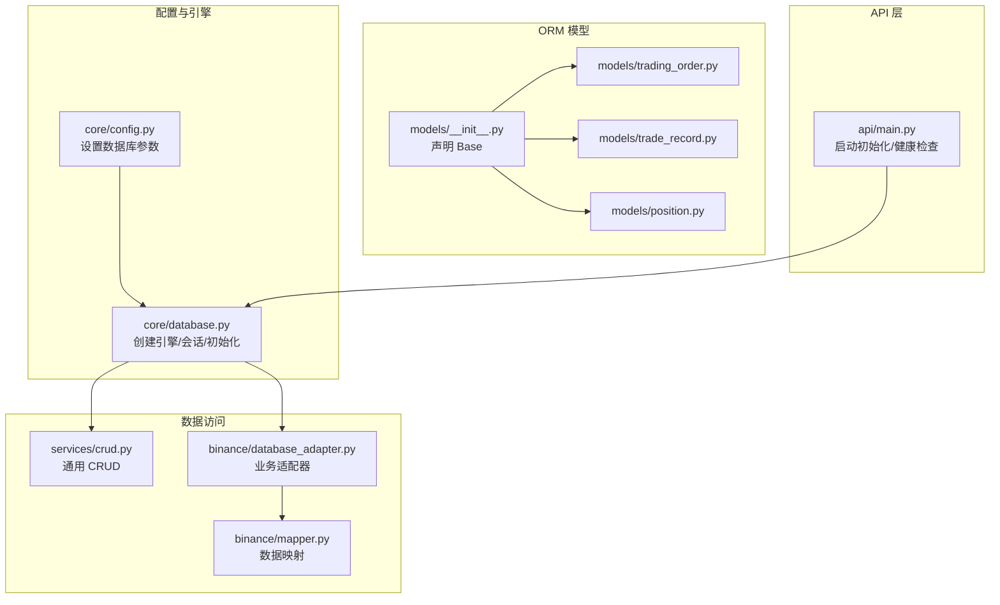
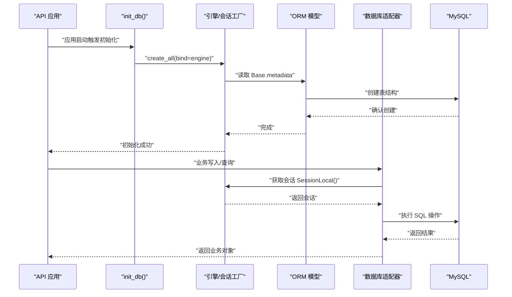
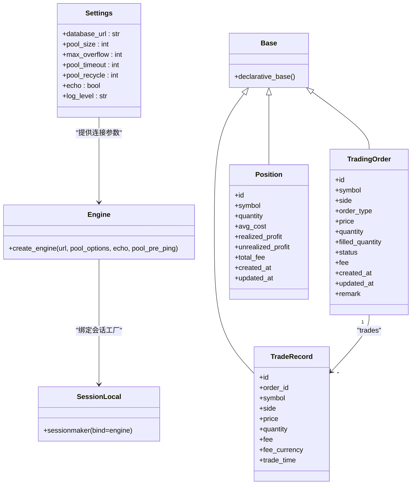

# 数据库管理

<cite>
**本文引用的文件**
- [trading_system/core/database.py](file://trading_system/core/database.py)
- [trading_system/core/config.py](file://trading_system/core/config.py)
- [trading_system/models/__init__.py](file://trading_system/models/__init__.py)
- [trading_system/models/trading_order.py](file://trading_system/models/trading_order.py)
- [trading_system/models/trade_record.py](file://trading_system/models/trade_record.py)
- [trading_system/models/position.py](file://trading_system/models/position.py)
- [trading_system/core/schemas.py](file://trading_system/core/schemas.py)
- [trading_system/binance/database_adapter.py](file://trading_system/binance/database_adapter.py)
- [trading_system/binance/mapper.py](file://trading_system/binance/mapper.py)
- [trading_system/services/crud.py](file://trading_system/services/crud.py)
- [trading_system/api/main.py](file://trading_system/api/main.py)
- [requirements.txt](file://requirements.txt)
</cite>

## 目录
1. [简介](#简介)
2. [项目结构](#项目结构)
3. [核心组件](#核心组件)
4. [架构总览](#架构总览)
5. [组件详解](#组件详解)
6. [依赖关系分析](#依赖关系分析)
7. [性能与优化](#性能与优化)
8. [故障排查指南](#故障排查指南)
9. [结论](#结论)
10. [附录](#附录)

## 简介
本指南围绕交易系统的数据库管理展开，覆盖数据库连接配置、ORM 模型定义、数据操作与会话管理、连接池配置、关系映射与约束、索引优化、查询性能调优，并结合实际代码路径给出可操作的实践建议。读者无需深入的数据库背景即可理解并正确使用 SQLAlchemy 进行数据持久化。

## 项目结构
数据库相关能力主要分布在以下模块：
- 配置层：集中管理数据库连接参数与日志级别
- 引擎与会话：创建连接池、提供会话工厂与生命周期管理
- ORM 模型：定义表结构、字段类型、索引与关系
- 数据访问层：封装 CRUD 与业务适配器
- API 层：应用启动时初始化数据库，提供健康检查

图表来源
- [trading_system/core/config.py:1-35](file://trading_system/core/config.py#L1-L35)
- [trading_system/core/database.py:1-45](file://trading_system/core/database.py#L1-L45)
- [trading_system/models/__init__.py:1-18](file://trading_system/models/__init__.py#L1-L18)
- [trading_system/models/trading_order.py:1-43](file://trading_system/models/trading_order.py#L1-L43)
- [trading_system/models/trade_record.py:1-22](file://trading_system/models/trade_record.py#L1-L22)
- [trading_system/models/position.py:1-18](file://trading_system/models/position.py#L1-L18)
- [trading_system/services/crud.py:1-137](file://trading_system/services/crud.py#L1-L137)
- [trading_system/binance/database_adapter.py:1-189](file://trading_system/binance/database_adapter.py#L1-L189)
- [trading_system/binance/mapper.py:1-110](file://trading_system/binance/mapper.py#L1-L110)
- [trading_system/api/main.py:1-104](file://trading_system/api/main.py#L1-L104)

章节来源
- [trading_system/core/config.py:1-35](file://trading_system/core/config.py#L1-L35)
- [trading_system/core/database.py:1-45](file://trading_system/core/database.py#L1-L45)
- [trading_system/models/__init__.py:1-18](file://trading_system/models/__init__.py#L1-L18)
- [trading_system/models/trading_order.py:1-43](file://trading_system/models/trading_order.py#L1-L43)
- [trading_system/models/trade_record.py:1-22](file://trading_system/models/trade_record.py#L1-L22)
- [trading_system/models/position.py:1-18](file://trading_system/models/position.py#L1-L18)
- [trading_system/services/crud.py:1-137](file://trading_system/services/crud.py#L1-L137)
- [trading_system/binance/database_adapter.py:1-189](file://trading_system/binance/database_adapter.py#L1-L189)
- [trading_system/binance/mapper.py:1-110](file://trading_system/binance/mapper.py#L1-L110)
- [trading_system/api/main.py:1-104](file://trading_system/api/main.py#L1-L104)

## 核心组件
- 配置中心：集中定义数据库连接字符串、连接池参数、日志级别等
- 引擎与会话：创建带连接池的引擎，提供会话工厂与生命周期钩子
- ORM 基类与模型：统一的 Base，以及 TradingOrder、TradeRecord、Position 的表结构与关系
- 数据访问层：通用 CRUD 与业务适配器（如 BinanceDatabaseAdapter）
- API 启动流程：应用启动时初始化数据库表，提供健康检查

章节来源
- [trading_system/core/config.py:5-35](file://trading_system/core/config.py#L5-L35)
- [trading_system/core/database.py:12-45](file://trading_system/core/database.py#L12-L45)
- [trading_system/models/__init__.py:1-18](file://trading_system/models/__init__.py#L1-L18)
- [trading_system/models/trading_order.py:26-43](file://trading_system/models/trading_order.py#L26-L43)
- [trading_system/models/trade_record.py:8-22](file://trading_system/models/trade_record.py#L8-L22)
- [trading_system/models/position.py:6-18](file://trading_system/models/position.py#L6-L18)
- [trading_system/services/crud.py:1-137](file://trading_system/services/crud.py#L1-L137)
- [trading_system/binance/database_adapter.py:14-189](file://trading_system/binance/database_adapter.py#L14-L189)
- [trading_system/api/main.py:58-88](file://trading_system/api/main.py#L58-L88)

## 架构总览
下图展示了从配置到模型、从会话到业务适配器的数据流与交互关系：

图表来源
- [trading_system/api/main.py:58-66](file://trading_system/api/main.py#L58-L66)
- [trading_system/core/database.py:37-45](file://trading_system/core/database.py#L37-L45)
- [trading_system/models/__init__.py:1-18](file://trading_system/models/__init__.py#L1-L18)
- [trading_system/binance/database_adapter.py:20-30](file://trading_system/binance/database_adapter.py#L20-L30)

## 组件详解

### 配置与连接池
- 数据库连接参数通过配置类集中管理，包括连接字符串、连接池大小、溢出、超时、回收时间、是否输出 SQL 等
- 引擎创建时启用 pre_ping 以自动检测并重建失效连接，提升稳定性
- 提供 get_db() 生成器用于依赖注入，确保异常时回滚并关闭会话

章节来源
- [trading_system/core/config.py:5-35](file://trading_system/core/config.py#L5-L35)
- [trading_system/core/database.py:12-35](file://trading_system/core/database.py#L12-L35)

### ORM 模型与关系映射
- 统一基类 Base，所有模型继承该基类
- TradingOrder：订单主表，包含符号、方向、类型、价格、数量、已成交、状态、手续费、时间戳等；与 TradeRecord 一对多关系
- TradeRecord：成交明细表，外键关联订单；与 TradingOrder 反向关系
- Position：持仓表，包含符号、数量、成本均价、已实现/未实现盈亏、总手续费、时间戳

章节来源
- [trading_system/models/__init__.py:1-18](file://trading_system/models/__init__.py#L1-L18)
- [trading_system/models/trading_order.py:26-43](file://trading_system/models/trading_order.py#L26-L43)
- [trading_system/models/trade_record.py:8-22](file://trading_system/models/trade_record.py#L8-L22)
- [trading_system/models/position.py:6-18](file://trading_system/models/position.py#L6-L18)

### 字段类型与约束
- 字符串长度限制与非空约束用于保证数据完整性
- 枚举类型用于状态、方向、类型，确保取值域可控
- 时间戳字段默认值与更新行为用于审计与追踪
- 外键约束用于维护订单与成交记录的关系一致性

章节来源
- [trading_system/models/trading_order.py:29-40](file://trading_system/models/trading_order.py#L29-L40)
- [trading_system/models/trade_record.py:11-19](file://trading_system/models/trade_record.py#L11-L19)
- [trading_system/models/position.py:9-17](file://trading_system/models/position.py#L9-L17)

### 关系与索引
- 一对多关系：TradingOrder.trades ←→ TradeRecord.order
- 外键：TradeRecord.order_id → TradingOrder.id
- 索引：多个字段建立索引以加速查询（如 symbol）

章节来源
- [trading_system/models/trading_order.py:42](file://trading_system/models/trading_order.py#L42)
- [trading_system/models/trade_record.py:12](file://trading_system/models/trade_record.py#L12)
- [trading_system/models/trading_order.py:30](file://trading_system/models/trading_order.py#L30)
- [trading_system/models/trade_record.py:13](file://trading_system/models/trade_record.py#L13)
- [trading_system/models/position.py:10](file://trading_system/models/position.py#L10)

### 会话管理与事务控制
- 使用 SessionLocal 工厂创建会话，配合上下文管理器确保异常回滚与资源释放
- 适配器内部捕获异常并回滚，避免脏数据
- 通用 CRUD 函数提供标准的增删改查流程

章节来源
- [trading_system/binance/database_adapter.py:20-30](file://trading_system/binance/database_adapter.py#L20-L30)
- [trading_system/binance/database_adapter.py:36-61](file://trading_system/binance/database_adapter.py#L36-L61)
- [trading_system/binance/database_adapter.py:83-97](file://trading_system/binance/database_adapter.py#L83-L97)
- [trading_system/services/crud.py:9-16](file://trading_system/services/crud.py#L9-L16)
- [trading_system/services/crud.py:37-45](file://trading_system/services/crud.py#L37-L45)

### 数据迁移与初始化
- 应用启动时调用 init_db()，基于 Base.metadata.create_all() 创建或同步表结构
- 健康检查通过直接执行简单 SQL 验证数据库连通性

章节来源
- [trading_system/api/main.py:58-66](file://trading_system/api/main.py#L58-L66)
- [trading_system/core/database.py:37-45](file://trading_system/core/database.py#L37-L45)
- [trading_system/api/main.py:75-88](file://trading_system/api/main.py#L75-L88)

### 查询与性能调优
- 通过索引字段（如 symbol）减少扫描范围
- 使用分页查询（offset/limit）控制结果集规模
- 在业务层按需过滤条件，避免全表扫描

章节来源
- [trading_system/services/crud.py:24-34](file://trading_system/services/crud.py#L24-L34)
- [trading_system/services/crud.py:62-69](file://trading_system/services/crud.py#L62-L69)
- [trading_system/models/trading_order.py:30](file://trading_system/models/trading_order.py#L30)
- [trading_system/models/trade_record.py:13](file://trading_system/models/trade_record.py#L13)
- [trading_system/models/position.py:10](file://trading_system/models/position.py#L10)

### 实际使用示例（代码路径）
- 初始化数据库：[trading_system/api/main.py:58-66](file://trading_system/api/main.py#L58-L66)
- 获取会话并执行 CRUD：[trading_system/services/crud.py:9-16](file://trading_system/services/crud.py#L9-L16)
- 适配器写入订单/成交/持仓：[trading_system/binance/database_adapter.py:31-61](file://trading_system/binance/database_adapter.py#L31-L61), [trading_system/binance/database_adapter.py:99-126](file://trading_system/binance/database_adapter.py#L99-L126), [trading_system/binance/database_adapter.py:128-161](file://trading_system/binance/database_adapter.py#L128-L161)
- 映射外部数据到模型：[trading_system/binance/mapper.py:63-89](file://trading_system/binance/mapper.py#L63-L89)

## 依赖关系分析

图表来源
- [trading_system/core/config.py:5-35](file://trading_system/core/config.py#L5-L35)
- [trading_system/core/database.py:12-21](file://trading_system/core/database.py#L12-L21)
- [trading_system/models/__init__.py:1-3](file://trading_system/models/__init__.py#L1-L3)
- [trading_system/models/trading_order.py:26-43](file://trading_system/models/trading_order.py#L26-L43)
- [trading_system/models/trade_record.py:8-22](file://trading_system/models/trade_record.py#L8-L22)
- [trading_system/models/position.py:6-18](file://trading_system/models/position.py#L6-L18)

## 性能与优化
- 连接池参数调优：根据并发请求量调整 pool_size 与 max_overflow，合理设置 pool_timeout 与 pool_recycle，避免连接泄漏与超时
- 预检连接：启用 pool_pre_ping，自动剔除失效连接，降低重试失败概率
- 索引策略：对高频过滤字段（如 symbol）建立索引；复合查询考虑联合索引
- 分页与限流：对列表查询使用 offset/limit 控制返回量，避免一次性拉取大量数据
- SQL 输出：生产环境建议关闭 echo，减少日志开销

章节来源
- [trading_system/core/config.py:6-12](file://trading_system/core/config.py#L6-L12)
- [trading_system/core/database.py:12-20](file://trading_system/core/database.py#L12-L20)
- [trading_system/models/trading_order.py:30](file://trading_system/models/trading_order.py#L30)
- [trading_system/models/trade_record.py:13](file://trading_system/models/trade_record.py#L13)
- [trading_system/models/position.py:10](file://trading_system/models/position.py#L10)

## 故障排查指南
- 初始化失败：检查数据库连接字符串与目标库是否存在；查看 init_db() 的异常日志
- 会话异常：确认 get_db() 生成器是否被正确使用；异常时应自动回滚并关闭会话
- 健康检查失败：核对数据库连通性与凭据；定位 SessionLocal 执行 SQL 的错误信息
- 业务写入失败：适配器内捕获异常并回滚；检查映射逻辑与字段类型转换

章节来源
- [trading_system/core/database.py:37-45](file://trading_system/core/database.py#L37-L45)
- [trading_system/binance/database_adapter.py:24-30](file://trading_system/binance/database_adapter.py#L24-L30)
- [trading_system/binance/database_adapter.py:58-61](file://trading_system/binance/database_adapter.py#L58-L61)
- [trading_system/binance/database_adapter.py:94-97](file://trading_system/binance/database_adapter.py#L94-L97)
- [trading_system/api/main.py:75-88](file://trading_system/api/main.py#L75-L88)

## 结论
本项目采用 SQLAlchemy 进行数据库管理，通过集中配置、连接池与会话工厂、清晰的 ORM 模型与关系映射，以及完善的业务适配器与 CRUD 封装，实现了稳定可靠的数据持久化能力。遵循本文的配置与优化建议，可在保证性能的同时提升系统的可维护性与可扩展性。

## 附录

### 依赖版本参考
- SQLAlchemy 版本：见 requirements.txt 中的 SQLAlchemy 条目
- Pydantic Settings：用于配置管理
- PyMySQL：MySQL 驱动

章节来源
- [requirements.txt:51](file://requirements.txt#L51)
- [requirements.txt:37-38](file://requirements.txt#L37-L38)
- [requirements.txt:40](file://requirements.txt#L40)