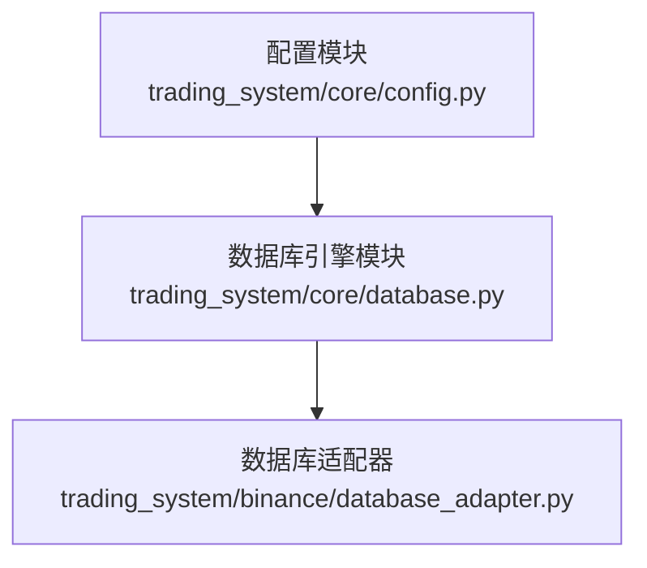
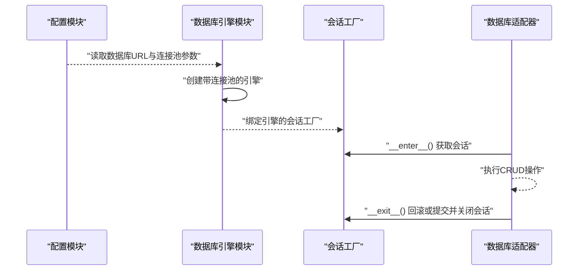
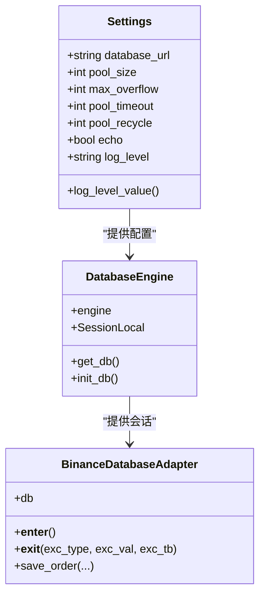
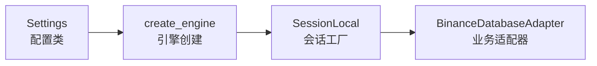

# 数据库配置

<cite>
**本文引用的文件**
- [trading_system/core/config.py](file://trading_system/core/config.py)
- [trading_system/core/database.py](file://trading_system/core/database.py)
- [trading_system/binance/database_adapter.py](file://trading_system/binance/database_adapter.py)
- [.trae/specs/优化数据库连接和代码/checklist.md](file://.trae/specs/优化数据库连接和代码/checklist.md)
</cite>

## 目录
1. [简介](#简介)
2. [项目结构](#项目结构)
3. [核心组件](#核心组件)
4. [架构总览](#架构总览)
5. [详细组件分析](#详细组件分析)
6. [依赖分析](#依赖分析)
7. [性能考虑](#性能考虑)
8. [故障排查指南](#故障排查指南)
9. [结论](#结论)
10. [附录](#附录)

## 简介
本文件聚焦于交易系统的数据库配置与连接池管理，涵盖以下主题：
- DATABASE_URL 的格式与参数解析（基于使用的方言）
- 连接池关键参数：pool_size、max_overflow、pool_timeout、pool_recycle 的含义与影响
- 配置文件中的数据库设置项与默认值来源
- 如何正确配置 MySQL 连接参数（含方言选择与字符集建议）
- 开发与生产环境的最佳实践与配置策略

## 项目结构
与数据库配置直接相关的核心文件位于 trading_system/core 目录，并在业务模块中通过适配器使用数据库会话。

图表来源
- [trading_system/core/config.py:1-35](file://trading_system/core/config.py#L1-L35)
- [trading_system/core/database.py:1-45](file://trading_system/core/database.py#L1-L45)
- [trading_system/binance/database_adapter.py:1-41](file://trading_system/binance/database_adapter.py#L1-L41)

章节来源
- [trading_system/core/config.py:1-35](file://trading_system/core/config.py#L1-L35)
- [trading_system/core/database.py:1-45](file://trading_system/core/database.py#L1-L45)
- [trading_system/binance/database_adapter.py:1-41](file://trading_system/binance/database_adapter.py#L1-L41)

## 核心组件
- 配置类 Settings：集中定义数据库连接字符串、连接池参数、日志级别等，默认值来自类属性与 .env 文件映射。
- 数据库引擎模块：基于 SQLAlchemy 创建带连接池的引擎，注入连接池参数；提供 get_db 生成器用于获取会话；提供 init_db 初始化表结构。
- 数据库适配器：在业务层以上下文方式使用 SessionLocal 获取数据库会话，确保异常时回滚并关闭会话。

章节来源
- [trading_system/core/config.py:5-34](file://trading_system/core/config.py#L5-L34)
- [trading_system/core/database.py:12-21](file://trading_system/core/database.py#L12-L21)
- [trading_system/core/database.py:24-34](file://trading_system/core/database.py#L24-L34)
- [trading_system/binance/database_adapter.py:14-30](file://trading_system/binance/database_adapter.py#L14-L30)

## 架构总览
下图展示了从配置到数据库引擎再到业务适配器的整体调用链路。

图表来源
- [trading_system/core/config.py:7-12](file://trading_system/core/config.py#L7-L12)
- [trading_system/core/database.py:12-21](file://trading_system/core/database.py#L12-L21)
- [trading_system/binance/database_adapter.py:20-30](file://trading_system/binance/database_adapter.py#L20-L30)

## 详细组件分析

### 配置类 Settings 与 DATABASE_URL
- 数据库连接字符串采用 mysql+pymysql 方言，包含协议、用户名、密码、主机、端口与数据库名。
- 默认值来源于类属性，同时支持从 .env 文件加载覆盖值（env_file 指向 .env）。
- echo 参数控制是否输出 SQL 日志，便于调试但不建议在生产开启。

章节来源
- [trading_system/core/config.py:7](file://trading_system/core/config.py#L7)
- [trading_system/core/config.py:28-31](file://trading_system/core/config.py#L28-L31)

### 连接池参数详解
- pool_size：连接池初始连接数，决定并发读写能力的基础容量。
- max_overflow：在 pool_size 外部允许额外溢出连接的数量，超出后请求将等待。
- pool_timeout：获取连接的超时秒数，超时抛出异常，避免请求无限等待。
- pool_recycle：连接生命周期（秒），到期后自动回收，防止长时间占用导致的连接失效。
- pool_pre_ping：每次从池中获取连接前进行“预检查”，提升连接可用性与稳定性。

章节来源
- [trading_system/core/config.py:8-12](file://trading_system/core/config.py#L8-L12)
- [trading_system/core/database.py:12-20](file://trading_system/core/database.py#L12-L20)

### 数据库引擎创建与会话管理
- 使用 create_engine 创建带连接池的引擎，参数来自配置类。
- SessionLocal 绑定引擎，提供事务级会话；get_db 作为依赖注入生成器，确保异常时抛出并最终关闭会话。
- init_db 调用 Base.metadata.create_all 初始化所有模型对应的表。

章节来源
- [trading_system/core/database.py:12-21](file://trading_system/core/database.py#L12-L21)
- [trading_system/core/database.py:24-34](file://trading_system/core/database.py#L24-L34)
- [trading_system/core/database.py:37-44](file://trading_system/core/database.py#L37-L44)

### 业务适配器中的数据库使用
- 适配器以上下文管理方式获取会话，异常时自动回滚，结束时关闭会话，保证资源释放与事务一致性。

章节来源
- [trading_system/binance/database_adapter.py:20-30](file://trading_system/binance/database_adapter.py#L20-L30)

### 类关系图（代码级）

图表来源
- [trading_system/core/config.py:5-34](file://trading_system/core/config.py#L5-L34)
- [trading_system/core/database.py:12-44](file://trading_system/core/database.py#L12-L44)
- [trading_system/binance/database_adapter.py:14-30](file://trading_system/binance/database_adapter.py#L14-L30)

## 依赖分析
- 配置模块与数据库引擎模块之间是单向依赖：引擎模块读取配置模块的参数。
- 数据库引擎模块与业务适配器之间是使用关系：适配器通过会话工厂获取会话。
- 该依赖关系清晰、低耦合，便于独立测试与替换。

图表来源
- [trading_system/core/config.py:7-12](file://trading_system/core/config.py#L7-L12)
- [trading_system/core/database.py:12-21](file://trading_system/core/database.py#L12-L21)
- [trading_system/binance/database_adapter.py:20-30](file://trading_system/binance/database_adapter.py#L20-L30)

章节来源
- [trading_system/core/config.py:7-12](file://trading_system/core/config.py#L7-L12)
- [trading_system/core/database.py:12-21](file://trading_system/core/database.py#L12-L21)
- [trading_system/binance/database_adapter.py:20-30](file://trading_system/binance/database_adapter.py#L20-L30)

## 性能考虑
- 合理设置 pool_size 与 max_overflow：根据并发访问量与数据库承载能力设定，避免过度占用连接或频繁等待。
- pool_timeout 应小于上游请求超时，避免堆积式失败。
- pool_recycle 建议略小于数据库连接超时阈值，确保连接复用的同时规避空闲连接断开。
- echo 在生产关闭，减少日志开销与敏感信息泄露风险。
- pool_pre_ping 提升连接可用性，降低因网络波动导致的失败率。

## 故障排查指南
- 连接失败：检查 DATABASE_URL 是否正确（协议、主机、端口、数据库名、凭据），确认 .env 文件存在且路径正确。
- 连接池耗尽：增大 pool_size 或 max_overflow，缩短 pool_timeout 并优化慢查询。
- 连接超时：调整 pool_timeout，检查数据库服务器负载与网络延迟。
- 连接失效：减小 pool_recycle 或启用 pool_pre_ping，检查中间件防火墙与连接复用策略。
- 表初始化失败：确认数据库用户权限与目标数据库存在；查看 init_db 抛出的具体错误信息。

章节来源
- [trading_system/core/database.py:37-44](file://trading_system/core/database.py#L37-L44)
- [.trae/specs/优化数据库连接和代码/checklist.md:1-12](file://.trae/specs/优化数据库连接和代码/checklist.md#L1-L12)

## 结论
本项目的数据库配置采用集中式 Settings 管理，结合 SQLAlchemy 的连接池参数实现高可用与可维护性。通过明确的参数语义与默认值，配合业务适配器的会话生命周期管理，能够满足开发与生产的不同需求。建议在生产环境遵循最小权限、安全传输与可观测性的原则，持续监控连接池指标并按需调优。

## 附录

### DATABASE_URL 格式与参数说明
- 方言：mysql+pymysql
- 格式：mysql+pymysql://用户名:密码@主机:端口/数据库名
- 建议：生产环境使用 SSL 连接与只读账号分离；如需字符集，可在 URL 中附加 charset 参数（例如 ?charset=utf8mb4）。

章节来源
- [trading_system/core/config.py:7](file://trading_system/core/config.py#L7)

### 连接池参数对照表
- pool_size：初始连接数
- max_overflow：最大溢出连接数
- pool_timeout：获取连接超时（秒）
- pool_recycle：连接回收周期（秒）
- pool_pre_ping：获取连接前预检查

章节来源
- [trading_system/core/config.py:8-12](file://trading_system/core/config.py#L8-L12)
- [trading_system/core/database.py:12-20](file://trading_system/core/database.py#L12-L20)

### 配置文件与环境变量
- 配置类通过 env_file 指向 .env 文件，读取键值对覆盖默认值。
- 推荐将敏感信息（如数据库密码）置于 .env 并加入 .gitignore。

章节来源
- [trading_system/core/config.py:28-31](file://trading_system/core/config.py#L28-L31)

### 开发与生产环境配置策略
- 开发环境
  - 可开启 echo 便于调试
  - pool_size 与 max_overflow 可适当放宽
  - 使用本地 MySQL 实例，确保 .env 正确指向
- 生产环境
  - 关闭 echo
  - pool_size 与 max_overflow 依据 QPS 与数据库上限合理设置
  - 使用 SSL 连接与专用账号
  - 监控连接池命中率、等待时间与回收频率

章节来源
- [trading_system/core/config.py:11-12](file://trading_system/core/config.py#L11-L12)
- [.trae/specs/优化数据库连接和代码/checklist.md:1-12](file://.trae/specs/优化数据库连接和代码/checklist.md#L1-L12)