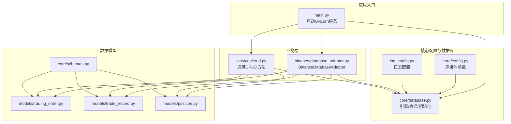
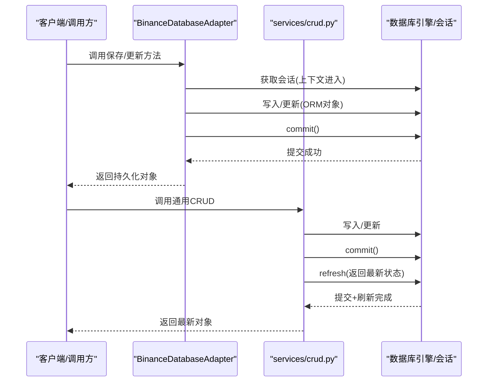
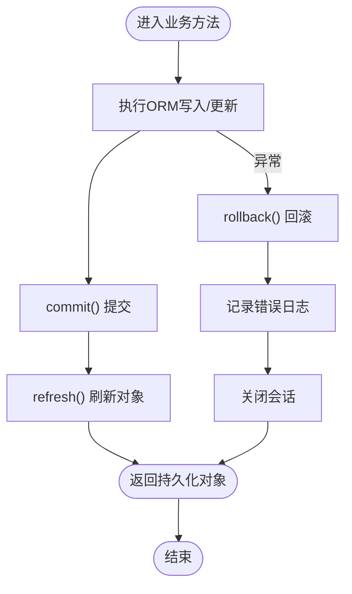
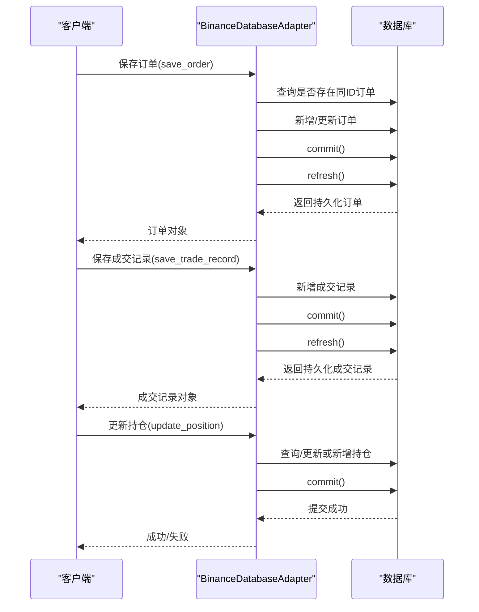
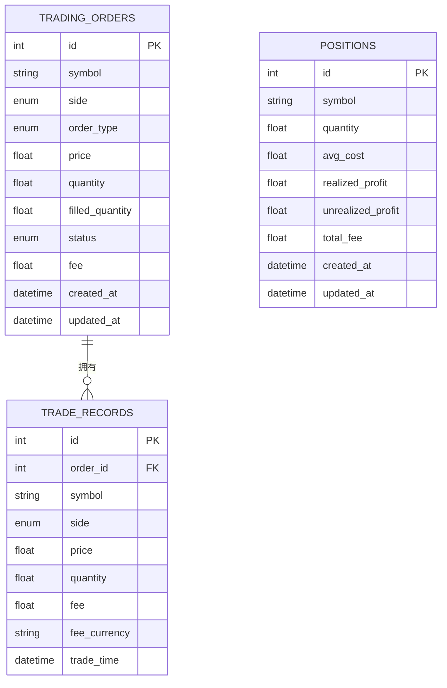
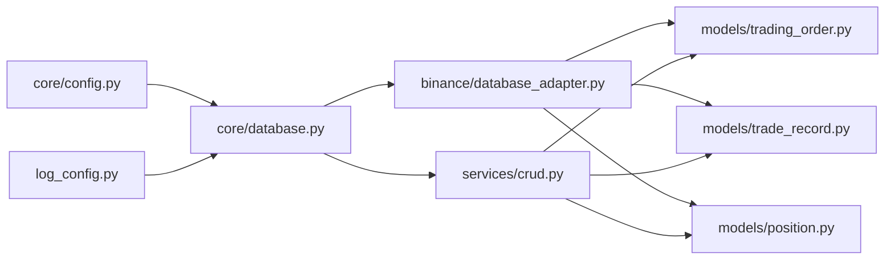

# 事务管理

<cite>
**本文引用的文件**
- [trading_system/core/database.py](file://trading_system/core/database.py)
- [trading_system/binance/database_adapter.py](file://trading_system/binance/database_adapter.py)
- [trading_system/services/crud.py](file://trading_system/services/crud.py)
- [log_config.py](file://log_config.py)
- [trading_system/core/config.py](file://trading_system/core/config.py)
- [trading_system/models/trading_order.py](file://trading_system/models/trading_order.py)
- [trading_system/models/trade_record.py](file://trading_system/models/trade_record.py)
- [trading_system/models/position.py](file://trading_system/models/position.py)
- [trading_system/core/schemas.py](file://trading_system/core/schemas.py)
- [main.py](file://main.py)
</cite>

## 目录
1. [引言](#引言)
2. [项目结构](#项目结构)
3. [核心组件](#核心组件)
4. [架构总览](#架构总览)
5. [详细组件分析](#详细组件分析)
6. [依赖分析](#依赖分析)
7. [性能考虑](#性能考虑)
8. [故障排查指南](#故障排查指南)
9. [结论](#结论)
10. [附录](#附录)

## 引言
本指南围绕交易系统中的数据库事务管理展开，结合代码库中现有的事务边界、提交(commit)、刷新(refresh)与回滚(rollback)机制，系统阐述如何在复杂交易流程中保持数据一致性，并给出并发控制、死锁预防、错误恢复与日志记录的最佳实践。读者无需深入编程背景，也能通过图示与分层讲解理解事务在本项目中的实现与使用方式。

## 项目结构
交易系统的事务管理主要由以下层次构成：
- 数据库连接与会话：通过 SQLAlchemy 引擎与会话工厂提供连接池与会话生命周期管理。
- 业务适配器与CRUD：封装具体的数据写入、更新与读取逻辑，统一执行 commit 与 rollback。
- 模型与模式：定义交易订单、成交记录、持仓等实体及其字段约束。
- 日志与配置：统一日志输出与数据库连接池参数配置。

图表来源
- [main.py:1-13](file://main.py#L1-L13)
- [trading_system/core/config.py:1-35](file://trading_system/core/config.py#L1-L35)
- [trading_system/core/database.py:1-45](file://trading_system/core/database.py#L1-L45)
- [log_config.py:1-74](file://log_config.py#L1-L74)
- [trading_system/binance/database_adapter.py:1-189](file://trading_system/binance/database_adapter.py#L1-L189)
- [trading_system/services/crud.py:1-137](file://trading_system/services/crud.py#L1-L137)
- [trading_system/models/trading_order.py:1-43](file://trading_system/models/trading_order.py#L1-L43)
- [trading_system/models/trade_record.py:1-22](file://trading_system/models/trade_record.py#L1-L22)
- [trading_system/models/position.py:1-18](file://trading_system/models/position.py#L1-L18)
- [trading_system/core/schemas.py:1-88](file://trading_system/core/schemas.py#L1-L88)

章节来源
- [main.py:1-13](file://main.py#L1-L13)
- [trading_system/core/config.py:1-35](file://trading_system/core/config.py#L1-L35)
- [trading_system/core/database.py:1-45](file://trading_system/core/database.py#L1-L45)
- [log_config.py:1-74](file://log_config.py#L1-L74)

## 核心组件
- 数据库引擎与会话
  - 使用 SQLAlchemy 创建带连接池的引擎，并通过会话工厂生成非自动提交、非自动刷新的会话，确保事务边界可控。
  - 提供 get_db 生成器用于依赖注入，保证会话在请求结束时关闭。
- 业务适配器
  - BinanceDatabaseAdapter 将订单、成交记录、持仓的写入封装为独立方法，每个方法内部负责 commit 或 rollback，并在退出上下文时进行收尾。
- 通用CRUD
  - services/crud.py 提供标准化的增删改查方法，统一在写入后调用 commit 与 refresh，确保返回持久化后的对象。
- 模型与模式
  - 定义交易订单、成交记录、持仓三类实体，以及对应的 Pydantic 模式，支撑数据校验与序列化。
- 日志与配置
  - 统一日志配置；数据库连接池参数通过配置类集中管理，便于运维调整。

章节来源
- [trading_system/core/database.py:12-34](file://trading_system/core/database.py#L12-L34)
- [trading_system/binance/database_adapter.py:14-30](file://trading_system/binance/database_adapter.py#L14-L30)
- [trading_system/services/crud.py:9-16](file://trading_system/services/crud.py#L9-L16)
- [trading_system/services/crud.py:48-55](file://trading_system/services/crud.py#L48-L55)
- [trading_system/services/crud.py:72-77](file://trading_system/services/crud.py#L72-L77)
- [trading_system/services/crud.py:103-136](file://trading_system/services/crud.py#L103-L136)
- [trading_system/core/config.py:5-32](file://trading_system/core/config.py#L5-L32)
- [log_config.py:11-64](file://log_config.py#L11-L64)

## 架构总览
下图展示了事务在系统中的流转：应用通过依赖注入获取会话，业务适配器或CRUD方法在会话上执行写操作，按需提交或回滚，最终返回持久化后的实体。

图表来源
- [trading_system/binance/database_adapter.py:20-30](file://trading_system/binance/database_adapter.py#L20-L30)
- [trading_system/binance/database_adapter.py:31-62](file://trading_system/binance/database_adapter.py#L31-L62)
- [trading_system/binance/database_adapter.py:99-126](file://trading_system/binance/database_adapter.py#L99-L126)
- [trading_system/binance/database_adapter.py:128-161](file://trading_system/binance/database_adapter.py#L128-L161)
- [trading_system/services/crud.py:9-16](file://trading_system/services/crud.py#L9-L16)
- [trading_system/services/crud.py:48-55](file://trading_system/services/crud.py#L48-L55)
- [trading_system/services/crud.py:72-77](file://trading_system/services/crud.py#L72-L77)
- [trading_system/services/crud.py:103-136](file://trading_system/services/crud.py#L103-L136)

## 详细组件分析

### 事务边界与回滚策略
- 上下文管理与自动回滚
  - BinanceDatabaseAdapter 使用 with 上下文，在异常发生时自动执行回滚并记录错误，随后关闭会话，避免资源泄漏。
- 显式提交与异常捕获
  - 各业务方法内部在 try 块中执行 ORM 操作，遇到异常则回滚并记录错误，保证事务原子性。
- 会话生命周期
  - get_db 生成器在每次请求开始创建会话，在 finally 中确保关闭，防止连接泄露。

图表来源
- [trading_system/binance/database_adapter.py:20-30](file://trading_system/binance/database_adapter.py#L20-L30)
- [trading_system/binance/database_adapter.py:31-62](file://trading_system/binance/database_adapter.py#L31-L62)
- [trading_system/binance/database_adapter.py:99-126](file://trading_system/binance/database_adapter.py#L99-L126)
- [trading_system/binance/database_adapter.py:128-161](file://trading_system/binance/database_adapter.py#L128-L161)
- [trading_system/services/crud.py:9-16](file://trading_system/services/crud.py#L9-L16)
- [trading_system/services/crud.py:48-55](file://trading_system/services/crud.py#L48-L55)
- [trading_system/services/crud.py:72-77](file://trading_system/services/crud.py#L72-L77)
- [trading_system/services/crud.py:103-136](file://trading_system/services/crud.py#L103-L136)

章节来源
- [trading_system/binance/database_adapter.py:20-30](file://trading_system/binance/database_adapter.py#L20-L30)
- [trading_system/binance/database_adapter.py:31-62](file://trading_system/binance/database_adapter.py#L31-L62)
- [trading_system/binance/database_adapter.py:99-126](file://trading_system/binance/database_adapter.py#L99-L126)
- [trading_system/binance/database_adapter.py:128-161](file://trading_system/binance/database_adapter.py#L128-L161)
- [trading_system/core/database.py:24-34](file://trading_system/core/database.py#L24-L34)

### commit() 的使用场景与语义
- 保存新实体：新增订单、成交记录、持仓后立即提交，确保数据落盘。
- 更新实体：修改已有实体属性后提交，使变更生效。
- 与 refresh() 协同：提交后通过 refresh 获取数据库中的最新状态，避免缓存不一致。

章节来源
- [trading_system/binance/database_adapter.py:53-56](file://trading_system/binance/database_adapter.py#L53-L56)
- [trading_system/binance/database_adapter.py:117-121](file://trading_system/binance/database_adapter.py#L117-L121)
- [trading_system/binance/database_adapter.py:154](file://trading_system/binance/database_adapter.py#L154)
- [trading_system/services/crud.py:13](file://trading_system/services/crud.py#L13)
- [trading_system/services/crud.py:52-54](file://trading_system/services/crud.py#L52-L54)
- [trading_system/services/crud.py:75-77](file://trading_system/services/crud.py#L75-L77)
- [trading_system/services/crud.py:98-100](file://trading_system/services/crud.py#L98-L100)
- [trading_system/services/crud.py:135](file://trading_system/services/crud.py#L135)

### refresh() 的作用与最佳实践
- 何时使用：当需要返回“数据库最新”状态的对象时，先 commit 再 refresh。
- 典型场景：插入后返回完整主键与时间戳；更新后返回最新版本。
- 注意事项：refresh 会重新从数据库加载对象，应避免在高频路径中滥用。

章节来源
- [trading_system/services/crud.py:14](file://trading_system/services/crud.py#L14)
- [trading_system/services/crud.py:44](file://trading_system/services/crud.py#L44)
- [trading_system/services/crud.py:53](file://trading_system/services/crud.py#L53)
- [trading_system/services/crud.py:99](file://trading_system/services/crud.py#L99)
- [trading_system/services/crud.py:134](file://trading_system/services/crud.py#L134)

### 并发控制与锁策略
- 会话隔离：每个请求使用独立会话，避免跨请求污染。
- 行级锁与显式加锁：如需强一致写入，可在关键路径使用 select for update 或数据库层面的唯一索引约束。
- 重试与幂等：对外部接口（如交易所）回调的写入应具备幂等性，避免重复提交造成脏数据。

章节来源
- [trading_system/core/database.py:21](file://trading_system/core/database.py#L21)
- [trading_system/binance/database_adapter.py:39-56](file://trading_system/binance/database_adapter.py#L39-L56)
- [trading_system/binance/database_adapter.py:136-161](file://trading_system/binance/database_adapter.py#L136-L161)

### 复杂交易流程示例（下单-成交-持仓更新）
该流程体现了事务边界、提交与刷新的协同，以及异常回滚的保护。

图表来源
- [trading_system/binance/database_adapter.py:31-62](file://trading_system/binance/database_adapter.py#L31-L62)
- [trading_system/binance/database_adapter.py:99-126](file://trading_system/binance/database_adapter.py#L99-L126)
- [trading_system/binance/database_adapter.py:128-161](file://trading_system/binance/database_adapter.py#L128-L161)

章节来源
- [trading_system/binance/database_adapter.py:31-62](file://trading_system/binance/database_adapter.py#L31-L62)
- [trading_system/binance/database_adapter.py:99-126](file://trading_system/binance/database_adapter.py#L99-L126)
- [trading_system/binance/database_adapter.py:128-161](file://trading_system/binance/database_adapter.py#L128-L161)

### 数据模型与一致性约束
- 交易订单：包含符号、方向、类型、数量、状态、费用等字段，支持状态枚举与时间戳。
- 成交记录：关联订单，记录成交价格、数量、手续费与时间。
- 持仓：按交易对与方向聚合，维护均价、已实现/未实现盈亏、总手续费等。

图表来源
- [trading_system/models/trading_order.py:26-42](file://trading_system/models/trading_order.py#L26-L42)
- [trading_system/models/trade_record.py:8-21](file://trading_system/models/trade_record.py#L8-L21)
- [trading_system/models/position.py:6-17](file://trading_system/models/position.py#L6-L17)

章节来源
- [trading_system/models/trading_order.py:1-43](file://trading_system/models/trading_order.py#L1-L43)
- [trading_system/models/trade_record.py:1-22](file://trading_system/models/trade_record.py#L1-L22)
- [trading_system/models/position.py:1-18](file://trading_system/models/position.py#L1-L18)

## 依赖分析
- 组件耦合
  - BinanceDatabaseAdapter 依赖会话工厂与模型；CRUD 方法依赖会话与模型；两者均通过 SQLAlchemy ORM 与数据库交互。
- 外部依赖
  - SQLAlchemy 引擎与会话工厂；MySQL 驱动；日志模块。
- 可能的循环依赖
  - 当前结构以“配置—引擎—适配器/CRUD—模型”线性组织，未见循环导入迹象。

图表来源
- [trading_system/core/config.py:1-35](file://trading_system/core/config.py#L1-L35)
- [trading_system/core/database.py:1-45](file://trading_system/core/database.py#L1-L45)
- [trading_system/binance/database_adapter.py:1-189](file://trading_system/binance/database_adapter.py#L1-L189)
- [trading_system/services/crud.py:1-137](file://trading_system/services/crud.py#L1-L137)
- [log_config.py:1-74](file://log_config.py#L1-L74)
- [trading_system/models/trading_order.py:1-43](file://trading_system/models/trading_order.py#L1-L43)
- [trading_system/models/trade_record.py:1-22](file://trading_system/models/trade_record.py#L1-L22)
- [trading_system/models/position.py:1-18](file://trading_system/models/position.py#L1-L18)

章节来源
- [trading_system/core/database.py:1-45](file://trading_system/core/database.py#L1-L45)
- [trading_system/binance/database_adapter.py:1-189](file://trading_system/binance/database_adapter.py#L1-L189)
- [trading_system/services/crud.py:1-137](file://trading_system/services/crud.py#L1-L137)

## 性能考虑
- 连接池参数
  - 通过配置类集中管理 pool_size、max_overflow、pool_timeout、pool_recycle 等参数，结合 pool_pre_ping 与 echo，平衡吞吐与稳定性。
- 事务粒度
  - 将多个相关写入放在同一事务内，减少往返次数；但避免长时间持有事务，降低锁竞争。
- 刷新频率
  - 仅在需要最新状态时 refresh，避免不必要的数据库往返。
- 并发与锁
  - 对热点数据使用唯一索引与 select for update，必要时引入重试与指数退避。
- 日志开销
  - 生产环境建议降低日志级别，避免频繁 IO 影响性能。

章节来源
- [trading_system/core/config.py:5-32](file://trading_system/core/config.py#L5-L32)
- [trading_system/core/database.py:12-20](file://trading_system/core/database.py#L12-L20)
- [log_config.py:11-64](file://log_config.py#L11-L64)

## 故障排查指南
- 常见问题
  - 事务未提交：检查是否遗漏 commit，或在异常分支被提前返回。
  - 返回旧状态：确认是否在提交后调用了 refresh。
  - 会话泄漏：确认 finally 或上下文管理器是否正确关闭会话。
  - 死锁/超时：缩短事务、减少锁持有时间、重试与指数退避。
- 日志定位
  - 使用统一日志模块输出关键节点与错误信息，便于快速定位问题。
- 回滚策略
  - 在业务方法内部捕获异常并执行回滚，确保数据一致性。

章节来源
- [trading_system/binance/database_adapter.py:24-30](file://trading_system/binance/database_adapter.py#L24-L30)
- [trading_system/binance/database_adapter.py:58-61](file://trading_system/binance/database_adapter.py#L58-L61)
- [trading_system/binance/database_adapter.py:94-97](file://trading_system/binance/database_adapter.py#L94-L97)
- [trading_system/binance/database_adapter.py:123-126](file://trading_system/binance/database_adapter.py#L123-L126)
- [trading_system/binance/database_adapter.py:158-161](file://trading_system/binance/database_adapter.py#L158-L161)
- [log_config.py:11-64](file://log_config.py#L11-L64)

## 结论
本项目通过明确的事务边界、严格的提交与刷新策略、完善的异常回滚与日志记录，构建了可靠的交易数据一致性保障。遵循本文的实践建议，可在复杂交易场景中进一步提升性能、降低死锁风险并增强错误恢复能力。

## 附录
- 关键实现位置参考
  - 会话与连接池：[trading_system/core/database.py:12-34](file://trading_system/core/database.py#L12-L34)
  - 业务适配器事务控制：[trading_system/binance/database_adapter.py:20-30](file://trading_system/binance/database_adapter.py#L20-L30), [trading_system/binance/database_adapter.py:31-62](file://trading_system/binance/database_adapter.py#L31-L62), [trading_system/binance/database_adapter.py:99-126](file://trading_system/binance/database_adapter.py#L99-L126), [trading_system/binance/database_adapter.py:128-161](file://trading_system/binance/database_adapter.py#L128-L161)
  - 通用CRUD提交与刷新：[trading_system/services/crud.py:9-16](file://trading_system/services/crud.py#L9-L16), [trading_system/services/crud.py:48-55](file://trading_system/services/crud.py#L48-L55), [trading_system/services/crud.py:72-77](file://trading_system/services/crud.py#L72-L77), [trading_system/services/crud.py:103-136](file://trading_system/services/crud.py#L103-L136)
  - 日志配置：[log_config.py:11-64](file://log_config.py#L11-L64)
  - 数据模型：[trading_system/models/trading_order.py:1-43](file://trading_system/models/trading_order.py#L1-L43), [trading_system/models/trade_record.py:1-22](file://trading_system/models/trade_record.py#L1-L22), [trading_system/models/position.py:1-18](file://trading_system/models/position.py#L1-L18)
  - 配置参数：[trading_system/core/config.py:5-32](file://trading_system/core/config.py#L5-L32)
  - 应用入口：[main.py:1-13](file://main.py#L1-L13)