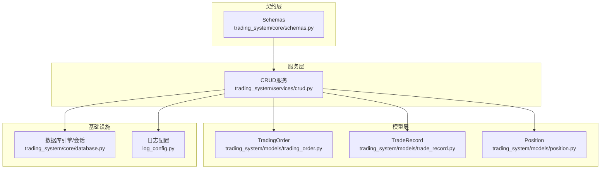
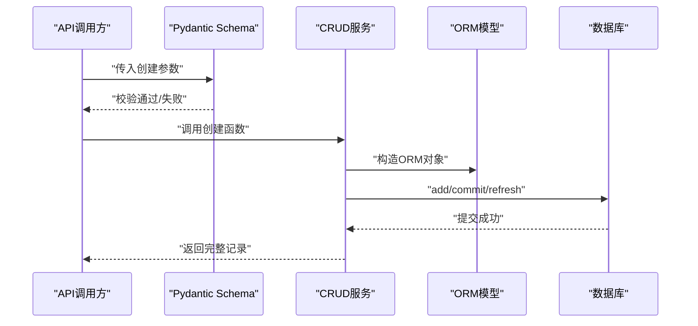
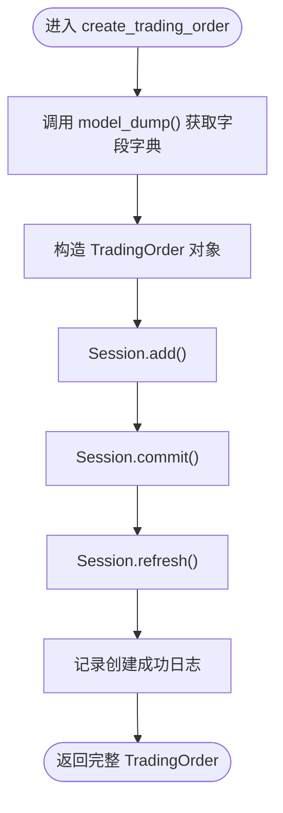
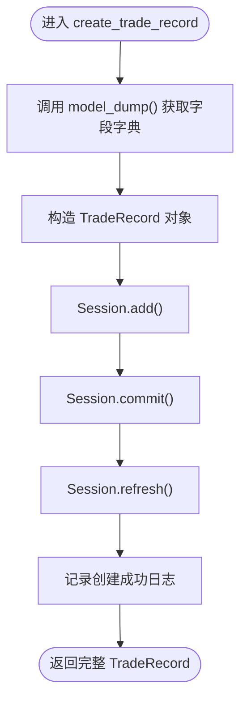
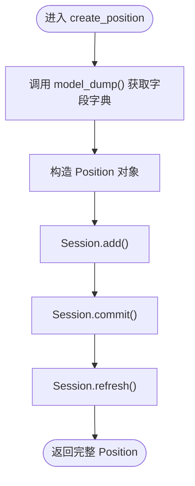
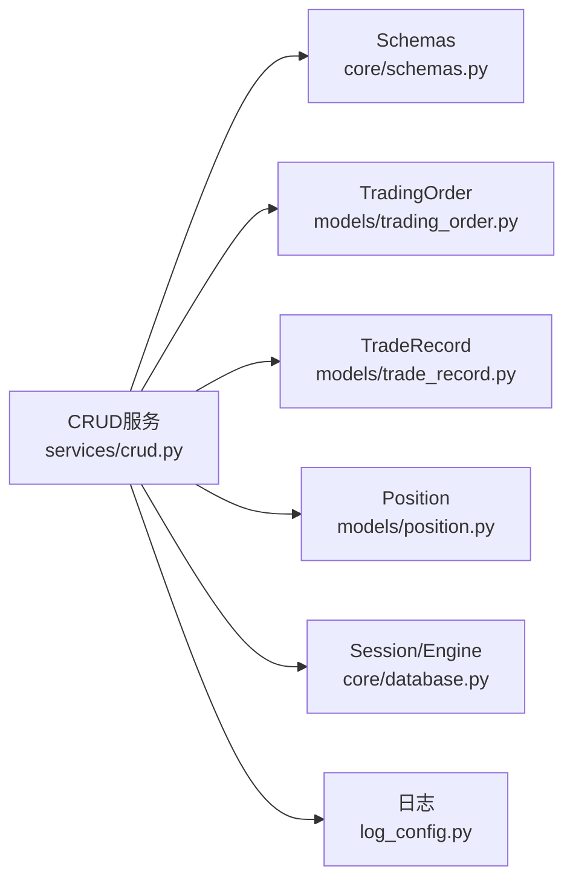

# 创建操作

<cite>
**本文引用的文件**
- [trading_system/models/trading_order.py](file://trading_system/models/trading_order.py)
- [trading_system/models/trade_record.py](file://trading_system/models/trade_record.py)
- [trading_system/models/position.py](file://trading_system/models/position.py)
- [trading_system/services/crud.py](file://trading_system/services/crud.py)
- [trading_system/core/schemas.py](file://trading_system/core/schemas.py)
- [trading_system/core/database.py](file://trading_system/core/database.py)
- [log_config.py](file://log_config.py)
</cite>

## 目录
1. [简介](#简介)
2. [项目结构](#项目结构)
3. [核心组件](#核心组件)
4. [架构总览](#架构总览)
5. [详细组件分析](#详细组件分析)
6. [依赖分析](#依赖分析)
7. [性能考虑](#性能考虑)
8. [故障排查指南](#故障排查指南)
9. [结论](#结论)
10. [附录](#附录)

## 简介
本章节聚焦于交易系统中的“创建”操作，系统性阐述如何通过ORM进行数据创建，包括以下三个核心函数的实现原理与使用方法：
- create_trading_order：创建交易订单
- create_trade_record：创建成交记录
- create_position：创建或更新持仓

文档将覆盖数据验证（Pydantic）、字段映射（ORM模型与Schema）、事务处理（commit/refresh）以及日志记录与错误处理的最佳实践，并给出面向不同交易场景的使用建议。

## 项目结构
围绕创建操作的关键文件组织如下：
- 数据模型层：定义数据库表结构与字段约束
  - trading_system/models/trading_order.py
  - trading_system/models/trade_record.py
  - trading_system/models/position.py
- 数据访问层：封装CRUD逻辑
  - trading_system/services/crud.py
- 数据契约层：Pydantic Schema，用于输入校验与序列化
  - trading_system/core/schemas.py
- 数据库连接与会话管理
  - trading_system/core/database.py
- 日志配置
  - log_config.py

图表来源
- [trading_system/services/crud.py:1-137](file://trading_system/services/crud.py#L1-L137)
- [trading_system/models/trading_order.py:1-43](file://trading_system/models/trading_order.py#L1-L43)
- [trading_system/models/trade_record.py:1-22](file://trading_system/models/trade_record.py#L1-L22)
- [trading_system/models/position.py:1-18](file://trading_system/models/position.py#L1-L18)
- [trading_system/core/schemas.py:1-88](file://trading_system/core/schemas.py#L1-L88)
- [trading_system/core/database.py:1-45](file://trading_system/core/database.py#L1-L45)
- [log_config.py:1-74](file://log_config.py#L1-L74)

章节来源
- [trading_system/services/crud.py:1-137](file://trading_system/services/crud.py#L1-L137)
- [trading_system/core/schemas.py:1-88](file://trading_system/core/schemas.py#L1-L88)
- [trading_system/core/database.py:1-45](file://trading_system/core/database.py#L1-L45)
- [log_config.py:1-74](file://log_config.py#L1-L74)

## 核心组件
本节概览三个创建函数的职责与行为：
- create_trading_order
  - 输入：TradingOrderCreate（Pydantic）
  - 处理：构造ORM对象、add、commit、refresh
  - 输出：完整的TradingOrder记录
- create_trade_record
  - 输入：TradeRecordCreate（Pydantic）
  - 处理：构造ORM对象、add、commit、refresh
  - 输出：完整的TradeRecord记录
- create_position
  - 输入：PositionCreate（Pydantic）
  - 处理：构造ORM对象、add、commit、refresh
  - 输出：完整的Position记录

章节来源
- [trading_system/services/crud.py:9-16](file://trading_system/services/crud.py#L9-L16)
- [trading_system/services/crud.py:48-55](file://trading_system/services/crud.py#L48-L55)
- [trading_system/services/crud.py:72-77](file://trading_system/services/crud.py#L72-L77)

## 架构总览
下图展示了创建流程在各层之间的交互：API层接收请求，经由Schema校验后调用CRUD服务，CRUD服务通过Session执行ORM写入，最终持久化到数据库。

图表来源
- [trading_system/services/crud.py:9-16](file://trading_system/services/crud.py#L9-L16)
- [trading_system/services/crud.py:48-55](file://trading_system/services/crud.py#L48-L55)
- [trading_system/services/crud.py:72-77](file://trading_system/services/crud.py#L72-L77)
- [trading_system/core/schemas.py:16-17](file://trading_system/core/schemas.py#L16-L17)
- [trading_system/core/schemas.py:48-49](file://trading_system/core/schemas.py#L48-L49)
- [trading_system/core/schemas.py:69-70](file://trading_system/core/schemas.py#L69-L70)

## 详细组件分析

### create_trading_order 函数
- 功能定位
  - 将TradingOrderCreate映射为TradingOrder实体并写入数据库
- 数据验证与字段映射
  - 输入类型：TradingOrderCreate（继承自TradingOrderBase）
  - 字段映射：直接使用model_dump()将Pydantic字段转为字典，传入ORM构造函数
- 事务处理
  - add -> commit -> refresh，确保返回带主键与默认值的完整对象
- 日志记录
  - debug：记录创建目标与方向
  - info：记录创建成功及ID
- 错误处理
  - 未在函数内显式捕获异常；异常将向上抛出，由上层框架处理

图表来源
- [trading_system/services/crud.py:9-16](file://trading_system/services/crud.py#L9-L16)
- [trading_system/core/schemas.py:16-17](file://trading_system/core/schemas.py#L16-L17)

章节来源
- [trading_system/services/crud.py:9-16](file://trading_system/services/crud.py#L9-L16)
- [trading_system/core/schemas.py:7-17](file://trading_system/core/schemas.py#L7-L17)

### create_trade_record 函数
- 功能定位
  - 将TradeRecordCreate映射为TradeRecord实体并写入数据库
- 数据验证与字段映射
  - 输入类型：TradeRecordCreate（继承自TradeRecordBase）
  - 字段映射：使用model_dump()传入ORM构造函数
- 事务处理
  - add -> commit -> refresh，保证返回带主键与默认值的完整对象
- 日志记录
  - debug：记录关联订单ID与标的
  - info：记录创建成功及ID

图表来源
- [trading_system/services/crud.py:48-55](file://trading_system/services/crud.py#L48-L55)
- [trading_system/core/schemas.py:48-49](file://trading_system/core/schemas.py#L48-L49)

章节来源
- [trading_system/services/crud.py:48-55](file://trading_system/services/crud.py#L48-L55)
- [trading_system/core/schemas.py:38-50](file://trading_system/core/schemas.py#L38-L50)

### create_position 函数
- 功能定位
  - 将PositionCreate映射为Position实体并写入数据库
- 数据验证与字段映射
  - 输入类型：PositionCreate（继承自PositionBase）
  - 字段映射：使用model_dump()传入ORM构造函数
- 事务处理
  - add -> commit -> refresh，保证返回带主键与默认值的完整对象
- 日志记录
  - 该函数未内置日志记录，可在调用处补充

图表来源
- [trading_system/services/crud.py:72-77](file://trading_system/services/crud.py#L72-L77)
- [trading_system/core/schemas.py:69-70](file://trading_system/core/schemas.py#L69-L70)

章节来源
- [trading_system/services/crud.py:72-77](file://trading_system/services/crud.py#L72-L77)
- [trading_system/core/schemas.py:60-71](file://trading_system/core/schemas.py#L60-L71)

### 数据模型与字段映射要点
- TradingOrder
  - 关键字段：symbol、side、order_type、price、quantity、status等
  - 关系：与TradeRecord通过relationship建立一对多
- TradeRecord
  - 关键字段：order_id（外键）、symbol、side、price、quantity、fee等
  - 关系：与TradingOrder通过relationship建立多对一
- Position
  - 关键字段：symbol、quantity、avg_cost、realized_profit、unrealized_profit、total_fee等

章节来源
- [trading_system/models/trading_order.py:26-42](file://trading_system/models/trading_order.py#L26-L42)
- [trading_system/models/trade_record.py:8-21](file://trading_system/models/trade_record.py#L8-L21)
- [trading_system/models/position.py:6-18](file://trading_system/models/position.py#L6-L18)

### 使用示例与最佳实践（路径指引）
以下示例均以“代码片段路径”形式给出，便于查阅具体实现位置：
- 创建限价买入订单
  - 输入Schema：[TradingOrderCreate:16-17](file://trading_system/core/schemas.py#L16-L17)
  - 调用函数：[create_trading_order:9-16](file://trading_system/services/crud.py#L9-L16)
  - 模型映射：[TradingOrder:26-42](file://trading_system/models/trading_order.py#L26-L42)
- 创建市价卖出成交记录
  - 输入Schema：[TradeRecordCreate:48-49](file://trading_system/core/schemas.py#L48-L49)
  - 调用函数：[create_trade_record:48-55](file://trading_system/services/crud.py#L48-L55)
  - 模型映射：[TradeRecord:8-21](file://trading_system/models/trade_record.py#L8-L21)
- 创建初始持仓
  - 输入Schema：[PositionCreate:69-70](file://trading_system/core/schemas.py#L69-L70)
  - 调用函数：[create_position:72-77](file://trading_system/services/crud.py#L72-L77)
  - 模型映射：[Position:6-18](file://trading_system/models/position.py#L6-L18)

## 依赖分析
- 组件耦合
  - CRUD服务依赖：Session（来自数据库会话工厂）、ORM模型、Pydantic Schema
  - 模型间关系：TradingOrder与TradeRecord存在外键关系
- 外部依赖
  - SQLAlchemy ORM、Pydantic、日志模块
- 事务边界
  - 每个创建函数内部维持独立事务（add -> commit -> refresh）

图表来源
- [trading_system/services/crud.py:1-137](file://trading_system/services/crud.py#L1-L137)
- [trading_system/core/schemas.py:1-88](file://trading_system/core/schemas.py#L1-L88)
- [trading_system/models/trading_order.py:1-43](file://trading_system/models/trading_order.py#L1-L43)
- [trading_system/models/trade_record.py:1-22](file://trading_system/models/trade_record.py#L1-L22)
- [trading_system/models/position.py:1-18](file://trading_system/models/position.py#L1-L18)
- [trading_system/core/database.py:1-45](file://trading_system/core/database.py#L1-L45)
- [log_config.py:1-74](file://log_config.py#L1-L74)

章节来源
- [trading_system/services/crud.py:1-137](file://trading_system/services/crud.py#L1-L137)
- [trading_system/core/database.py:24-34](file://trading_system/core/database.py#L24-L34)

## 性能考虑
- 连接池与会话
  - 数据库引擎配置了连接池参数（pool_size、max_overflow、pool_recycle等），有助于并发下的连接复用与稳定性
- 单次提交
  - 创建函数采用add -> commit -> refresh的最小事务粒度，避免长事务占用资源
- 建议
  - 在批量创建场景中，可考虑合并多次add后一次性commit，减少往返开销
  - 对高频创建的表（如成交记录）可评估索引与分区策略（需结合业务与查询模式）

章节来源
- [trading_system/core/database.py:12-21](file://trading_system/core/database.py#L12-L21)

## 故障排查指南
- 常见问题
  - 字段缺失或类型不匹配：由Pydantic Schema在进入CRUD前拦截，检查对应Create类字段定义
    - [TradingOrderCreate:16-17](file://trading_system/core/schemas.py#L16-L17)
    - [TradeRecordCreate:48-49](file://trading_system/core/schemas.py#L48-L49)
    - [PositionCreate:69-70](file://trading_system/core/schemas.py#L69-L70)
  - 外键约束失败：TradeRecord.order_id必须指向存在的TradingOrder.id
    - [TradeRecord.order_id:12-12](file://trading_system/models/trade_record.py#L12-L12)
    - [TradingOrder.id:29-29](file://trading_system/models/trading_order.py#L29-L29)
  - 事务未提交：确认是否调用了commit；若异常应检查上层try/except
    - [create_trading_order:9-16](file://trading_system/services/crud.py#L9-L16)
    - [create_trade_record:48-55](file://trading_system/services/crud.py#L48-L55)
    - [create_position:72-77](file://trading_system/services/crud.py#L72-L77)
- 日志定位
  - 使用日志模块记录调试与信息级别消息，便于追踪创建流程
    - [log_config.setup_logger:11-56](file://log_config.py#L11-L56)
    - [CRUD函数中的日志调用:9-16](file://trading_system/services/crud.py#L9-L16)

章节来源
- [trading_system/core/schemas.py:16-17](file://trading_system/core/schemas.py#L16-L17)
- [trading_system/core/schemas.py:48-49](file://trading_system/core/schemas.py#L48-L49)
- [trading_system/core/schemas.py:69-70](file://trading_system/core/schemas.py#L69-L70)
- [trading_system/models/trade_record.py:12-12](file://trading_system/models/trade_record.py#L12-L12)
- [trading_system/models/trading_order.py:29-29](file://trading_system/models/trading_order.py#L29-L29)
- [trading_system/services/crud.py:9-16](file://trading_system/services/crud.py#L9-L16)
- [trading_system/services/crud.py:48-55](file://trading_system/services/crud.py#L48-L55)
- [trading_system/services/crud.py:72-77](file://trading_system/services/crud.py#L72-L77)
- [log_config.py:11-56](file://log_config.py#L11-L56)

## 结论
- create_trading_order、create_trade_record、create_position三者遵循一致的创建范式：Schema校验 -> ORM映射 -> add/commit/refresh -> 返回完整记录
- 数据验证由Pydantic承担，字段映射通过model_dump()完成，事务控制清晰可控
- 日志贯穿创建流程，便于问题定位与审计
- 建议在批量场景中优化事务策略，在高频写入场景中关注索引与连接池配置

## 附录
- 会话生命周期与数据库初始化
  - 会话工厂与连接池配置：[SessionLocal/get_db:24-34](file://trading_system/core/database.py#L24-L34)
  - 表初始化：[init_db:37-45](file://trading_system/core/database.py#L37-L45)
- 日志配置
  - 统一日志初始化与格式：[setup_logger:11-56](file://log_config.py#L11-L56)

章节来源
- [trading_system/core/database.py:24-34](file://trading_system/core/database.py#L24-L34)
- [trading_system/core/database.py:37-45](file://trading_system/core/database.py#L37-L45)
- [log_config.py:11-56](file://log_config.py#L11-L56)