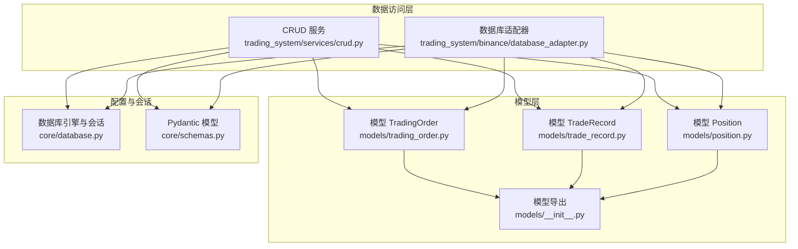
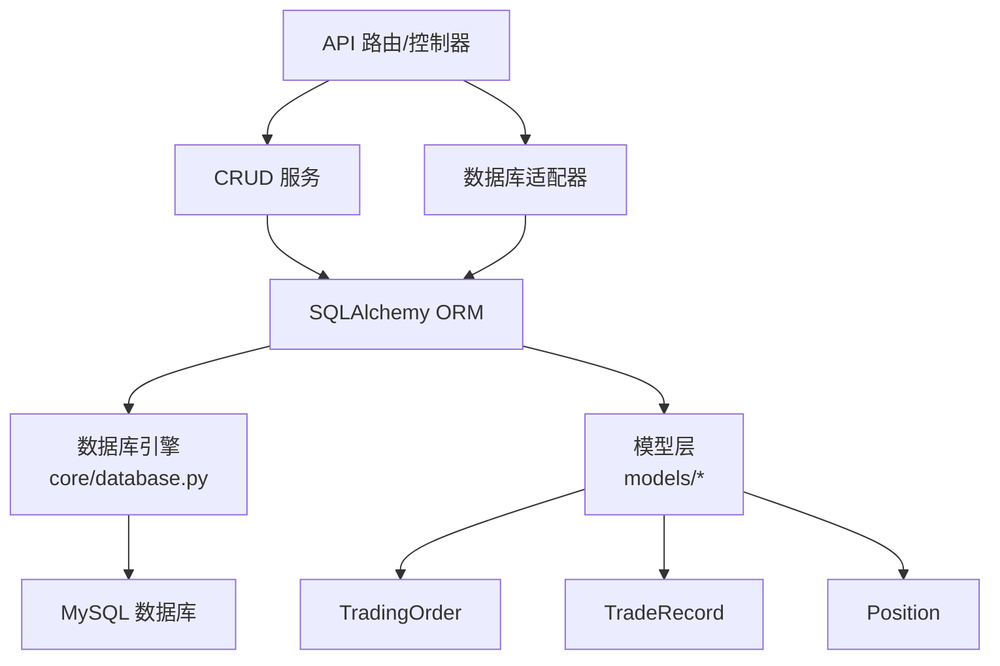
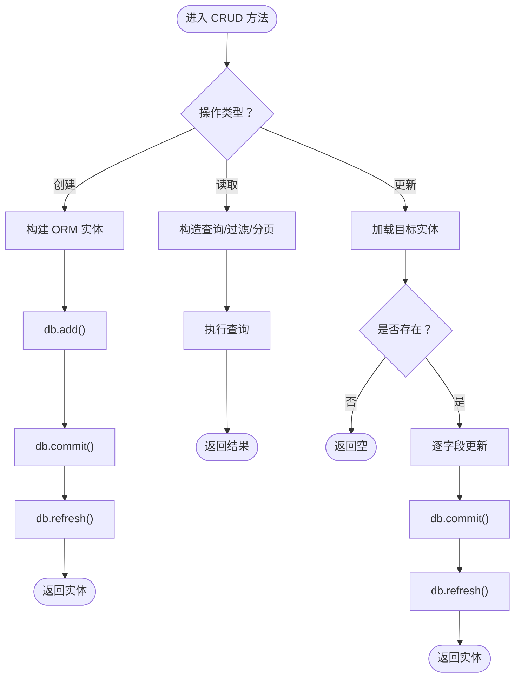
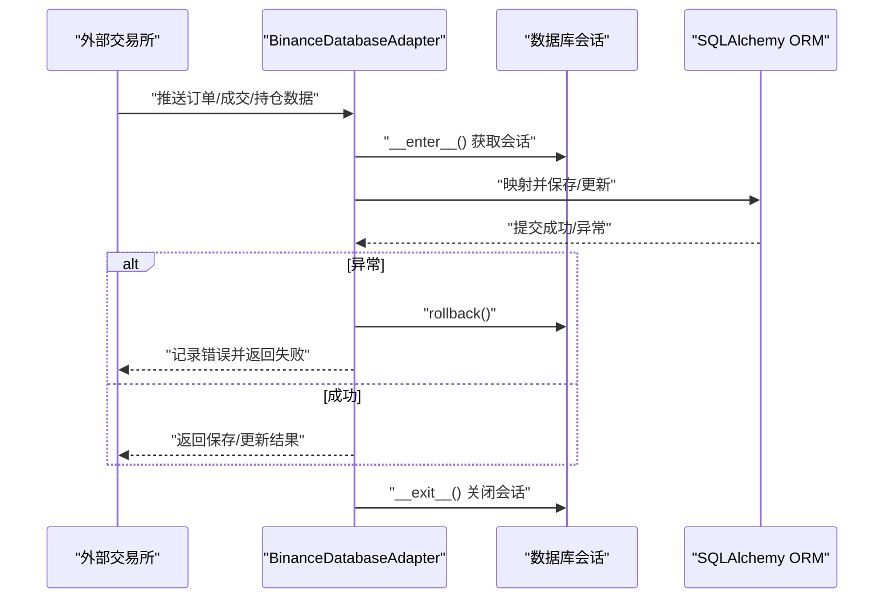
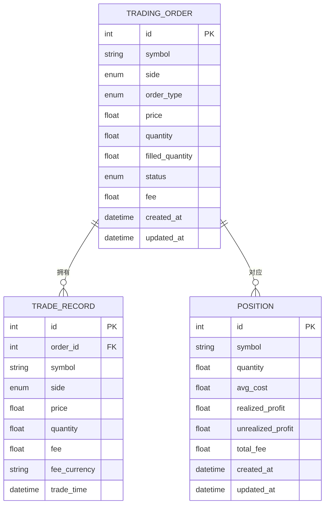
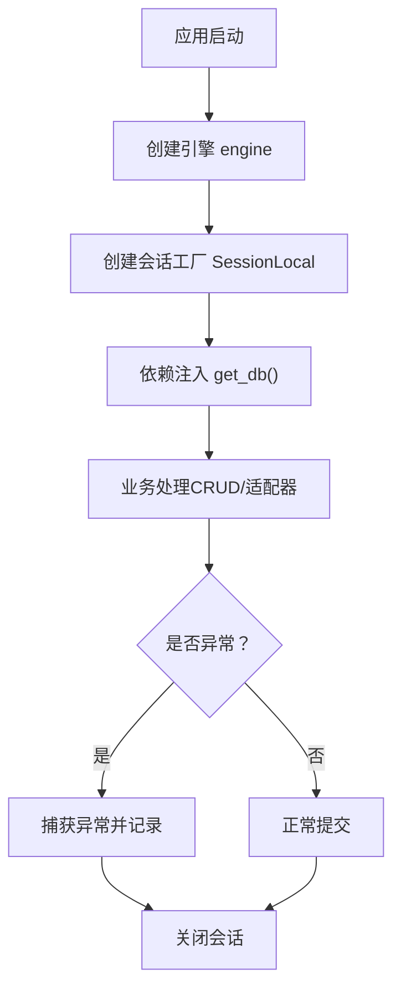
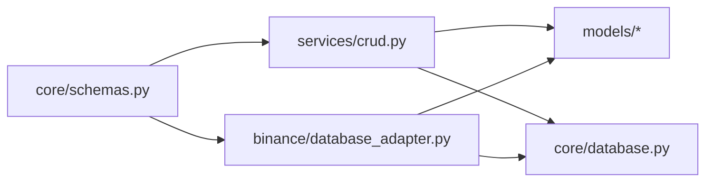

# 数据操作

<cite>
**本文引用的文件**
- [trading_system/services/crud.py](file://trading_system/services/crud.py)
- [trading_system/core/database.py](file://trading_system/core/database.py)
- [trading_system/models/__init__.py](file://trading_system/models/__init__.py)
- [trading_system/models/trading_order.py](file://trading_system/models/trading_order.py)
- [trading_system/models/trade_record.py](file://trading_system/models/trade_record.py)
- [trading_system/models/position.py](file://trading_system/models/position.py)
- [trading_system/core/schemas.py](file://trading_system/core/schemas.py)
- [trading_system/binance/database_adapter.py](file://trading_system/binance/database_adapter.py)
</cite>

## 目录
1. [简介](#简介)
2. [项目结构](#项目结构)
3. [核心组件](#核心组件)
4. [架构总览](#架构总览)
5. [详细组件分析](#详细组件分析)
6. [依赖分析](#依赖分析)
7. [性能考虑](#性能考虑)
8. [故障排查指南](#故障排查指南)
9. [结论](#结论)
10. [附录](#附录)

## 简介
本指南围绕交易系统中的数据操作展开，重点讲解基于 SQLAlchemy 的 ORM 增删改查（CRUD）实现模式与最佳实践。内容涵盖：
- CRUD 服务的通用实现范式：创建、读取、更新、删除
- 查询优化技巧、批量操作与事务处理
- 在交易系统中的实际应用示例路径
- 错误处理、数据验证与并发控制建议

## 项目结构
交易系统采用分层架构，数据访问层由 SQLAlchemy ORM 驱动，模型定义位于 models 子包，数据访问逻辑集中在 services 与适配器模块中；数据库连接池与会话管理由 core/database 提供。

图表来源
- [trading_system/services/crud.py:1-137](file://trading_system/services/crud.py#L1-L137)
- [trading_system/binance/database_adapter.py:1-189](file://trading_system/binance/database_adapter.py#L1-L189)
- [trading_system/models/trading_order.py:1-43](file://trading_system/models/trading_order.py#L1-L43)
- [trading_system/models/trade_record.py:1-22](file://trading_system/models/trade_record.py#L1-L22)
- [trading_system/models/position.py:1-18](file://trading_system/models/position.py#L1-L18)
- [trading_system/models/__init__.py:1-18](file://trading_system/models/__init__.py#L1-L18)
- [trading_system/core/database.py:1-45](file://trading_system/core/database.py#L1-L45)
- [trading_system/core/schemas.py:1-88](file://trading_system/core/schemas.py#L1-L88)

章节来源
- [trading_system/core/database.py:1-45](file://trading_system/core/database.py#L1-L45)
- [trading_system/models/__init__.py:1-18](file://trading_system/models/__init__.py#L1-L18)

## 核心组件
- 数据模型：定义了交易订单、成交记录与持仓的核心字段及索引策略，支撑查询与统计需求。
- Pydantic 模型：用于请求入参校验与响应序列化，确保输入输出一致性。
- CRUD 服务：封装通用的 ORM 操作，提供创建、查询、更新等方法，并处理提交与刷新。
- 数据库适配器：面向外部交易所（如 Binance）的数据落地与状态同步，内置事务回滚与日志记录。
- 会话管理：统一的数据库连接池与 Session 生命周期管理，支持自动提交、超时与回收策略。

章节来源
- [trading_system/models/trading_order.py:1-43](file://trading_system/models/trading_order.py#L1-L43)
- [trading_system/models/trade_record.py:1-22](file://trading_system/models/trade_record.py#L1-L22)
- [trading_system/models/position.py:1-18](file://trading_system/models/position.py#L1-L18)
- [trading_system/core/schemas.py:1-88](file://trading_system/core/schemas.py#L1-L88)
- [trading_system/services/crud.py:1-137](file://trading_system/services/crud.py#L1-L137)
- [trading_system/binance/database_adapter.py:1-189](file://trading_system/binance/database_adapter.py#L1-L189)
- [trading_system/core/database.py:1-45](file://trading_system/core/database.py#L1-L45)

## 架构总览
下图展示了交易系统中数据操作的关键交互：API 层通过服务或适配器调用 ORM，ORM 通过会话与数据库引擎交互，最终持久化到 MySQL。

图表来源
- [trading_system/services/crud.py:1-137](file://trading_system/services/crud.py#L1-L137)
- [trading_system/binance/database_adapter.py:1-189](file://trading_system/binance/database_adapter.py#L1-L189)
- [trading_system/core/database.py:1-45](file://trading_system/core/database.py#L1-L45)
- [trading_system/models/trading_order.py:1-43](file://trading_system/models/trading_order.py#L1-L43)
- [trading_system/models/trade_record.py:1-22](file://trading_system/models/trade_record.py#L1-L22)
- [trading_system/models/position.py:1-18](file://trading_system/models/position.py#L1-L18)

## 详细组件分析

### CRUD 服务（通用数据操作）
- 创建（Create）
  - 使用 Pydantic 模型转换为 ORM 实体，add 后 commit 并 refresh，确保返回最新状态。
  - 示例路径：[创建交易订单:9-16](file://trading_system/services/crud.py#L9-L16)，[创建成交记录:48-55](file://trading_system/services/crud.py#L48-L55)，[创建持仓:72-77](file://trading_system/services/crud.py#L72-L77)。
- 读取（Read）
  - 单条查询：按主键或唯一条件 first()。
  - 列表查询：支持分页 skip/limit，可选过滤 symbol 等字段。
  - 示例路径：[查询单个订单:19-21](file://trading_system/services/crud.py#L19-L21)，[查询订单列表:24-34](file://trading_system/services/crud.py#L24-L34)，[查询成交记录列表:62-69](file://trading_system/services/crud.py#L62-L69)，[查询单个持仓:80-81](file://trading_system/services/crud.py#L80-L81)，[按符号查询持仓:84-85](file://trading_system/services/crud.py#L84-L85)，[查询持仓列表:88-89](file://trading_system/services/crud.py#L88-L89)。
- 更新（Update）
  - 先查询目标实体，再逐字段更新（exclude_unset），最后提交与刷新。
  - 示例路径：[更新订单:37-45](file://trading_system/services/crud.py#L37-L45)，[更新持仓:92-100](file://trading_system/services/crud.py#L92-L100)。
- 删除（Delete）
  - 当前仓库未提供显式的删除函数，可在服务层扩展或通过适配器封装。

图表来源
- [trading_system/services/crud.py:1-137](file://trading_system/services/crud.py#L1-L137)

章节来源
- [trading_system/services/crud.py:1-137](file://trading_system/services/crud.py#L1-L137)

### 数据库适配器（面向外部交易所）
- 事务上下文：使用 with 进入/退出，异常时自动回滚并记录错误。
- 订单同步：根据外部订单号去重，存在则更新状态与已成交数量，否则新增。
- 成交记录与持仓：解析外部数据写入 TradeRecord 与 Position，并提供查询接口。
- 示例路径：[适配器上下文与回滚:20-30](file://trading_system/binance/database_adapter.py#L20-L30)，[保存订单:31-61](file://trading_system/binance/database_adapter.py#L31-L61)，[更新订单状态:76-97](file://trading_system/binance/database_adapter.py#L76-L97)，[保存成交记录:99-126](file://trading_system/binance/database_adapter.py#L99-L126)，[更新持仓:128-161](file://trading_system/binance/database_adapter.py#L128-L161)，[查询持仓:163-176](file://trading_system/binance/database_adapter.py#L163-L176)，[查询所有持仓:178-188](file://trading_system/binance/database_adapter.py#L178-L188)。

图表来源
- [trading_system/binance/database_adapter.py:1-189](file://trading_system/binance/database_adapter.py#L1-L189)

章节来源
- [trading_system/binance/database_adapter.py:1-189](file://trading_system/binance/database_adapter.py#L1-L189)

### 数据模型与关系
- TradingOrder：订单主表，包含方向、类型、状态、已成交数量等字段，并与 TradeRecord 双向关联。
- TradeRecord：成交明细，外键关联订单，记录成交价格、数量、手续费与时间。
- Position：持仓汇总，记录可用数量、成本均价、已实现/未实现盈亏与总手续费。
- 索引策略：symbol 字段建立索引，提升查询效率。

图表来源
- [trading_system/models/trading_order.py:1-43](file://trading_system/models/trading_order.py#L1-L43)
- [trading_system/models/trade_record.py:1-22](file://trading_system/models/trade_record.py#L1-L22)
- [trading_system/models/position.py:1-18](file://trading_system/models/position.py#L1-L18)

章节来源
- [trading_system/models/trading_order.py:1-43](file://trading_system/models/trading_order.py#L1-L43)
- [trading_system/models/trade_record.py:1-22](file://trading_system/models/trade_record.py#L1-L22)
- [trading_system/models/position.py:1-18](file://trading_system/models/position.py#L1-L18)

### 会话与数据库配置
- 连接池参数：pool_size、max_overflow、pool_timeout、pool_recycle、pool_pre_ping 控制连接复用与健康检查。
- 会话生命周期：get_db 作为依赖注入提供者，try/finally 确保关闭。
- 初始化：init_db 统一创建所有表。

图表来源
- [trading_system/core/database.py:1-45](file://trading_system/core/database.py#L1-L45)

章节来源
- [trading_system/core/database.py:1-45](file://trading_system/core/database.py#L1-L45)

## 依赖分析
- 低耦合高内聚：CRUD 服务与适配器分别面向领域与外部集成，职责清晰。
- ORM 映射：模型定义集中于 models，通过 __init__.py 导出，便于统一导入。
- 输入输出：core/schemas 与 ORM 模型解耦，通过 model_dump/exclude_unset 控制字段更新。
- 外部集成：database_adapter 将外部数据映射为 ORM 对象，统一走事务控制。

图表来源
- [trading_system/core/schemas.py:1-88](file://trading_system/core/schemas.py#L1-L88)
- [trading_system/services/crud.py:1-137](file://trading_system/services/crud.py#L1-L137)
- [trading_system/binance/database_adapter.py:1-189](file://trading_system/binance/database_adapter.py#L1-L189)
- [trading_system/models/__init__.py:1-18](file://trading_system/models/__init__.py#L1-L18)
- [trading_system/core/database.py:1-45](file://trading_system/core/database.py#L1-L45)

章节来源
- [trading_system/core/schemas.py:1-88](file://trading_system/core/schemas.py#L1-L88)
- [trading_system/services/crud.py:1-137](file://trading_system/services/crud.py#L1-L137)
- [trading_system/binance/database_adapter.py:1-189](file://trading_system/binance/database_adapter.py#L1-L189)
- [trading_system/models/__init__.py:1-18](file://trading_system/models/__init__.py#L1-L18)
- [trading_system/core/database.py:1-45](file://trading_system/core/database.py#L1-L45)

## 性能考虑
- 查询优化
  - 为高频过滤字段（如 symbol）建立索引，减少全表扫描。
  - 分页查询使用 offset/limit，避免一次性拉取大量数据。
  - 条件查询尽量使用等值匹配与索引列，避免在 WHERE 中对列做函数运算。
- 批量操作
  - 大量插入/更新建议使用 bulk_save_objects 或原生 SQL 批处理，降低 ORM 开销。
  - 注意批量操作的事务边界，避免长时间持有锁。
- 事务与并发
  - 使用 SessionLocal 管理会话，确保每个请求独立会话。
  - 对关键写操作（如订单状态变更、持仓更新）使用 with 上下文保证回滚。
  - 对热点数据采用乐观锁（版本号）或悲观锁（select ... for update）控制并发。
- 连接池
  - 合理设置 pool_size 与 max_overflow，结合 pool_pre_ping 与 pool_recycle 提升稳定性。

## 故障排查指南
- 会话与连接
  - 若出现“会话未关闭”导致连接泄漏，检查依赖注入与 finally 分支是否执行。
  - 连接池耗尽：检查 pool_size 与并发峰值，必要时增大或优化查询。
- 事务回滚
  - 适配器在异常时自动 rollback，确认异常被捕获并记录日志。
  - 对外数据同步失败时，优先检查映射逻辑与字段类型。
- 数据一致性
  - 更新订单状态与已成交数量需原子性，避免竞态条件。
  - 持仓更新涉及买入/卖出与成本均价计算，需确保数值校验与精度处理。

章节来源
- [trading_system/core/database.py:24-34](file://trading_system/core/database.py#L24-L34)
- [trading_system/binance/database_adapter.py:24-30](file://trading_system/binance/database_adapter.py#L24-L30)
- [trading_system/binance/database_adapter.py:58-61](file://trading_system/binance/database_adapter.py#L58-L61)
- [trading_system/binance/database_adapter.py:94-97](file://trading_system/binance/database_adapter.py#L94-L97)

## 结论
本项目以 SQLAlchemy 为核心实现了完整的数据操作体系：通过 Pydantic 模型完成输入校验，通过 CRUD 服务与适配器实现标准化的 ORM 操作，并以事务与连接池保障可靠性与性能。遵循本文的查询优化、批量处理与并发控制建议，可在交易系统中稳定地支撑订单、成交与持仓等核心业务场景。

## 附录
- 实战示例路径（不展示具体代码，仅给出定位）
  - 创建订单：[创建交易订单:9-16](file://trading_system/services/crud.py#L9-L16)
  - 查询订单列表：[查询订单列表:24-34](file://trading_system/services/crud.py#L24-L34)
  - 更新订单状态：[更新订单:37-45](file://trading_system/services/crud.py#L37-L45)
  - 保存成交记录：[保存成交记录:99-126](file://trading_system/binance/database_adapter.py#L99-L126)
  - 更新持仓：[更新持仓:128-161](file://trading_system/binance/database_adapter.py#L128-L161)
  - 读取单个持仓：[查询单个持仓:80-81](file://trading_system/services/crud.py#L80-L81)
  - 读取按符号持仓：[按符号查询持仓:84-85](file://trading_system/services/crud.py#L84-L85)
  - 会话初始化与关闭：[会话提供与清理:24-34](file://trading_system/core/database.py#L24-L34)
  - 表初始化：[初始化数据库表:37-45](file://trading_system/core/database.py#L37-L45)