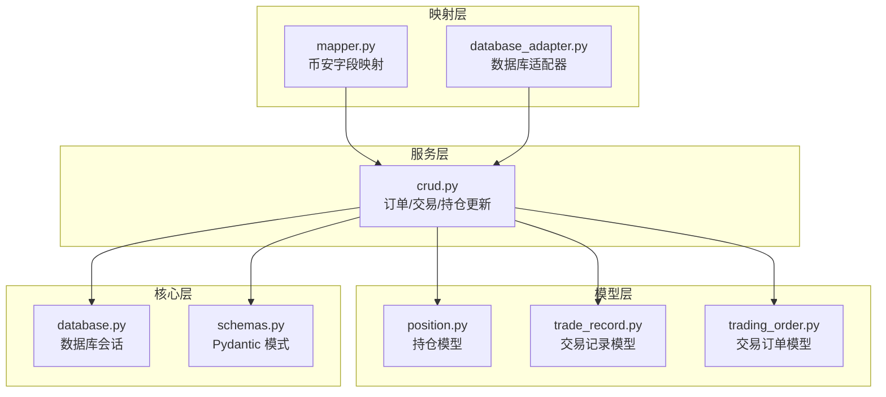
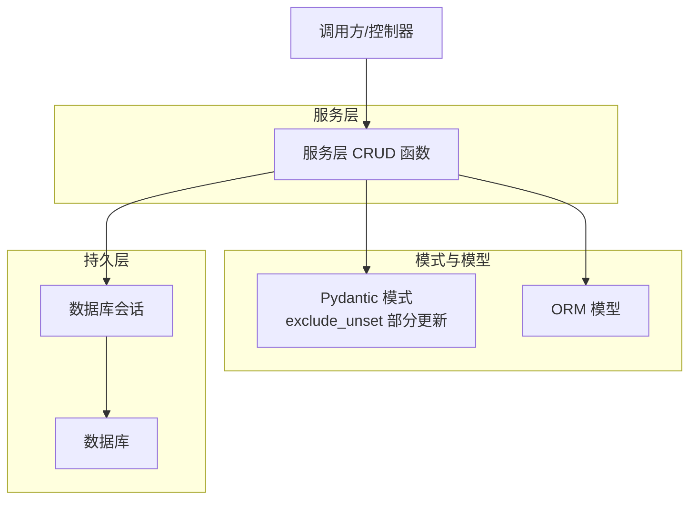
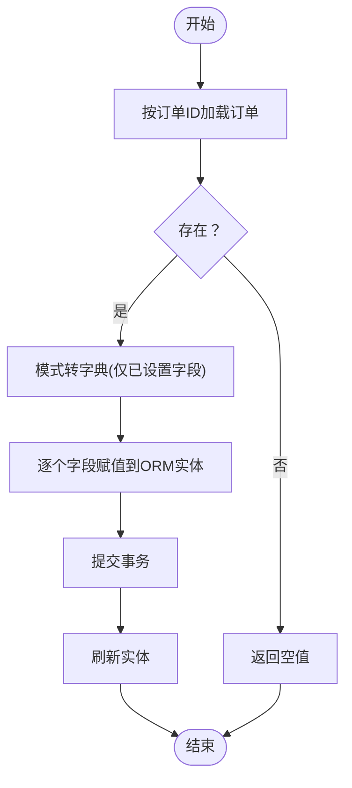
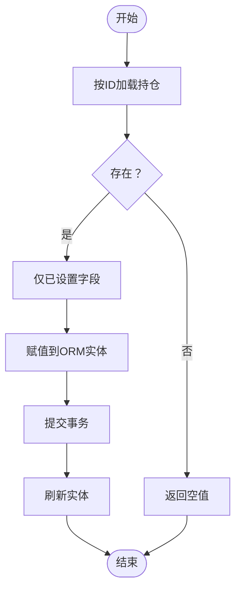
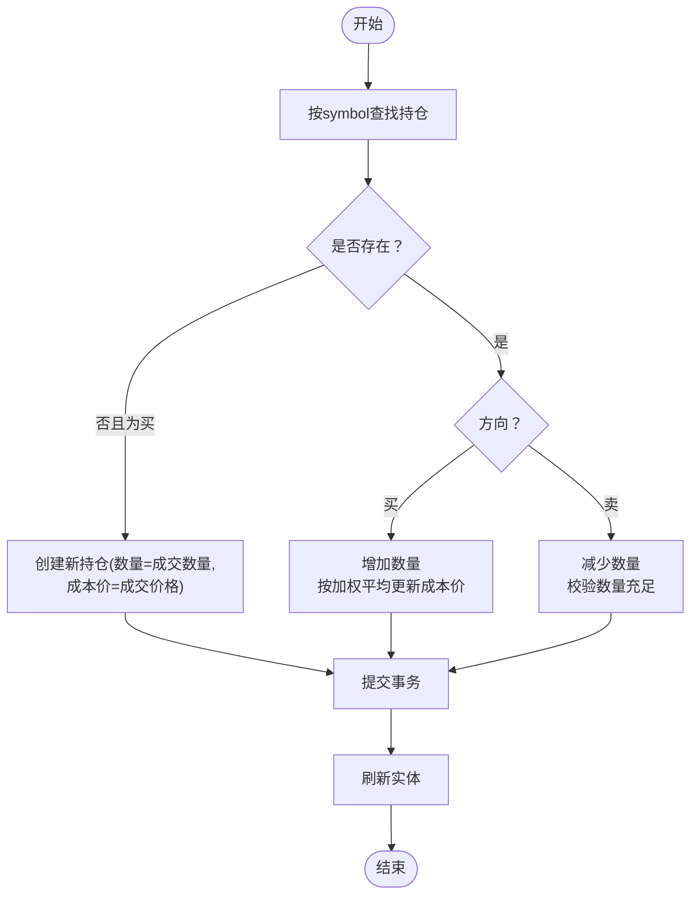
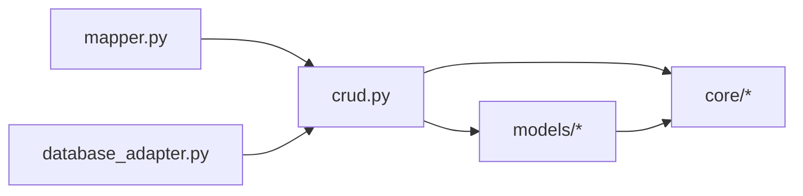

# 更新操作

<cite>
**本文引用的文件**
- [crud.py](file://trading_system/services/crud.py)
- [position.py](file://trading_system/models/position.py)
- [trade_record.py](file://trading_system/models/trade_record.py)
- [trading_order.py](file://trading_system/models/trading_order.py)
- [database.py](file://trading_system/core/database.py)
- [schemas.py](file://trading_system/core/schemas.py)
- [mapper.py](file://trading_system/binance/mapper.py)
- [database_adapter.py](file://trading_system/binance/database_adapter.py)
</cite>

## 目录
1. [引言](#引言)
2. [项目结构](#项目结构)
3. [核心组件](#核心组件)
4. [架构总览](#架构总览)
5. [详细组件分析](#详细组件分析)
6. [依赖关系分析](#依赖关系分析)
7. [性能考量](#性能考量)
8. [故障排查指南](#故障排查指南)
9. [结论](#结论)
10. [附录](#附录)

## 引言
本文件聚焦于系统中基于 ORM 的数据更新操作，特别是以下三个关键函数：update_trading_order（订单更新）、update_position（持仓更新）与 update_position_on_trade（基于交易事件的动态持仓更新）。文档将从实现原理、部分更新策略、字段映射、事务处理、并发控制、错误处理到性能优化与最佳实践进行全面阐述，并辅以流程图与时序图帮助理解。

## 项目结构
围绕更新操作的关键模块分布如下：
- 服务层：提供 CRUD 操作入口与业务逻辑封装
- 模型层：定义数据库实体及字段约束
- 核心层：数据库会话管理与模式定义
- 映射层：数据适配与字段映射工具

图表来源
- [crud.py:1-150](file://trading_system/services/crud.py#L1-L150)
- [position.py:1-200](file://trading_system/models/position.py#L1-L200)
- [trade_record.py:1-200](file://trading_system/models/trade_record.py#L1-L200)
- [trading_order.py:1-200](file://trading_system/models/trading_order.py#L1-L200)
- [database.py:1-120](file://trading_system/core/database.py#L1-L120)
- [schemas.py:1-200](file://trading_system/core/schemas.py#L1-L200)
- [mapper.py:1-200](file://trading_system/binance/mapper.py#L1-L200)
- [database_adapter.py:1-200](file://trading_system/binance/database_adapter.py#L1-L200)

章节来源
- [crud.py:1-150](file://trading_system/services/crud.py#L1-L150)
- [database.py:1-120](file://trading_system/core/database.py#L1-L120)

## 核心组件
- 订单更新：通过部分更新机制仅写入变更字段，减少写放大与锁竞争。
- 持仓更新：支持按 ID 精确更新，结合查询结果进行增量字段覆盖。
- 基于交易的动态持仓更新：根据买卖方向、价格、数量与手续费动态调整可用数量与成本均价，确保实时性与一致性。

章节来源
- [crud.py:38-110](file://trading_system/services/crud.py#L38-L110)

## 架构总览
下图展示了更新操作在各层之间的交互关系与数据流：

图表来源
- [crud.py:38-110](file://trading_system/services/crud.py#L38-L110)
- [schemas.py:1-200](file://trading_system/core/schemas.py#L1-L200)
- [database.py:1-120](file://trading_system/core/database.py#L1-L120)

## 详细组件分析

### update_trading_order 实现原理
- 输入参数：订单 ID 与部分更新模式对象（仅携带已设置字段）
- 处理流程：
  - 查询订单是否存在；不存在则返回空值
  - 使用模式的 exclude_unset=True 将只读取已显式设置的字段
  - 遍历键值对并逐个赋给 ORM 实体属性
  - 提交事务并刷新实体以返回最新状态
- 字段映射：由 Pydantic 模式负责字段校验与映射，避免脏数据进入数据库
- 并发控制：默认使用 SQLAlchemy 会话级隔离；如需强一致可引入行级锁或版本号乐观锁
- 错误处理：若订单不存在直接返回空，调用方可据此决定是否抛错或重试

图表来源
- [crud.py:38-45](file://trading_system/services/crud.py#L38-L45)
- [schemas.py:1-200](file://trading_system/core/schemas.py#L1-L200)

章节来源
- [crud.py:38-45](file://trading_system/services/crud.py#L38-L45)

### update_position 实现原理
- 输入参数：持仓 ID 与部分更新模式对象
- 处理流程：
  - 查询目标持仓；不存在则返回空
  - 对更新模式执行 exclude_unset=True，仅应用已设置字段
  - 赋值后提交并刷新
- 适用场景：按需更新单个持仓字段（如冻结数量、状态等），避免全量覆盖

图表来源
- [crud.py:92-100](file://trading_system/services/crud.py#L92-L100)

章节来源
- [crud.py:92-100](file://trading_system/services/crud.py#L92-L100)

### update_position_on_trade 复杂业务逻辑
该函数在交易发生时动态维护持仓，核心逻辑如下：
- 查询目标标的的现有持仓
- 若无持仓且为买入，则创建新持仓，初始数量为成交数量，成本价为成交价格
- 若已有持仓：
  - 买入：增加数量并按加权平均法更新成本价；手续费可计入成本或单独处理视业务而定
  - 卖出：减少数量；若数量不足则返回失败
- 提交事务并刷新实体
- 返回更新后的持仓或空值（表示失败）

图表来源
- [crud.py:103-140](file://trading_system/services/crud.py#L103-L140)

章节来源
- [crud.py:103-140](file://trading_system/services/crud.py#L103-L140)

### 事务处理与并发控制
- 事务边界：每个更新操作均在单次会话内完成，先查询、再赋值、最后提交
- 并发控制建议：
  - 行级锁：在查询时添加 FOR UPDATE（如需要强一致性）
  - 版本号乐观锁：为模型增加版本字段，冲突时重试
  - 分布式锁：跨进程/多实例场景下使用 Redis 或数据库锁
- 错误处理：
  - 订单/持仓不存在：返回空值，调用方应判断并处理
  - 数量不足（卖出）：返回空值或抛出业务异常
  - 数据库异常：捕获 SQLAlchemy 异常并回滚，必要时重试

章节来源
- [crud.py:38-45](file://trading_system/services/crud.py#L38-L45)
- [crud.py:92-100](file://trading_system/services/crud.py#L92-L100)
- [crud.py:103-140](file://trading_system/services/crud.py#L103-L140)

### 字段映射与模式设计
- 部分更新：通过 Pydantic 模式的 exclude_unset=True 实现，仅将已设置字段写入数据库，降低写放大与锁竞争
- 字段校验：模式负责类型校验与默认值处理，避免脏数据进入 ORM 层
- 映射层：币安适配器与映射模块负责外部数据到内部模型的字段映射，保证一致性

章节来源
- [schemas.py:1-200](file://trading_system/core/schemas.py#L1-L200)
- [mapper.py:1-200](file://trading_system/binance/mapper.py#L1-L200)
- [database_adapter.py:1-200](file://trading_system/binance/database_adapter.py#L1-L200)

## 依赖关系分析
- 服务层依赖模型层与核心层（会话与模式）
- 模型层依赖数据库层（表结构与约束）
- 映射层为外部数据源提供字段转换能力
- 三者耦合度低，职责清晰，便于扩展与测试

图表来源
- [crud.py:1-150](file://trading_system/services/crud.py#L1-L150)
- [position.py:1-200](file://trading_system/models/position.py#L1-L200)
- [trade_record.py:1-200](file://trading_system/models/trade_record.py#L1-L200)
- [trading_order.py:1-200](file://trading_system/models/trading_order.py#L1-L200)
- [mapper.py:1-200](file://trading_system/binance/mapper.py#L1-L200)
- [database_adapter.py:1-200](file://trading_system/binance/database_adapter.py#L1-L200)

章节来源
- [crud.py:1-150](file://trading_system/services/crud.py#L1-L150)

## 性能考量
- 部分更新优先：仅写入变更字段，减少 IO 与锁持有时间
- 批量更新：对于高频更新场景，可合并多次更新为单事务批量提交
- 索引优化：为常用过滤字段（如 symbol、order_id）建立索引
- 会话复用：避免频繁创建/销毁会话，减少连接开销
- 缓存策略：对热点数据（如最新持仓）进行缓存，降低数据库压力
- 异步化：在不影响一致性的场景下，采用异步写入队列

## 故障排查指南
- 订单/持仓不存在：检查 ID 是否正确、数据是否已创建
- 写入失败：确认字段类型与范围、触发器/约束是否被满足
- 并发冲突：启用乐观锁或行级锁；增加重试与退避策略
- 事务未提交：确保在异常分支中进行回滚
- 字段映射错误：核对映射规则与字段名称一致性

章节来源
- [crud.py:38-45](file://trading_system/services/crud.py#L38-L45)
- [crud.py:92-100](file://trading_system/services/crud.py#L92-L100)
- [crud.py:103-140](file://trading_system/services/crud.py#L103-L140)

## 结论
通过对 update_trading_order、update_position 与 update_position_on_trade 的深入解析，可以看出系统在更新操作上遵循“部分更新 + 模式校验 + 明确事务边界”的设计原则。配合合理的并发控制与性能优化策略，能够在高并发交易场景中保持数据一致性与系统稳定性。建议在生产环境中结合版本号乐观锁与必要的索引优化，持续监控更新延迟与冲突率，以进一步提升吞吐与可靠性。

## 附录
- 示例场景（描述性，非代码）：
  - 订单部分更新：仅更新状态字段，其他字段保持不变
  - 持仓字段更新：仅更新冻结数量或状态，不改变历史成本
  - 动态持仓更新：买入增加数量并更新成本价，卖出减少数量并校验可用性
- 最佳实践清单：
  - 使用部分更新模式，避免全量覆盖
  - 在关键路径上启用行级锁或乐观锁
  - 为热点字段建立索引
  - 合理设置事务超时与重试策略
  - 对外暴露幂等接口，避免重复提交造成副作用