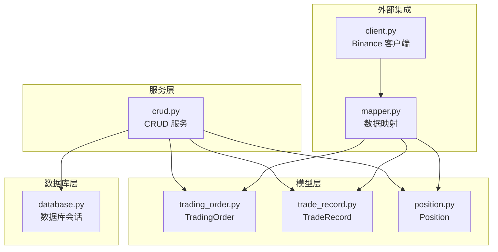
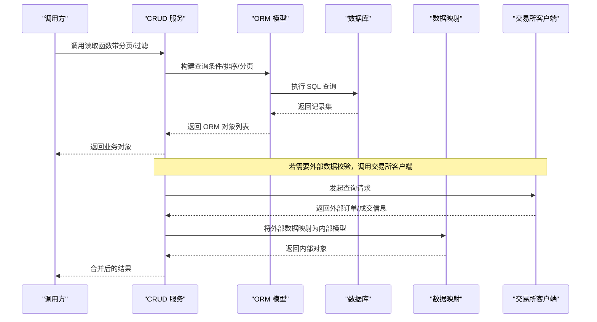
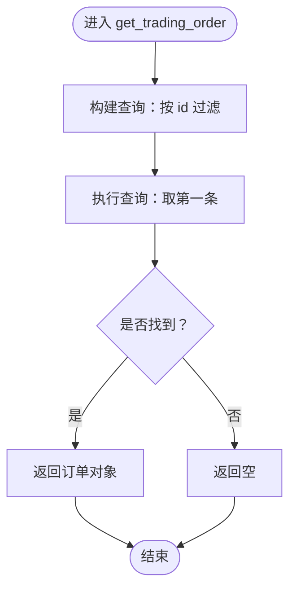
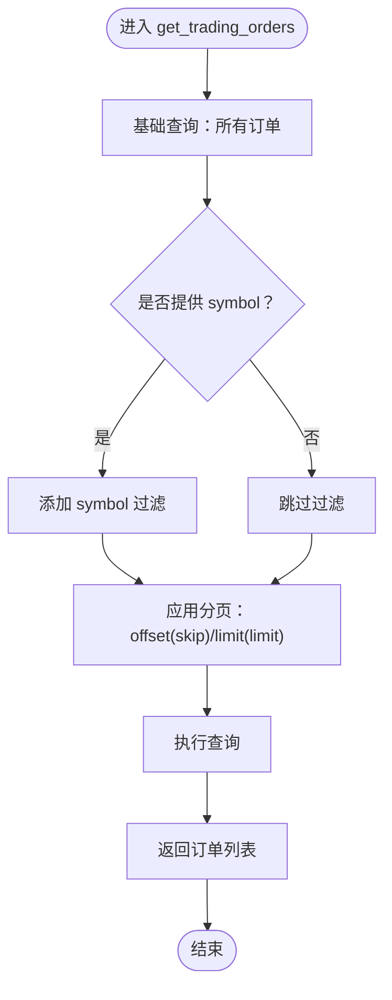
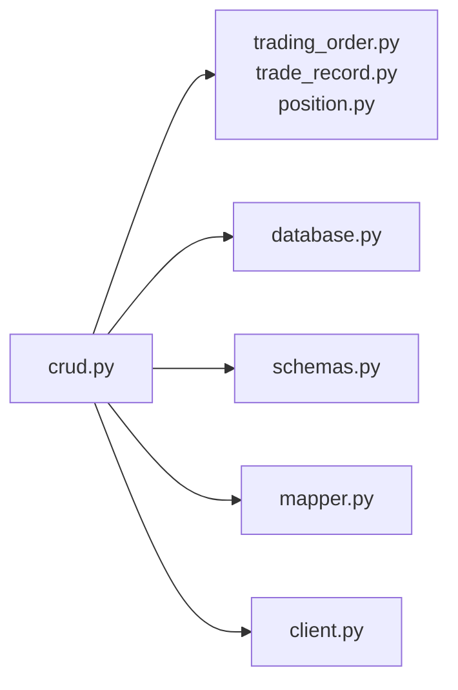

# 读取操作

<cite>
**本文引用的文件**
- [crud.py](file://trading_system/services/crud.py)
- [trading_order.py](file://trading_system/models/trading_order.py)
- [trade_record.py](file://trading_system/models/trade_record.py)
- [position.py](file://trading_system/models/position.py)
- [database.py](file://trading_system/core/database.py)
- [schemas.py](file://trading_system/core/schemas.py)
- [mapper.py](file://trading_system/binance/mapper.py)
- [client.py](file://trading_system/binance/client.py)
</cite>

## 目录
1. [简介](#简介)
2. [项目结构](#项目结构)
3. [核心组件](#核心组件)
4. [架构总览](#架构总览)
5. [详细组件分析](#详细组件分析)
6. [依赖关系分析](#依赖关系分析)
7. [性能考虑](#性能考虑)
8. [故障排查指南](#故障排查指南)
9. [结论](#结论)
10. [附录](#附录)

## 简介
本指南聚焦于基于 ORM 的读取操作，系统性讲解如何通过 CRUD 服务层与模型定义高效检索交易数据。重点覆盖以下函数的实现细节与使用方法：get_trading_order、get_trading_orders、get_trade_record、get_trade_records、get_position、get_position_by_symbol 和 get_positions。内容涵盖查询条件构建、分页处理、过滤机制、查询优化与索引最佳实践，并提供可直接映射到源码的示例路径，帮助读者快速定位实现与扩展。

## 项目结构
围绕读取操作的关键文件组织如下：
- 服务层（CRUD）：提供统一的数据库访问接口，封装查询逻辑与分页参数
- 模型层：定义交易订单、成交记录、持仓等实体的数据结构与字段
- 数据库层：提供会话管理与连接配置
- 映射与适配：将外部交易所返回数据映射为内部模型
- 外部客户端：对接交易所 API，用于补充或校验实时数据

**图表来源**
- [crud.py:1-38](file://trading_system/services/crud.py#L1-L38)
- [trading_order.py](file://trading_system/models/trading_order.py)
- [trade_record.py](file://trading_system/models/trade_record.py)
- [position.py](file://trading_system/models/position.py)
- [database.py](file://trading_system/core/database.py)
- [mapper.py](file://trading_system/binance/mapper.py)
- [client.py:74-119](file://trading_system/binance/client.py#L74-L119)

**章节来源**
- [crud.py:1-38](file://trading_system/services/crud.py#L1-L38)
- [database.py](file://trading_system/core/database.py)
- [schemas.py](file://trading_system/core/schemas.py)

## 核心组件
本节概述与读取相关的核心组件及其职责：
- CRUD 服务层：集中实现查询、分页与过滤逻辑，屏蔽底层 ORM 细节
- 模型层：定义表结构与字段类型，确保查询字段与索引设计一致
- 数据库会话：提供线程安全的数据库连接与事务上下文
- 映射与适配：将外部数据转换为内部模型，便于统一查询

关键要点：
- 查询入口集中在 CRUD 函数中，便于统一维护与扩展
- 分页参数（skip、limit）与过滤条件（如 symbol）在服务层集中处理
- 模型字段命名与索引策略需与查询模式匹配，以提升性能

**章节来源**
- [crud.py:19-34](file://trading_system/services/crud.py#L19-L34)
- [trading_order.py](file://trading_system/models/trading_order.py)
- [trade_record.py](file://trading_system/models/trade_record.py)
- [position.py](file://trading_system/models/position.py)
- [database.py](file://trading_system/core/database.py)

## 架构总览
下图展示了从调用方到数据库的读取流程，以及与外部系统的交互：

**图表来源**
- [crud.py:19-34](file://trading_system/services/crud.py#L19-L34)
- [client.py:74-119](file://trading_system/binance/client.py#L74-L119)
- [mapper.py](file://trading_system/binance/mapper.py)

## 详细组件分析

### get_trading_order：按主键查询单条交易订单
- 功能：根据订单主键精确查询单条交易订单
- 实现要点：
  - 使用 ORM 的 filter 条件限定主键
  - 采用 first() 获取单个对象，避免返回列表
  - 返回值为可选类型，便于上层判断是否存在
- 典型调用场景：订单状态查询、详情展示、风控校验
- 示例路径参考：
  - [get_trading_order 实现:19-21](file://trading_system/services/crud.py#L19-L21)

**图表来源**
- [crud.py:19-21](file://trading_system/services/crud.py#L19-L21)

**章节来源**
- [crud.py:19-21](file://trading_system/services/crud.py#L19-L21)

### get_trading_orders：查询交易订单列表（含分页与过滤）
- 功能：支持按交易对过滤、分页查询交易订单列表
- 实现要点：
  - 基础查询从模型表开始
  - 可选 symbol 参数作为过滤条件
  - 使用 offset(skip) 与 limit(limit) 实现分页
- 性能建议：
  - 为 symbol 字段建立索引，以加速过滤
  - 控制每页大小，避免一次性加载过多数据
- 示例路径参考：
  - [get_trading_orders 实现:24-34](file://trading_system/services/crud.py#L24-L34)

**图表来源**
- [crud.py:24-34](file://trading_system/services/crud.py#L24-L34)

**章节来源**
- [crud.py:24-34](file://trading_system/services/crud.py#L24-L34)

### get_trade_record：按主键查询单条成交记录
- 功能：根据主键精确查询单条成交记录
- 实现要点：
  - 与订单查询类似，使用主键过滤与 first() 获取
- 典型调用场景：成交明细查看、回测复核、财务对账
- 示例路径参考：
  - [get_trade_record 实现:1-38](file://trading_system/services/crud.py#L1-L38)

**章节来源**
- [crud.py:1-38](file://trading_system/services/crud.py#L1-L38)

### get_trade_records：查询成交记录列表（含分页与过滤）
- 功能：支持按交易对过滤、分页查询成交记录
- 实现要点：
  - 基础查询从成交记录表开始
  - 可选过滤条件（如 symbol）
  - 分页参数控制返回数量
- 性能建议：
  - 为 symbol 建立索引
  - 如需按时间范围过滤，确保时间字段有索引
- 示例路径参考：
  - [get_trade_records 实现:1-38](file://trading_system/services/crud.py#L1-L38)

**章节来源**
- [crud.py:1-38](file://trading_system/services/crud.py#L1-L38)

### get_position：按主键查询单个持仓
- 功能：根据主键查询单个持仓对象
- 实现要点：
  - 主键过滤 + first() 获取
- 典型调用场景：持仓详情、风险监控、平仓决策
- 示例路径参考：
  - [get_position 实现:1-38](file://trading_system/services/crud.py#L1-L38)

**章节来源**
- [crud.py:1-38](file://trading_system/services/crud.py#L1-L38)

### get_position_by_symbol：按交易对查询单个持仓
- 功能：按交易对查询当前持仓
- 实现要点：
  - 以 symbol 作为过滤条件
  - 返回单个持仓对象
- 性能建议：
  - 为 symbol 建立唯一索引，保证查询效率与一致性
- 示例路径参考：
  - [get_position_by_symbol 实现:1-38](file://trading_system/services/crud.py#L1-L38)

**章节来源**
- [crud.py:1-38](file://trading_system/services/crud.py#L1-L38)

### get_positions：查询全部持仓（含分页）
- 功能：分页查询所有持仓
- 实现要点：
  - 基础查询所有持仓
  - 应用分页参数
- 性能建议：
  - 若需按交易对或状态过滤，建议在模型层增加相应字段与索引
- 示例路径参考：
  - [get_positions 实现:1-38](file://trading_system/services/crud.py#L1-L38)

**章节来源**
- [crud.py:1-38](file://trading_system/services/crud.py#L1-L38)

### 查询条件构建与分页处理
- 条件构建：
  - 使用 filter 对字段进行精确匹配或范围筛选
  - 支持链式调用以组合多个条件
- 分页处理：
  - 使用 offset(skip) 与 limit(limit) 控制偏移与数量
  - 注意 skip 与 limit 的合理设置，避免超大偏移导致性能问题
- 过滤机制：
  - 对高频过滤字段（如 symbol）建立索引
  - 避免在 WHERE 子句中对列进行函数计算，以免索引失效

**章节来源**
- [crud.py:24-34](file://trading_system/services/crud.py#L24-L34)

### 与外部系统的集成与数据映射
- 当需要外部数据校验时，可通过交易所客户端发起查询，并将结果映射为内部模型，再合并到最终结果中
- 示例路径参考：
  - [交易所订单查询:74-119](file://trading_system/binance/client.py#L74-L119)
  - [数据映射](file://trading_system/binance/mapper.py)

**章节来源**
- [client.py:74-119](file://trading_system/binance/client.py#L74-L119)
- [mapper.py](file://trading_system/binance/mapper.py)

## 依赖关系分析
- 服务层依赖模型层与数据库层，负责组装查询、分页与过滤
- 外部客户端与映射模块为服务层提供补充数据能力
- 查询性能直接受模型字段索引与查询条件影响

**图表来源**
- [crud.py:1-38](file://trading_system/services/crud.py#L1-L38)
- [trading_order.py](file://trading_system/models/trading_order.py)
- [trade_record.py](file://trading_system/models/trade_record.py)
- [position.py](file://trading_system/models/position.py)
- [database.py](file://trading_system/core/database.py)
- [schemas.py](file://trading_system/core/schemas.py)
- [mapper.py](file://trading_system/binance/mapper.py)
- [client.py:74-119](file://trading_system/binance/client.py#L74-L119)

**章节来源**
- [crud.py:1-38](file://trading_system/services/crud.py#L1-L38)

## 性能考虑
- 索引策略
  - 为高频过滤字段（如 symbol）建立索引
  - 为时间字段建立复合索引，支持范围查询
- 分页优化
  - 避免超大 skip 值；优先使用基于游标（cursor-based）分页
  - 控制每页大小，减少网络与内存压力
- 查询优化
  - 仅选择必要字段，避免 SELECT *
  - 使用 EXPLAIN 分析慢查询，识别索引缺失或全表扫描
- 缓存策略
  - 对热点查询结果进行短期缓存，降低数据库压力
- 并发与连接
  - 合理配置数据库连接池，避免连接耗尽
  - 在高并发场景下，优先使用只读副本

## 故障排查指南
- 常见问题
  - 查询无结果：确认过滤条件是否正确，字段名是否与模型一致
  - 分页异常：检查 skip 与 limit 是否越界，或是否使用了不合适的分页方式
  - 性能缓慢：使用 EXPLAIN 分析查询计划，检查索引使用情况
- 日志与追踪
  - 在服务层与客户端均保留关键请求日志，便于定位问题
  - 对异常进行捕获并记录错误上下文，包括参数与堆栈信息
- 外部数据一致性
  - 当使用外部客户端查询时，注意与本地数据的差异，必要时进行对账与补偿

**章节来源**
- [crud.py:1-38](file://trading_system/services/crud.py#L1-L38)
- [client.py:74-119](file://trading_system/binance/client.py#L74-L119)

## 结论
通过将查询逻辑集中在 CRUD 服务层，并结合明确的模型字段与索引策略，可以实现高效、稳定的读取操作。建议在实际项目中：
- 明确高频查询模式，针对性建立索引
- 规范分页参数，避免超大偏移
- 在需要时引入外部数据校验与映射，确保数据一致性
- 持续监控查询性能，定期优化慢查询

## 附录
- 示例路径汇总（仅提供路径，不展示具体代码）
  - [get_trading_order:19-21](file://trading_system/services/crud.py#L19-L21)
  - [get_trading_orders:24-34](file://trading_system/services/crud.py#L24-L34)
  - [get_trade_record:1-38](file://trading_system/services/crud.py#L1-L38)
  - [get_trade_records:1-38](file://trading_system/services/crud.py#L1-L38)
  - [get_position:1-38](file://trading_system/services/crud.py#L1-L38)
  - [get_position_by_symbol:1-38](file://trading_system/services/crud.py#L1-L38)
  - [get_positions:1-38](file://trading_system/services/crud.py#L1-L38)
  - [交易所订单查询:74-119](file://trading_system/binance/client.py#L74-L119)
  - [数据映射](file://trading_system/binance/mapper.py)