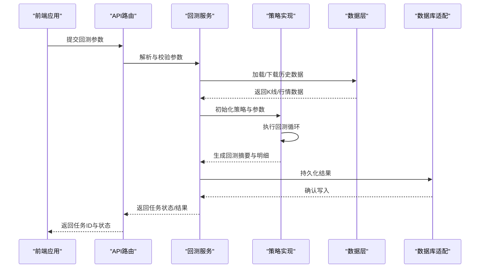
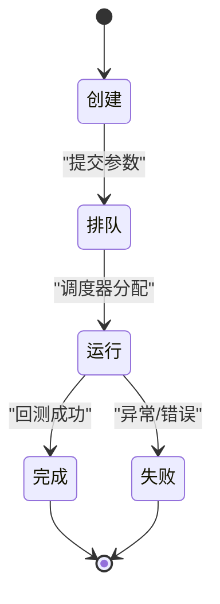
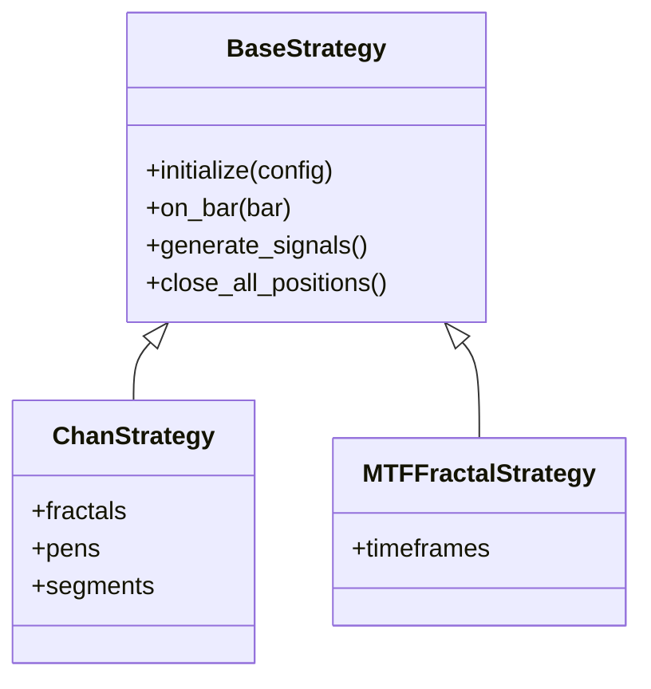
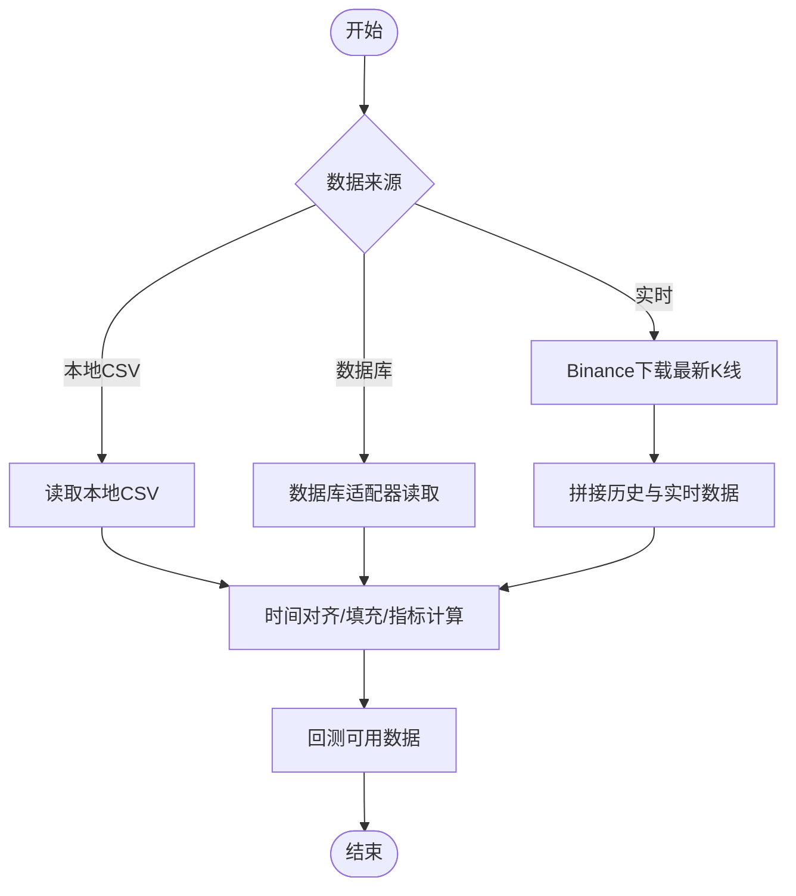
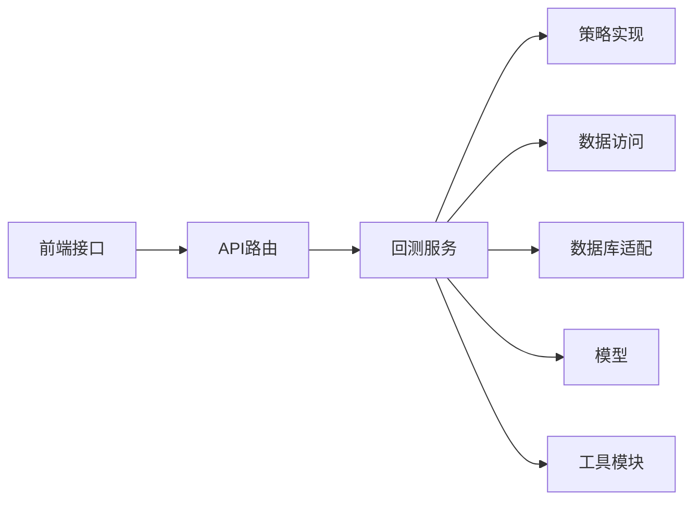

# 回测服务

<cite>
**本文引用的文件**
- [main.py](file://main.py)
- [run_crypto_chan_backtest.py](file://run_crypto_chan_backtest.py)
- [run_ethusdc_mtf_backtest.py](file://run_ethusdc_mtf_backtest.py)
- [run_multi_indicator_backtest.py](file://run_multi_indicator_backtest.py)
- [log_config.py](file://log_config.py)
- [trading_system/api/main.py](file://trading_system/api/main.py)
- [trading_system/api/routers/backtest.py](file://trading_system/api/routers/backtest.py)
- [trading_system/api/services/backtest_service.py](file://trading_system/api/services/backtest_service.py)
- [trading_system/strategies/base_strategy.py](file://trading_system/strategies/base_strategy.py)
- [trading_system/strategies/chan_strategy.py](file://trading_system/strategies/chan_strategy.py)
- [trading_system/strategies/chan_strategy_v2.py](file://trading_system/strategies/chan_strategy_v2.py)
- [trading_system/strategies/mtf_fractal_strategy.py](file://trading_system/strategies/mtf_fractal_strategy.py)
- [trading_system/data/market_data.py](file://trading_system/data/market_data.py)
- [trading_system/binance/client.py](file://trading_system/binance/client.py)
- [trading_system/binance/database_adapter.py](file://trading_system/binance/database_adapter.py)
- [trading_system/binance/enums.py](file://trading_system/binance/enums.py)
- [trading_system/binance/mapper.py](file://trading_system/binance/mapper.py)
- [trading_system/binance/paper_client.py](file://trading_system/binance/paper_client.py)
- [trading_system/core/config.py](file://trading_system/core/config.py)
- [trading_system/core/database.py](file://trading_system/core/database.py)
- [trading_system/core/schemas.py](file://trading_system/core/schemas.py)
- [trading_system/models/trading_order.py](file://trading_system/models/trading_order.py)
- [trading_system/models/position.py](file://trading_system/models/position.py)
- [trading_system/models/trade_record.py](file://trading_system/models/trade_record.py)
- [trading_system/utils/indicators.py](file://trading_system/utils/indicators.py)
- [trading_system/utils/chan_plotter.py](file://trading_system/utils/chan_plotter.py)
- [trading_system/notify/dingtalk.py](file://trading_system/notify/dingtalk.py)
- [frontend/src/api.ts](file://frontend/src/api.ts)
- [frontend/src/components/BacktestForm.tsx](file://frontend/src/components/BacktestForm.tsx)
- [frontend/src/pages/BacktestPage.tsx](file://frontend/src/pages/BacktestPage.tsx)
- [.trae/specs/fix_equity_calculation/spec.md](file://.trae/specs/fix_equity_calculation/spec.md)
</cite>

## 目录
1. [简介](#简介)
2. [项目结构](#项目结构)
3. [核心组件](#核心组件)
4. [架构总览](#架构总览)
5. [详细组件分析](#详细组件分析)
6. [依赖关系分析](#依赖关系分析)
7. [性能考虑](#性能考虑)
8. [故障排查指南](#故障排查指南)
9. [结论](#结论)
10. [附录](#附录)

## 简介
本指南面向回测服务的开发与维护，覆盖回测任务生命周期管理、异步执行与状态跟踪、配置解析与验证、多策略版本选择逻辑、数据加载与预处理流程、任务队列与线程安全、错误处理机制、结果持久化与命名规范、以及性能优化与内存管理最佳实践。文档基于仓库中的实际代码文件进行梳理，并结合前端交互接口与测试规范，帮助开发者快速理解并扩展回测能力。

## 项目结构
回测服务由后端 API、策略引擎、数据层、模型与工具模块组成；同时提供前端页面用于发起回测任务与查看结果。整体采用分层架构：API 路由负责请求接入与任务调度，服务层封装回测执行逻辑，策略层定义交易策略，数据层负责市场数据与数据库适配，模型层承载订单、持仓与交易记录等实体，工具层提供指标与绘图功能。

```mermaid
graph TB
subgraph "前端"
FE_API["frontend/src/api.ts"]
FE_Form["frontend/src/components/BacktestForm.tsx"]
FE_Page["frontend/src/pages/BacktestPage.tsx"]
end
subgraph "后端"
API_Main["trading_system/api/main.py"]
Router_BT["trading_system/api/routers/backtest.py"]
Service_BT["trading_system/api/services/backtest_service.py"]
Core_Config["trading_system/core/config.py"]
Core_DB["trading_system/core/database.py"]
Core_Schemas["trading_system/core/schemas.py"]
end
subgraph "策略与数据"
Strat_Base["trading_system/strategies/base_strategy.py"]
Strat_Chan["trading_system/strategies/chan_strategy.py"]
Strat_ChanV2["trading_system/strategies/chan_strategy_v2.py"]
Strat_MTF["trading_system/strategies/mtf_fractal_strategy.py"]
Data_MD["trading_system/data/market_data.py"]
Binance_Client["trading_system/binance/client.py"]
Binance_DB["trading_system/binance/database_adapter.py"]
Binance_Enums["trading_system/binance/enums.py"]
Binance_Mapper["trading_system/binance/mapper.py"]
Binance_Paper["trading_system/binance/paper_client.py"]
end
subgraph "模型与工具"
Model_Order["trading_system/models/trading_order.py"]
Model_Position["trading_system/models/position.py"]
Model_Trade["trading_system/models/trade_record.py"]
Utils_Ind["trading_system/utils/indicators.py"]
Utils_Plot["trading_system/utils/chan_plotter.py"]
Notify_DT["trading_system/notify/dingtalk.py"]
end
FE_API --> API_Main
FE_Form --> FE_API
FE_Page --> FE_API
API_Main --> Router_BT
Router_BT --> Service_BT
Service_BT --> Strat_Base
Service_BT --> Strat_Chan
Service_BT --> Strat_ChanV2
Service_BT --> Strat_MTF
Service_BT --> Data_MD
Service_BT --> Binance_Client
Service_BT --> Binance_DB
Service_BT --> Binance_Enums
Service_BT --> Binance_Mapper
Service_BT --> Binance_Paper
Service_BT --> Core_Config
Service_BT --> Core_DB
Service_BT --> Core_Schemas
Service_BT --> Model_Order
Service_BT --> Model_Position
Service_BT --> Model_Trade
Service_BT --> Utils_Ind
Service_BT --> Utils_Plot
Service_BT --> Notify_DT
```

图表来源
- [trading_system/api/main.py](file://trading_system/api/main.py)
- [trading_system/api/routers/backtest.py](file://trading_system/api/routers/backtest.py)
- [trading_system/api/services/backtest_service.py](file://trading_system/api/services/backtest_service.py)
- [trading_system/strategies/base_strategy.py](file://trading_system/strategies/base_strategy.py)
- [trading_system/data/market_data.py](file://trading_system/data/market_data.py)
- [trading_system/binance/client.py](file://trading_system/binance/client.py)
- [trading_system/binance/database_adapter.py](file://trading_system/binance/database_adapter.py)
- [trading_system/core/config.py](file://trading_system/core/config.py)
- [trading_system/core/database.py](file://trading_system/core/database.py)
- [trading_system/core/schemas.py](file://trading_system/core/schemas.py)
- [trading_system/models/trading_order.py](file://trading_system/models/trading_order.py)
- [trading_system/models/position.py](file://trading_system/models/position.py)
- [trading_system/models/trade_record.py](file://trading_system/models/trade_record.py)
- [trading_system/utils/indicators.py](file://trading_system/utils/indicators.py)
- [trading_system/utils/chan_plotter.py](file://trading_system/utils/chan_plotter.py)
- [frontend/src/api.ts](file://frontend/src/api.ts)

章节来源
- [main.py](file://main.py)
- [trading_system/api/main.py](file://trading_system/api/main.py)
- [trading_system/api/routers/backtest.py](file://trading_system/api/routers/backtest.py)
- [trading_system/api/services/backtest_service.py](file://trading_system/api/services/backtest_service.py)

## 核心组件
- API 路由与主程序：负责接收前端请求、启动回测任务、返回任务状态与结果。
- 服务层：封装回测执行流程，包括配置解析、策略选择、数据准备、执行与结果汇总。
- 策略层：提供多种策略实现，支持不同时间框架与信号组合。
- 数据层：提供市场数据访问与数据库适配，支持历史数据与实时数据下载。
- 模型层：定义订单、持仓与交易记录的数据结构与行为。
- 工具层：提供技术指标与可视化绘图工具。
- 前端接口：提供回测任务提交、状态查询、参数获取与结果展示。

章节来源
- [trading_system/api/main.py](file://trading_system/api/main.py)
- [trading_system/api/routers/backtest.py](file://trading_system/api/routers/backtest.py)
- [trading_system/api/services/backtest_service.py](file://trading_system/api/services/backtest_service.py)
- [trading_system/strategies/base_strategy.py](file://trading_system/strategies/base_strategy.py)
- [trading_system/data/market_data.py](file://trading_system/data/market_data.py)
- [trading_system/binance/client.py](file://trading_system/binance/client.py)
- [trading_system/binance/database_adapter.py](file://trading_system/binance/database_adapter.py)
- [trading_system/core/config.py](file://trading_system/core/config.py)
- [trading_system/core/database.py](file://trading_system/core/database.py)
- [trading_system/core/schemas.py](file://trading_system/core/schemas.py)
- [trading_system/models/trading_order.py](file://trading_system/models/trading_order.py)
- [trading_system/models/position.py](file://trading_system/models/position.py)
- [trading_system/models/trade_record.py](file://trading_system/models/trade_record.py)
- [trading_system/utils/indicators.py](file://trading_system/utils/indicators.py)
- [trading_system/utils/chan_plotter.py](file://trading_system/utils/chan_plotter.py)
- [frontend/src/api.ts](file://frontend/src/api.ts)

## 架构总览
回测服务采用“前端 -> API -> 服务 -> 策略/数据/模型”的分层设计。前端通过 REST 接口提交回测任务，API 路由解析参数并调用服务层；服务层根据策略类型与参数准备数据，执行回测并生成结果；结果通过文件或数据库持久化，并可由前端查询与展示。

图表来源
- [trading_system/api/routers/backtest.py](file://trading_system/api/routers/backtest.py)
- [trading_system/api/services/backtest_service.py](file://trading_system/api/services/backtest_service.py)
- [trading_system/data/market_data.py](file://trading_system/data/market_data.py)
- [trading_system/binance/database_adapter.py](file://trading_system/binance/database_adapter.py)

## 详细组件分析

### 回测任务生命周期与异步执行
- 任务创建：前端提交参数后，API 路由调用服务层创建任务并返回任务ID与初始状态。
- 异步执行：服务层在后台线程/进程池中执行回测，避免阻塞主线程。
- 状态跟踪：服务层维护任务状态（排队/运行/完成/失败），前端轮询查询任务状态。
- 结果交付：完成后将结果写入持久化存储，前端拉取结果并渲染图表。

图表来源
- [trading_system/api/routers/backtest.py](file://trading_system/api/routers/backtest.py)
- [trading_system/api/services/backtest_service.py](file://trading_system/api/services/backtest_service.py)

章节来源
- [frontend/src/api.ts](file://frontend/src/api.ts)
- [trading_system/api/routers/backtest.py](file://trading_system/api/routers/backtest.py)
- [trading_system/api/services/backtest_service.py](file://trading_system/api/services/backtest_service.py)

### 配置参数解析与验证
- 参数来源：前端表单与后端路由参数合并，包含标的、周期、时间范围、策略类型与策略参数等。
- 解析与校验：服务层对参数进行类型校验、范围约束与依赖关系检查（如杠杆、滑点、手续费）。
- 默认值与覆盖：核心配置模块提供默认值，策略特定参数允许覆盖。
- 错误反馈：校验失败返回明确错误信息，前端提示用户修正。

章节来源
- [trading_system/api/routers/backtest.py](file://trading_system/api/routers/backtest.py)
- [trading_system/api/services/backtest_service.py](file://trading_system/api/services/backtest_service.py)
- [trading_system/core/config.py](file://trading_system/core/config.py)

### 多策略版本选择逻辑
- 策略注册：服务层根据策略名称选择对应实现（如 ChanStrategy、MTFFractalStrategy、MultiIndicatorStrategy 等）。
- 版本兼容：针对不同策略提供差异化初始化与回测流程，确保兼容性。
- 可扩展性：新增策略只需遵循统一接口，即可无缝接入回测流程。

图表来源
- [trading_system/strategies/base_strategy.py](file://trading_system/strategies/base_strategy.py)
- [trading_system/strategies/chan_strategy.py](file://trading_system/strategies/chan_strategy.py)
- [trading_system/strategies/mtf_fractal_strategy.py](file://trading_system/strategies/mtf_fractal_strategy.py)

章节来源
- [trading_system/api/services/backtest_service.py](file://trading_system/api/services/backtest_service.py)
- [trading_system/strategies/base_strategy.py](file://trading_system/strategies/base_strategy.py)
- [trading_system/strategies/chan_strategy.py](file://trading_system/strategies/chan_strategy.py)
- [trading_system/strategies/mtf_fractal_strategy.py](file://trading_system/strategies/mtf_fractal_strategy.py)

### 数据加载与预处理流程
- 历史数据：从本地 CSV 或数据库适配器读取指定周期与时间范围的 K 线数据。
- 实时数据：若启用实时模式，通过 Binance 客户端下载最新数据并拼接至历史数据末尾。
- 预处理：统一时间对齐、缺失值填充、技术指标计算（由工具模块提供），保证回测输入质量。
- 缓存与增量：支持缓存策略减少重复下载与计算成本。

图表来源
- [trading_system/data/market_data.py](file://trading_system/data/market_data.py)
- [trading_system/binance/client.py](file://trading_system/binance/client.py)
- [trading_system/binance/database_adapter.py](file://trading_system/binance/database_adapter.py)
- [trading_system/utils/indicators.py](file://trading_system/utils/indicators.py)

章节来源
- [trading_system/data/market_data.py](file://trading_system/data/market_data.py)
- [trading_system/binance/client.py](file://trading_system/binance/client.py)
- [trading_system/binance/database_adapter.py](file://trading_system/binance/database_adapter.py)
- [trading_system/utils/indicators.py](file://trading_system/utils/indicators.py)

### 任务队列管理与线程安全
- 队列与调度：服务层维护任务队列，按优先级与资源占用调度执行。
- 线程安全：共享状态（如全局统计、日志）使用锁保护；避免竞态条件。
- 资源隔离：每个任务独立上下文，防止相互污染；异常时清理临时资源。
- 并发控制：限制并发回测数量，避免系统过载。

章节来源
- [trading_system/api/services/backtest_service.py](file://trading_system/api/services/backtest_service.py)

### 错误处理机制
- 输入校验：参数缺失、越界、类型不匹配时立即拒绝。
- 运行时异常：捕获策略执行、数据读取、网络请求等异常，记录堆栈并更新任务状态为失败。
- 用户提示：将错误信息映射为可读文案，前端友好展示。
- 自动重试：对网络抖动等瞬时错误进行有限次重试。

章节来源
- [trading_system/api/routers/backtest.py](file://trading_system/api/routers/backtest.py)
- [trading_system/api/services/backtest_service.py](file://trading_system/api/services/backtest_service.py)

### 回测结果持久化与命名规范
- 存储位置：回测结果写入数据目录下的结果文件夹，便于归档与检索。
- 文件命名：采用“策略名_标的_开始日期_结束日期_创建时间”等规则，确保唯一性与可读性。
- 数据格式：JSON 包含汇总指标与逐笔明细，便于前端渲染与二次分析。
- 图表输出：生成收益曲线、最大回撤、胜率等可视化图表，保存为图片文件。

章节来源
- [trading_system/api/services/backtest_service.py](file://trading_system/api/services/backtest_service.py)
- [trading_system/utils/chan_plotter.py](file://trading_system/utils/chan_plotter.py)

### 权益曲线计算修复与影响
- 问题：权益曲线未包含冻结保证金，导致收益率异常偏低甚至为负。
- 修复：在权益计算中加入多头/空头保证金，确保开仓瞬间权益稳定。
- 影响：修复后权益曲线更贴近真实情况，平仓时过渡更平滑。

章节来源
- [.trae/specs/fix_equity_calculation/spec.md](file://.trae/specs/fix_equity_calculation/spec.md)

## 依赖关系分析
- 组件耦合：API 路由与服务层松耦合，通过清晰的接口传递参数与结果；策略与数据层通过服务层解耦。
- 外部依赖：Binance 客户端与数据库适配器作为外部数据源，需注意网络与权限配置。
- 循环依赖：未发现直接循环导入；各模块职责清晰，层次分明。

图表来源
- [trading_system/api/routers/backtest.py](file://trading_system/api/routers/backtest.py)
- [trading_system/api/services/backtest_service.py](file://trading_system/api/services/backtest_service.py)
- [frontend/src/api.ts](file://frontend/src/api.ts)

章节来源
- [trading_system/api/routers/backtest.py](file://trading_system/api/routers/backtest.py)
- [trading_system/api/services/backtest_service.py](file://trading_system/api/services/backtest_service.py)
- [frontend/src/api.ts](file://frontend/src/api.ts)

## 性能考虑
- 数据批处理：按周/月批量读取与缓存历史数据，减少 IO 次数。
- 并行策略：同一标的多策略并行回测，充分利用 CPU；注意内存峰值控制。
- 内存管理：及时释放中间变量与大对象引用，定期触发垃圾回收；避免在回测循环中频繁分配小对象。
- 算法优化：复用技术指标计算结果，避免重复计算；使用向量化操作提升速度。
- I/O 优化：批量写入结果文件，减少磁盘碎片；压缩 JSON 输出以节省空间。
- 资源监控：记录 CPU、内存、磁盘与网络使用情况，定位瓶颈。

## 故障排查指南
- 任务长时间处于排队：检查并发上限与资源占用，适当降低并发或扩容。
- 回测异常中断：查看服务日志与策略异常堆栈，确认数据完整性与参数合法性。
- 权益曲线异常：核对保证金是否正确计入，参考修复规范进行比对。
- 前端无法获取结果：确认 API 路由与服务层状态同步，检查文件权限与存储路径。
- 实时数据下载失败：检查 Binance 凭证与网络连通性，必要时切换代理或限速重试。

章节来源
- [log_config.py](file://log_config.py)
- [trading_system/api/services/backtest_service.py](file://trading_system/api/services/backtest_service.py)
- [.trae/specs/fix_equity_calculation/spec.md](file://.trae/specs/fix_equity_calculation/spec.md)

## 结论
本指南总结了回测服务的架构设计、组件职责与关键流程，明确了生命周期管理、异步执行、配置解析、策略选择、数据处理、持久化与性能优化等方面的最佳实践。建议在新增策略或扩展数据源时，严格遵循现有接口与规范，确保系统的稳定性与可维护性。

## 附录
- 快速启动：通过脚本运行特定策略的回测，便于本地验证与对比。
- 前端集成：使用提供的 API 接口提交任务、轮询状态并展示结果。

章节来源
- [run_crypto_chan_backtest.py](file://run_crypto_chan_backtest.py)
- [run_ethusdc_mtf_backtest.py](file://run_ethusdc_mtf_backtest.py)
- [run_multi_indicator_backtest.py](file://run_multi_indicator_backtest.py)
- [frontend/src/api.ts](file://frontend/src/api.ts)
- [frontend/src/components/BacktestForm.tsx](file://frontend/src/components/BacktestForm.tsx)
- [frontend/src/pages/BacktestPage.tsx](file://frontend/src/pages/BacktestPage.tsx)