# 服务层开发

<cite>
**本文档引用的文件**
- [crud.py](file://trading_system/services/crud.py)
- [backtest_service.py](file://trading_system/api/services/backtest_service.py)
- [backtest.py](file://trading_system/api/routers/backtest.py)
- [signal.py](file://trading_system/api/routers/signal.py)
- [main.py](file://trading_system/api/main.py)
- [database.py](file://trading_system/core/database.py)
- [schemas.py](file://trading_system/core/schemas.py)
- [models/trading_order.py](file://trading_system/models/trading_order.py)
- [models/trade_record.py](file://trading_system/models/trade_record.py)
- [models/position.py](file://trading_system/models/position.py)
- [backtest_engine.py](file://trading_system/strategies/backtest_engine.py)
- [backtest_data.py](file://trading_system/data/backtest_data.py)
- [base_strategy.py](file://trading_system/strategies/base_strategy.py)
- [config.py](file://trading_system/core/config.py)
</cite>

## 目录
1. [简介](#简介)
2. [项目结构](#项目结构)
3. [核心组件](#核心组件)
4. [架构概览](#架构概览)
5. [详细组件分析](#详细组件分析)
6. [依赖关系分析](#依赖关系分析)
7. [性能考量](#性能考量)
8. [故障排除指南](#故障排除指南)
9. [结论](#结论)

## 简介

本指南专注于交易系统的服务层开发，涵盖业务逻辑封装、数据访问模式和事务管理。该系统采用分层架构设计，包括API层、服务层、数据层和模型层，实现了松耦合的服务架构。

系统主要功能包括：
- 回测服务：支持多种策略的回测执行和状态管理
- CRUD服务：提供标准的数据访问模式
- 交易订单管理：订单、交易记录和持仓的完整生命周期管理
- 实时数据集成：支持Binance实时数据下载和缓存

## 项目结构

项目采用清晰的分层架构，各层职责明确：

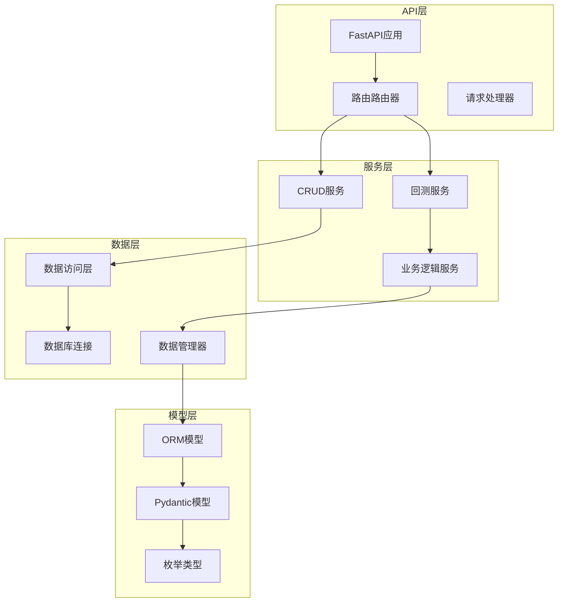

**图表来源**
- [main.py:12-97](file://trading_system/api/main.py#L12-L97)
- [backtest_service.py:1-289](file://trading_system/api/services/backtest_service.py#L1-L289)
- [crud.py:1-137](file://trading_system/services/crud.py#L1-L137)

**章节来源**
- [main.py:1-104](file://trading_system/api/main.py#L1-L104)
- [database.py:1-45](file://trading_system/core/database.py#L1-L45)

## 核心组件

### 服务层架构设计

服务层采用职责分离的设计原则，每个服务负责特定的业务领域：

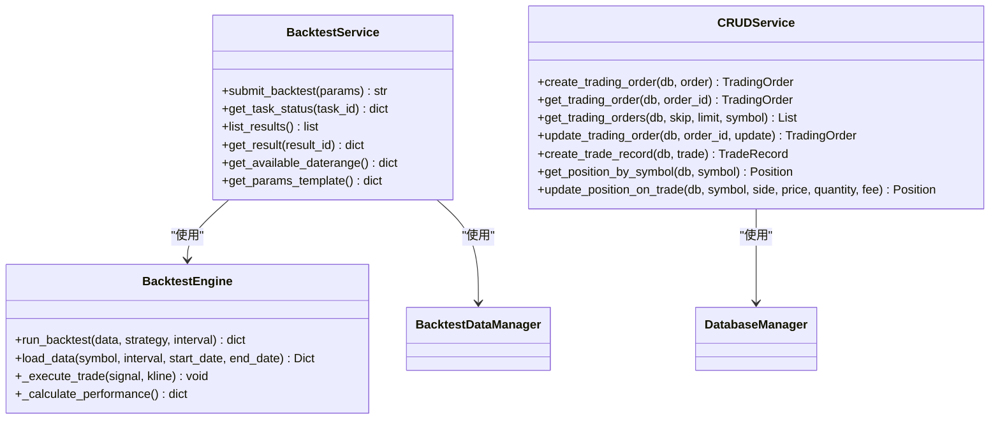

**图表来源**
- [backtest_service.py:58-248](file://trading_system/api/services/backtest_service.py#L58-L248)
- [crud.py:9-137](file://trading_system/services/crud.py#L9-L137)
- [backtest_engine.py:445-539](file://trading_system/strategies/backtest_engine.py#L445-L539)

### 数据访问模式

系统实现了标准的CRUD操作模式，支持复杂查询和事务管理：

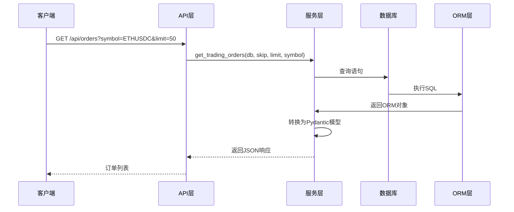

**图表来源**
- [backtest.py:27-31](file://trading_system/api/routers/backtest.py#L27-L31)
- [crud.py:24-34](file://trading_system/services/crud.py#L24-L34)

**章节来源**
- [crud.py:1-137](file://trading_system/services/crud.py#L1-L137)
- [schemas.py:1-88](file://trading_system/core/schemas.py#L1-L88)

## 架构概览

系统采用事件驱动的异步架构，支持高并发和实时数据处理：

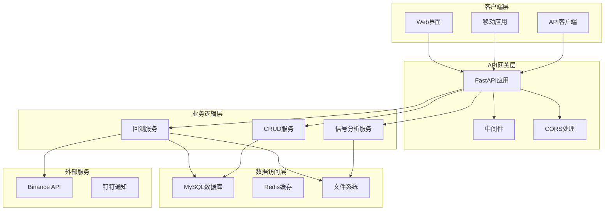

**图表来源**
- [main.py:12-97](file://trading_system/api/main.py#L12-L97)
- [backtest_service.py:1-289](file://trading_system/api/services/backtest_service.py#L1-L289)
- [database.py:1-45](file://trading_system/core/database.py#L1-L45)

## 详细组件分析

### 回测服务核心功能

回测服务是系统的核心组件，提供了完整的策略回测能力：

#### 任务调度和状态管理

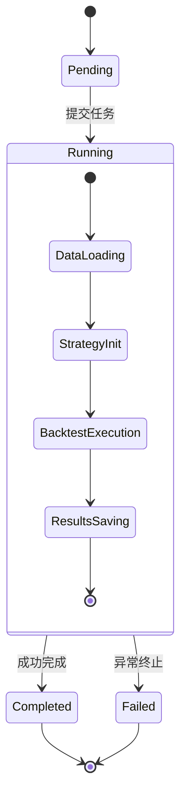

**图表来源**
- [backtest_service.py:15-17](file://trading_system/api/services/backtest_service.py#L15-L17)
- [backtest_service.py:58-248](file://trading_system/api/services/backtest_service.py#L58-L248)

#### 回测流程管理

回测服务实现了完整的异步任务管理：

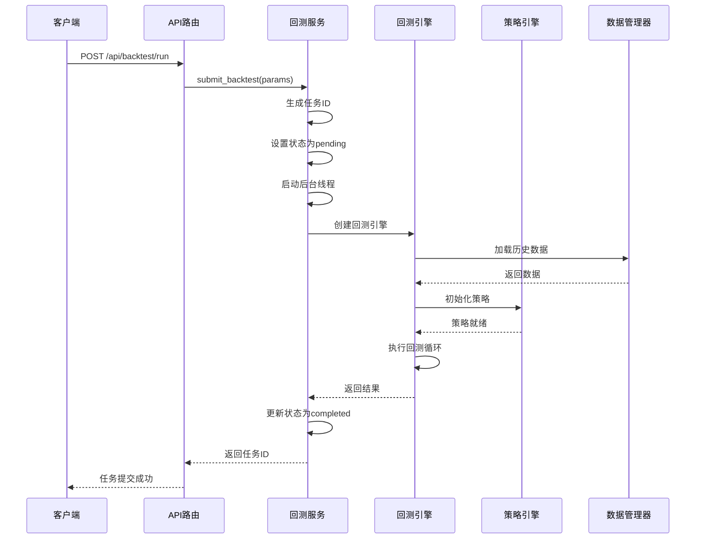

**图表来源**
- [backtest.py:49-53](file://trading_system/api/routers/backtest.py#L49-L53)
- [backtest_service.py:58-248](file://trading_system/api/services/backtest_service.py#L58-L248)

**章节来源**
- [backtest_service.py:1-289](file://trading_system/api/services/backtest_service.py#L1-L289)
- [backtest_engine.py:445-539](file://trading_system/strategies/backtest_engine.py#L445-L539)

### CRUD服务通用实现模式

CRUD服务实现了标准的数据访问模式，支持完整的增删改查操作：

#### 交易订单管理

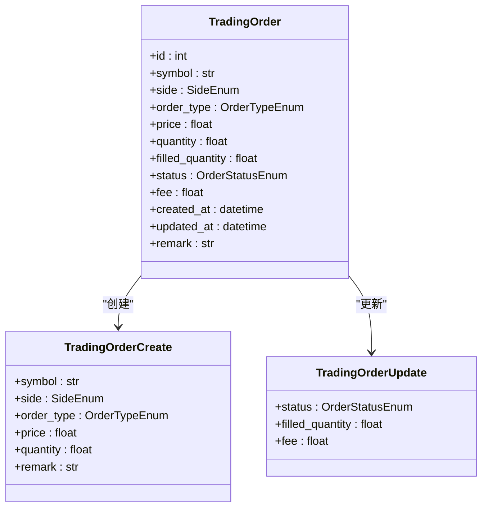

**图表来源**
- [models/trading_order.py:26-43](file://trading_system/models/trading_order.py#L26-L43)
- [schemas.py:7-35](file://trading_system/core/schemas.py#L7-L35)

#### 交易记录和持仓管理

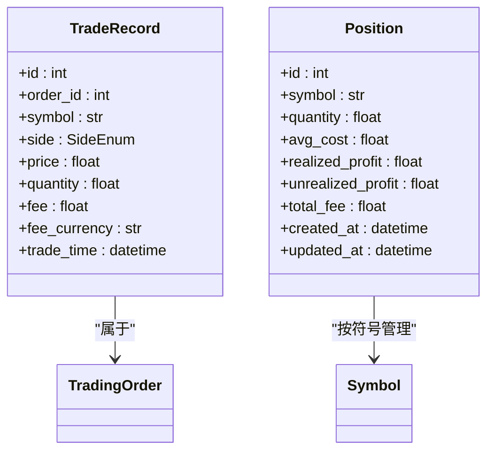

**图表来源**
- [models/trade_record.py:8-22](file://trading_system/models/trade_record.py#L8-L22)
- [models/position.py:6-18](file://trading_system/models/position.py#L6-L18)

**章节来源**
- [crud.py:1-137](file://trading_system/services/crud.py#L1-L137)
- [models/trading_order.py:1-43](file://trading_system/models/trading_order.py#L1-L43)
- [models/trade_record.py:1-22](file://trading_system/models/trade_record.py#L1-L22)
- [models/position.py:1-18](file://trading_system/models/position.py#L1-L18)

### 数据验证和错误处理

系统实现了多层次的数据验证和错误处理机制：

#### 请求参数验证

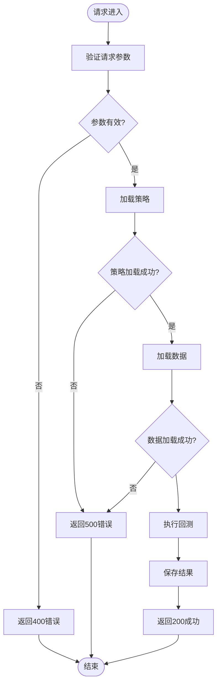

**图表来源**
- [backtest_service.py:240-245](file://trading_system/api/services/backtest_service.py#L240-L245)
- [backtest.py:49-62](file://trading_system/api/routers/backtest.py#L49-L62)

#### 错误处理策略

系统采用统一的异常处理机制：

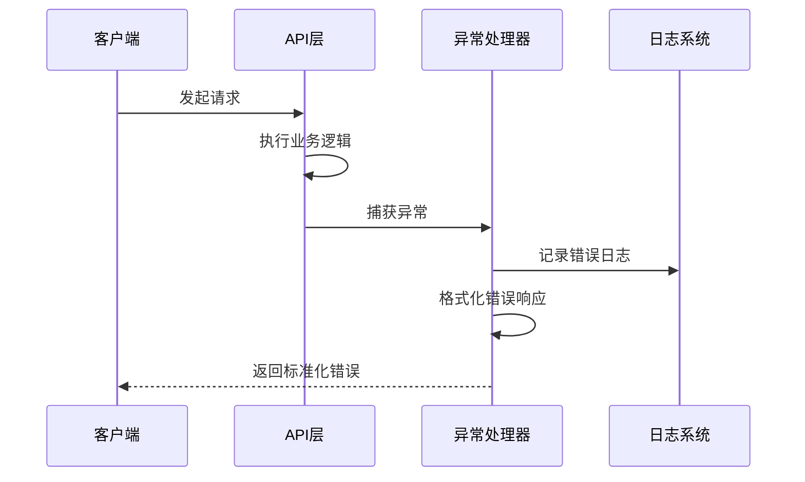

**图表来源**
- [main.py:33-55](file://trading_system/api/main.py#L33-L55)

**章节来源**
- [main.py:33-55](file://trading_system/api/main.py#L33-L55)
- [backtest_service.py:240-245](file://trading_system/api/services/backtest_service.py#L240-L245)

## 依赖关系分析

系统采用松耦合的设计，通过接口和抽象类实现模块间的解耦：

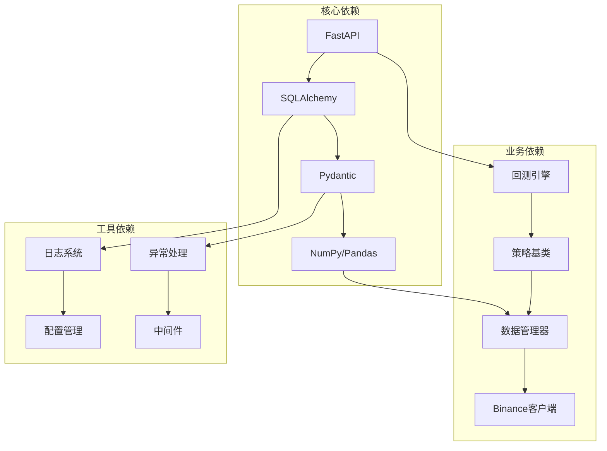

**图表来源**
- [backtest_engine.py:1-32](file://trading_system/strategies/backtest_engine.py#L1-L32)
- [base_strategy.py:1-168](file://trading_system/strategies/base_strategy.py#L1-L168)
- [backtest_data.py:1-137](file://trading_system/data/backtest_data.py#L1-L137)

### 服务层与API层交互

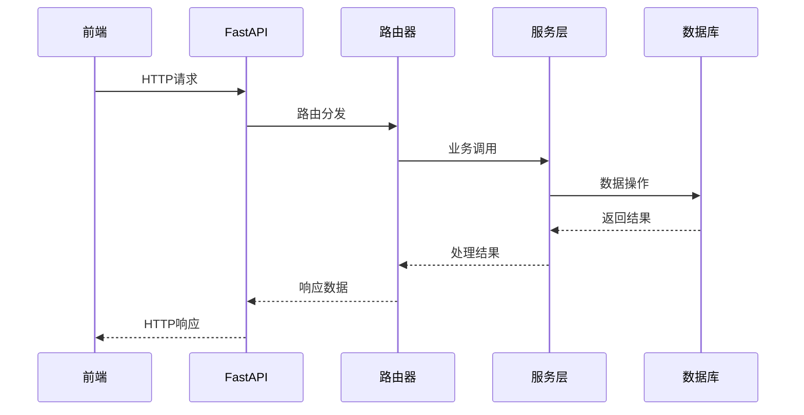

**图表来源**
- [backtest.py:1-68](file://trading_system/api/routers/backtest.py#L1-L68)
- [main.py:95-97](file://trading_system/api/main.py#L95-L97)

### 服务层与数据层交互

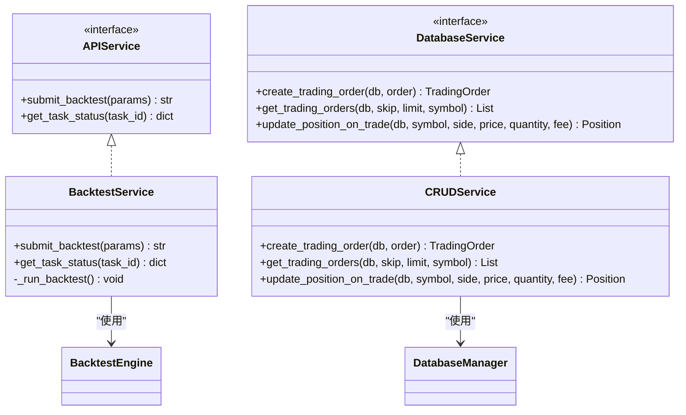

**图表来源**
- [backtest_service.py:58-248](file://trading_system/api/services/backtest_service.py#L58-L248)
- [crud.py:9-137](file://trading_system/services/crud.py#L9-L137)

**章节来源**
- [database.py:1-45](file://trading_system/core/database.py#L1-L45)
- [config.py:1-35](file://trading_system/core/config.py#L1-L35)

## 性能考量

### 数据库连接池管理

系统采用连接池优化数据库性能：

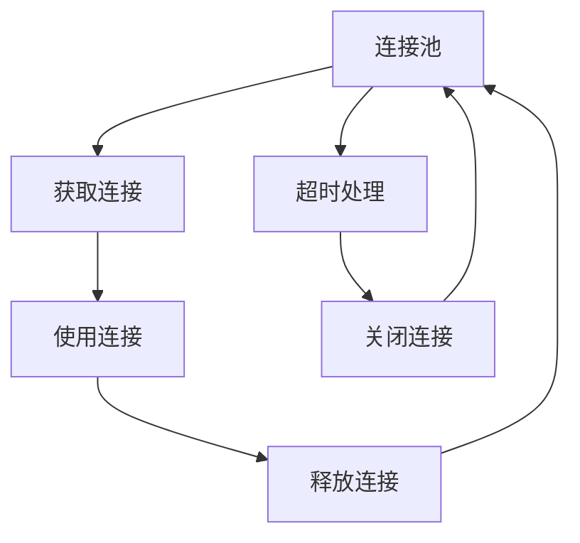

**图表来源**
- [database.py:12-21](file://trading_system/core/database.py#L12-L21)

### 异步任务处理

回测服务采用异步处理提高系统吞吐量：

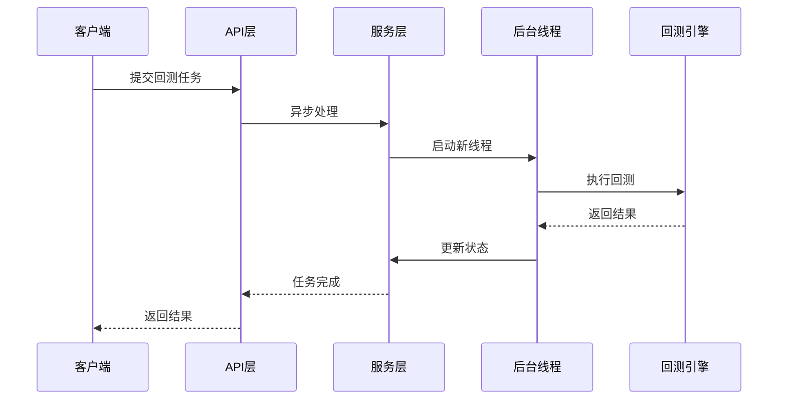

**图表来源**
- [backtest_service.py:246-248](file://trading_system/api/services/backtest_service.py#L246-L248)

## 故障排除指南

### 常见问题诊断

#### 数据库连接问题

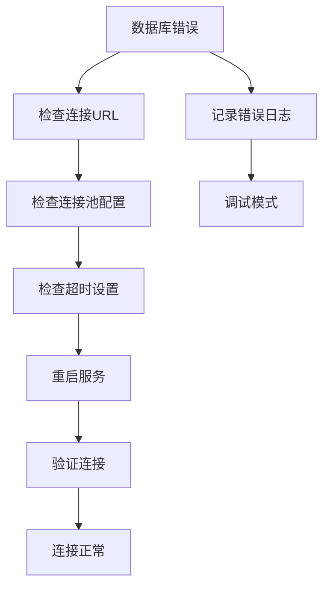

**图表来源**
- [database.py:37-45](file://trading_system/core/database.py#L37-L45)
- [main.py:58-67](file://trading_system/api/main.py#L58-L67)

#### 回测任务失败

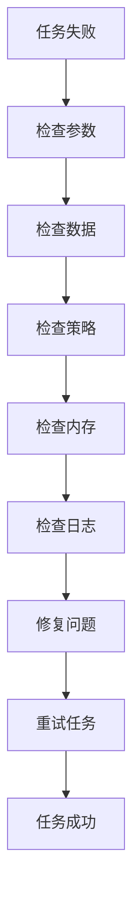

**图表来源**
- [backtest_service.py:240-245](file://trading_system/api/services/backtest_service.py#L240-L245)

**章节来源**
- [main.py:33-55](file://trading_system/api/main.py#L33-L55)
- [backtest_service.py:240-245](file://trading_system/api/services/backtest_service.py#L240-L245)

## 结论

本服务层开发指南展示了交易系统中服务层的最佳实践，包括：

1. **分层架构设计**：清晰的职责分离和松耦合设计
2. **异步任务处理**：高效的回测任务管理和状态跟踪
3. **数据访问模式**：标准的CRUD操作和事务管理
4. **错误处理机制**：统一的异常处理和日志记录
5. **性能优化**：连接池管理和异步处理策略

通过遵循这些模式和最佳实践，可以构建可维护、可扩展的服务层架构，为交易系统的稳定运行提供坚实基础。