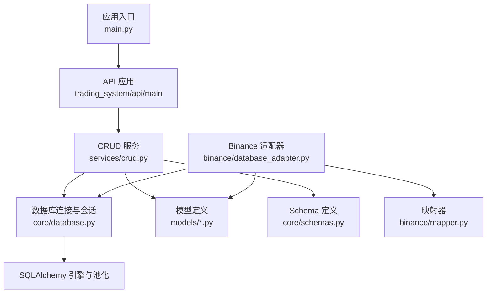
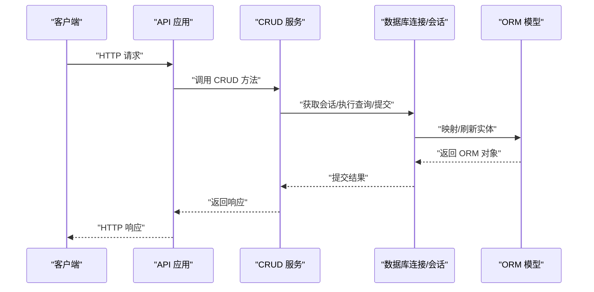
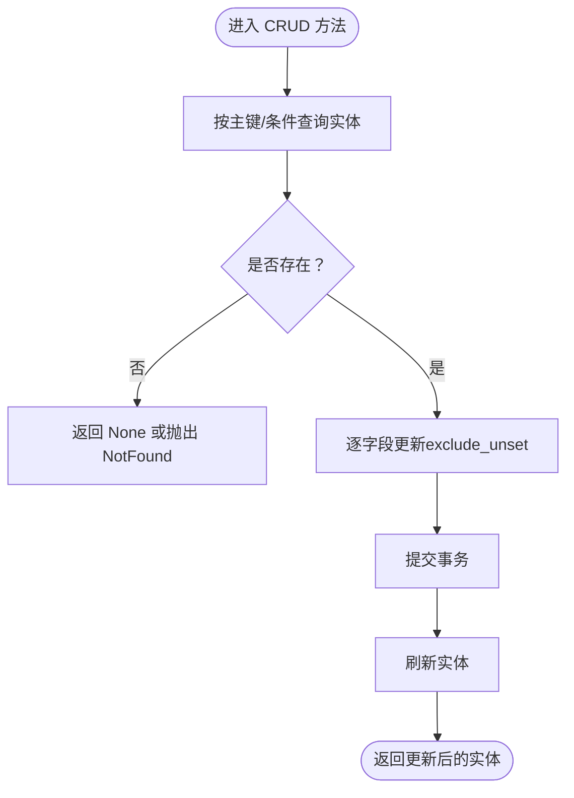
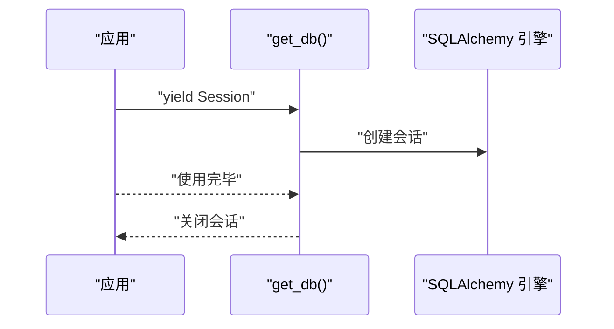
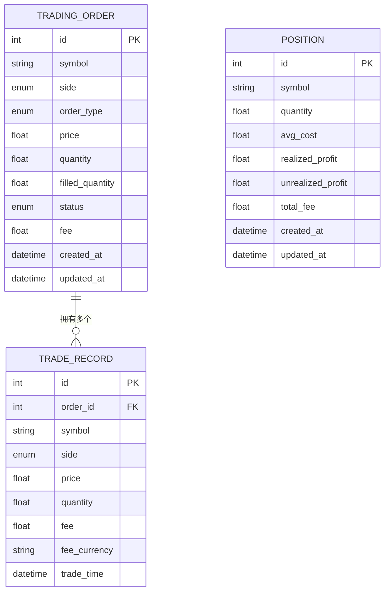
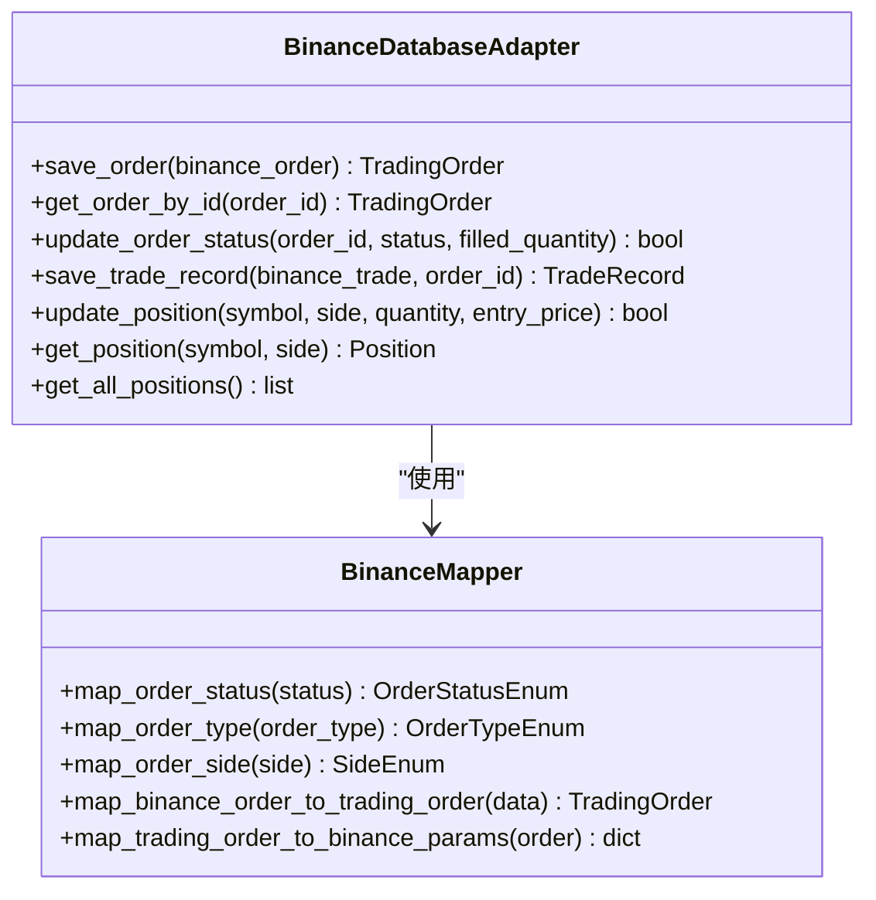
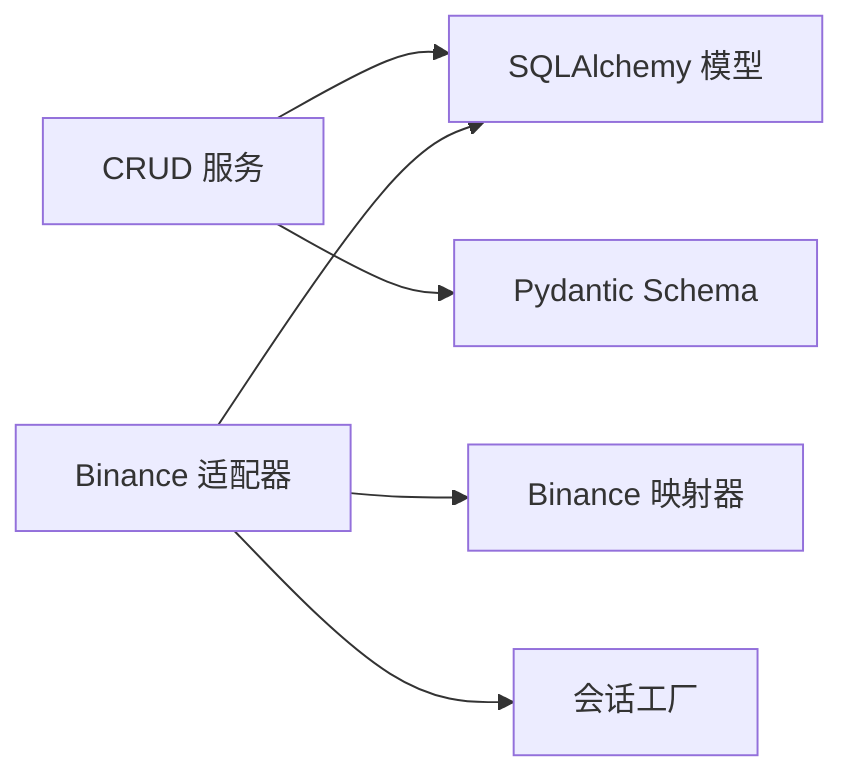

# 通用CRUD服务

<cite>
**本文引用的文件**
- [trading_system/services/crud.py](file://trading_system/services/crud.py)
- [trading_system/core/database.py](file://trading_system/core/database.py)
- [trading_system/binance/database_adapter.py](file://trading_system/binance/database_adapter.py)
- [trading_system/models/trading_order.py](file://trading_system/models/trading_order.py)
- [trading_system/models/trade_record.py](file://trading_system/models/trade_record.py)
- [trading_system/models/position.py](file://trading_system/models/position.py)
- [trading_system/core/schemas.py](file://trading_system/core/schemas.py)
- [trading_system/binance/mapper.py](file://trading_system/binance/mapper.py)
- [main.py](file://main.py)
</cite>

## 目录
1. [简介](#简介)
2. [项目结构](#项目结构)
3. [核心组件](#核心组件)
4. [架构总览](#架构总览)
5. [详细组件分析](#详细组件分析)
6. [依赖分析](#依赖分析)
7. [性能考虑](#性能考虑)
8. [故障排查指南](#故障排查指南)
9. [结论](#结论)
10. [附录](#附录)

## 简介
本指南围绕交易系统中的通用CRUD服务展开，目标是提供一套可复用的数据访问层抽象与通用操作实现方法，覆盖标准接口设计、数据验证、错误处理、数据库连接与事务管理、并发控制、扩展点（自定义业务逻辑与复杂查询）、模型映射、字段校验与权限控制最佳实践，并给出性能优化与索引设计建议。本文档基于仓库中现有的CRUD实现、数据库连接与会话管理、模型定义与映射器进行系统化梳理。

## 项目结构
该工程采用分层组织：核心配置与数据库连接在 core 层；领域模型在 models 层；业务服务在 services 层；外部交易所适配在 binance 层；API 入口在 trading_system/api/main 中（通过主入口启动）。CRUD 服务位于 services/crud.py，数据库引擎与会话工厂在 core/database.py，模型与Pydantic Schema 定义在 models 与 core/schemas 中，Binance 适配器在 binance/database_adapter.py 并使用 mapper 进行数据映射。

图表来源
- [main.py:1-13](file://main.py#L1-L13)
- [trading_system/core/database.py:1-45](file://trading_system/core/database.py#L1-L45)
- [trading_system/services/crud.py:1-137](file://trading_system/services/crud.py#L1-L137)
- [trading_system/binance/database_adapter.py:1-189](file://trading_system/binance/database_adapter.py#L1-L189)
- [trading_system/binance/mapper.py:1-110](file://trading_system/binance/mapper.py#L1-L110)

章节来源
- [main.py:1-13](file://main.py#L1-L13)
- [trading_system/core/database.py:1-45](file://trading_system/core/database.py#L1-L45)

## 核心组件
- 数据访问层抽象（CRUD 服务）：提供统一的增删改查与复合业务操作（如按交易对更新持仓），封装 SQLAlchemy 会话与提交流程。
- 数据库连接与会话管理：集中配置连接池、超时、回收与预检查，提供 get_db 生成器用于依赖注入。
- 模型与Schema：使用 SQLAlchemy ORM 模型与 Pydantic Schema 实现数据结构与输入输出约束。
- 外部适配器：BinanceDatabaseAdapter 将外部数据持久化到本地表，内置事务回滚与日志记录。
- 映射器：BinanceMapper 负责外部数据到内部模型的类型与字段映射。

章节来源
- [trading_system/services/crud.py:1-137](file://trading_system/services/crud.py#L1-L137)
- [trading_system/core/database.py:1-45](file://trading_system/core/database.py#L1-L45)
- [trading_system/core/schemas.py:1-88](file://trading_system/core/schemas.py#L1-L88)
- [trading_system/binance/database_adapter.py:1-189](file://trading_system/binance/database_adapter.py#L1-L189)
- [trading_system/binance/mapper.py:1-110](file://trading_system/binance/mapper.py#L1-L110)

## 架构总览
下图展示从应用入口到数据库的调用链路与职责边界：

图表来源
- [main.py:1-13](file://main.py#L1-L13)
- [trading_system/services/crud.py:1-137](file://trading_system/services/crud.py#L1-L137)
- [trading_system/core/database.py:1-45](file://trading_system/core/database.py#L1-L45)

## 详细组件分析

### 数据访问层抽象（CRUD 服务）
- 统一接口设计
  - 创建：接收 Pydantic Create Schema，构造 ORM 实体，add+commit+refresh。
  - 查询：支持按主键、分页、条件过滤（如 symbol）。
  - 更新：按主键查询后逐字段更新（exclude_unset），commit+refresh。
  - 复合业务：按 symbol 与方向更新持仓，计算均价、已实现盈亏等。
- 错误处理策略
  - 读取不存在实体时返回 None，避免异常传播。
  - 提交失败由上层捕获或适配器统一处理。
- 并发控制
  - 使用 autocommit=False 的会话，结合 commit 控制原子性。
  - 可在需要时引入锁（如 select ... for update）以满足强一致性场景。

图表来源
- [trading_system/services/crud.py:37-45](file://trading_system/services/crud.py#L37-L45)
- [trading_system/services/crud.py:92-100](file://trading_system/services/crud.py#L92-L100)

章节来源
- [trading_system/services/crud.py:1-137](file://trading_system/services/crud.py#L1-L137)

### 数据库连接与会话管理
- 连接池配置：pool_size、max_overflow、pool_timeout、pool_recycle、pool_pre_ping、echo。
- 会话生命周期：get_db 作为依赖注入生成器，在 try/finally 中确保关闭。
- 初始化：init_db 基于 Base.metadata.create_all 创建表。

图表来源
- [trading_system/core/database.py:24-35](file://trading_system/core/database.py#L24-L35)
- [trading_system/core/database.py:37-45](file://trading_system/core/database.py#L37-L45)

章节来源
- [trading_system/core/database.py:1-45](file://trading_system/core/database.py#L1-L45)

### 模型与Schema 设计
- 模型（SQLAlchemy）
  - TradingOrder：订单主表，含枚举字段、外键关联 TradeRecord。
  - TradeRecord：成交明细，与 TradingOrder 反向关系。
  - Position：持仓汇总，含均价、已实现/未实现盈亏、手续费等。
- Schema（Pydantic）
  - Create/Update/Response 分离，明确输入输出约束与可选字段。
  - 配置 from_attributes 支持 ORM 对象序列化。

图表来源
- [trading_system/models/trading_order.py:26-43](file://trading_system/models/trading_order.py#L26-L43)
- [trading_system/models/trade_record.py:8-22](file://trading_system/models/trade_record.py#L8-L22)
- [trading_system/models/position.py:6-18](file://trading_system/models/position.py#L6-L18)

章节来源
- [trading_system/models/trading_order.py:1-43](file://trading_system/models/trading_order.py#L1-L43)
- [trading_system/models/trade_record.py:1-22](file://trading_system/models/trade_record.py#L1-L22)
- [trading_system/models/position.py:1-18](file://trading_system/models/position.py#L1-L18)
- [trading_system/core/schemas.py:1-88](file://trading_system/core/schemas.py#L1-L88)

### 外部适配器与映射器
- BinanceDatabaseAdapter
  - 提供上下文管理，自动回滚与关闭。
  - 保存/更新订单、保存成交记录、更新持仓、查询持仓与全部有效持仓。
  - 所有写操作均在 try/except 中包裹，异常时回滚并记录日志。
- BinanceMapper
  - 将外部状态/类型/方向映射为内部枚举。
  - 将内部模型映射为下单参数字典。

图表来源
- [trading_system/binance/database_adapter.py:14-189](file://trading_system/binance/database_adapter.py#L14-L189)
- [trading_system/binance/mapper.py:15-110](file://trading_system/binance/mapper.py#L15-L110)

章节来源
- [trading_system/binance/database_adapter.py:1-189](file://trading_system/binance/database_adapter.py#L1-L189)
- [trading_system/binance/mapper.py:1-110](file://trading_system/binance/mapper.py#L1-L110)

### 事务处理与并发控制
- 事务边界
  - CRUD 服务与适配器均显式 commit，异常时回滚。
  - 适配器使用上下文管理器确保异常时回滚。
- 并发控制
  - 默认会话不自动提交，需手动 commit。
  - 对关键路径可引入行级锁（select ... for update）或数据库层面的唯一约束与索引降低冲突概率。
  - 连接池参数（pool_pre_ping、pool_recycle）提升连接稳定性。

章节来源
- [trading_system/services/crud.py:11-16](file://trading_system/services/crud.py#L11-L16)
- [trading_system/services/crud.py:37-45](file://trading_system/services/crud.py#L37-L45)
- [trading_system/binance/database_adapter.py:24-30](file://trading_system/binance/database_adapter.py#L24-L30)
- [trading_system/core/database.py:12-21](file://trading_system/core/database.py#L12-L21)

### 扩展点与自定义业务逻辑
- 自定义查询
  - 在 CRUD 服务中新增带过滤条件的方法（如按时间范围、状态聚合）。
  - 使用 SQLAlchemy Query API 组合 where/filter/offset/limit。
- 复杂业务
  - 在适配器中封装组合操作（如“下单后联动更新持仓”）。
  - 通过 Mapper 扩展映射规则，保持外部数据与内部模型解耦。
- 权限控制
  - 在 API 层添加鉴权中间件，再调用 CRUD 服务。
  - 对敏感字段（如 fee、price）在 Schema 中限制可写范围。

章节来源
- [trading_system/services/crud.py:24-34](file://trading_system/services/crud.py#L24-L34)
- [trading_system/services/crud.py:62-69](file://trading_system/services/crud.py#L62-L69)
- [trading_system/binance/database_adapter.py:31-61](file://trading_system/binance/database_adapter.py#L31-L61)

## 依赖分析
- 组件耦合
  - CRUD 服务依赖 SQLAlchemy Session 与模型，依赖 Pydantic Schema 进行输入校验。
  - 适配器依赖会话工厂与模型，依赖映射器完成外部数据转换。
- 外部依赖
  - SQLAlchemy 引擎与会话工厂集中管理，避免分散配置。
  - 日志模块贯穿各层，便于追踪事务与异常。

图表来源
- [trading_system/services/crud.py:1-137](file://trading_system/services/crud.py#L1-L137)
- [trading_system/binance/database_adapter.py:1-189](file://trading_system/binance/database_adapter.py#L1-L189)
- [trading_system/binance/mapper.py:1-110](file://trading_system/binance/mapper.py#L1-L110)

章节来源
- [trading_system/services/crud.py:1-137](file://trading_system/services/crud.py#L1-L137)
- [trading_system/binance/database_adapter.py:1-189](file://trading_system/binance/database_adapter.py#L1-L189)

## 性能考虑
- 索引设计
  - 高频过滤字段（如 symbol、order_id）建立索引，减少全表扫描。
  - 复合条件查询（如 symbol+side）考虑联合索引。
- 查询优化
  - 分页查询使用 offset/limit，避免一次性加载大结果集。
  - 使用 select只取必要字段，减少序列化开销。
- 连接池优化
  - 合理设置 pool_size 与 max_overflow，结合 pool_recycle 与 pool_pre_ping。
  - 避免长事务，及时 commit/rollback。
- 写入优化
  - 批量插入使用 bulk_save_objects 或原生 SQL。
  - 减少不必要的 refresh 次数，仅在需要最新值时刷新。

## 故障排查指南
- 事务未提交/回滚
  - 检查是否遗漏 commit 或异常未被捕获。
  - 适配器中确认 __exit__ 是否被触发并执行 rollback。
- 连接泄漏
  - 确认 get_db 在 finally 中关闭会话。
  - 检查长生命周期对象持有 Session。
- 映射错误
  - 核对 BinanceMapper 的映射规则与外部数据格式。
  - 关注枚举映射大小写与默认值处理。
- 日志定位
  - 利用日志级别区分调试与错误信息，快速定位问题发生点。

章节来源
- [trading_system/binance/database_adapter.py:24-30](file://trading_system/binance/database_adapter.py#L24-L30)
- [trading_system/core/database.py:24-35](file://trading_system/core/database.py#L24-L35)
- [trading_system/binance/mapper.py:19-32](file://trading_system/binance/mapper.py#L19-L32)

## 结论
本项目提供了清晰的通用CRUD抽象与数据库连接管理，配合 Pydantic Schema 实现输入输出约束，Binance 适配器与映射器实现外部数据集成。通过事务显式提交、连接池配置与日志记录，系统具备良好的可维护性与可扩展性。建议在生产环境中进一步完善并发控制、索引设计与批量写入策略，并在 API 层补充鉴权与审计能力。

## 附录
- 最佳实践清单
  - 输入校验：始终使用 Pydantic Schema 进行字段与类型校验。
  - 输出安全：Response Schema 明确暴露字段，避免泄露内部实现细节。
  - 事务边界：每个业务操作一个事务，异常即回滚。
  - 并发控制：热点字段加索引，必要时使用行级锁。
  - 性能优化：分页查询、选择性字段、连接池参数调优、批量写入。
  - 可观测性：统一日志格式与错误码，便于问题定位。