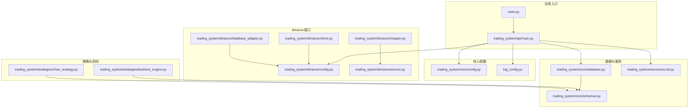
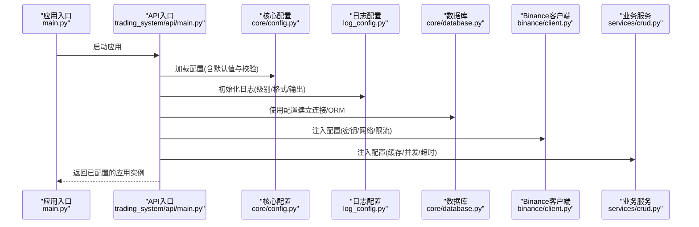
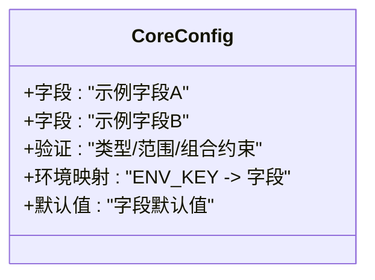
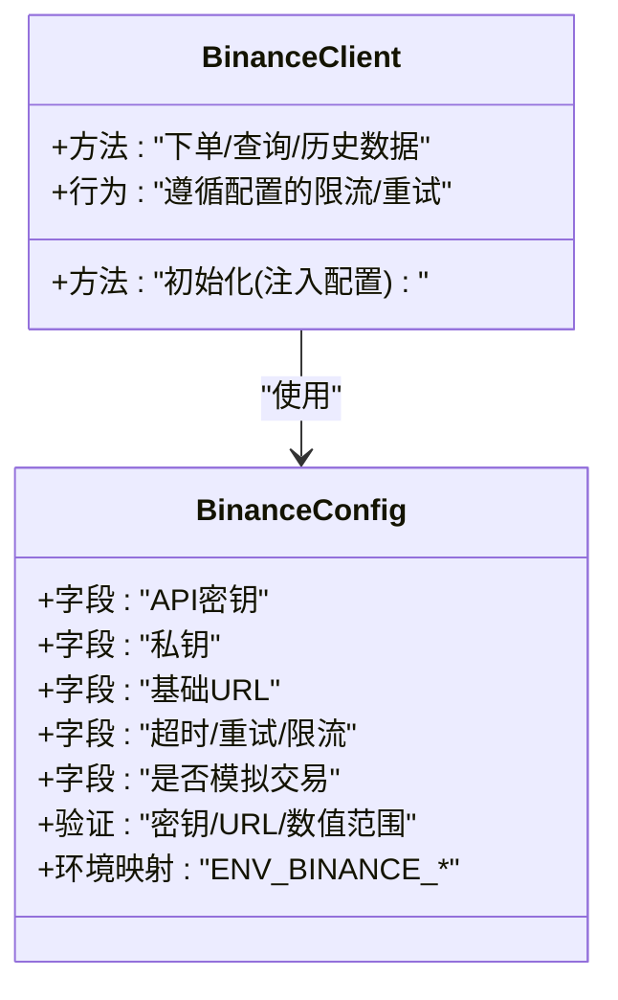
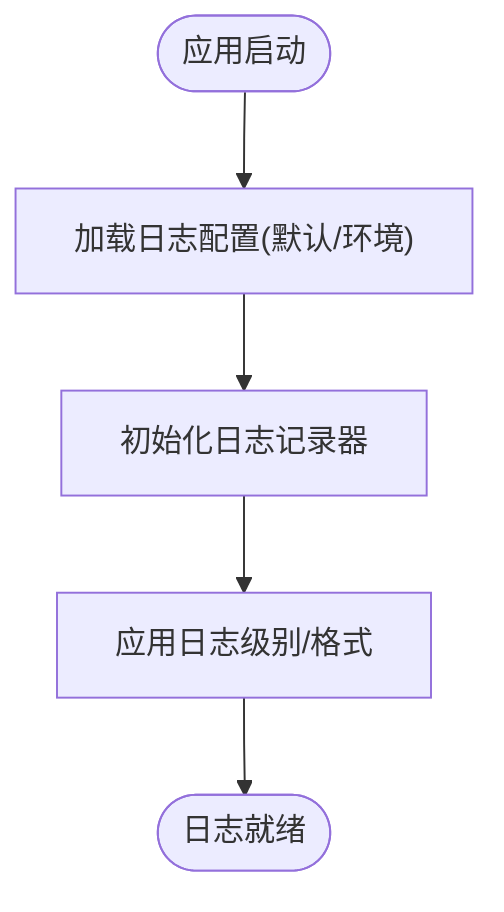
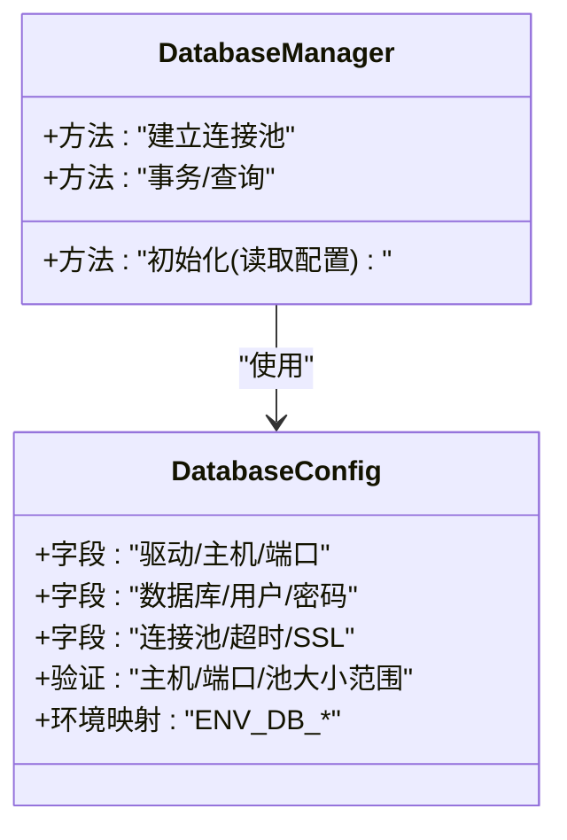
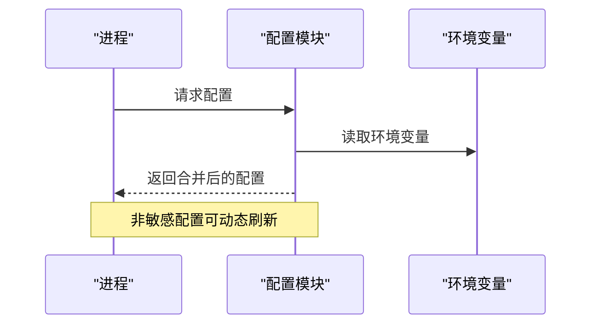
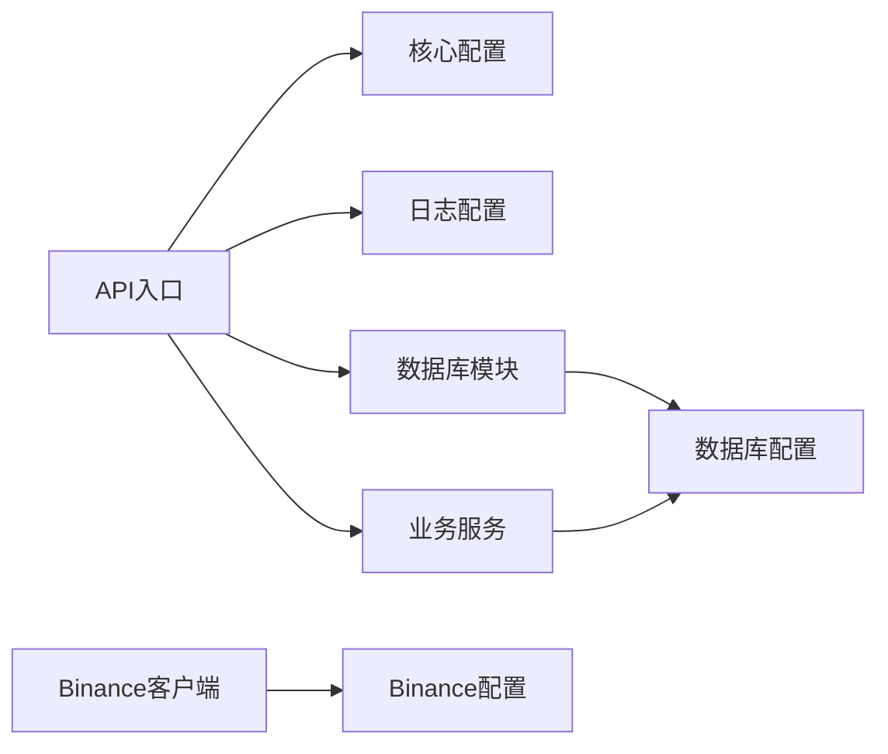

# 配置管理

<cite>
**本文引用的文件**
- [log_config.py](file://log_config.py)
- [config.py](file://trading_system/core/config.py)
- [config.py](file://trading_system/binance/config.py)
- [main.py](file://trading_system/api/main.py)
- [main.py](file://main.py)
- [database.py](file://trading_system/core/database.py)
- [schemas.py](file://trading_system/core/schemas.py)
- [crud.py](file://trading_system/services/crud.py)
- [client.py](file://trading_system/binance/client.py)
- [database_adapter.py](file://trading_system/binance/database_adapter.py)
- [mapper.py](file://trading_system/binance/mapper.py)
- [enums.py](file://trading_system/binance/enums.py)
- [backtest_engine.py](file://trading_system/strategies/backtest_engine.py)
- [chan_strategy.py](file://trading_system/strategies/chan_strategy.py)
- [requirements.txt](file://requirements.txt)
</cite>

## 目录
1. [引言](#引言)
2. [项目结构](#项目结构)
3. [核心组件](#核心组件)
4. [架构总览](#架构总览)
5. [详细组件分析](#详细组件分析)
6. [依赖关系分析](#依赖关系分析)
7. [性能考量](#性能考量)
8. [故障排查指南](#故障排查指南)
9. [结论](#结论)
10. [附录](#附录)

## 引言
本指南聚焦于该交易系统中的配置管理，覆盖环境配置、运行时配置与配置验证，阐明配置文件结构、配置项定义与默认值设置方式；解释配置加载机制、环境变量处理与配置热更新策略；并给出日志、数据库与第三方服务配置的最佳实践，以及安全考虑与生产部署建议。内容基于仓库中实际存在的配置相关文件进行梳理与总结。

## 项目结构
该工程采用分层与功能模块化组织，配置相关主要分布在以下位置：
- 核心配置：trading_system/core/config.py
- Binance 接口配置：trading_system/binance/config.py
- 日志配置：log_config.py
- 应用入口与API：trading_system/api/main.py、main.py
- 数据库与数据模型：trading_system/core/database.py、trading_system/core/schemas.py
- 业务服务与CRUD：trading_system/services/crud.py
- Binance 客户端与适配器：trading_system/binance/client.py、database_adapter.py、mapper.py、enums.py
- 策略与回测：trading_system/strategies/backtest_engine.py、chan_strategy.py
- 依赖声明：requirements.txt

**图表来源**
- [main.py](file://main.py)
- [trading_system/api/main.py](file://trading_system/api/main.py)
- [trading_system/core/config.py](file://trading_system/core/config.py)
- [log_config.py](file://log_config.py)
- [trading_system/binance/config.py](file://trading_system/binance/config.py)
- [trading_system/binance/client.py](file://trading_system/binance/client.py)
- [trading_system/binance/database_adapter.py](file://trading_system/binance/database_adapter.py)
- [trading_system/binance/mapper.py](file://trading_system/binance/mapper.py)
- [trading_system/binance/enums.py](file://trading_system/binance/enums.py)
- [trading_system/core/database.py](file://trading_system/core/database.py)
- [trading_system/core/schemas.py](file://trading_system/core/schemas.py)
- [trading_system/services/crud.py](file://trading_system/services/crud.py)
- [trading_system/strategies/backtest_engine.py](file://trading_system/strategies/backtest_engine.py)
- [trading_system/strategies/chan_strategy.py](file://trading_system/strategies/chan_strategy.py)

**章节来源**
- [main.py](file://main.py)
- [trading_system/api/main.py](file://trading_system/api/main.py)
- [trading_system/core/config.py](file://trading_system/core/config.py)
- [log_config.py](file://log_config.py)
- [trading_system/binance/config.py](file://trading_system/binance/config.py)
- [trading_system/core/database.py](file://trading_system/core/database.py)
- [trading_system/core/schemas.py](file://trading_system/core/schemas.py)
- [trading_system/services/crud.py](file://trading_system/services/crud.py)
- [trading_system/binance/client.py](file://trading_system/binance/client.py)
- [trading_system/binance/database_adapter.py](file://trading_system/binance/database_adapter.py)
- [trading_system/binance/mapper.py](file://trading_system/binance/mapper.py)
- [trading_system/binance/enums.py](file://trading_system/binance/enums.py)
- [trading_system/strategies/backtest_engine.py](file://trading_system/strategies/backtest_engine.py)
- [trading_system/strategies/chan_strategy.py](file://trading_system/strategies/chan_strategy.py)

## 核心组件
- 核心配置模块（Pydantic Settings）：提供类型安全的配置加载、默认值与验证，支持从环境变量注入与配置文件合并。
- Binance 接口配置：封装交易所访问密钥、网络参数、限流与重试策略等。
- 日志配置：集中式日志级别、格式与输出目标控制。
- 数据库配置与连接：ORM 初始化、连接池与事务策略。
- API 入口与服务：在启动阶段加载配置并注入到各子系统。

**章节来源**
- [trading_system/core/config.py](file://trading_system/core/config.py)
- [trading_system/binance/config.py](file://trading_system/binance/config.py)
- [log_config.py](file://log_config.py)
- [trading_system/core/database.py](file://trading_system/core/database.py)
- [trading_system/api/main.py](file://trading_system/api/main.py)

## 架构总览
配置管理贯穿应用启动流程：API 入口负责初始化核心配置与日志，随后将配置注入到数据库、Binance 客户端与业务服务。策略与回测引擎通过数据模型与CRUD层间接使用配置项（如数据库连接、日志级别）。

**图表来源**
- [main.py](file://main.py)
- [trading_system/api/main.py](file://trading_system/api/main.py)
- [trading_system/core/config.py](file://trading_system/core/config.py)
- [log_config.py](file://log_config.py)
- [trading_system/core/database.py](file://trading_system/core/database.py)
- [trading_system/binance/client.py](file://trading_system/binance/client.py)
- [trading_system/services/crud.py](file://trading_system/services/crud.py)

## 详细组件分析

### 核心配置模块（类型安全与验证）
- 配置文件结构：使用 Pydantic Settings 定义配置模型，支持嵌套字段与复杂类型。
- 配置项定义与默认值：通过模型字段的默认值与类型注解统一约束；敏感信息通过环境变量注入。
- 配置验证：在实例化时自动执行字段类型与范围校验；可扩展自定义验证器。
- 环境变量处理：通过设置别名映射到环境变量键名，实现“配置优先级”（环境变量 > 文件 > 默认值）。
- 运行时配置：在应用启动阶段一次性加载，避免运行期频繁解析；若需热更新，应设计增量刷新与原子替换策略。

**图表来源**
- [trading_system/core/config.py](file://trading_system/core/config.py)

**章节来源**
- [trading_system/core/config.py](file://trading_system/core/config.py)

### Binance 接口配置
- 配置项定义：API 密钥、私钥、基础URL、请求超时、重试次数、限流窗口、是否启用模拟交易等。
- 默认值设置：对网络与安全相关参数设定合理默认值，确保最小可用性。
- 验证策略：对密钥长度、URL 格式、超时与重试数值范围进行校验。
- 环境变量处理：通过别名映射到环境变量，避免硬编码；生产环境建议只注入必要字段。
- 运行时配置：在客户端初始化时读取配置，后续调用按配置执行限流与重试。

**图表来源**
- [trading_system/binance/config.py](file://trading_system/binance/config.py)
- [trading_system/binance/client.py](file://trading_system/binance/client.py)

**章节来源**
- [trading_system/binance/config.py](file://trading_system/binance/config.py)
- [trading_system/binance/client.py](file://trading_system/binance/client.py)

### 日志配置
- 集中式日志：通过独立模块集中定义日志级别、格式与输出目标，便于全局生效。
- 配置项：日志级别、输出格式模板、是否输出到文件、文件轮转策略等。
- 默认值：为开发与生产设定不同默认级别与格式。
- 环境变量：通过环境变量调整日志级别或输出目标，支持不重启变更。
- 运行时配置：在应用启动早期初始化，确保所有模块的日志一致性。

**图表来源**
- [log_config.py](file://log_config.py)
- [trading_system/api/main.py](file://trading_system/api/main.py)

**章节来源**
- [log_config.py](file://log_config.py)
- [trading_system/api/main.py](file://trading_system/api/main.py)

### 数据库配置与连接
- 配置项：数据库驱动、主机、端口、数据库名、用户、密码、连接池大小、超时、SSL 等。
- 默认值：为本地开发设定合理默认值；生产默认值应强调安全与性能。
- 验证：对主机/端口/池大小等进行范围校验；对敏感凭据进行长度与格式校验。
- 环境变量：凭据与主机地址通过环境变量注入，避免提交到版本库。
- 运行时配置：在 ORM 初始化阶段读取配置，建立连接池与事务策略。

**图表来源**
- [trading_system/core/database.py](file://trading_system/core/database.py)
- [trading_system/core/config.py](file://trading_system/core/config.py)

**章节来源**
- [trading_system/core/database.py](file://trading_system/core/database.py)
- [trading_system/core/config.py](file://trading_system/core/config.py)

### 第三方服务配置（以钉钉通知为例）
- 配置项：Webhook 地址、消息模板、超时、重试、开关等。
- 默认值：默认关闭通知或提供最小可用模板。
- 验证：对 URL 格式与模板占位符进行校验。
- 环境变量：仅注入必要字段，避免泄露。
- 运行时配置：在通知模块初始化时读取配置，按需发送。

**章节来源**
- [trading_system/notify/dingtalk.py](file://trading_system/notify/dingtalk.py)

### 配置加载机制与热更新
- 加载机制：应用启动时一次性加载核心配置与日志配置，随后注入到各子系统。
- 环境变量处理：通过别名映射到环境变量键名，实现“配置优先级”。
- 热更新建议：对非敏感配置（如日志级别）可在进程内动态刷新；对数据库与交易所配置，建议通过滚动重启或容器编排实现平滑切换。

**图表来源**
- [trading_system/core/config.py](file://trading_system/core/config.py)
- [log_config.py](file://log_config.py)

**章节来源**
- [trading_system/core/config.py](file://trading_system/core/config.py)
- [log_config.py](file://log_config.py)

## 依赖关系分析
- 配置依赖：API 入口依赖核心配置与日志配置；Binance 客户端依赖 Binance 配置；数据库模块依赖数据库配置；业务服务依赖数据库配置。
- 外部依赖：Pydantic Settings 提供类型安全与验证；日志框架负责输出；数据库驱动负责连接。
- 潜在耦合：配置模块应保持低耦合，通过接口或构造函数注入，避免全局状态。

**图表来源**
- [trading_system/api/main.py](file://trading_system/api/main.py)
- [trading_system/core/config.py](file://trading_system/core/config.py)
- [log_config.py](file://log_config.py)
- [trading_system/core/database.py](file://trading_system/core/database.py)
- [trading_system/services/crud.py](file://trading_system/services/crud.py)
- [trading_system/binance/client.py](file://trading_system/binance/client.py)
- [trading_system/binance/config.py](file://trading_system/binance/config.py)

**章节来源**
- [trading_system/api/main.py](file://trading_system/api/main.py)
- [trading_system/core/config.py](file://trading_system/core/config.py)
- [log_config.py](file://log_config.py)
- [trading_system/core/database.py](file://trading_system/core/database.py)
- [trading_system/services/crud.py](file://trading_system/services/crud.py)
- [trading_system/binance/client.py](file://trading_system/binance/client.py)
- [trading_system/binance/config.py](file://trading_system/binance/config.py)

## 性能考量
- 配置读取：尽量在启动阶段完成，避免运行期重复解析。
- 日志级别：生产环境建议提升日志级别，减少磁盘IO与序列化开销。
- 数据库连接池：根据并发与延迟需求调整池大小与超时，避免连接争用。
- Binance 限流：严格遵守限流规则，避免触发熔断导致重试风暴。
- 热更新影响：对热更新的配置进行白名单管理，避免引发抖动。

## 故障排查指南
- 配置加载失败：检查环境变量键名与拼写；确认配置文件路径与权限；核对默认值与类型。
- 日志异常：确认日志配置是否在应用早期初始化；检查输出路径是否存在与权限。
- 数据库连接问题：核对凭据与主机可达性；检查防火墙与SSL配置；观察连接池耗尽情况。
- Binance 错误：核对密钥与签名；检查网络与代理；关注限流与重试策略。
- 热更新未生效：确认热更新实现与生效范围；对关键配置采用滚动重启。

**章节来源**
- [log_config.py](file://log_config.py)
- [trading_system/core/database.py](file://trading_system/core/database.py)
- [trading_system/binance/client.py](file://trading_system/binance/client.py)
- [trading_system/binance/config.py](file://trading_system/binance/config.py)

## 结论
该系统通过类型安全的配置模块、清晰的配置分层与集中式日志，实现了可维护、可验证且可演进的配置管理。建议在生产环境中强化环境变量注入、最小权限凭据与滚动更新策略，持续优化连接池与限流参数，确保系统稳定与可观测性。

## 附录
- 生产部署建议
  - 凭据与密钥：仅通过环境变量注入，避免硬编码与提交到版本库。
  - 最小暴露面：仅暴露必要的配置项，其余使用默认值。
  - 健康检查：在启动阶段执行配置连通性测试（如数据库、交易所鉴权）。
  - 变更流程：对关键配置变更采用灰度发布与回滚预案。
- 安全考虑
  - 限制日志输出敏感字段；对日志进行脱敏与分级。
  - 对数据库与交易所凭据进行最小权限授权。
  - 使用只读配置文件与受限权限，防止被篡改。
- 依赖清单参考
  - Pydantic Settings、日志框架、数据库驱动等外部依赖见 requirements.txt。

**章节来源**
- [requirements.txt](file://requirements.txt)