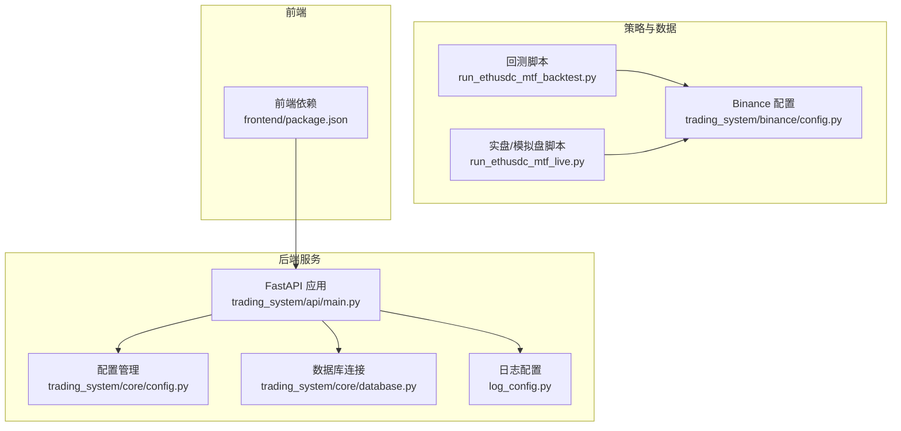
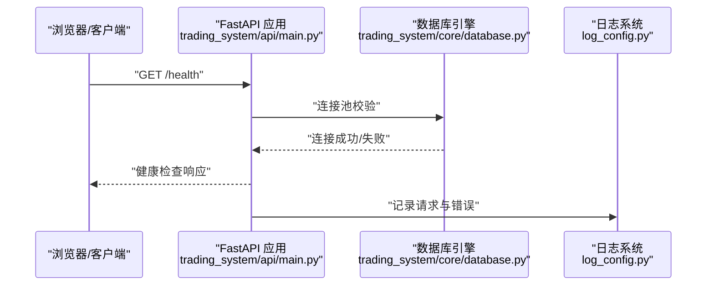
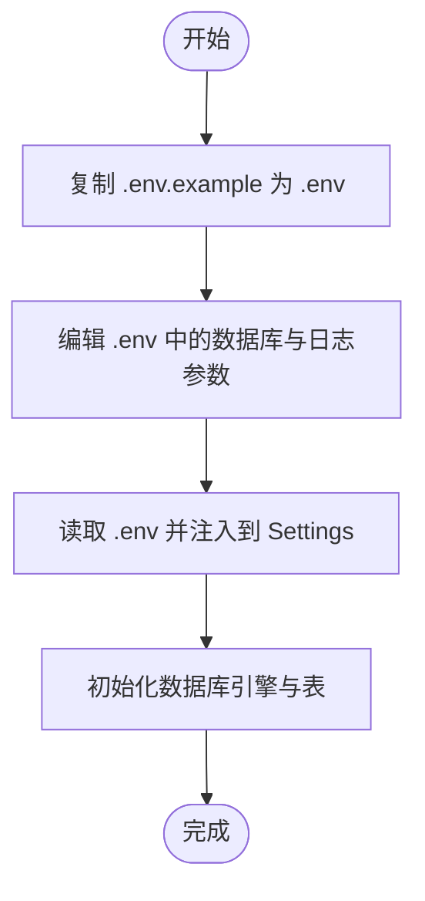
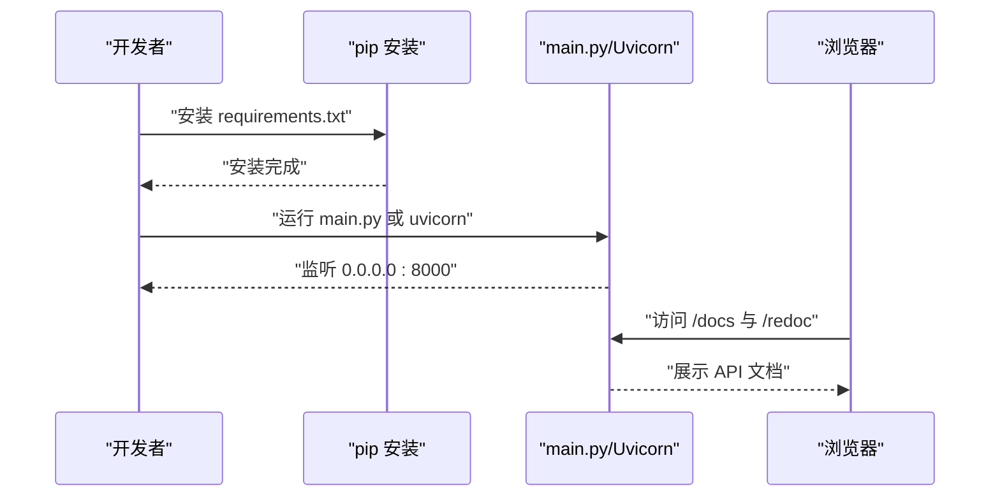
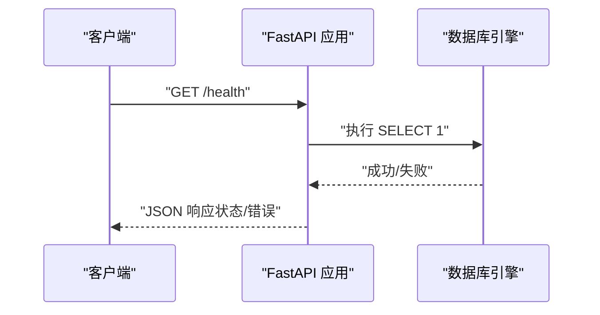
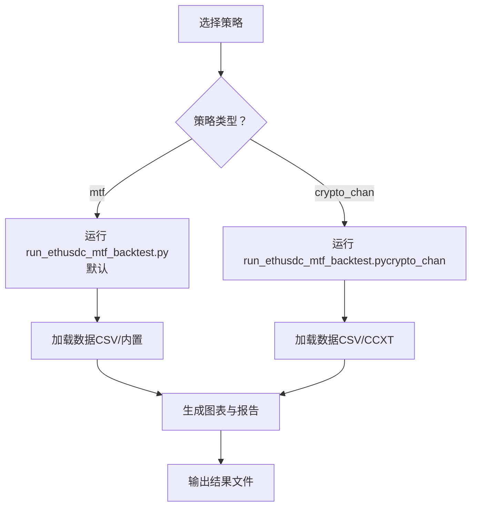
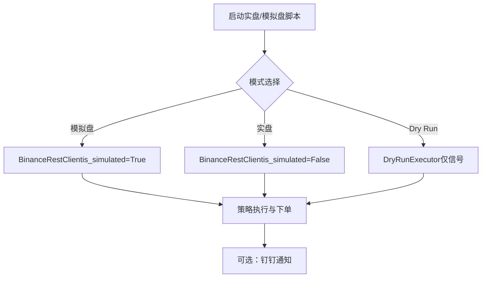
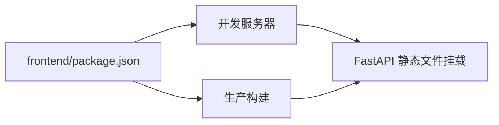
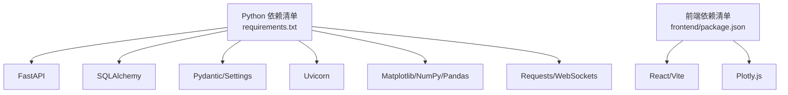

# 快速开始

<cite>
**本文引用的文件**
- [README.md](file://README.md)
- [requirements.txt](file://requirements.txt)
- [main.py](file://main.py)
- [.env.example](file://.env.example)
- [trading_system/api/main.py](file://trading_system/api/main.py)
- [trading_system/core/config.py](file://trading_system/core/config.py)
- [trading_system/core/database.py](file://trading_system/core/database.py)
- [log_config.py](file://log_config.py)
- [trading_system/binance/config.py](file://trading_system/binance/config.py)
- [run_ethusdc_mtf_backtest.py](file://run_ethusdc_mtf_backtest.py)
- [run_ethusdc_mtf_live.py](file://run_ethusdc_mtf_live.py)
- [frontend/package.json](file://frontend/package.json)
</cite>

## 目录
1. [简介](#简介)
2. [项目结构](#项目结构)
3. [核心组件](#核心组件)
4. [架构总览](#架构总览)
5. [详细组件分析](#详细组件分析)
6. [依赖分析](#依赖分析)
7. [性能考虑](#性能考虑)
8. [故障排查指南](#故障排查指南)
9. [结论](#结论)
10. [附录](#附录)

## 简介
本指南面向首次接触加密货币交易系统的用户，目标是帮助你在最短时间内完成环境准备、依赖安装、数据库与API密钥配置，并成功启动后端服务与相关工具脚本。文档覆盖以下关键步骤：
- 环境变量与数据库配置
- 依赖安装与项目启动
- API健康检查与访问
- 回测与实盘/模拟盘运行脚本
- 常见问题与验证步骤
- 不同操作系统的安装建议

## 项目结构
该项目采用前后端分离与策略回测/实盘结合的组织方式：
- 后端：基于 FastAPI 的交易系统，提供 REST API 与数据库交互
- 前端：React + Vite 构建的可视化界面（可选）
- 策略层：多周期共振与缠论策略的回测与实盘/模拟盘执行脚本
- 配置层：通过 .env 与 Pydantic Settings 管理环境变量与数据库连接池参数

**图示来源**
- [trading_system/api/main.py:1-104](file://trading_system/api/main.py#L1-L104)
- [trading_system/core/config.py:1-35](file://trading_system/core/config.py#L1-L35)
- [trading_system/core/database.py:1-45](file://trading_system/core/database.py#L1-L45)
- [log_config.py:1-74](file://log_config.py#L1-L74)
- [run_ethusdc_mtf_backtest.py:1-368](file://run_ethusdc_mtf_backtest.py#L1-L368)
- [run_ethusdc_mtf_live.py:1-332](file://run_ethusdc_mtf_live.py#L1-L332)
- [trading_system/binance/config.py:1-68](file://trading_system/binance/config.py#L1-L68)
- [frontend/package.json:1-22](file://frontend/package.json#L1-L22)

**章节来源**
- [README.md:1-150](file://README.md#L1-L150)

## 核心组件
- FastAPI 应用入口与路由注册
- 数据库连接与连接池配置
- 环境变量与日志配置
- Binance API 配置（含代理、模拟盘/实盘切换）

**章节来源**
- [trading_system/api/main.py:1-104](file://trading_system/api/main.py#L1-L104)
- [trading_system/core/config.py:1-35](file://trading_system/core/config.py#L1-L35)
- [trading_system/core/database.py:1-45](file://trading_system/core/database.py#L1-L45)
- [log_config.py:1-74](file://log_config.py#L1-L74)
- [trading_system/binance/config.py:1-68](file://trading_system/binance/config.py#L1-L68)

## 架构总览
下图展示了从浏览器到后端 API，再到数据库与外部交易所接口的整体流程。

**图示来源**
- [trading_system/api/main.py:75-88](file://trading_system/api/main.py#L75-L88)
- [trading_system/core/database.py:24-45](file://trading_system/core/database.py#L24-L45)
- [log_config.py:1-74](file://log_config.py#L1-L74)

## 详细组件分析

### 环境变量与数据库配置
- 复制示例环境变量文件并按需修改
- 数据库连接 URL 由环境变量驱动，同时代码中存在固定默认值用于演示
- 连接池参数（大小、溢出、超时、回收等）来自配置对象

**图示来源**
- [.env.example:1-7](file://.env.example#L1-L7)
- [trading_system/core/config.py:1-35](file://trading_system/core/config.py#L1-L35)
- [trading_system/core/database.py:1-45](file://trading_system/core/database.py#L1-L45)

**章节来源**
- [README.md:57-79](file://README.md#L57-L79)
- [.env.example:1-7](file://.env.example#L1-L7)
- [trading_system/core/config.py:1-35](file://trading_system/core/config.py#L1-L35)
- [trading_system/core/database.py:1-45](file://trading_system/core/database.py#L1-L45)

### 依赖安装与项目启动
- 安装 Python 依赖
- 启动 FastAPI 应用（直接运行入口或通过 Uvicorn）
- 访问 API 文档（Swagger UI / ReDoc）

**图示来源**
- [requirements.txt:1-64](file://requirements.txt#L1-L64)
- [main.py:1-13](file://main.py#L1-L13)
- [README.md:75-98](file://README.md#L75-L98)

**章节来源**
- [README.md:75-98](file://README.md#L75-L98)
- [requirements.txt:1-64](file://requirements.txt#L1-L64)
- [main.py:1-13](file://main.py#L1-L13)

### API 健康检查与访问
- 健康检查端点会尝试执行一条 SQL 语句验证数据库连通性
- 返回“健康”或“不健康”状态及错误详情

**图示来源**
- [trading_system/api/main.py:75-88](file://trading_system/api/main.py#L75-L88)

**章节来源**
- [trading_system/api/main.py:75-88](file://trading_system/api/main.py#L75-L88)

### 回测与实盘/模拟盘运行脚本
- 回测脚本：支持多周期共振与缠论策略，可加载本地 CSV 或通过 CCXT 获取数据
- 实盘/模拟盘脚本：支持模拟盘、实盘与“仅信号”Dry Run 模式，支持钉钉通知与守护进程

**图示来源**
- [run_ethusdc_mtf_backtest.py:1-368](file://run_ethusdc_mtf_backtest.py#L1-L368)

**章节来源**
- [run_ethusdc_mtf_backtest.py:1-368](file://run_ethusdc_mtf_backtest.py#L1-L368)

**图示来源**
- [run_ethusdc_mtf_live.py:1-332](file://run_ethusdc_mtf_live.py#L1-L332)
- [trading_system/binance/config.py:1-68](file://trading_system/binance/config.py#L1-L68)

**章节来源**
- [run_ethusdc_mtf_live.py:1-332](file://run_ethusdc_mtf_live.py#L1-L332)
- [trading_system/binance/config.py:1-68](file://trading_system/binance/config.py#L1-L68)

### 前端构建与静态资源
- 前端使用 Vite + React，可通过 npm/yarn/pnpm 安装依赖并构建
- 后端可挂载静态文件目录供前端访问

**图示来源**
- [frontend/package.json:1-22](file://frontend/package.json#L1-L22)
- [trading_system/api/main.py:90-94](file://trading_system/api/main.py#L90-L94)

**章节来源**
- [frontend/package.json:1-22](file://frontend/package.json#L1-L22)
- [trading_system/api/main.py:90-94](file://trading_system/api/main.py#L90-L94)

## 依赖分析
- Python 依赖集中在 requirements.txt，涵盖 FastAPI、SQLAlchemy、Pydantic、Uvicorn、Matplotlib、NumPy、Pandas、Requests、WebSockets 等
- 前端依赖集中在 frontend/package.json，包含 React、Vite、Plotly 等

**图示来源**
- [requirements.txt:1-64](file://requirements.txt#L1-L64)
- [frontend/package.json:1-22](file://frontend/package.json#L1-L22)

**章节来源**
- [requirements.txt:1-64](file://requirements.txt#L1-L64)
- [frontend/package.json:1-22](file://frontend/package.json#L1-L22)

## 性能考虑
- 数据库连接池参数（大小、溢出、超时、回收）直接影响并发与稳定性
- 日志级别与输出（控制台/文件）影响 IO 开销
- 回测与实盘脚本中的数据加载与绘图可能占用较多内存与 CPU，建议在资源充足的机器上运行

[本节为通用建议，无需特定文件引用]

## 故障排查指南
- 数据库连接失败
  - 检查 .env 中 DATABASE_URL 是否正确
  - 确认数据库服务已启动且允许远程连接
  - 查看后端启动日志定位具体错误
- API 无法访问
  - 确认端口 8000 未被占用
  - 使用 /health 端点验证数据库连通性
- 回测脚本找不到数据
  - 若使用本地 CSV，请提供正确的数据目录
  - 若使用 CCXT，请安装 ccxt 并确保网络可用
- 实盘/模拟盘下单异常
  - 确认 Binance API 密钥与模拟盘开关配置正确
  - 检查代理设置（若启用）

**章节来源**
- [trading_system/api/main.py:75-88](file://trading_system/api/main.py#L75-L88)
- [trading_system/core/database.py:1-45](file://trading_system/core/database.py#L1-L45)
- [log_config.py:1-74](file://log_config.py#L1-L74)
- [run_ethusdc_mtf_backtest.py:305-323](file://run_ethusdc_mtf_backtest.py#L305-L323)
- [trading_system/binance/config.py:1-68](file://trading_system/binance/config.py#L1-L68)

## 结论
通过本快速开始指南，你已经完成了环境变量与数据库配置、依赖安装、后端服务启动与健康检查，并了解了回测与实盘/模拟盘脚本的基本用法。建议在完成基础验证后，逐步完善 API 密钥与通知配置，并根据实际需求调整策略参数与风控阈值。

[本节为总结性内容，无需特定文件引用]

## 附录

### A. 环境变量与密钥配置要点
- 复制并编辑 .env 文件，至少包含数据库连接与日志级别
- Binance 配置支持模拟盘/实盘切换、代理与钉钉通知开关

**章节来源**
- [.env.example:1-7](file://.env.example#L1-L7)
- [trading_system/binance/config.py:1-68](file://trading_system/binance/config.py#L1-L68)

### B. 常用命令清单
- 安装依赖：参考 requirements.txt
- 启动后端：参考 main.py 或 README 中的 Uvicorn 示例
- 访问文档：Swagger UI 与 ReDoc 地址见 README
- 回测：参考 run_ethusdc_mtf_backtest.py 的参数说明
- 实盘/模拟盘：参考 run_ethusdc_mtf_live.py 的参数说明

**章节来源**
- [requirements.txt:1-64](file://requirements.txt#L1-L64)
- [README.md:75-98](file://README.md#L75-L98)
- [main.py:1-13](file://main.py#L1-L13)
- [run_ethusdc_mtf_backtest.py:325-365](file://run_ethusdc_mtf_backtest.py#L325-L365)
- [run_ethusdc_mtf_live.py:155-183](file://run_ethusdc_mtf_live.py#L155-L183)

### C. 不同操作系统安装建议
- Windows/Linux/macOS 均可使用 Python 3.7+ 与 pip 安装依赖
- 若需编译依赖（如某些 C 扩展），请确保系统已安装对应编译工具链
- 前端开发与构建使用 Node.js（版本由 package.json 指定），建议使用 nvm 管理 Node 版本

**章节来源**
- [requirements.txt:1-64](file://requirements.txt#L1-L64)
- [frontend/package.json:1-22](file://frontend/package.json#L1-L22)