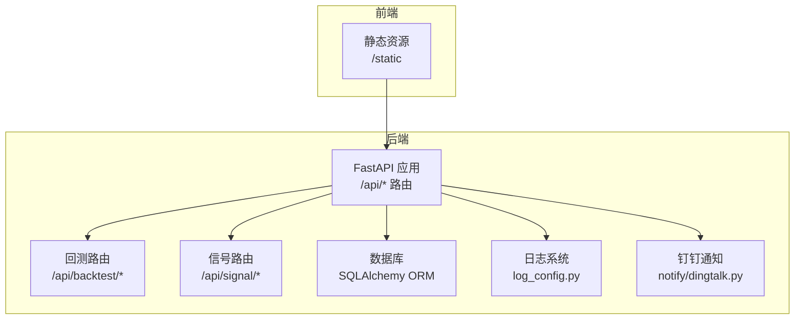
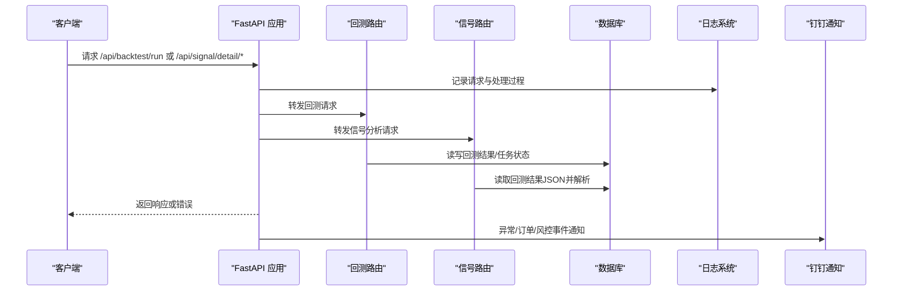
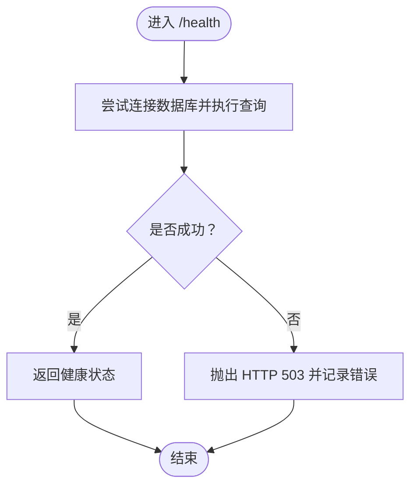
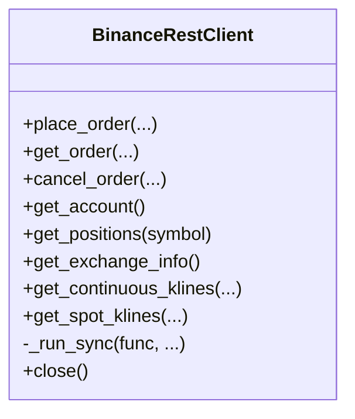
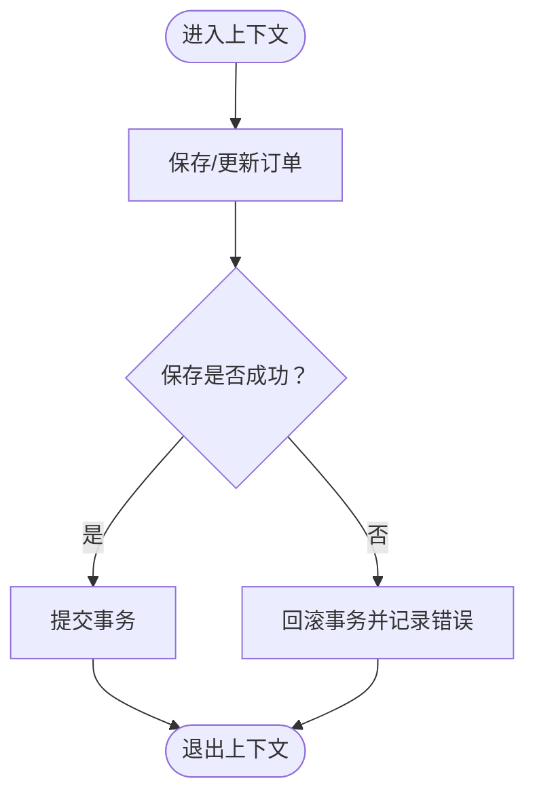
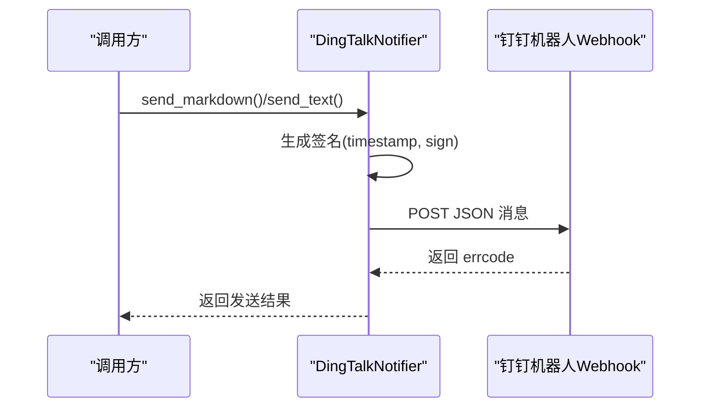
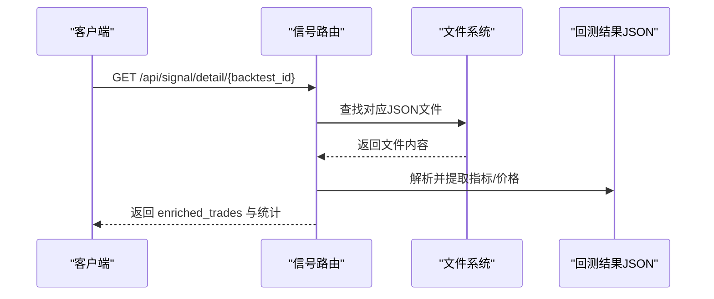
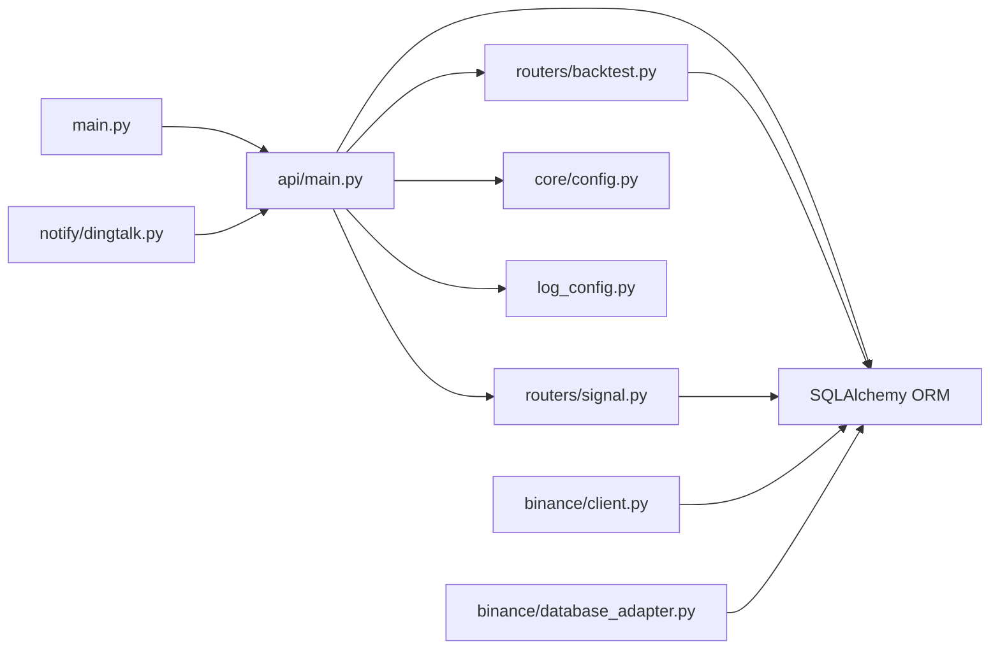

# 故障排除

<cite>
**本文引用的文件**
- [README.md](file://README.md)
- [log_config.py](file://log_config.py)
- [main.py](file://main.py)
- [trading_system/api/main.py](file://trading_system/api/main.py)
- [trading_system/core/config.py](file://trading_system/core/config.py)
- [trading_system/binance/client.py](file://trading_system/binance/client.py)
- [trading_system/binance/database_adapter.py](file://trading_system/binance/database_adapter.py)
- [trading_system/api/routers/backtest.py](file://trading_system/api/routers/backtest.py)
- [trading_system/api/routers/signal.py](file://trading_system/api/routers/signal.py)
- [trading_system/services/crud.py](file://trading_system/services/crud.py)
- [trading_system/models/trading_order.py](file://trading_system/models/trading_order.py)
- [trading_system/models/trade_record.py](file://trading_system/models/trade_record.py)
- [trading_system/models/position.py](file://trading_system/models/position.py)
- [trading_system/notify/dingtalk.py](file://trading_system/notify/dingtalk.py)
- [requirements.txt](file://requirements.txt)
</cite>

## 目录
1. [简介](#简介)
2. [项目结构](#项目结构)
3. [核心组件](#核心组件)
4. [架构总览](#架构总览)
5. [详细组件分析](#详细组件分析)
6. [依赖关系分析](#依赖关系分析)
7. [性能考量](#性能考量)
8. [故障排除指南](#故障排除指南)
9. [结论](#结论)
10. [附录](#附录)

## 简介
本指南面向运维与开发人员，提供系统化的问题诊断与解决方法，覆盖日志分析、错误码与异常处理、网络连接、API认证、数据异常、性能问题、调试工具、监控指标与健康检查、根因分析与预防、紧急处置与恢复流程等。内容基于仓库中的实际代码与配置进行提炼，确保可操作性与可追溯性。

## 项目结构
系统采用前后端分离与后端微服务化的组织方式：
- 后端为 FastAPI 应用，提供回测与信号分析 API，并内置健康检查与异常处理。
- 数据访问通过 SQLAlchemy ORM 与数据库交互，订单、成交记录、持仓等模型清晰分离。
- 交易接口层支持 Binance 与 OKX（OKX 模块位于独立目录），具备 REST 客户端与数据库适配器。
- 日志统一由 log_config 提供，支持控制台与文件输出；通知模块集成钉钉机器人。

图表来源
- [trading_system/api/main.py:12-98](file://trading_system/api/main.py#L12-L98)
- [trading_system/api/routers/backtest.py:1-68](file://trading_system/api/routers/backtest.py#L1-L68)
- [trading_system/api/routers/signal.py:1-178](file://trading_system/api/routers/signal.py#L1-L178)
- [log_config.py:11-64](file://log_config.py#L11-L64)
- [trading_system/notify/dingtalk.py:14-185](file://trading_system/notify/dingtalk.py#L14-L185)

章节来源
- [README.md:1-150](file://README.md#L1-L150)
- [trading_system/api/main.py:12-98](file://trading_system/api/main.py#L12-L98)

## 核心组件
- 日志系统：统一 Logger 配置，支持控制台与文件输出，便于集中定位问题。
- FastAPI 应用：全局异常处理器、CORS、健康检查、静态文件挂载。
- 数据库配置与连接池：通过配置类设置连接池大小、超时、回收策略等。
- Binance 接口：REST 客户端封装下单、查询、取消、账户、K线等接口，含详尽日志。
- 数据库适配器：订单、成交记录、持仓的持久化与事务回滚。
- 通知模块：钉钉机器人消息推送，带限流与签名校验。
- 回测与信号分析：回测任务提交、状态查询、信号明细与指标统计。

章节来源
- [log_config.py:11-64](file://log_config.py#L11-L64)
- [trading_system/api/main.py:24-88](file://trading_system/api/main.py#L24-L88)
- [trading_system/core/config.py:5-35](file://trading_system/core/config.py#L5-L35)
- [trading_system/binance/client.py:10-342](file://trading_system/binance/client.py#L10-L342)
- [trading_system/binance/database_adapter.py:14-189](file://trading_system/binance/database_adapter.py#L14-L189)
- [trading_system/notify/dingtalk.py:14-185](file://trading_system/notify/dingtalk.py#L14-L185)
- [trading_system/api/routers/backtest.py:1-68](file://trading_system/api/routers/backtest.py#L1-L68)
- [trading_system/api/routers/signal.py:1-178](file://trading_system/api/routers/signal.py#L1-L178)

## 架构总览
系统运行时序与关键交互如下：

图表来源
- [trading_system/api/main.py:24-98](file://trading_system/api/main.py#L24-L98)
- [trading_system/api/routers/backtest.py:27-68](file://trading_system/api/routers/backtest.py#L27-L68)
- [trading_system/api/routers/signal.py:31-178](file://trading_system/api/routers/signal.py#L31-L178)
- [log_config.py:11-64](file://log_config.py#L11-L64)
- [trading_system/notify/dingtalk.py:54-185](file://trading_system/notify/dingtalk.py#L54-L185)

## 详细组件分析

### 日志系统与健康检查
- 日志配置：支持控制台与文件输出，避免重复 handler，便于本地与生产环境统一管理。
- 健康检查：/health 对数据库执行简单查询，失败时返回 503 并记录错误，便于探活与告警联动。
- 全局异常处理：捕获未预期异常并返回统一 JSON 错误体，同时记录堆栈信息。

图表来源
- [trading_system/api/main.py:75-88](file://trading_system/api/main.py#L75-L88)

章节来源
- [log_config.py:11-64](file://log_config.py#L11-L64)
- [trading_system/api/main.py:24-88](file://trading_system/api/main.py#L24-L88)

### Binance REST 客户端
- 功能覆盖：下单、查询、取消、账户、持仓、K线等。
- 错误处理：每个方法均包裹 try-except，记录错误并返回包含错误信息的字典，便于上层统一处理。
- 日志记录：关键请求与响应均有 INFO/ERROR 级别日志，便于审计与排障。

图表来源
- [trading_system/binance/client.py:10-342](file://trading_system/binance/client.py#L10-L342)

章节来源
- [trading_system/binance/client.py:38-170](file://trading_system/binance/client.py#L38-L170)

### 数据库适配器与事务回滚
- 适配器模式：封装数据库会话生命周期，异常时自动 rollback 并记录错误。
- 订单/成交/持仓：提供保存、查询、更新等方法，统一返回值便于上层判断。
- 事务一致性：在上下文管理器中保证异常安全。

图表来源
- [trading_system/binance/database_adapter.py:20-61](file://trading_system/binance/database_adapter.py#L20-L61)

章节来源
- [trading_system/binance/database_adapter.py:14-189](file://trading_system/binance/database_adapter.py#L14-L189)

### 通知模块（钉钉）
- 签名认证：按要求生成 timestamp 与 sign，构造 webhook URL。
- 限流控制：1 分钟最多发送固定条数，超过则丢弃并记录告警。
- 多种消息类型：文本、Markdown、交易信号、订单结果、异常与风控状态。

图表来源
- [trading_system/notify/dingtalk.py:41-86](file://trading_system/notify/dingtalk.py#L41-L86)

章节来源
- [trading_system/notify/dingtalk.py:14-185](file://trading_system/notify/dingtalk.py#L14-L185)

### 回测与信号分析路由
- 回测路由：提供任务提交、状态查询、结果列表、参数模板、可用日期范围查询。
- 信号路由：解析回测 JSON，提取信号指标与价格参考，统计指标触发频次，汇总交易摘要。

图表来源
- [trading_system/api/routers/signal.py:31-131](file://trading_system/api/routers/signal.py#L31-L131)

章节来源
- [trading_system/api/routers/backtest.py:1-68](file://trading_system/api/routers/backtest.py#L1-L68)
- [trading_system/api/routers/signal.py:1-178](file://trading_system/api/routers/signal.py#L1-L178)

## 依赖关系分析
- FastAPI 应用依赖日志配置、数据库初始化、路由注册与静态文件挂载。
- 路由层依赖服务层（回测服务）、文件系统（信号分析）与数据库。
- Binance 客户端依赖配置与第三方 SDK，适配器依赖 SQLAlchemy 与模型。
- 通知模块依赖网络请求与钉钉 webhook。

图表来源
- [main.py:1-13](file://main.py#L1-L13)
- [trading_system/api/main.py:12-98](file://trading_system/api/main.py#L12-L98)
- [trading_system/api/routers/backtest.py:1-68](file://trading_system/api/routers/backtest.py#L1-L68)
- [trading_system/api/routers/signal.py:1-178](file://trading_system/api/routers/signal.py#L1-L178)
- [trading_system/core/config.py:5-35](file://trading_system/core/config.py#L5-L35)
- [trading_system/binance/client.py:10-342](file://trading_system/binance/client.py#L10-L342)
- [trading_system/binance/database_adapter.py:14-189](file://trading_system/binance/database_adapter.py#L14-L189)
- [trading_system/notify/dingtalk.py:14-185](file://trading_system/notify/dingtalk.py#L14-L185)

章节来源
- [requirements.txt:1-64](file://requirements.txt#L1-L64)

## 性能考量
- 连接池与超时：合理设置连接池大小、最大溢出、超时与回收时间，避免并发高峰下的连接争用。
- 日志级别：生产环境建议提升至 INFO 或 WARNING，减少 DEBUG 产生的 I/O 压力。
- 异步与阻塞：REST 客户端内部使用线程池执行阻塞调用，注意事件循环与线程切换开销。
- 限流与重试：对外部接口调用需结合限速策略与指数退避，避免触发平台限流。
- 健康检查：/health 仅执行轻量查询，避免对生产数据库造成额外压力。

章节来源
- [trading_system/core/config.py:7-12](file://trading_system/core/config.py#L7-L12)
- [trading_system/binance/client.py:31-36](file://trading_system/binance/client.py#L31-L36)

## 故障排除指南

### 一、日志分析方法
- 定位入口
  - 应用启动与异常：查看 FastAPI 全局异常处理器记录的错误堆栈。
  - 数据库初始化：关注启动阶段的初始化日志与错误。
  - Binance 接口：下单、查询、取消等方法均记录请求与错误信息。
  - 通知模块：钉钉发送失败、限流告警、签名异常等。
- 建议步骤
  - 设置日志级别为 INFO，收集近 24 小时日志。
  - 使用时间窗口筛选关键错误（如下单失败、查询超时、数据库连接失败）。
  - 对比同一时间段内的外部接口返回码与系统响应码，定位是上游还是下游问题。
  - 在回测与信号分析路径中，关注 JSON 文件读取与解析异常。

章节来源
- [trading_system/api/main.py:33-55](file://trading_system/api/main.py#L33-L55)
- [trading_system/api/main.py:58-66](file://trading_system/api/main.py#L58-L66)
- [trading_system/binance/client.py:64-72](file://trading_system/binance/client.py#L64-L72)
- [trading_system/notify/dingtalk.py:45-71](file://trading_system/notify/dingtalk.py#L45-L71)

### 二、错误代码与含义
- HTTP 500（未预期异常）
  - 触发点：全局异常处理器捕获未处理异常。
  - 表现：返回统一错误体，记录异常详情。
  - 排查：查看日志堆栈，定位具体路由与业务逻辑。
- HTTP 404（资源不存在）
  - 触发点：信号详情或任务状态查询时找不到文件或任务。
  - 排查：确认 backtest_id 是否正确，文件是否存在。
- HTTP 503（服务不可用）
  - 触发点：/health 健康检查数据库查询失败。
  - 排查：检查数据库连接、权限、网络连通性与连接池状态。

章节来源
- [trading_system/api/main.py:33-55](file://trading_system/api/main.py#L33-L55)
- [trading_system/api/main.py:75-87](file://trading_system/api/main.py#L75-L87)
- [trading_system/api/routers/signal.py:40-41](file://trading_system/api/routers/signal.py#L40-L41)

### 三、网络连接问题
- 症状
  - Binance 接口调用超时或返回错误。
  - /health 返回 503。
- 排查步骤
  - 检查数据库连接串与可达性（host/port/网络）。
  - 校验代理与信任环境设置（SDK 会话不信任环境变量）。
  - 验证 DNS 与防火墙策略，确保可访问目标域名。
  - 使用 ping/trace 检查网络延迟与丢包。
- 预防措施
  - 在配置中启用连接池与超时参数。
  - 对外网调用增加重试与熔断策略。

章节来源
- [trading_system/binance/client.py:23-30](file://trading_system/binance/client.py#L23-L30)
- [trading_system/api/main.py:75-87](file://trading_system/api/main.py#L75-L87)
- [trading_system/core/config.py:7-12](file://trading_system/core/config.py#L7-L12)

### 四、API 认证失败
- 症状
  - 下单/查询返回认证错误或签名失败。
  - 钉钉通知无法发送（access_token/secret 缺失或签名错误）。
- 排查步骤
  - 确认密钥与口令配置正确且未过期。
  - 校验签名生成流程（timestamp、sign、URL 参数顺序）。
  - 检查 webhook 地址与权限组设置。
- 预防措施
  - 将密钥存储在受控环境变量中，避免硬编码。
  - 定期轮换密钥并验证最小权限原则。

章节来源
- [trading_system/notify/dingtalk.py:20-43](file://trading_system/notify/dingtalk.py#L20-L43)
- [trading_system/notify/dingtalk.py:54-71](file://trading_system/notify/dingtalk.py#L54-L71)

### 五、数据异常
- 症状
  - 订单状态不同步、成交记录缺失、持仓不一致。
  - 回测结果 JSON 读取失败或解析异常。
- 排查步骤
  - 检查数据库适配器的保存/更新逻辑与事务回滚。
  - 核对模型字段与枚举值（订单类型、方向、状态）。
  - 确认回测结果文件命名与路径，解析前先校验 JSON 结构。
- 预防措施
  - 在关键写入点增加幂等性与去重逻辑。
  - 对外部输入进行严格校验与默认值处理。

章节来源
- [trading_system/binance/database_adapter.py:31-61](file://trading_system/binance/database_adapter.py#L31-L61)
- [trading_system/models/trading_order.py:8-24](file://trading_system/models/trading_order.py#L8-L24)
- [trading_system/api/routers/signal.py:34-43](file://trading_system/api/routers/signal.py#L34-L43)

### 六、性能问题
- 症状
  - 接口响应缓慢、CPU 占用高、数据库锁等待。
- 排查步骤
  - 利用 X-Process-Time 响应头评估处理耗时。
  - 检查数据库慢查询与索引缺失。
  - 评估连接池饱和度与超时配置。
- 优化建议
  - 合理设置连接池参数，避免过度连接。
  - 对热点查询增加索引与缓存。
  - 异步化阻塞调用，减少主线程阻塞。

章节来源
- [trading_system/api/main.py:24-30](file://trading_system/api/main.py#L24-L30)
- [trading_system/core/config.py:7-12](file://trading_system/core/config.py#L7-L12)

### 七、调试工具与监控指标
- 调试工具
  - 使用 uvicorn 直接运行应用，观察控制台日志。
  - 使用 HTTP 客户端（curl/postman）直接调用 /health 与 /docs。
  - 在 Binance 客户端中启用更详细的日志级别进行追踪。
- 监控指标
  - 健康检查：/health 的可用性与错误码。
  - 响应时间：X-Process-Time 头部。
  - 错误率：各路由的 4xx/5xx 比例。
  - 数据库：连接数、等待时间、慢查询数量。
- 系统健康检查清单
  - 网络连通性（数据库、外部交易所）。
  - 配置文件加载（.env、数据库 URL、密钥）。
  - 日志落盘与轮转。
  - 通知通道可用性（钉钉 webhook）。

章节来源
- [main.py:5-12](file://main.py#L5-L12)
- [trading_system/api/main.py:69-87](file://trading_system/api/main.py#L69-L87)

### 八、根因分析与预防
- 常见根因
  - 配置错误：数据库 URL、密钥、限速阈值。
  - 网络波动：DNS 解析失败、TLS 握手超时、代理干扰。
  - 数据不一致：事务未提交、并发写入冲突、模型字段不匹配。
  - 外部接口限流：未遵循速率限制导致 429/5xx。
- 预防措施
  - 引入配置校验与启动自检。
  - 实施重试、熔断与降级策略。
  - 增强日志与埋点，建立告警阈值。
  - 对关键路径进行压测与容量规划。

### 九、紧急情况处理与系统恢复
- 紧急处置
  - 快速隔离：临时关闭高风险路由或通知通道。
  - 降级策略：优先保障核心功能（如只读接口）。
  - 限流与熔断：对外部接口实施限流，防止雪崩。
- 系统恢复
  - 重启应用：在修复配置或网络后重启。
  - 数据修复：回滚事务、补齐缺失记录、重放事件。
  - 验证恢复：执行 /health 与关键接口回归测试。
- 恢复演练
  - 定期进行故障注入与演练，验证自动化恢复脚本与告警链路。

## 结论
通过统一的日志体系、完善的异常处理、清晰的组件边界与严格的配置管理，系统能够在多数场景下快速定位问题并恢复服务。建议持续完善监控与告警、加强配置与密钥治理、落实容量与性能基线，以降低故障发生概率与影响面。

## 附录
- 快速检查清单
  - /health 是否返回 healthy。
  - 数据库连接串与权限是否正确。
  - Binance 密钥与口令是否有效。
  - 钉钉 webhook 是否可达且签名正确。
  - 日志级别与输出位置是否符合预期。
- 参考文件路径
  - 应用入口与运行：[main.py:1-13](file://main.py#L1-L13)
  - API 主入口与健康检查：[trading_system/api/main.py:12-98](file://trading_system/api/main.py#L12-L98)
  - 日志配置：[log_config.py:11-64](file://log_config.py#L11-L64)
  - 数据库配置：[trading_system/core/config.py:5-35](file://trading_system/core/config.py#L5-L35)
  - Binance 客户端：[trading_system/binance/client.py:10-342](file://trading_system/binance/client.py#L10-L342)
  - 数据库适配器：[trading_system/binance/database_adapter.py:14-189](file://trading_system/binance/database_adapter.py#L14-L189)
  - 通知模块：[trading_system/notify/dingtalk.py:14-185](file://trading_system/notify/dingtalk.py#L14-L185)
  - 回测与信号路由：[trading_system/api/routers/backtest.py:1-68](file://trading_system/api/routers/backtest.py#L1-L68)、[trading_system/api/routers/signal.py:1-178](file://trading_system/api/routers/signal.py#L1-L178)
  - 数据模型：[trading_system/models/trading_order.py:26-43](file://trading_system/models/trading_order.py#L26-L43)、[trading_system/models/trade_record.py:8-22](file://trading_system/models/trade_record.py#L8-L22)、[trading_system/models/position.py:6-18](file://trading_system/models/position.py#L6-L18)
  - 依赖清单：[requirements.txt:1-64](file://requirements.txt#L1-L64)