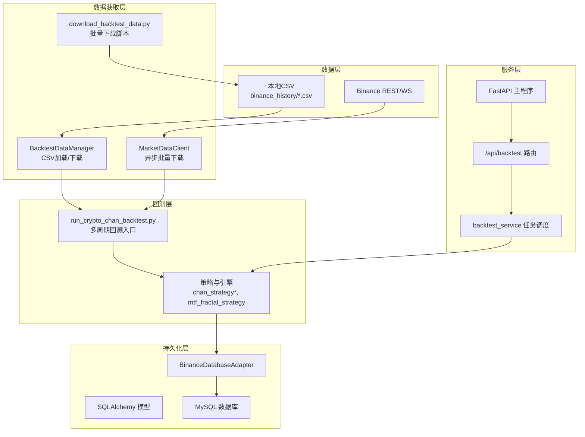
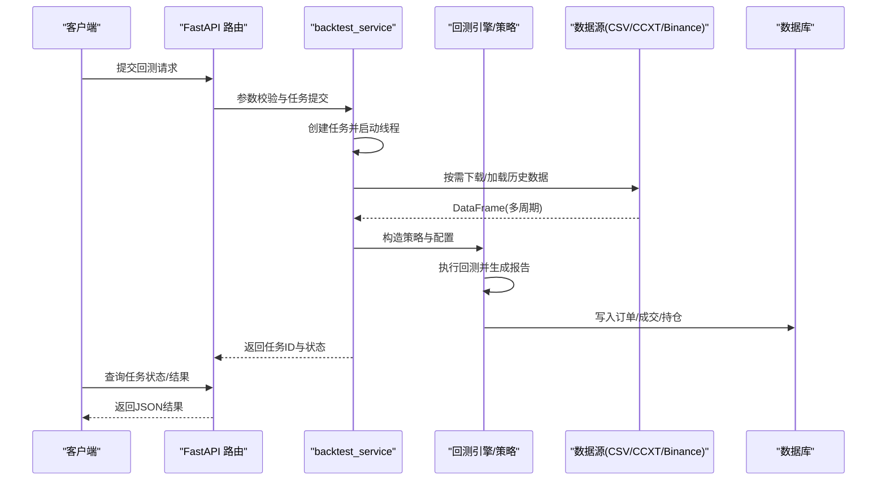
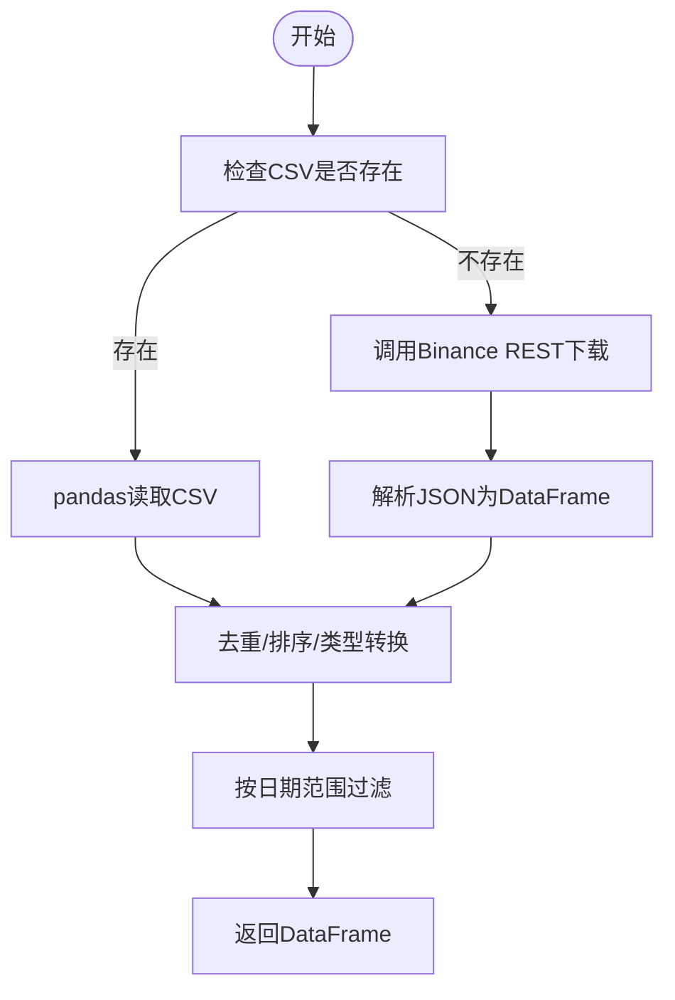
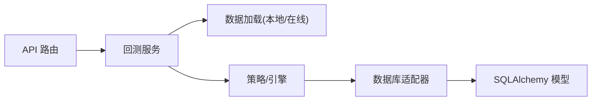

# 回测数据管理

<cite>
**本文引用的文件**   
- [README.md](file://README.md)
- [backtest_data.py](file://trading_system/data/backtest_data.py)
- [market_data.py](file://trading_system/data/market_data.py)
- [database.py](file://trading_system/core/database.py)
- [database_adapter.py](file://trading_system/binance/database_adapter.py)
- [mapper.py](file://trading_system/binance/mapper.py)
- [trading_order.py](file://trading_system/models/trading_order.py)
- [trade_record.py](file://trading_system/models/trade_record.py)
- [position.py](file://trading_system/models/position.py)
- [schemas.py](file://trading_system/core/schemas.py)
- [main.py](file://trading_system/api/main.py)
- [backtest.py](file://trading_system/api/routers/backtest.py)
- [backtest_service.py](file://trading_system/api/services/backtest_service.py)
- [download_backtest_data.py](file://download_backtest_data.py)
- [run_crypto_chan_backtest.py](file://run_crypto_chan_backtest.py)
- [ETHUSDC_1d.csv](file://trading_system/data/binance_history/ETHUSDC_1d.csv)
</cite>

## 目录
1. [引言](#引言)
2. [项目结构](#项目结构)
3. [核心组件](#核心组件)
4. [架构总览](#架构总览)
5. [详细组件分析](#详细组件分析)
6. [依赖关系分析](#依赖关系分析)
7. [性能考虑](#性能考虑)
8. [故障排查指南](#故障排查指南)
9. [结论](#结论)
10. [附录](#附录)

## 引言
本文件面向回测数据管理系统，系统性阐述历史数据存储结构、数据文件组织与管理策略；解释回测数据的加载、验证与预处理流程；文档化CSV数据格式标准、字段定义与数据完整性检查；涵盖数据导入导出、版本管理与备份策略；说明多时间框架数据的存储优化与查询性能；提供数据质量控制、异常检测与修复机制；并给出实际回测数据使用案例与数据清理示例。

## 项目结构
系统采用分层架构，围绕“数据获取—数据管理—回测引擎—API服务—数据库”展开，主要目录与职责如下：
- trading_system/data：数据获取与本地CSV管理
- trading_system/api：FastAPI服务与路由
- trading_system/api/services：回测任务调度与执行
- trading_system/strategies：策略与回测引擎
- trading_system/models：数据库模型
- trading_system/binance：Binance相关适配与映射
- trading_system/core：数据库连接与Pydantic模型
- trading_system/backtest：回测运行与图表
- trading_system/utils：指标与绘图工具
- trading_system/notify：通知（钉钉）

**图表来源**
- [market_data.py:12-118](file://trading_system/data/market_data.py#L12-L118)
- [backtest_data.py:9-136](file://trading_system/data/backtest_data.py#L9-L136)
- [download_backtest_data.py:16-78](file://download_backtest_data.py#L16-L78)
- [run_crypto_chan_backtest.py:174-329](file://run_crypto_chan_backtest.py#L174-L329)
- [main.py:12-103](file://trading_system/api/main.py#L12-L103)
- [backtest.py:1-68](file://trading_system/api/routers/backtest.py#L1-L68)
- [backtest_service.py:58-248](file://trading_system/api/services/backtest_service.py#L58-L248)
- [database_adapter.py:14-189](file://trading_system/binance/database_adapter.py#L14-L189)
- [database.py:12-44](file://trading_system/core/database.py#L12-L44)

**章节来源**
- [README.md:1-150](file://README.md#L1-L150)

## 核心组件
- 数据获取与管理
  - MarketDataClient：异步批量拉取K线，支持分批与时间范围过滤，统一输出open_time/open/high/low/close/volume。
  - BacktestDataManager：本地CSV加载与历史数据下载（兼容旧接口），自动去重、排序与数值转换。
  - download_backtest_data.py：批量下载脚本，按时间窗口与批次拉取并写入CSV。
- 回测执行
  - run_crypto_chan_backtest.py：多周期回测入口，支持本地CSV与CCXT两种数据源，自动日期过滤与回测报告生成。
  - backtest_service.py：API服务侧的任务提交、并发执行、结果持久化与查询。
- 数据库与模型
  - database.py：连接池配置与表初始化。
  - BinanceDatabaseAdapter：订单、成交、持仓的增删改查与事务管理。
  - TradingOrder/TradeRecord/Position：ORM模型与Pydantic响应模型。
- API与路由
  - main.py：FastAPI应用、CORS、健康检查、静态文件挂载。
  - backtest.py：回测任务提交、查询、结果列表与参数模板。

**章节来源**
- [market_data.py:12-118](file://trading_system/data/market_data.py#L12-L118)
- [backtest_data.py:9-136](file://trading_system/data/backtest_data.py#L9-L136)
- [download_backtest_data.py:16-78](file://download_backtest_data.py#L16-L78)
- [run_crypto_chan_backtest.py:174-329](file://run_crypto_chan_backtest.py#L174-L329)
- [backtest_service.py:58-248](file://trading_system/api/services/backtest_service.py#L58-L248)
- [database.py:12-44](file://trading_system/core/database.py#L12-L44)
- [database_adapter.py:14-189](file://trading_system/binance/database_adapter.py#L14-L189)
- [trading_order.py:26-42](file://trading_system/models/trading_order.py#L26-L42)
- [trade_record.py:8-21](file://trading_system/models/trade_record.py#L8-L21)
- [position.py:6-17](file://trading_system/models/position.py#L6-L17)
- [schemas.py:7-87](file://trading_system/core/schemas.py#L7-L87)
- [main.py:12-103](file://trading_system/api/main.py#L12-L103)
- [backtest.py:1-68](file://trading_system/api/routers/backtest.py#L1-L68)

## 架构总览
系统以“数据即服务”的理念组织，数据层提供CSV与在线API两种来源；回测层负责策略与引擎；服务层通过API暴露任务提交与查询；持久化层承载实盘/回测产生的订单、成交与持仓信息。

**图表来源**
- [backtest.py:49-67](file://trading_system/api/routers/backtest.py#L49-L67)
- [backtest_service.py:58-248](file://trading_system/api/services/backtest_service.py#L58-L248)
- [run_crypto_chan_backtest.py:216-329](file://run_crypto_chan_backtest.py#L216-L329)
- [market_data.py:28-118](file://trading_system/data/market_data.py#L28-L118)
- [backtest_data.py:47-136](file://trading_system/data/backtest_data.py#L47-L136)
- [database_adapter.py:31-161](file://trading_system/binance/database_adapter.py#L31-L161)

## 详细组件分析

### 数据文件组织与CSV标准
- 文件命名规范
  - 采用“交易对_时间框架.csv”，例如 ETHUSDC_1d.csv、ETHUSDC_30m.csv、ETHUSDC_4h.csv。
- 字段定义与含义
  - open_time：开盘时间（毫秒时间戳）
  - open/high/low/close：开盘价、最高价、最低价、收盘价
  - volume：成交量
  - close_time、quote_volume、trades、taker_buy_base、taker_buy_quote、ignore：保留字段
- 数据完整性检查
  - 缺失文件：加载器返回空DataFrame并记录错误日志。
  - 重复与顺序：统一去重、按open_time升序排序。
  - 类型转换：数值列转换为浮点型，时间列转换为datetime。
  - 时间范围：支持按起止日期进行过滤。
- 示例文件
  - ETHUSDC_1d.csv 展示了标准字段与数据形态。

**章节来源**
- [ETHUSDC_1d.csv:1-122](file://trading_system/data/binance_history/ETHUSDC_1d.csv#L1-L122)
- [backtest_data.py:22-45](file://trading_system/data/backtest_data.py#L22-L45)
- [run_crypto_chan_backtest.py:174-202](file://run_crypto_chan_backtest.py#L174-L202)

### 历史数据加载与预处理流程
- 本地CSV加载
  - BacktestDataManager.load_klines_from_csv：拼接路径、存在性检查、pandas读取、日志记录。
- 在线数据获取
  - MarketDataClient.get_klines：分批拉取（每批最多1000条）、统一字段、去重与排序、数值转换。
- 多周期数据准备
  - run_crypto_chan_backtest.py：按4h/1h/15m/1d组合加载，必要时扩展15m时间窗以保证上下文。
- 数据预处理要点
  - 时间戳单位转换、缺失值处理、重复项剔除、索引重置、列子集裁剪。

**图表来源**
- [backtest_data.py:22-45](file://trading_system/data/backtest_data.py#L22-L45)
- [market_data.py:28-118](file://trading_system/data/market_data.py#L28-L118)
- [run_crypto_chan_backtest.py:174-202](file://run_crypto_chan_backtest.py#L174-L202)

**章节来源**
- [backtest_data.py:22-136](file://trading_system/data/backtest_data.py#L22-L136)
- [market_data.py:28-118](file://trading_system/data/market_data.py#L28-L118)
- [run_crypto_chan_backtest.py:174-214](file://run_crypto_chan_backtest.py#L174-L214)

### 数据导入与导出
- 导入
  - download_backtest_data.py：按时间窗口与批次下载UMFutures K线，写入CSV。
  - BacktestDataManager.download_and_save_data：异步批量下载并保存为CSV。
- 导出
  - backtest_service.submit_backtest：回测完成后将结果写入JSON文件，文件名包含任务ID。
  - API路由 /api/backtest/list 与 /api/backtest/{id}：列举与查询历史回测结果。

**章节来源**
- [download_backtest_data.py:16-78](file://download_backtest_data.py#L16-L78)
- [backtest_data.py:47-136](file://trading_system/data/backtest_data.py#L47-L136)
- [backtest_service.py:20-55](file://trading_system/api/services/backtest_service.py#L20-L55)
- [backtest.py:27-46](file://trading_system/api/routers/backtest.py#L27-L46)

### 版本管理与备份策略
- 版本标识
  - 回测结果文件名包含任务ID，便于追踪版本与并行任务。
- 备份建议
  - 历史CSV与回测结果JSON应纳入版本控制或独立备份目录，定期归档。
  - 数据目录 binance_history 可按日期/策略版本分层存放，配合清单文件记录元数据。

**章节来源**
- [backtest_service.py:231-237](file://trading_system/api/services/backtest_service.py#L231-L237)

### 多时间框架存储优化与查询性能
- 存储优化
  - 不同时间框架分离为独立CSV，便于按需加载与缓存。
  - 对高频周期（如15m）可考虑扩展时间窗以满足策略上下文需求。
- 查询性能
  - pandas按open_time过滤与切片，建议确保open_time为datetime类型并建立索引。
  - 分批下载与异步I/O减少阻塞，合理设置批次大小与延时。

**章节来源**
- [run_crypto_chan_backtest.py:144-152](file://run_crypto_chan_backtest.py#L144-L152)
- [market_data.py:59-96](file://trading_system/data/market_data.py#L59-L96)

### 数据质量控制、异常检测与修复
- 质量控制
  - 缺失文件：记录错误日志并返回空DataFrame，上层逻辑需判断空DataFrame并降级处理。
  - 重复与乱序：统一去重与排序，确保时间序列连续性。
  - 类型不一致：数值列强制转换为float，时间列统一为datetime。
- 异常检测
  - API/网络异常：捕获异常并记录，避免中断整个流程。
  - 数据为空：当某周期数据为空时，提示用户并终止当前策略。
- 修复机制
  - 重新下载：通过download_backtest_data.py或BacktestDataManager.download_and_save_data补充缺失数据。
  - 人工修正：对CSV中明显错误的行进行清洗与替换。

**章节来源**
- [backtest_data.py:34-45](file://trading_system/data/backtest_data.py#L34-L45)
- [market_data.py:73-96](file://trading_system/data/market_data.py#L73-L96)
- [run_crypto_chan_backtest.py:293-295](file://run_crypto_chan_backtest.py#L293-L295)

### 实际回测数据使用案例与数据清理示例
- 使用案例
  - run_crypto_chan_backtest.py：支持本地CSV与CCXT两种数据源，自动日期过滤与回测报告生成。
  - backtest_service.submit_backtest：根据策略版本选择策略，加载多周期数据并执行回测，最终保存结果。
- 数据清理示例
  - 日期过滤：按起止日期筛选DataFrame，确保回测区间一致。
  - 缺失文件处理：若本地CSV缺失，自动尝试CCXT获取或提示安装ccxt库。
  - 批量下载：download_backtest_data.py按时间窗口与批次下载，避免API限流。

**章节来源**
- [run_crypto_chan_backtest.py:216-329](file://run_crypto_chan_backtest.py#L216-L329)
- [backtest_service.py:58-248](file://trading_system/api/services/backtest_service.py#L58-L248)
- [download_backtest_data.py:55-79](file://download_backtest_data.py#L55-L79)

## 依赖关系分析
- 组件耦合
  - 回测服务依赖数据加载模块与策略模块，策略模块依赖回测引擎。
  - API路由依赖服务层，服务层依赖数据加载与策略。
- 外部依赖
  - pandas、aiohttp、SQLAlchemy、ccxt（可选）。
- 数据库依赖
  - BinanceDatabaseAdapter通过SessionLocal管理会话，提供订单、成交、持仓的CRUD与事务。

**图表来源**
- [backtest.py:1-68](file://trading_system/api/routers/backtest.py#L1-L68)
- [backtest_service.py:58-248](file://trading_system/api/services/backtest_service.py#L58-L248)
- [database_adapter.py:14-189](file://trading_system/binance/database_adapter.py#L14-L189)

**章节来源**
- [backtest.py:1-68](file://trading_system/api/routers/backtest.py#L1-L68)
- [backtest_service.py:58-248](file://trading_system/api/services/backtest_service.py#L58-L248)
- [database_adapter.py:14-189](file://trading_system/binance/database_adapter.py#L14-L189)

## 性能考虑
- I/O与网络
  - 使用异步客户端与分批下载，降低等待时间与API限流风险。
- 内存与计算
  - 按需加载多周期数据，避免一次性加载全部周期；对大表进行日期切片与列裁剪。
- 数据库
  - 合理设置连接池参数，启用pool_pre_ping；对频繁查询的字段建立索引。

**章节来源**
- [market_data.py:19-26](file://trading_system/data/market_data.py#L19-L26)
- [database.py:12-20](file://trading_system/core/database.py#L12-L20)

## 故障排查指南
- 常见问题
  - 本地CSV缺失：检查文件是否存在与命名是否正确。
  - 数据为空：确认时间范围与过滤条件，检查网络与API可用性。
  - ccxt未安装：按提示安装ccxt库。
  - 数据库连接失败：检查连接URL与权限，查看健康检查端点。
- 排查步骤
  - 查看日志：定位错误发生位置与异常类型。
  - 重试下载：针对网络异常进行重试或切换数据源。
  - 修复数据：对CSV进行去重、排序与类型转换。

**章节来源**
- [backtest_data.py:34-45](file://trading_system/data/backtest_data.py#L34-L45)
- [run_crypto_chan_backtest.py:280-290](file://run_crypto_chan_backtest.py#L280-L290)
- [main.py:75-87](file://trading_system/api/main.py#L75-L87)

## 结论
本系统通过清晰的数据文件组织、健壮的加载与预处理流程、灵活的多时间框架支持以及完善的API与数据库集成，实现了高效可靠的回测数据管理。建议在生产环境中强化数据校验与备份策略，持续优化I/O与内存使用，并完善监控与告警体系。

## 附录
- API端点概览
  - GET /api/backtest/list：列出历史回测结果
  - GET /api/backtest/params：获取回测参数模板
  - GET /api/backtest/{backtest_id}：获取单次回测结果
  - POST /api/backtest/run：提交回测任务
  - GET /api/backtest/task/{task_id}：查询任务状态
  - GET /api/backtest/data/daterange：查询可用历史数据日期范围
- 数据模型概览
  - TradingOrder：订单模型
  - TradeRecord：成交记录模型
  - Position：持仓模型
  - Pydantic响应模型：统一接口数据结构

**章节来源**
- [backtest.py:27-67](file://trading_system/api/routers/backtest.py#L27-L67)
- [trading_order.py:26-42](file://trading_system/models/trading_order.py#L26-L42)
- [trade_record.py:8-21](file://trading_system/models/trade_record.py#L8-L21)
- [position.py:6-17](file://trading_system/models/position.py#L6-L17)
- [schemas.py:7-87](file://trading_system/core/schemas.py#L7-L87)