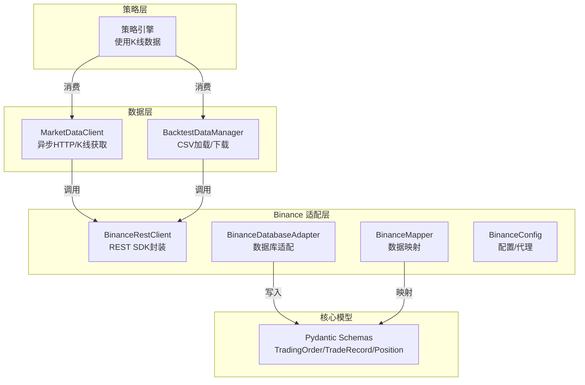
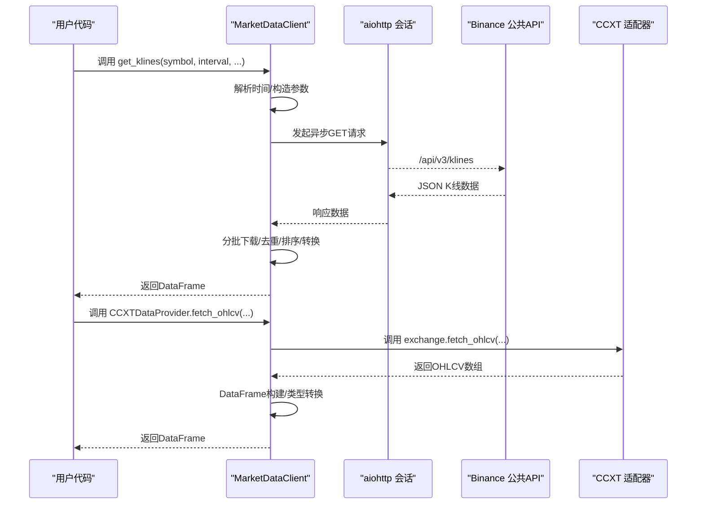
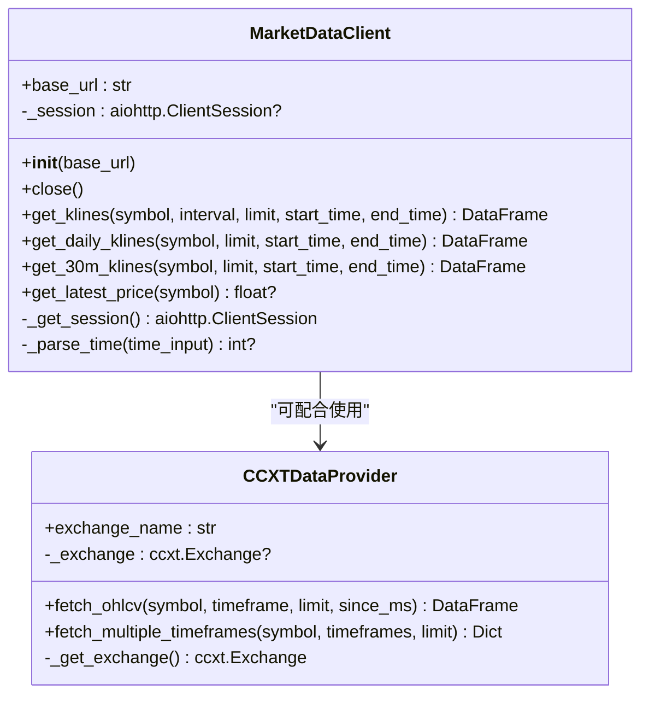
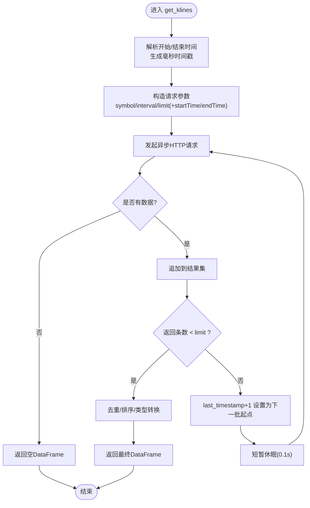
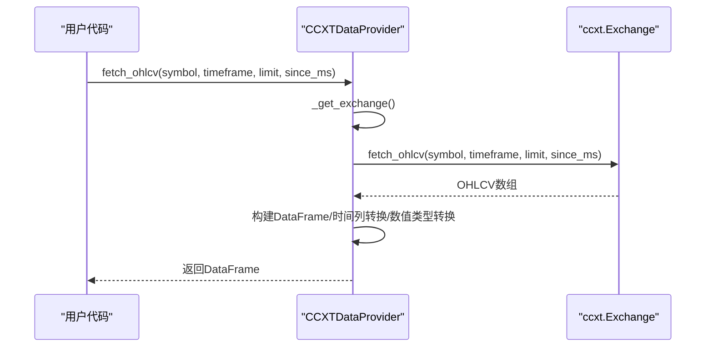
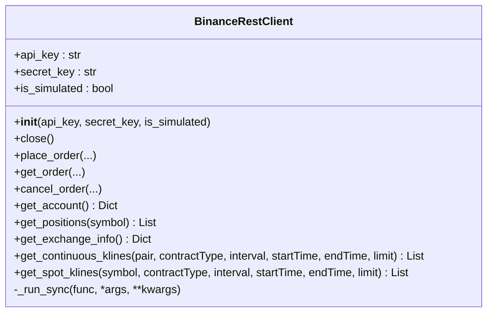
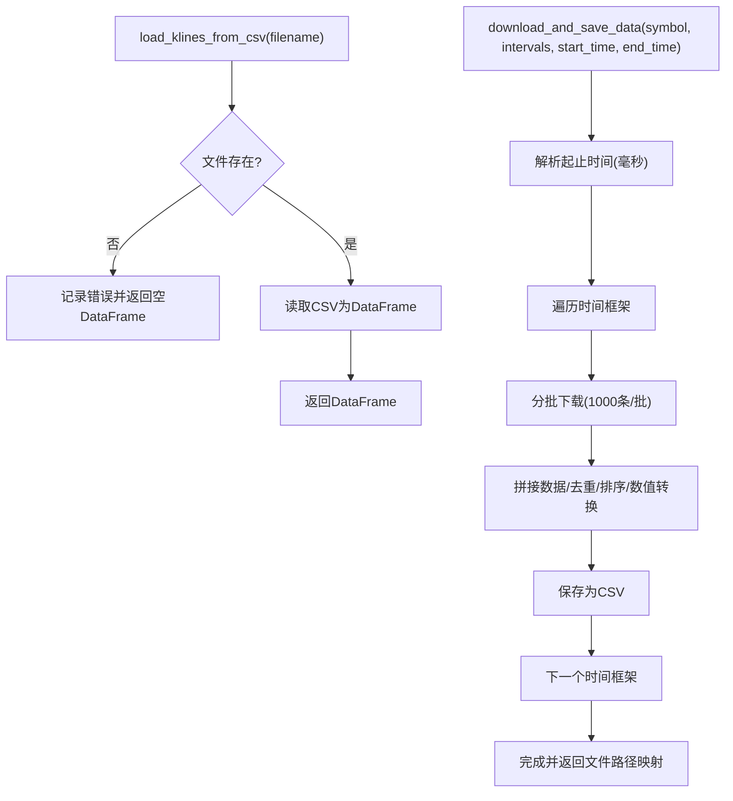
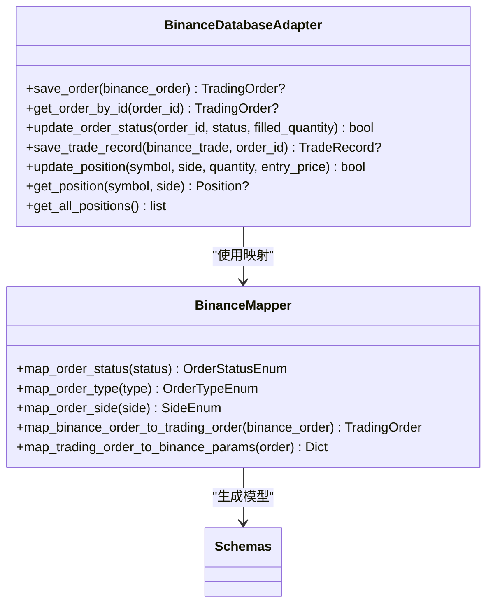
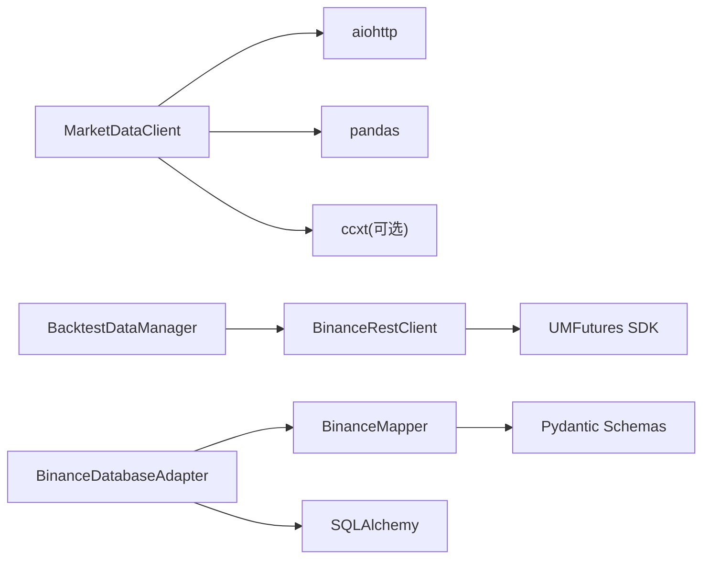

# 市场数据获取

<cite>
**本文引用的文件**
- [market_data.py](file://trading_system/data/market_data.py)
- [client.py](file://trading_system/binance/client.py)
- [database_adapter.py](file://trading_system/binance/database_adapter.py)
- [mapper.py](file://trading_system/binance/mapper.py)
- [enums.py](file://trading_system/binance/enums.py)
- [backtest_data.py](file://trading_system/data/backtest_data.py)
- [config.py](file://trading_system/binance/config.py)
- [schemas.py](file://trading_system/core/schemas.py)
</cite>

## 目录
1. [简介](#简介)
2. [项目结构](#项目结构)
3. [核心组件](#核心组件)
4. [架构概览](#架构概览)
5. [详细组件分析](#详细组件分析)
6. [依赖分析](#依赖分析)
7. [性能考虑](#性能考虑)
8. [故障排除指南](#故障排除指南)
9. [结论](#结论)
10. [附录](#附录)

## 简介
本技术文档面向市场数据获取系统，重点阐述 MarketDataClient 类的设计架构与实现细节，涵盖以下方面：
- 异步 HTTP 请求处理与会话管理
- K 线数据获取与分批下载策略
- 时间序列数据处理（时间格式解析、去重、排序、类型转换）
- CCXT 数据适配器集成，支持多交易所 OHLCV 数据获取
- 错误处理与重试机制
- 使用示例与最佳实践（不同时间框架与交易对）

该系统同时提供 Binance REST 客户端与数据库适配器，便于在实盘交易中直接复用。

## 项目结构
围绕“数据获取”这一核心目标，项目采用按功能域划分的模块化组织方式：
- trading_system/data：通用数据获取与回测数据管理
- trading_system/binance：Binance 专属 REST 客户端、数据库适配器与映射器
- trading_system/core：核心模型与 Pydantic Schema
- trading_system/strategies：策略层（间接使用数据层）

图表来源
- [market_data.py:12-346](file://trading_system/data/market_data.py#L12-L346)
- [client.py:10-342](file://trading_system/binance/client.py#L10-L342)
- [database_adapter.py:14-189](file://trading_system/binance/database_adapter.py#L14-L189)
- [mapper.py:15-110](file://trading_system/binance/mapper.py#L15-L110)
- [config.py:27-68](file://trading_system/binance/config.py#L27-L68)
- [schemas.py:7-88](file://trading_system/core/schemas.py#L7-L88)

章节来源
- [market_data.py:12-346](file://trading_system/data/market_data.py#L12-L346)
- [client.py:10-342](file://trading_system/binance/client.py#L10-L342)
- [backtest_data.py:9-137](file://trading_system/data/backtest_data.py#L9-L137)

## 核心组件
- MarketDataClient：统一的异步 K 线数据获取入口，支持分批下载、时间解析、数据清洗与转换。
- CCXTDataProvider：基于 CCXT 的 OHLCV 适配器，支持多时间框架与多交易所。
- BinanceRestClient：基于官方 UMFutures SDK 的 REST 客户端，提供连续合约/现货 K 线等接口。
- BacktestDataManager：回测数据管理器，负责加载本地 CSV 与批量下载并保存。
- BinanceDatabaseAdapter/BinanceMapper：数据库写入与数据映射工具，用于实盘订单/成交/持仓持久化。
- BinanceConfig：Binance API 配置与代理设置。
- Pydantic Schemas：交易订单、成交记录、持仓的标准模型。

章节来源
- [market_data.py:12-346](file://trading_system/data/market_data.py#L12-L346)
- [client.py:10-342](file://trading_system/binance/client.py#L10-L342)
- [database_adapter.py:14-189](file://trading_system/binance/database_adapter.py#L14-L189)
- [mapper.py:15-110](file://trading_system/binance/mapper.py#L15-L110)
- [config.py:27-68](file://trading_system/binance/config.py#L27-L68)
- [schemas.py:7-88](file://trading_system/core/schemas.py#L7-L88)

## 架构概览
MarketDataClient 作为统一入口，既可直接访问 Binance 公共 API（异步 HTTP），也可通过 CCXT 适配器对接多交易所 OHLCV 数据；同时，系统提供 BinanceRestClient 以复用官方 SDK 的高级能力（如连续合约 K 线）。回测数据可通过 BacktestDataManager 加载本地 CSV 或批量下载并保存。

图表来源
- [market_data.py:28-118](file://trading_system/data/market_data.py#L28-L118)
- [market_data.py:265-291](file://trading_system/data/market_data.py#L265-L291)

## 详细组件分析

### MarketDataClient 组件分析
- 设计要点
  - 单实例会话管理：内部维护 aiohttp.ClientSession，避免重复创建连接。
  - 异步 HTTP 请求：使用 async with session.get(...) 获取 JSON 并转为 DataFrame。
  - 分批下载策略：依据每次返回条数与 limit 判断是否继续，自动推进 startTime。
  - 时间格式解析：支持多种字符串与时间戳输入，统一转换为毫秒级时间戳。
  - 数据清洗：去重（按 open_time）、排序、数值类型转换，确保时间列与价格/成交量列一致性。
  - 便捷函数：提供 get_klines、get_daily_klines、get_30m_klines、get_latest_price 等包装方法。
  - 错误处理：捕获异常并记录日志，遇到无数据或异常即终止后续批次。

图表来源
- [market_data.py:12-118](file://trading_system/data/market_data.py#L12-L118)
- [market_data.py:245-301](file://trading_system/data/market_data.py#L245-L301)

图表来源
- [market_data.py:28-118](file://trading_system/data/market_data.py#L28-L118)

章节来源
- [market_data.py:12-118](file://trading_system/data/market_data.py#L12-L118)
- [market_data.py:120-147](file://trading_system/data/market_data.py#L120-L147)
- [market_data.py:203-240](file://trading_system/data/market_data.py#L203-L240)

### CCXT 数据适配器集成
- 设计要点
  - 按需导入 ccxt，延迟初始化交易所对象，启用 rate limit 与默认 future 类型。
  - fetch_ohlcv：调用 exchange.fetch_ohlcv，返回二维数组，转换为标准列名的 DataFrame。
  - fetch_multiple_timeframes：批量获取多时间框架数据，便于多时间框架策略。
  - 错误处理：捕获异常并返回空 DataFrame，避免中断流程。

图表来源
- [market_data.py:245-301](file://trading_system/data/market_data.py#L245-L301)

章节来源
- [market_data.py:245-301](file://trading_system/data/market_data.py#L245-L301)

### BinanceRestClient 组件分析
- 设计要点
  - 基于官方 UMFutures SDK，支持模拟盘与实盘切换。
  - 提供下单、查询订单、取消订单、账户信息、持仓信息、交易所信息等接口。
  - 连续合约与现货 K 线接口，支持 startTime/endTime/limit 参数控制分批下载。
  - 使用线程池执行同步 SDK 调用，避免阻塞事件循环。

图表来源
- [client.py:10-342](file://trading_system/binance/client.py#L10-L342)

章节来源
- [client.py:10-342](file://trading_system/binance/client.py#L10-L342)

### 回测数据管理器
- 设计要点
  - 从 CSV 加载 K 线数据，提供错误日志与空 DataFrame 返回。
  - download_and_save_data：基于 BinanceRestClient 实现分批下载并保存为 CSV，包含去重与排序逻辑。

图表来源
- [backtest_data.py:22-45](file://trading_system/data/backtest_data.py#L22-L45)
- [backtest_data.py:47-136](file://trading_system/data/backtest_data.py#L47-L136)

章节来源
- [backtest_data.py:9-137](file://trading_system/data/backtest_data.py#L9-L137)

### 数据库适配器与映射器
- 设计要点
  - BinanceDatabaseAdapter：事务上下文管理、订单/成交/持仓的增改查操作。
  - BinanceMapper：将 Binance 原始字段映射为统一的 TradingOrder/TradeRecord/Position 模型。
  - 配合 Pydantic Schemas，保证接口层数据结构一致。

图表来源
- [database_adapter.py:14-189](file://trading_system/binance/database_adapter.py#L14-L189)
- [mapper.py:15-110](file://trading_system/binance/mapper.py#L15-L110)
- [schemas.py:7-88](file://trading_system/core/schemas.py#L7-L88)

章节来源
- [database_adapter.py:14-189](file://trading_system/binance/database_adapter.py#L14-L189)
- [mapper.py:15-110](file://trading_system/binance/mapper.py#L15-L110)
- [schemas.py:7-88](file://trading_system/core/schemas.py#L7-L88)

## 依赖分析
- 内部耦合
  - MarketDataClient 与 BinanceRestClient：在回测数据下载场景中协作。
  - BacktestDataManager 依赖 BinanceRestClient 实现批量下载。
  - BinanceDatabaseAdapter 依赖 BinanceMapper 与 Pydantic Schemas。
- 外部依赖
  - aiohttp：异步 HTTP 客户端。
  - pandas：时间序列数据处理。
  - ccxt（可选）：多交易所 OHLCV 获取。
  - SQLAlchemy：数据库适配。
  - UMFutures SDK：Binance REST 接口。

图表来源
- [market_data.py:1-8](file://trading_system/data/market_data.py#L1-L8)
- [client.py:4-6](file://trading_system/binance/client.py#L4-L6)
- [database_adapter.py:4-9](file://trading_system/binance/database_adapter.py#L4-L9)

章节来源
- [market_data.py:1-8](file://trading_system/data/market_data.py#L1-L8)
- [client.py:4-6](file://trading_system/binance/client.py#L4-L6)
- [database_adapter.py:4-9](file://trading_system/binance/database_adapter.py#L4-L9)

## 性能考虑
- 异步 I/O：使用 aiohttp 并复用会话，降低连接开销。
- 分批下载：按最大 1000 条/批拉取，避免单次响应过大；在返回条数小于 limit 时提前终止。
- 速率控制：在分批之间加入短暂休眠，缓解 API 限流压力。
- 数据清洗：去重与排序在内存中进行，建议在大批量数据时关注内存占用。
- CCXT 适配器：按需导入与延迟初始化，减少启动成本。

## 故障排除指南
- 网络/超时
  - 现象：请求超时或返回空数据。
  - 处理：检查 base_url 与网络连通性；适当增加超时时间；确认时间范围合理。
- 时间格式错误
  - 现象：时间解析失败导致 startTime/endTime 为 None。
  - 处理：确保传入字符串符合支持格式（年-月-日、带时分秒等）。
- CCXT 未安装
  - 现象：ImportError。
  - 处理：安装 ccxt 库；确认 exchange_name 正确。
- 数据为空
  - 现象：返回空 DataFrame。
  - 处理：检查 symbol、interval 是否正确；确认 API 可用性与权限。
- 数据库事务异常
  - 现象：写入失败并回滚。
  - 处理：检查数据库连接与表结构；确保字段类型匹配。

章节来源
- [market_data.py:94-96](file://trading_system/data/market_data.py#L94-L96)
- [market_data.py:144](file://trading_system/data/market_data.py#L144)
- [market_data.py:260-262](file://trading_system/data/market_data.py#L260-L262)
- [database_adapter.py:58-61](file://trading_system/binance/database_adapter.py#L58-L61)

## 结论
MarketDataClient 通过异步 HTTP 与 CCXT 适配器实现了灵活的多源数据获取能力，结合分批下载、时间解析、去重与排序等处理流程，满足回测与实盘需求。配合 BinanceRestClient、数据库适配器与映射器，系统形成从数据获取到持久化的完整闭环。建议在生产环境中结合速率限制与异常监控，确保稳定性与性能。

## 附录

### 使用示例与最佳实践
- 获取 30 分钟 K 线（最近 N 条）
  - 调用 get_30m_klines(symbol, limit=N)，适合短期策略回测与实时监控。
- 获取 180 天历史数据
  - 调用 get_30m_klines(symbol, limit=1000, start_time, end_time)，注意分批下载与网络波动。
- 获取日线数据
  - 调用 get_daily_klines(symbol, limit=1000, ...)，适合周线/月线策略。
- 获取最新价格
  - 调用 get_latest_price(symbol)，用于实时决策。
- 多时间框架数据
  - 使用 CCXTDataProvider.fetch_multiple_timeframes(symbol, timeframes, limit)，适用于多时间框架策略。
- 回测数据准备
  - 使用 BacktestDataManager.download_and_save_data(symbol, intervals, start_time, end_time) 下载并保存 CSV，便于离线回测。
- 实盘订单/成交/持仓
  - 使用 BinanceDatabaseAdapter.save_order/save_trade_record/update_position 等接口持久化交易行为。

章节来源
- [market_data.py:203-240](file://trading_system/data/market_data.py#L203-L240)
- [market_data.py:245-301](file://trading_system/data/market_data.py#L245-L301)
- [backtest_data.py:47-136](file://trading_system/data/backtest_data.py#L47-L136)
- [database_adapter.py:31-97](file://trading_system/binance/database_adapter.py#L31-L97)