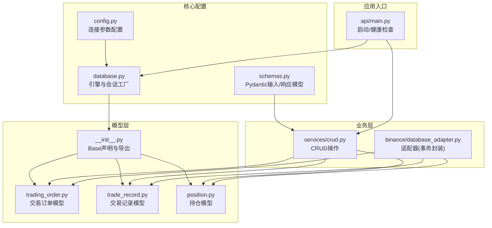
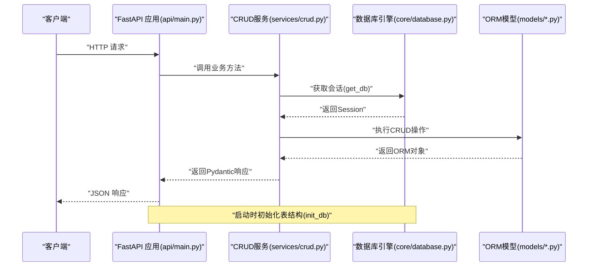
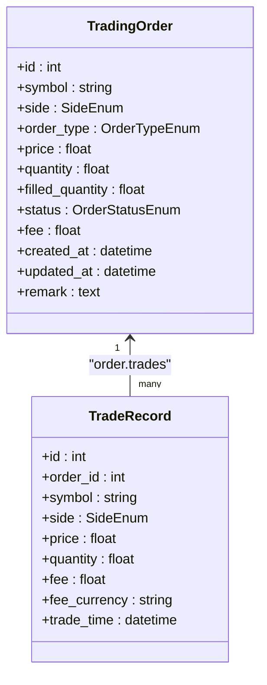
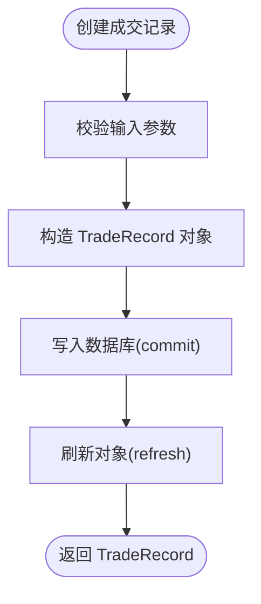
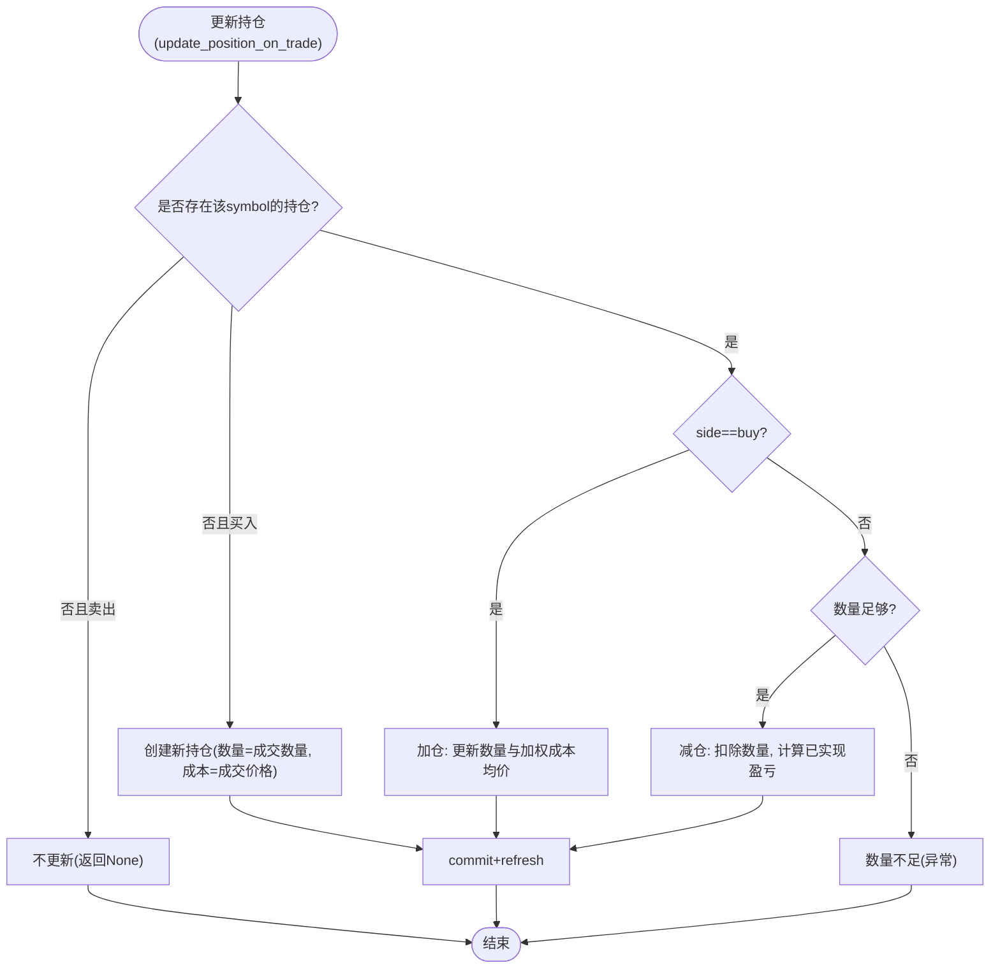
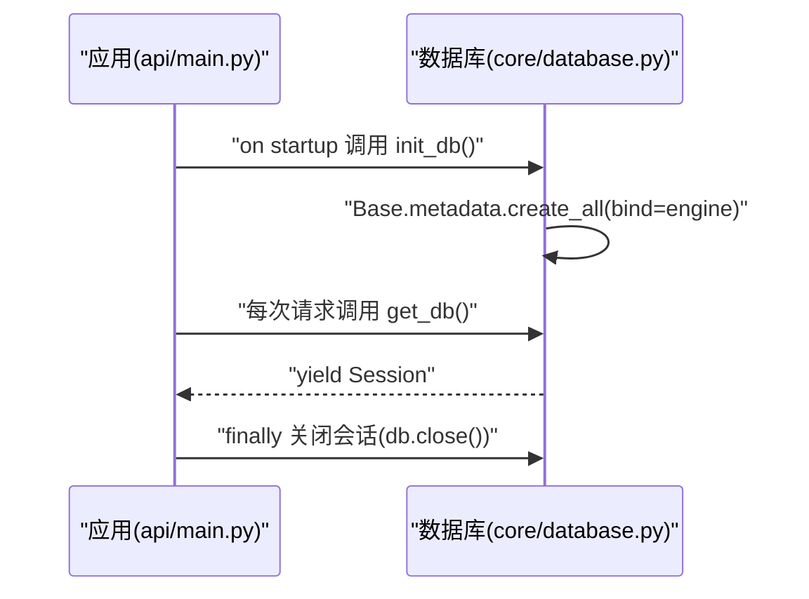
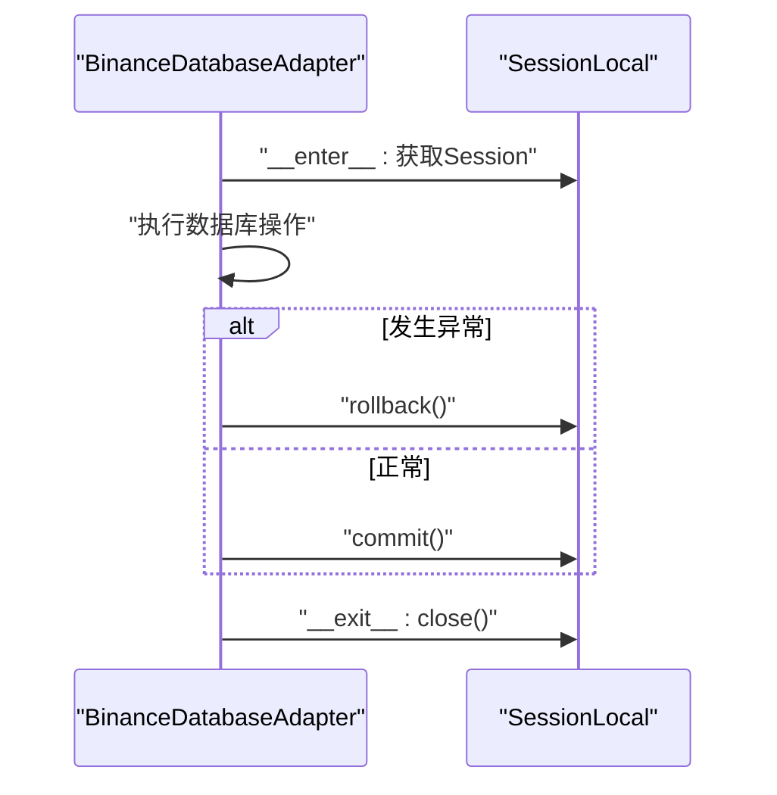
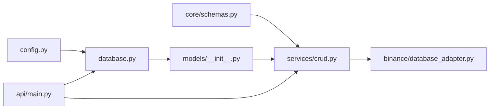

# 数据库模型设计

<cite>
**本文引用的文件**
- [trading_system/models/trading_order.py](file://trading_system/models/trading_order.py)
- [trading_system/models/trade_record.py](file://trading_system/models/trade_record.py)
- [trading_system/models/position.py](file://trading_system/models/position.py)
- [trading_system/models/__init__.py](file://trading_system/models/__init__.py)
- [trading_system/core/database.py](file://trading_system/core/database.py)
- [trading_system/core/schemas.py](file://trading_system/core/schemas.py)
- [trading_system/core/config.py](file://trading_system/core/config.py)
- [trading_system/services/crud.py](file://trading_system/services/crud.py)
- [trading_system/binance/database_adapter.py](file://trading_system/binance/database_adapter.py)
- [trading_system/api/main.py](file://trading_system/api/main.py)
</cite>

## 目录
1. [简介](#简介)
2. [项目结构](#项目结构)
3. [核心组件](#核心组件)
4. [架构总览](#架构总览)
5. [详细组件分析](#详细组件分析)
6. [依赖分析](#依赖分析)
7. [性能考虑](#性能考虑)
8. [故障排查指南](#故障排查指南)
9. [结论](#结论)
10. [附录：使用示例与最佳实践](#附录使用示例与最佳实践)

## 简介
本文件面向交易系统的数据库模型子系统，系统性阐述基于 SQLAlchemy 的 ORM 设计原则、数据库连接与会话管理、以及交易订单、交易记录、持仓三大核心模型的字段定义、关系映射与约束条件。文档还覆盖模型生命周期管理、事务处理与并发控制、迁移与版本升级策略、索引与查询优化、缓存策略、最佳实践与常见陷阱，并给出可直接定位到源码路径的使用示例。

## 项目结构
围绕数据库模型的关键目录与文件如下：
- 模型层：定义 ORM 表结构与枚举类型
  - trading_system/models/trading_order.py
  - trading_system/models/trade_record.py
  - trading_system/models/position.py
  - trading_system/models/__init__.py
- 核心配置与连接
  - trading_system/core/config.py
  - trading_system/core/database.py
  - trading_system/core/schemas.py
- 业务 CRUD 与适配器
  - trading_system/services/crud.py
  - trading_system/binance/database_adapter.py
- 应用入口与健康检查
  - trading_system/api/main.py

图表来源
- [trading_system/models/__init__.py:1-18](file://trading_system/models/__init__.py#L1-L18)
- [trading_system/models/trading_order.py:1-43](file://trading_system/models/trading_order.py#L1-L43)
- [trading_system/models/trade_record.py:1-22](file://trading_system/models/trade_record.py#L1-L22)
- [trading_system/models/position.py:1-18](file://trading_system/models/position.py#L1-L18)
- [trading_system/core/config.py:1-35](file://trading_system/core/config.py#L1-L35)
- [trading_system/core/database.py:1-45](file://trading_system/core/database.py#L1-L45)
- [trading_system/core/schemas.py:1-88](file://trading_system/core/schemas.py#L1-L88)
- [trading_system/services/crud.py:1-137](file://trading_system/services/crud.py#L1-L137)
- [trading_system/binance/database_adapter.py:1-161](file://trading_system/binance/database_adapter.py#L1-L161)
- [trading_system/api/main.py:1-104](file://trading_system/api/main.py#L1-L104)

章节来源
- [trading_system/models/__init__.py:1-18](file://trading_system/models/__init__.py#L1-L18)
- [trading_system/core/database.py:1-45](file://trading_system/core/database.py#L1-L45)
- [trading_system/core/config.py:1-35](file://trading_system/core/config.py#L1-L35)

## 核心组件
- 数据库引擎与会话工厂
  - 通过配置读取连接参数，创建带连接池的引擎；生成非自动提交、非自动刷新的会话工厂；提供 get_db 生成器用于依赖注入；提供 init_db 初始化表结构。
- Pydantic 输入/响应模型
  - 定义 TradingOrderCreate/Update/Response、TradeRecordCreate/Response、PositionCreate/Update/Response 及共享的枚举类型，确保接口层与数据库层的数据契约一致。
- ORM 模型
  - TradingOrder：订单主表，含订单类型、买卖方向、状态、数量、成交数量、手续费、时间戳等。
  - TradeRecord：成交明细表，外键关联订单，记录每笔成交的价格、数量、手续费及成交时间。
  - Position：持仓表，按交易对聚合持有数量、成本均价、已实现/未实现盈亏、总手续费等。

章节来源
- [trading_system/core/database.py:12-45](file://trading_system/core/database.py#L12-L45)
- [trading_system/core/schemas.py:7-88](file://trading_system/core/schemas.py#L7-L88)
- [trading_system/models/trading_order.py:26-43](file://trading_system/models/trading_order.py#L26-L43)
- [trading_system/models/trade_record.py:8-22](file://trading_system/models/trade_record.py#L8-L22)
- [trading_system/models/position.py:6-18](file://trading_system/models/position.py#L6-L18)

## 架构总览
下图展示从应用入口到数据库模型的调用链路与职责分工：

图表来源
- [trading_system/api/main.py:58-88](file://trading_system/api/main.py#L58-L88)
- [trading_system/core/database.py:24-45](file://trading_system/core/database.py#L24-L45)
- [trading_system/services/crud.py:9-137](file://trading_system/services/crud.py#L9-L137)
- [trading_system/models/__init__.py:1-18](file://trading_system/models/__init__.py#L1-L18)

## 详细组件分析

### 交易订单模型 TradingOrder
- 字段与约束
  - 主键自增 id
  - symbol：字符串，非空，建立索引以支持高频过滤
  - side/order_type/status：枚举，分别来自 SideEnum、OrderTypeEnum、OrderStatusEnum
  - price/quantity/filled_quantity/fee：数值型，部分允许为空
  - created_at/updated_at：时间戳，默认当前 UTC，更新时自动刷新
  - remark：备注文本
- 关系映射
  - 与 TradeRecord 一对多反向关系，通过 back_populates 维护双向一致性
- 设计要点
  - 使用枚举保证状态与类型的一致性与可读性
  - 时间戳字段便于审计与排序
  - filled_quantity 与 fee 支持订单执行过程中的增量更新

图表来源
- [trading_system/models/trading_order.py:26-43](file://trading_system/models/trading_order.py#L26-L43)
- [trading_system/models/trade_record.py:8-22](file://trading_system/models/trade_record.py#L8-L22)

章节来源
- [trading_system/models/trading_order.py:26-43](file://trading_system/models/trading_order.py#L26-L43)

### 交易记录模型 TradeRecord
- 字段与约束
  - 主键自增 id
  - order_id 外键关联 trading_orders.id，非空
  - symbol：字符串，非空，建立索引
  - side/price/quantity：买卖方向、成交价格与数量，非空
  - fee/fee_currency：手续费与币种
  - trade_time：成交时间，默认当前 UTC
- 关系映射
  - 与 TradingOrder 多对一反向关系，通过 back_populates 维护一致性
- 设计要点
  - 外键约束保证订单与成交的强关联
  - 独立的 fee_currency 支持多币种手续费统计

图表来源
- [trading_system/services/crud.py:48-55](file://trading_system/services/crud.py#L48-L55)
- [trading_system/models/trade_record.py:8-22](file://trading_system/models/trade_record.py#L8-L22)

章节来源
- [trading_system/models/trade_record.py:8-22](file://trading_system/models/trade_record.py#L8-L22)
- [trading_system/services/crud.py:48-69](file://trading_system/services/crud.py#L48-L69)

### 持仓模型 Position
- 字段与约束
  - 主键自增 id
  - symbol：字符串，非空，建立索引
  - quantity/avg_cost/realized_profit/unrealized_profit/total_fee：数值型，支持累计统计
  - created_at/updated_at：时间戳
- 设计要点
  - 按 symbol 聚合，便于快速查询某交易对的总持仓
  - avg_cost 与 realized_profit 支持盈亏计算

图表来源
- [trading_system/services/crud.py:103-136](file://trading_system/services/crud.py#L103-L136)
- [trading_system/models/position.py:6-18](file://trading_system/models/position.py#L6-L18)

章节来源
- [trading_system/models/position.py:6-18](file://trading_system/models/position.py#L6-L18)
- [trading_system/services/crud.py:103-136](file://trading_system/services/crud.py#L103-L136)

### 数据库连接与会话管理
- 连接池配置
  - 从配置读取 pool_size/max_overflow/pool_timeout/pool_recycle/echo
  - 启用 pool_pre_ping 以在获取连接前进行健康检查
- 会话工厂
  - 非自动提交、非自动刷新，确保显式控制事务边界
- 依赖注入
  - get_db 作为依赖生成器，在请求生命周期内创建与关闭会话
- 初始化
  - 应用启动时调用 init_db 创建所有表

图表来源
- [trading_system/api/main.py:58-88](file://trading_system/api/main.py#L58-L88)
- [trading_system/core/database.py:37-45](file://trading_system/core/database.py#L37-L45)
- [trading_system/core/database.py:24-34](file://trading_system/core/database.py#L24-L34)

章节来源
- [trading_system/core/config.py:5-32](file://trading_system/core/config.py#L5-L32)
- [trading_system/core/database.py:12-21](file://trading_system/core/database.py#L12-L21)
- [trading_system/core/database.py:24-34](file://trading_system/core/database.py#L24-L34)
- [trading_system/api/main.py:58-88](file://trading_system/api/main.py#L58-L88)

### 事务处理与并发控制
- 显式事务
  - CRUD 方法中 commit 提交事务；异常时需上层捕获并回滚
- 上下文事务封装
  - BinanceDatabaseAdapter 使用上下文管理器，在退出时根据异常决定 rollback 或 commit
- 并发建议
  - 使用 select ... for update 或数据库锁在需要强一致的场景下保护关键资源
  - 控制会话粒度，避免长事务占用连接池

图表来源
- [trading_system/binance/database_adapter.py:20-30](file://trading_system/binance/database_adapter.py#L20-L30)
- [trading_system/binance/database_adapter.py:128-161](file://trading_system/binance/database_adapter.py#L128-L161)

章节来源
- [trading_system/services/crud.py:9-16](file://trading_system/services/crud.py#L9-L16)
- [trading_system/binance/database_adapter.py:20-30](file://trading_system/binance/database_adapter.py#L20-L30)

### 数据模型生命周期管理
- 创建：通过 Pydantic Create 模型构造 ORM 对象，add 后 commit 刷新
- 查询：支持按主键、分页、条件过滤（如 symbol、order_id）
- 更新：支持按需字段更新，exclude_unset 保证只更新传入字段
- 删除：当前仓库未提供删除方法，可在 CRUD 中扩展

章节来源
- [trading_system/services/crud.py:9-16](file://trading_system/services/crud.py#L9-L16)
- [trading_system/services/crud.py:19-45](file://trading_system/services/crud.py#L19-L45)
- [trading_system/services/crud.py:58-69](file://trading_system/services/crud.py#L58-L69)
- [trading_system/services/crud.py:80-100](file://trading_system/services/crud.py#L80-L100)

### 迁移策略、版本升级与向后兼容
- 当前状态
  - 使用 Base.metadata.create_all 初始化表，未见 Alembic 或迁移脚本
- 建议策略
  - 引入 Alembic 进行迁移管理，保留历史迁移脚本
  - 新增字段采用可选默认值，避免破坏既有数据
  - 枚举扩展遵循向后兼容，新增值不影响旧数据
  - 对于索引变更，先建新索引再删旧索引，减少锁表时间
  - 版本号与迁移脚本配套发布，确保生产环境可控升级

[本节为通用指导，无需特定文件引用]

### 数据索引优化、查询性能调优与缓存策略
- 索引优化
  - symbol 建立索引（订单、成交、持仓均对 symbol 过滤频繁）
  - 复合索引：如 (symbol, status)、(symbol, order_id) 可提升过滤与联表效率
- 查询优化
  - 分页查询使用 offset/limit，避免一次性加载大量数据
  - 使用 select_in_bulk 或原生 SQL 在大批量场景下加速
- 缓存策略
  - 热点数据（如最新行情、常用 symbol 的持仓）可引入 Redis 缓存
  - 缓存失效策略：订单状态变更、成交发生、持仓变动时主动失效

[本节为通用指导，无需特定文件引用]

## 依赖分析
- 模块耦合
  - models/__init__.py 统一导出 Base 与各模型，降低导入复杂度
  - database.py 仅依赖 config 与 models.Base，低耦合
  - services/crud.py 依赖 models 与 core.schemas，承担业务逻辑
  - binance/database_adapter.py 依赖 models 与 SessionLocal，封装事务
- 外部依赖
  - SQLAlchemy ORM 与 MySQL 驱动
  - Pydantic 用于数据验证与序列化

图表来源
- [trading_system/core/config.py:1-35](file://trading_system/core/config.py#L1-L35)
- [trading_system/core/database.py:1-45](file://trading_system/core/database.py#L1-L45)
- [trading_system/models/__init__.py:1-18](file://trading_system/models/__init__.py#L1-L18)
- [trading_system/core/schemas.py:1-88](file://trading_system/core/schemas.py#L1-L88)
- [trading_system/services/crud.py:1-137](file://trading_system/services/crud.py#L1-L137)
- [trading_system/binance/database_adapter.py:1-161](file://trading_system/binance/database_adapter.py#L1-L161)
- [trading_system/api/main.py:1-104](file://trading_system/api/main.py#L1-L104)

章节来源
- [trading_system/models/__init__.py:1-18](file://trading_system/models/__init__.py#L1-L18)
- [trading_system/core/database.py:1-45](file://trading_system/core/database.py#L1-L45)
- [trading_system/services/crud.py:1-137](file://trading_system/services/crud.py#L1-L137)

## 性能考虑
- 连接池参数
  - pool_size、max_overflow、pool_timeout、pool_recycle、pool_pre_ping 已在配置中启用
- 查询性能
  - 优先使用索引列过滤；避免 N+1 查询，必要时使用联表或批量查询
- 写入性能
  - 批量插入使用 add_all；减少 commit 次数
- 事务粒度
  - 将多个相关写入放入同一事务，失败回滚，避免中间态

[本节为通用指导，无需特定文件引用]

## 故障排查指南
- 健康检查
  - /health 端点通过执行简单 SQL 检查数据库连通性，异常时返回 503
- 日志记录
  - database.py 与 crud.py 中均有日志记录，便于定位问题
- 常见问题
  - 连接池耗尽：检查 pool_size 与事务是否及时关闭
  - 未提交事务：确保 CRUD 中 commit，或使用上下文事务封装
  - 外键约束错误：确认关联对象存在后再创建子记录

章节来源
- [trading_system/api/main.py:75-88](file://trading_system/api/main.py#L75-L88)
- [trading_system/core/database.py:24-34](file://trading_system/core/database.py#L24-L34)
- [trading_system/services/crud.py:9-16](file://trading_system/services/crud.py#L9-L16)

## 结论
本系统采用清晰的分层设计：配置驱动连接池、ORM 统一模型、Pydantic 明确契约、CRUD 封装业务、适配器保障事务一致性。当前以 create_all 初始化表，建议后续引入迁移工具完善版本演进能力。通过索引、分页与缓存策略可进一步提升性能；严格的事务与日志机制有助于稳定运行与问题定位。

[本节为总结，无需特定文件引用]

## 附录：使用示例与最佳实践

### 示例：创建交易订单
- 步骤
  - 使用 TradingOrderCreate 构造数据
  - 调用 create_trading_order(db, order)
  - 返回 TradingOrderResponse
- 参考路径
  - [trading_system/services/crud.py:9-16](file://trading_system/services/crud.py#L9-L16)
  - [trading_system/core/schemas.py:16-24](file://trading_system/core/schemas.py#L16-L24)

章节来源
- [trading_system/services/crud.py:9-16](file://trading_system/services/crud.py#L9-L16)
- [trading_system/core/schemas.py:16-24](file://trading_system/core/schemas.py#L16-L24)

### 示例：创建交易记录
- 步骤
  - 使用 TradeRecordCreate 构造数据
  - 调用 create_trade_record(db, trade)
  - 返回 TradeRecordResponse
- 参考路径
- [trading_system/services/crud.py:48-55](file://trading_system/services/crud.py#L48-L55)
- [trading_system/core/schemas.py:48-57](file://trading_system/core/schemas.py#L48-L57)

章节来源
- [trading_system/services/crud.py:48-55](file://trading_system/services/crud.py#L48-L55)
- [trading_system/core/schemas.py:48-57](file://trading_system/core/schemas.py#L48-L57)

### 示例：更新持仓
- 步骤
  - 调用 update_position_on_trade(db, symbol, side, price, quantity, fee)
  - 自动处理加仓/减仓、成本均价与已实现盈亏
- 参考路径
- [trading_system/services/crud.py:103-136](file://trading_system/services/crud.py#L103-L136)

章节来源
- [trading_system/services/crud.py:103-136](file://trading_system/services/crud.py#L103-L136)

### 最佳实践
- 明确事务边界：每个业务操作一个事务，失败即回滚
- 使用 Pydantic：严格输入校验与序列化
- 索引优先：对高频过滤列建立索引
- 分页查询：大数据量场景必须分页
- 缓存热点：对读多写少的数据做缓存

[本节为通用指导，无需特定文件引用]

### 常见陷阱与规避
- 忘记 commit：确保每次写入后提交
- 长事务：缩短事务时间，避免阻塞
- N+1 查询：使用联表或批量查询
- 外键缺失：先创建父记录再创建子记录
- 枚举不一致：统一使用模型中定义的枚举类型

[本节为通用指导，无需特定文件引用]