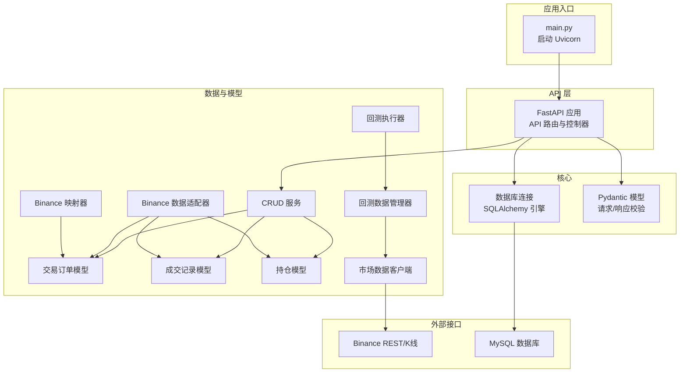
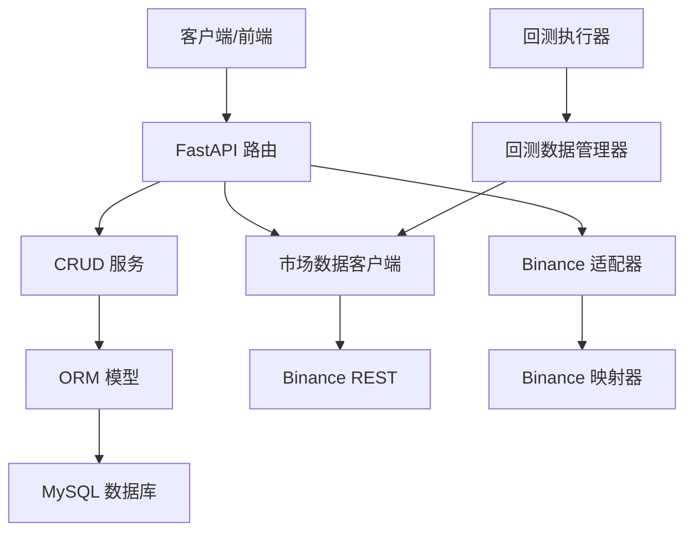
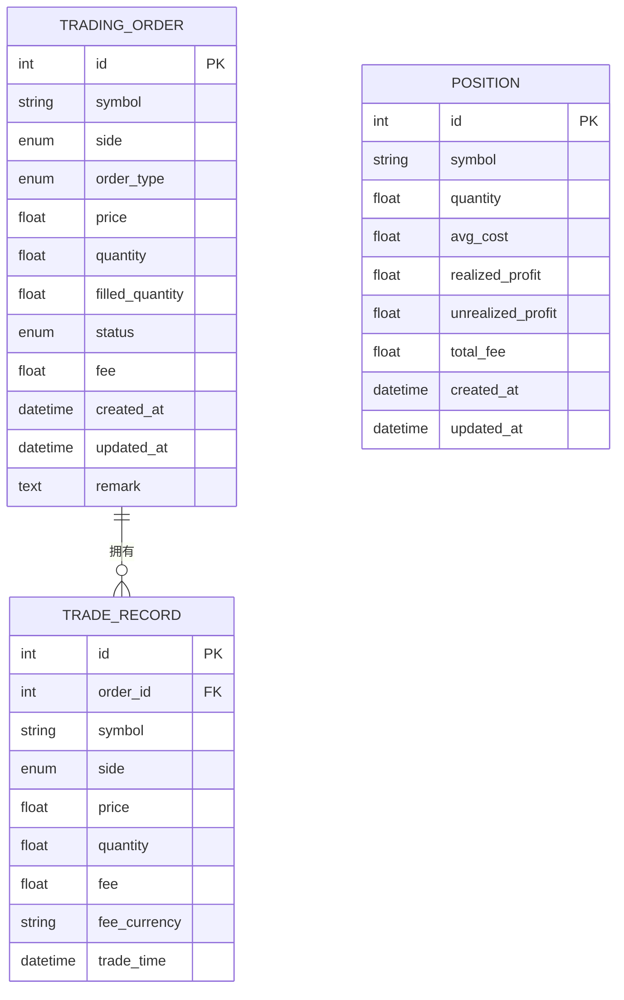
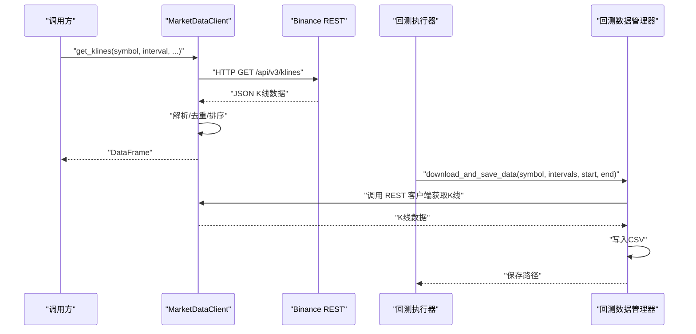
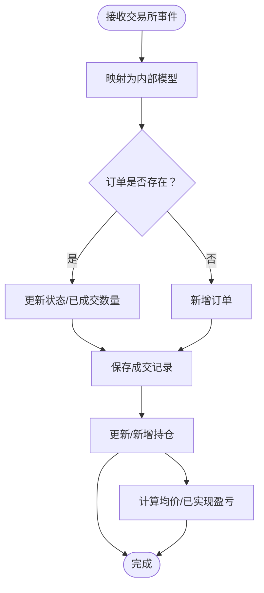
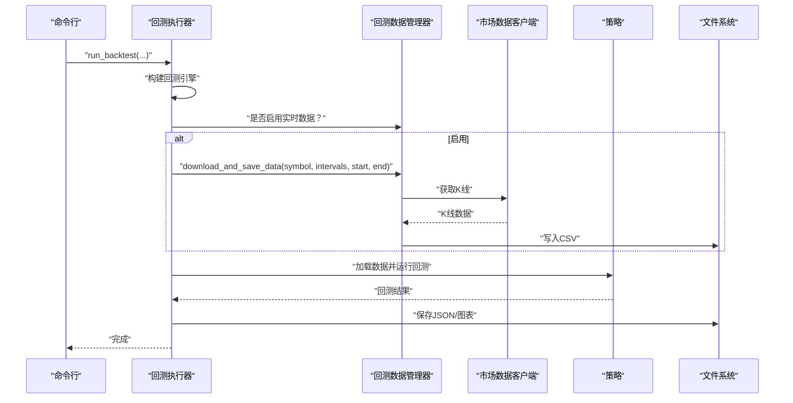
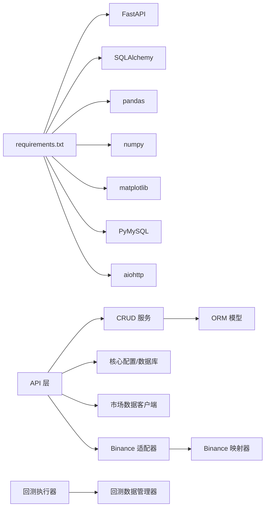

# 数据管理

<cite>
**本文引用的文件**
- [README.md](file://README.md)
- [main.py](file://main.py)
- [log_config.py](file://log_config.py)
- [requirements.txt](file://requirements.txt)
- [trading_system/core/database.py](file://trading_system/core/database.py)
- [trading_system/core/schemas.py](file://trading_system/core/schemas.py)
- [trading_system/models/trading_order.py](file://trading_system/models/trading_order.py)
- [trading_system/models/trade_record.py](file://trading_system/models/trade_record.py)
- [trading_system/models/position.py](file://trading_system/models/position.py)
- [trading_system/services/crud.py](file://trading_system/services/crud.py)
- [trading_system/binance/database_adapter.py](file://trading_system/binance/database_adapter.py)
- [trading_system/binance/mapper.py](file://trading_system/binance/mapper.py)
- [trading_system/data/market_data.py](file://trading_system/data/market_data.py)
- [trading_system/data/backtest_data.py](file://trading_system/data/backtest_data.py)
- [trading_system/backtest/run_backtest.py](file://trading_system/backtest/run_backtest.py)
</cite>

## 目录
1. [引言](#引言)
2. [项目结构](#项目结构)
3. [核心组件](#核心组件)
4. [架构总览](#架构总览)
5. [组件详解](#组件详解)
6. [依赖关系分析](#依赖关系分析)
7. [性能与优化](#性能与优化)
8. [故障排查指南](#故障排查指南)
9. [结论](#结论)
10. [附录](#附录)

## 引言
本技术文档面向“数据管理系统”，围绕市场数据获取、历史数据存储、实时数据处理、数据库模型设计、数据迁移与性能优化、数据验证清洗与标准化、回测数据管理、交易记录与持仓管理、备份恢复与监控告警、以及数据安全与访问控制等方面进行系统化说明。文档基于仓库现有代码进行分析，帮助开发者与运维人员快速理解并高效维护该系统。

## 项目结构
项目采用前后端分离与模块化组织方式：
- 后端服务：基于 FastAPI 的交易系统，包含 API 层、核心配置、模型、服务层、策略与回测等模块。
- 数据层：通过 SQLAlchemy 连接 MySQL，提供 ORM 模型与 CRUD 操作。
- 数据获取：异步 HTTP 客户端用于获取 Binance 历史 K 线与最新价格；同时提供 CCXT 适配器以支持多交易所 OHLCV 获取。
- 回测子系统：独立的回测脚本与数据管理器，负责加载本地 CSV 历史数据，并可按需下载实时数据。

图表来源
- [main.py:1-13](file://main.py#L1-L13)
- [trading_system/core/database.py:1-45](file://trading_system/core/database.py#L1-L45)
- [trading_system/core/schemas.py:1-88](file://trading_system/core/schemas.py#L1-L88)
- [trading_system/models/trading_order.py:1-43](file://trading_system/models/trading_order.py#L1-L43)
- [trading_system/models/trade_record.py:1-22](file://trading_system/models/trade_record.py#L1-L22)
- [trading_system/models/position.py:1-18](file://trading_system/models/position.py#L1-L18)
- [trading_system/services/crud.py:1-137](file://trading_system/services/crud.py#L1-L137)
- [trading_system/binance/database_adapter.py:1-189](file://trading_system/binance/database_adapter.py#L1-L189)
- [trading_system/binance/mapper.py:1-110](file://trading_system/binance/mapper.py#L1-L110)
- [trading_system/data/market_data.py:1-346](file://trading_system/data/market_data.py#L1-L346)
- [trading_system/data/backtest_data.py:1-137](file://trading_system/data/backtest_data.py#L1-L137)
- [trading_system/backtest/run_backtest.py:1-552](file://trading_system/backtest/run_backtest.py#L1-L552)

章节来源
- [README.md:1-150](file://README.md#L1-L150)
- [main.py:1-13](file://main.py#L1-L13)

## 核心组件
- 数据库与会话管理：通过 SQLAlchemy 创建带连接池的引擎，提供 get_db 会话生成器与初始化表能力。
- Pydantic 模型：定义订单、成交记录、持仓的请求/响应模型，确保数据结构与字段约束一致。
- ORM 模型：交易订单、成交记录、持仓三张表，定义字段、索引与关系。
- CRUD 服务：提供订单、成交记录、持仓的增删改查与聚合逻辑。
- Binance 适配器与映射器：将交易所数据映射为内部模型，支持保存订单、成交记录与更新持仓。
- 市场数据客户端：异步获取 K 线与最新价格，支持分批下载与时间范围过滤。
- 回测数据管理器：加载本地 CSV 历史数据，必要时调用 REST 客户端下载实时数据。
- 回测执行器：根据策略版本加载数据、运行回测、生成可视化与结果文件。

章节来源
- [trading_system/core/database.py:1-45](file://trading_system/core/database.py#L1-L45)
- [trading_system/core/schemas.py:1-88](file://trading_system/core/schemas.py#L1-L88)
- [trading_system/models/trading_order.py:1-43](file://trading_system/models/trading_order.py#L1-L43)
- [trading_system/models/trade_record.py:1-22](file://trading_system/models/trade_record.py#L1-L22)
- [trading_system/models/position.py:1-18](file://trading_system/models/position.py#L1-L18)
- [trading_system/services/crud.py:1-137](file://trading_system/services/crud.py#L1-L137)
- [trading_system/binance/database_adapter.py:1-189](file://trading_system/binance/database_adapter.py#L1-L189)
- [trading_system/binance/mapper.py:1-110](file://trading_system/binance/mapper.py#L1-L110)
- [trading_system/data/market_data.py:1-346](file://trading_system/data/market_data.py#L1-L346)
- [trading_system/data/backtest_data.py:1-137](file://trading_system/data/backtest_data.py#L1-L137)
- [trading_system/backtest/run_backtest.py:1-552](file://trading_system/backtest/run_backtest.py#L1-L552)

## 架构总览
系统采用分层架构：
- 表现层：FastAPI 提供 REST 接口，路由与控制器负责请求处理。
- 业务层：CRUD 服务封装数据访问与业务逻辑。
- 数据层：ORM 模型与数据库适配器负责持久化。
- 数据获取层：异步 HTTP 客户端与 CCXT 适配器负责外部数据接入。
- 回测层：独立脚本与数据管理器负责历史数据加载与回测执行。

图表来源
- [trading_system/core/database.py:1-45](file://trading_system/core/database.py#L1-L45)
- [trading_system/services/crud.py:1-137](file://trading_system/services/crud.py#L1-L137)
- [trading_system/binance/database_adapter.py:1-189](file://trading_system/binance/database_adapter.py#L1-L189)
- [trading_system/binance/mapper.py:1-110](file://trading_system/binance/mapper.py#L1-L110)
- [trading_system/data/market_data.py:1-346](file://trading_system/data/market_data.py#L1-L346)
- [trading_system/data/backtest_data.py:1-137](file://trading_system/data/backtest_data.py#L1-L137)
- [trading_system/backtest/run_backtest.py:1-552](file://trading_system/backtest/run_backtest.py#L1-L552)

## 组件详解

### 数据库模型与关系
系统包含三张核心表：交易订单、成交记录、持仓。订单与成交记录为一对多关系，订单与持仓按符号与方向建立唯一性约束。

图表来源
- [trading_system/models/trading_order.py:1-43](file://trading_system/models/trading_order.py#L1-L43)
- [trading_system/models/trade_record.py:1-22](file://trading_system/models/trade_record.py#L1-L22)
- [trading_system/models/position.py:1-18](file://trading_system/models/position.py#L1-L18)

章节来源
- [trading_system/models/trading_order.py:1-43](file://trading_system/models/trading_order.py#L1-L43)
- [trading_system/models/trade_record.py:1-22](file://trading_system/models/trade_record.py#L1-L22)
- [trading_system/models/position.py:1-18](file://trading_system/models/position.py#L1-L18)

### 市场数据获取与历史数据存储
- 异步 K 线获取：支持指定周期、时间范围与批次大小，自动去重与排序，返回标准列。
- 最新价格获取：按交易对获取最新价格。
- CCXT 适配器：支持多时间框架批量获取 OHLCV，便于多周期分析。
- 历史数据存储：回测数据管理器可将下载的 K 线保存为 CSV，供回测脚本加载。

图表来源
- [trading_system/data/market_data.py:24-118](file://trading_system/data/market_data.py#L24-L118)
- [trading_system/data/backtest_data.py:47-136](file://trading_system/data/backtest_data.py#L47-L136)
- [trading_system/backtest/run_backtest.py:304-314](file://trading_system/backtest/run_backtest.py#L304-L314)

章节来源
- [trading_system/data/market_data.py:1-346](file://trading_system/data/market_data.py#L1-L346)
- [trading_system/data/backtest_data.py:1-137](file://trading_system/data/backtest_data.py#L1-L137)
- [trading_system/backtest/run_backtest.py:1-552](file://trading_system/backtest/run_backtest.py#L1-L552)

### 实时数据处理与订单/成交/持仓同步
- 订单映射：将交易所订单状态、类型、方向映射为内部枚举。
- 订单保存：若存在相同订单 ID 则更新状态与已成交数量，否则新增。
- 成交记录保存：按成交明细入库。
- 持仓更新：按符号与方向聚合，支持买入加仓与卖出减仓，计算均价与已实现盈亏。

图表来源
- [trading_system/binance/mapper.py:15-110](file://trading_system/binance/mapper.py#L15-L110)
- [trading_system/binance/database_adapter.py:31-161](file://trading_system/binance/database_adapter.py#L31-L161)
- [trading_system/services/crud.py:103-136](file://trading_system/services/crud.py#L103-L136)

章节来源
- [trading_system/binance/mapper.py:1-110](file://trading_system/binance/mapper.py#L1-L110)
- [trading_system/binance/database_adapter.py:1-189](file://trading_system/binance/database_adapter.py#L1-L189)
- [trading_system/services/crud.py:1-137](file://trading_system/services/crud.py#L1-L137)

### 回测数据管理与策略执行
- 数据加载：按策略版本加载不同周期数据，支持多周期共振策略。
- 实时数据下载：当启用实时数据时，按日期范围下载并保存 CSV。
- 结果生成：保存 JSON 结果、生成可视化图表并打印报告摘要。

图表来源
- [trading_system/backtest/run_backtest.py:217-396](file://trading_system/backtest/run_backtest.py#L217-L396)
- [trading_system/data/backtest_data.py:47-136](file://trading_system/data/backtest_data.py#L47-L136)

章节来源
- [trading_system/backtest/run_backtest.py:1-552](file://trading_system/backtest/run_backtest.py#L1-L552)
- [trading_system/data/backtest_data.py:1-137](file://trading_system/data/backtest_data.py#L1-L137)

### 数据验证、清洗与标准化
- 请求/响应校验：通过 Pydantic 模型确保字段类型与约束。
- 数据清洗：K 线获取后进行去重、排序与数值类型转换。
- 标准化：统一时间戳、枚举映射、字段命名与单位。

章节来源
- [trading_system/core/schemas.py:1-88](file://trading_system/core/schemas.py#L1-L88)
- [trading_system/data/market_data.py:101-118](file://trading_system/data/market_data.py#L101-L118)
- [trading_system/binance/mapper.py:15-110](file://trading_system/binance/mapper.py#L15-L110)

### 数据迁移与版本演进
- 表结构变更：通过初始化函数创建/更新表结构，建议在迁移时配合数据库迁移工具。
- 字段扩展：新增字段时需同步更新模型、CRUD 与映射器。
- 兼容策略：保留映射器对历史状态/类型的兼容处理。

章节来源
- [trading_system/core/database.py:37-45](file://trading_system/core/database.py#L37-L45)
- [trading_system/binance/mapper.py:15-110](file://trading_system/binance/mapper.py#L15-L110)

## 依赖关系分析
- 外部依赖：FastAPI、SQLAlchemy、Pydantic、aiohttp、pandas、numpy、matplotlib、PyMySQL 等。
- 内部模块耦合：API 层依赖 CRUD 与核心配置；CRUD 依赖 ORM 模型；适配器依赖映射器与数据库会话；回测依赖数据管理器与策略模块。

图表来源
- [requirements.txt:1-64](file://requirements.txt#L1-L64)
- [trading_system/core/database.py:1-45](file://trading_system/core/database.py#L1-L45)
- [trading_system/services/crud.py:1-137](file://trading_system/services/crud.py#L1-L137)
- [trading_system/binance/database_adapter.py:1-189](file://trading_system/binance/database_adapter.py#L1-L189)
- [trading_system/binance/mapper.py:1-110](file://trading_system/binance/mapper.py#L1-L110)
- [trading_system/data/market_data.py:1-346](file://trading_system/data/market_data.py#L1-L346)
- [trading_system/data/backtest_data.py:1-137](file://trading_system/data/backtest_data.py#L1-L137)
- [trading_system/backtest/run_backtest.py:1-552](file://trading_system/backtest/run_backtest.py#L1-L552)

章节来源
- [requirements.txt:1-64](file://requirements.txt#L1-L64)

## 性能与优化
- 连接池与超时：数据库连接池参数与 echo 可视化有助于诊断性能问题。
- 异步 I/O：K 线与回测数据下载采用异步，降低等待时间。
- 批量处理：K 线分批下载与去重排序减少内存峰值。
- 可视化与中间结果：回测生成图表与 JSON 结果，便于快速定位问题。

章节来源
- [trading_system/core/database.py:12-20](file://trading_system/core/database.py#L12-L20)
- [trading_system/data/market_data.py:59-96](file://trading_system/data/market_data.py#L59-L96)
- [trading_system/backtest/run_backtest.py:428-478](file://trading_system/backtest/run_backtest.py#L428-L478)

## 故障排查指南
- 日志配置：统一日志输出至控制台与文件，便于定位异常。
- 数据库错误：会话创建/关闭与异常捕获，确保事务回滚与资源释放。
- API 错误：K 线获取异常时记录错误并中断后续批次。
- 回测数据缺失：检查 CSV 文件是否存在与格式正确，必要时重新下载。

章节来源
- [log_config.py:1-74](file://log_config.py#L1-L74)
- [trading_system/core/database.py:24-34](file://trading_system/core/database.py#L24-L34)
- [trading_system/data/market_data.py:94-96](file://trading_system/data/market_data.py#L94-L96)
- [trading_system/data/backtest_data.py:32-45](file://trading_system/data/backtest_data.py#L32-L45)

## 结论
该数据管理系统以模块化与分层架构为基础，结合异步数据获取、标准化 ORM 模型与回测执行，实现了从市场数据采集、历史数据存储、实时订单/成交/持仓同步到回测分析的完整闭环。通过 Pydantic 校验、映射器与清洗流程保障了数据质量；通过连接池与异步 I/O 提升了性能。建议在生产环境中进一步完善数据库迁移、监控告警与安全策略。

## 附录
- 快速启动：安装依赖后启动应用，访问 Swagger UI 查看 API 文档。
- 环境变量：数据库与交易所 API 密钥需正确配置。

章节来源
- [README.md:75-99](file://README.md#L75-L99)