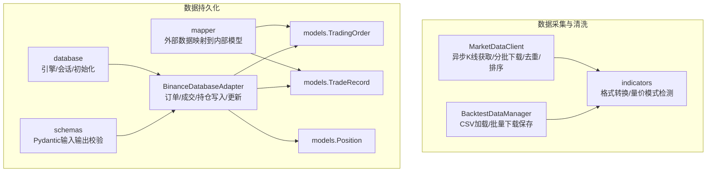
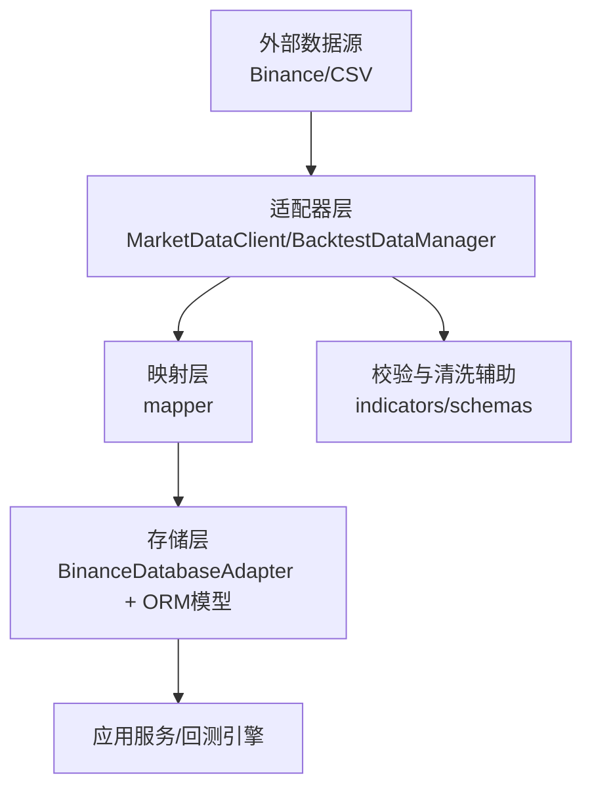
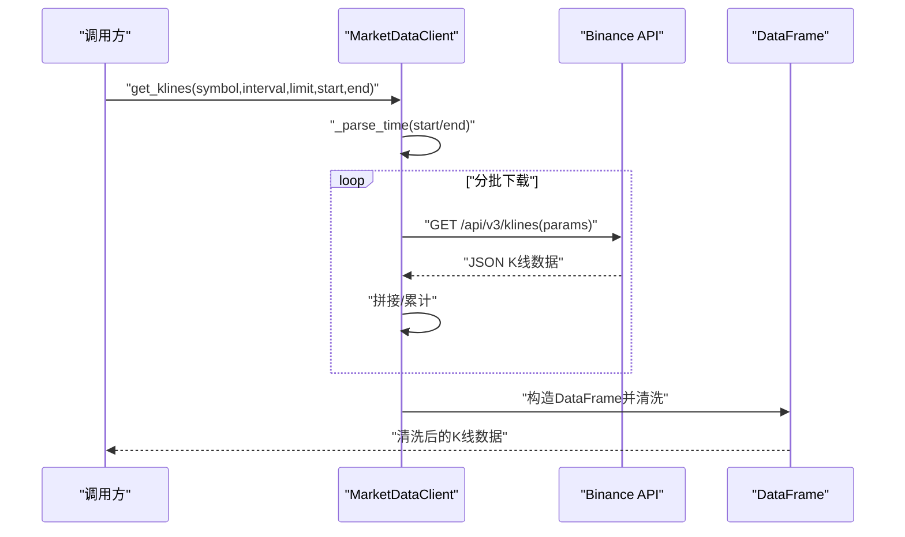
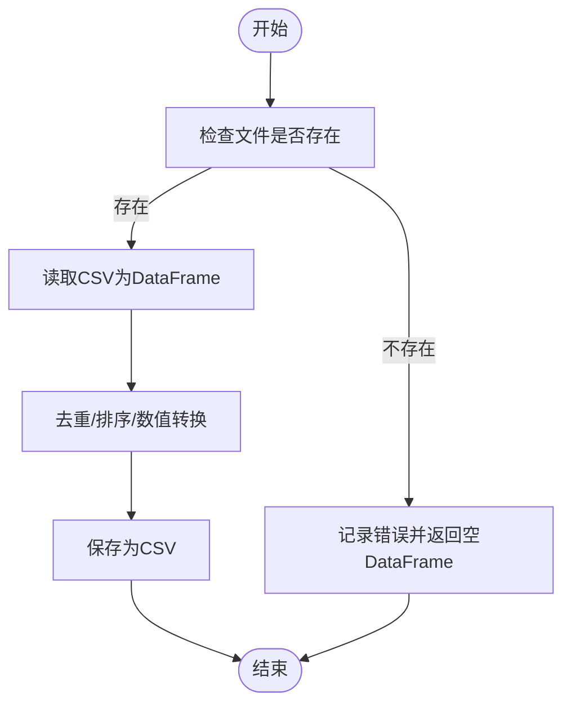
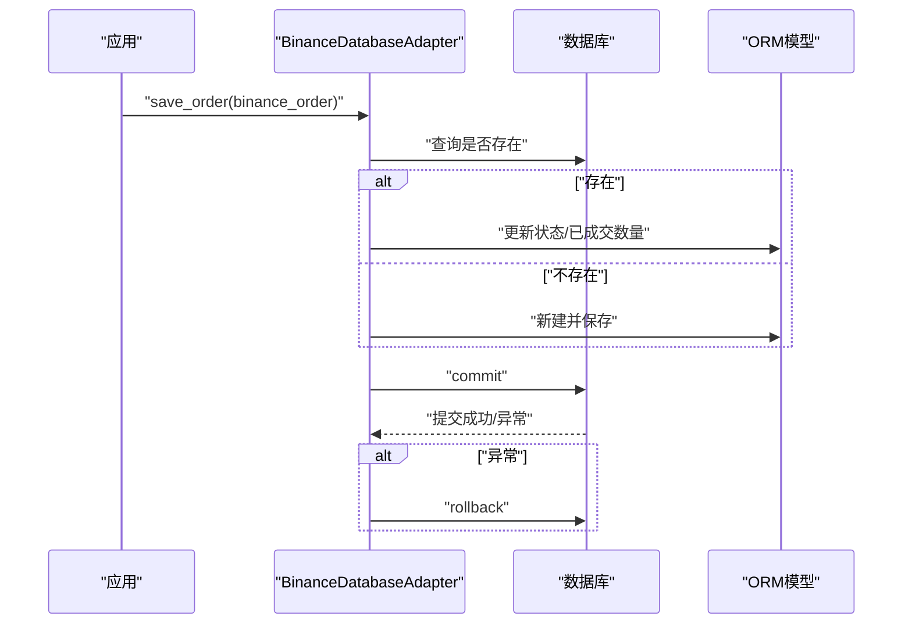
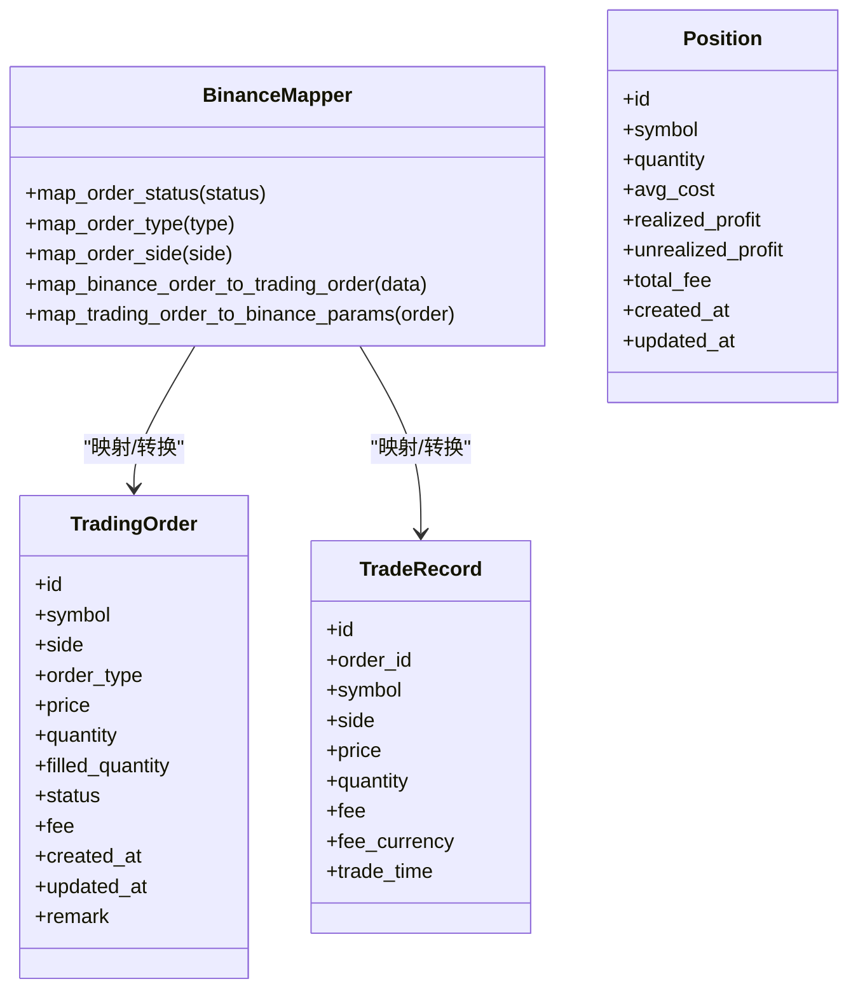
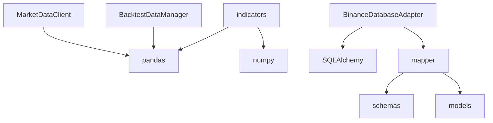

# 数据验证与清洗

<cite>
**本文引用的文件**
- [market_data.py](file://trading_system/data/market_data.py)
- [backtest_data.py](file://trading_system/data/backtest_data.py)
- [database_adapter.py](file://trading_system/binance/database_adapter.py)
- [database.py](file://trading_system/core/database.py)
- [indicators.py](file://trading_system/utils/indicators.py)
- [trading_order.py](file://trading_system/models/trading_order.py)
- [trade_record.py](file://trading_system/models/trade_record.py)
- [position.py](file://trading_system/models/position.py)
- [mapper.py](file://trading_system/binance/mapper.py)
- [schemas.py](file://trading_system/core/schemas.py)
</cite>

## 目录
1. [简介](#简介)
2. [项目结构](#项目结构)
3. [核心组件](#核心组件)
4. [架构总览](#架构总览)
5. [详细组件分析](#详细组件分析)
6. [依赖分析](#依赖分析)
7. [性能考虑](#性能考虑)
8. [故障排查指南](#故障排查指南)
9. [结论](#结论)
10. [附录](#附录)

## 简介
本技术文档面向“数据验证与清洗系统”，聚焦以下目标：
- 数据质量检查机制：异常值检测、缺失值处理、重复数据删除、格式标准化
- 时间序列清洗算法：按时间排序、去重、连续性校验与补齐
- 数据转换规则：单位换算、数值范围检查、格式统一
- 一致性验证与跨数据源同步：通过映射与适配器实现数据一致性
- 冲突解决策略：幂等写入、状态更新与事务回滚
- 质量监控指标、告警与自动修复：基于日志与异常处理的可观测性
- 配置选项、自定义规则与扩展接口：可插拔的数据适配层与映射层
- 实际问题案例与解决方案：以K线数据清洗为例，给出常见问题与对策

## 项目结构
本项目围绕“数据采集—清洗—存储—建模—回测”的闭环组织，其中与数据验证与清洗直接相关的模块如下：
- 数据采集与清洗
  - market_data.py：异步K线数据拉取、分批下载、去重与格式标准化
  - backtest_data.py：本地CSV回测数据加载与批量下载保存
  - indicators.py：K线格式转换、量价模式检测、技术指标计算（为清洗提供辅助）
- 数据持久化与一致性
  - database_adapter.py：订单/成交/持仓的数据库适配器，提供幂等写入与状态更新
  - database.py：数据库引擎与会话管理
  - models/*：ORM模型定义（订单、成交、持仓）
  - mapper.py：外部数据（如Binance）到内部模型的映射
  - schemas.py：Pydantic数据模型，用于API层输入输出校验
- 关键流程
  - K线数据清洗：时间解析、数值类型转换、重复剔除、排序
  - 数据入库：幂等更新、事务控制、错误回滚
  - 数据转换：统一时间戳、统一数值类型、统一列名

图表来源
- [market_data.py:12-241](file://trading_system/data/market_data.py#L12-L241)
- [backtest_data.py:9-137](file://trading_system/data/backtest_data.py#L9-L137)
- [indicators.py:109-167](file://trading_system/utils/indicators.py#L109-L167)
- [database_adapter.py:14-189](file://trading_system/binance/database_adapter.py#L14-L189)
- [database.py:12-45](file://trading_system/core/database.py#L12-L45)
- [mapper.py:15-110](file://trading_system/binance/mapper.py#L15-L110)
- [schemas.py:7-88](file://trading_system/core/schemas.py#L7-L88)
- [trading_order.py:26-43](file://trading_system/models/trading_order.py#L26-L43)
- [trade_record.py:8-22](file://trading_system/models/trade_record.py#L8-L22)
- [position.py:6-18](file://trading_system/models/position.py#L6-L18)

章节来源
- [market_data.py:12-241](file://trading_system/data/market_data.py#L12-L241)
- [backtest_data.py:9-137](file://trading_system/data/backtest_data.py#L9-L137)
- [indicators.py:109-167](file://trading_system/utils/indicators.py#L109-L167)
- [database_adapter.py:14-189](file://trading_system/binance/database_adapter.py#L14-L189)
- [database.py:12-45](file://trading_system/core/database.py#L12-L45)
- [mapper.py:15-110](file://trading_system/binance/mapper.py#L15-L110)
- [schemas.py:7-88](file://trading_system/core/schemas.py#L7-L88)
- [trading_order.py:26-43](file://trading_system/models/trading_order.py#L26-L43)
- [trade_record.py:8-22](file://trading_system/models/trade_record.py#L8-L22)
- [position.py:6-18](file://trading_system/models/position.py#L6-L18)

## 核心组件
- MarketDataClient：异步K线数据获取，支持分批下载、时间范围过滤、去重与排序；统一时间与数值类型；提供便捷函数封装
- BacktestDataManager：本地CSV回测数据加载与批量下载保存，统一数值类型与去重
- BinanceDatabaseAdapter：订单/成交/持仓的数据库适配器，提供幂等写入、状态更新、事务回滚
- 数据映射与模型：mapper将外部数据映射到内部模型；schemas进行输入输出校验；models定义表结构
- 技术指标与格式转换：indicators提供K线格式转换、量价模式检测等，辅助清洗与验证

章节来源
- [market_data.py:12-241](file://trading_system/data/market_data.py#L12-L241)
- [backtest_data.py:9-137](file://trading_system/data/backtest_data.py#L9-L137)
- [database_adapter.py:14-189](file://trading_system/binance/database_adapter.py#L14-L189)
- [mapper.py:15-110](file://trading_system/binance/mapper.py#L15-L110)
- [schemas.py:7-88](file://trading_system/core/schemas.py#L7-L88)
- [indicators.py:109-167](file://trading_system/utils/indicators.py#L109-L167)

## 架构总览
系统采用“适配器+映射+ORM”的分层设计：
- 适配器层：MarketDataClient、BacktestDataManager负责数据接入与清洗
- 映射层：mapper负责外部数据到内部模型的映射
- 存储层：BinanceDatabaseAdapter与ORM模型负责持久化与一致性
- 校验层：schemas与indicators提供输入校验与清洗辅助

图表来源
- [market_data.py:12-241](file://trading_system/data/market_data.py#L12-L241)
- [backtest_data.py:9-137](file://trading_system/data/backtest_data.py#L9-L137)
- [mapper.py:15-110](file://trading_system/binance/mapper.py#L15-L110)
- [database_adapter.py:14-189](file://trading_system/binance/database_adapter.py#L14-L189)
- [indicators.py:109-167](file://trading_system/utils/indicators.py#L109-L167)
- [schemas.py:7-88](file://trading_system/core/schemas.py#L7-L88)

## 详细组件分析

### MarketDataClient：K线数据获取与清洗
职责与流程
- 异步HTTP请求，支持分批下载，避免单次超限
- 时间解析：支持字符串与时间戳，统一转毫秒时间戳
- 数据清洗：去重（按open_time）、排序、数值类型转换（float）
- 返回标准化列：open_time、open、high、low、close、volume

图表来源
- [market_data.py:28-118](file://trading_system/data/market_data.py#L28-L118)
- [market_data.py:120-147](file://trading_system/data/market_data.py#L120-L147)

章节来源
- [market_data.py:28-118](file://trading_system/data/market_data.py#L28-L118)
- [market_data.py:120-147](file://trading_system/data/market_data.py#L120-L147)

### BacktestDataManager：本地CSV回测数据管理
职责与流程
- 加载CSV：路径存在性检查、读取失败保护
- 批量下载并保存：统一清洗逻辑（去重、排序、数值转换）
- 生成标准化文件名与保存路径

图表来源
- [backtest_data.py:22-45](file://trading_system/data/backtest_data.py#L22-L45)
- [backtest_data.py:72-131](file://trading_system/data/backtest_data.py#L72-L131)

章节来源
- [backtest_data.py:22-45](file://trading_system/data/backtest_data.py#L22-L45)
- [backtest_data.py:72-131](file://trading_system/data/backtest_data.py#L72-L131)

### BinanceDatabaseAdapter：数据一致性与事务控制
职责与流程
- 幂等写入：按主键查询，存在则更新状态与已成交数量，否则新增
- 事务回滚：异常时回滚并记录错误
- 订单状态更新：按ID更新状态与已成交数量
- 成交记录与持仓更新：统一数值转换与时间转换

图表来源
- [database_adapter.py:31-61](file://trading_system/binance/database_adapter.py#L31-L61)
- [database_adapter.py:76-97](file://trading_system/binance/database_adapter.py#L76-L97)
- [database_adapter.py:99-126](file://trading_system/binance/database_adapter.py#L99-L126)
- [database_adapter.py:128-161](file://trading_system/binance/database_adapter.py#L128-L161)

章节来源
- [database_adapter.py:31-61](file://trading_system/binance/database_adapter.py#L31-L61)
- [database_adapter.py:76-97](file://trading_system/binance/database_adapter.py#L76-L97)
- [database_adapter.py:99-126](file://trading_system/binance/database_adapter.py#L99-L126)
- [database_adapter.py:128-161](file://trading_system/binance/database_adapter.py#L128-L161)

### 数据映射与模型：外部数据到内部模型
- 映射器mapper：将外部状态/类型/方向映射到内部枚举，参数转换到下单参数
- ORM模型models：定义订单、成交、持仓的字段与约束
- Pydantic schemas：API层输入输出校验，确保数据结构与类型一致

图表来源
- [mapper.py:15-110](file://trading_system/binance/mapper.py#L15-L110)
- [trading_order.py:26-43](file://trading_system/models/trading_order.py#L26-L43)
- [trade_record.py:8-22](file://trading_system/models/trade_record.py#L8-L22)
- [position.py:6-18](file://trading_system/models/position.py#L6-L18)

章节来源
- [mapper.py:15-110](file://trading_system/binance/mapper.py#L15-L110)
- [trading_order.py:26-43](file://trading_system/models/trading_order.py#L26-L43)
- [trade_record.py:8-22](file://trading_system/models/trade_record.py#L8-L22)
- [position.py:6-18](file://trading_system/models/position.py#L6-L18)

### 技术指标与格式转换：清洗辅助
- K线格式转换：Binance API格式与DataFrame互转，统一时间与数值类型
- 量价模式检测：下跌/上涨阶段的量价关系统计与模式变化识别
- 辅助清洗：为后续一致性校验与回测提供标准化数据

章节来源
- [indicators.py:109-167](file://trading_system/utils/indicators.py#L109-L167)
- [indicators.py:226-297](file://trading_system/utils/indicators.py#L226-L297)
- [indicators.py:357-428](file://trading_system/utils/indicators.py#L357-L428)

## 依赖分析
- 组件耦合
  - MarketDataClient与indicators：前者提供清洗后的K线，后者提供格式转换与模式检测
  - BacktestDataManager与MarketDataClient：均依赖pandas进行清洗与保存
  - BinanceDatabaseAdapter与mapper/models/schemas：通过映射与校验保证数据一致性
- 外部依赖
  - aiohttp：异步HTTP请求
  - pandas/numpy：数据清洗与指标计算
  - SQLAlchemy：数据库访问与事务管理
  - ccxt（可选）：第三方交易所数据适配（懒加载）

图表来源
- [market_data.py:1-8](file://trading_system/data/market_data.py#L1-L8)
- [backtest_data.py:3-5](file://trading_system/data/backtest_data.py#L3-L5)
- [indicators.py:1-4](file://trading_system/utils/indicators.py#L1-L4)
- [database_adapter.py:4-9](file://trading_system/binance/database_adapter.py#L4-L9)
- [mapper.py:3-5](file://trading_system/binance/mapper.py#L3-L5)
- [schemas.py:1](file://trading_system/core/schemas.py#L1)
- [trading_order.py:1](file://trading_system/models/trading_order.py#L1)

章节来源
- [market_data.py:1-8](file://trading_system/data/market_data.py#L1-L8)
- [backtest_data.py:3-5](file://trading_system/data/backtest_data.py#L3-L5)
- [indicators.py:1-4](file://trading_system/utils/indicators.py#L1-L4)
- [database_adapter.py:4-9](file://trading_system/binance/database_adapter.py#L4-L9)
- [mapper.py:3-5](file://trading_system/binance/mapper.py#L3-L5)
- [schemas.py:1](file://trading_system/core/schemas.py#L1)
- [trading_order.py:1](file://trading_system/models/trading_order.py#L1)

## 性能考虑
- 异步I/O：使用aiohttp进行并发请求，降低等待时间
- 分批下载：按批次上限请求，避免单次超限与内存压力
- 去重与排序：在内存中完成，建议在大数据量场景下分块处理
- 数值类型转换：统一float，减少后续计算误差
- 数据库连接池：通过SQLAlchemy连接池与预热，提升并发写入效率
- 懒加载：ccxt适配器延迟初始化，避免不必要的资源占用

## 故障排查指南
常见问题与定位要点
- 网络/接口限制
  - 现象：请求失败或返回空数据
  - 排查：检查超时、限流与代理设置；查看日志中的错误信息
  - 参考：[market_data.py:71-96](file://trading_system/data/market_data.py#L71-L96)、[backtest_data.py:93-94](file://trading_system/data/backtest_data.py#L93-L94)
- 时间格式解析失败
  - 现象：无法解析start_time/end_time
  - 排查：确认传入格式是否符合支持的字符串/时间戳
  - 参考：[market_data.py:120-147](file://trading_system/data/market_data.py#L120-L147)
- 数据重复与乱序
  - 现象：open_time重复或时间不连续
  - 排查：确认去重与排序逻辑是否生效；检查上游数据是否正确
  - 参考：[market_data.py:113-114](file://trading_system/data/market_data.py#L113-L114)、[backtest_data.py:116-117](file://trading_system/data/backtest_data.py#L116-L117)
- 数据库写入异常
  - 现象：保存/更新失败或事务回滚
  - 排查：检查连接池配置、异常捕获与回滚逻辑
  - 参考：[database_adapter.py:58-61](file://trading_system/binance/database_adapter.py#L58-L61)、[database.py:24-34](file://trading_system/core/database.py#L24-L34)
- 映射错误
  - 现象：状态/类型/方向映射不正确
  - 排查：核对映射表与外部数据字段
  - 参考：[mapper.py:19-60](file://trading_system/binance/mapper.py#L19-L60)

章节来源
- [market_data.py:71-96](file://trading_system/data/market_data.py#L71-L96)
- [market_data.py:120-147](file://trading_system/data/market_data.py#L120-L147)
- [backtest_data.py:93-94](file://trading_system/data/backtest_data.py#L93-L94)
- [backtest_data.py:116-117](file://trading_system/data/backtest_data.py#L116-L117)
- [database_adapter.py:58-61](file://trading_system/binance/database_adapter.py#L58-L61)
- [database.py:24-34](file://trading_system/core/database.py#L24-L34)
- [mapper.py:19-60](file://trading_system/binance/mapper.py#L19-L60)

## 结论
本系统通过“适配器+映射+ORM”的分层设计，实现了从外部数据源到内部模型的高质量清洗与持久化。核心能力包括：
- 异步分批下载与清洗（去重、排序、类型转换）
- 幂等写入与事务回滚，保障一致性
- 映射与校验，确保数据结构与业务语义一致
- 量价模式检测与格式转换，为后续分析与回测提供可靠基础

## 附录

### 数据质量检查机制与清洗流程
- 缺失值处理：数值转换失败时降级为NaN，后续由上层逻辑决定填充或丢弃
- 重复数据删除：按open_time去重，保证时间序列唯一性
- 格式标准化：统一时间戳、数值类型与列名
- 异常值检测：结合技术指标与量价模式检测，识别异常波动区间

章节来源
- [market_data.py:110-114](file://trading_system/data/market_data.py#L110-L114)
- [backtest_data.py:119-120](file://trading_system/data/backtest_data.py#L119-L120)
- [indicators.py:226-297](file://trading_system/utils/indicators.py#L226-L297)
- [indicators.py:357-428](file://trading_system/utils/indicators.py#L357-L428)

### 数据转换规则、单位换算与范围检查
- 单位换算：统一时间单位（毫秒→datetime）、数值单位（字符串→float）
- 范围检查：通过映射与校验层约束枚举与数值范围
- 格式统一：列名与顺序统一，便于下游处理

章节来源
- [market_data.py:107-111](file://trading_system/data/market_data.py#L107-L111)
- [backtest_data.py:115-122](file://trading_system/data/backtest_data.py#L115-L122)
- [mapper.py:63-89](file://trading_system/binance/mapper.py#L63-L89)
- [schemas.py:7-88](file://trading_system/core/schemas.py#L7-L88)

### 一致性验证、跨数据源同步与冲突解决
- 一致性验证：通过ORM模型与Pydantic校验，确保字段与类型一致
- 跨数据源同步：统一映射与适配器，屏蔽外部差异
- 冲突解决：幂等写入与事务回滚，避免重复与脏数据

章节来源
- [database_adapter.py:31-61](file://trading_system/binance/database_adapter.py#L31-L61)
- [mapper.py:15-110](file://trading_system/binance/mapper.py#L15-L110)
- [schemas.py:7-88](file://trading_system/core/schemas.py#L7-L88)

### 质量监控指标、告警机制与自动修复
- 监控指标：数据条数、时间范围、重复率、类型转换成功率
- 告警机制：异常日志记录与错误上报
- 自动修复：重试分批下载、回滚事务、降级NaN处理

章节来源
- [market_data.py:71-96](file://trading_system/data/market_data.py#L71-L96)
- [database_adapter.py:58-61](file://trading_system/binance/database_adapter.py#L58-L61)

### 配置选项、自定义规则与扩展接口
- 配置项：数据库连接池大小、超时、预热等
- 自定义规则：可在mapper与indicators中扩展映射与检测逻辑
- 扩展接口：新增适配器类以支持新的数据源

章节来源
- [database.py:12-21](file://trading_system/core/database.py#L12-L21)
- [mapper.py:15-110](file://trading_system/binance/mapper.py#L15-L110)
- [indicators.py:109-167](file://trading_system/utils/indicators.py#L109-L167)

### 实际案例与解决方案
- 案例1：长时间跨度数据缺失
  - 现象：分批下载返回条数少于请求上限后提前结束
  - 解决：循环直到返回不足上限或到达结束时间
  - 参考：[market_data.py:59-92](file://trading_system/data/market_data.py#L59-L92)
- 案例2：CSV读取失败
  - 现象：文件不存在或读取异常
  - 解决：记录错误并返回空DataFrame，避免中断流程
  - 参考：[backtest_data.py:34-45](file://trading_system/data/backtest_data.py#L34-L45)
- 案例3：订单状态更新冲突
  - 现象：并发更新导致状态不一致
  - 解决：幂等写入与事务回滚，确保最终一致
  - 参考：[database_adapter.py:43-50](file://trading_system/binance/database_adapter.py#L43-L50)

章节来源
- [market_data.py:59-92](file://trading_system/data/market_data.py#L59-L92)
- [backtest_data.py:34-45](file://trading_system/data/backtest_data.py#L34-L45)
- [database_adapter.py:43-50](file://trading_system/binance/database_adapter.py#L43-L50)