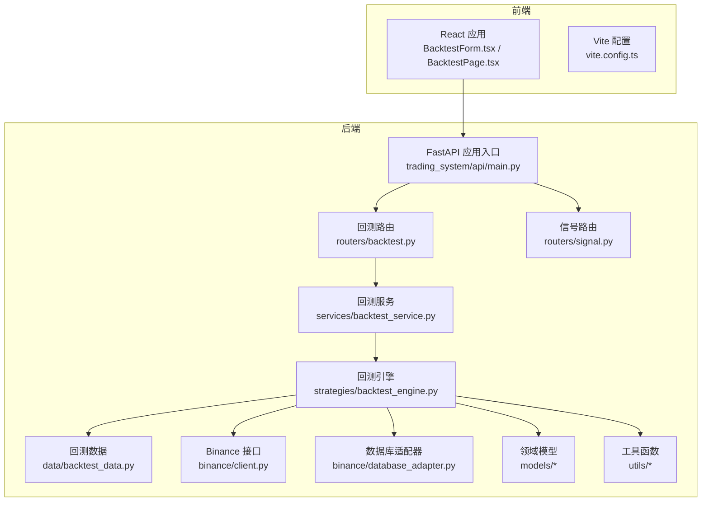
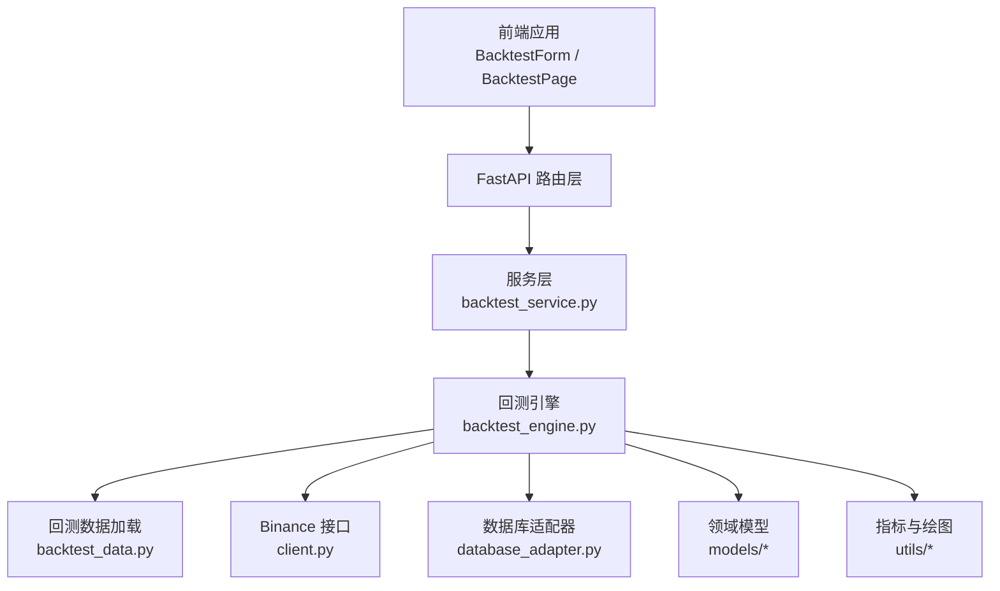
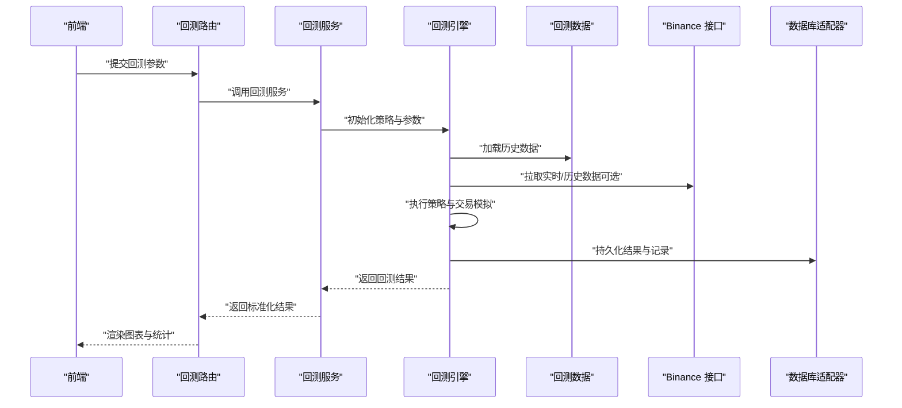
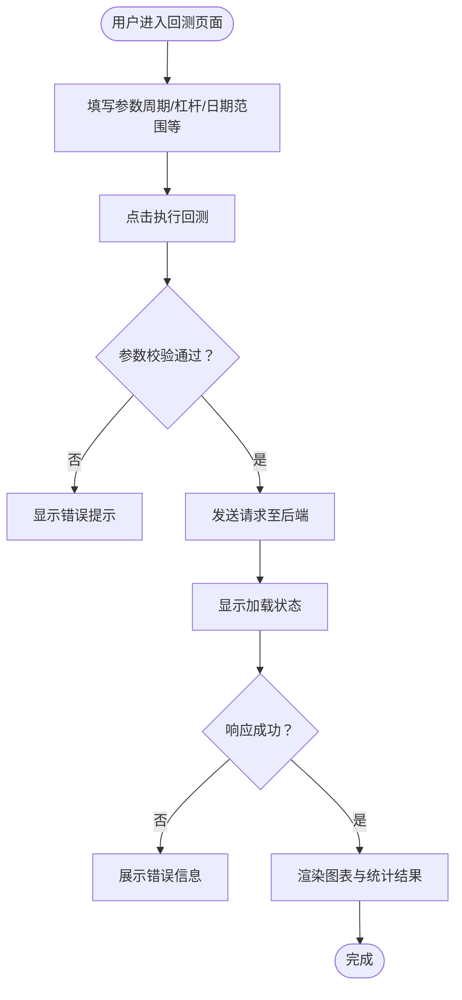
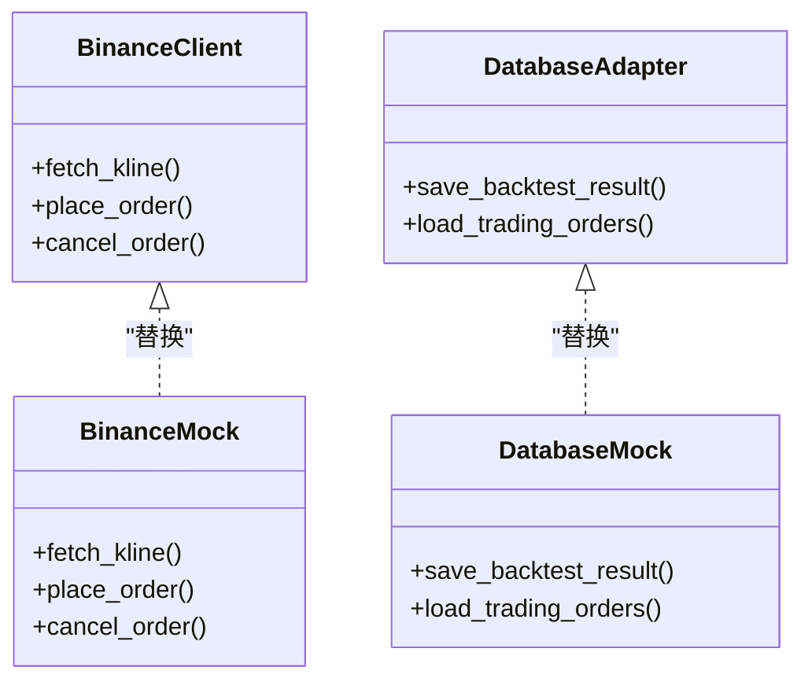
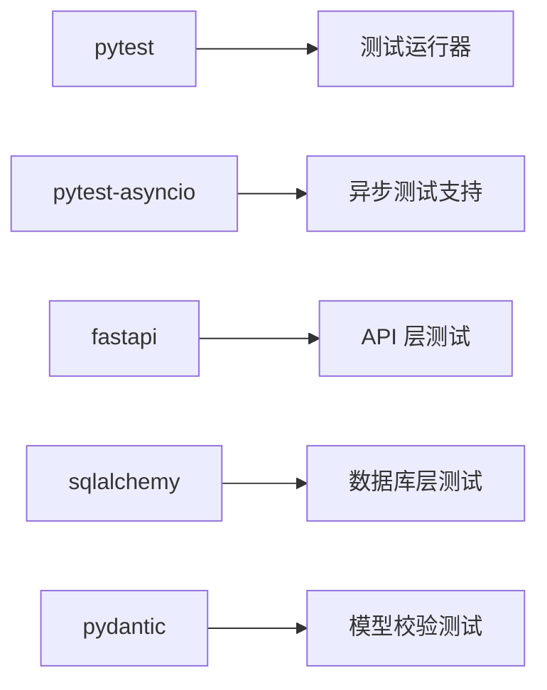

# 测试与质量保证

<cite>
**本文引用的文件**
- [README.md](file://README.md)
- [requirements.txt](file://requirements.txt)
- [main.py](file://main.py)
- [trading_system/api/main.py](file://trading_system/api/main.py)
- [trading_system/api/routers/backtest.py](file://trading_system/api/routers/backtest.py)
- [trading_system/api/routers/signal.py](file://trading_system/api/routers/signal.py)
- [trading_system/api/services/backtest_service.py](file://trading_system/api/services/backtest_service.py)
- [trading_system/data/backtest_data.py](file://trading_system/data/backtest_data.py)
- [trading_system/strategies/backtest_engine.py](file://trading_system/strategies/backtest_engine.py)
- [trading_system/binance/client.py](file://trading_system/binance/client.py)
- [trading_system/binance/database_adapter.py](file://trading_system/binance/database_adapter.py)
- [trading_system/models/trading_order.py](file://trading_system/models/trading_order.py)
- [trading_system/models/trade_record.py](file://trading_system/models/trade_record.py)
- [trading_system/models/position.py](file://trading_system/models/position.py)
- [trading_system/utils/indicators.py](file://trading_system/utils/indicators.py)
- [trading_system/utils/chan_plotter.py](file://trading_system/utils/chan_plotter.py)
- [.trae/specs/目录调整/tasks.md](file://.trae/specs/目录调整/tasks.md)
- [.trae/specs/verify_order/tasks.md](file://.trae/specs/verify_order/tasks.md)
- [.trae/specs/remove_redundant_code/tasks.md](file://.trae/specs/remove_redundant_code/tasks.md)
- [run_crypto_chan_backtest.py](file://run_crypto_chan_backtest.py)
- [run_ethusdc_mtf_backtest.py](file://run_ethusdc_mtf_backtest.py)
- [run_multi_indicator_backtest.py](file://run_multi_indicator_backtest.py)
- [log_config.py](file://log_config.py)
- [frontend/src/components/BacktestForm.tsx](file://frontend/src/components/BacktestForm.tsx)
- [frontend/src/pages/BacktestPage.tsx](file://frontend/src/pages/BacktestPage.tsx)
- [frontend/package.json](file://frontend/package.json)
- [frontend/vite.config.ts](file://frontend/vite.config.ts)
</cite>

## 目录
1. [引言](#引言)
2. [项目结构](#项目结构)
3. [核心组件](#核心组件)
4. [架构总览](#架构总览)
5. [详细组件分析](#详细组件分析)
6. [依赖分析](#依赖分析)
7. [性能考虑](#性能考虑)
8. [故障排查指南](#故障排查指南)
9. [结论](#结论)
10. [附录](#附录)

## 引言
本指南面向交易系统项目的测试与质量保证（QA）落地，覆盖单元测试、集成测试与性能测试的实施方法，明确测试框架选择、测试用例设计与测试数据准备，给出代码覆盖率、静态分析与代码审查流程建议，并提供持续集成配置思路、自动化测试与质量门禁建议。同时总结测试最佳实践、调试技巧与性能优化建议，解释测试环境搭建与测试数据管理策略。

## 项目结构
该项目采用前后端分离与模块化分层架构：
- 后端基于 FastAPI，包含 API 路由、服务层与数据访问层；
- 交易策略与回测引擎位于 strategies 与 backtest 子目录；
- 前端为 React/Vite 应用，提供可视化界面；
- 测试相关文档与规范以 .trae/specs 形式沉淀；
- 依赖管理通过 requirements.txt 统一声明。

图表来源
- [trading_system/api/main.py](file://trading_system/api/main.py)
- [trading_system/api/routers/backtest.py](file://trading_system/api/routers/backtest.py)
- [trading_system/api/routers/signal.py](file://trading_system/api/routers/signal.py)
- [trading_system/api/services/backtest_service.py](file://trading_system/api/services/backtest_service.py)
- [trading_system/data/backtest_data.py](file://trading_system/data/backtest_data.py)
- [trading_system/strategies/backtest_engine.py](file://trading_system/strategies/backtest_engine.py)
- [trading_system/binance/client.py](file://trading_system/binance/client.py)
- [trading_system/binance/database_adapter.py](file://trading_system/binance/database_adapter.py)
- [trading_system/models/trading_order.py](file://trading_system/models/trading_order.py)
- [trading_system/utils/indicators.py](file://trading_system/utils/indicators.py)
- [frontend/src/components/BacktestForm.tsx](file://frontend/src/components/BacktestForm.tsx)
- [frontend/src/pages/BacktestPage.tsx](file://frontend/src/pages/BacktestPage.tsx)

章节来源
- [README.md:1-150](file://README.md#L1-L150)
- [requirements.txt:1-64](file://requirements.txt#L1-L64)

## 核心组件
- FastAPI 应用入口与路由：提供回测与信号等 API 入口，便于端到端集成测试。
- 回测服务与引擎：封装回测逻辑、数据加载与可视化生成，是性能测试与回归测试的关键目标。
- Binance 接口与数据库适配器：负责历史数据与实盘数据交互，需重点进行隔离与模拟。
- 前端组件：BacktestForm 与 BacktestPage 提供用户输入与结果展示，适合端到端测试与可视化回归。
- 测试规范与任务：.trae/specs 中的任务与验收标准可直接转化为测试流程与质量门禁。

章节来源
- [trading_system/api/main.py](file://trading_system/api/main.py)
- [trading_system/api/routers/backtest.py](file://trading_system/api/routers/backtest.py)
- [trading_system/api/routers/signal.py](file://trading_system/api/routers/signal.py)
- [trading_system/api/services/backtest_service.py](file://trading_system/api/services/backtest_service.py)
- [trading_system/strategies/backtest_engine.py](file://trading_system/strategies/backtest_engine.py)
- [trading_system/binance/client.py](file://trading_system/binance/client.py)
- [trading_system/binance/database_adapter.py](file://trading_system/binance/database_adapter.py)
- [.trae/specs/verify_order/tasks.md](file://.trae/specs/verify_order/tasks.md)

## 架构总览
下图展示了从前端到后端、再到数据与外部接口的测试视角架构，强调可测试性与隔离点。

图表来源
- [frontend/src/components/BacktestForm.tsx](file://frontend/src/components/BacktestForm.tsx)
- [frontend/src/pages/BacktestPage.tsx](file://frontend/src/pages/BacktestPage.tsx)
- [trading_system/api/routers/backtest.py](file://trading_system/api/routers/backtest.py)
- [trading_system/api/services/backtest_service.py](file://trading_system/api/services/backtest_service.py)
- [trading_system/strategies/backtest_engine.py](file://trading_system/strategies/backtest_engine.py)
- [trading_system/data/backtest_data.py](file://trading_system/data/backtest_data.py)
- [trading_system/binance/client.py](file://trading_system/binance/client.py)
- [trading_system/binance/database_adapter.py](file://trading_system/binance/database_adapter.py)
- [trading_system/models/trading_order.py](file://trading_system/models/trading_order.py)
- [trading_system/utils/indicators.py](file://trading_system/utils/indicators.py)

## 详细组件分析

### 回测引擎与服务（核心测试对象）
回测引擎与服务是测试与质量保证的重点，涉及数据加载、策略执行、结果统计与可视化生成。建议围绕以下维度设计测试：
- 单元测试：策略函数、指标计算、数据转换、模型序列化。
- 集成测试：服务层到引擎层的数据流、外部接口调用（Binance）、数据库写入。
- 性能测试：不同时间粒度与数据规模下的执行时延、内存占用。

图表来源
- [trading_system/api/routers/backtest.py](file://trading_system/api/routers/backtest.py)
- [trading_system/api/services/backtest_service.py](file://trading_system/api/services/backtest_service.py)
- [trading_system/strategies/backtest_engine.py](file://trading_system/strategies/backtest_engine.py)
- [trading_system/data/backtest_data.py](file://trading_system/data/backtest_data.py)
- [trading_system/binance/client.py](file://trading_system/binance/client.py)
- [trading_system/binance/database_adapter.py](file://trading_system/binance/database_adapter.py)

章节来源
- [trading_system/api/services/backtest_service.py](file://trading_system/api/services/backtest_service.py)
- [trading_system/strategies/backtest_engine.py](file://trading_system/strategies/backtest_engine.py)
- [trading_system/data/backtest_data.py](file://trading_system/data/backtest_data.py)

### 前端组件（UI 与交互测试）
前端组件 BacktestForm 与 BacktestPage 提供用户输入与结果展示，适合进行端到端测试与可视化回归：
- 表单校验与默认值；
- 请求发送与错误处理；
- 图表渲染与交互反馈；
- 可视化回归（截图对比）。

图表来源
- [frontend/src/components/BacktestForm.tsx](file://frontend/src/components/BacktestForm.tsx)
- [frontend/src/pages/BacktestPage.tsx](file://frontend/src/pages/BacktestPage.tsx)

章节来源
- [frontend/src/components/BacktestForm.tsx](file://frontend/src/components/BacktestForm.tsx)
- [frontend/src/pages/BacktestPage.tsx](file://frontend/src/pages/BacktestPage.tsx)

### 外部接口与数据库（隔离与模拟）
Binance 接口与数据库适配器是易变且难以本地复现的外部依赖，应通过以下方式保障测试稳定性：
- 使用 Mock 或 Fake 实现替换真实网络请求；
- 使用内存数据库或测试专用数据库实例；
- 对关键路径增加超时与重试策略，并在测试中验证异常分支。

图表来源
- [trading_system/binance/client.py](file://trading_system/binance/client.py)
- [trading_system/binance/database_adapter.py](file://trading_system/binance/database_adapter.py)

章节来源
- [trading_system/binance/client.py](file://trading_system/binance/client.py)
- [trading_system/binance/database_adapter.py](file://trading_system/binance/database_adapter.py)

### 测试用例设计与数据准备
- 单元测试：针对策略函数、指标计算、模型序列化与反序列化进行边界与异常场景覆盖。
- 集成测试：围绕服务到引擎的数据流、外部接口调用与数据库写入进行端到端验证。
- 性能测试：以不同数据规模与时间粒度评估执行时延与资源消耗，识别瓶颈。
- 测试数据：使用历史 CSV 文件作为回测数据源；对实时接口使用 Mock 数据；对数据库使用测试专用实例或事务回滚。

章节来源
- [trading_system/data/backtest_data.py](file://trading_system/data/backtest_data.py)
- [trading_system/strategies/backtest_engine.py](file://trading_system/strategies/backtest_engine.py)
- [run_ethusdc_mtf_backtest.py](file://run_ethusdc_mtf_backtest.py)
- [run_multi_indicator_backtest.py](file://run_multi_indicator_backtest.py)

## 依赖分析
项目测试相关依赖集中在 pytest、pytest-asyncio、FastAPI、SQLAlchemy、Pydantic 等，建议在 CI 中统一安装并固定版本，确保测试一致性。

图表来源
- [requirements.txt:1-64](file://requirements.txt#L1-L64)

章节来源
- [requirements.txt:1-64](file://requirements.txt#L1-L64)

## 性能考虑
- 回测性能：优先使用向量化计算与缓存机制；对大规模数据采用分批处理与增量写库；避免在热路径中进行重复 IO。
- API 性能：对高频接口启用连接池与并发限制；在测试中模拟高并发场景，观察响应时间与吞吐量。
- 前端性能：对图表渲染进行节流与虚拟化；在 CI 中引入性能回归阈值。

## 故障排查指南
- 回测失败：检查历史数据完整性与时间范围；确认参数合法性；查看日志定位具体阶段。
- API 错误：核对路由路径与请求体格式；验证鉴权与限流策略；在测试中模拟错误码与超时。
- 前端异常：捕获并上报错误边界；在测试中覆盖典型交互路径与异常分支。
- 配置问题：依据 .trae 规范中的“配置修复”清单逐项验证；确保系统能正确加载配置。

章节来源
- [.trae/specs/verify_order/tasks.md:43-56](file://.trae/specs/verify_order/tasks.md#L43-L56)
- [.trae/specs/目录调整/tasks.md:54-66](file://.trae/specs/目录调整/tasks.md#L54-L66)
- [.trae/specs/remove_redundant_code/tasks.md:46-78](file://.trae/specs/remove_redundant_code/tasks.md#L46-L78)

## 结论
通过明确测试框架与流程、强化单元与集成测试、建立性能测试与可视化回归、完善静态分析与代码审查，并结合 .trae 规范形成质量门禁，可显著提升交易系统的稳定性与可维护性。建议在 CI 中自动化执行测试套件与质量检查，确保每次变更均满足既定门槛。

## 附录

### 测试框架与工具选择
- 单元测试：pytest + pytest-asyncio（支持异步协程）。
- 集成测试：pytest + FastAPI TestClient 或 httpx。
- 性能测试：pytest-benchmark 或 locust（按需）。
- 静态分析：flake8、pylint、mypy（类型检查）。
- 代码覆盖率：pytest-cov（报告 HTML/Coverage）。
- 前端测试：Jest + React Testing Library（如需扩展）。

章节来源
- [requirements.txt:1-64](file://requirements.txt#L1-L64)

### 测试用例设计要点
- 输入域覆盖：边界值、空值、非法字符、超长字符串。
- 业务流程：正向流程、异常分支、回滚与补偿。
- 并发与容错：超时、重试、熔断、降级。
- 可观测性：日志级别、错误码、追踪 ID。

### 测试数据管理
- 历史数据：使用 CSV 文件作为基准数据集；在测试中固定随机种子以保证可重复性。
- 实时接口：使用 Mock 返回稳定数据；对关键接口录制快照用于回归。
- 数据库：使用独立测试库或容器；在测试前后清理或回滚。

### 持续集成与质量门禁（建议）
- 触发条件：push/pr 自动触发基础测试；夜间全量回归。
- 必须通过：单元测试 + 覆盖率阈值（如 80%+）+ 静态分析无阻断。
- 可选通过：集成测试 + 性能回归阈值。
- 质量门禁：未达阈值禁止合并；失败邮件/消息通知。

### 最佳实践与调试技巧
- 小步提交，短周期反馈；每个 PR 至少包含对应测试。
- 使用参数化测试覆盖多场景；使用 fixture 管理共享资源。
- 在本地与 CI 使用一致的 Python 版本与依赖锁定。
- 对关键路径增加日志与埋点，便于定位问题。